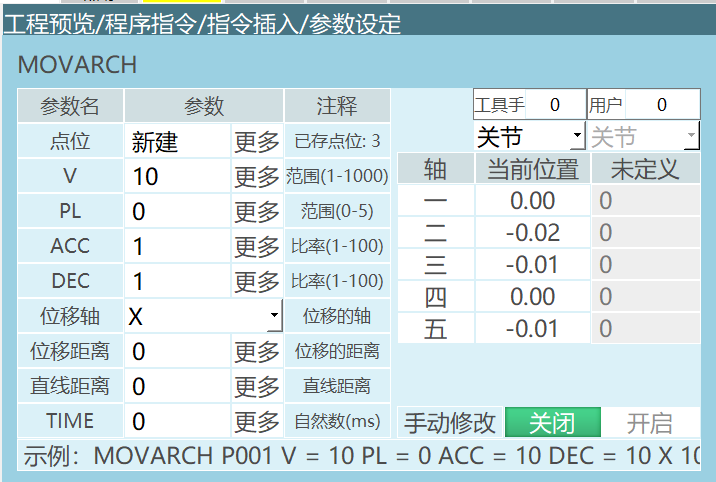
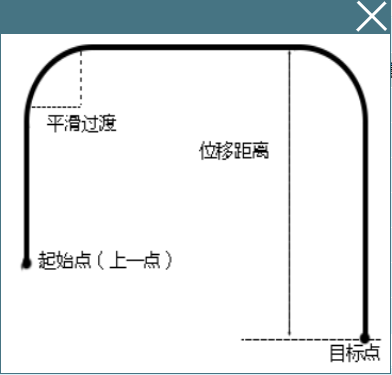
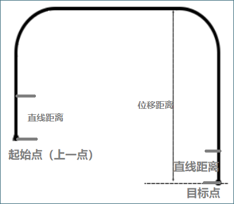
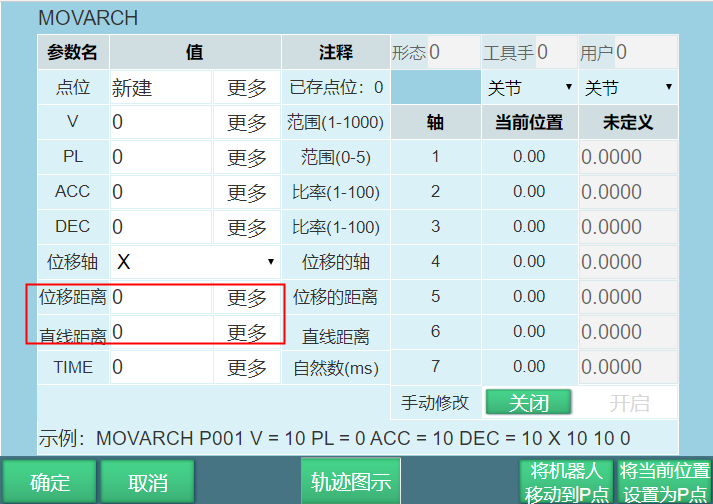
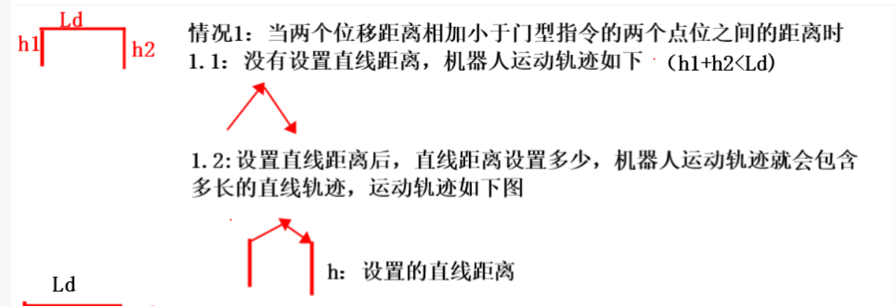
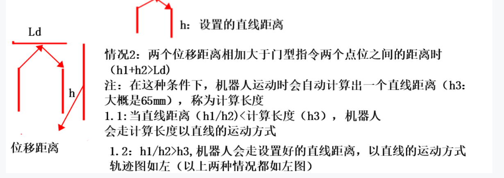

---

# 门型指令使用文档

## 环境

scara机器人，标准门型运动轨迹参数：

- 高度 ：25mm（在Z轴方向的位移距离）
- 宽度 ：300mm

## 位置

指令->运动控制类 -> 门型运动

## 参数

详细参数见下方图示：

| 按参数名 | 描述说明 |
| :--- | :--- |
|P/G | 使用局部位置变量（P）或全局位置变量（G）。当值为“新建”时，插入该指令则新建一个P变量，并将机器人的当前位置记录到该P变量。|
|V |运动速度，范围1-1000（默认笛卡尔参数最大速度为1000，范围根据实际填写的笛卡尔参数变化），单位为mm/s。|
| PL | 平滑过渡等级，范围0-5。|
| ACC | 加速度比率，范围1-100，单位为百分比。|
| DEC | 减速度比率，范围1-100，单位为百分比。|
| 位移轴 |（X,Y,Z）门型运动时进行位移的轴，标准门型运动位移的是Z轴方向。|
| 位移距离 | 需要在位移轴上位移的距离，标准门型运动是在Z轴上位移25mm。|
| TIME | 时间，范围非负整数，单位ms。提前时间执行下一条指令。|

注意，当修改直线指令的速度时，加减速度以及加减速度会与速度成1：10的倍数关系自动显示，如需修改加减速度以及加减速度，可手动操作。

## 使用方法

- 新建一个工程文件,然后点击打开>插入>运动控制类>门型运动。
- 示例：

MOVARCH P0001 V=100mm/s PL=5 ACC=10 DEC=10 Z 25 0

- 说明：

门型支持单步和试运行；

门型指令新建直线距离。

- 门型轨迹图示

参数介绍：+

直线距离（如下图所示）：保证机器人走的位移距离有一段距离是以直线的方式走的（即为门型上升起始和下降末端之间的一段竖直运动的距离）。

使用方法：直线距离不能大于位移距离；直线距离范围是：[0,5000]（单位：mm）。

Ld是门型运动的起始点和目标点位之间的距离。

h1、h2分别是两端的位移距离。

L：计算长度（从运动开始，机器人的轨迹一定走的是直线，直到走完这个计算长度）。

情况分为两种：

h1+h2<Ld两端位移距离之和小于两个门型指令点位的距离时）。

直线距离设置为多少，机器人就会以直线的轨迹运行多少。

h1+h2>Ld(当 (两端位移距离之和大于两个门型指令点位的距离时，机器人会自动计算出一个L（计算长度）))

直线距离小于计算长度，机器人以直线的轨迹走计算长度

直线距离大于计算长度，机器人以直线的轨迹走直线距离的长度

---

## AI 检索专用问答对 (Q&A for Retrieval)

**Q: 标准门型运动轨迹的高度和宽度参数分别是多少？**

A: 高度25mm，宽度300mm。

**Q：门型运动过程中如何以快速平滑过渡？**

A：设置PL可以平滑完成以更快的速度完成门型运动。

