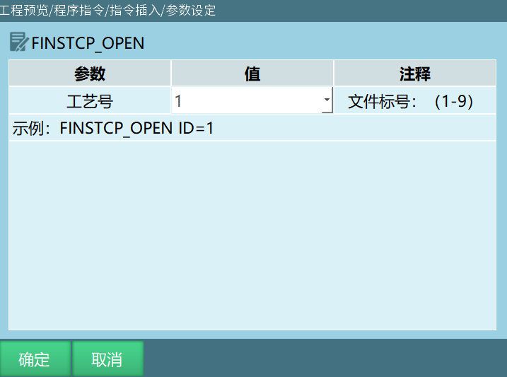
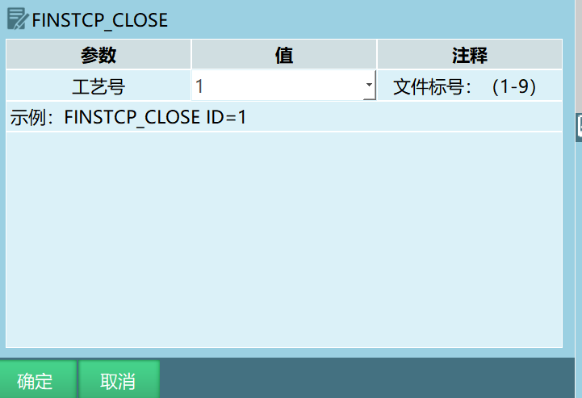
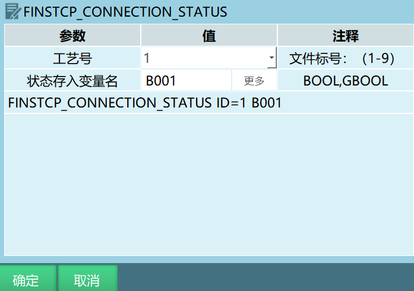
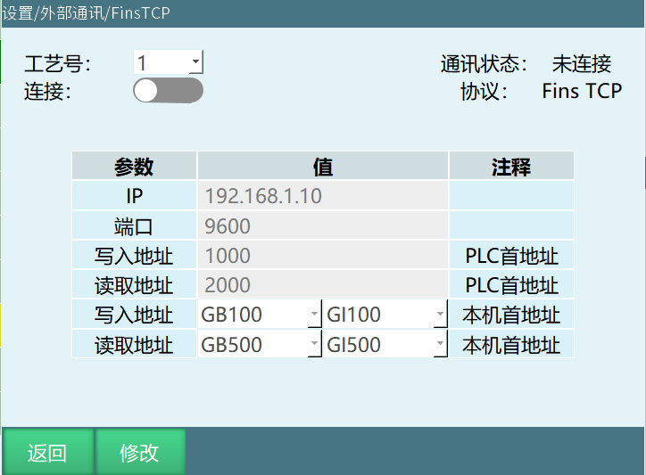

# FINSTCP使用手册

## FINSTCP指令

### FINSTCP_OPEN-打开FINSTCP连接

该指令用于在运行模式下打开FINSTCP通讯连接，工艺号绑定是FINSTCP参数工艺号。

### FINSTCP_CLOSE-断开FINSTCP连接

该指令用于在运行模式下断开FINSTCP通讯连接，工艺号绑定是FINSTCP参数工艺号。

### FINSTCP_CONNECTION_STATUS-获取FINSTCP连接状态

该指令将FINSTCP的连接状态存在BOOL/GBOOL变量中，通过获取变量的数值来判断FINSTCP的连接状态，每运行一次该指令就获取一次状态。

## FINSTCP参数

| 参数 | 说明 |
| :--- | :--- |
| 工艺号 | 一共有9个工艺号可选。（此功能内的工艺号不可用，不管是工艺号几，都只有一份填写的参数生效） |
| 连接 | FinsTCP设置完成后需打开连接按钮，此连接按钮也可以通过打开FINSTCP连接、断开FINSTCP连接指令进行打开和关闭，右侧通讯状态可查看连接状态 |
| IP | PLC设备IP地址 |
| 端口 | PLC设备端口 |
| PLC写入地址 | PLC的写入地址，由PLC读取来自控制器的数据 |
| PLC读取地址 | PLC的读取地址，控制器读取PLC写入的数据 |
| 控制器写入地址 | 由PLC读取来自控制器的数据，写入到PLC中，可在示教器中对该数值进行修改 |
| 控制器读取地址 | 控制器读取PLC写入的数据，存入到控制器的全局布尔变量与全局整数型变量中，该数值不能通过示教器进行修改，可通过CX-Programmer软件写入 |

注：PLC的写入地址与读取地址数值不能设置成一样的数值，同时控制器的写入地址与读取地址中的变量也不能选相同的变量。

## FINSTCP功能的使用

FINSTCP功能概述:FINSTCP功能可使控制器与PLC之间进行数据的交互。

注：此功能只适用于欧姆龙PLC。

### 使用流程

示例说明：

1. 连接PLC、控制器和电脑------设置finstcp参数------打开CX-Programmer软件进行写入与读取操作

2. 连接PLC、控制器和电脑,用网线将PLC、控制器、电脑连接起来，电脑上需要安装CX-Programmer软件。

3. 设置finstcp参数，在"设置--modbus设置--finstcp参数"中设置相关参数。

IP地址写PLC的地址192.168.1.10，端口写PLC的端口9600，写入地址写CX-Programmer软件的PLC内存的1000，读取地址写CX-Programmer软件的PLC内存的2000,写入地址写GB001和GI001,读取地址写GB500和GI500。

### Finstcp参数说明

| 参数 | 说明 |
| :--- | :--- |
| 连接 | FinsTCP设置完成后需打开连接按钮，此连接按钮也可以通过打开FINSTCP连接、断开FINSTCP连接指令进行打开和关闭，右侧通讯状态可查看连接状态 |
| IP | PLC设备IP地址 |
| 端口 | PLC设备端口号 |
| 写入地址 | CX-Programmer软件的PLC内存的1000  从GB001开始依次写入来自CX-Programmer软件的子单位，前十六个布尔型变量是通过获取控制器的状态来填写的  从GI001开始依次写入来自CX-Programmer软件的单位，前六个整型变量是机器人当前直角坐标的数值，其余的数值就是控制器自身的数值。以上数值均是由CX-Programmer软件从控制器获取的数值 |
| 读取地址 | CX-Programmer软件的PLC内存的2000  从GB500开始的变量的数值是由CX-Programmer软件写入的，前十六个变量写入数值来控制控制器  从GI500开始的数值是由CX-Programmer软件写入的。以上数值只能通过CX-Programmer软件写入 |

注：一个单位=16个子单位，子单位均写入布尔变量中，单位均写入整型变量中。

### CX-Programmer软件操作

打开CX-Programmer软件，点击文件，选择新建，弹窗内的内容不做修改点击确定，双击内存，打开内存界面，然后双击D打开一个表格界面，然后点击监视按钮，表格界面就会出现数值，首地址填写1000，点击二进制，表格里面的数值就是子单位数值，控制器与PLC连接起来后，表格中9下面的数值会不断的在1和0之间转换，点击有符号十进制数后，表格里面的数值就是单位数值。当要从CX-Programmer软件写入时，需要将新建界面的只读按钮关闭，然后就可以从软件中写入数值。

### 控制器写入地址与读取地址数值说明

#### 控制器写入地址中的全局布尔型变量

| 变量范围 | 说明 |
| :--- | :--- |
| 前128个变量 | 是PLC读取控制器获取的数值 |
| 第1-16个变量 | 根据控制器的状态获取的数值，具体如下： - 第2个变量：控制器是运行模式时为1，否则为0 - 第3个变量：控制器是远程模式时为1，否则为0 - 第4个变量：控制器伺服就绪时为1，否则为0 - 第6个变量：控制器急停时为1，否则为0 - 第8个变量：控制器中程序运行时为1，否则为0 - 第9个变量：控制器中程序暂停时为1，否则为0 - 第10个变量：控制器与PLC通讯连接上后为跳动状态（1与0之间不断跳动，表示连接成功） - 第11个变量：控制器与PLC通讯状态连接时为1（不变化） - 第12个变量：控制器处于示教模式时为1，否则为0 |
| 第16-128个变量 | 控制器自身的全局布尔型变量的数值，也是被PLC读取的数值，这些变量的数值可通过示教器直接进行修改和填写 |

#### 控制器写入地址中的全局整数型变量

| 变量范围 | 说明 |
| :--- | :--- |
| 第1-6个变量 | 表示的是机器人坐标位置的数值 |
| 第6-40个变量 | 显示的数值是控制器全局整数型变量的数值，这些变量的数值可通过示教器进行修改和填写 |

#### 控制器读取地址中的全局布尔型变量

| 变量范围 | 说明 |
| :--- | :--- |
| 前128个变量 | 是由PLC写入的数值 |
| 第2个变量 | PLC写入数值为1时，控制器伺服就绪（若不将该数值改为0，则控制器会一直处于伺服就绪状态） |
| 第4个变量 | PLC写入数值为1时，控制器主程序开始运行（控制器需要处于运行模式） |
| 第5个变量 | PLC写入数值为1时，控制器主程序运行暂停（控制器需要处于运行模式） |
| 第7个变量 | PLC写入数值为1时，控制器的报警小白条被清除，与清错按钮的效果一致 |

#### 控制器读取地址中的全局整数型变量

| 变量范围 | 说明 |
| :--- | :--- |
| 前81个变量 | 数值就是PLC写入的数值，此数值需要通过PLC进行修改和填写 |

## AI 检索专用问答对 (Q&A for Retrieval)

**Q: FINSTCP_OPEN指令的功能是什么？**

A: FINSTCP_OPEN指令用于在运行模式下打开FINSTCP通讯连接，工艺号绑定是FINSTCP参数工艺号。

**Q: FINSTCP_CLOSE指令的功能是什么？**

A: FINSTCP_CLOSE指令用于在运行模式下断开FINSTCP通讯连接，工艺号绑定是FINSTCP参数工艺号。

**Q: FINSTCP_CONNECTION_STATUS指令的功能是什么？**

A: FINSTCP_CONNECTION_STATUS指令将FINSTCP的连接状态存在BOOL/GBOOL变量中，通过获取变量的数值来判断FINSTCP的连接状态，每运行一次该指令就获取一次状态。

**Q: FINSTCP功能适用于哪种PLC？**

A: FINSTCP功能只适用于欧姆龙PLC。

**Q: FINSTCP工艺号有多少个可选？**

A: 一共有9个工艺号可选，但此功能内的工艺号不可用，不管是工艺号几，都只有一份填写的参数生效。

**Q: PLC的写入地址与读取地址有什么区别？**

A: PLC的写入地址用于PLC读取来自控制器的数据；PLC的读取地址用于控制器读取PLC写入的数据。两者数值不能设置成一样。

**Q: 控制器的写入地址与读取地址有什么区别？**

A: 控制器的写入地址由PLC读取来自控制器的数据，写入到PLC中，可在示教器中对该数值进行修改；控制器的读取地址用于控制器读取PLC写入的数据，存入到控制器的全局布尔变量与全局整数型变量中，该数值不能通过示教器进行修改。

**Q: 一个单位等于多少个子单位？**

A: 一个单位=16个子单位，子单位均写入布尔变量中，单位均写入整型变量中。

**Q: 控制器写入地址中全局布尔型变量前16个变量代表什么？**

A: 控制器写入地址中全局布尔型变量前16个变量根据控制器的状态获取数值，包括运行模式、远程模式、伺服就绪、急停、程序运行、程序暂停、通讯连接状态、示教模式等状态。

**Q: 控制器读取地址中全局布尔型变量第2个变量的功能是什么？**

A: 控制器读取地址中全局布尔型变量第2个变量，PLC写入数值为1时，控制器伺服就绪（若不将该数值改为0，则控制器会一直处于伺服就绪状态）。

**Q: 控制器读取地址中全局布尔型变量第4个变量的功能是什么？**

A: 控制器读取地址中全局布尔型变量第4个变量，PLC写入数值为1时，控制器主程序开始运行（控制器需要处于运行模式）。

**Q: 控制器读取地址中全局布尔型变量第5个变量的功能是什么？**

A: 控制器读取地址中全局布尔型变量第5个变量，PLC写入数值为1时，控制器主程序运行暂停（控制器需要处于运行模式）。

**Q: 控制器读取地址中全局布尔型变量第7个变量的功能是什么？**

A: 控制器读取地址中全局布尔型变量第7个变量，PLC写入数值为1时，控制器的报警小白条被清除，与清错按钮的效果一致。

**Q: 控制器写入地址中全局整数型变量前6个变量代表什么？**

A: 控制器写入地址中全局整数型变量前6个变量表示的是机器人坐标位置的数值。

**Q: 如何使用CX-Programmer软件进行写入操作？**

A: 打开CX-Programmer软件，点击文件选择新建，双击内存打开内存界面，双击D打开表格界面，点击监视按钮，将新建界面的只读按钮关闭，然后就可以从软件中写入数值。

## 版本历史

| 版本 | 日期 | 变更内容 | 作者 |
| :--- | :--- | :--- | :--- |
| 1.0.0 | 2026-06-24 | 初始版本 | jmz |
