# OPC-UA参数

## 服务端

### 环境准备

| 步骤 | 操作说明 |
| :--- | :--- |
| 1 | 安装软件UaExpert |
| 2 | 安装完成后打开软件，出现界面后随便输入信息点击"OK" |
| 3 | 界面启动，准备连接server |
| 4 | 连接server，格式为opc.tcp//服务器ip地址：端口号 |
| 5 | 出现open62541-based OPC UA Application（opc.tcp），点击左侧">"符号展开，等待出现server后双击 |
| 6 | 点击连接服务器 |
| 7 | 连接成功 |

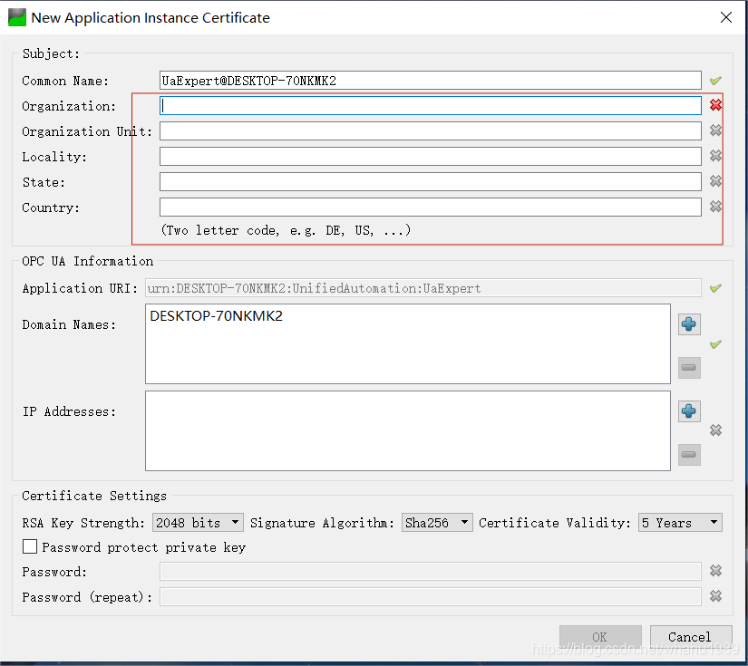

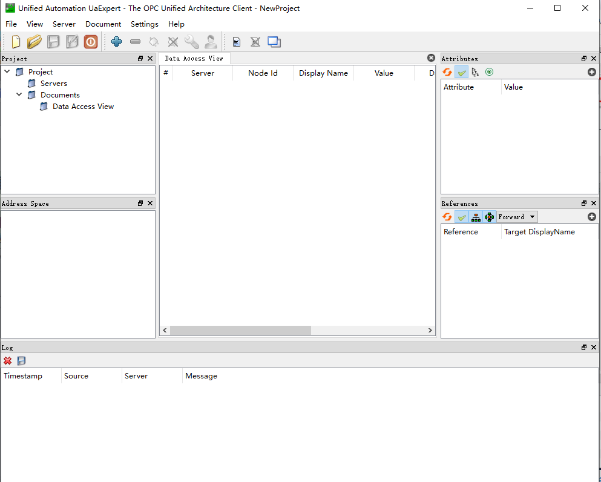

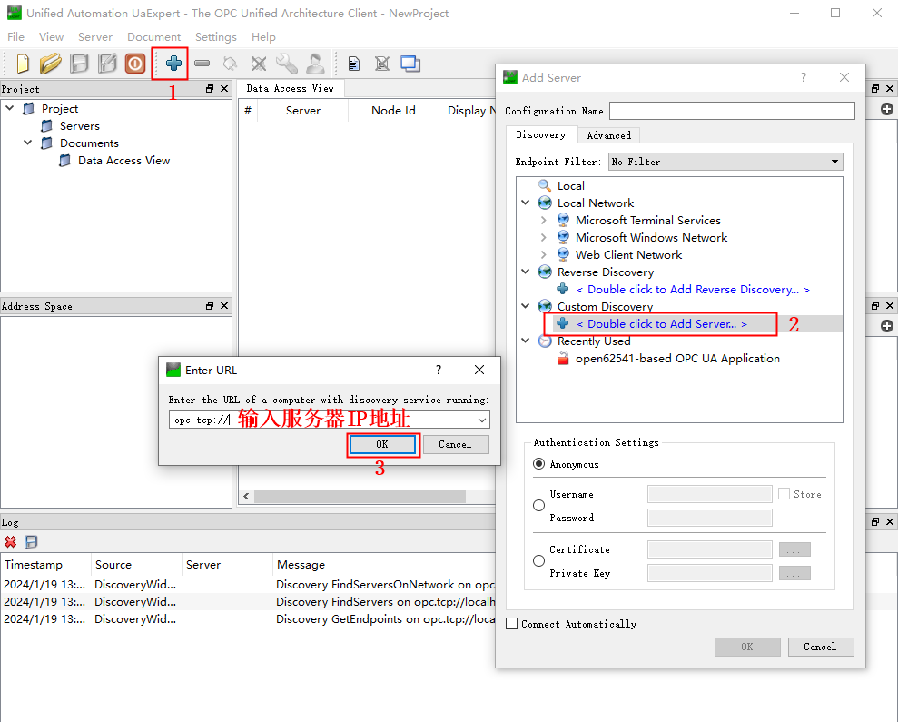

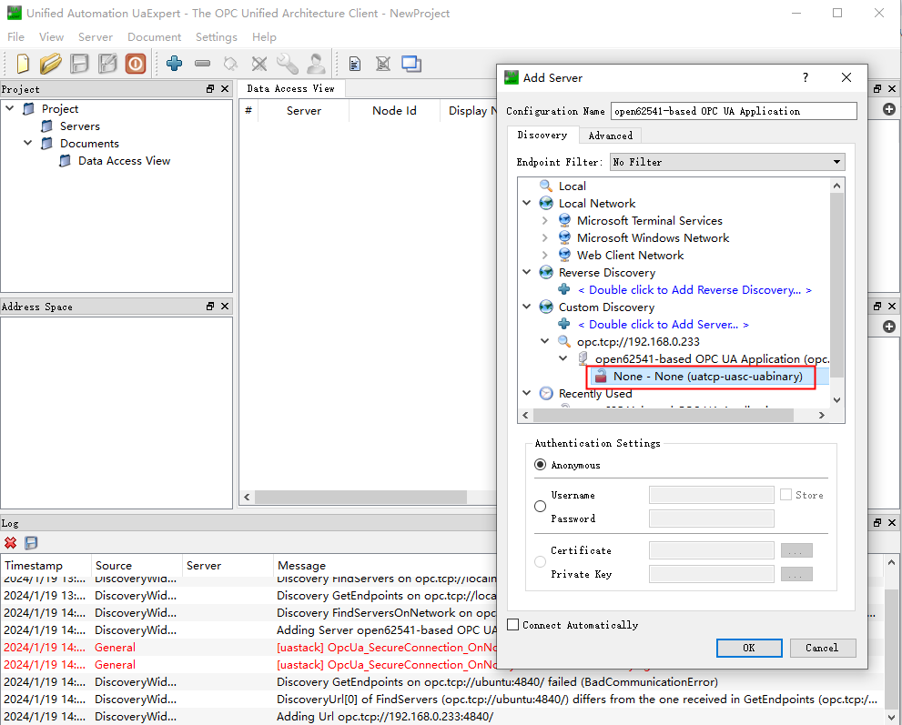

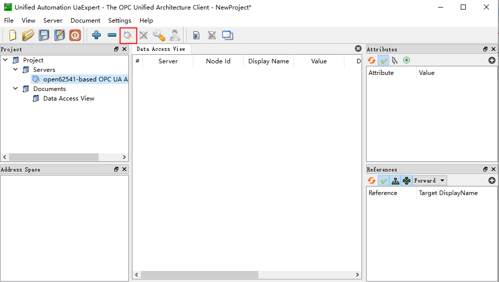

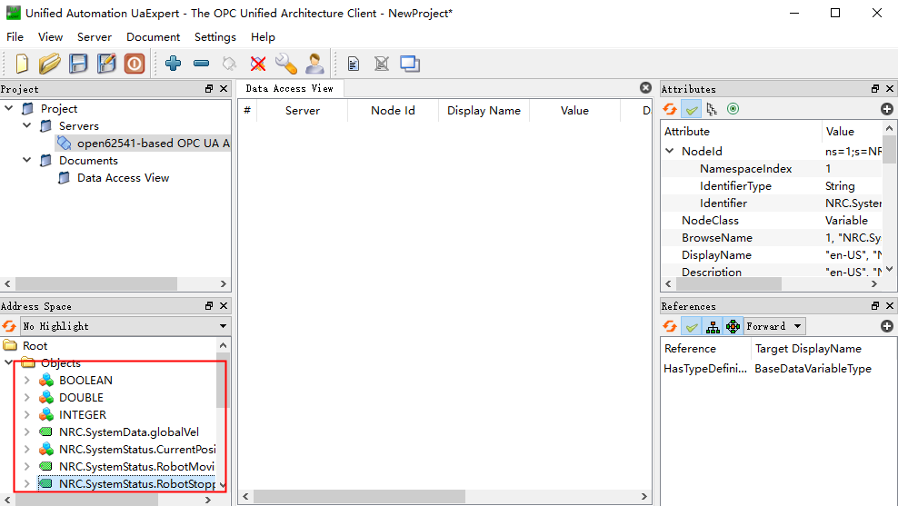

### OPC-UA参数

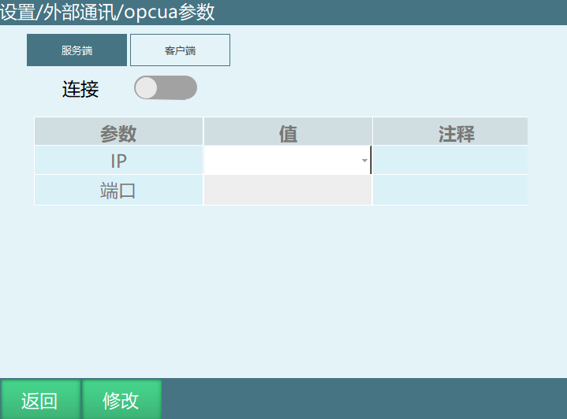

| 参数 | 说明 |
| :--- | :--- |
| 连接 | 连接服务器 |
| IP | 当前所连接的控制器IP |
| 端口 | 通讯端口 |

## 读写参数

控制器和UaExpert软件连接成功后将绿色标签拖入右侧进行读写，需要修改或者读取某个参数，可将对应的文件拖动到右侧区域修改。

例如：修改全局速度参数为23%。

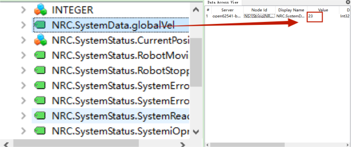

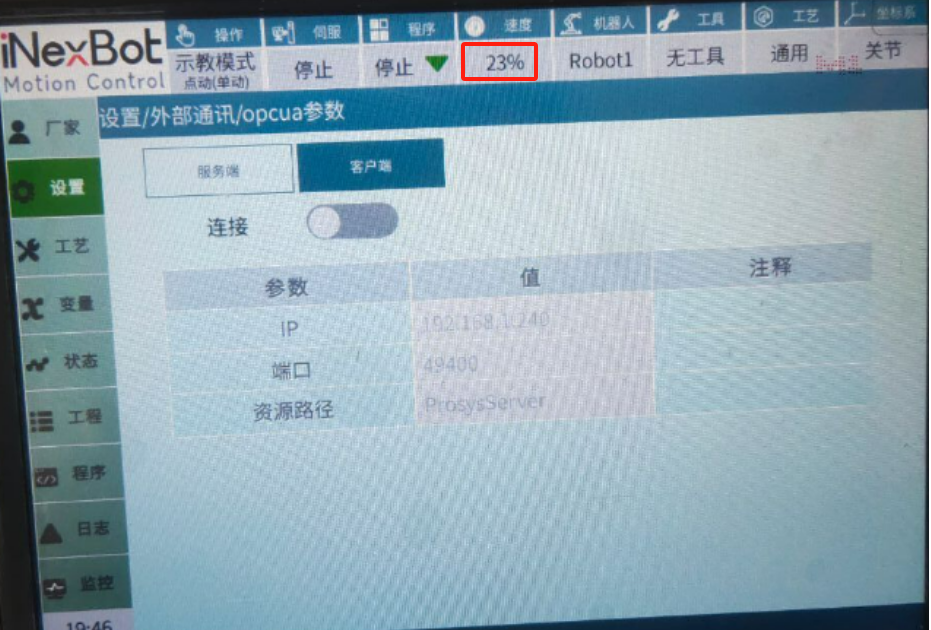

## 客户端

### 环境准备

| 步骤 | 操作说明 |
| :--- | :--- |
| 1 | 安装软件Prosys-OPCUA-Simulation-Server |
| 2 | 打开prosys-opc-ua-simulation软件，按照设置完成后关闭软件重新打开（localhost即windows本机ip地址） |
| 3 | 添加变化的节点，以下操作以GI001为例。添加节点时Namespace所填IP为本机IP |
| 4 | 设置节点value自动变化，然后观察示教器中对应的全局变量是否改变 |
| 5 | 添加节点后在示教器上查看对应变量的值在变化 |

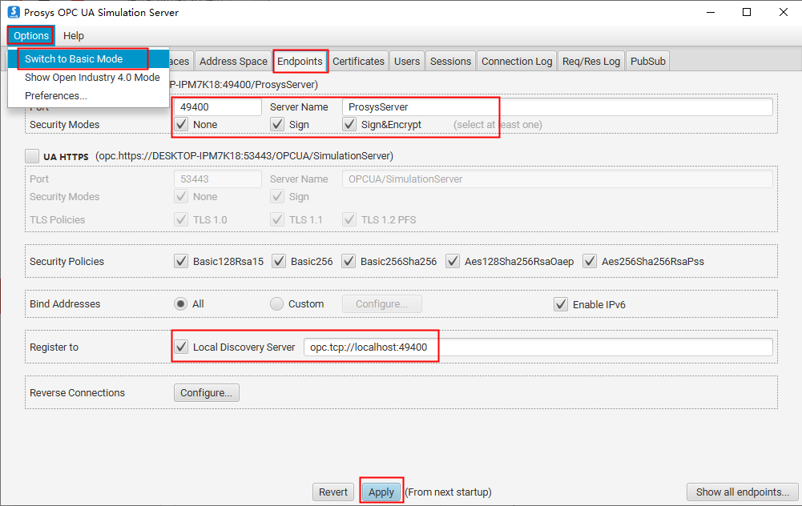

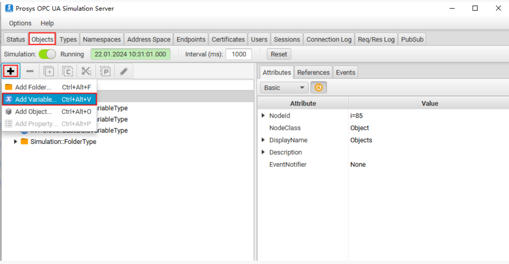

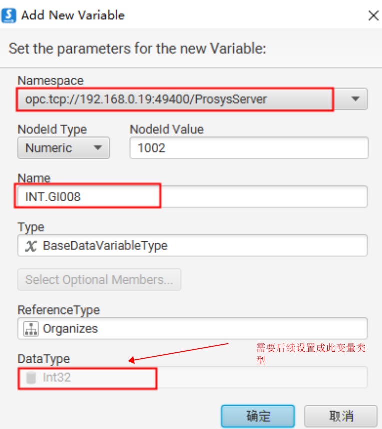

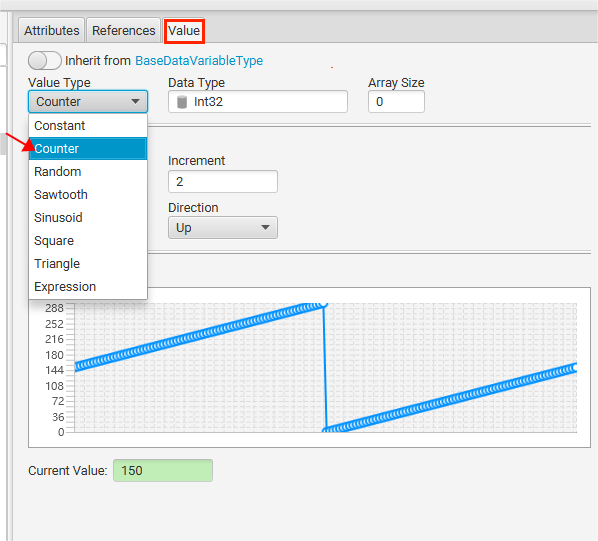

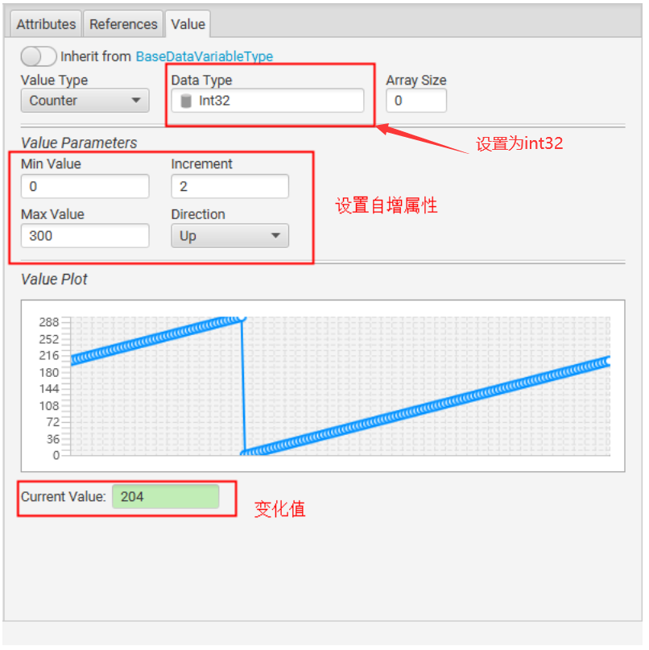

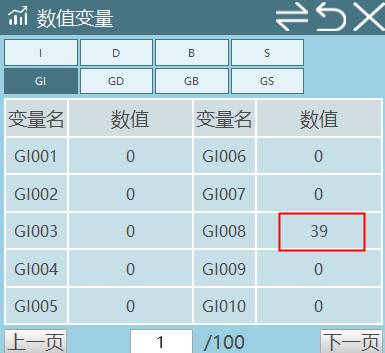

### 注意事项

| 序号 | 说明 |
| :--- | :--- |
| 1 | 如果想要测试其他数值是否可以读写，添加新的节点，不要在已有的基础上直接修改节点名，会导致一个节点被同时写 |
| 2 | Bool类型可以设置Min Value为0，Max Value为1，Increment为1 |
| 3 | String类型的变量可以设置为自增长读取字符串（Value Type选择Counter），也可设置为常量然后手动输入其他字符（Value Type选择Constat，Initial Value定义的变量值） |

### 节点格式说明

| 节点格式 | 节点类型 | 绑定内容 |
| :--- | :--- | :--- |
| BOOL.GB001-999 | Boolean | 全局变量GB001-GB999 |
| INT.GI001-999 | Int32 | 全局变量GI001-GI999 |
| DOUBLE.GD001-999 | Double | 全局变量GD001-GD999 |
| STRING.GS001-999 | String | 全局变量GS001-GS999 |
| NRC.SystemData.GlobalSpeed | Int32 | 全局速度 |

### OPC-UA参数

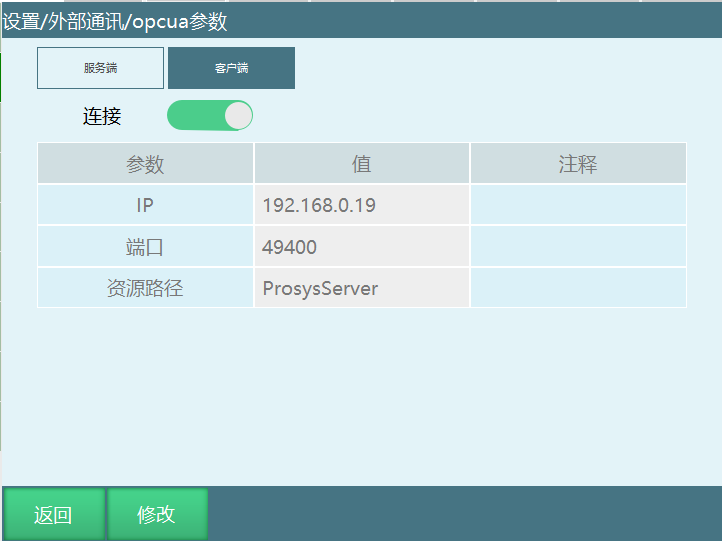

注意：不论是客户端、服务器连接和关闭时都需要重启系统才会生效。

## AI 检索专用问答对 (Q&A for Retrieval)

**Q: OPC-UA服务端需要安装什么软件？**

A: OPC-UA服务端需要安装UaExpert软件。

**Q: 如何连接OPC-UA服务器？**

A: 连接server的格式为opc.tcp//服务器ip地址：端口号。

**Q: OPC-UA参数中连接按钮的作用是什么？**

A: 连接按钮用于连接服务器。

**Q: OPC-UA参数中IP表示什么？**

A: IP表示当前所连接的控制器IP。

**Q: OPC-UA参数中端口表示什么？**

A: 端口表示通讯端口。

**Q: 如何在UaExpert软件中读写参数？**

A: 控制器和UaExpert软件连接成功后将绿色标签拖入右侧进行读写，需要修改或者读取某个参数，可将对应的文件拖动到右侧区域修改。

**Q: OPC-UA客户端需要安装什么软件？**

A: OPC-UA客户端需要安装Prosys-OPCUA-Simulation-Server软件。

**Q: localhost表示什么？**

A: localhost即windows本机ip地址。

**Q: 添加节点时Namespace应填写什么？**

A: 添加节点时Namespace所填IP为本机IP。

**Q: 测试其他数值是否可以读写时应注意什么？**

A: 如果想要测试其他数值是否可以读写，添加新的节点，不要在已有的基础上直接修改节点名，会导致一个节点被同时写。

**Q: Bool类型的变量如何设置？**

A: Bool类型可以设置Min Value为0，Max Value为1，Increment为1。

**Q: String类型的变量有哪些设置方式？**

A: String类型的变量可以设置为自增长读取字符串（Value Type选择Counter），也可设置为常量然后手动输入其他字符（Value Type选择Constat，Initial Value定义的变量值）。

**Q: BOOL.GB001-999节点格式对应的绑定内容是什么？**

A: BOOL.GB001-999节点格式对应绑定全局变量GB001-GB999，节点类型为Boolean。

**Q: INT.GI001-999节点格式对应的绑定内容是什么？**

A: INT.GI001-999节点格式对应绑定全局变量GI001-GI999，节点类型为Int32。

**Q: 客户端和服务器连接和关闭时需要注意什么？**

A: 不论是客户端、服务器连接和关闭时都需要重启系统才会生效。

## 版本历史

| 版本 | 日期 | 变更内容 | 作者 |
| :--- | :--- | :--- | :--- |
| 1.0.0 | 2026-06-24 | 初始版本 | qiuzegai |
