---
title: "人机协作"
description: "介绍人机协作功能的使用方法"
author: "tongmengyuan123"
date: "2026-07-02"
tags: ["人机协作","碰撞检测","拖拽示教","动力学辨识"]
category: "操作手册"
version: "1.0.0"
language: "zh-CN"
---

# 人机协作

本章主要介绍动力学的作用以及如何使用。因为机器人的复杂非线性、时变不确定性、强耦合性(特别是在高速运动时)，要使机器人能以期望的速度和加速度运动，机器人各关节伺服电机必须有足够大的力和力矩来驱动机器人的连杆和关节。否则，连杆将因运动迟缓而影响机器人的定位和轨迹跟踪精度，为此必须建立基于动力学模型的前馈力矩控制。从而实时快速地计算前馈补偿力矩。

人机协作（HRC）指的是人和自动化机器共享工作空间并同时进行作业的工作。

## 机器人辨识

1.  在使用力学功能之前首先需要设置好动力学参数，使控制器建立机器人的动力学模型。

2.  设置动力学参数需进入"设置/功能参数/人机协作/动力学参数"，在进入辨识界面前，需要仔细阅读辨识的相关注意事项。机器人进行轨迹测试时，范围和速度应由小到大设置，逐渐确定一个不会碰到周围环境前提下的最大轨迹范围值。再把轨迹速度设置为100，就可以开始辨识。辨识过程中除必要情况不要操作示教器，人员需远离机器人。若需要停止辨识，可以通过点击示教盒上的停止、按下急停按钮或切换模式来停止机器人。

### 参数说明

工艺号：新增工艺号1-9下拉框，点击修改可以修改工艺号。

注释：对应工艺号可填写注释用于区分。

轨迹范围：根据轨迹范围计算出机器人最大最小运动范围。

轨迹速度：机器人在运行时的速度，与全局速度无关。

当前轨迹Z最大值/当前轨迹Z最小值：表示了当前轨迹Z的范围。

辨识误差：辨识后会出现六个参数分别代表六个轴的误差（值越小说明误差越小且不能为0）。

**警告**

目前该辨识方法仅适用于六轴机器人空载情况下辨识机器人本体的动力学参数。

该辨识方法辨识所得的动力学参数与手填的动力学参数无关。

执行辨识前请确保机器人的运动范围内空旷，无障碍物。

辨识轨迹参数中，轨迹范围用于调节机器人的辨识轨迹的范围大小，100为辨识轨迹的100%，90为辨识轨迹的90%，以此类推。轨迹速度用于调节机器人执行辨识轨迹时的速度大小。

辨识轨迹参数选取原则：在确保安全的情况下使得运动范围尽可能大，运动速度尽可能快。

辨识结果所得到的误差数值对应于碰撞检测功能中的灵敏度数值。

辨识前应先进行轨迹测试。先试用低速小范围，若机器人可能与周围发生碰撞，则减小轨迹范围参数，若还有空余，则逐渐调大轨迹范围参数，直至确定一个不会发生碰撞前提下的最大轨迹范围值。此时把轨迹速度设置为100，点击辨识按钮开始执行辨识。

测试轨迹安全时，机器人会运行两段轨迹，机器人测试结束前请勿靠近机器人，机器人可能随时会启动。

辨识工作共执行三次，包括运行轨迹，获得数据，分析数据，计算动力学参数等过程，并在每一次完成后把误差数值显示在界面上，辨识期间请勿进行任何操作以免影响辨识工作。

### 辨识操作步骤

点击【设置/功能参数/人机协作/动力学参数】，进入动力学参数界面，仔细阅读提示说明，完整的看完提示说明后，点击"已阅读且同意"，点击"开始辨识"。

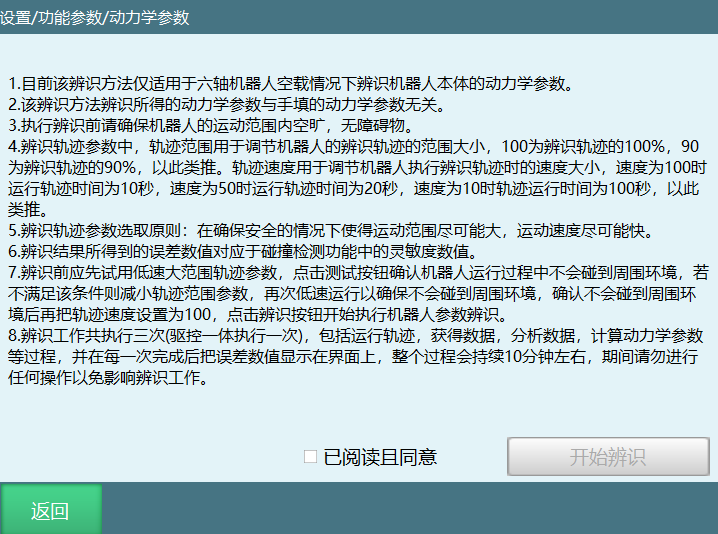

\...\.....

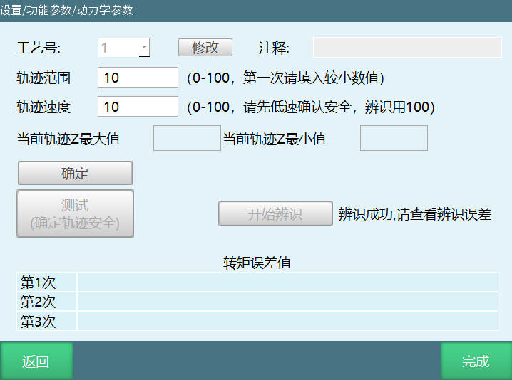

1.  进入辨识操作界面后，填写轨迹范围和轨迹速度。

2.  点击"确定"，查看当前轨迹Z最大值、当前轨迹Z最小值，查看范围是否合理，确认轨迹可到达方可操作下一步。

3.  点击"测试（确定轨迹安全）"，弹出测试提示窗，点击"确定"后如果报错（机器人位置不在零点）请先将机器人移至零点位置，然后再次点击"测试（确定轨迹安全）"。

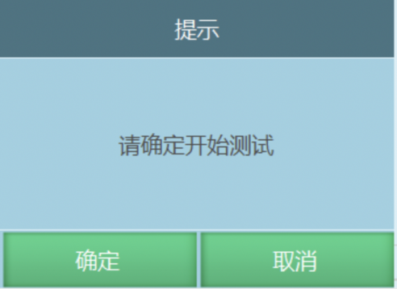

4.  轨迹测试完成后提示测试成功。

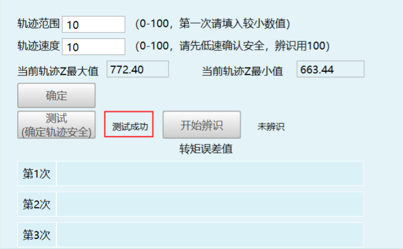

5.  若轨迹范围较小，可调大轨迹范围，原则上轨迹范围越大，辨识的准确性越高。

轨迹测试完成后就可以开始辨识，在保证安全的基础上使其轨迹范围达到最大，轨迹速度调整为100后即可开始辨识，点击"开始辨识"，如下图所示：

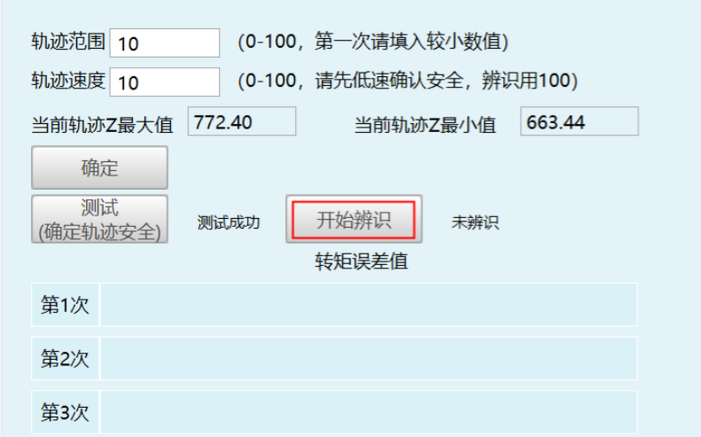

再次确认轨迹安全，人员远离机器人，点击确定，如图。

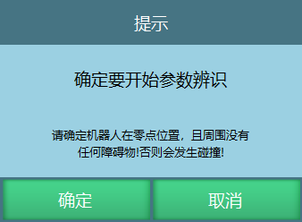

弹窗提示辨识中，在提示辨识结束之前请勿靠近机器人。机器人有可能随时运行下一段轨迹。

机器人三次辨识结束后会将计算后每个轴的转矩误差值填在表格。

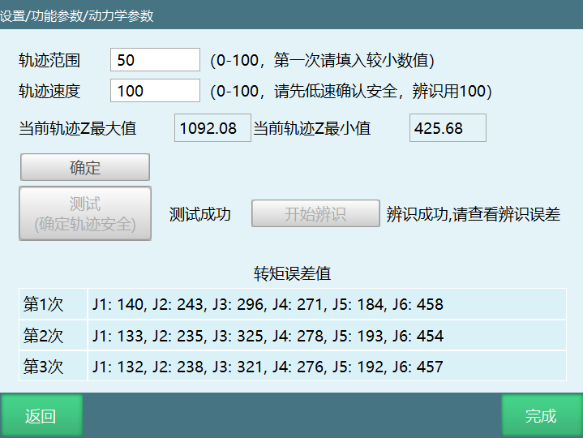

## 力学功能

力学功能包括碰撞检测功能，需要进入"设置/功能参数/人机协作/力学功能中进行设置。

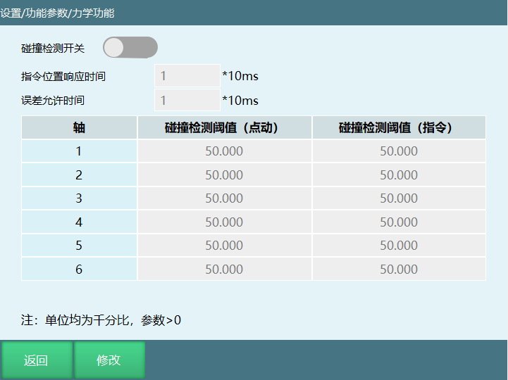

### 碰撞检测

碰撞检测开关：开启后机器人会根据灵敏度对碰撞进行检测，通常需要找到机器运行时不会判定发生碰撞的值，方可正常使用（具体以现场情况而定）。

碰撞检测阈值（点动）：设置碰撞检测阈值参数后，机器人在示教模式下进行点动操作时将调用此处设置的值。

碰撞检测阈值（指令）：设置参数后，机器人在示教模式下回复位点、回零、单步、试运行以及切至运行模式后运行机器人将调用此处的值。

指令位置响应时间：本体机器人在运行过程中已经碰触到了，但因为设置了这个时间，所以会因为设置的时间从而延时报错；时间到了，报错出现，机器人下电。

误差允许时间：PID调节导致力矩波动，误触发了碰撞警告，该功能就是防止这种现象出现，在设置的时间内力矩回到正常范围，警报就不会出现。

拖拽示教

### 拖拽模式

拖拽方式：3D鼠标、力矩、位置。

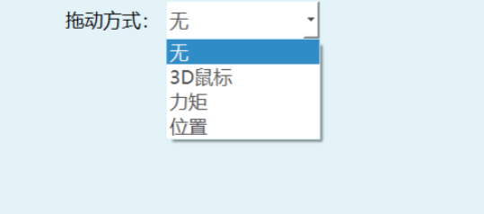

### 3D鼠标使用方法（使用该功能，可以不用进行辨识就可以正常切换并使用）

1.  3D鼠标配件说明：

TTL转RS232转接头，5V电源，3D鼠标本体，线缆收纳盒，3D鼠标固定板。

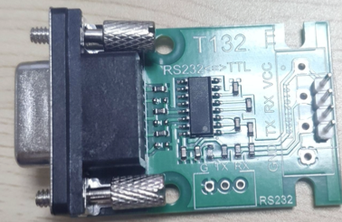

2.  接线定义：

**4针连接器 J1:**

3DX-Sensor Module Serial 有一个4针公头连接器，栅格为1.0毫米。\
电缆连接器：JSTSHR-04V-S-B，带压接触点SSH-003T-P0.2。\
模块上的连接器：JSTBM04B-SRSS-TB，如图：

| 针脚# | 连接器 | 功能颜色 |
| :--- | :--- | :--- |
| 1 | VCC +3.3V至+5.0V | 红色 |
| 2 | TxD（输出） | 绿色 |
| 3 | RxD（输入） | 橙色 |
| 4 | GND | 黑色 |

**电缆:**

有关3DX-Sensor Module Serial的连接器的信息，请参阅"4针连接器J1"部分。

与控制台的连接可通过一个栅格为2.54毫米的4针母头连接器来实现。

| 针脚# | 连接器 | 功能颜色 |
| :--- | :--- | :--- |
| 1 | VCC +3.3V至+5.0V | 红色 |
| 2 | GND | 黑色 |
| 3 | TxD（输出） | 绿色 |
| 4 | RxD（输入） | 橙色 |

3.  3D鼠标的安装部件：3D鼠标本体，3D鼠标置线盒和固定板。

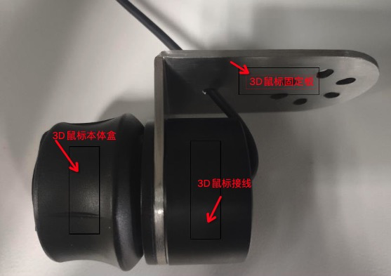

3D鼠标置线盒用于收纳部分；3D鼠标连接线缆，固定板用于将
3D鼠标安装在机器人末端。将
3D鼠标的组件按上图所示拼接完成后即可安装于机器人末端。同时，3D鼠标也可以不安装在机器人末端使用，但此时拖动起来的方向感不如装于机器人末端直观。

供电设备：外接 5V电源。

接线设置：鼠标转换线插入控制器的 Com1串口且Com1串口需要支持
RS232通讯即可直接使用。

4.  使用说明及注意事项：

3D鼠标端口号：相当于控制器上COM端口，填入多少就选择几号COM口。

控制器配置默认端口号为1，以桦汉控制器为例，232为COM2口，那么需要更改控制器对应节点后才能使用。

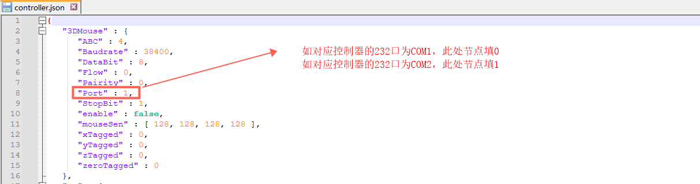

5.  3D鼠标参数设置：

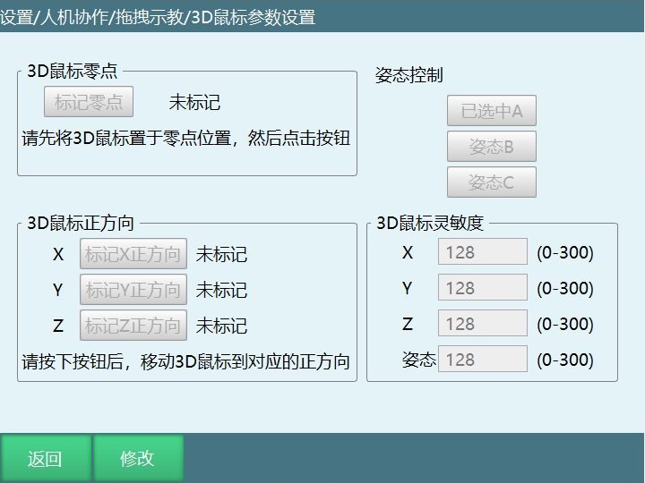

注意：若3D鼠标安装在机器人本体上，使用前一定要确认机器人运行安全方可进行使用。

① 标记零点：需切换到拖拽模式后标记
3D鼠标零位置，未标记表示没有标记过零点，标记后即显示已标记。

用法：点击修改，然后点击标记零点即可完成标记，不需要移动鼠标。

② 3D鼠标正方向：分为标记
X、Y、Z正方向，未标记表示没有标记过方向，标记后即显示已标记。若按下后通讯失败则显示通讯失败，该情况下方向沿用上次标记的方向。

用法：点击修改，然后点击标记方向按钮，然后按下鼠标对应方向，提示标记方向成功即完成该方向的标记。

③ 姿态控制：选择鼠标旋转控制的姿态，可以选择控制姿态 A，B，C。

用法：点击修改，点击对应姿态按钮即可完成选择。

④ 3D鼠标灵敏度：用于控制 3D鼠标控制对应方向和姿态的灵敏度。

用法：点击修改，输入数值，数值范围是 0-300，数字越大灵敏度越高。

⑤ 首次使用3D鼠标按键顺序：

- 点击修改；

- 标记零点；

- 标记XYZ方向；

- 设置灵敏度数值；

- 保存。

⑥ 3D鼠标控制机器人运动方法：

- 完成零点设置和方向标记；

- 通过示教器进行伺服使能；

- 按下 3D鼠标对应方向即可控制机器人向该方向运动；

- 3D鼠标支持机器人在各坐标系下的运动，但方向对应只适用于直角坐标系，其他坐标系下控制关节单独运动，与直角坐标系下的运动方式不同。

### 力矩（使用力矩模式需辨识）

力矩参数设置如图：

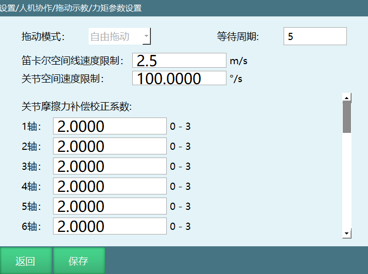

拖拽模式：机器人拖拽时的模式，设置为自由拖动时可以拖动六个轴

笛卡尔空间线速度限制：拖动时的最大速度，超过限制后会下电停止

关节空间速度限制：拖动时的最大速度，超过限制后会下电停止

关节摩擦力补偿校正系数：范围0-3，参数越大，给予的补偿越大，建议参数从0开始测试。

关节目标扭矩校正系数: 范围0-3，默认为1，正常无需修改。

关节超限阻力系数:范围0-100，默认为5，接近限位有反作用力。

关节扭矩传感器灵敏系数:
范围0-1，仅存在关节扭矩传感器时生效，数值越大对传感器变化的反应越灵敏，过大会出现震荡或掉轴现象，需要选择合适参数。

### 位置（位置模式不需要进行辨识且必须配合六维力传感器进行使用）

为了使拖拽示教更加省力更加顺滑，添加了六维力传感器辅助拖拽。拖拽时会实时获取传感器的受力和力矩，使拖拽更省力更顺滑。现包括力矩和位置两种应用模式

### 安装传感器

传感器的X轴正方向与机器人的X轴正方向应保持一致。

注：若需要使用力矩模式，需要在安装传感器前进行动力学辨识，辨识的注意事项和具体操作请看上文。

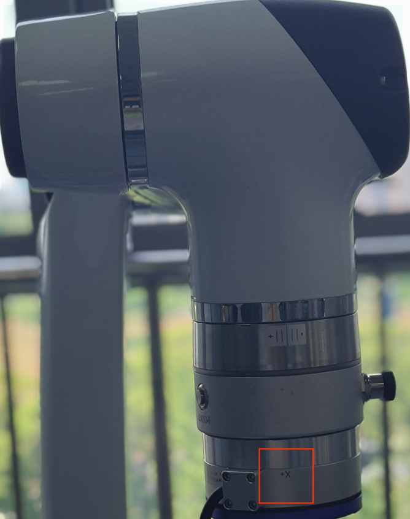

### 六维力传感器参数设置

1.进入设置/功能参数/人机协作/六维力传感器页面进行参数设置

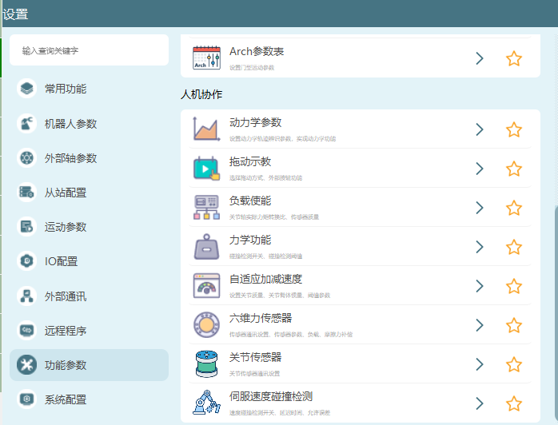

2.传感器通讯设置（现支持的传感器通讯有EtnerCat、Modbus RTU、Modbus
TCP三种方式）

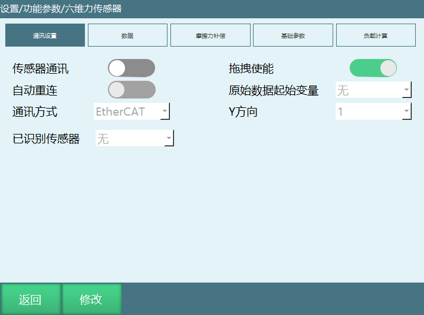

参数说明：

传感器通讯：保存好参数后，点击传感器通讯按钮进行传感器通讯，并获取传感器数据显示在传感器中，若通讯失败则会报错并关闭通讯按钮。

拖拽使能：表示六维力传感器数据是否参与到力矩模式的计算，打开拖拽使能是把六维力用于拖拽；关闭拖拽使能后，无法通过传感器进行拖拽。

自动重连：1.控制器开机自动连接传感器；2.在产生伺服报错导致传感器断开时，清除报错后尝试重连传感器

原始数据起始变量：默认为无，可选择全局变量显示传感器原始数据，例如选择GD001，则在传感器通讯后在GD001\~GD006中分别显示传感器原始数据Fx、Fy、Fz、Mx、My、Mz。

3.传感器标定

在负载都安装好的情况下点击标定按钮，标定期间请远离机器人，以防产生碰撞。传感器在使用过程中原始数据会产生变化，在去皮数据偏差较大时点击清零按钮。

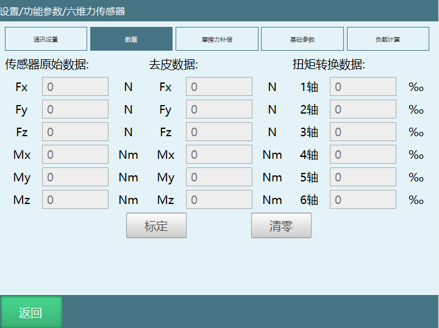

参数说明：

传感器原始数据：传感器读取到的原始数据，Fx、Fy、Fz是实时受力，Mx、My、Mz是实时力矩。

去皮数据：在原始数据基础上，去除传感器与负载的质量的影响后计算出来的实时受力和实时力矩。标零后可查看数据。

扭矩转换数据：传感器额外力通过计算作用到各轴的数值，进入拖拽模式后可查看数据。

**快捷使用案例:1.不需要负载参数时（位置模式），可以将工具手装上后直接标定即可。后面的传感器基础参数，负载计算都可以直接跳过。**

2.需要负载参数时（力矩模式、碰撞检测等等），就需要按照下面的标定的步骤执行。

4.设置摩擦力补偿阈值（力矩模式有效）

摩擦力补偿阈值用于确定系统给予补偿所要满足的扭矩转换值的范围。比如将3轴的摩擦力补偿阈值设置为50，拖拽时，若3轴的扭矩转换值大于50或小于-50，系统会对3轴进行关节摩擦力补偿（即给予一定推力），使3轴的拖拽更顺滑。

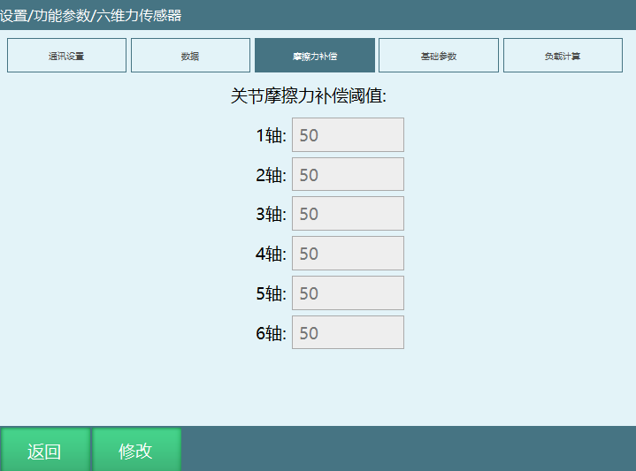

5.传感器基础数据，负载计算，并将计算结果写入工具手

（1）填好传感器基础参数后点击标零按钮

注意：请在传感器无负载的情况下进行，标零结束后会在标零按钮右侧显示已标零

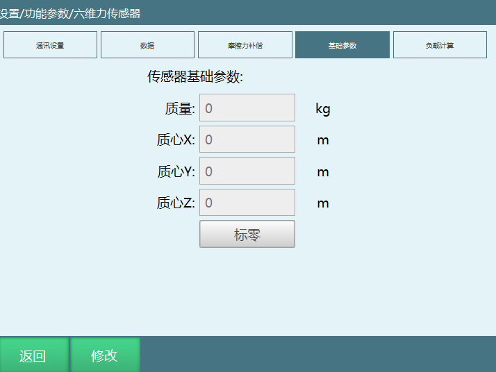

参数说明：

质量：传感器本体质量，请查看传感器厂家提供的说明文档

质心X：默认为0，如有特殊情况，请查看传感器厂家提供的说明文档

质心Y：默认为0，如有特殊情况，请查看传感器厂家提供的说明文档

质心Z：一般为传感器高度的一半，请查看传感器厂家提供的说明文档

（2）标零完成后，请安装上负载，点击计算，计算出负载的质量和质心。

注意：安装负载时不要把螺丝拧得太紧，装好之后不会出现晃动就足够了，否则会因压迫传感器，导致读取到的数据出现偏差。

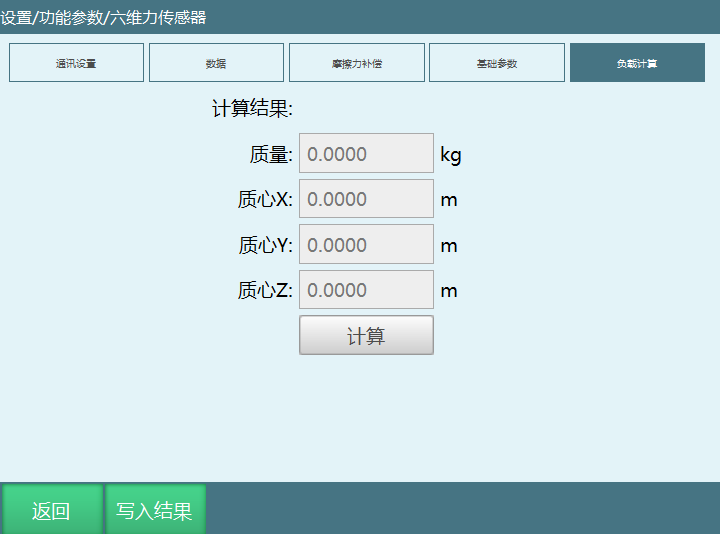

参数说明：

负载质量：传感器下负载物的质量

质心X：以法兰中心为起点，负载质心沿X方向的偏移（距离）

质心Y：以法兰中心为起点，负载质心沿Y方向的偏移（距离）

质心Z：以法兰中心为起点，负载质心沿Z方向的偏移（距离）

注意：以上XYZ均以末端坐标系作为参考。（末端坐标系坐标轴确认方法：在无工具手情况下，在工具坐标系下走TX，TY，TZ即可确认XYZ的方向）

（3）点击"写入结果"，会出现弹窗，此时可选择要写入的工具手，点击确定，则可将计算结果写入选定的工具手的负载参数中。

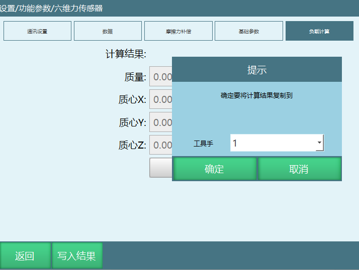

6.在工具手标定界面检查之前写入的负载参数值

（1）在工具手标定界面中选择之前写入计算结果的工具手，进入其负载参数界面，可查看之前写入的质量和质心值。当前质量和质心值为传感器和负载物的合质量与合质心。

（2）进入拖拽模式前必须选中该工具手，并使能负载，否则上电后，机器人末梢会因受力不平衡而下坠。

（3）若工具手选择正确，也使能了负载，但在拖拽模式下上电，机器人末梢依然受力不平衡，则可能是负载参数计算有误。请根据机器人末梢的运动方向适当修改负载参数值。比如，机器人末梢下坠，应该是负载质量比实际值小，可适当调大。机器人末梢向X轴正方向偏移，应该是质心X值比实际值大，可适当调小。

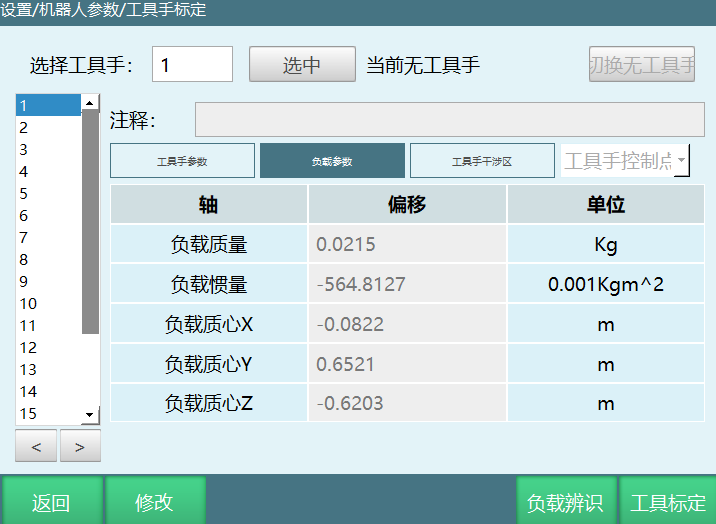

### 位置参数设置

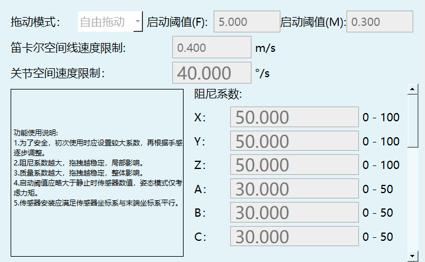

参数说明：

拖拽模式：机器人拖拽时的模式，设置为自由拖动时可以xyzabc拖动，位置拖动仅可动xyz，姿态拖动仅可动abc。

启动阈值：
F:为xyz方向上的阈值，超过这个数值才会运动。M：同理，为abc方向的。

笛卡尔空间线速度限制：xyz速度限制。

关节空间速度限制：abc速度限制。

阻尼系数：越小越灵敏。

质量系数:
越小越灵敏，主要修改这个参数。该参数作为分母使用，当小于1时，越接近于0，参数效果越明显。

变化率阈值:越小越灵敏，发现传感器数值突变会强制停止，若无特殊需求尽量设为最大值。

### 关节传感器

机器人关节内部带力矩传感器时，可以打开关节传感器开关，有效提升拖拽效果。（目前已适配：络石机器人，埃斯顿卓酷机器人）

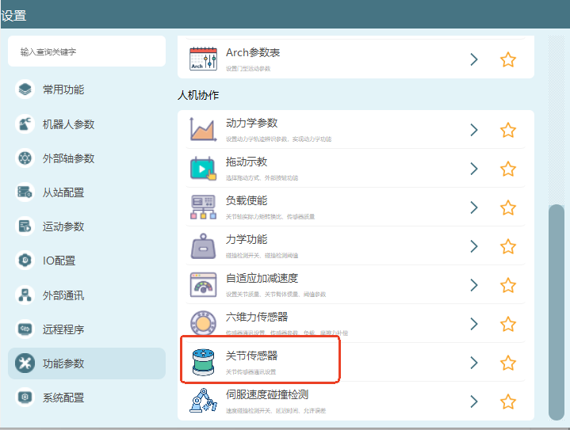

### 如何切换拖拽模式？

1.  使用示教器-监控-快捷键-示教方式按钮进行切换。

2.  使用示教器拖拽键进行切换。

注意：切换拖拽模式之前必须要机器人辨识成功，进入拖拽模式后，上电即可拖拽机器人。

### 外部按键 

如下图所示

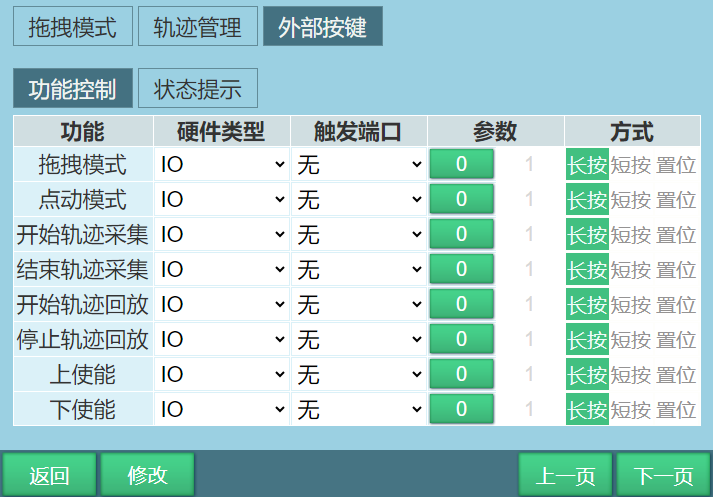

#### 功能控制

参数生效方式为0和1

1.触发方式为长按时：

触发IO，3-10s后生效，0有效时，IO状态为101，1有效时，IO状态为010。

2.触发方式为短按时：

触发IO，0-3s内生效，0有效时，IO状态为101，1有效时，IO状态为010。

3.触发方式为置位时：

置位方式的IO信号是持续触发的，正常使用应该选择功能对立的情况，例如，上使能1生效，下使能0生效，绑定同一个端口，方式选择置位。

| 功能 | 示例说明 |
| :--- | :--- |
| 拖拽模式 | 示例：IO端口1-1，触发1-1信号，示教模式切换为拖拽模式。注意：机器人必须辨识成功后才可以切换为拖拽模式进行拖拽操作 |
| 点动模式 | 示例：IO端口1-2，触发1-2信号，示教模式切换为示教模式。注意：切换为点动模式后才可以对拖拽模式下进行的轨迹回放 |
| 开始轨迹采集 | 示例：IO端口1-3，触发1-3信号，开始拖拽机器人。此处的开始轨迹采集信号相当于监控-轨迹回放界面的开始按钮 |
| 结束轨迹采集 | 示例：IO端口1-4，触发1-4信号，停止轨迹采集且采集的轨迹被记录。此处的结束轨迹采集信号相当于监控-轨迹回放界面的停止按钮 |
| 开始轨迹回放 | 示例：IO端口1-5，触发1-5信号，回放采集的轨迹。此处的开始轨迹回放信号相当于监控-轨迹回放界面的回放按钮。注意：轨迹回放时需要将示教模式切换为点动模式，拖拽模式下无法回放轨迹 |
| 停止轨迹回放 | 示例：IO端口1-6，触发1-6信号，停止回放采集的轨迹 |
| 上使能 | 示例：IO端口1-7，触发1-7信号，伺服上电 |
| 下使能 | 示例：IO端口1-8，触发1-8信号，伺服下电 |
| 夹爪开 | 示例：IO端口1-9，触发1-9信号，夹爪打开（功能暂未开放） |
| 夹爪关 | 示例：IO端口1-10，触发1-10信号，夹爪关闭（功能暂未开放） |
| 保存轨迹 | 示例：IO端口1-10，触发1-10信号，轨迹采集结束后触发保存轨迹信号，轨迹被保存。此处的保存轨迹信号相当于监控-轨迹回放界面的保存按钮 |
| 保存后清除轨迹 | 不清除：轨迹采集结束，触发保存轨迹信号，触发轨迹回放信号，开始回放采集的轨迹。清除：轨迹采集结束，触发保存轨迹信号，触发轨迹回放信号，无法回放采集的轨迹 |
| 快捷指令 | 。当触发对应IO时，在当前所选择的作业文件中插入对应指令（当指令为运动类指令时，则以机器人当前点位插入运动类指令），插入的指令都在作业文件的最末端，指令插入成功，弹出小白条：指令插入成功，指令插入失败后，弹出红条：指令插入失败。需测试各个模式下插入指令情况。正常情况下只有示教模式才能插入指令。|

#### 状态提示

对应功能设置触发端口和参数后，当功能满足输出条件时IO会根据设置的触发端口以及参数类型输出提示。

示例：功能拖拽模式，触发端口1-1，参数选择1，当示教模式切换为拖拽模式时IO
1-1端口由低电平0-高电平1。

说明：部分没有抱闸的机器人可以在伺服停止,就绪,报错的状态下记录轨迹，例如四轴SCARA，不需要辨识，可以直接开始进行拖拽，轨迹回放时需要上使能。

### 拖拽编程

使用拖拽编程需在外部按键的快捷指令板块设置焊接点以及非焊接点，如下图：

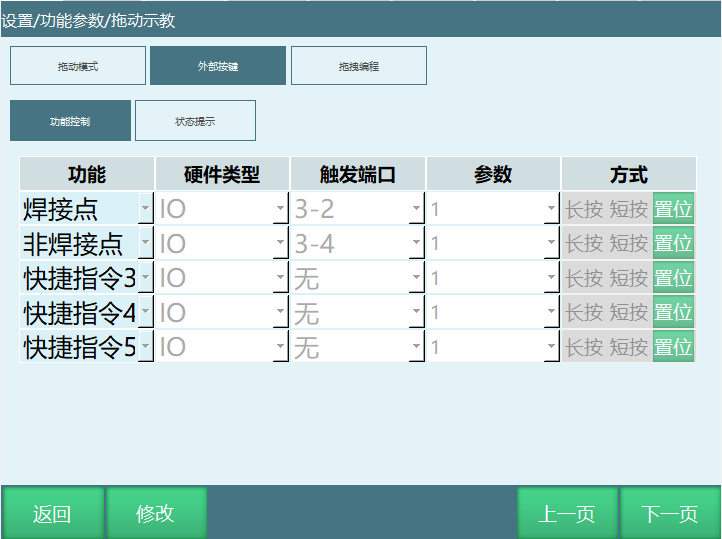

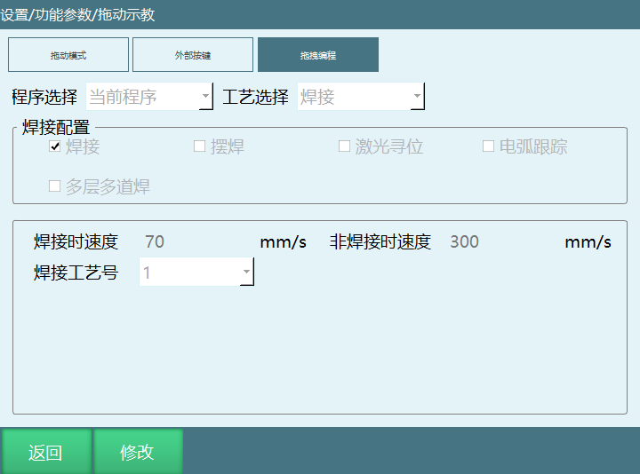

程序选择：

1.当前程序：指令会插入当前已打开的工程程序

2.自定义程序：指令会插入在自动生成的程序名里（例如：文件1、文件2\...\...）

3.当工程页面有创建程序时，可以选择程序名，将指令指定插入选择的程序内。

工艺选择：仅支持焊接工艺

焊接配置：可以满足焊接、摆焊、激光寻位、电弧跟踪、多层多道焊，按实际使用进行勾选

焊接时速度/非焊接时速度：填写速度后，插入指令时会按照设置的速度进行插入

焊接工艺号：选择工艺号后将调用当前工艺号的焊接参数

使用案例（例如仅焊接）：

插入非焊接点设置的io信号（记录焊接开始的安全点）------插入焊接点设置的io信号（记录焊接起点）---------插入焊接点设置的io信号（记录焊接末点）------插入非焊接点设置的io信号（记录焊接结束的安全点），按照此顺序将生成下图的程序：

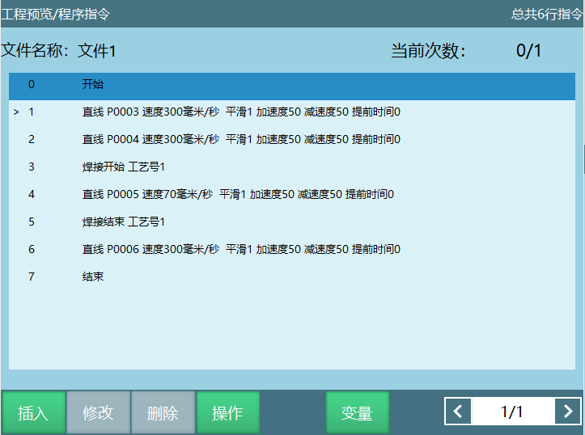

## 自适应加减速度

自适应加减速使能开启后可以保护电机，防止电机运动时转矩过大。

设置自适应加减速需进入"设置/人机协作/自适应加减速度"中进行设置，相关步骤如下：

1.  根据自己的需求填写相应的参数，打开使能开关后生效。

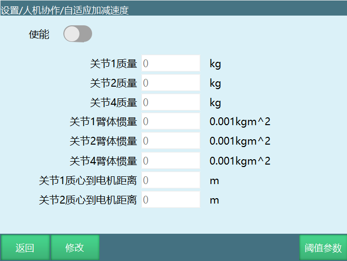

2.  阈值参数

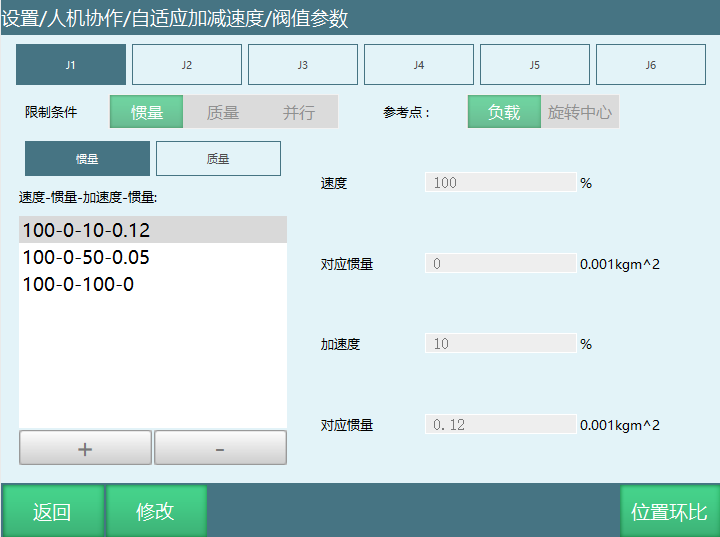

条件分别：惯量、质量、并行（并行指惯量和质量两者相乘限制），就是指通过质量控制，惯量控制还是一起控制。

参考点：负载，旋转中心。\
注：设置的阈值负载值，会自动形成区间范围。如图所示虽然没有设置0.1对应的加速度，但在0到0.12区间内会根据区间分配等比例的加速度。如果超过0到0.12区间，如0.13会按照最大值0.12对应的加速度计算。

阈值参数应用是想设置好后，我只需要再工具手上修改负载就可以匹配到阈值参数对应的加速度。怎么设置就看你这个负载想跑什么加速度，如：10kg，我跑10%，1kg，我跑90%这样。然后我再工具手写10kg或1kg可以跑到对应的速度。

3.  位置环比，如图：

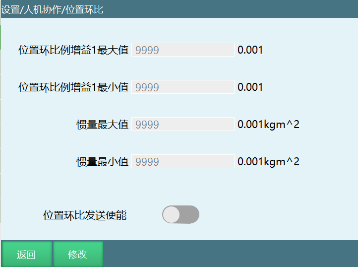

位置环比参数的填写：需要看实际伺服和本体，因为位置环增益越高有可能抖。一般是调机后得出最大值和最小值再填写；惯量的最大值最小值看负载是多少就多少。

## 负载使能

### 负载拖拽示教

1.  根据动力学参数流程进行辨识。

2.  辨识成功结束后进入负载使能页面设置好参数并打开负载使能开关。

3.  工具手标定页面进入负载辨识页面后记录空载数据

4.  空载数据记录完毕后安装负载进行质量质心以及惯量的辨识，得出参数后并将结果写入工具手后将可以正常使用负载进行拖拽

**注释**

使用IO信号切换至拖拽模式后，

形按钮和"示教方式"按钮无效。

1.  负载使能界面设置如下：设置------功能参数------负载使能。

负载使能：是否启用负载功能，开启负载使能后，系统会根据所选负载编号下的负载参数计算机械臂运行时的带载转矩。

实际力矩转换比：通常由伺服厂家提供

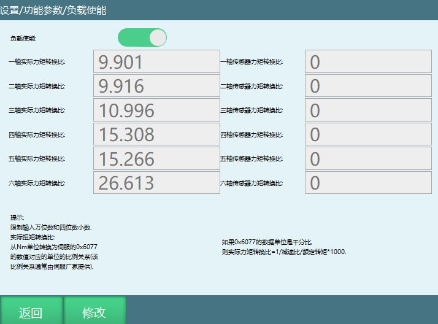

2.  工具手界面设置如下：设置------机器人参数------工具手标定------负载辨识。

（1）进入负载辨识页面后先记录空载数据

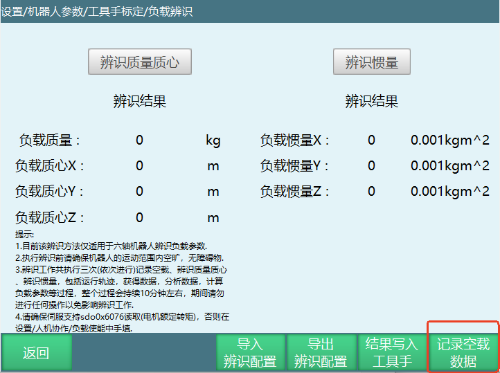

（2）记录空载数据后装上负载，分别进行质量质心、惯量辨识

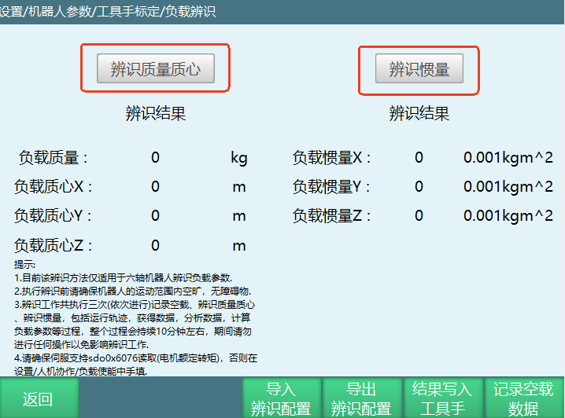

（3）所有数据采集后点击将结果写入工具手

（4）进行负载拖拽

## 拖拽与轨迹回放

1.  监控-轨迹回放界面支持拖拽轨迹和回放，如图所示。

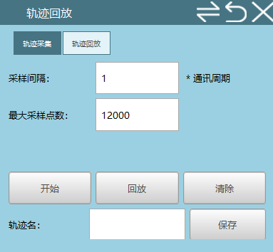

注：轨迹采集时间计算公式为：填写的采样间隔\*
通讯周期（在从站页面查询当前通讯周期）\*
填写的最大采样点数。（采集时间单位为ms）

机器人在辨识成功后，可以对机器人进行拖拽操作。

采样间隔：每个点之间的采样间隔，例如设置的采样间隔是0.03秒，那第一个点和第二个点的采样间隔是0.03。

最大采样点数：将一段拖拽轨迹分成设置的采样点数，例如设置的采样点数是300会将拖拽的整段轨迹分成300个点。

开始：上使能，点击开始按钮后拖拽机器人。

停止：拖拽结束后，点击停止，拖拽轨迹被记录。

回放：回放拖拽轨迹。

清除：记录的拖拽轨迹被清除。

轨迹名：拖拽的轨迹名，如果拖拽结束后，轨迹被记录下来，后面也可以在设置-人机协作-拖拽示教界面选择记录的轨迹名，点击回放就可以回放被记录下来的轨迹。

保存：保存拖拽轨迹，保存的轨迹在右侧轨迹回放页面被记录下来。

2.  拖拽示教指令-DRAG_TRAJECTORY（见下图）：

该指令用于调用轨迹回放记录，回放速率填写100%时，是指当前拖拽时的速度，500%时是指当前拖拽速度的五倍，以此类推。

注：该指令的运行速度为拖拽速度x回放速率，状态栏速度不影响该指令速度。

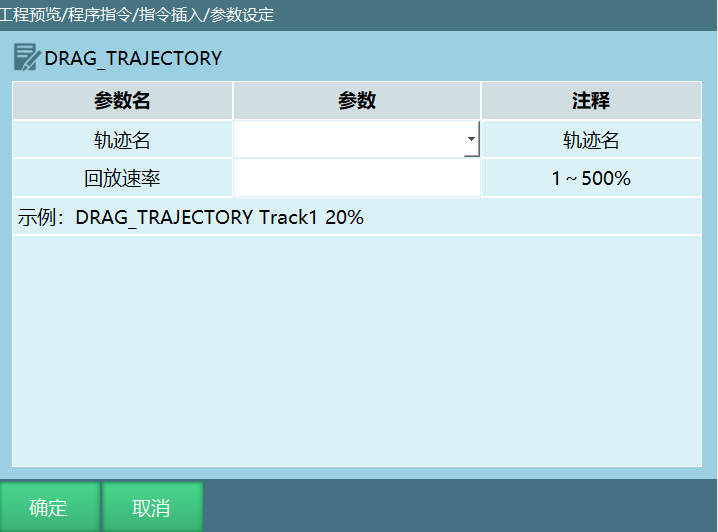

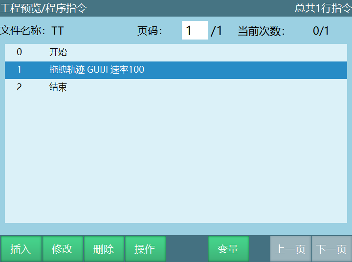

### 轨迹回放调试功能

轨迹回放新增调试功能，新界面可以显示轨迹的点位信息、可以修改点位信息和单步到任意一个点位以及设置回放时是否对当前轨迹的原始数据进行滤波。

进入设置/功能参数/拖动示教/轨迹管理界面，三个图标依次为回放该段轨迹、编辑该段轨迹、删除该段轨迹。

日期:代表导入该轨迹的时间，如果编辑了该段轨迹，就显示最后修改的时间。

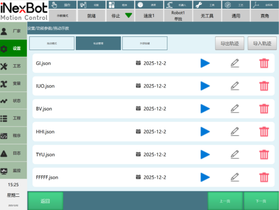

轨迹管理界面点击轨迹文件的【编辑】按钮，进入轨迹文件编辑页面

轨迹编辑页面：

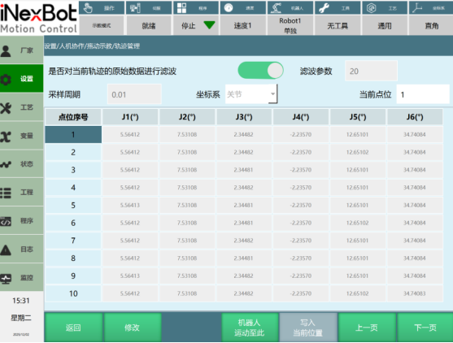

选中某个点位后，点击下面的【修改】，轨迹编辑界面切换到可修改状态。

可修改状态页面：

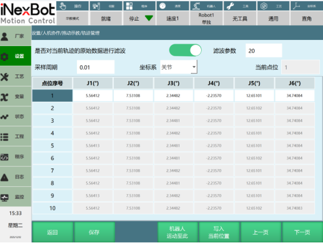

修改完成后点击下方【保存】按钮即可保存成功

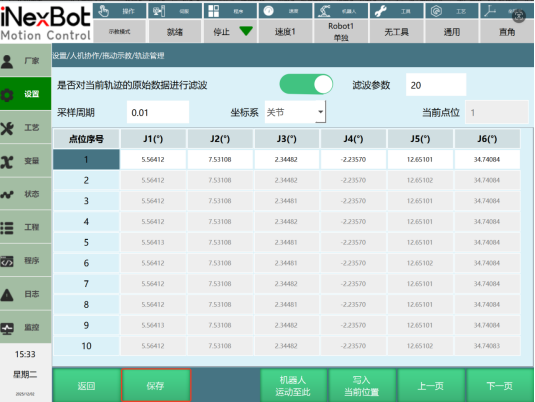

**滤波**

是否对当前轨迹的原始数据进行滤波为关闭状态，不展示滤波参数。

滤波关闭状态页面：

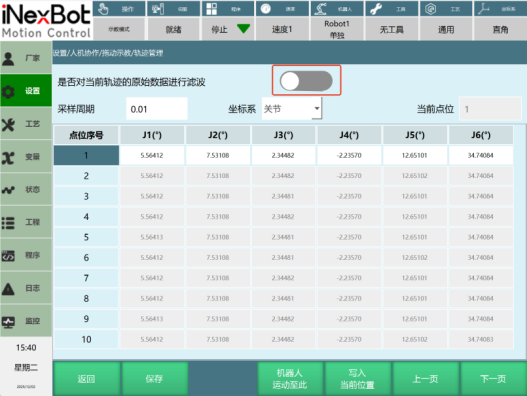

是否对当前轨迹的原始数据进行滤波为开启状态，展示滤波参数。

滤波参数：可以设置当前轨迹的滤波参数。

新建轨迹文件时，2501默认滤波参数为45；dev默认滤波参数为20。

滤波开启状态页面：

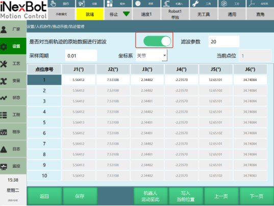

**采样周期**

范围为[0.001,0.1]。

采样间隔*通讯周期，可以修改该点位的采样周期数据。

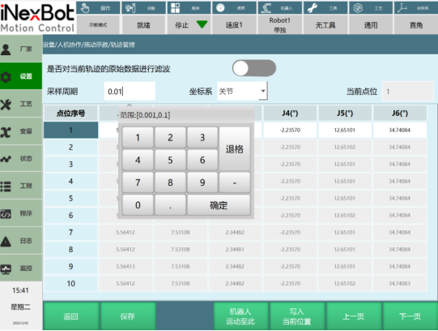

**坐标系**

可以修改选中点位的坐标系，工具和用户坐标系可以设置序号。

当坐标系切换为工具坐标系时，工具序号为3，则点击机器人运动至此需要先将上方的工具手切换为工具手3，再点击机器人运动至此。

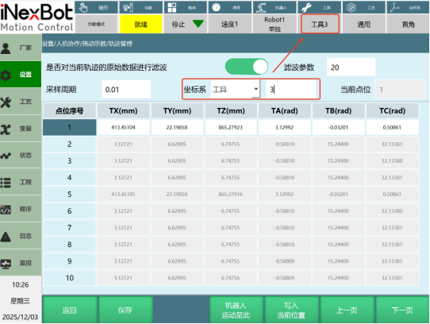

当坐标系切换为用户坐标系时，用户序号为5，则点击机器人运动至此需要先将上方的用户坐标切换为用户坐标5，再点击机器人运动至此。

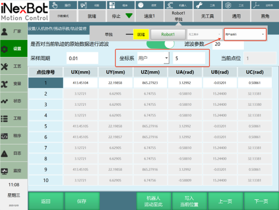

有外部轴时才可以将坐标系设置为大地坐标系，才可以点击机器人运动至此。

**点位数据**

可以修改该点位的数据，点位数据显示小数点后五位。

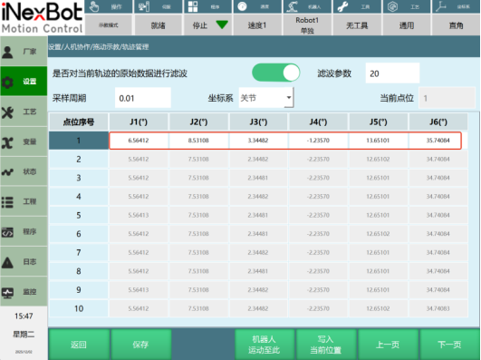

**写入当前位置**

可以将当前机器人位置写入点位数据中。

没点击修改之前【写入当前位置按钮】置灰；选中点位点击修改后【写入当前位置】变绿可点击。

**当前点位**

输入点位序号，可以跳转到对应的点位序号页面位置。

**机器人运动至此**

选中某个点位序号，点击【机器人运动至此】，机器人可以单步运动到该点位的位置。

**外部轴**

当前页面如果有外部轴，需要左右滑动查看。

有外部轴的轨迹编辑界面：

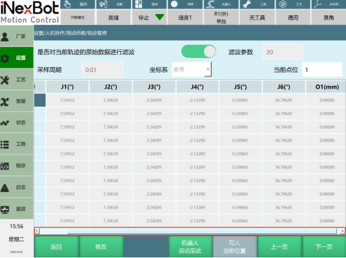

**监控-轨迹回放**

监控/轨迹回放界面，展示操作图标依次为回放、编辑、删除。

点击轨迹编辑按钮可打开该轨迹的编辑界面。

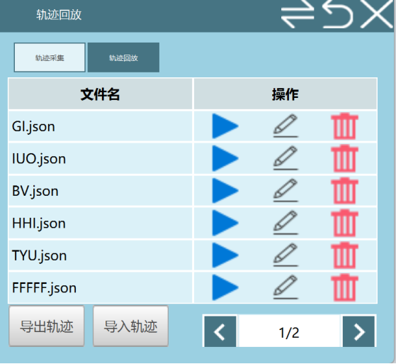

### 伺服速度碰撞检测

功能描述：打开使能后，目标速度和伺服速度误差超过设置的伺服速度允许误差时机器人报错

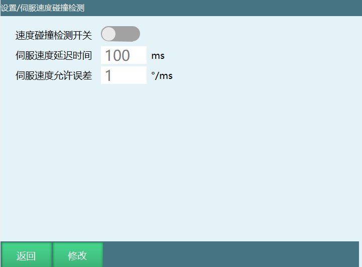

## 动力学重构

**适用版本：**目前是rtl-25.01

### 准备阶段：基础环境与连接

在进行动力学辨识或拖拽示教前，必须完成以下基础设置，以确保系统能够正确读取数据并安全运行。

#### 机器人安装设置

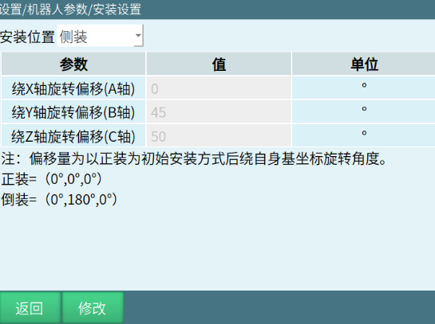

**位置选择**：必须根据机器人实际的物理安装方式（正装、倒装、侧装）在设置/机器人参数/安装位置中进行选择。

**角度定义**：

1.  • **正装**：角度为 (0, 0, 0)

2.  • **倒装**：角度为 (0, 180, 0)

3.  • **侧装**：填写任意实际角度

#### 通讯与PDO配置

**必要配置**：必须配置相关的PDO映射。

**关键对象字典**：

1.  • 0x6077：读取伺服扭矩

2.  • 0x6071 或 0x60B2：设置目标扭矩

3.  • 0x606C：读取当前速度

4.  • 0x60B2：力矩前馈

#### 伺服识别文件

需配置拖拽专用的伺服识别文件，确保伺服系统能够正确响应动力学重构指令。

### 核心参数配置

转换比是连接伺服底层数据与上层应用的桥梁，必须准确填写。

#### 转化比设置

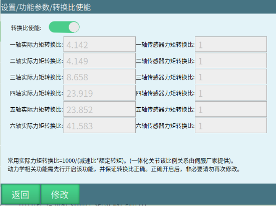

**必填项**：**所有轴的实际力矩转换比必须手动填写并打开使能**（仅六维力传感器在位置模式下无需填写）。

**计算公式**：常用公式为 1000 / (减速比 \* 额定转矩)

*注意：部分伺服厂家提供的数据可能有误，后期会新增功能通过标准负载块或后续标定功能验证。*

**额定转矩获取功能**

系统支持获取额定转矩功能，但需注意：

1.  • 该功能受限于伺服设备型号，并非所有设备均支持，若没有获取到的需要客户自行提供

2.  • 成功获取的数据将直接显示在当前页面

3.  • 需要客户手动带入计算公式

4.  • 使用时请务必核对数据单位

**简易校验方法**：

1.  • 1轴\~7轴的转换比数值应逐步增大

2.  • 数值必须大于1

3.  • *此方法不能确保数值绝对正确，但能有效识别明显错误*

#### 关节传感器标零

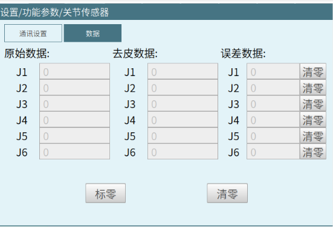

**原因**：传感器存在零飘（受时间和温度影响），使用前必须标定。

**操作路径**：设置/功能参数/关节传感器

**操作步骤**：

1.  在动力学辨识前进行\"标零\"操作

2.  若使用过程中发现误差较大，可再次执行\"清零\"操作

3.  \"清零\"操作可将当前误差减半

### 动力学辨识流程

根据数据来源选择不同的辨识策略。推荐使用动力学辨识。

#### 方案选择

**动力学辨识：**推荐客户使用。

**动力学全参**：需要客户提供精确的本体参数（质量、质心、惯量等），一般不推荐客户使用。

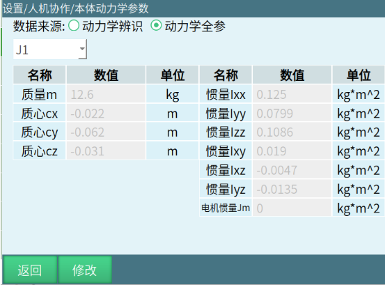

#### 辨识类型与要点

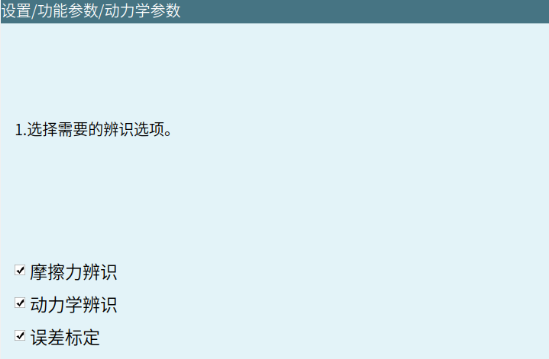

**动力学辨识**：需勾选【摩擦力辨识 + 动力学辨识 + 误差标定】

| 辨识类型 | 运动轨迹特征 | 关键注意事项 | 执行顺序 |
| :--- | :--- | :--- | :--- |
| 摩擦力辨识 | 单轴来回运动 | 必须在动力学辨识前执行；摩擦力会随运行时间增长而减小 | 第一步 |
| 动力学辨识 | 所有轴同时来回运动 | 必须先完成摩擦力辨识；轨迹范围越大拖拽手感越好；速度越快（最低30）碰撞检测效果越好 | 第二步 |
| 误差标定 | 最后几个动作 | 计算阈值和基础误差，结果显示在"转矩误差值"中 | 第三步 |

**摩擦力补偿系数**：调节拖拽顺滑度，过大则停不稳

**关节速度限制**：默认100°/s，安全确认后可调至200°/s

**响应时间**：各轴的响应时间（ms）

### 六维力传感器

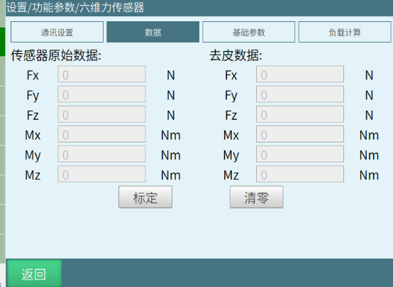

1.  • 一个传感器仅连接一个机器人

2.  • 其中摩擦力补偿界面删除，由\"力矩模式启动阈值\"控制

#### 传感器使用指南

1.  若无外部传感器，只需要调整摩擦力补偿系数即可，补偿越大越丝滑，过大机器人容易停不下来，若超速报错则调整关节速度限制。

2.  若带关节力矩传感器，在第1点调整的前提下，若机器人上电会乱动，先去关节传感器界面，查看误差，若误差较刚辨识完有所增大，则清零。

3.  若带六维力传感器，则在第1点的调整前提下，若机器人上电乱动，则将启动阈值调大。

### 功能应用与高级设置

完成辨识后，可进行拖拽示教、碰撞检测等功能的微调。

#### 拖拽示教

**力矩拖拽**：

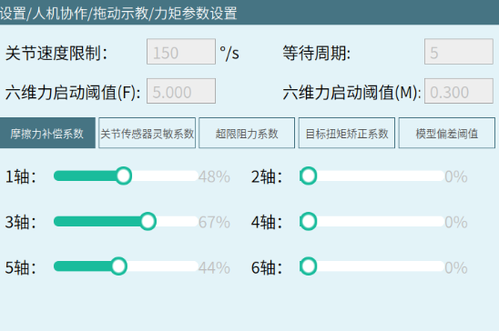

1.  摩擦力补偿系数：调节各轴摩擦力补偿，使拖拽示教手感更顺畅。

2.  关节传感器灵敏系数：调关节传感器检测力度的敏感程度，默认不改，可微调。

3.  超限阻力系数：各关节临近限位时所给反作用力，系数越高越明显，默认不改。

4.  目标扭矩矫正系数：正常为1，特殊极少数伺服会存在一个缩放关系，再修改这部分，默认不改。

5.  模型偏差阈值：关节传感器独有 理论力矩与实际力矩允许的最大误差值，默认不改。

6.  关节速度限制：当拖拽关节速度超过限制时，报错并退出拖拽，默认100°/s，确认安全后可以修改至200°/s。

7.  六维力启动阈值：当连接六维力传感器后，传感器去皮值大于该数值再给予摩擦力补偿，一般默认可不修改

**位置拖拽**：注意奇异点问题，六轴机型有奇异点处理会只让动五轴，其他机型只有超速处理

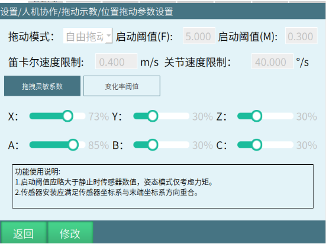

1.  拖拽灵敏系数: 调节各方向拖动手感，使拖拽示教手感更顺畅。

2.  变化率阈值：检测传感器数值变化过快，默认100，不改。

3.  笛卡尔速度限制： XYZ方向最大速度限制。

4.  关节速度限制: abc姿态最大速度限制。

5.  拖动模式：自由拖动，位置拖动，姿态拖动。

#### 碰撞检测

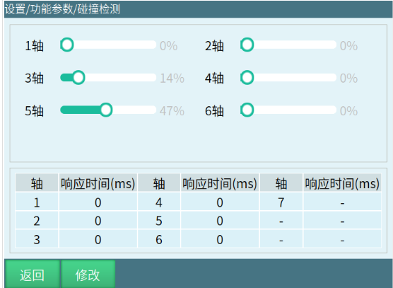

**灵敏度调节**：通过进度条调节（0%为关闭，100%为最灵敏）

**响应时间**：各轴的响应时间（ms）

**作用范围：**拖拽模式不生效，示教模式及运行模式均生效

**指令控制**：支持在程序指令中使用 DETECTCOLLISION_SET 自定义各轴灵敏度

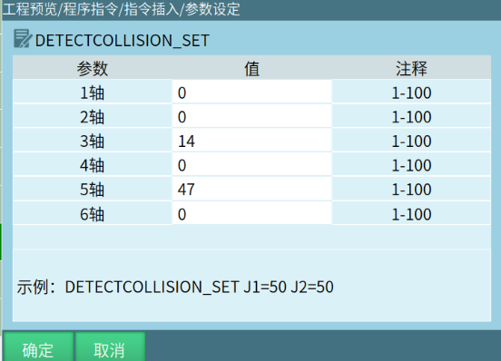

#### 力矩前馈

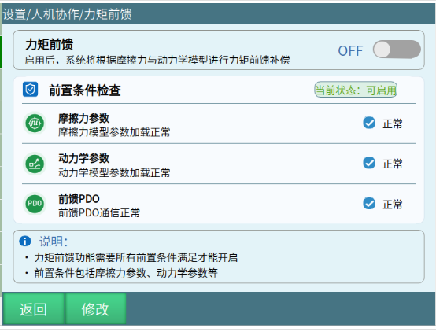

**作用**：加快伺服响应，降低跟随误差

**开启条件**：必须满足前置检查（摩擦力参数、动力学参数、PDO通信均正常）若当前状态可启用，则可以开启力矩前馈

#### 连杆额外负载参数

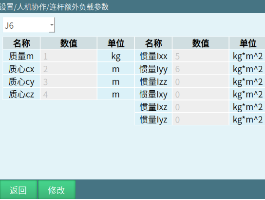

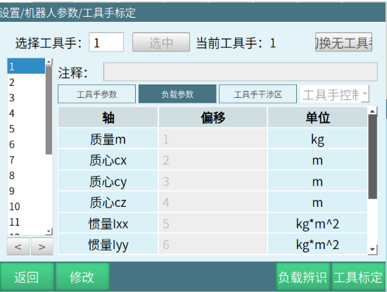

**作用**：将机器人除本体外的额外负载信息添加

**简易用法**：和之前保持一致，在工具手处填写末端负载即可

#### 柔性关节参数

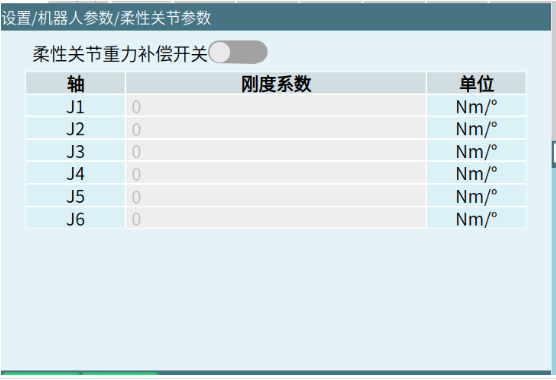

**作用**：关节因自重会产生弹性形变，打开开关并填写对应轴的刚度系数便可以叠加补偿量。（**必须带关节传感器，现阶段是珞石专属**）

### 常见问题处理

#### 参数配置问题

**问题现象**：转换比配置后系统运行异常

**解决方案**：

1.  检查转换比是否符合\"1轴\~7轴逐步增大且大于1\"的基本规则，此规则作为初步筛查手段，虽不能保证数值的完全正确，但足以过滤掉明显的错误输入

2.  验证额定转矩数据的准确性

3.  重新执行关节传感器标零操作

#### 辨识过程异常

**问题现象**：辨识过程中机器人运动异常

**解决方案**：

1.  确认已按正确顺序执行辨识（摩擦力→动力学→误差标定）

#### 功能应用故障

**问题现象**：拖拽示教手感不顺或碰撞检测失效

**解决方案**：

1.  调整摩擦力补偿系数

2.  检查碰撞检测功能是否正常开启

3.  重新进行动力学辨识

## AI 检索专用问答对 (Q&A for Retrieval)

**Q: 人机协作（HRC）是什么？**
A: 人机协作（HRC）指的是人和自动化机器共享工作空间并同时进行作业的工作。

**Q: 机器人辨识的目的是什么？**
A: 机器人辨识的目的是建立机器人的动力学模型，实时快速地计算前馈补偿力矩，使机器人能以期望的速度和加速度运动。

**Q: 辨识操作的步骤是什么？**
A: 辨识操作步骤为：进入动力学参数界面 → 填写轨迹范围和轨迹速度 → 测试轨迹安全 → 确认轨迹安全后开始辨识 → 辨识完成后查看误差值。

**Q: 碰撞检测功能如何工作？**
A: 碰撞检测功能开启后，机器人会根据设置的灵敏度阈值对碰撞进行检测。当检测到碰撞时，机器人会下电停止，保护人员和设备安全。

**Q: 拖拽示教有哪些模式？**
A: 拖拽示教支持三种模式：3D鼠标模式（无需辨识即可使用）、力矩模式（需要先进行动力学辨识）、位置模式（需要配合六维力传感器使用）。

**Q: 3D鼠标使用前需要进行哪些设置？**
A: 3D鼠标使用前需要进行的设置包括：标记零点、标记XYZ正方向、设置姿态控制、调整灵敏度参数。

**Q: 六维力传感器的作用是什么？**
A: 六维力传感器用于辅助拖拽示教，使拖拽更加省力和顺滑。它会实时获取受力和力矩数据，用于位置模式下的拖拽控制。

**Q: 自适应加减速功能的作用是什么？**
A: 自适应加减速功能开启后可以保护电机，防止电机运动时转矩过大。系统会根据负载参数自动调整加速度限制。

**Q: 外部按键支持哪些功能控制？**
A: 外部按键支持的功能包括：拖拽模式切换、点动模式切换、开始/结束轨迹采集、开始/停止轨迹回放、上使能/下使能、夹爪开关、保存轨迹、快捷指令等。

**Q: 负载使能的作用是什么？**
A: 负载使能开启后，系统会根据所选负载编号下的负载参数计算机械臂运行时的带载转矩，确保机器人在负载情况下稳定运行。

## 版本历史

| 版本 | 日期 | 作者 | 变更说明 |
| :--- | :--- | :--- | :--- |
| 1.0.0 | 2026-07-02 | tongmengyuan123 | 初始版本 |
