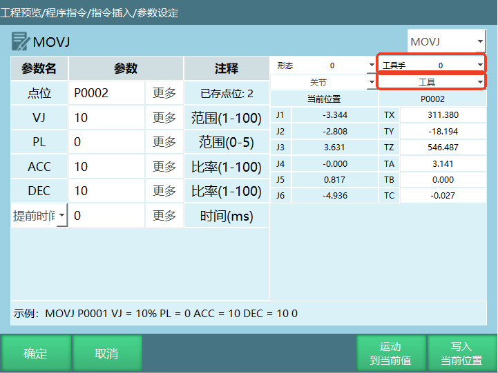
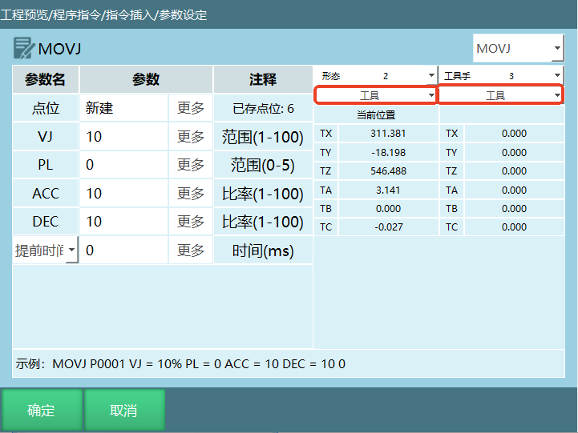
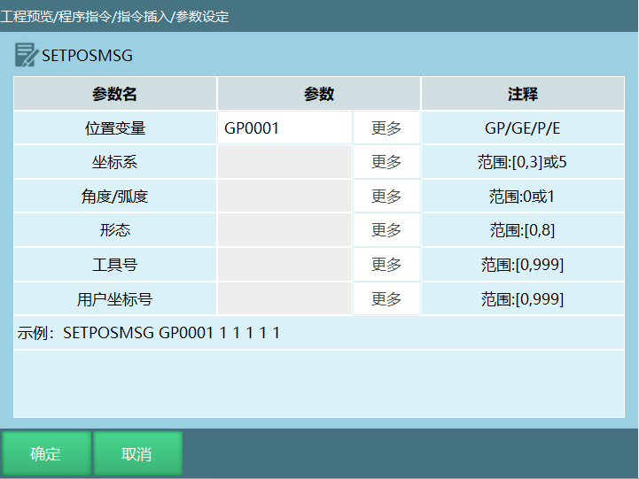
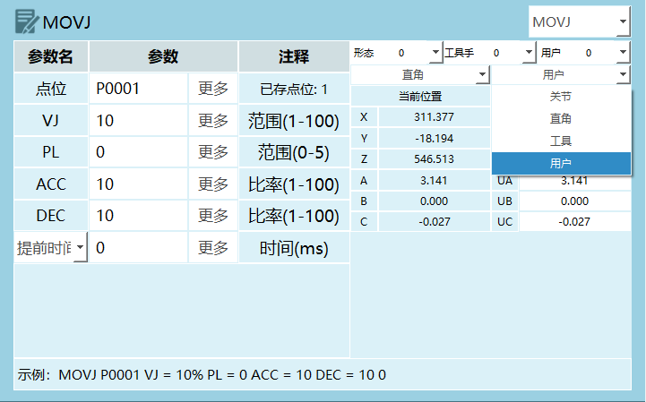
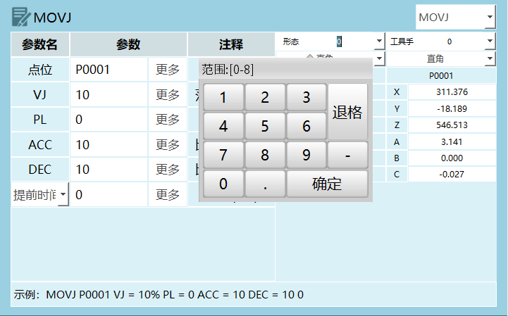
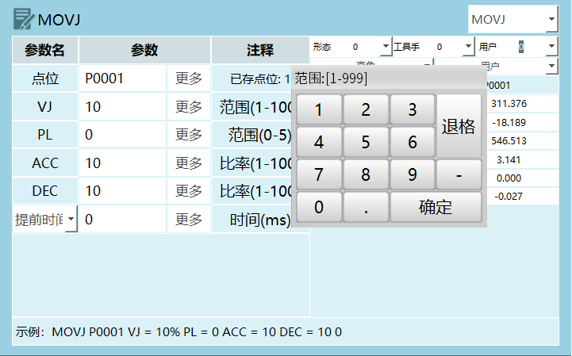
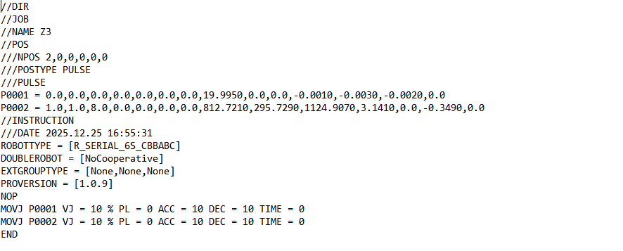
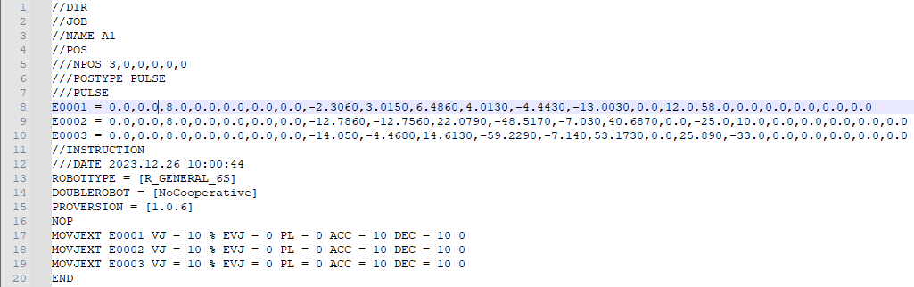

## 点位形态、工具手、用户值修改方式

1.   新建点位时形态、工具手、用户坐标默认取当前值。

修改工具坐标：插入的点位上方下拉框选中工具，选择工具手，点击确定，工具手修改成功。

修改用户坐标：插入的点位上方下拉框选中用户，选择用户坐标，点击确定，用户坐标修改成功。

**手动设置形态、工具手、用户坐标**

1.  新建点位：可以直接修改形态、工具手、用户坐标。

 修改工具手：如图所示，插入点位时，修改坐标为工具，写入工具手，点击确定，工具手修改成功。

- 修改用户坐标和形态的方法和修改工具手一样；

- 点击【写入当前位置】会改变当前点位已有形态、工具手、用户值。

2.  指令-位置变量类-设置点位信息，可以改坐标系、形态等等。

1.  插入设置点位信息指令。

- 位置变量：选择想要修改的目标点位GP/GE/P/E，只能选择已有的点位。

- 坐标系：范围【0，3】或5；其中0：关节坐标系；1：直角坐标系
  ；2：工具坐标系；3：用户坐标系 ；。

- 角度/弧度：可选值0/1。

- 形态：范围【0，8】。

- 工具号：工具手号【0，999】。

- 用户坐标号：用户坐标系【0，999】。

2.  点击确定，运行程序即可修改。

# 位置变量点位信息

## 点位坐标系

范围【0，3】，其中0：关节坐标；1：直角坐标；2：工具坐标；3：用户坐标。

**如何修改位置变量的坐标系？**

1.  全局GP点可以点击变量-全局位置，进入全局位置变量界面点击修改，选择坐标系，点击保存，坐标系修改成功。

2.  局部P点可以在程序指令界面点击在变量，进入局部位置变量界面点击修改，选择坐标系，点击保存，坐标系修改成功。

3.  程序指令界面选中需要修改的全局GP点、局部P点，点击修改，进入参数设定界面，选择坐标系后点击确定，坐标修改成功。

## 形态

范围：\[0,8\]。

1.  机型为6轴串联多关节机器人有形态参数，如形态参数选择当前，则控制系统自动通过转换方式计算出机器人当前的形态值，形态值是通过机器人1、3、5轴的关节点位来计算的，如果范围在\[-90,+90\]之间则为1，不在为0。

2.  形态值为机器人1轴、3轴、5轴位置的二进制转换为十进制然后再加1。

例如：某个六轴机器人1轴为59度、2轴为69度、3轴为79度、4轴为89度、5轴为99度、6轴为109度。

结果如下：二进制数110 =
十进制6，形态值为十进制结果再加1，该点位形态值为7。

  ----------------- ----------------- ----------------- -----------------
         轴                1轴               3轴               5轴

     二进制数值             1                 1                 0
  ----------------- ----------------- ----------------- -----------------

3.  机型为四轴SCARA机器人时有左右手参数。

**如何修改位置变量形态？**

1.  全局GP点可以点击变量-全局位置，进入全局位置变量界面点击修改，在形态栏输入形态值，点击保存，形态参数修改成功。

2.  局部P点可以在程序指令界面点击在变量，进入局部位置变量界面点击修改，在形态栏输入形态值，点击保存，形态修改成功。

3.  程序指令界面选中需要修改的全局GP点、局部P点，点击修改，进入参数设定界面，输入形态值后点击确定，形态改成功。左右手参数的修改方法都是相同的。

## 工具手

> 范围\[1,999\]。
>
> **如何修改位置变量的工具手编号？**

1.  全局GP点可以点击变量-全局位置，进入全局位置变量界面点击修改，在工具手栏输入形态值，点击保存，工具手参数修改成功。

2.  局部P点可以在程序指令界面点击在变量，进入局部位置变量界面点击修改，在工具手栏输入工具手号，点击保存，工具手修改成功。

3.  程序指令界面选中需要修改的全局GP点、局部P点，点击修改，进入参数设定界面，输入工具手后点击确定，工具手修改成功。

注意事项：当目标点位的坐标为直角，工具或者用户坐标时如果想要将目标点位绑定工具手，则选择对应的工具手，不绑定选择无；若运动时实际工具手和点位绑定工具手不同，则程序运行时出错。

例如：目标点位绑定工具手2，实际使用工具手1，运行指令时控制器报错（机器人1工具坐标使用错误，点位工具为1，实际使用工具2）。

## 用户坐标

范围\[1,999\]。

如何修改目标点位的用户坐标号？

1.  全局GP点可以点击变量-全局位置，进入全局位置变量界面点击修改，在用户栏输入用户坐标号，点击保存，用户坐标号修改成功。

2.  局部P点可以在程序指令界面点击在变量，进入局部位置变量界面点击修改，用户栏输入用户坐标号，点击保存，用户坐标号修改成功。

3.  程序指令界面选中需要修改的全局GP点、局部P点，点击修改，进入参数设定界面，打开手动修改按钮选择用户后点击确定，用户坐标号修改成功。

注意事项：当目标点位的坐标用户坐标时如果想要将目标点位绑定用户坐标，则选择对应的用户编号，不绑定选择无；若运动时实际用户和点位绑定用户不同，则程序运行时出错。

例如：目标点位绑定用户1，实际使用用户2，运行指令时控制器报错（机器人用户坐标使用错误，点位用户为1，实际用户2）。

## 角度/弧度

机器人在直角坐标、工具坐标、用户坐标下有姿态轴A、B、C，姿态轴的姿态值是可以手动修改的。

**如何修改角度/弧度？**

1.  点击设置-系统配置-维护模式，点击作业文件，点击修改，在姿态值列设置角度制和弧度制。

例如：修改姿态值为弧度制，我们可以在全局位置变量界面发现在直角坐标、工具坐标、用户坐标下A、B、C轴的单位变为弧度（rad）。

# 局部P点点位信息说明

P0002点位数据分解如下：

  ----------- ------------- ------------------------------------------------------------
     P0002      点位参数                              参数说明

       1         坐标系                   0：关节 1：直角 2：工具 3：用户

       1        角度/弧度        0：角度（关节点）1：弧度（直角点、工具点、用户点）

       8       形态/左右手   六轴时为形态参数，四轴SCARA时为左右手参数，当前点位形态是8

       0          工具                               工具手编号

       0          用户                              用户坐标编号

       0          预留                                  预留

       0          预留                                  预留

   812.7210        1轴                              1轴点位坐标

   295.7290        2轴                              2轴点位坐标

   1124.9070       3轴                              3轴点位坐标

    3.1410         4轴                              4轴点位坐标

       0           5轴                              5轴点位坐标

    -0.3490        6轴                              6轴点位坐标

       0           7轴                              7轴点位坐标
  ----------- ------------- ------------------------------------------------------------

# 局部E点点位信息说明

E0001点位数据分解如下：

  ---------- -------------- ----------------------------------------------------
    E0001       点位参数                          参数说明

      0          坐标系               0：关节 1：直角 2：工具 3：用户

      0        角度/弧度     0：角度（关节点）1：弧度（直角点、工具点、用户点）

      8       形态/左右手        六轴时为形态参数，四轴SCARA时为左右手参数

      0           工具                           工具手编号

      0           用户                          用户坐标编号

      0           预留                              预留

      0           预留                              预留

   -2.3060        1轴                           1轴点位坐标

    3.0150        2轴                           2轴点位坐标

    6.4860        3轴                           3轴点位坐标

    4.0130        4轴                           4轴点位坐标

   -4.4430        5轴                           5轴点位坐标

   -13.0030       6轴                           6轴点位坐标

      0           7轴                           7轴点位坐标

     12.0          O1                           O1轴点位坐标

     58.0          O2                           O2轴点位坐标

      0            O3                           O3轴点位坐标

      0            O4                           O4轴点位坐标

      0            O5                           O5轴点位坐标

      0           预留                              预留

      0           预留                              预留
  ---------- -------------- ----------------------------------------------------

## IO端口引用变量

+------------------+:------------------------------------------------------------:+
| AIN              | 根据当前所连接的IO板直接选择端口                             |
+------------------+                                                              |
| DIN              |                                                              |
+------------------+                                                              |
| DOUT             |                                                              |
+------------------+--------------------------------------------------------------+
| AIN\[INT/GINT\]  | AIN\[I001\]，当I001=1时，AIN\[I001\]相当于AIN1-1端口         |
|                  |                                                              |
|                  | AIN\[GI001\]，当GI001=2时，AIN\[GI001\]相当于AIN1-2端口      |
+------------------+--------------------------------------------------------------+
| DIN\[INT/GINT\]  | DIN\[I010\]，当I010=5时，DIN\[I010\]相当于DIN1-5端口         |
|                  |                                                              |
|                  | DIN\[GI010\]，当GI010=6时，DIN\[GI010\]相当于DIN1-6端口      |
+------------------+--------------------------------------------------------------+
| DOUT\[INT/GINT\] | DOUT\[I015\]，当I015=10时，DOUT\[I015\]相当于DOUT1-10端口    |
|                  |                                                              |
|                  | DOUT\[GI016\]，当GI016=11时，DOUT\[GI016\]相当于DOUT1-11端口 |
+------------------+--------------------------------------------------------------+

注意事项：IO端口引用变量时定义的变量值不能超过当前所连接IO板的端口数。
