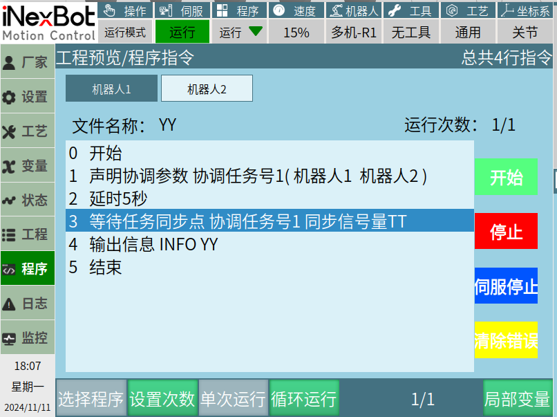
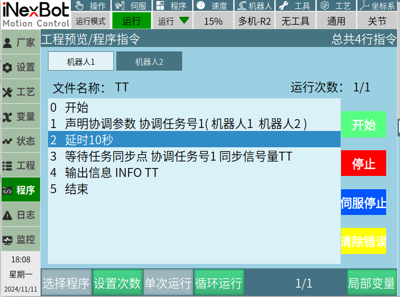
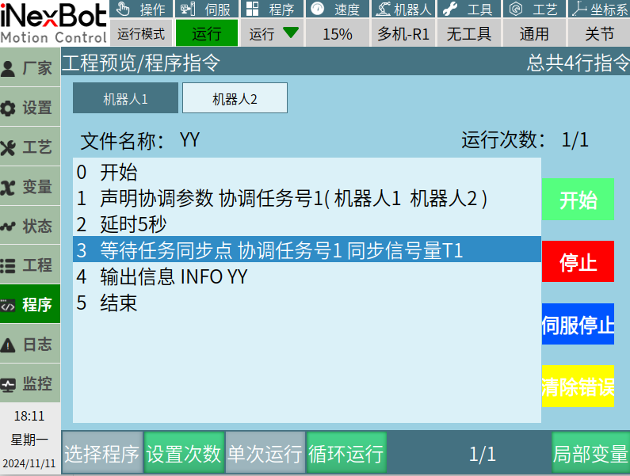
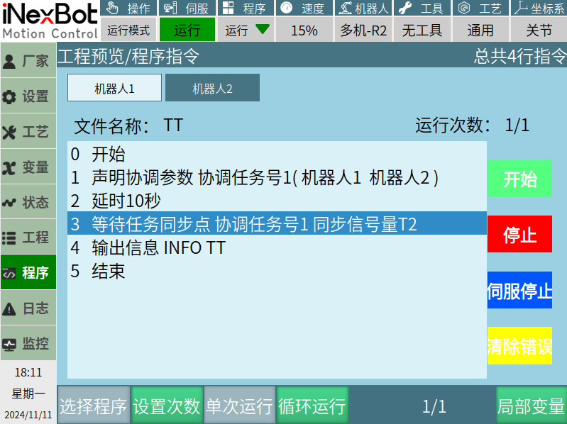

# 多机协调类（已完成）

## TASKS-协调任务号

格式：TASKS【指令名】ID【协调任务号】ROBOT1【轴组】

功能：功能：选择需协调同步的机器人，确认任务号

参数：
| 参数 | 值 | 注释 |
| :--- | :--- | :--- |
| **协调任务号** | 1-999或绑定变量 | 1-999或绑定变量 |
| **轴组** | 1、自选：在机器人1、2、3、4前面打√，选中对应的机器人。  2、更多——变量：  • 机器人1 → 变量数值 1  • 机器人1、2 → 变量数值 2  • 机器人1、2、3 → 变量数值 4  • 机器人1、2、3、4 → 变量数值 8  选择多个机器人时，将对应机器人的变量数值相加即可。 | |

## WAIT_SYNC_TASK-等待任务同步点

格式：WAIT_SYNC_TASK【指令名】Task_ID【协调任务号】ID=1【同步信号量】

功能：判断多机机器人，正在运行中的作业文件，是否同时运行到等待任务同步点指令位置。对比同步信号量，一样就往下继续运行，不一样就会一直停留在等待任务同步点位置。

| 参数 | 值 | 注释 |
| :--- | :--- | :--- |
| **协调任务号** | 1-999或绑定变量 | 需要与声明协调参数的任务号保持一致。 |
| **同步信号量** | 可填写字母、中文、数字、字符；与字符型变量的填写标准一致 | 跟其他机器人内的同步信号量一致的时候，机器人才会继续向下运行，不一致时就会一直停留在这条指令。 |

## **多机协调示例说明**

### **环境：多机模式下，机器人之间的同步**

示例1：机器人1、2指令参数一致

 

示例说明：多机模式，运行机器人1、2图片内作业文件，当机器人1运行到等待任务同步点指令的时候，机器人2未运行到等待任务同步点，机器人1会停留在等待任务同步点指令位置，一直到机器人2也运行到等待任务同步点指令，机器人1、2，才会继续向下运行。否则将会一直停留在等待任务同步点指令。

 示例2：机器人1、2指令参数不一致

示例说明：机器人1等待任务同步点指令内同步信号量为T1，机器人2等待任务同步点指令内同步信号量为T2，机器人1、2同时或者先后运行到等待任务同步点指令，因为同步信号量不一致，所以机器人1、2会一直停留在等待任务同步点指令，不再往下运行。

## AI 检索专用问答对 (Q&A for Retrieval)

**Q: TASKS指令的作用是什么？**

A:TASKS指令用于在多机模式下选择需要参与协调同步的机器人，并确认当前使用的协调任务号。它是多机协调的声明指令，必须先于WAIT_SYNC_TASK执行。

**Q: WAIT_SYNC_TASK指令的作用是什么？**

A:该指令是一个同步等待点。当多台机器人各自运行作业文件到达该指令时，会对比各自的同步信号量是否一致。如果一致，所有机器人继续向下执行；如果不一致，到达的机器人会一直停留在该指令处等待，直到所有参与协调的机器人的同步信号量都相同为止。

**Q: WAIT_SYNC_TASK指令的作用是什么？**

A:TASKS负责声明"哪些机器人参与协调"和"协调任务号是多少"，WAIT_SYNC_TASK负责在程序运行中设置实际的同步等待点。两者需配合使用，且WAIT_SYNC_TASK中的协调任务号必须与TASKS中声明的保持一致。

**Q: 机器人运行到WAIT_SYNC_TASK后长时间停留不动，可能的原因有哪些？**

A：可能原因包括：

1、其他参与协调的机器人尚未运行到对应的WAIT_SYNC_TASK指令；

2、其他参与协调的机器人作业文件中未配置该同步点；

3、参与机器人的同步信号量设置不一致（注意大小写、全半角差异）；

4、TASKS中声明的协调任务号与WAIT_SYNC_TASK中的任务号不一致；

5、TASKS中未正确选择所有参与协调的机器人。

## 版本历史

| 版本 | 日期 | 变更内容 | 作者 |
| :--- | :--- | :--- | :--- |
| 1.0.0 | 2026-07-06 | 初始版本 | liweiqi |