# 工具手标定

## 工具坐标系

**什么是工具坐标系？**

法兰盘中心：默认工具坐标系的原点，法兰盘中心指向法兰盘定位孔方向为+X方向，垂直法兰向外为+Z方向，最后根据右手法则即可判定Y方向。新的工具坐标系都是相对默认的工具坐标系变化得的。

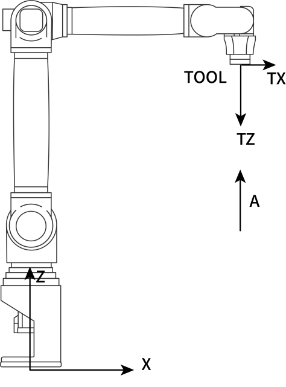

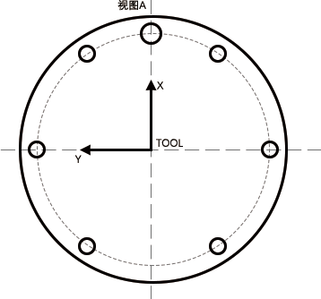

### 为什么要建立工具坐标系？

1.  机器人都有一个默认的工具坐标系Tool
    0：位置在法兰中心。但是机器人在实际运动中往往会在法兰中心安装吸盘（图一所示）、焊枪（图二所示）等工具。此时若机械手运动中心依然在法兰中心，会造成很大的不便。因此根据实际情况去示教需要的工具坐标系就很有必要。

例如：焊接时，需要在机器人末端（法兰中心）安装焊枪，用户通常把TCP点定义到焊丝的尖端。那么程序里记录的位置便是焊丝尖端的位置，记录的姿态便是焊枪围绕焊丝尖端转动的姿态。

2.  对于工业机器人，需要在末端法兰盘安装工具来进行作业。为了确定该工具的位姿，在安装的工件上上绑定一个工具坐标TCS
    (Tool Coordinate System)，TCS的原点就是TCP（Tool Center
    Point，工具中心点）。

TCP：TOOL CENTER POINT，即工具中心点。

机器人轨迹及速度：指TCP点的轨迹和速度。

TCP一般设置在手爪中心，焊丝端部，点焊静臂前端等等。

工业机器人一般都事先定义了一个TCP，TCP的XY平面绑定在机器人第六轴的法兰盘平面上，TCP的原点与法兰盘中心重合。显然TCP在法兰盘中心。ABB机器人把TCP称为Tool0，REIS机器人称之为 \_tnull。虽然可以直接使用默认的TCP，但是在实际使用时，比如焊接，用户通常把TCP点定义到焊丝的尖端（实际上是焊枪Tool的坐标系在Tool0坐标系的位姿），那么程序里记录的位置便是焊丝尖端的位置，记录的姿态便是焊枪围绕焊丝尖端转动的姿态。

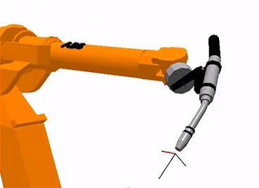

**工具坐标系特点：**

新的工具坐标系是相对于默认的工具坐标系变化得到的，新的工具坐标系的位置和方向始终同法兰盘保持绝对的位置和姿态关系，但在空间上是一直变化的。 

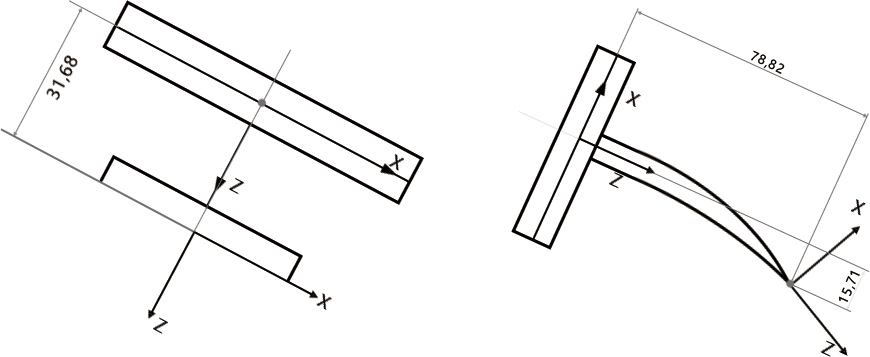

|  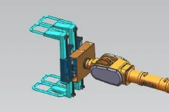 |  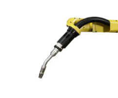 |
|:------:|:------:|
| **X** | **✓** |

注：对于工具无尖端无法对准标定锥的情况，使用夹抓夹住特定尖状物体，也可以做标定，标定精度取决于尖状物体如何放置。

机器人本体参数准确，如何选择标定方式：

| 标定方式 | 功能 | 适用条件 |
|:---------:|:------|:------|
| 6点标定 | 标定工具手尺寸 标定工具手末梢姿态 | 在机器人参数精准的情况下：标定工具手尺寸+姿态，标定结果旋转C轴精度较好 |
| 7点标定 | 标定工具手尺寸 标定工具手末梢姿态 | 在机器人参数精准的情况下：标定工具手尺寸+姿态，标定结果旋转A、B轴精度较好 |
| 12点标定 | 修正零点2、3、4、5轴 标定工具手尺寸 | 校准零点 + 标定工具尺寸 |
| 15点标定 | 修正2、3、4、5轴零点 标定工具手尺寸 标定工具手末梢姿态 | 校准零点 + 标定工具尺寸 + 标定工具姿态 |
| 20点标定 | 修正2、3、4、5轴零点 标定工具手尺寸 | 先拿标定锥标定20点校准零点后，再使用工具手标定6、7点 |

## 适用场景

机器人在工作时X、Y、Z轴需要绕着A、B、C姿态轴旋转时，就需要标定工具手，例如焊接工艺、打磨工艺、喷涂工艺等。

### 不同情景工具手标定方式的选择

1.  机器人已做过激光标定+使用焊枪。

推荐：使用6点标定工具手即可，标定完成验证机器人标定结果即可。

2.  机器人未做过激光标定+使用焊枪。

推荐：使用12点标定工具手即可，标定完成验证机器人标定结果即可。

3.  标定码垛夹抓。

推荐：优先选择直接填工具尺寸，不知道尺寸的再使用6点标定。

如何6点标定？

准备一尖状物体且可以被夹抓抓住，该物体尽可能放置到夹抓中心，然后找一个带有尖端的标定锥，根据6点标定的步骤进行工具手标定。

1.  机器人零点丢失，按照对位孔标定的零点位置有偏差。

推荐：准备标定工具，该工具末梢尽可能位于6轴法兰中心延长线上、工具尺寸较小；

使用20点标定，校准零点；

20标定后再换上要实际用到的工具手进行6点标定；

标定完成验证机器人标定结果即可。

5.  6点标定后A、B轴旋转误差较大满足不了使用需求。

推荐：更换7点标定。

7.  如何验证标定精度？

示教模式下，工具手标定的末梢对准标定锥，在尖端对准的情况下，选中标定的工具手参数，点动坐标系切换到直角，点动A、B、C轴，看尖端是否对准、偏了多少mm。

8.  如何填写夹爪尺寸？

    准备好夹抓长宽高的参数，

    - 夹抓末梢在X轴上的偏移量填到“x轴方向偏移”。

    - 末梢位于直角X轴正方向上填正值，夹抓末梢在Y轴上的偏移量填到“y轴方向偏移”。

    - 末梢位于直角Y轴正方向上填负值，夹抓末梢在Z轴上的偏移量填到“z轴方向偏移”。

    - 末梢位于直角Z轴正方向上填负值，保存后，验证工具手旋转A、B、C精度。

### 工具手参数

进入设置-工具手标定界面可以进行工具手选择，在左侧下拉框直接选中工具手号，点击右下角的工具标定进入标定界面。

当标定完结果并保存后该界面的工具手参数中的x轴方向偏移、y轴方向偏移、z轴方向偏移会有数值，这些值为标定后对比现在的误差值。

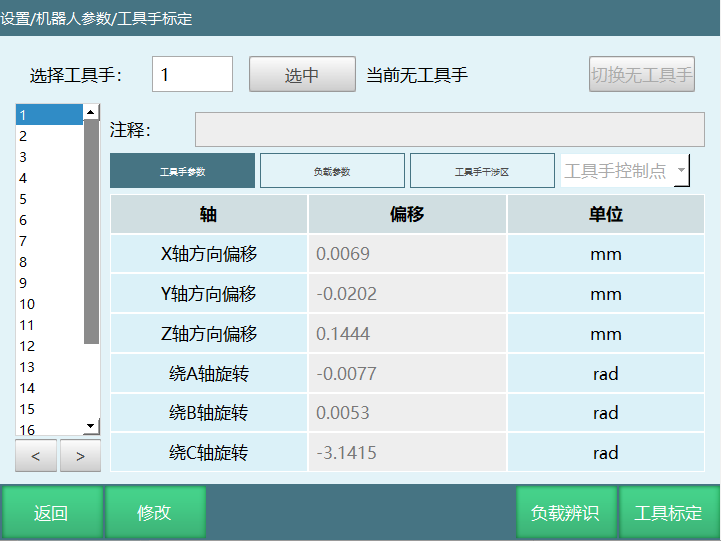

工具手参数：

| 轴 | 偏移 | 单位 |
| :--- | :--- | :--- |
| X轴 | 工具末端相对于法兰中心，沿直角坐标系X轴方向的偏移长度 | 毫米(mm) |
| Y轴 | 工具末端相对于法兰中心，沿直角坐标系Y轴方向的偏移长度 | 毫米(mm) |
| Z轴 | 工具末端相对于法兰中心，沿直角坐标系Z轴方向的偏移长度 | 毫米(mm) |
| A轴 | 工具末端相对于法兰中心，绕直角坐标系X 轴方向旋转角度 | 度/弧度(°/rad) |
| B轴 | 工具末端相对于法兰中心，绕直角坐标系Y 轴方向旋转角度 | 度/弧度(°/rad) |
| C轴 | 工具末端相对于法兰中心，绕直角坐标系Z轴方向的旋转角度 | 度/弧度(°/rad) |

有安装工具的详细参数：

1.  选择工具手编号，点击【修改】，然后填写安装的工具手参数；

2.  点击【确定】；

3.  点击【选中】，此时状态栏上面的工具栏显示的工具手号就是选中的工具号；

4.  在该界面下，用户可以直接填写工具末端偏移的相关参数，不需进行工具手标定。若更换工具手请重新填写；

详细标定过程如下：

### 6点标定

进入设置-机器人参数-工具手标定-工具标定-校准工具尺寸+姿态，标定方式可以选择6点法，如图：

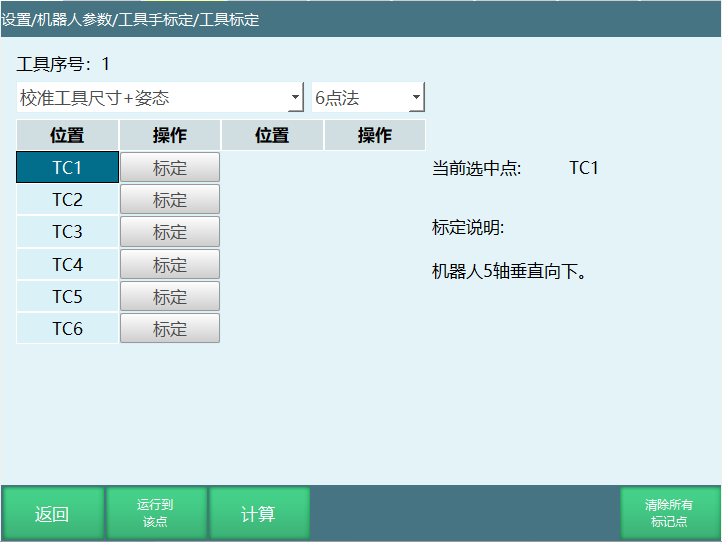

6点标定结束选中标定的任意一点，点击 【运行至该点】，可以查看标定是否准确；

点击【计算】按钮，标定成功。点击底部的【返回】按钮返回“工具手标定”界面，绕ABC旋转可以检查标定的点是否正确；

若在标定过程中对标定的某一点不满意，可以点击该行所对应的【取消标定】按钮，取消标定后再次标定该点。

点击底部的【返回】按钮返回“工具手标定”界面。

标定方法如图：

TCP1:机器人5轴垂直向下；

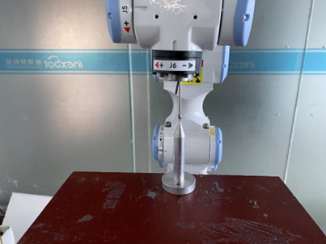

TCP2:机器人在第一点的基础上C轴旋转到180°；

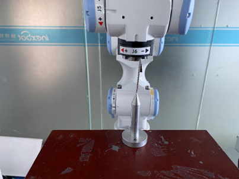

TCP3:机器人在第一点的基础上B轴旋转到35°；

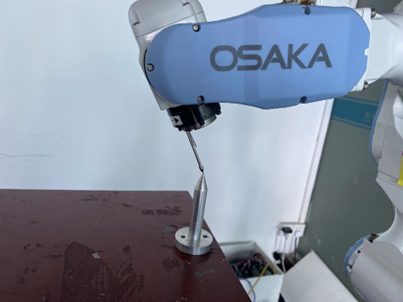

TCP4:机器人回到零点，然后工具手末梢垂直；

TCP5:机器人在第四点的基础上动X-；

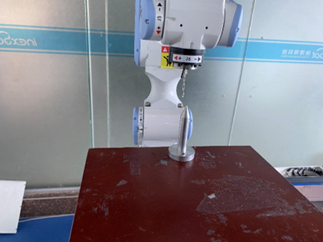

TCP6:机器人在第五点的基础上动Y+。

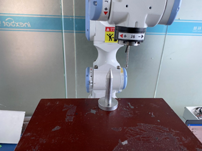

【计算】：六个点标定结束后，点击"计算"会算出计算结果，如果计算结果大于1的话就需要重新标定。

【运行到该点】：选择标记的任意一点，点击"运行到该点"机器人会运行到选择的位置。

【清除所有标记点】：清除所有已标记的6个点位。

【返回】：返回"工具手标定"界面。

若在标定过程中对标定的某一点不满意，可以点击该行所对应的【取消标定】按钮，取消标定后再次标定该点。

何验证标定精度：

示教模式下，工具手标定的末梢对准标定锥，在尖端对准的情况下，选中标定的工具手参数，点动坐标系切换到直角，点动A、B、C轴，看尖端是否对准、偏了多少mm。

### 7点标定

点击校准工具尺寸+姿态-7点法，进入七点标定界面，如图。

点击 【运行到该点】，可以查看标定是否准确；

点击【计算】按钮，标定成功；

点击【清除所有标记点】可以将所有标定的值清除重新进行标定；

若在标定过程中对某点标定后不满意，可以点击该行所对应的【取消标定】按钮，取消标定后再次标定该点。

点击底部的【返回】按钮可以返回“工具手标定”界面。

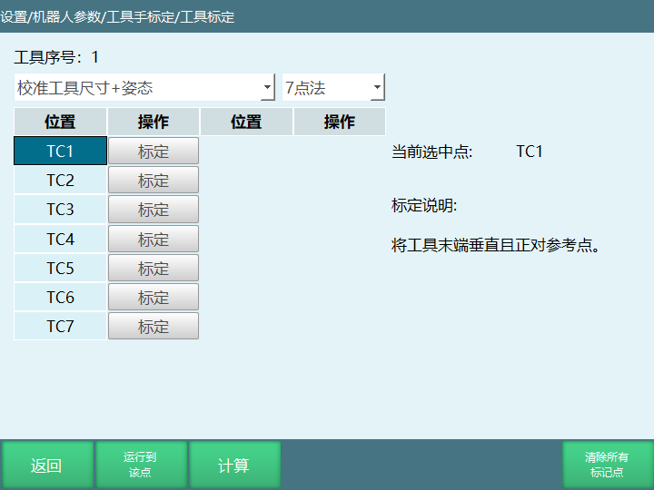

若没有工具的详细参数，可以进行TCP标定，自动计算出工具各项尺寸参数。具体标定步骤如下：

现在以笔尖为参考点，并确保此参考点固定，如下图所示。

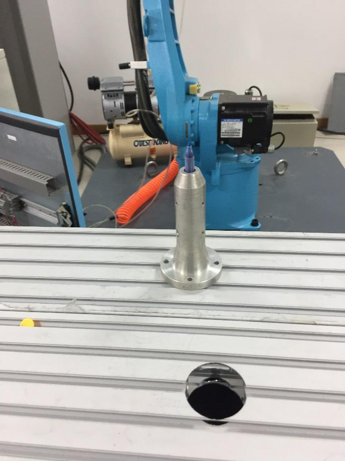

TCP1:将工具末端垂直且正对参考点, 点击界面“TC1”所对应的【标定】按钮，如下图所示：

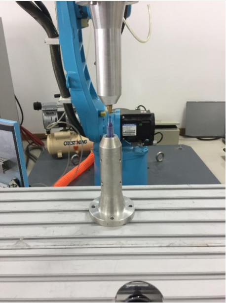

TCP2:将机器人切换一个姿势，末端正对参考点，点击该行所对应的【标定】按钮，如下图所示：

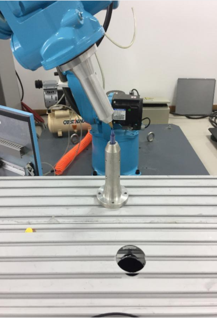

TCP3:将机器人切换一  个姿势，末端正对参考点，点击该行所对应的【标定】按钮，如下图所示：

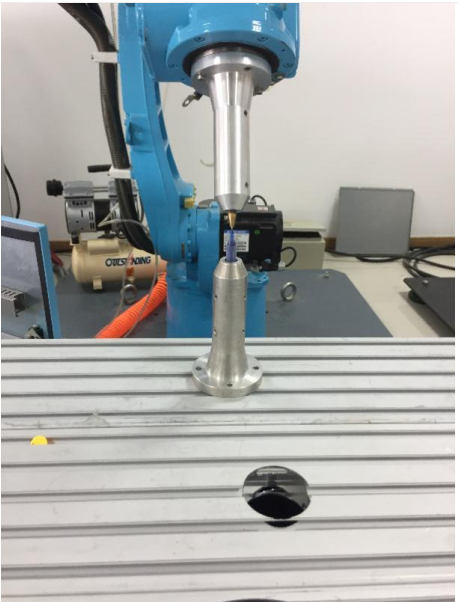

TCP4:将机器人切换一个姿势，末端正对参考点，点击该行所对应的【标定】按钮，如下图所示：

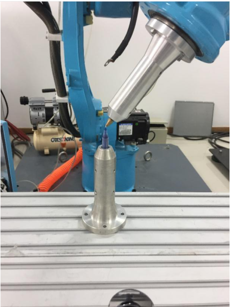

TCP5:将工具末端垂直且正对参考点（同TCP1），点击该行所对应的【标定】按钮，如下图所示：    

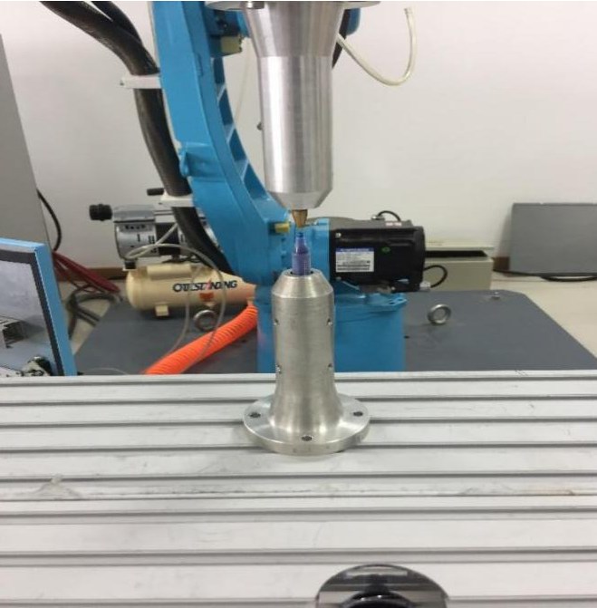

TCP6:在TCP5的基础上，沿笛卡尔坐标系X轴负方向移动任意距离，点击该行所对应的【标定】按钮，如下图所示：

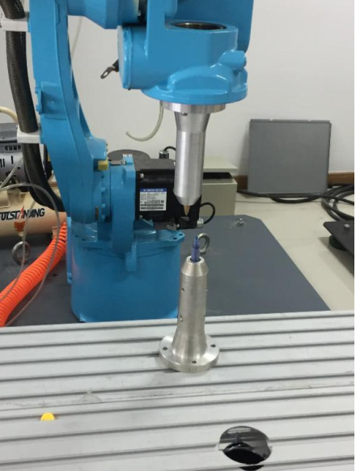

TCP7:在TCP6的基础上，沿笛卡尔坐标系Y轴正方向移动任意距离，点击该行所对应的【标定】按钮，如下图所示：

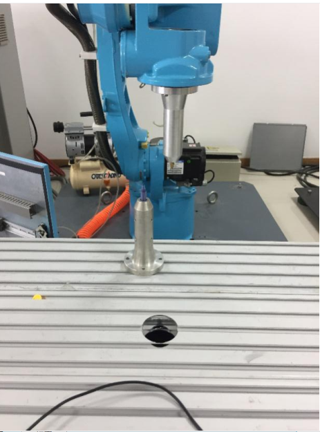

【计算】：七个点标定结束后，点击"计算"会算出计算结果，如果计算结果大于1的话就需要重新标定。

【运行到该点】：选择标记的任意一点，点击"运行到该点"机器人会运行到选择的位置。

【清除所有标记点】：清除所有已标记的7个点位。

【返回】：返回"工具手标定"界面。

若在标定过程中对标定的某一点不满意，可以点击该行所对应的【取消标定】按钮，取消标定后再次标定该点。

### 12点标定

12点标定结果只有工具手的XYZ轴方向偏移，无绕ABC旋转的数值。点击“工具标定”的校准零点+工具尺寸-12点法进入标定界面，如图：

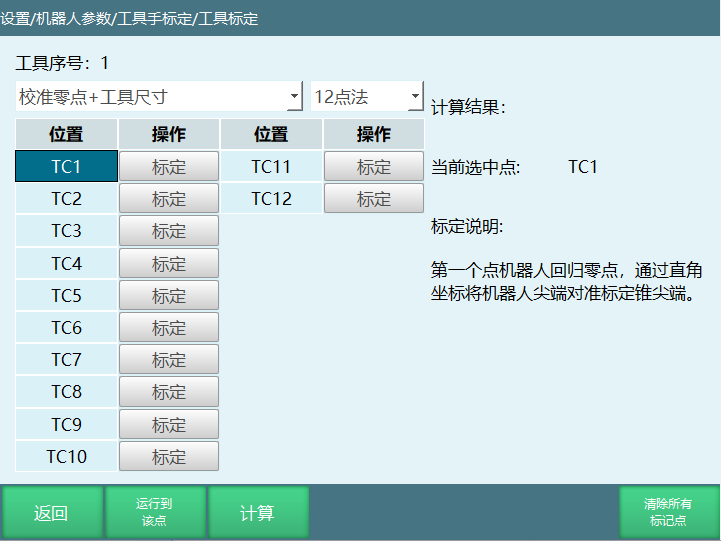

具体标定步骤如下：

找到一个参考点（标定锥尖端为参考点），并确保此参考点固定；

开始插入位置点，每插入一点，点击【标记该点】。

具体步骤如下：

TCP1:第一个点机器人回归零点，通过直角坐标将机器人尖端对准标定锥尖端，标定第一个点；

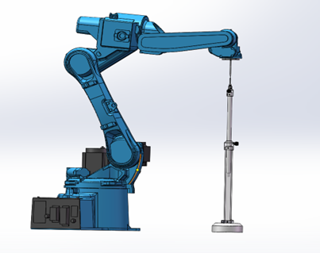

TCP2:第二个点在第一个点的基础上，通过直角坐标系将C旋转180度；尖端对齐标定第二点；

TCP3:第三个点机器人回归零点，通过直角坐标系将机器人尖端对准标定锥尖端；标定第三个（与第一个点相同）；

TCP4:第四个点在第三个点的基础上，通过直角坐标系做B-，度数位于30°-60°，尖端对齐标定第四个点；

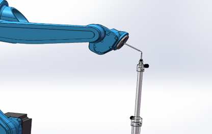

TCP5:第五个点在第四个点的基础上，通过直角坐标系做B+，J5\>-90°,将机器人尖端对准标定锥 尖端，标定第五个点；

TCP6:第六个点选中第一个点，并将机器人移动到第一个点，在第一个点的基础上，通过直角坐标系做B+，J5\>-90°,尖端对齐标定第六个点；

TCP7:第七个点在第一个点的基础上，通过直角坐标系做B-，J5\>-90°,尖端对齐标定第七个点；

TCP8:第八个点在第七个点的基础上，通过直角坐标系做A+，旋转90°，J5\>-90°,尖端对齐标定第八个点；

TCP9:第九个点在第七个点的基础上，通过直角坐标系做A-，旋转90°，J5\>-90°,尖端对齐标定第九个点；

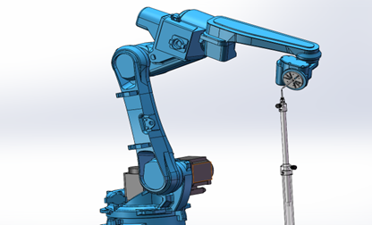

TCP10:第十个点机器人回到第一个点，通过关节坐标系点动五轴，使五轴向上,J5\<-90°,将尖端对齐，标定第十个点；

TCP11:第十一个点机器人在第十个点的基础上，通过直角坐标系做A+，旋转90°，J5\<-90°,尖端对齐标定第十一个点；

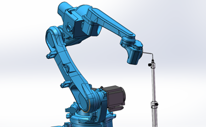

TCP12:第十二个点机器人在第十个点的基础上，通过直角坐标系做A-，旋转90°，J5\<-90°,尖端对齐标定第十二个点；

完成标记后，点击【计算】。

【取消标定】：若在标定过程中对某点标定后不满意，可以点击该行所对应的【取消标定】按钮，取消标定后再次标定该点；

【运行到该点】：每标定完一个点可以点击【运行到该点】，则机器人会运行到该点；

【将结果位置标为零点】：将标定补偿后的位置设置为当前机器人的零点位置；

【清除所有标定点】：标定点位会保存到控制器中，只有点击取消标定、清除所有标定点以及切换工具手进标定界面后，标定结果才会清除。

点击底部的【返回】按钮，可以返回“工具手标定”界面。

### 15点标定

15点标定结果只有工具手的XYZ轴方向偏移，无绕ABC旋转的数值。点击“工具标定”的校准零点+工具尺寸+姿态-15点法进入标定界面，如图。

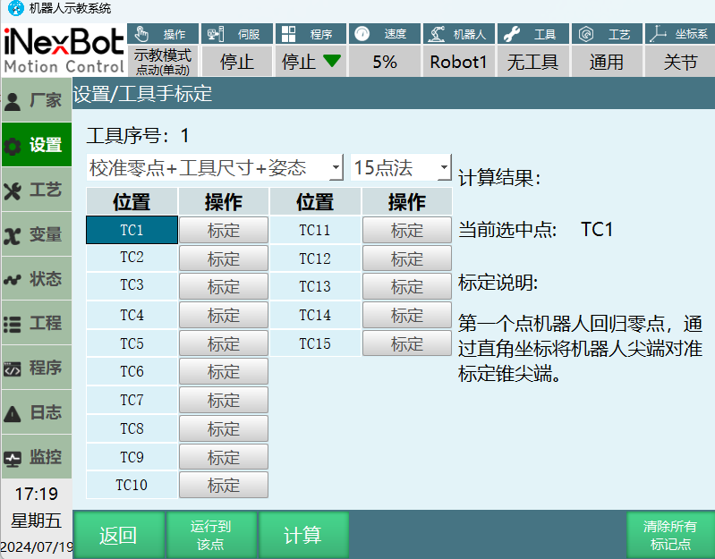

具体标定步骤如下：

找到一个参考点（标定锥尖端为参考点），并确保此参考点固定；

开始插入位置点，每插入一点，点击【标记该点】，插入十五个点。

具体步骤如下：

TCP1:第一个点机器人回归零点，通过直角坐标将机器人尖端对准标定锥尖端，标定第一个点；

TCP2:第二个点在第一个点的基础上，通过直角坐标系将C旋转180度；尖端对齐标定第二点；

TCP3:第三个点机器人回归零点，通过直角坐标系将机器人尖端对准标定锥 尖端；标定第三个；（与第一个点相同）

TCP4:第四个点在第三个点的基础上，通过直角坐标系做B-，度数位于30°-60°，尖端对齐标定第四个点；

TCP5:第五个点在第四个点的基础上，通过直角坐标系做B+，J5\>-90°,将机器人尖端对准标定锥 尖端，标定第五个点；

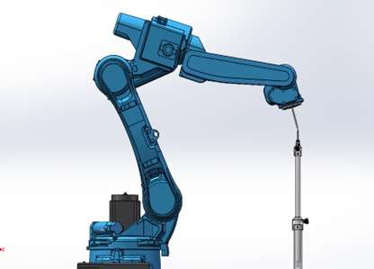

TCP6:第六个点选中第一个点，并将机器人移动到第一个点，在第一个点的基础上，通过直角坐标系做B+，J5\>-90°,尖端对齐标定第六个点；

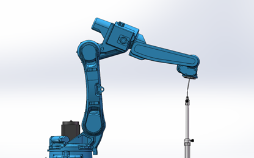

TCP7:第七个点在第一个点的基础上，通过直角坐标系做B-，J5\>-90°,尖端对齐标定第七个点；

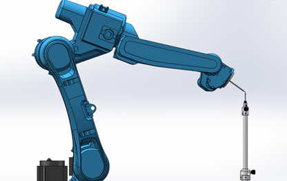

TCP8:第八个点在第七个点的基础上，通过直角坐标系做A+，旋转90°，J5\>-90°,尖端对齐标定第八个点；

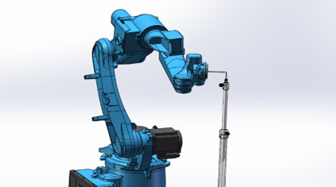

TCP9:第九个点在第七个点的基础上，通过直角坐标系做A-，旋转90°，J5\>-90°,尖端对齐标定第九个点；

TCP10:第十个点机器人回到第一个点，通过关节坐标系点动五轴，使五轴向上,J5\<-90°,将尖端对齐，标定第十个点；

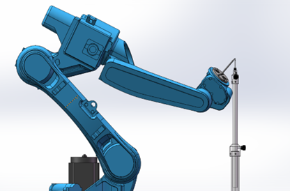

TCP11:第十一个点机器人在第十个点的基础上，通过直角坐标系做A+，旋转90°，J5\<-90°,尖端对齐标定第十一个点；

TCP12:第十二个点机器人在第十个点的基础上，通过直角坐标系做A-，旋转90°，J5\<-90°,尖端对齐标定第十二个点；

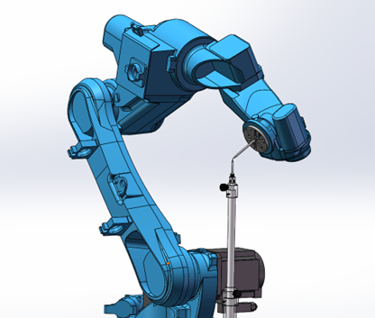

TCP13:第十三个点机器人回到零点位置，调整机器人姿态，使机器人末端工具尖端竖直朝下，将标定尖端与标定锥 对齐，标定第十三个点；

TCP14:第四个个点机器人在第十三个点的基础上，通过直角坐标系做X-，机器人位移一段距离，直接点击标定第十四点；

TCP15:第十五个点机器人在第十四个点的基础上，通过直角坐标系做Y+，机器人位移一段距离，直接点击标定第十五点；

完成标记后，点击【计算】。

【取消标定】：若在标定过程中对某点标定后不满意，可以点击该行所对应的【取消标定】按钮，取消标定后再次标定该点；

【运行到该点】：每标定完一个点可以点击【运行到该点】，则机器人会运行到该点；

【将结果位置标为零点】：将标定补偿后的位置设置为当前机器人的零点位置；

【清除所有标定点】：标定点位会保存到控制器中，只有点击取消标定、清除所有标定点以及切换工具手进标定界面后，标定结果才会清除。

点击底部的【返回】按钮，可以返回“工具手标定”界面。

| ⚠️ 注意事项 |
|:---|
| 各点的姿态，请尽量取**任意方向**的姿态。 若姿态沿某一固定方向旋转，可能会导致精度不准确。 |
| 标定过程中，请**保持参考点固定**，否则会增大标定误差。 |

### 20点标定

点击“工具标定”，选择校准零点+工具尺寸-20点法的按钮，进入“二十点标定”界面，如图。

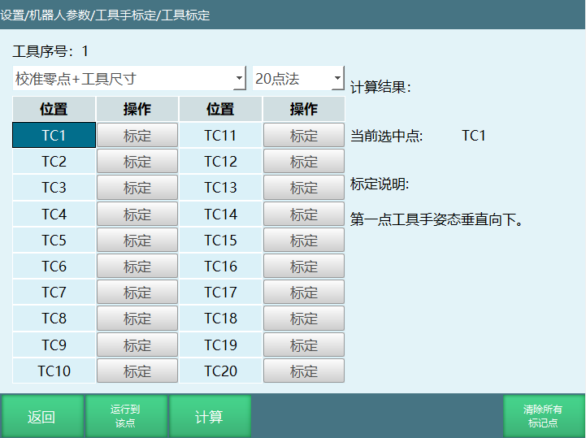

具体标定步骤如下：

找到一个参考点（笔尖为参考点），并确保此参考点固定；

开始插入位置点，每插入一点，点击【标记该点】，插入20个点，每个点的姿态差异越大越好；

厂家建议：标定步骤，第一点工具手姿态垂直向下，第二点走A+轴，第三点走A+，第四点走A+，第五点走A-，第六点走A-，第七点走A-，第八点走B+，第九点走B+，第十点走B+，第十一点走B-，第十二点走B-，第十三点走B-，其余点主要动C轴成米字形排布标定。

**具体标定步骤如下：**

TCP1:第一点机器人，机器人工具手末端垂直参考点；

TCP2:第二点机器人，机器人在第一点的基础上动A+；

TCP3:第三点机器人，机器人在第一点的基础上动A+ 40度；

TCP4:第四点机器人，机器人在第一点的基础上动A+ 60度；

TCP5:第五点机器人，机器人在第一点基础上动A- 20度；

TCP6:第六点机器人，机器人在第一点基础上动A- 40度；

TCP7:第七点机器人，机器人在第一点基础上动A- 60度；

TCP8:第八点机器人，机器人在第一点基础上动B+ 20度；

TCP9:第九点机器人，机器人在第一点基础上动B+ 30度；

TCP10:第十点机器人，机器人在第一点基础上动B+ 40度；

TCP11:第十一点机器人，机器人在第一点基础上动B- 20度；

TCP12:第十二点机器人，机器人在第一点基础上动B- 30度；

TCP13:第十三点机器人，机器人在第一点基础上动B- 40度；

TCP14:第十四点机器人，机器人在第一点基础上动C+ 30度；

TCP15:第十五点机器人，机器人在第一点基础上动C+ 50度；

TCP16:第十六点机器人，机器人在第一点基础上动C+ 70度；

TCP17:第十七点机器人，机器人在第一点基础上动C+ 90度；

TCP18:第十八点机器人，机器人在第一点基础上动C- 30度；

TCP19:第十九点机器人，机器人在第一点基础上动C- 60度；

TCP20:第二十点机器人，机器人在第一点基础上动C- 90度。

【计算】：标定完成后点击计算，计算出标定结果，如果计算出来的数值较大的话，就需要重新标定。

【取消标定】：若在标定过程中对某点标定后不满意，可以点击该行所对应的【取消标定】按钮，取消标定后再次标定该点。

【运行到该点】：每标定完一个点可以点击【运行到该点】，则机器人会运行到该点。

【将结果位置标为零点】：将标定补偿后的位置设置为当前机器人的零点位置。

【清除所有标定点】：标定点位会保存到控制器中，只有点击取消标定、清除所有标定点以及切换工具手进标定界面后，标定结果才会清除 。

点击“工具标定”，选择校准工具尺寸+姿态-20点法的按钮，进入“二十点标定”不标定零点界面，如图：

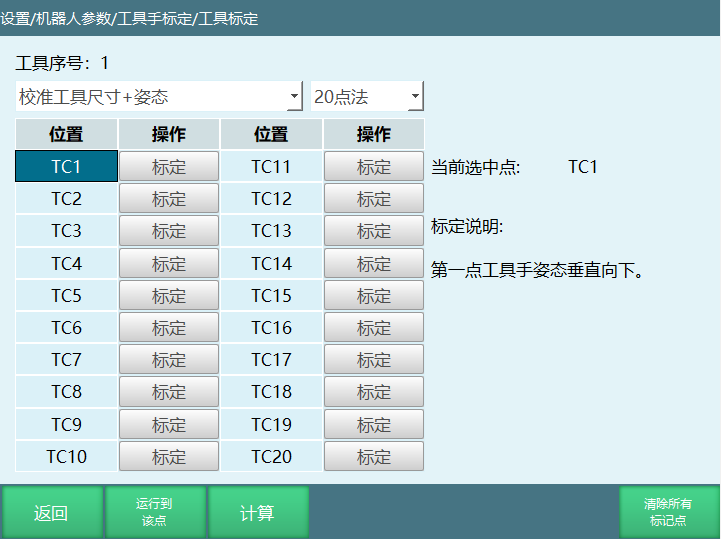

**具体标定步骤如下：**

TCP1:第一点机器人，机器人工具手末端垂直参考点；

TCP2:第二点机器人，机器人在第一点的基础上动A+；

TCP3:第三点机器人，机器人在第一点的基础上动A+ 40度；

TCP4:第四点机器人，机器人在第一点的基础上动A+ 60度；

TCP5:第五点机器人，机器人在第一点基础上动A- 20度；

TCP6:第六点机器人，机器人在第一点基础上动A- 40度；

TCP7:第七点机器人，机器人在第一点基础上动A- 60度；

TCP8:第八点机器人，机器人在第一点基础上动B+ 20度；

TCP9:第九点机器人，机器人在第一点基础上动B+ 30度；  

TCP10:第十点机器人，机器人在第一点基础上动B+ 40度；

TCP11:第十一点机器人，机器人在第一点基础上动B- 20度；

TCP12:第十二点机器人，机器人在第一点基础上动B- 30度；

TCP13:第十三点机器人，机器人在第一点基础上动B- 40度；

TCP14:第十四点机器人，机器人在第一点基础上动C+ 30度；

TCP15:第十五点机器人，机器人在第一点基础上动C+ 50度；

TCP16:第十六点机器人，机器人在第一点基础上动C+ 70度；

TCP17:第十七点机器人，机器人在第一点基础上动C+ 90度；

TCP18:第十八点机器人，机器人在第一点基础上动C- 30度；

TCP19:第十九点机器人，机器人在第一点基础上动x-；

TCP20:第二十点机器人，机器人在第一点基础上动y+。

【计算】：标定完成后点击计算，计算出标定结果，如果计算出来的数值较大的话，就需要重新标定。

【取消标定】：若在标定过程中对某点标定后不满意，可以点击该行所对应的【取消标定】按钮，取消标定后再次标定该点。

【运行到该点】：每标定完一个点可以点击【运行到该点】，则机器人会运行到该点。

【清除所有标定点】：标定点位会保存到控制器中，只有点击取消标定、清除所有标定点以及切换工具手进标定界面后，标定结果才会清除。

20个点不标定零点标定尺寸+姿态；运行到计算结果位置始终置灰，可以将计算结果保存。

| ⚠️ 注意事项 |
|:---|
| 各点的姿态，请尽量取**任意方向**的姿态。 若姿态沿某一固定方向旋转，可能会导致精度不准确。 |
| 标定过程中，请**保持参考点固定**，否则会增大标定误差。 |

### 如何验证标定精度

示教模式下，工具手标定的末梢对准标定锥，在两个尖端对准的情况下，选中标定的工具手工具手编号，然后在直角坐标系下点动A、B、C轴，看尖端是否对准、偏了多少mm。
 

# Q＆A

**Q: 什么是工具坐标系？**

A: 工具坐标系是机器人末端工具的坐标系，原点是TCP（工具中心点），用于确定工具的位姿。

**Q: 为什么要建立工具坐标系？**

A: 1. 确立工具的TCP点，方便调整工具状态；2. 确定工具进给方向，方便工具位置调整。

**Q: 什么情况下需要使用工具手标定？**

A: 需要用到绕X、绕Y、绕Z的姿态旋转时，需要进行工具手标定，例如焊接工艺、打磨工艺、喷涂工艺等。

**Q: 什么情况下无需使用工具手？**

A: 机器人本身仅做Z轴姿态旋转，且工具末梢位于机器人6轴法兰中心延长线上；此时可以不设置工具手参数。

**Q: 如何选择工具手标定方式？**

A: 1. 已做过激光标定+使用焊枪：使用6点标定；2. 未做过激光标定+使用焊枪：使用12点标定；3. 标定码垛夹抓：优先选择直接填工具尺寸；4. 零点丢失：使用20点标定；5. 6点标定后A、B轴旋转误差大：使用7点标定。

**Q: 如何直接填写夹爪尺寸？**

A: 准备好夹抓长宽高的参数，将夹抓末梢在X、Y、Z轴上的偏移量分别填到对应的偏移字段中，注意X轴正方向为正值，Y、Z轴正方向为负值。

**Q: 6点标定的步骤是什么？**

A: 1. TC1：机器人5轴垂直向下；2. TC2：在第一点基础上C轴旋转180°；3. TC3：在第一点基础上B轴角度在35°；4. TC4：机器人回到零点，工具手末梢垂直；5. TC5：在第四点基础上动X-；6. TC6：在第五点基础上动Y+；最后点击计算。

**Q: 如何验证标定精度？**

A: 示教模式下，工具手标定的末梢对准标定锥，在尖端对准的情况下，选中标定的工具手参数，点动坐标系切换到直角，点动A、B、C轴，看尖端是否对准、偏了多少mm。

