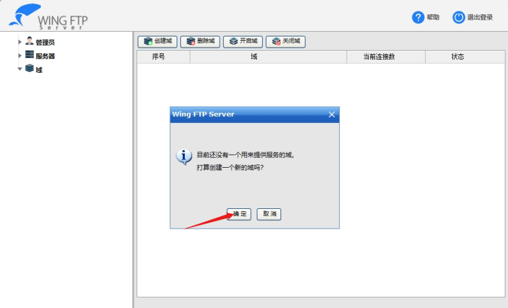
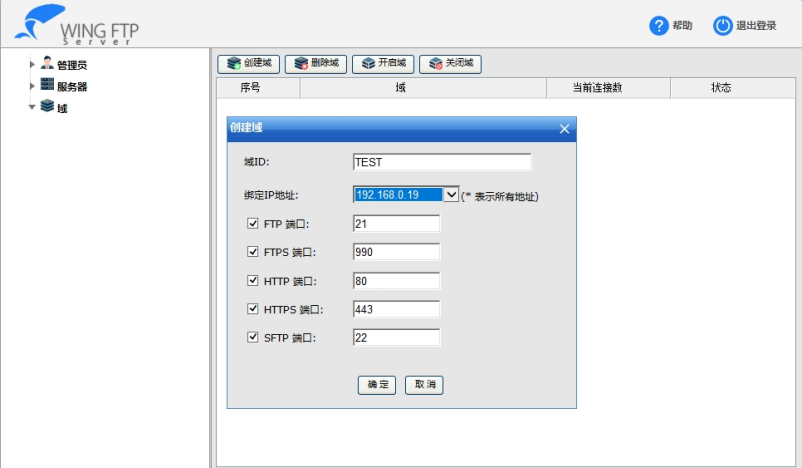
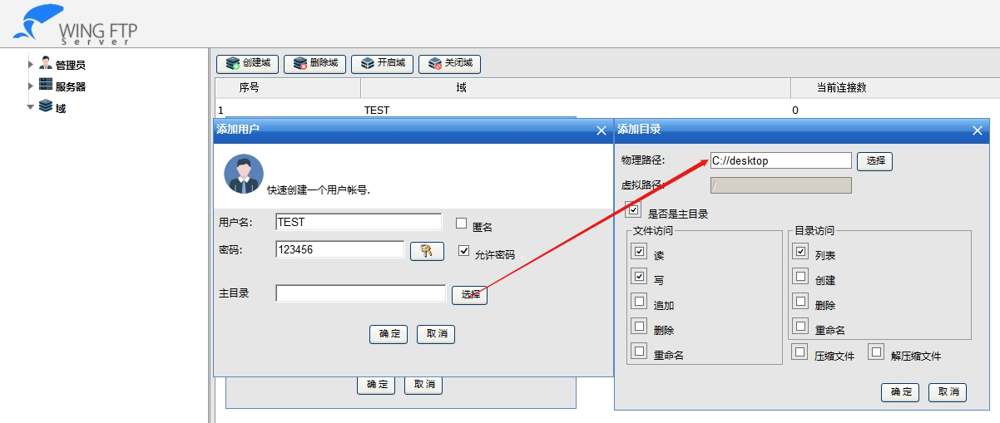
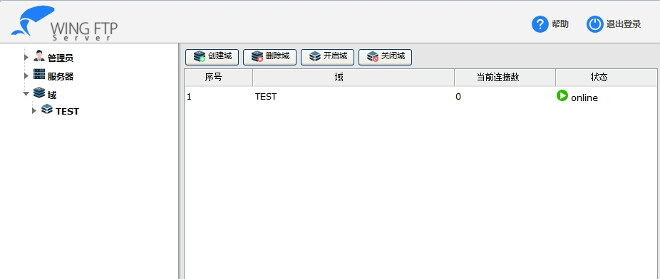
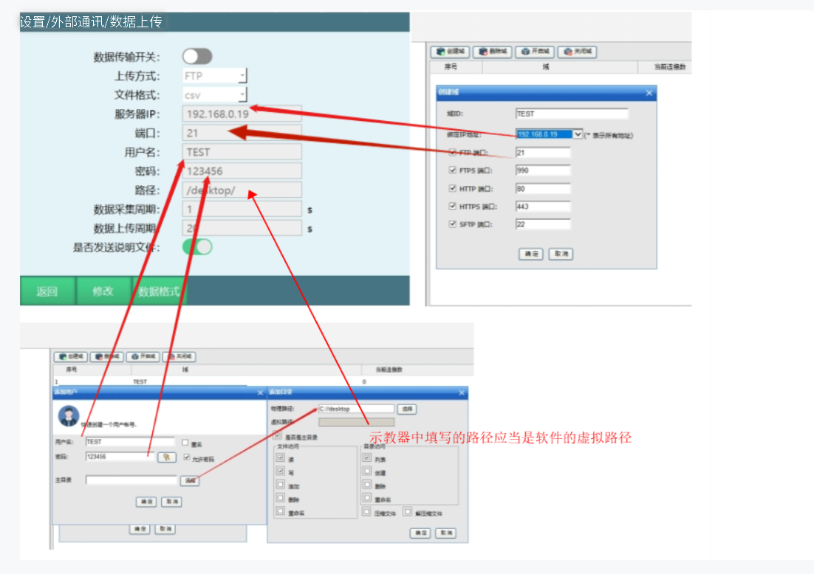
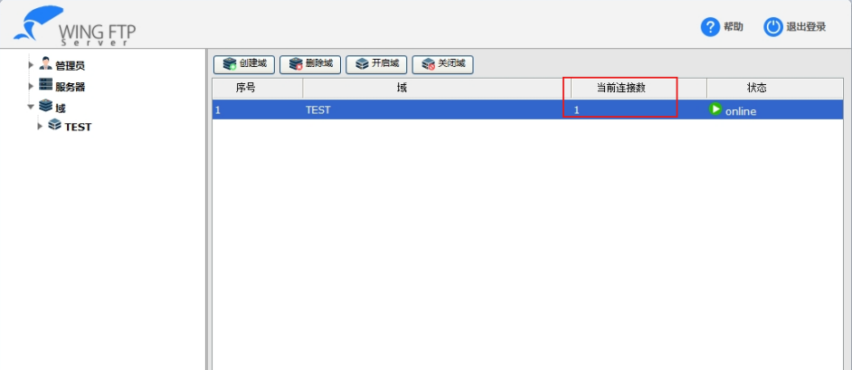
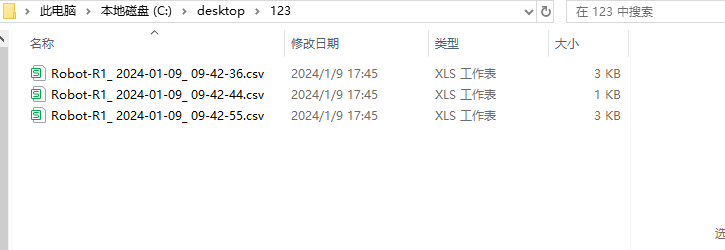

# 数据上传

数据上传功能可以定时自动采集并上传当前机器人运行状态、参数，并将数据整合成csv、txt文件上传到指定服务器。

## 环境准备

| 步骤 | 操作说明 |
| :--- | :--- |
| 安装FTP服务器 | 安装FTP服务器软件 |
| 登录FTP服务器 | 使用管理员账号登录FTP服务器 |
| 创建一个域 | 创建一个新的域，域ID由用户自己创建，绑定的IP地址为本机IPv4地址 |





## 创建用户





| 参数 | 说明 |
| :--- | :--- |
| 用户名 | 由用户定义名称 |
| 密码 | 由用户定义密码 |
| 主目录 | 点击选择，物理路径就是文件上传上来储存的目录，点击选择想要存储的路径，下面选择是权限设置，建议全选（直接最高权限即可），最后点击确定，配置完成 |

## 设置数据上传参数

服务器IP，端口，用户名，密码必须一致。

路径是指在ftp选择路径后再建一个目录，例如：FTP选择的主目录为D://，示教盒数据上传路径为/robot/，则文件存储路径为 D://robot/。



| 参数 | 说明 |
| :--- | :--- |
| 数据传输开关 | 打开后则开始连接ftp服务器并上传数据。在所有参数填写好之后再打开该开关，开关打开后，开机将自动开始采集并上传数据 |
| 上传方式 | 当前仅支持ftp协议。所以在使用本功能之前请先拥有一个ftp服务器 |
| 文件格式 | 当前支持csv与txt格式。其文件内容相同，文件格式不同。csv格式更方便进行数据的统计 |
| 服务器IP | ftp服务器的ip地址，请保证本控制器与ftp服务器在同一个网络内，保证其网关相同（控制器网关在设置-系统设置-IP设置内进行查看和修改） |
| 端口 | ftp服务器的ftp协议所使用的端口。一般的ftp协议使用的默认端口为21 |
| 用户名 | 登录ftp服务器所使用的用户名。需先在ftp服务器处创建好一个用户 |
| 密码 | 登录ftp服务器所使用的密码 |
| 路径 | 文件上传到ftp服务器的路径。本路径是相对于ftp根目录的路径 |
| 数据采集周期 | 根据设定的时间，每隔一定时间，控制器采集一次当前数据并存入要发送的文件中 |
| 数据上传周期 | 根据设定的时间，每隔一定时间，控制器将已采集好数据的文件发送到ftp服务器指定的目录下 |
| 是否发送说明文件 | 说明文件在开机或打开【数据传输开关】后第一次发送数据文件前发送。内容可自定义，一般用来说明当前机器人的序号等信息。若本开关关闭，则不发送说明文件 |

配置完成后再配置想要发送的数据格式，数据格式配置完成后，打开数据传输开关即可自动传输。

连接成功后当前连接数会变成1。



## 数据格式

配置好ftp的连接相关参数后则需要配置发送的数据文件中的数据格式。在设定数据格式时使用特殊字符串代表所需要发送的参数。例如要发送当前的日期，格式如下"2024-01-01"，则需在数据格式中填写如下："$Y%-$m%-$d%"（不包括引号）。

### 特殊字符串说明

| 特殊字符串 | 说明 |
| :--- | :--- |
| $Y% | 年份 |
| $m% | 月份 |
| $d% | 日期 |
| $H% | 小时 |
| $M% | 分钟 |
| $S% | 秒 |
| $IP% | 本机IP地址 |
| $MAC% | 本机MAC地址 |
| $RPM_J1% | 1轴电机转速 |
| $RPM_J2% | 2轴电机转速 |
| $RPM_J3% | 3轴电机转速 |
| $RPM_J4% | 4轴电机转速 |
| $RPM_J5% | 5轴电机转速 |
| $RPM_J6% | 6轴电机转速 |
| $Torsion_J1% | 1轴电机扭矩 |
| $Torsion_J2% | 2轴电机扭矩 |
| $Torsion_J3% | 3轴电机扭矩 |
| $Torsion_J4% | 4轴电机扭矩 |
| $Torsion_J5% | 5轴电机扭矩 |
| $Torsion_J6% | 6轴电机扭矩 |
| $Load_J1% | 1轴电机负载 |
| $Load_J2% | 2轴电机负载 |
| $Load_J3% | 3轴电机负载 |
| $Load_J4% | 4轴电机负载 |
| $Load_J5% | 5轴电机负载 |
| $Load_J6% | 6轴电机负载 |

### 示例配置

希望得到的结果如下：

说明文档文件名：Robot-R1_年-月-日_时-分-秒

说明文档内容：Robot-R1，年-月-日，时：分：秒、本机IP、本机MAC、1轴电机转速、2轴电机转速、3轴电机转速、4轴电机转速、5轴电机转速、6轴电机转速、1轴电机扭矩、2轴电机扭矩、3轴电机扭矩、4轴电机扭矩、5轴电机扭矩、6轴电机扭矩、1轴电机负载、2轴电机负载、3轴电机负载、4轴电机负载、5轴电机负载、6轴电机负载

数据文档文件名：Robot-R1_年-月-日_时-分-秒

数据内容：Robot-R1，年-月-日，时:分:秒、本机IP、本机MAC、1轴电机转速、2轴电机转速、3轴电机转速、4轴电机转速、5轴电机转速、6轴电机转速、1轴电机扭矩、2轴电机扭矩、3轴电机扭矩、4轴电机扭矩、5轴电机扭矩、6轴电机扭矩、1轴电机负载、2轴电机负载、3轴电机负载、4轴电机负载、5轴电机负载、6轴电机负载

所编写的数据格式如下：

说明文档文件名：`Robot-R1_$Y%-$m%-$d%_$H%-$M%-$S%`

说明内容：

```
Robot-R1,$Y%-$m%-$d%,$H%:$M%:$S%,$IP%,$MAC%,$RPM_J1%,$RPM_J2%,$RPM_J3%,$RPM_J4%,$RPM_J5%,$RPM_J6%,$Torsion_J1%,$Torsion_J2%,$Torsion_J3%,$Torsion_J4%,$Torsion_J5%,$Torsion_J6%,$Load_J1%,$Load_J2%,$Load_J3%,$Load_J4%,$Load_J5%,$Load_J6%
```

数据文档文件名：`Robot-R1_$Y%-$m%-$d%_$H%-$M%-$S%`

数据内容：

```
Robot-R1,$Y%-$m%-$d%,$H%:$M%:$S%,$IP%,$MAC%,$RPM_J1%,$RPM_J2%,$RPM_J3%,$RPM_J4%,$RPM_J5%,$RPM_J6%,$Torsion_J1%,$Torsion_J2%,$Torsion_J3%,$Torsion_J4%,$Torsion_J5%,$Torsion_J6%,$Load_J1%,$Load_J2%,$Load_J3%,$Load_J4%,$Load_J5%,$Load_J6%
```

## 注意事项

| 序号 | 说明 |
| :--- | :--- |
| 1 | 涉及轴的参数需要手动输入哪个轴，如1轴转速：$RPM_J%需要在J后面写1，即$RPM_J1% |
| 2 | 文件的命名规则：文件名称中不能包含 \ / : * ? " < > \| 9个特殊字符 |
| 3 | 如果上传方式为csv格式，每一项之间要用英文逗号","分割 |

生成的文件根据创建的路径保存。



## AI 检索专用问答对 (Q&A for Retrieval)

**Q: 数据上传功能的作用是什么？**

A: 数据上传功能可以定时自动采集并上传当前机器人运行状态、参数，并将数据整合成csv、txt文件上传到指定服务器。

**Q: 数据上传功能支持哪种上传方式？**

A: 当前仅支持FTP协议，所以在使用本功能之前请先拥有一个FTP服务器。

**Q: 数据上传功能支持哪些文件格式？**

A: 当前支持csv与txt格式。其文件内容相同，文件格式不同。csv格式更方便进行数据的统计。

**Q: FTP服务器的默认端口是多少？**

A: FTP协议使用的默认端口为21。

**Q: 如何保证控制器与FTP服务器能够正常连接？**

A: 请保证本控制器与FTP服务器在同一个网络内，保证其网关相同（控制器网关在设置-系统设置-IP设置内进行查看和修改）。

**Q: 数据采集周期和数据上传周期有什么区别？**

A: 数据采集周期是指根据设定的时间，每隔一定时间，控制器采集一次当前数据并存入要发送的文件中；数据上传周期是指根据设定的时间，每隔一定时间，控制器将已采集好数据的文件发送到FTP服务器指定的目录下。

**Q: 说明文件什么时候发送？**

A: 说明文件在开机或打开【数据传输开关】后第一次发送数据文件前发送。内容可自定义，一般用来说明当前机器人的序号等信息。

**Q: 如何配置数据格式中的日期？**

A: 使用特殊字符串代表日期，例如要发送当前的日期格式为"2024-01-01"，则需在数据格式中填写"$Y%-$m%-$d%"（不包括引号）。

**Q: 如何配置轴参数的数据格式？**

A: 涉及轴的参数需要手动输入轴号，如1轴转速使用$RPM_J1%，2轴转速使用$RPM_J2%，以此类推。

**Q: 文件命名有什么限制？**

A: 文件名称中不能包含 \ / : * ? " < > \| 9个特殊字符。

**Q: CSV格式的数据文件如何分隔数据项？**

A: 如果上传方式为csv格式，每一项之间要用英文逗号","分割。

**Q: 数据传输开关打开后有什么效果？**

A: 数据传输开关打开后，开机将自动开始采集并上传数据。

**Q: FTP路径的配置规则是什么？**

A: 路径是指在FTP选择路径后再建一个目录，例如：FTP选择的主目录为D://，示教盒数据上传路径为/robot/，则文件存储路径为D://robot/。

**Q: 连接成功的标志是什么？**

A: 连接成功后当前连接数会变成1。

**Q: 数据上传参数中的用户名和密码需要注意什么？**

A: 服务器IP、端口、用户名、密码必须与FTP服务器上配置的一致。

## 版本历史

| 版本 | 日期 | 变更内容 | 作者 |
| :--- | :--- | :--- | :--- |
| 1.0.0 | 2026-06-24 | 初始版本 | qiuzegai |
