# 晶圆工艺

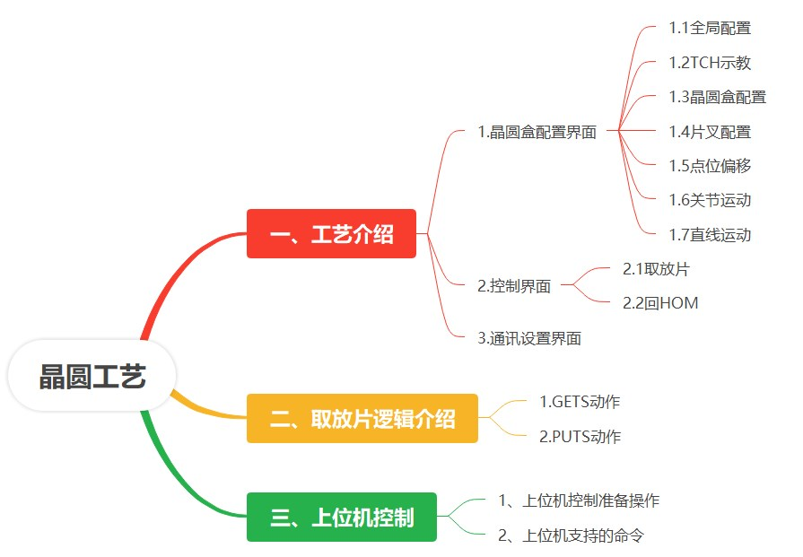

## 一、工艺介绍

晶圆工艺的主要用于实现晶圆机器人在一些半导体处理设备中搬运传输晶圆片，其内容主要包含晶圆盒参数配置、操控动作机械手以及上位机控制通信设置三个模块。

在晶圆工艺下有三个界面，分别是晶圆盒配置界面、控制界面和通讯设置界面。如图所示：

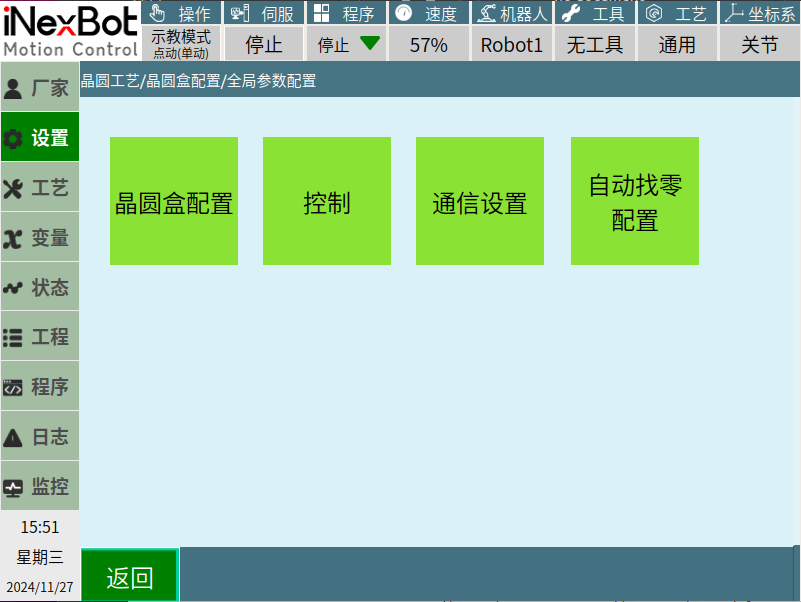

| 模块 | 说明 |
| :--- | :--- |
| 晶圆盒配置 | 配置晶圆盒（FOUP, Front Opening Unified Pod）的数量、类型、尺寸、容量以及位置相关的各种参数。此外，在晶圆盒中进行取放片操作的相关参数（比如运动轨迹、速度及信号检测）也在该模块中配置 |
| 控制 | 控制模块主要用于操作动作机械手，手动调试晶圆工艺逻辑 |
| 通讯设置 | 该模块主要配置上位机控制机械手相关的通讯参数 |

下面分别介绍三个界面及其相应功能：

### 1. 晶圆盒配置界面

#### 1.1 全局配置界面

配置晶圆盒、片叉总数及片叉型号，设置HOM位置坐标。

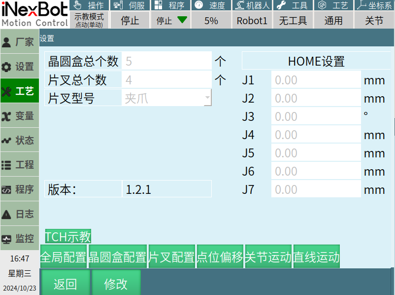

| 参数 | 范围/选项 | 说明 |
| :--- | :--- | :--- |
| 晶圆盒总个数 | \[1, 99\]，默认25个 | 修改晶圆盒总数时，晶圆盒配置界面中的"当前工号"下拉框选项会相应增加或减少。新增加的晶圆盒将以box_xx的形式命名 |
| 片叉总个数 | \[1, 4\]，一般默认4个 | 修改片叉总数时，片叉配置界面中的"当前片叉"下拉框选项也会相应增加或减少，且控制界面中可选的片叉数量也会变化 |
| 片叉型号 | 夹爪 / 吸附 | 选择片叉的类型 |
| HOM设置（关节坐标） | J1, J2, J4, J5, J6, J7: \[-20000, 20000\] mm；J3: \[-500, 5000\] 度 | HOM点是机器人的安全起始位置。机器人完成一个任务后，通常会回到HOM点准备下一个任务 |

> 注：本文档中home、HOME等效于HOM

#### 1.2 TCH示教界面

标记晶圆盒位置坐标。

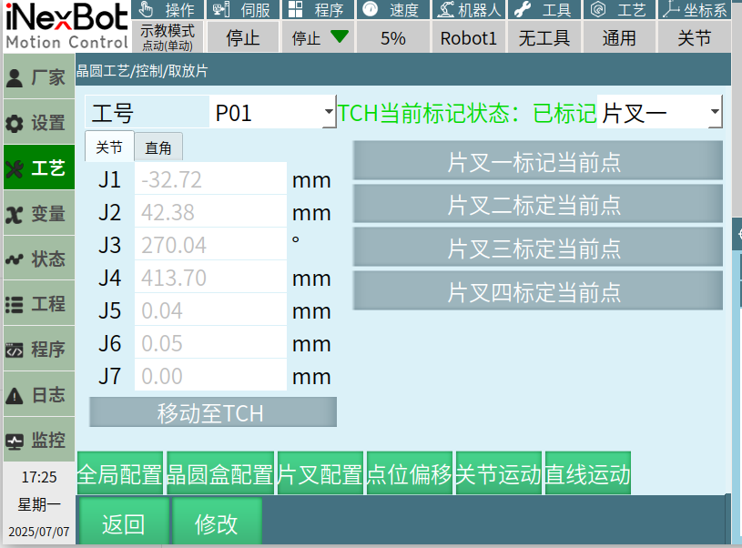

| 参数 | 说明 |
| :--- | :--- |
| 工号 | 可选择的晶圆盒个数与晶圆盒总数一致，名称也保持一致。每个工号均保存该工号下的对应TCH坐标参数 |
| TCH当前标记状态 | 分为"未标记"和"已标记"两种。通过点击"修改"按钮，再点击"保存"或"标记当前点"按钮，可以将状态从"未标记"变为"已标记" |
| 关节坐标 | 范围：J1, J2, J4, J5, J6, J7 为 \[-20000, 20000\] mm；J3 为 \[-20000, 20000\] °。操作：可以手动填写或通过"标记当前点"按钮获取当前位置 |
| 直角坐标 | 范围：X, Y, Z, H 为 \[-20000, 20000\] mm；U 为 \[-3.14, 3.14\] rad。操作：可以手动填写或通过"标记当前点"按钮获取当前位置 |
| 标记当前点 | 在某一工号下点击片叉1标记当前点，会将机器人的当前机器坐标值写入当前工号的片叉1并标记 |
| 移动至TCH | 在伺服就绪状态下，上电后点击"移动至TCH"按钮，机器人会移动到之前标记的TCH点 |

#### 1.3 晶圆盒配置界面

> 配置晶圆盒类型、容量、互锁检测IO参数。

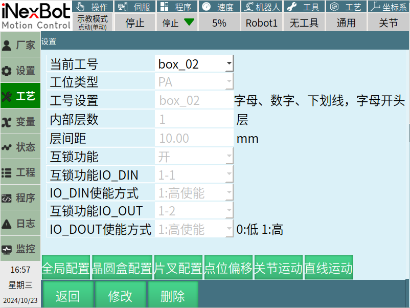

| 参数 | 范围/选项 | 说明 |
| :--- | :--- | :--- |
| 当前工号 | 与晶圆盒总个数一致，默认box_xx | 可通过界面下方的删除按钮移除不需要的工位，但必须至少保留一个工位。当删除最后一个工位时系统报错 |
| 工号类型 | PA（处理应用）/ Cassette（晶圆盒） | 工号的类型 |
| 工号设置（工号名称） | 必须以字母开头，只允许字母、数字、下划线 | 默认以box_xx的形式命名。注意工位名称不可重复，修改后保存，当前工号名称随之改变 |
| 内部层数 | \[1, 99\]层，默认1层 | 晶圆盒内部的层数 |
| 层间距 | \[1, 1000\]mm，默认10mm | 每层之间的距离 |
| 互锁功能 | 开启 / 关闭 | 开启时，系统通过读取特定IO信号判断工作台是否处于互锁状态。检测到互锁则报警阻塞，解除后输出解除信号 |
| 互锁功能IO_DIN | 1-1 ~ 1-16 / 无 | 选择用于判断工作台是否处于互锁状态的输入IO信号 |
| IO_DIN使能方式 | 1：高使能 / 0：低使能 | 高使能表示DIN信号为1（高电平）时工作台互锁 |
| 互锁功能IO_OUT | 1-1 ~ 1-16 / 无 | 选择用于判断工作台互锁状态的输出IO信号 |
| IO_OUT使能方式 | 1：高使能 / 0：低使能 | 高使能表示DOUT信号为1（高电平）时工作台互锁 |

> 注意事项：确保工号名称唯一；设置合适的层数和层间距；建议开启互锁功能增强安全性；选择适当的IO信号和使能方式。

#### 1.4 片叉配置界面

> 配置多片叉上各种传感器参数。

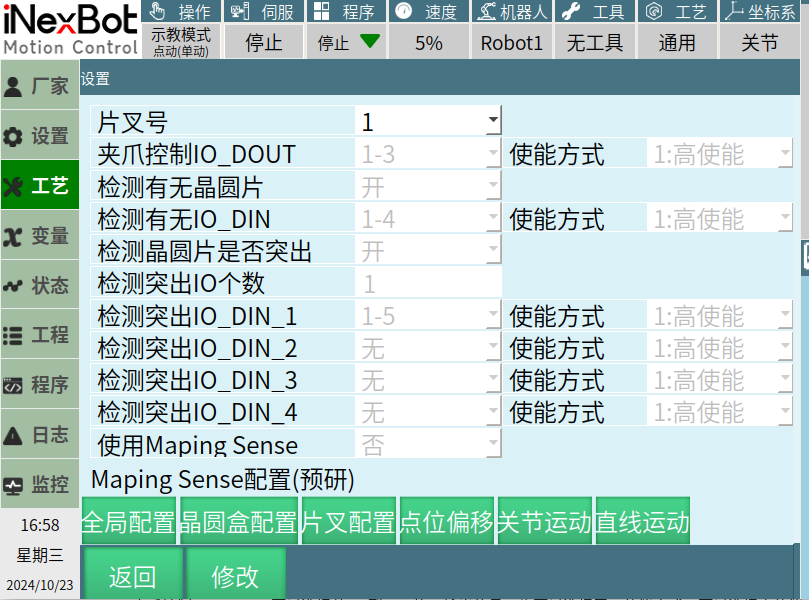

| 参数 | 范围/选项 | 说明 |
| :--- | :--- | :--- |
| 片叉号 | 1, 2, 3, 4（与全局配置一致） | 选择需要配置的片叉 |
| 夹爪控制IO_DOUT | 1-1 ~ 1-16 / 无 | 使能方式：高使能（1）或低使能（0）。夹爪检测到晶圆片存在时，系统输出此IO_DOUT信号 |
| 检测有无晶圆片 | 开启 / 关闭 | 选择开启时，系统会检测夹爪中是否有晶圆片存在 |
| 检测有无IO_DIN | 1-1 ~ 1-16 / 无 | 使能方式：高使能（1）或低使能（0）。选择检测晶圆片是否存在的输入信号 |
| 检测晶圆片是否突出 | 开启 / 关闭 | 开启时系统会检测晶圆片是否突出（正确放置于夹爪内） |
| 检测突出IO个数 | - | 选择用于检测晶圆片突出的输入信号个数 |
| 检测突出IO_DIN_1 ~ 4 | 1-1 ~ 1-16 / 无 | 使能方式：高使能（1）或低使能（0）。分别对应第1~4个检测晶圆片突出的IO输入信号 |
| 使用Maping Sense | 开启 / 关闭 | 预研功能（暂未实现），启用时根据预设映射规则判断晶圆位置和状态，提高取放精度和安全性 |

#### 1.5 点位偏移界面

> 配置从该晶圆盒中取放片的轨迹点偏移参数。

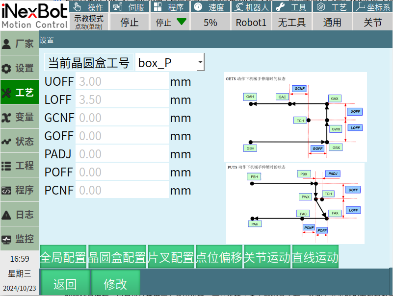

| 参数 | 英文全称 | 范围 | 说明 |
| :--- | :--- | :--- | :--- |
| 当前晶圆盒工号 | - | - | 指当前正在操作的晶圆盒编号。通过下拉框选择，选择后显示对应晶圆盒的参数，后续操作针对该工号 |
| UOFF | Upper Offset | \[0, 15\]mm | 从示教位置到上路径的Z轴方向距离。上部偏移量，用于调整晶圆盒顶部相对于机器人的位置偏差 |
| LOFF | Lower Offset | \[0, 15\]mm | 从示教位置到下路径的Z轴方向距离。下部偏移量，用于调整晶圆盒底部相对于机器人的位置偏差 |
| GCNF | Global Configuration Offset | \[0, 15\]mm | 从示教位置上升路径的工具坐标Y轴方向距离。全局配置偏移量，调整晶圆盒整体相对于机器人的位置偏差 |
| GOFF | Global Offset | \[0, 15\]mm | 从示教位置到晶圆握持位置的工具坐标Y轴方向距离。全局偏移量，调整晶圆盒整体相对于机器人的位置偏差 |
| PADJ | Position Adjustment | \[0, 15\]mm | 从示教位置到晶圆握持位置的工具坐标Y轴方向距离。位置调整，用于微调晶圆盒相对于机器人的位置 |
| POFF | Position Offset | \[0, 15\]mm | 从晶圆放置位置到下路径下端位置的Y轴方向距离。位置偏移量，调整晶圆盒相对于机器人的位置偏差 |
| PCNF | Position Configuration | \[0, 15\]mm | 从晶圆放置位置到握持位置的工具坐标Y轴方向距离。位置配置，用于配置晶圆盒相对于机器人的位置参数 |

> 以上偏移量默认初始值为3mm，可正向或负向调整，确保机器人能准确取放晶圆。

GETS动作下各Location位置的机械手状态如下图所示：

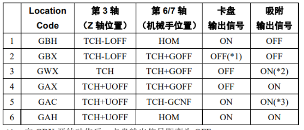

GETS动作的参数如下图所示：

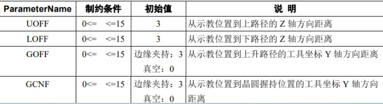

PUTS动作下各Location位置的机械手状态如下图所示：

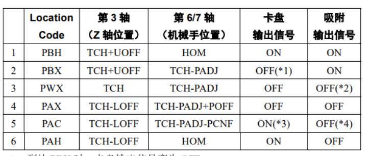

PUTS动作的参数如下图所示：

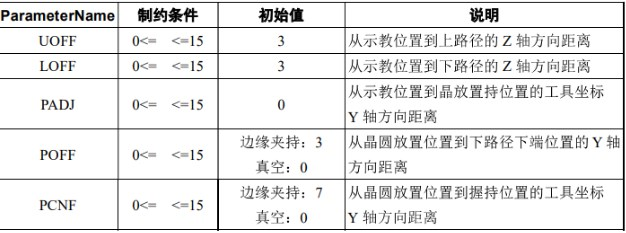

#### 1.6 关节运动界面

> 配置各种工况下每个关节的最大速度。

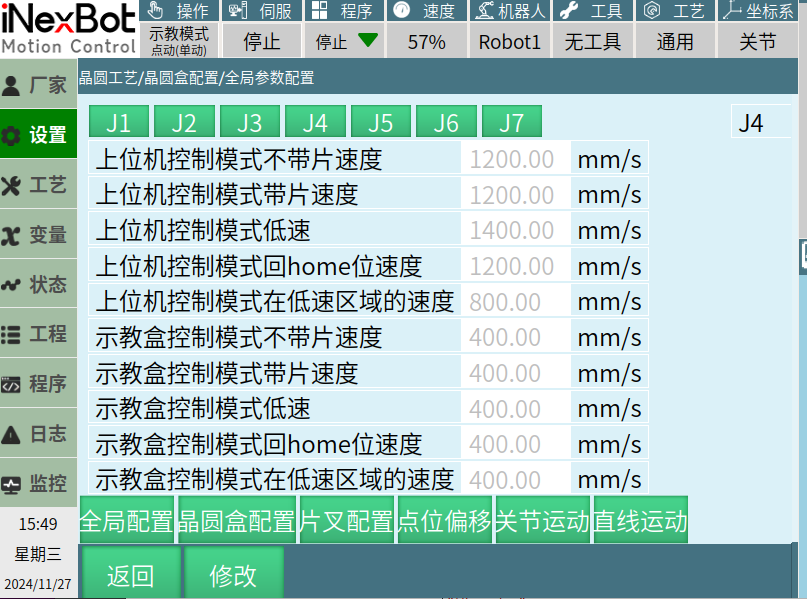

在此界面J1-J7的7个按钮可以选择不同关节，修改/保存各关节在以下工况下的速度参数：

- 上位机控制模式：不带片速度、带片速度、低速、回HOM位速度、低速区域速度
- 示教盒控制模式：低速、带片速度、回HOM位速度、低速区域速度

| 参数 | 范围 | 说明 |
| :--- | :--- | :--- |
| J1, J2, J4, J5, J6, J7速度 | (0, 1000\] mm/s | 对应关节在各工况下的最大速度 |
| J3速度 | (0, 1000\] °/s | J3关节在各工况下的最大角速度 |
| 不带片速度 | - | 机器人在不携带晶圆时的运动速度，适用于从工位运动到工位的过程 |
| 带片速度 | - | 机器人携带晶圆时的运动速度，适用于从工位运动到工位的过程 |
| 低速 | - | 拾取到晶圆后走到夹持位置的速度 |
| 回home位速度 | - | 机器人各轴返回HOM位置时的运动速度 |
| 在低速区域的速度 | - | 机器人取放片过程中上抬或者下降的速度 |

#### 1.7 直线运动界面（直线运动暂只有点动速度和寸动速度生效）

> 配置直线运动中，各种工况下的最大末端线速度。

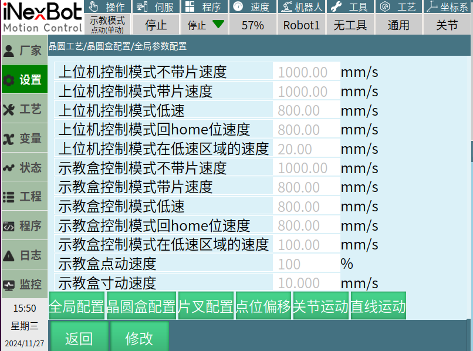

在此界面可以修改/保存系统的直线运动速度，包括：

- 上位机控制模式：不带片速度、带片速度、低速、回HOM位速度、低速区域速度
- 示教盒控制模式：不带片速度、带片速度、低速、回HOM位速度、低速区域速度、示教盒点动速度、寸动速度

| 参数 | 范围 | 说明 |
| :--- | :--- | :--- |
| 不带片速度（除点动/寸动） | \[1, 5000\] mm/s | 机器人在不携带晶圆时的运动速度，主要适用于取放片时片叉伸出或缩回过程 |
| 带片速度 | \[1, 5000\] mm/s | 机器人携带晶圆时的运动速度，主要适用于取放片时片叉伸出或缩回过程 |
| 低速 | \[1, 5000\] mm/s | 拾取到晶圆后走到夹持位置的速度 |
| 回home位速度 | \[1, 5000\] mm/s | 机器人返回HOM位置时的运动速度；由于回HOM点使用关节运动，该参数不生效 |
| 低速区域的速度 | \[1, 5000\] mm/s | 取放片过程中上抬或下降的速度 |
| 示教盒点动速度 | \[1, 100\] % | 使用示教盒进行点动操作时的全局速度百分比限制 |
| 示教盒寸动速度 | \[0.001, 10\] mm/s | 机器人寸动（微动）操作时的最大速度限制 |

### 2. 控制界面

#### 2.1 取放片界面

> 操作机械手去选中的晶圆盒中取片/放片。

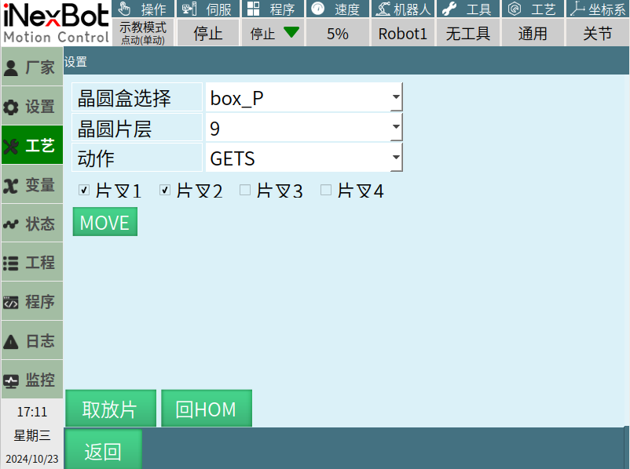

| 参数/控件 | 范围/选项 | 说明 |
| :--- | :--- | :--- |
| 晶圆盒选择 | 与晶圆盒总个数一致 | 每个工号均保存对应的TCH坐标参数和点位偏移参数 |
| 晶圆片层 | 与对应工号的内部层数一致 | 示例：box_03内部层数设为20时，可选择1~20层 |
| 动作 | GETS / PUTS / MOVP | GETS：从晶圆盒中取出一片晶圆；PUTS：将一片晶圆放入晶圆盒；MOVP：移动晶圆而不进行取放动作，用于晶圆在不同位置之间的简单移动 |
| MOVP目标位 | GETS: GBH / PUTS: PBH | 仅当动作为MOVP时可选，目标点位下拉框与动作匹配 |
| 片叉选择 | 与片叉总个数一致 | 可以选择一个或多个片叉进行取放动作。示例：配置3个片叉时仅片叉1~3可选 |
| MOVE按钮 | - | 在伺服就绪状态下上电后点击，机器根据所选动作执行相应操作 |

**使用流程：**

1. 选择晶圆盒工号
2. 选择晶圆片层（在该工号的内部层数范围内）
3. 选择动作：GETS / PUTS / MOVP（若MOVP则同时选择目标位）
4. 选择片叉
5. 伺服就绪上电后，点击MOVE按钮执行

#### 2.2 回HOM界面

操作机械手回HOM位置。

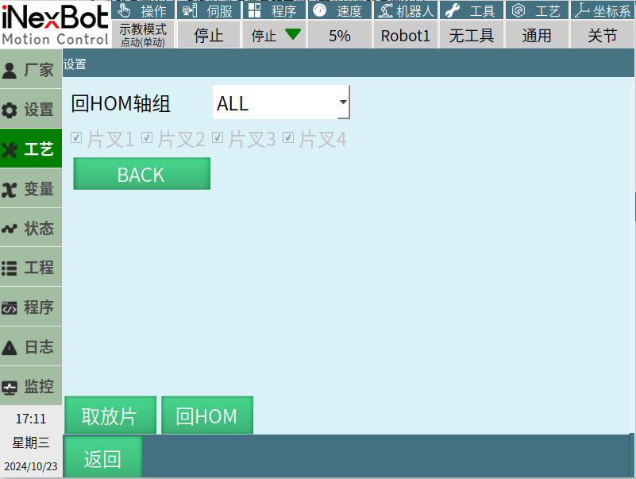

| 参数/控件 | 选项 | 说明 |
| :--- | :--- | :--- |
| 回HOM轴组 | ALL / 片叉 | ALL：所有关节和片叉默认被勾选，整个机器人回到HOM位置；片叉：勾选数量与片叉总个数一致，仅被勾选的片叉回HOM位置 |
| BACK按钮 | - | 伺服就绪上电后点击，机器根据所选回HOM组执行回HOM动作 |

**使用流程：**

1. 选择回HOM组：ALL或片叉（若选片叉则勾选具体片叉）
2. 伺服就绪上电后，点击BACK按钮执行回HOM

### 3. 通讯设置界面

配置上位机控制机械手相关的通讯参数。

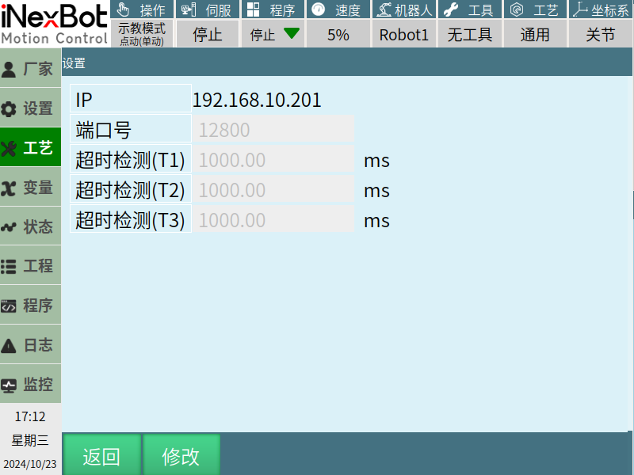

| 参数 | 范围 | 说明 |
| :--- | :--- | :--- |
| IP | - | 当前控制器的IP地址，标识控制器在网络中的位置，通常固定不可随意更改 |
| 端口号 | \[1, 65535\] | 控制器与外部系统通信时使用的端口，可根据实际通讯需求调整 |
| 超时检测T1 | \[1, 1000000\] ms | 通信阶段的超时检测时间，可用于接收数据包的时间限制 |
| 超时检测T2 | \[1, 1000000\] ms | 通信阶段的超时检测时间，可用于发送指令后的响应时间 |
| 超时检测T3 | \[1, 1000000\] ms | 通信阶段的超时检测时间，可用于整个通信周期的最长等待时间 |

> 使用场景：端口号通常用于与上位机建立TCP/IP连接；超时检测确保通信的稳定性和可靠性。
>
> 注意事项：确保端口号不与其他服务冲突；与外部系统兼容；合理设置超时时间以提高通信效率。

### 4. 自动找零配置界面

机器人零点是机器人坐标系的基准点，是机器人运动过程中需要定位和记录的重要位置。由于环境因素（温度、湿度、气压等）或外界干扰，机器人可能出现误差或偏移。通过调零操作，无需更改已存入的工位TCH点坐标，只需保证零点位IO传感器位置固定（核心原理：零点与TCH点在空间上的偏移始终保持一致）即可确保机器人点位准确。

#### 4.1 自动找零功能界面和逻辑介绍

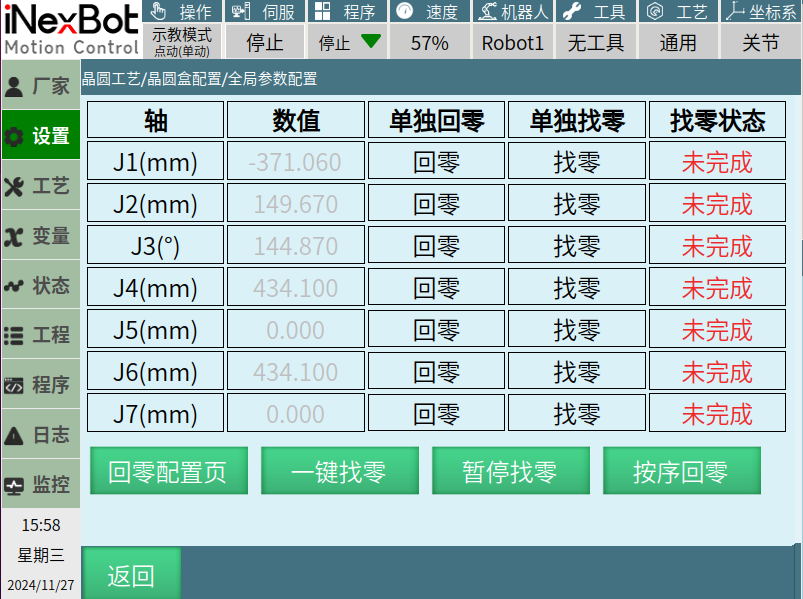

| 控件/状态 | 说明 |
| :--- | :--- |
| 数值 | 该轴当前的关节坐标。点击【找零】或【一键找零】后数值短时间变为"0"（无实际意义），找零成功后当前点位被标记为"0.000" |
| 单独回零 | 若想将某个轴回零点，需要先给机器人上电再点"回零" |
| 单独找零 | 无需上电，只需伺服就绪，点击找零即可对单个轴执行找零 |
| 找零状态 | 未找零或找零失败显示"未完成"，找零成功显示"找零完成" |

**找零逻辑（两次回退，两次找零）：**

| 步骤 | 动作 | 说明 |
| :--- | :--- | :--- |
| 1 | 切换伺服模式 | 点击找零，伺服模式由CSP（周期同步位置模式）变为PV（轮廓速度模式） |
| 2 | 第一次回退 | 轴向找零方向的反方向移动一段回退距离 |
| 3 | 第一次找零 | 回退完成后向找零方向移动，直至触碰找零IO信号 |
| 4 | 第二次回退 | 触碰IO信号后折返向找零反方向回退，距离同为回退距离 |
| 5 | 第二次找零 | 回退完成后再次向找零方向移动，触碰IO信号时将当前编码器位置标记为零点，伺服模式由PV回到CSP |
| 6 | 停止运动 | 机器人立刻停止运动 |

> 注意：找零功能需要伺服状态处于"就绪"状态。

#### 4.2 回零配置页

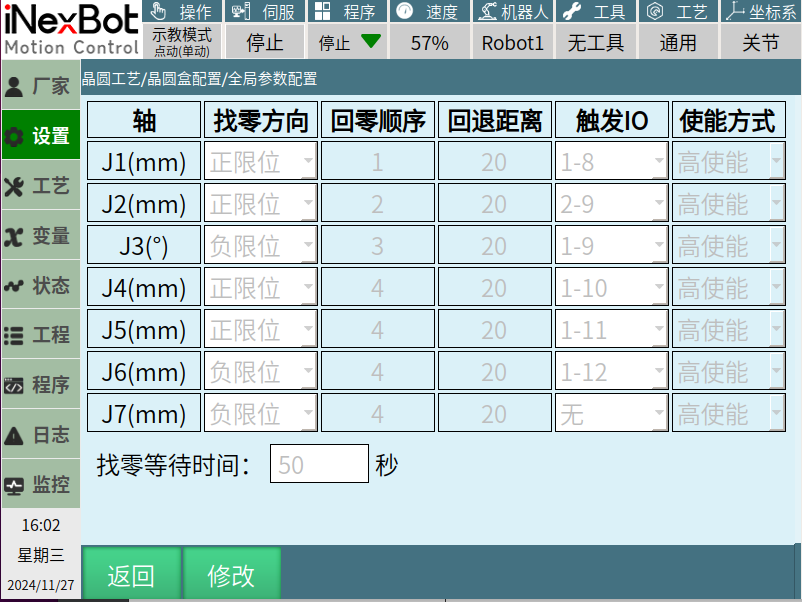

| 参数 | 说明 |
| :--- | :--- |
| 找零方向 | 传感器放置在该轴的方向。若传感器朝向该轴正方向，则填"正限位"，反之填"负限位"。各轴正方向可查看设置-机器人参数-DH参数 |
| 回零顺序（优先级） | 一键找零和按序回零时使用。机器人按所填优先级依次执行找零。若希望J4-J7同时开始找零，可将这4个轴优先级设为相同 |
| 回退距离 | 某轴执行找零时需要执行的回退距离（单位mm或°），回退方向为找零方向的反方向 |
| 触发IO | 该轴IO传感器接入的IO端口号 |
| 使能方式 | 高使能或低使能。例如：J1向找零方向移动触发传感器的瞬间IO由0→1（低变高），则为高使能 |
| 找零等待时间 | 整个找零过程的最长时间限制，防止找零操作无限制进行 |

> 注：为了避免机器人本体移动时片叉保持在HOM位，建议J1、J2、J3的优先级高于J4-J7。

#### 4.3 一键找零、暂停找零和按序回零

| 控件 | 说明 |
| :--- | :--- |
| 一键找零 | 与单轴找零逻辑相同，但一次性将7个轴放入找零队列，按优先级依次找零，节省找零时间，提高效率 |
| 暂停找零 | 找零过程中遇紧急情况，点击暂停找零可立即结束找零任务并停止运动 |
| 按序回零 | 需要伺服上电后执行，按各轴优先级依次回到零点 |

#### 4.4 找零功能的注意点

| 序号 | 注意事项 |
| :--- | :--- |
| 1 | 找零任务开启后，请将手放在急停按钮上，遇紧急情况立即按下确保安全 |
| 2 | 找零预置速度：第一次找零15mm/s，第二次找零5mm/s，回退速度10mm/s。若速度太慢导致超时，请调整找零等待时间 |
| 3 | 安全速度限制：找零速度不能超过伺服脉冲的70%，超出则按70%运动 |
| 4 | 找零成功后，请使用零点偏移功能在J3填写-305°（具体偏移视传感器位置而定），点击J3的【设为零点】，确保3轴片叉朝向与模型图一致（朝向X轴正方向） |

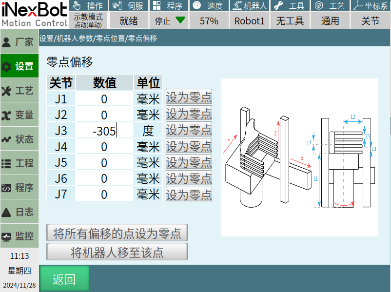

## 二、取放片逻辑介绍

### 1. GETS动作（取片）

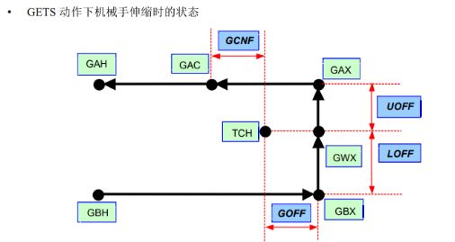

| 点位名称 | 英文含义 | 说明 |
| :--- | :--- | :--- |
| TCH | Teach Position | 示教位置 |
| GBH | Get Before Hold | 晶圆拾取动作前的待机位置 |
| GBX | Get Before eXtended | 晶圆拾取动作前的伸出位置 |
| GWX | Get Wafer eXtended | 晶圆拾取高度的伸出位置（此处取片） |
| GAX | Get After eXtended | 晶圆拾取动作后的伸出位置 |
| GAC | Get After Carry | 晶圆握持位置 |
| GAH | Get After Hold | 晶圆拾取动作后的待机位置 |

#### 取片逻辑（速度参考1.6、1.7节）

| 步骤 | 动作 | 速度 | 说明（目的） |
| :--- | :--- | :--- | :--- |
| 1 | 回到TCH点和HOM点 | J1~J3：关节运动【不带片速度】；J4~J7：关节运动【回home位速度】 | 确保机器人回到已知的安全位置开始取片 |
| 2 | 移动到GBH点 | 关节运动【不带片速度】 | 准备进入取片流程 |
| 3 | 判断片叉有片的IO | - | 检测工具手上是否已有晶圆片；若有则报错停止，确保取片前工具手无片 |
| 4 | 判断工作台互锁IO | - | 若工作台处于互锁状态则报错停止；否则允许进入GBX点，确保安全条件 |
| 5 | 移动到GBX点（前先输出互锁信号） | 直线运动【不带片速度】 | 将片叉伸出到晶圆盒前方准备取片 |
| 6 | 移动到GWX点 | 直线运动【低速区域的速度】 | 下降到取片高度，在GWX点取片 |
| 7 | 检测片突IO | - | 片叉在HOM位才检测，确保工位间移动时晶圆正确放置 |
| 8 | 移动到GAX点 | 直线运动【低速区域的速度】 | 将晶圆片向上抬出卡槽 |
| 9 | 移动到GAC→GAH点 | 直线运动【带片速度】 | 缩回片叉并取出晶圆片 |
| 10 | 到达GAH点后检查有片 | - | 若工具手上无片则报错取片失败，确认取片成功 |
| 11 | 解除工作台互锁输出 | - | 取片操作结束，该工作台允许其他机器进入 |

### 2. PUTS动作（放片）

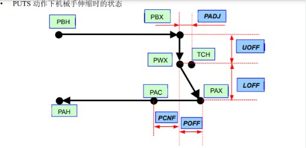

| 点位名称 | 英文含义 | 说明 |
| :--- | :--- | :--- |
| PBH | Put Before Hold | 晶圆放置动作前的待机位置 |
| PBX | Put Before eXtended | 晶圆放置动作前的伸出位置 |
| PWX | Put Wafer eXtended | 晶圆放置高度的伸出位置（此处放片） |
| PAX | Put After eXtended | 晶圆放置动作后的伸出位置 |
| PAC | Put After Carry | 晶圆握持位置 |
| PAH | Put After Hold | 晶圆放置动作后的待机位置 |

#### 放片逻辑（速度参考1.6、1.7节）

| 步骤 | 动作 | 速度 | 说明（目的） |
| :--- | :--- | :--- | :--- |
| 1 | 回到TCH点和HOM点 | J1~J3：关节运动【带片速度】；J4~J7：关节运动【回home位速度】 | 确保机器人回到已知的安全位置开始放片 |
| 2 | 移动到PBH点 | 关节运动【带片速度】 | 准备进入放片流程 |
| 3 | 判断片叉有片的IO | - | 若工具手上无片则报错停止，确保放片前确有晶圆片 |
| 4 | 判断工作台互锁IO | - | 若工作台互锁则报错停止；否则允许进入PBX点 |
| 5 | 检测片突IO | - | 片叉在HOM位才检测，确保工位间移动时晶圆正确放置 |
| 6 | 移动到PBX点 | 直线运动【低速区域的速度】 | 将片叉伸出到晶圆盒前方准备放片 |
| 7 | 移动到PWX点 | 直线运动【低速区域的速度】 | 下降到放片高度，在PWX点放片 |
| 8 | 移动到PAX点 | 直线运动【低速区域的速度】 | 将片叉下移后抽出 |
| 9 | 移动到PAC→PAH点 | 直线运动【不带片速度】 | 缩回片叉并回到待机位置 |
| 10 | 到达PAH点后检查有片 | - | 若工具手上仍有片则报错放片失败，确认放片成功 |
| 11 | 解除工作台互锁输出 | - | 放片操作结束，该工作台允许其他机器进入 |

## 三、上位机控制

### 1. 上位机控制的准备操作

#### 第一步：晶圆盒配置

在示教器的晶圆盒配置界面设置有关晶圆的参数：

| 配置项 | 说明 |
| :--- | :--- |
| 晶圆盒参数 | 设置晶圆盒的类型、尺寸等基本信息 |
| 片叉参数 | 配置片叉的位置、尺寸以及其他与晶圆抓取相关的参数 |
| 点位偏移参数 | 设置晶圆盒内不同位置的偏移量，确保机器人能够准确定位到每个晶圆 |
| TCH点 | 定义接触晶圆时的参考点，确保晶圆在处理过程中的稳定性 |
| HOM点 | 设定机器人的初始位置或安全位置，用于启动或复位时返回 |
| 关节运动和直线运动速度 | 设置机器人各关节的移动速度以及直线运动速度，保证操作既快速又平稳 |

#### 第二步：示教器通讯设置

在示教器的通讯设置界面设置通讯相关参数：

| 配置项 | 说明 |
| :--- | :--- |
| 控制器IP地址 | 确认示教器上显示的是正确的控制器IP地址 |
| 端口号 | 默认为12800（若无法修改，确保上位机软件与此端口匹配） |
| 超时检测时间 | 根据实际通信需求设置，确保数据传输可靠性 |

#### 第三步：上位机软件设置

| 配置项 | 说明 |
| :--- | :--- |
| 安装软件 | 确保已安装适用于晶圆处理机器人的上位机软件 |
| IP地址 | 填写控制器的IP地址 |
| 端口号 | 填写12800或其他与上位机匹配的端口号 |
| 其他参数 | 根据需要配置其他通信参数 |
| 连接测试 | 尝试与控制器建立连接，确保通信正常 |
| 命令配置 | 根据实际需要编写或调用控制命令（移动到指定位置、读取状态等） |

#### 第四步：通讯调试

| 步骤 | 说明 |
| :--- | :--- |
| 切换模式 | 将示教器切换至"运行模式" |
| 上位机命令发送 | 在上位机软件中输入命令进行调试，可编写脚本自动发送循环命令 |
| 监控反馈 | 观察控制器的响应情况，检查是否按预期工作 |

### 2. 上位机支持的命令

#### 2.1 命令顺序

| 类型 | 符号/描述 | 说明 |
| :--- | :--- | :--- |
| 命令分隔符（一次信息） | `<` | 信息流开始标记 |
| 命令分隔符 | `>` | 信息流结束标记 |
| 命令分隔符 | `，`（逗号） | 参数分隔符 |
| 命令分隔符 | CRLF（回车+换行） | 命令信息结束标记 |
| Ack（二次信息） | 校验语法后发送 | 机器人收到命令后发送Ack，确认信息包含与命令相同的MesID |
| Ack错误状态 | Busy | 机器人正忙于执行上一个命令 |
| Ack错误状态 | 校验和错误 | 校验和不正确 |

- 如果命令语法不正确，返回非法命令或无效参数错误。

- 如果在命令中检测到意外的"LF"，则返回非法格式错误。

**注：Ack Code 命令一揽表**

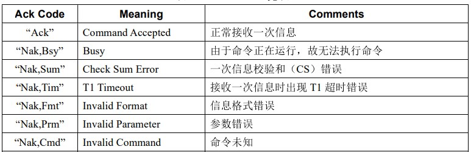

**3.Response：完成信息（命令执行完成后发送）**

- 在命令结束后立即返回。

- 完成信息的MesID与运行命令的MesID相同：

- 如果命令成功执行，则在完成信息中返回\<MeslD,Success\>或\<MeslD,Success,ResultData\>

- 如果命令执行失败，则在完成信息中返回\<MeslD,Error,Error#,DeviceCode,ErrorMessage\>

#### 2.2命令语法

##### 2.2.1 术语一览表

| 参数名称 | 参数数据 | 说明 |
| :--- | :--- | :--- |
| RobotCode | R1 | 机器人1 |
| | R2 | 机器人2 |
| HandCode | H1 | 工具手1 |
| | H2 | 工具手2 |
| | H3 | H1-F：采用16进制的方式确定哪个工具手来做，如H3,3 = 0011，选择的是工具手1和工具手2 |
| JointCode | J1 | 第一轴 |
| | J2 | 第二轴 |
| | ... | ... |
| | J7 | 第七轴 |
| ModeCode | REAL | 动作时确认晶圆有无（通常动作） |
| | SIMU | 动作时不确定晶圆有无（测试动作） |
| SenseCode | 0 | 无晶圆 |
| | 1 | 有晶圆 |
| | U | 晶圆有无未知 |
| | E | 错误状态 |
| Solt# | 1 | Solt 1 |
| | 2 | Solts 2 |
| | N | Solt N（N最大=50） |
| Station Code | P1 | 工号1 |
| | P2 | 工号2 |
| | Pn | 工号N |
| StatusCode | Rdy | Ready（伺服开启）状态 |
| | Bsy | Busy（机器人动作中）状态 |
| | Off | 伺服断开状态 |
| | Err | 错误状况 |
| | Tch | 示教模式 |
| LocationCode | GBH...GAH | 拾取动作时的各动作位置 |
| | PBH...PAH | 放置动作时的各动作位置 |
| ErrorCount | 1至10 | 错误履历编号 |

##### 2.2.2命令格式(部分)

**CSTA** ：报告复合状态

- 功能：报告当前的复合状态。

- 语法："CSTA, DeviceCode"

DeviceCode："R1"=机器人1;"

- Ack "Ack"

- Response "Success,CombinedAlignerResponse\"(机器人)

"Success,R1, StatusCode, H1, ChuckCode, SenseCode, H2.ChuckCode,
SenseCode"(如果机械手2不存在，则在"H2"之后没有数据。)

**GETS**：拾取晶圆

- 功能：从指定工位的指定插槽拾取晶圆。

- 语法："GETS, RobotCode, HandCode, StationCode, Slot#"Command

RobotCode："R1"= 机器人 1,"R2"=机器人 2

HandCode："H1"= 机械手1,"H2"= 机械手2

StationCode："P1"-"P25"= 工位1至 25

- Ack "Ack"

- Response

"Success"(正常结束)

"Success, CombinedRobotResponse"(CSTARESPONSE 为ON 时)

"Error"(错误)

**PUTS**：放置晶圆

- 功能：把晶圆放置到指定工位的指定插槽

- 语法："PUTS, RobotCode, HandCode, StationCode, Slot#"

<!-- -->

- Ack "Ack"

- Response

"Success"(正常结束)

"Success, CombinedRobotResponse"(CSTARESPONSE 为ON 时)

"Error(错误)

**HOMH**：将机械手轴和关节轴移动到原点位置

- 功能：将机械手轴和关节轴移动到原点位置。Z轴不移到的原点位置。

- 语法："HOMH, RobotCode"

<!-- -->

- Ack "Ack"

- Response

"Success'(正常结束)

"Success, CombinedRobotResponse"(CSTARESPONSE 为ON 时)

"Error"(错误)

**HOMA**：将所有轴移动到原点位置

- 功能：将所有轴移动到原点位置。

机器人：将机械手轴和关节轴移动到原点位置后，将轴移动到指定原点位置。

校准器：将旋转轴移动到 0\[degree\]位置。

- 语法："HOMA, DeviceCode"

DeviceCode ："R1"=机器人1，"R2"= 机器人 2"A1"= 校准器1

- Ack ："Ack"（确认）

- Response："Success"(正常结束)

"Success,CombinedRobotResponse" or

"Success, CombinedAlignerReponse"(CSTARESPONSE 为ON 时)

"Error,(错误)

**SENS**：报告品圆的有无

- 功能：报告指定装置上有无晶圆。

- 语法："SENS. RobotCode, HandCode"，"SENS,AlignerCode"(校准器时)

- Ack "Ack"

- Response："Success, SenseCode"

SenseCode："0"= 无晶圆，"1"= 有晶圆，"U"=
晶圆有无未知，"E"=错误状态(传感器异常等错误状态)

**STAT**：报告指定设备的状态功能：报告指定设备的状态。

- 语法："STAT, DeviceCode"

- Ack "Ack"

- Response： "Success, StatusCode"

StatusCode："Rdy"= Ready 状态"Bsy"=Busy(机器人动作中)状态，"Of'=
伺服断开状态，"Er"= 错误发生中，"Tch"=正在使用示教器进行操作

**SERV**：开启伺服

- 功能：开启指定设备的伺服。

- 语法："SERV, DeviceCode"

- Ack "Ack"

- Response ："Success'(正常结束)，"Error"(错误)

**STOP**：断开伺服功能：当指定设备正在动作时减速停止，并断开伺服。

- 语法："STOP, DeviceCode"

- Ack "Ack"

- Response"Success\*

**SSPD**：设定机器人的动作速度功能：设定机器人的动作速度。

- 语法："SSPD, DeviceCode, SpeedData"

SpeedData 单位：%、范围：1.00至100.00

- Ack "Ack"

- Response"Success"

**RSPD**：报告机器人的动作速度设定值功能：报告机器人的动作速度设定值。

- 语法："RSPD, DeviceCode'

- Ack "Ack"

- Response "Success, SpeedData"

SpeedData单位：%、范围：1.00至100.00

**TCHP**：示教位置

- 功能：在指定工位的插槽上进行位置示教。

将当前位置注册为指定工位和插槽的示教位置。

示教位置保存在控制器的存储器中。

- 语法："TCHP.RobotCode, HandCode, StationCode, Slot#'

- Ack "Ack"

- Response "Success"(正常结束)，"Error"(错误)

**SMOD**：设定模式

- 功能：设定晶圆有无确认模式。

- 语法："SMOD, ModeCode"

ModeCode："Rea!"= 执行晶圆有无确认。"Simu"=
不执行晶圆有无确认。"Simu"用于确认机器人的动作。

- Ack "Ack"

- Response："Success"(正常结束)，"Error"错误)

**RMOD：**报告模式设定功能：报告当前设定的品圆有无确认模式的状态。

- 语法："RMOD"

- Ack："Ack"

- Response"Success, ModeCode"

**MOVP**：移动到指定位置

- 功能：移动到指定位置。

- 语法："MOVP, RobotCode, HandCode, StationCode, Slot#, LocationCode"

<!-- -->

- Ack "Ack"

- Response "Success;\"(正常结束),
  "Success,CombinedRobotResponse"(CSTARESPONSE 为ON 时), "Error"(错误)

**MOVA**：移动到绝对位置

- 功能：将某个轴移动到绝对位置。

- 语法："MOVA, RobotCode, JointCode, JointData"

<!-- -->

- Ack "Ack"

- Response "Success;\"(正常结束),
  "Success,CombinedRobotResponse"(CSTARESPONSE 为ON 时), "Error"(错误)

**HOLD**：握持晶圆或打开吸附

- 功能：握持晶圆或打开吸附。

- 语法："HOLD, RobotCode, HandCode"

<!-- -->

- Ack "Ack"

- Response "Success\"(正常结束)

**RELS**：放开晶圆或关闭吸附

- 功能：放开晶圆或打开吸附。

- 语法："RELS, RobotCode, HandCode"

<!-- -->

- Ack "Ack"

- Response "Success\"(正常结束)

**RPOS**：报告当前坐标位置

- 功能：报告当前关节坐标位置。

- 语法："RPOS, RobotCode"

<!-- -->

- Ack "Ack"

- Response "Success,J1Data, J2Data, J3Data, J4Data, J5Data, J6Data,
  J7Data\"(正常结束)

**RMOD**：报告模式设定

- 功能：报告检查所有片叉的晶圆有无的使能状态是否打开。

- 语法："RMOD"

<!-- -->

- Ack "Ack"

- Response "Success, MoveCode\"(正常结束)

**RXYZ**：报告当前坐标位置

- 功能：报告当前直角坐标位置。

- 语法："RXYZ, RobotCode"

<!-- -->

- Ack "Ack"

- Response "Success,XData, YData, ZData, J4Data, J5Data, J6Data,
  J7Data\"(正常结束)

**STCH**：设置示教位置

- 功能：设置指定工位指定工具手的示教位置（关节）。

- 语法："STCH, RobotCode, HandCode, StationCode, J1Data, J2Data, J3Data,
  J4Data, J5Data, J6Data, J7Data "

<!-- -->

- Ack "Ack"

- Response "Success\"(正常结束) / \"Error"（错误）

**RTCH**：报告示教位置

- 功能：报告指定工位指定工具手的示教位置（关节）。

- 语法："RTCH, RobotCode, HandCode, StationCode"

<!-- -->

- Ack "Ack"

- Response "Success,J1Data, J2Data, J3Data, J4Data, J5Data, J6Data,
  J7Data\"(正常结束)

**CTCH**：清除示教位置

- 功能：清除指定工位指定工具手的示教位置。

- 语法："CTCH, RobotCode, HandCode, StationCode"

<!-- -->

- Ack "Ack"

- Response "Success\"(正常结束) / \"Error\"(错误)

**STXY**：设置示教位置

- 功能：设置指定工位指定工具手的示教位置。

- 语法："STXY, RobotCode, HandCode, StationCode, XData, YData, ZData,
  UData, HData"

<!-- -->

- Ack "Ack"

- Response "Success\"(正常结束)

**RTXY**：报告示教位置

- 功能：报告指定工位指定工具手的示教位置。

- 语法："RTXY, RobotCode, HandCode, StationCode"

<!-- -->

- Ack "Ack"

- Response "Success,XData, YData, ZData, UData, HData\"(正常结束)

**RNST**：报告最近工位

- 功能：报告指定工位指定工具手的示教位置。

- 语法："RNST, RobotCode, HandCode, StationCode"

<!-- -->

- Ack "Ack"

- Response "Success, StationCode, Slot#, ExtendCode\"(正常结束)

**CERR**：清除错误

- 功能：清除所有的错误

- 语法："CERR, RobotCode" 

- Ack    "Ack"

- Response
    "Success\"(正常结束)， "Error,\..."(清错后仍然有错，需要进一步检查)

### 3. 支持的命令一览表

#### 3.1 运动类命令

| 命令 | 含义 | 指令类型 | 特殊说明 |
| :--- | :--- | :--- | :--- |
| PUTS,R1,H2,P5,1 | 放片 | 运动 | R1：机器人1；H1-F采用16进制确定工具手（例H3,3=0011即工具手1和2）；P5：晶圆盒工号名称；1：内部层数 |
| GETS,R1,H1,P5,21 | 取片 | 运动 | 同上 |
| HOMA,R1 | 全回HOM位 | 运动 | 先回片叉J4567，再回本体J123，回HOM位后释放互锁信号、清除所有报错 |
| HOMH,R1 | 回HOM位除2轴（Z） | 运动 | 同上 |
| MOVP,R1,H1,P3,11,GBH | 移动到某点 | 运动 | 支持GBH、PBH，到达起始点后取放片命令不必再回HOM点，直接从第一个点继续 |
| MOVA,R1,J1,100 | 移动某个轴到指定位置 | 运动 | - |
| HOLD,R1,HD | 输出指定片叉夹持使能 | 运动 | - |
| RELS,R1,H4 | 输出指定片叉夹持不使能 | 运动 | - |

#### 3.2 非运动类命令

| 命令 | 含义 | 指令类型 | 个别说明 |
| :--- | :--- | :--- | :--- |
| STAT,R1 | 报告设备状态 | 非运动 | - |
| SERV,R1 | 开启伺服 | 非运动 | - |
| CSTA,R1 | 查询状态 | 非运动 | 只支持R1 |
| SSPD,R1,50 | 设置速度 | 非运动 | 第三个速度参数范围1-100，运动时不可调速 |
| RSPD,R1 | 获取速度 | 非运动 | - |
| TCHP,R1,H1,P5,1 | 标记示教点 | 非运动 | 层数会补偿到高度，设置后切换到示教器查看TCH点 |
| RPOS,R1 | 查询当前关节位置 | 非运动 | - |
| SMOD,REAL | 设置模式 | 非运动 | 设置四个片叉的检测晶圆有无开关，设置后切换示教器查看或看配置文件 |
| RMOD | 读取设置模式 | 非运动 | 读取片叉的晶圆检测开关，全打开回复REAL，否则回复SIMU |
| RXYZ,R1,H5 | 报告当前位置XYZUH | 非运动 | - |
| RTXY,R1,P5 | 报告工位的TCH点XYZUH | 非运动 | - |
| STXY,R1,H1,P5,0,0,0,0,0 | 设置工位的TCH点XYZUH | 非运动 | 运动时回复Error不允许修改，切换示教器查看或看配置文件，同步更新关节坐标 |
| RTCH,R1,H1,P5 | 报告工位的TCH点J1-7 | 非运动 | - |
| STCH,R1,H1,P5,0,0,0,0,0,0,0 | 设置工位的TCH点J1-7 | 非运动 | 运动时回复Error不允许修改，切换示教器查看或看配置文件，同步更新直角坐标 |
| CTCH, R1, H1, P5 | 清除工位TCH点 | 非运动 | - |
| RNST,R1,H1 | 报告最近工位 | 非运动 | - |
| SENS,R1,H1 | 查询片叉有无片状态 | 非运动 | - |
| STOP,R1 | 停止运动 | 非运动 | - |

## 附录一、系统操作与运行

### 1. T30示教器按键说明

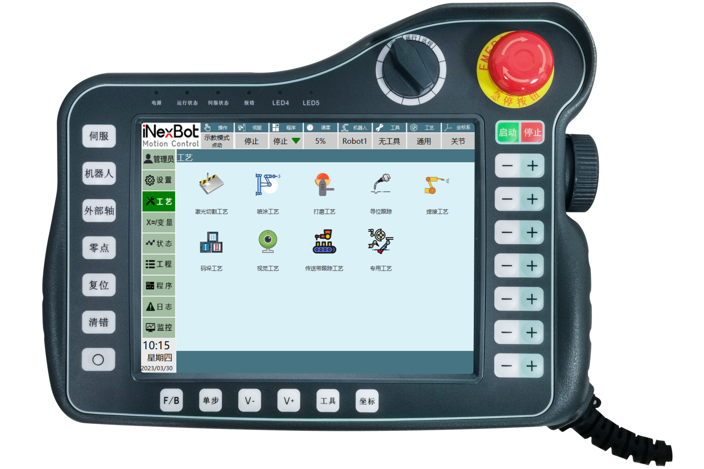

| 按键图示 | 说明 |
| :--- | :--- |
|  | 点击【伺服】，切换伺服状态（停止、就绪） |
| 补充图示 | 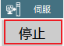 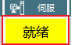 |
|  | 点击【机器人】，切换当前机器人（仅多机模式时可用） |
|  | 点击【外部轴】，连接外部轴时切换外部轴和机器人（仅在有外部轴时可用）。选择外部轴可点动当前连接的外部轴，选择机器人可对当前机器人进行点动等操作 |
| 外部轴补充图示 | 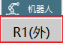 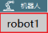 |
|  | 点击【零点】，机器人回到零点位置 |
|  | 点击【复位】，机器人运行到记录的复位点位置 |
|  | 点击【清错】，机器人在出现错误提示时，可清除错误提示 |
|  | 点击【⭕】机器人进入拖拽模式，可拖拽让机器人到达目标点位。注意：机器人只有在辨识成功后才可以进行拖拽 |
|  | 点击【F/B】，在单步运行程序时可以选择正序或倒序。正序运行：指令由上向下运行；倒序运行：指令由下向上运行 |
| 正序/倒序图示 | 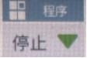（正序）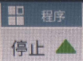（倒序） |
|  | 点击【单步】在示教模式下运行程序。点击【单步】运行第一行，结束后再点击继续运行下一行，直到整个作业文件运行结束 |
| 单步运行图示 | 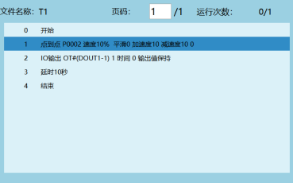 |
|  | 【V-】减小全局速度，每点击一次全局速度减小5% |
| V-图示 | 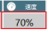 |
|  | 【V+】增加全局速度，每点击一次全局速度增加5% |
| V+图示 |  |
|  | 【工具】切换工具手 |
| 工具切换图示 | 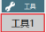 |
|  | 【坐标】切换坐标。点击坐标按钮可以依次切换关节坐标、直角坐标、工具坐标和用户坐标 |
| 坐标切换图示 |  |
| 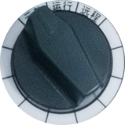 | 【切换操作模式】旋钮在左边=示教模式、中间=运行模式、右边=远程模式 |
| 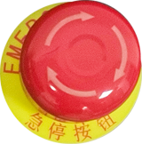 | 【紧急停止按钮】程序运行中出现碰撞或飞车等情况按下急停，机器人停止运动 |
|  | 【启动】在运行模式下用来启动程序，点击【启动】程序开始运行 |
|  | 【停止】在运行模式下用来暂停程序，点击【停止】正在运行的程序会暂停运行 |
|  | 【-】示教时对应轴负方向运行 |
|  | 【+】示教时对应轴正方向运行 |
|  | 程序界面旋转切换上一行、下一行 |
| 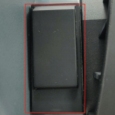 | 示教器握把后面的按钮：按到中间控制机器人（伺服）上电；按到底控制伺服下电；松开按键伺服下电 |

### 2.监控界面参数说明

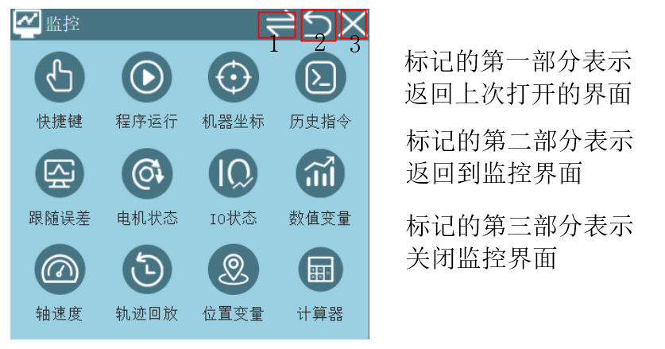

【快捷键】

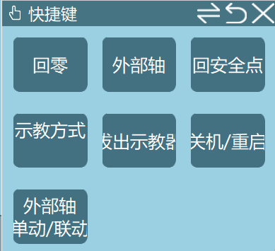

1.  【回零】按下上电使能，点击回零机器人会运行到零点位置。

零点位置说明：每个坐标系都有所有轴都为 0
的点，这叫做坐标系原点，对于关节坐标系来说，这个点叫做零点位置（机器人的第
1-7 轴的关节坐标均为 0 的位置）。

2.  【外部轴】可以用来切换当前机器人和外部轴。

3.  【回安全点】按下上电使能，点击回安全点机器人运行到设置的安全点位。

设置-复位点设置界面的点位就是设置的安全点。

4.  【示教方式点动（单动）】可以切换机器人点动模式和拖拽模式。

拖拽说明：辨识成功后选择拖拽方式后就可以切换到拖拽模式。

5.  【拔出示教器】拔出示教器后控制器与示教器连接断开。

6.  【关机/重启】点击后会出现以下提示窗口，用户可选择关机、重启、取消。选择关机则关闭控制器和示教器，选择重启则重启控制器和示教器，选择取消则关闭提示窗口。

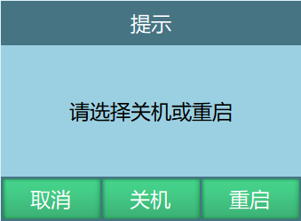

7.  外部轴单动/联动：在监控中可以切换外部轴单动/联动模式，前提是需要标定好需要联动的外部轴。

联动：点动外部轴时，机器人可跟随相对运行，点动机器人时外部轴不动。

单动：点动机器人时外部轴保持不动；点动外部轴时机器人保持不动。

【机器坐标】

1.  监控机器人在运动时的关节坐标、直角坐标、工具坐标、用户坐标下的点位。

2.  检测量距：检测机器人从一个点运动到另一个点的距离。

【IO状态】

机器人在执行作业文件时如果设置了信号参数，可以在此界面监控数字信号和模拟信号。

如下图所示：

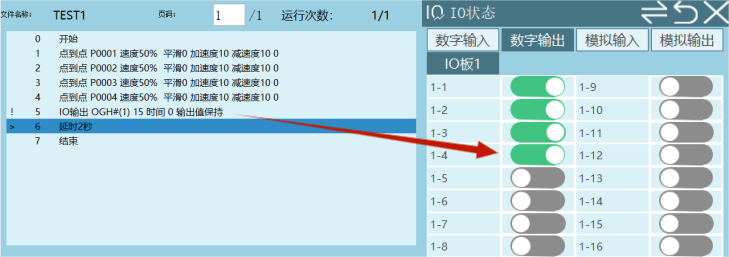

【轴速度】

机器人在移动时根据设置的指令速度和全局速度参数，在监控-轴速度界面可以监控机器人运行时的当前速度和最大速度，如图：

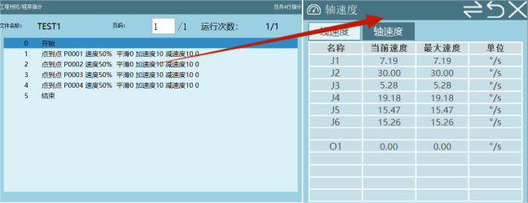

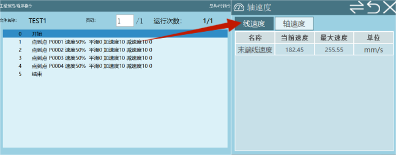

### 3.状态栏介绍

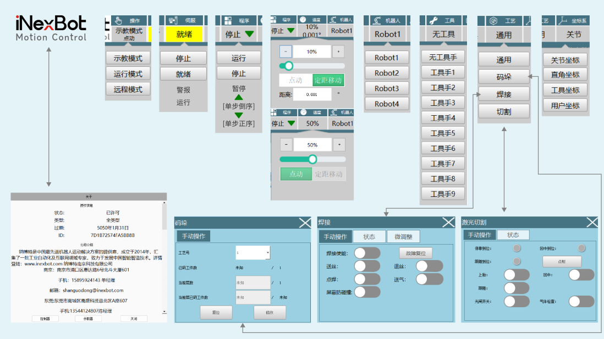

### 4. 操作模式

| 操作模式 | 说明 |
| :--- | :--- |
| 示教模式 / 运行模式 / 远程模式 | 通过示教器旋钮切换模式 |

### 5. 伺服状态

| 伺服状态 | 说明 |
| :--- | :--- |
| 停止、就绪 | 点击左侧伺服功能按键，可以切换伺服为停止或者就绪状态 |
| 运行（示教模式） | 按下"使能键"，伺服状态切换为"运行"状态 |
| 运行（运行模式） | 按下"启动"按钮，伺服状态切换为"运行"状态 |
| 警报 | 拍下控制柜/示教器上的"急停按钮"，伺服状态切换为"警报"状态 |

### 6. 速度状态

| 速度状态 | 说明 |
| :--- | :--- |
| 点动（速度范围） | 速度范围：\[1%,100%\] |
| 点动（V+/V-调节） | 按下示教器底部的【V+】，【V-】速度每次增加或者减小5% |
| 点动（微调） | 点击下图所示的【+】，【-】速度每次增加或者减小1% |
| 点动微调图示 | 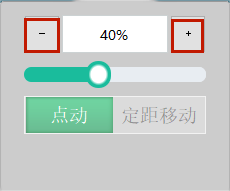 |
| 定距移动（作用） | 设定好速度和距离后点动机器人，机器人会运行设定的角度或距离后停止 |
| 定距移动（注意） | 点动过程中停止，重新点动会重新运行设定距离，而不是运行之前剩余距离 |
| 定距移动（默认值） | 关节坐标下默认值为0.1°，直角坐标下默认值为0.1mm |
| 定距移动（速度切换） | 点动切换到定距移动时，速度改为默认10%（例如：点动速度为50%，切换到定距移动，速度会改为10%） |
| 定距移动（模式限制） | 点动/定距移动仅示教模式下可切换，其他模式下置灰 |

### 7. 系统运行

#### 7.1 示教模式

**作用：**
1. 点动机器人将其移动到想要去到的点位，例如Teaching点位的时候需要点动各轴移动到TCH点；
2. TCH标定完之后，可以降低速度执行GETS、PUTS、回HOM等指令，确认标定的TCH点是否能达到预期的轨迹，取放片轨迹是否安全，如果该轨迹安全，那么上位机执行这个工位取放片的轨迹也会是预期的、安全的。

**操作步骤：**
1. 将操作模式旋钮旋至"示教"。

2. 首先检查伺服【就绪状态】，需要切换伺服状态为"就绪"。

3. 确认速度，建议先用5%速度，低速确认安全，慢慢调整合适速度。
4. 按下上电按钮。

5. 点按示教器右侧J1+-，J2+-……（J1-J7对应着1轴到7轴），以人站在机器人升降轴那一侧面对机器人，各轴对应关系如下：

| 轴号 | J1 | J2 | J3 | J4 | J5 | J6 | J7 |
| :--- | :--- | :--- | :--- | :--- | :--- | :--- | :--- |
| 代表的轴 | 行走轴 | 升降轴 | 旋转轴 | 片叉1 | 片叉2 | 片叉3 | 片叉4 |
| 正方向 | 左手 | 上 | 逆时针 | 向前伸出 | 向前伸出 | 向前伸出 | 向前伸出 |

#### 7.2 运行模式

**作用：** 切换模式使上位机控制机器人。

点位示教好后，切换运行模式后，上位机方可向机器人发送指令。

## 附录二、Teaching步骤

### 1.设置工位数量

在全局配置界面设置【晶圆盒总个数】。

### 2.设置某个工位的配置信息

在【晶圆盒配置】界面，当前工号下拉框选中某个工位，可以设置该工位的工位名，内部层数、层间距和IO配置信息等，设置好之后点击保存。

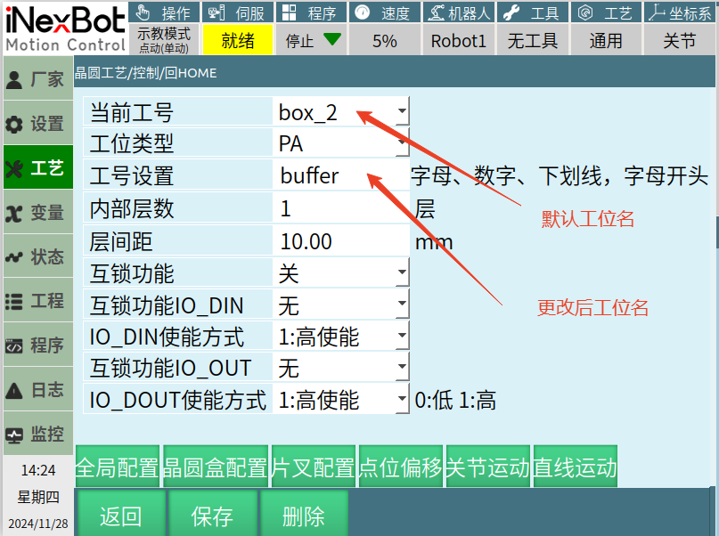

### 3.进入TCH标定界面

进入TCH标定界面，选择刚才设置的这个工位。

初始时TCH当前标记状态是"未标记"。

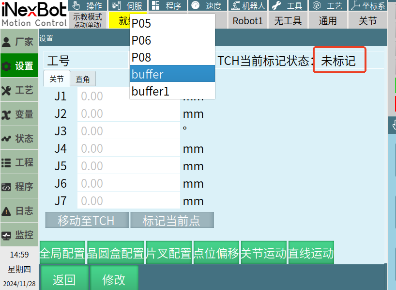

4.示教模式下点动机器人各轴（操作步骤见附录一的第7节），注意请使用低速确认安全，如果需要微调时请使用寸动速度。

点动轴的顺序：

> 首先点动J1，J2，J3让机器人本体接近该晶圆盒；
>
> 点动J4（片叉1）稍微伸出，方便对准晶圆盒第一层，在此之中请将2轴（Z轴升降轴）高度调整到合适位置，一般是比晶圆盒第一层略低4mm左右，确保片叉能够安全伸出；
>
> 一边点动J4一边观察J1，J2的位置是否合理；
>
> 使用寸动速度微调点位直到片叉卡槽能恰好卡住晶圆的位置；
>
> 点动J2+，使晶圆片下表面恰好贴上片叉上表面；
>
> 点击修改\--【标记当前点】
>
> 使用5%点动速度，进入控制\-\--取放片界面使用第一层，片叉1进行多次取放片确认该TCH位置准确。
>
> 使用5%点动速度，进入控制\-\--取放片界面使用任意层，任意片叉进行多次取放片确认该TCH位置准确。

5.TCH位置理想位置如下：

如图，黄线是片叉，虚线是晶圆盒第一层，可以看到J4（片叉1）下表面应该刚好接触晶圆片下表面。

## 附录三、点到点运动安全避障

机器人在进行任何一个点到点运动的时候，都会优先将片叉收回HOM点，再移动机器人本体（J1、J2、J3）。例如回HOM点、回零点、移动到TCH点、MOVP。

## 附录四、上位机紧急停止安全避障

机器人在执行取放片任务时，如果发生紧急情况需要暂停或停止，使用HOMA或者HOMH命令能将片叉收回到安全位置，但是如果机器停止在取放片的升降位置，直接使片叉回HOM，由于高度不够可能会将晶圆片撞坏，为此我们有如下避障方案：

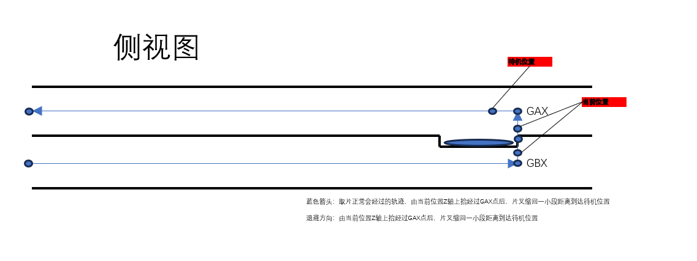

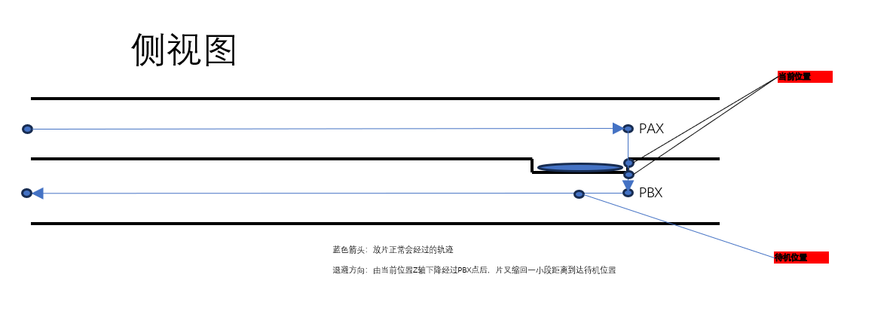

## 附录五、取放片层高避障

如图，若某个工位最高层为5层，那么使用1、2片叉去第四层时能正常取放片，但是使用1、2片叉同时去第五层就会超过最大层高，系统会自动计算并报错停止。

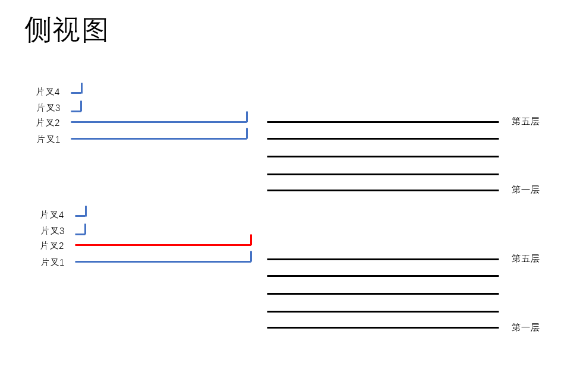

## 附录六、上位机错误码一览表

| errorCode | Message | NoteText | Trigger Condition | Use or Not（默认√） |
| :--- | :--- | :--- | :--- | :--- |
| 1001 | {Stop Robot run failed, push quick stop button!} | 停止机器人运动失败，拍下急停 | \- | √ |
| 1002 | {Turn TEACH/RUN/REMOTE switch on the operation panel to RUN.} | 需要切换到运行模式 | 非运行模式发送命令时 | √ |
| 2001 | {The Last act command is running, please waiting.} | 等待上条运动命令运行结束 | 第一条运动命令执行时再发一条 | √ |
| 2002 | {This command's checked sum is error, please check it.} | 命令校验和错误 | \- | √ |
| 2003 | {This command's parameter is error, please check it.} | 命令参数错误 | \- | √ |
| 2004 | {This command is not exist, please check it.} | 命令不存在 | \- | √ |
| 2005 | {This command's format is error, please check it.} | 命令格式错误 | \- | √ |
| 2006 | {Teachbox has uncleaned error, please check teachbox.} | 示教器有错误没清除，需要清错 | 运行模式有错误没清除 | √ |
| 2007 | {Go HOM operation exist error, but cleaned already. Please check it.} | 回HOM操作清错后仍然有错 | 无步骤，理论清一次错即可 | √ |
| 3001 | {At absence check, unexpected wafer is detected. Check Hand_1 and sensor.} | 片叉1不应该有晶圆片 | 取放片第一步检测触发。取片先检测手上应该无片；放片先检测手上应该有片 | √ |
| 3002 | {At absence check, expected wafer is not detected. Check Hand_1 and sensor.} | 片叉1应该有晶圆片 | 取放片有无片检测异常 | √ |
| 3003 | {At absence check, unexpected wafer is detected. Check Hand_2 and sensor.} | 片叉2不应该有晶圆片 | 取放片有无片检测异常 | √ |
| 3004 | {At absence check, expected wafer is not detected. Check Hand_2 and sensor.} | 片叉2应该有晶圆片 | 取放片有无片检测异常 | √ |
| 3005 | {At absence check, unexpected wafer is detected. Check Hand_3 and sensor.} | 片叉3不应该有晶圆片 | 取放片有无片检测异常 | √ |
| 3006 | {At absence check, expected wafer is not detected. Check Hand_3 and sensor.} | 片叉3应该有晶圆片 | 取放片有无片检测异常 | √ |
| 3007 | {At absence check, unexpected wafer is detected. Check Hand_4 and sensor.} | 片叉4不应该有晶圆片 | 取放片有无片检测异常 | √ |
| 3008 | {At absence check, expected wafer is not detected. Check Hand_4 and sensor.} | 片叉4应该有晶圆片 | 取放片有无片检测异常 | √ |
| 3009 | {Destination Location Code \[%s\] set by \[MOVP\] command is not permitted from current location.} | MOVP目标点位不可达 | 根据MOVP命令信息来触发 | × |
| 3010 | {The destination position is out of range by \[MOVA\] command.} | MOVA目标点超限 | MOVA命令中的轴超限 | √ |
| 3011 | {The destination position is out of range by \[MOVR\] command.} | MOVR目标点超限 | MOVR命令中的轴超限 | × |
| 3012 | {Station's TCH position is not taught. Teach the position.} | 工位TCH点未示教，需要先示教 | 工位TCH点未示教 | √ |
| 3013 | {Robot is running act command, do not modify correlation parameter.} | 机器人运动中，不能修改参数 | 运动命令执行时，用非运动命令修改参数 | √ |
| 3014 | {Station interlock abnormal status. Check station interlock.} | 工位互锁状态异常 | 取片操作时给工位上锁信号触发 | √ |
| 3015 | {Teach position Error. Current or specified position is out of AREA.} | TCHP/STCH/STXY命令标定的TCH点超限 | \- | × |
| 3016 | {The wafer.json not exist or create failed.} | {wafer.json配置文件不存在或创建失败，需要检查。} | 非运动命令写入参数时，wafer.json不存在时会触发 | √ |
| 3017 | {Some position calculate forward solution failed. Check it.} | {点位计算正解失败，请检查。} | 上位机命令设置的点位转换失败 | √ |
| 3018 | {Some position calculate inverse solution failed. Check it.} | {点位计算逆解失败，请检查。} | 上位机命令设置的点位转换失败 | √ |
| 3019 | {The original position beyond axis limit. Please check TeachBox.} | 运动起始点超出关节轴的限位，请检查示教器 | 运动命令前，检测当前点位是不是超限 | √ |
| 4001 | {Moving to HOM position unexpected stop by \[GETS\] command. Check it.} | 取片第一步到达HOM点，错误停止 | 急停/超限等停止运动 | √ |
| 4002 | {Moving to Ready position unexpected stop by \[GETS\] command. Check it.} | 取片第二步到达Ready点，错误停止 | 急停/超限等停止运动 | √ |
| 4003 | {Moving to other position unexpected stop by \[GETS\] command. Check it.} | 取片第三步走整个流程轨迹，错误停止 | 急停/超限等停止运动 | √ |
| 4004 | {Moving to HOM position unexpected stop by \[PUTS\] command. Check it.} | 放片第一步到达HOM点，错误停止 | 急停/超限等停止运动 | √ |
| 4005 | {Moving to Ready position unexpected stop by \[PUTS\] command. Check it.} | 放片第二步到达Ready点，错误停止 | 急停/超限等停止运动 | √ |
| 4006 | {Moving to other position unexpected stop by \[PUTS\] command. Check it.} | 放片第三步走整个流程轨迹，错误停止 | 急停/超限等停止运动 | √ |
| 4007 | {Moving to position unexpected stop by \[MOVP\] command. Check it.} | MOVP运动未到达目标点，错误停止 | 急停/超限等停止运动 | √ |
| 4008 | {Moving to position unexpected stop by \[MOVA\] command. Check it.} | MOVA运动未到达目标点，错误停止 | 急停/超限等停止运动 | √ |
| 4009 | {Moving to position unexpected stop by \[HOMA\] command. Check it.} | HOMA运动未到达目标点，错误停止 | 急停/超限等停止运动 | √ |
| 4010 | {Moving to position unexpected stop by \[HOMH\] command. Check it.} | HOMH运动未到达目标点，错误停止 | 急停/超限等停止运动 | √ |
| 4011 | {Teach position Error. Current or specified position is out of AREA.} | 示教点错误，位置超限 | 示教命令TCHP/STCH/STXY的TCH点超限 | √ |
| 4012 | {Serial id beyond max records by \[QERR\] command.} | QERR命令的序列号超出最大记录数 | \- | √ |
| 4013 | {Pause running command failed. Please check it.} | 暂停运动命令失败，请检查示教器 | 内部接口调用错误，不易触发 | √ |
| 4014 | {Restart running command failed. Please check it.} | 再启动运动命令失败，请检查示教器 | 内部接口调用错误，不易触发 | √ |
| 4015 | {Exist error after clearing command. Please check teach box.} | 清错命令后还存在错误，请检查示教器 | CERR命令时，急停或者持续报错会触发 | √ |
| 7100 | {GBX position is not created because of calculation error. Please check specified position or \[GOFF\] parameter.} | 无法创建GBX因为计算错误，与GOFF偏移量有关 | \- | × |
| 7101 | {GBX position is not created because of limit error. Please check specified position or \[GOFF\] parameter.} | 无法创建GBX因为超限 | \- | × |
| 7102 | {GAC position is not created because of calculation error. Please check specified position or \[GCNF\] parameter.} | 无法创建GAC因为计算错误，与GCNF参数有关 | \- | × |
| 7103 | {GAC position is not created because of limit error. Please check specified position or \[GCNF\] parameter.} | 无法创建GAC因为超限 | \- | × |
| 7104 | {PBX position is not created because of calculation error. Please check specified position or \[PADJ\] parameter.} | 无法创建PBX因为计算错误，与PADJ参数有关 | \- | × |
| 7105 | {PBX position is not created because of limit error. Please check specified position or \[PADJ\] parameter.} | 无法创建PBX因为超限 | \- | × |
| 7106 | {PAX position is not created because of calculation error. Please check specified position or \[POFF,PADJ\] parameter.} | 无法创建PAX因为计算错误，与POFF、PADJ参数有关 | \- | × |
| 7107 | {PAX position is not created because of limit error. Please check specified position or \[POFF,PADJ\] parameter.} | 无法创建PAX因为超限 | \- | × |
| 7108 | {PAC position is not created because of calculation error. Please check specified position or \[PCNF,PADJ\] parameter.} | 无法创建PAC因为计算错误，与PCNF、PADJ参数有关 | \- | × |
| 7109 | {PAC position is not created because of limit error. Please check specified position or \[PCNF,PADJ\] parameter.} | 无法创建PAC因为超限 | \- | × |

## 附录七、工艺配置文件参数一览表（wafer.json）

| 模块 / 标识键 | 参数名称 | 含义 |
| :--- | :--- | :--- |
| **TCP通讯参数 Tcp_Comm_Params** | chars_time_out | 超时检测 |
| | port | TCP通讯端口 |
| | protocol_time_out | 无效参数 |
| | response_time_out | 无效参数 |
| **控制器ID controllerID** | controllerID | 控制器ID |
| **IO片突误差 epsilon** | epsilon | 片突检测阈值，0.3代表HOM坐标±0.3mm才停止检测片突 |
| **正夹/反夹 grip_type** | grip_type | 0：正夹，1：反夹 |
| **工具手配置 hand_config** | check_is_exist_wafer_enable | 检测有无晶圆片使能 |
| | check_wafer_exist_din | 检测有无晶圆片输入信号（16路一组：1=1-1，2=1-2，17=2-1，下同） |
| | check_wafer_exist_din_2 | 有无晶圆片第二组输入信号 |
| | check_wafer_exist_din_trigger_type | 有无晶圆片DIN触发类型：0=低使能有片，1=高使能有片 |
| | check_wafer_exist_din_trigger_type_2 | 第二组有无晶圆片DIN触发类型 |
| | check_wafer_protrusion_din | 检查晶圆突出Din列表 |
| | check_wafer_protrusion_din_type | 晶圆突出使能类型：0=低使能片突，1=高使能片突 |
| | check_wafer_protrusion_enable | 检查晶圆突出使能 |
| | hand_control_dout | 夹爪输出IO |
| | hand_control_dout_trigger_type | 夹爪IO输出高低使能：0=低使能闭合夹爪，1=高使能闭合夹爪 |
| | mapping_sensor_config | mapping_sensor配置 |
| | using_mapping_sensor | 是否使用mapping_sensor |
| **工具手总数 hand_sum** | hand_sum | 工具手总数 |
| **工具手类型 hand_type** | hand_type | 0：夹爪，1：吸附 |
| **HOM点坐标 home_position** | home_position | HOM点关节坐标 |
| **当前片叉号 inquireHand** | inquireHand | 当前工具手：0=无，1=片叉1，2=片叉2，3=片叉3，4=片叉4 |
| **关节速度参数 joint_speed_params** | go_home_speed_for_host_ | 上位机控制回零速度 |
| | go_home_speed_for_teach_ | 示教器控制回零速度 |
| | low_speed_for_host_ | 上位机控制低速速度 |
| | low_speed_for_teach_ | 示教器控制低速速度 |
| | speed_for_host_with_wafer_ | 上位机控制带片速度 |
| | speed_for_host_without_wafer_ | 上位机控制不带片速度 |
| | speed_for_teach_with_wafer_ | 示教器控制带片速度 |
| | speed_for_teach_without_wafer_ | 示教器控制不带片速度 |
| | speed_in_low_area_for_teach_ | 示教器控制低速区域速度 |
| | speed_of_low_area_for_host_ | 上位机控制低速区域速度 |
| **直线速度参数 line_speed_params** | go_home_speed_for_host_ | 上位机控制回零速度 |
| | go_home_speed_for_teach_ | 示教器控制回零速度 |
| | inch_speed_for_teach_ | 示教器寸动速度 |
| | jog_speed_for_teach_ | 全局速度百分比最大限制 |
| | low_speed_for_host_ | 上位机控制低速速度 |
| | low_speed_for_teach_ | 示教器控制低速速度 |
| | speed_for_host_with_wafer_ | 上位机控制带片速度 |
| | speed_for_host_without_wafer_ | 上位机控制不带片速度 |
| | speed_for_teach_with_wafer_ | 示教器控制带片速度 |
| | speed_for_teach_without_wafer_ | 示教器控制不带片速度 |
| | speed_in_low_area_for_teach_ | 示教器控制低速区域速度 |
| | speed_of_low_area_for_host_ | 上位机控制低速区域速度 |
| **找零速度 pv_speed** | liner_return_speed | 直线返回速度 |
| | first_search_speed | 第一次找零速度 |
| | return_speed | 回退速度 |
| | second_search_speed | 第二次找零速度 |
| | wait_time_s | 找零等待时间（秒，50秒内须完成否则报错） |
| **找零参数 search_zero_params_** | go_zero_order | 找零顺位 |
| | io_trigger_type | IO触发类型：1=高使能触发，0=低使能触发 |
| | return_distance | 回退距离 |
| | search_direction | 找零方向：0=负限位方向，1=正限位方向 |
| | trigger_din | 触发IO：0=无，1=1-1，17=2-1 |
| **工位配置 station_config（每个工位）** | TeachParam | TCH点参数集合 |
| | Mcs_position | 直角坐标 |
| | Tch_is_calibration | TCH是否标定 |
| | joint_position | 关节坐标 |
| | inner_layers | 层数 |
| | interlock_din | 互锁信号Din（17=2-1） |
| | interlock_din_type | 互锁Din类型：0=低使能互锁，1=高使能互锁 |
| | interlock_dout | 互锁信号Dout（21=2-5） |
| | interlock_dout_type | 互锁Dout类型：0=低使能互锁，1=高使能互锁 |
| | interlock_enable | 互锁使能：0=关闭互锁检测，1=打开互锁检测 |
| | inverse_grip_gets_offset_group | 反夹的取片偏移量 |
| | inverse_grip_puts_offset_group | 反夹的放片偏移量 |
| | layers_pinch | 层高 |
| | offset_group | 正夹的偏移量 |
| | station_type | 工位类型 |
| **工位总数 station_sum** | station_sum | 工位总数 |
| **配置文件版本号 version** | version | 配置文件版本 |

---

## AI检索问答

| 序号 | 问题 | 答案 |
| :--- | :--- | :--- |
| 1 | 晶圆工艺文档包含哪些主要内容？ | 包含晶圆盒配置、TCH示教、片叉配置、取放片控制界面、通讯设置、自动找零、GETS/PUTS取放片动作步骤、上位机命令协议（运动类/非运动类）、TCH Teaching步骤、安全避障说明、错误码一览表、工艺配置文件参数表等 |
| 2 | 图片路径为什么显示为 `./assets/xxx.png`？ | 所有图片已整理至同目录 `assets` 文件夹下，路径已统一移除 `media` 子目录，保证文档与资源一一对应 |
| 3 | 如何设置晶圆盒工位总数？ | 进入【全局配置】界面，在"晶圆盒总个数"参数中设置，保存后重启生效 |
| 4 | TCH标定时应如何点动轴？ | 按顺序：先点动J1（行走轴）、J2（升降轴）、J3（旋转轴）让本体接近晶圆盒；再点动J4-J7（片叉1-4）伸出对准；建议从5%低速开始，用寸动速度微调 |
| 5 | GETS（取片）动作的步骤是什么？ | 第一步回HOM；第二步到Ready起始点（Ready→BHD→ACD→TCH→TCHH→TCH）；第三步到HOM完成取片，共三步动作序列 |
| 6 | PUTS（放片）动作与GETS的区别？ | 放片步骤相同但方向相反；无片检测先手上有片；抬升动作在TCH→PBH→PBG→PBD；错误码区间为4004-4006（取片为4001-4003） |
| 7 | 上位机与机器人通讯默认参数是什么？ | 模式：TCP Server；本地端口：23；IP：192.168.5.10；波特率115200；需发送 `CMD_IDX` 标识头后接CR结尾指令 |
| 8 | 上位机支持哪些运动类命令？ | PUTS（放片）、GETS（取片）、HOMA（全回HOM）、HOMH（回HOM除Z轴）、MOVP（移动到某点）、MOVA（单轴移动）、HOLD（夹持使能）、RELS（夹持不使能）共8个 |
| 9 | 错误码3001和3002分别代表什么？ | 3001 = 片叉1不应有晶圆片却检测到（取片时手部应为空）；3002 = 片叉1应有晶圆片却未检测到；3003-3008对应片叉2、3、4的相同情况 |
| 10 | 错误码1002如何处理？ | 1002 = 需要切换到运行模式。将示教器操作模式旋钮旋至中间"RUN"位置，即允许上位机发送运动命令 |
| 11 | 如何进行自动找零？ | 进入【通用参数设置】-【自动找零】，点击对应轴开始找零。流程：第一次快速找正→碰到限位→回退→第二次慢速找正→偏移补偿 |
| 12 | 正夹与反夹的区别？ | 正夹（grip_type=0）：片叉从晶圆下方插入并支撑；反夹（grip_type=1）：片叉从晶圆上方压住夹取。需要分别设置 `offset_group` 和 `inverse_grip_*_offset_group` 偏移参数 |
| 13 | HOMA和HOMH的区别？ | HOMA = 全回HOM位（全部J1-J7）；HOMH = 回HOM位除Z轴（J2升降不动，只收回片叉及其他本体轴），常用于保持高度的紧急收回 |
| 14 | MOVP命令中GBH/PBH是什么？ | GBH = GETS起始高度点；PBH = PUTS起始高度点。MOVP到该点后，随后的GETS/PUTS不再回HOM，直接从起始点运行，提高节拍 |
| 15 | 工位互锁信号如何设置？ | 在【晶圆盒配置】中设置互锁Din/Dout及类型。interlock_din=17代表Din2-1；type=0低使能/1高使能；enable=1开启互锁检测 |
| 16 | 示教器示教模式如何切换？速度如何调节？ | 旋钮旋至左=示教模式；V+/V-每档±5%；界面±微调±1%；建议首次TCH用5%；寸动微调0.1°/0.1mm；切换到定距移动自动降为默认10% |
| 17 | 急停后如何恢复？ | 旋松急停按钮→切换回示教模式→点击【清错】按钮→点击【伺服】切到就绪状态→执行HOMA重新回HOM位→再切回运行模式 |
| 18 | 点到点运动的安全避障机制？ | 任何点到点（MOVP/HOMA/零点/移动到TCH）均会先将片叉J4-J7收回HOM位置，再移动本体J1-J2-J3，避免片叉突出时碰撞晶圆盒或机台 |
| 19 | 层高避障如何工作？ | 片叉号 × 层号组合若超出最大允许高度（如双片叉同时到第5层顶部），系统自动报错停止，防止与晶圆盒顶部或机台干涉 |
| 20 | 紧急停止后片叉高度不够如何避障？ | 上位机紧急停止策略：若停在升降中间高度，先抬升J2到安全高度再收回片叉；防止高度不足直接收回时晶圆边缘撞击盒壁 |
| 21 | 工艺配置文件 wafer.json 路径与修改注意？ | 配置文件由系统读取，非运动命令中写入参数。修改后保存；不存在或创建失败会触发错误码3016。运动中不可修改（错误码3013） |
| 22 | 如何验证 TCH 标定是否准确？ | 示教模式低速（5%）→控制界面→GETS/PUTS第一层单工具手验证→任意层任意片叉多次验证→确认卡槽贴合并无碰撞后再切运行模式 |
| 23 | STAT命令返回哪些设备状态？ | STAT,R1 返回设备状态（就绪/运行/报警/互锁异常）；CSTA 查询更详细状态；需运动命令间隔使用非运动命令 |
| 24 | 通讯时字符超时（chars_time_out）的意义？ | 同一帧命令字符间隔若超过超时阈值判定为断帧；配合 protocol/response 超时保证TCP命令完整 |
| 25 | 找零等待时间 wait_time_s 超过50秒会怎样？ | 触发找零超时报警，需检查限位触发方向、触发Din类型、回退距离/速度是否合理；确认 search_direction 与 io_trigger_type 匹配 |

---

## 版本历史

| 版本 | 日期 | 作者 | 变更说明 |
| :--- | :--- | :--- | :--- |
| 1.0.0 | 2026-07-01 | jmz-09 | 初始版本。完成晶圆工艺手册结构化整理：补充Frontmatter、统一图片路径（assets目录）、将ASCII表格全部转换为标准Markdown表格（全局配置/TCH/晶圆盒配置/片叉配置/点位偏移/关节速度/直线速度/取放片命令表/错误码一览表/工艺配置参数表）；补充AI检索问答25条；添加版本历史 |
| | | | |
