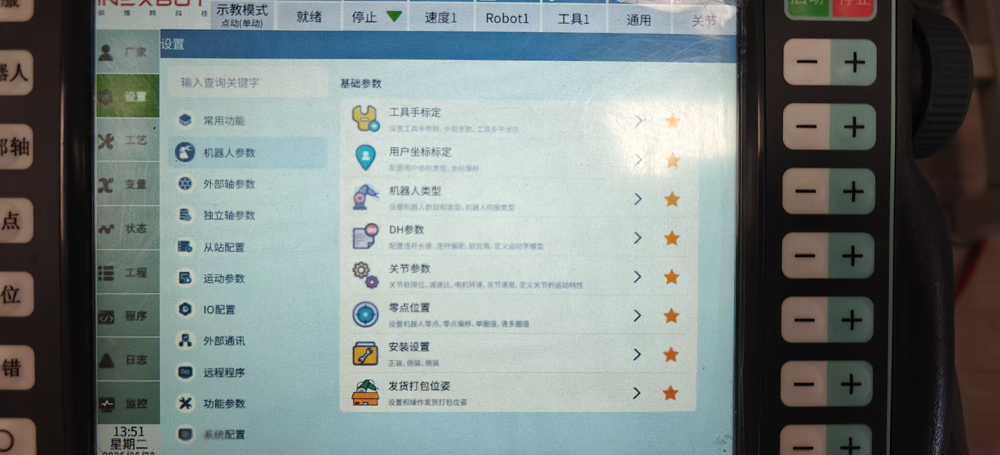
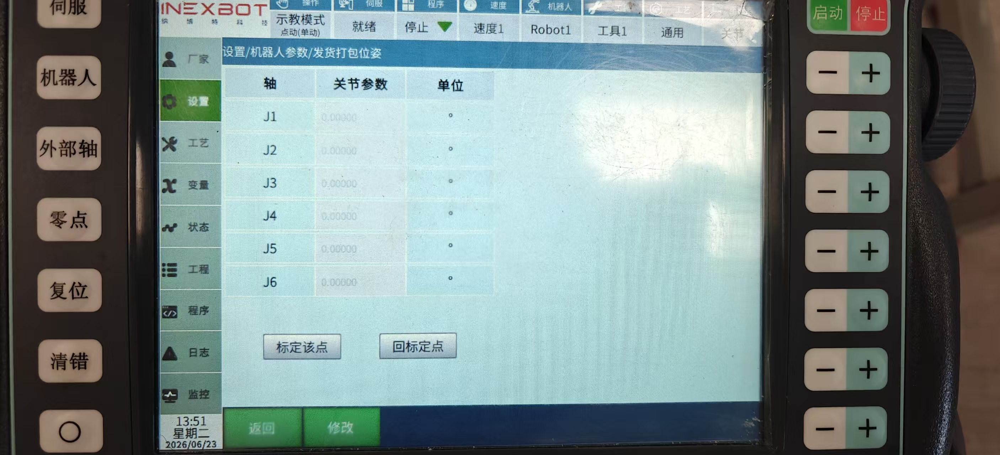

# 机器人打包位置设置功能

适用分支：rtl-25.01、dev-wk

## 一.功能概述

本功能集成在机器人参数-基础参数模块内，用于标定、存储机器人纸箱发货打包作业专用关节位姿，支持位姿一键回零复现、参数手动修改；页面轴列表会自动适配当前机型（4/5/6/7轴机器人），6轴机型默认展示J1~J6轴关节参数，标定完成后机器人可快速运动至打包工位执行装箱发货流程。

核心能力：

1.  新增独立「发货打包位姿」配置入口，与零点位置、工具标定等参数模块并列；

2.  实时标定：读取机器人当前各轴关节值保存为打包工位标准位姿；

3.  位姿复现：一键控制机器人运动至已标定的打包位姿；

4.  参数编辑：支持手动修改各轴关节数值保存；

5.  机型自适应：页面轴表格自动匹配机器人轴数，多余轴自动隐藏。

## 二.使用前准备

1.  设备安全:机器人控制柜上电，机器人本体无急停触发、安全门闭合，手动模式下低速运行，周边无人员、杂物干涉打包作业区域；

2.  机型确认:确认当前机器人轴数（4/5/6/7 轴），页面表格会自动匹配对应J轴，无需手动调整；

3.  点位预调:通过示教器移动机器人，将末端执行器移动至纸箱打包发货的标准作业位置，关节姿态调整至作业最优姿态；

4.  权限校验:登录系统账号需拥有机器人参数配置、位姿标定操作权限，无权限账号无法进入该页面。

## 三、操作步骤

### 步骤 1：进入发货打包位姿页面

1.  系统菜单依次打开：**设置 → 机器人参数 → 基础参数**；

2.  在基础参数功能图标栏，点击【发货打包位姿】图标，右侧自动跳转位姿配置表格页面。

{width="5.214862204724409in"
height="2.3737642169728783in"}

### 步骤 2：标定当前机器人打包工位（核心操作）

1.  示教器手动操控机器人移动至纸箱打包发货标准作业位；

2.  在右侧页面点击【标定该点】按钮；

3.  系统自动读取机器人J1~Jn（适配机型轴数）全部关节实时数值，填充至表格「关节参数」列完成存储；

4.  表格自动刷新展示本次标定的各轴参数，标定数据即时生效。

{width="5.259818460192476in"
height="2.394226815398075in"}

### 步骤 3：回标定位姿（机器人复现打包点位）

1.  完成标定保存后，机器人可移动至其他位置调试；

2.  页面点击【回标定点】按钮；

3.  机器人以安全低速自动运动至已存储的发货打包位姿，各轴关节匹配表格内标定参数。

### 步骤 4：手动修改关节参数

1.  点击页面底部绿色【修改】按钮，可以表格处修改位姿参数；

2.  修改完成后，点击页面底部绿色【保存】按钮，保存修改的位姿参数；

3.  保存后点击【回标定点】，机器人将按照手动修改后的数值运动。

### 步骤 5：退出页面

点击页面左下角绿色【返回】按钮，退回「机器人基础参数」主功能选择界面。

## 补充说明

1.  轴列表适配逻辑：若当前为 7 轴机器人，表格自动展示 J1-J7；4轴机型仅显示 J1-J4，多余轴行自动隐藏；

2.  数据持久化：标定/手动修改后的打包位姿参数会永久存储，重启控制柜、系统页面后数据不丢失；

3.  安全提示：执行【回标定点】前务必确认机器人运动路径无遮挡、无人员进入运动范围，避免碰撞。
