# 激光切割工艺

## 工艺介绍

激光切割过程分为穿孔与切割两部分，切割过程会先进行穿孔，在全局变量设置穿孔相关参数以及切割模式等参数，在切割变量中设置切割气压功率等参数，切割与穿孔在物理层面无差别，只是为了更好的实现切割效果进行的区分，穿孔是为了在切割材料的非边缘位置能够保证将材料穿透从而避免出现材料未被切割完全的情况出现，以及在后续的切割过程中能够降低激光效率从而实现节能的目标。

在切割过程中会不断进行吹气，其作用有两点，一是为了吹走切割过程中产生的残渣，保证切面光滑美观；二是提高切割效率，吹出气体氧气浓度会影响切割效率，在安全的范围内，浓度越高切割效率越高。

配合离线编程可实现复杂轨迹切割。

## 全局参数

打开示教器，进入"工艺"界面，选择"激光切割工艺"，进入"全局参数"界面。

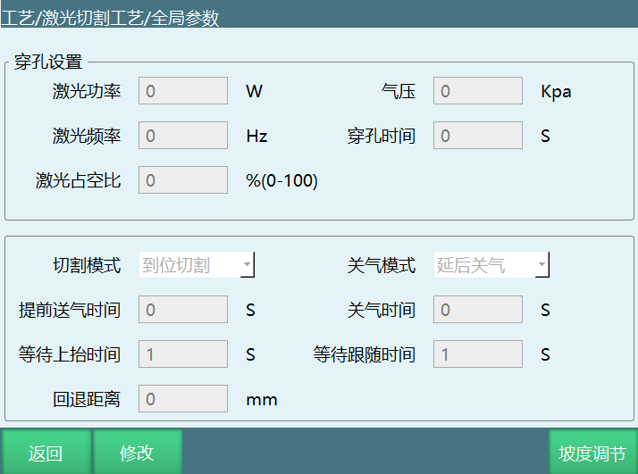

### 全局参数说明

1.穿孔设置：

- 激光功率：穿孔时激光器功率，单位为W。功率越大，穿孔效率越高，同时也会导致切面越粗糙。

- 气压：气压输出大小，气压控制清理切口背面残渣，保证切面光滑整洁。

- 激光频率：激光器每秒钟发出激光的次数。

- 穿孔时间：激光开始后进行穿孔的时长，时长要保证当前工件被穿透。

- 激光占空比：单位时间内激光工作的占比，如66%为一秒内激光工作0.66s。

2.切割模式：

- 到位切割：穿孔到位后再运行切割轨迹。

- 直接切割：不穿孔，直接运行切割轨迹。

关气模式：

- 延后关气：在激光切割结束后关闭吹气。

- 提前关气：在激光切割结束之前关气。

关气时间：根据设置的关气模式，提前或延迟的关气时间。

提前送气时间：激光切割开始之前，提前多少时间开始送气。

等待上抬时间：激光切割完毕之后等待多久开始上抬。

等待跟随时间：发出跟随信号后，等待跟随到位信号的最大时间。

回退距离：激光切割中断后继续运行回退距离。

注：收到跟随到位信号后机器人立即开始按照切割轨迹运行，若超过该时间都没收到跟随到位信号，系统会发出激光切割跟随到位超时的报错。

## 切割参数

### 切割参数说明

打开示教器，进入"工艺"界面，选择"激光切割工艺"，进入"切割参数"界面。

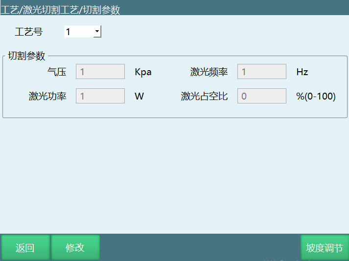

工艺号：保存多份参数可在指令中调用。

气压：切割时的气压。

激光功率：切割时激光器功率。

激光频率：激光器每秒钟发出激光的次数。

激光占空比：单位时间内激光工作的占比，如66%为一秒内激光工作0.66s。

数据来源：

## 模拟量匹配

进入"工艺"界面，选择"激光切割工艺"，进入"模拟量匹配"界面。

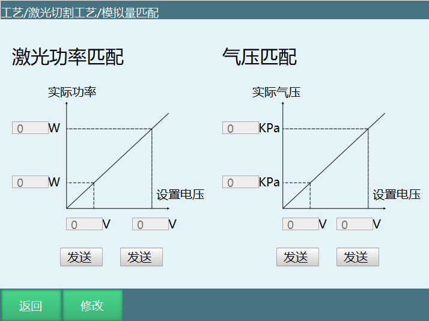

用法同焊接电流电压匹配，系统会根据填写的设置电压值和实际功率值、实际气压值计算出比例系数。

## IO设置

分为4个部分：控制操作、状态提示、功率气压、PWM。每一部分的具体界面见下方图示。

### 控制操作：

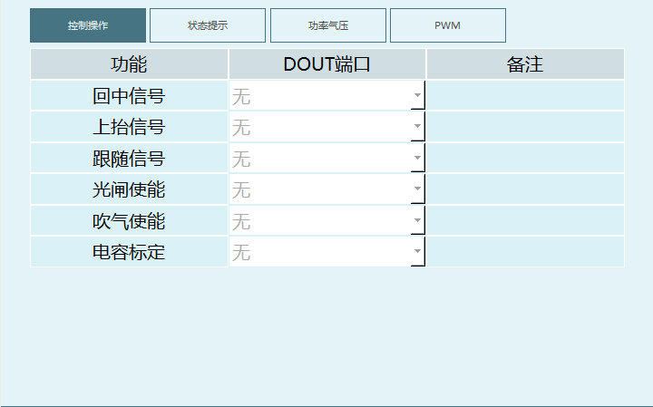

回中信号：对应信号输出后激光器回中。

上抬信号：对应信号输出后激光器上抬。

跟随信号：对应信号输出后激光器开始跟随。

光闸使能：对应信号输出后打开光闸。

吹气使能：对应信号输出后开始吹气。

电容标定：对应信号输出后检测是否有返回信号标定成功。

### 状态提示

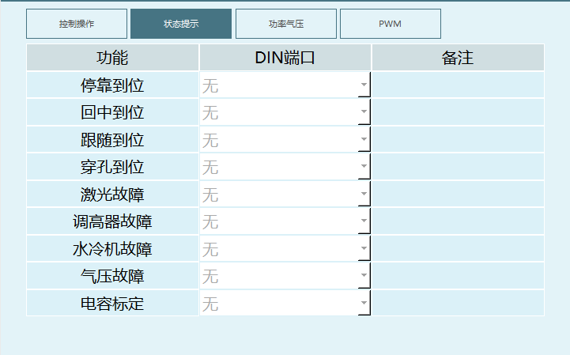

停靠到位：调高器停止到位后对应端口会有输入信号。

回中到位：调高器回中到位后对应端口会有输入信号。

跟随到位：调高器跟随到位后对应端口会有输入信号。

穿孔到位：激光切割穿孔到位后对应端口会有输入信号。

激光故障：出现激光故障后对应端口有输入信号并报错停止。

调高器故障：出现调高器故障后对应端口有输入信号并报错停止。

水冷机故障：出现水冷机故障后对应端口有输入信号并报错停止。

气压故障：出现气压故障后对应端口有输入信号并报错停止。

电容标定：调高器返回对应信号后标定成功。

### 功率气压

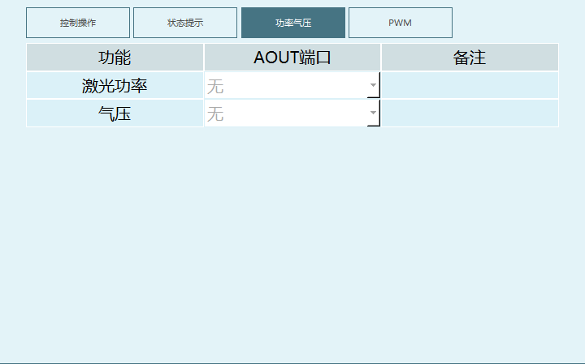

激光功率：控制激光功率的模拟量端口，根据模拟量输出控制实际输出。

气压：控制气压的模拟量端口，根据模拟量输出控制实际输出。

### PWM

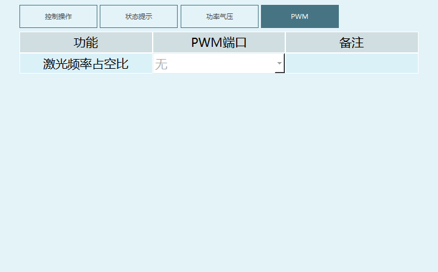

激光频率占空比：根据R4PWMIO板可以在两个端口中切换设置，只有带PWMIO才可选择端口。

## 手动操作

### 激光器

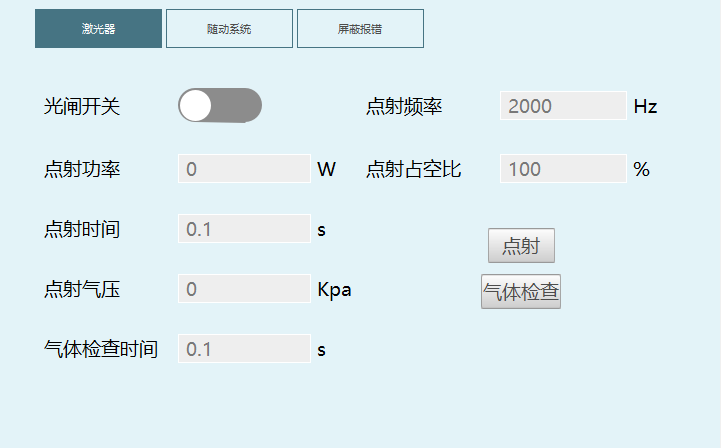

光闸开关：类似于焊接使能，打开后才能出光。需手动打开光闸开关，否则不会自动打开。

点射功率：点射时激光器功率。

点射时间：单次点射时间。

点射气压：点射时的气压。

气体检查时间：单次气体检查时间，在该时间内重复检查会提示。

点射频率：点射时每秒钟发出激光的次数。

点射按钮：调试激光参数使用，设置好对应IO后点击可以出光方便调整。

气体检查：调试激光参数使用，设置好对应IO后可进行气压检查方便调整。

### 随动系统

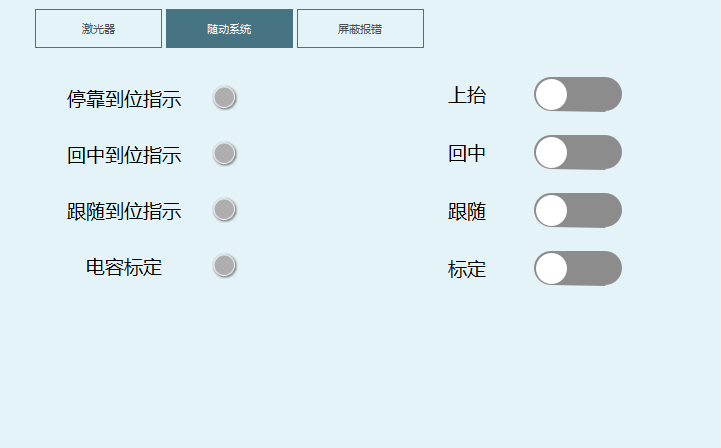

上抬、回中、跟随三个按钮分别控制激光器，需要绑定好IO后使用，到位后状态指示灯会变绿。

电容标定：新添加电容标定，标定需要设置好前面的IO输入输出并且调高器能正常返回输入，标定成功后状态指示灯会变绿。

### 屏蔽报错

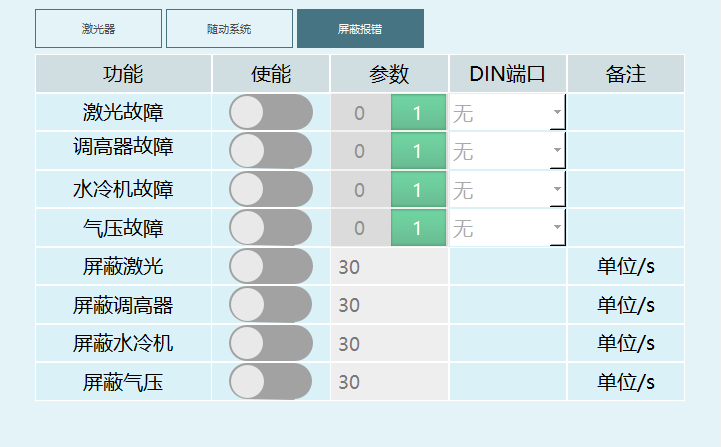

触发对应故障后机器人会停止，且只有对应报错触发后才可以打开屏蔽报错使能，根据需要设置屏蔽报错的时间，在该时间内移动机器人解除报错，设置的屏蔽时间结束后，如果报错信号还存在会再次报错下电。

## 指令说明

### 激光开始

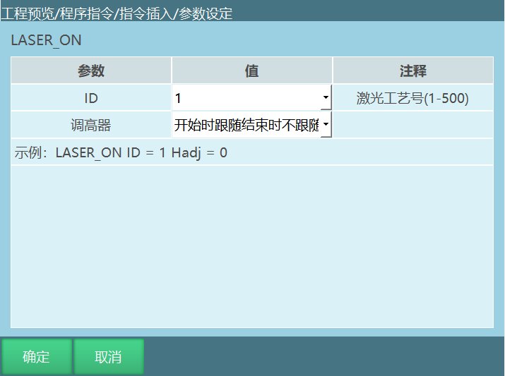

格式：LASER_ON【指令名】ID=1【工艺号】调高器开始时跟随结束时不跟随【调高器跟随选项】。

功能：到达切割起始点后开始切割。

参数：

|    |   |
| :--: | :-- |
| ID | 激光切割工艺号，范围(1,500) |
| 调高器 | **开始时跟随结束时不跟随** 需收到跟随到位信号才能继续运行，需搭配激光结束中的结束跟随使用，若激光结束的调高器选项选择继续跟随不出光，会提示不匹配默认使用结束跟随。 该方式开始运行时会发出跟随信号、打开吹气使能，收到跟随到位信号则运行下一条指令，结束时关闭跟随信号和吹气使能。 |
| 调高器 | **只跟随不出光出气** 需收到跟随到位信号才能继续运行，需搭配激光结束中的结束跟随使用，若激光结束中的调高器选项选择继续跟随不出光，会提示不匹配默认使用结束跟随。 该方式开始运行时会发出跟随信号、关闭吹气使能和光闸使能，收到跟随到位信号则运行下一条指令，结束时关闭跟随信号。 |
| 调高器 | **不跟随出光出气** 不需要收到跟随到位信号就可以继续运行，需搭配激光结束中的结束跟随使用，若激光结束中的调高器选项选择继续跟随不出光，会提示不匹配默认使用结束跟随。 该方式开始运行时会屏蔽跟随到位信号，也不会发送跟随信号，但在光闸开关开启的时候会正常出光，吹气使能也会打开。 |
| 调高器 | **结束时继续跟随** 需收到跟随到位信号才能继续运行，需搭配激光结束中的继续跟随不出光使用，若激光结束中的调高器选项选择结束跟随，会提示不匹配默认为结束跟随。 该方式开始运行时会发出跟随信号、打开吹气使能，收到跟随到位信号则运行下一条指令，结束时关闭光闸使能和吹气使能但不会关闭跟随信号。 |

不同衔接处信号处理的说明：

跟随接跟随（第一条激光开始指令应有上抬信号，第二条激光开始只有跟随信号）。

继续跟随-继续跟随。

继续跟随-跟随不出光出气。

继续跟随-开始跟随。

跟随接不跟随（不跟随开始时会屏蔽跟随信号，即使不收到任何信号都会继续运行）。

继续跟随-不跟随出光出气。

不跟随接跟随（激光结束需有上抬信号，激光开始需有跟随信号）。

开始跟随-继续跟随。

开始跟随-开始跟随。

开始跟随-只跟随不出光出气。

不跟随出光出气-继续跟随。

不跟随出光出气-开始跟随。

不跟随出光出气-只跟随不出光出气。

只跟随不出光出气-继续跟随。

只跟随不出光出气-开始跟随。

只跟随不出光出气-只跟随不出光出气。

不跟随接不跟随（激光结束都有上抬信号，激光开始屏蔽跟随信号）。

开始跟随-不跟随出光出气。

不跟随出光出气-不跟随出光出气。

只跟随不出光出气-不跟随出光出气。

### 激光结束

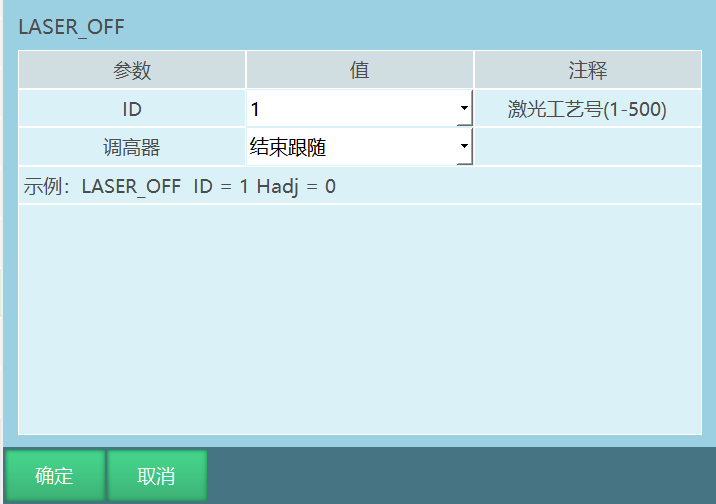

格式：LASER_OFF【指令名】ID=1【工艺号】调高器=结束跟随【调高器跟随选项】。

功能：到达切割结束点后停止切割。

参数：

|    |   |
| :--: | :-- |
| ID | 激光切割工艺号，范围(1,500) |
| 调高器 | **结束跟随** 调高器复位，停止运行。 |
| 调高器 | **继续跟随不出光** 切割结束时关闭光闸使能和吹气使能并持续发送跟随信号，收到跟随到位信号后会继续运行。 |

### 切割圆

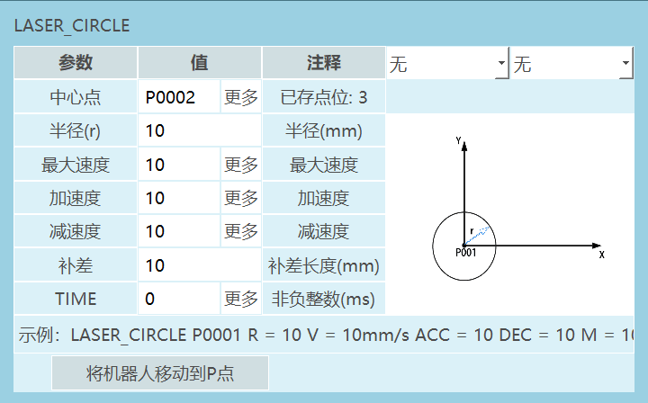

格式：LASER_CIRCLE【指令名】 P/GP【中心点】 R【半径】 V【最大速度】
ACC【加速度比率】 DEC【减速度比率】 M【补差】TIME
【提前执行时间，不设置则显示为0】。

功能：设置切割圆的参数，运行到该条指令时运行切割圆轨迹。

参数：

| 参数   | 说明  |
| :--: | :-- |
| 中心点 | 切割圆轨迹的中心点。使用局部位置变量（P）或全局位置变量（GP）。 |
| 半径(r) | 关节插补的速度，范围\[1,3000\]。 |
| 最大速度 | 切割圆时的指令速度，范围\[1,999\]。 |
| 加速度 | 切割圆时的加速度比率，范围\[1,100\]。 |
| 减速度 | 切割圆时的减速度比率，范围\[1,100\]。 |
| 补差 | 在整圆走完后根据补差距离继续运行圆轨迹的距离，范围\[0,500\]。 |
| TIME | 提前执行时间，和运动控制类指令的提前执行时间一样，是该指令的下一条非运动类指令提前执行的时间。单位ms |

### 激光设置

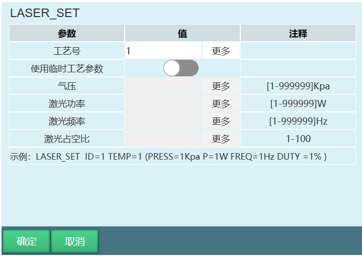

格式：LASER_SET【指令名】 ID【工艺号】
TEMP【是否使用临时工艺参数】（PRESS【气压】 P【功率】 FREQ【频率】
DUTY【占空比】（临时工艺参数））

功能：该指令可以在切割过程中通过指令修改气压、功率、频率、占空比，中间不停顿。

参数：

| 参数  | 说明  |
| :--: | :-- |
| 工艺号 | 激光切割工艺号，范围(1,500)，范围\[1,500\]，可绑定变量 |
| 使用临时工艺参数 | 如果不打开临时参数开关，则气压、激光功率、激光频率、激光占空比为工艺参数界面设置的值 打开使用临时参数开关，用户可以根据环境随时修改气压、激光功率、激光频率、激光占空比等参数 |
| 气压 | 激光切割的气压，范围\[1-99999\]Kpa，可绑定变量 |
| 激光功率 | 激光切割的功率，范围\[1-99999\]W，可绑定变量 |
| 激光频率 | 激光器每秒钟发出激光的次数，范围\[1-99999\]Hz，可绑定变量 |
| 激光占空比 | 激光器输出信号的占空时间比例，范围\[0,100\]%，可绑定变量 | 

**示例：**

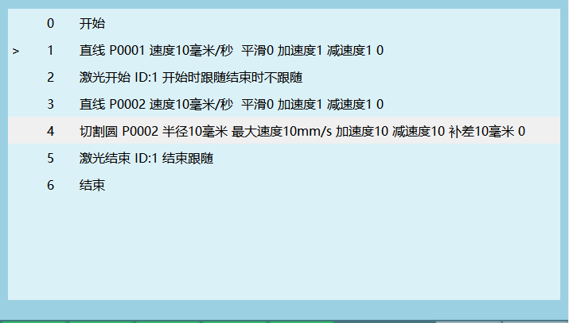

激光指令支持走直线、圆弧、整圆以及曲线，用法比较简单。

切割圆较为特殊，切割圆需要在上一点的基础上运行，上一条运动指令的点位为P0001，则切割圆的中心点也要设置为P0001才可以运行。

## AI 检索专用问答对 (Q&A for Retrieval)

**Q: 激光切割过程分为哪两部分？**

A: 激光切割过程分为穿孔与切割两部分，切割过程会先进行穿孔，在全局变量设置穿孔相关参数以及切割模式等参数，在切割变量中设置切割气压功率等参数。

**Q: 激光切割过程中吹气的作用是什么？**

A: 激光切割过程中吹气有两个作用：一是为了吹走切割过程中产生的残渣，保证切面光滑美观；二是提高切割效率，吹出气体氧气浓度会影响切割效率，在安全的范围内，浓度越高切割效率越高。

**Q: 什么是穿孔设置？**

A: 穿孔设置是激光切割前在材料非边缘位置进行穿透的参数设置，包括激光功率、气压、激光频率、穿孔时间和激光占空比等，确保材料被完全穿透。

**Q: 激光功率对穿孔有什么影响？**

A: 激光功率是穿孔时激光器功率，单位为W。功率越大，穿孔效率越高，同时也会导致切面越粗糙。

**Q: 激光切割模式有哪些？**

A: 激光切割模式分为到位切割和直接切割两种。到位切割是穿孔到位后再运行切割轨迹；直接切割是不穿孔，直接运行切割轨迹。

**Q: 关气模式有哪些？**

A: 关气模式分为延后关气和提前关气两种。延后关气是在激光切割结束后关闭吹气；提前关气是在激光切割结束之前关气。

**Q: 什么是切割参数？**

A: 切割参数是在切割过程中使用的参数，包括工艺号、气压、激光功率、激光频率、激光占空比等，可以保存多份参数在指令中调用。

**Q: 什么是模拟量匹配？**

A: 模拟量匹配功能类似于焊接电流电压匹配，系统会根据填写的设置电压值和实际功率值、实际气压值计算出比例系数。

**Q: IO设置分为哪几个部分？**

A: IO设置分为4个部分：控制操作、状态提示、功率气压、PWM。

**Q: 控制操作包含哪些信号？**

A: 控制操作包含回中信号、上抬信号、跟随信号、光闸使能、吹气使能、电容标定等信号。

**Q: 状态提示包含哪些信号？**

A: 状态提示包含停靠到位、回中到位、跟随到位、穿孔到位、激光故障、调高器故障、水冷机故障、气压故障、电容标定等信号。

**Q: 光闸开关的作用是什么？**

A: 光闸开关类似于焊接使能，打开后才能出光。需手动打开光闸开关，否则不会自动打开。

**Q: 随动系统包含哪些操作？**

A: 随动系统包含上抬、回中、跟随三个按钮分别控制激光器，需要绑定好IO后使用，到位后状态指示灯会变绿；还包含电容标定功能。

**Q: 什么是屏蔽报错功能？**

A: 屏蔽报错功能允许在触发对应故障后设置屏蔽时间，在该时间内移动机器人解除报错，设置的屏蔽时间结束后，如果报错信号还存在会再次报错下电。

**Q: LASER_START指令的作用是什么？**

A: LASER_START指令用于启动激光切割，支持走直线、圆弧、整圆以及曲线轨迹。

**Q: LASER_SET指令的作用是什么？**

A: LASER_SET指令可以在切割过程中通过指令修改气压、功率、频率、占空比，中间不停顿，可以使用工艺参数或临时工艺参数。

## 版本历史

| 版本    | 日期         | 变更内容 | 作者       |
| :---- | :--------- | :--- | :------- |
| 1.0.0 | 2026-06-30 | 初始版本 | qiuzegai |