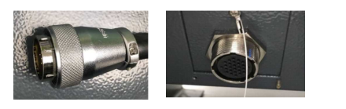
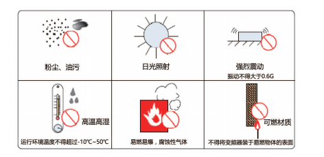
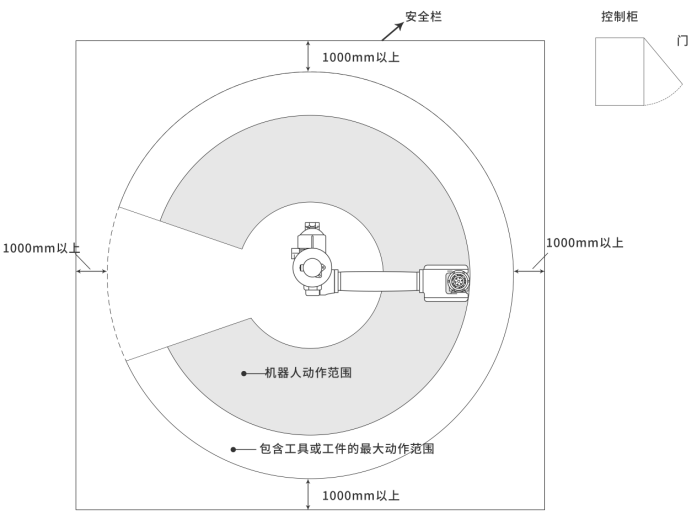
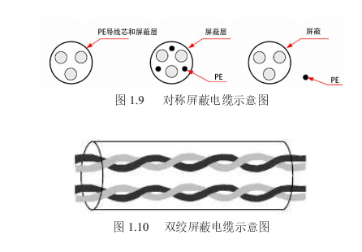
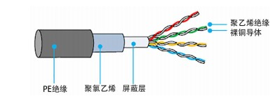
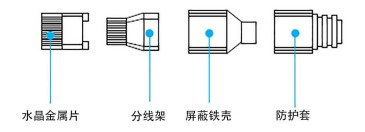
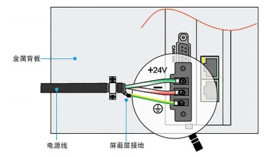
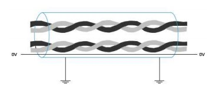

# 示教器功能按键说明手册

## 安全操作注意事项

机器人所有者、操作者必须对自己的安全负责,纳博特科技不对机器人使用的安全问题负责。纳博特提醒用户在使用机器人时必须注意使用安全设备，必须遵守安全条款。

不可使用机器人的场合：

1. 燃烧的环境；
2. 有爆炸可能的环境；
3. 无线电干扰的环境；
4. 水中或其他液体中；
5. 运送人或动物；
6. 不可攀附等其它场合。

安全操作规程：

1. 请不要带着手套操作示教器和操作面板；
2. 在点动操作机器人时要采用较低的速度倍率以增加对机器人的控制机会；
3. 在按下示教器上的点动键之前要考虑到机器人的运动趋势；
4. 要预先考虑好避让机器人的运动轨迹，并确认该路线不受干涉；
5. 机器人周围区域必须清洁、无油、水及杂质等。

生产运行：

1. 在开机运行前，必须知道机器人根据所编程序将要执行的全部任务。
2. 必须知道所有会左右机器人移动的开关、传感器和控制信号的位置和状态。
3. 必须知道机器人控制柜和外围控制设备上的紧急停止按钮的位置，准备在紧急情况下使用这些按钮。

|  |
| :---- |
| **警告**  - 禁止在机器人运行时进入到机器人工作区域！ - 机器人没有移动不代表程序已经执行完成，因为这时机器人很有可能是在等待让它继续移动的信号，此时如果进入到工作区域会威胁到操作者的人身安全。 |

### 产品组装

#### 示教器安装

示教器线末端的接口如图所示，连接到控制柜下方的接口如图所示：

#### 控制柜安装

安装环境：

1. 环境温度对控制器寿命有很大影响，不允许控制器的运行环境温度超过允许温度范围（-10℃\~50℃）；
2. 将控制器垂直安装在安装柜内的2阻燃物体表面上，周围要有足够的空间散热；
3. 请安装在不易振动的地方。振动应不大于0.6G。特别注意远离冲床等设备；
4. 避免装于阳光直射、潮湿、有水珠的地方；
5. 避免装于空气中有腐蚀性、易燃性、易爆性气体的场所；
6. 避免装在有油污、粉尘的场所，安装场所污染等级为PD2；
7. NRC系列产品为机柜内安装产品，需要安装在最终系统中使用，最终系统应提供相应的防火外壳、电气防护外壳和机械防护外壳等，并符合当地法律法规和相关IEC标准要求，如图所示：

安装位置：

1. 控制柜应安装在机器人动作范围之外（安全栏之外）；
2. 控制柜应安装在能看清机器人动作的位置；
3. 控制柜应安装在便于打开门检查的位置；
4. 控制柜至少要距离墙壁500mm，以保持维护通道畅通。

机器人相关范围如下图所示：

线缆分类：

等级一：敏感信号（低压模拟信号，高速编码器信号，高速通讯信号，正负10V模拟量信号，低速422、485信号，数字输入输出信号）。

等级二：干扰信号（低压电源，接触器控制线，带录波器的电机线高压交流电源线，不带录波器的电机线）。

1. 电缆选型输入输出主回路电缆推荐使用对称屏蔽电缆，与四芯电缆对比，使用对称屏蔽电缆可以减少整个传导系统的电磁辐射。
2. 推荐的功率电缆类型------对称屏蔽电缆。
3. 推荐的信号线缆类型------双绞屏蔽电缆。

电缆示意图如下：

注意：数字信号线推荐使用双绞屏蔽线缆。

推荐的通讯线缆类型------屏蔽通讯线缆，如图所示：

屏蔽通讯线缆示意图

注意：使用的水晶头必须带屏蔽金属壳，通讯线缆的屏蔽层与水晶头的屏蔽铁壳压接在一起，如图所示：

带屏蔽金属壳水晶头示意图

布线要求：

1. 功率电缆应远离所有信号电缆敷设。
2. 电机电缆、输入电源线和控制回路电缆尽量不要布线在同一线槽。
3. 避免电机电缆与控制回路长距离并行走线时耦合产生的电磁干扰。
4. 同一线槽中不同等级线缆之间最少保持100mm间距。

注意：

1. 不同等级的线缆分开布置，长距离电缆同向布线时应该将不同等级线缆之间最少保持100mm间距。
2. 使用导体做为背板(采用没有被喷塑的锌板)将控制器的金属部分直接与背板连接。
3. 根据等级保持电缆的分离，如果不同等级的线缆必须交叉，则应保持90°交叉。

接地要求：

| |
| :---- |
| **警告**  - 请务必将接地端接地，否则可能有触电或者干扰而产生误动作的危险！|

1. 电源线接地要求，如图所示：

2. 差分信号线（CAN/RS485/RS422）采用双绞屏蔽线缆，屏蔽层在电缆两端必须接0V，如图所示：

接线注意事项：

1. 参加接线与检查的人员必须是具有相应技术的专业人员。
2. 产品必须可靠接地，接地电阻应小于4
    欧姆，不能使用中性线（零线）代替地线。
3. 接线必须正确、牢固，以免导致产品故障或意想不到的后果。
4. 与产品连接的浪涌吸收二极管必须按规定方向连接，否则会损坏产品。
5. 插拔插头或打开产品机箱前，必须切断产品电源。
6. 尽量避免信号线和电源线从同一管道穿过，应该距离30mm以上。
7. 信号线、编码器(PG) 反馈线请使用多股绞合线以及多芯绞合屏蔽线。
    对于配线长度，指令输入线最长为3m，PG
    反馈线最长为20m。编码器的信号线为一组双绞线、电源线为一组双绞线、电池线为一组双绞线。
8. 请勿频繁ON/OFF 电源。在需要反复地连续ON/OFF 电源时，请控制在 1
    分钟内 1 次以下。
    由于在伺服单元的电源部分带有电容，如果频繁地ON/OFF会造成伺服单元内部的主电路元件性能下降。
9. 确认控制系统供电开关电源功率，电压。保证控制器、示教器和IO模块的功率不小于50W，具体电源功率，看IO模块负载大小。
10. 建议将伺服开关电源与控制器系统开关电源分开使用，防止出现伺服干扰控制系统情况。

注意：

1.  控制系统与伺服连接网线需要使用超六类屏蔽网线。

2.  如果一个轴对应一个伺服，则网线需要按照轴的顺序接。

3.  请按照控制器---伺服---IO板的顺序接线。

## 示教器转接盒接线定义图

{width="2.512080052493438in"
height="1.9528215223097112in"}

## T30示教器按键说明

{width="4.085632108486439in"
height="2.7237543744531933in"}

+:----------------------------------------------------------------------------:+:-------------------------------------------------------------------------------------------------------------------------------------------------------------------------------+
| {width="0.58in"                 | 点击【伺服】,切换伺服状态（停止、就绪）                                                                                                                                        |
| height="0.39875in"}                                                          |                                                                                                                                                                                |
|                                                                              | {width="0.386418416447944in" height="0.2777384076990376in"}                                                                       |
|                                                                              |                                                                                                                                                                                |
|                                                                              | {width="0.4044619422572178in" height="0.25278871391076113in"}                                                                     |
+------------------------------------------------------------------------------+--------------------------------------------------------------------------------------------------------------------------------------------------------------------------------+
| {width="0.5981255468066492in"   | 点击【机器人】,切换当前机器人（仅多机模式时可用）                                                                                                                              |
| height="0.4168755468066492in"}                                               |                                                                                                                                                                                |
+------------------------------------------------------------------------------+--------------------------------------------------------------------------------------------------------------------------------------------------------------------------------+
| {width="0.54375in"              | 点击【外部轴】,在连接外部轴时，切换外部轴和机器人，（仅在有外部轴时可用）                                                                                                      |
| height="0.3715627734033246in"}                                               |                                                                                                                                                                                |
|                                                                              | {width="0.3807939632545932in" height="0.2599070428696413in"}                                                                      |
|                                                                              |                                                                                                                                                                                |
|                                                                              | 外部轴：选择外部轴可以点动当前连接的外部轴                                                                                                                                     |
|                                                                              |                                                                                                                                                                                |
|                                                                              | 机器人：选择机器人可以对当前的机器人进行点动等操作                                                                                                                             |
|                                                                              |                                                                                                                                                                                |
|                                                                              | {width="0.3776399825021872in" height="0.2643482064741907in"}                                                                      |
+------------------------------------------------------------------------------+--------------------------------------------------------------------------------------------------------------------------------------------------------------------------------+
| {width="0.6343755468066492in"   | 点击【零点】,机器人回到零点位置                                                                                                                                                |
| height="0.44406277340332456in"}                                              |                                                                                                                                                                                |
+------------------------------------------------------------------------------+--------------------------------------------------------------------------------------------------------------------------------------------------------------------------------+
| {width="0.6343755468066492in"   | 点击【复位】,机器人运行到记录的复位点位置                                                                                                                                      |
| height="0.435in"}                                                            |                                                                                                                                                                                |
+------------------------------------------------------------------------------+--------------------------------------------------------------------------------------------------------------------------------------------------------------------------------+
| {width="0.6343755468066492in"   | 点击【清错】,机器人在出现错误提示时，点击清错按钮，可清除错误提示                                                                                                              |
| height="0.435in"}                                                            |                                                                                                                                                                                |
+------------------------------------------------------------------------------+--------------------------------------------------------------------------------------------------------------------------------------------------------------------------------+
| {width="0.5981255468066492in"   | 点击【⭕】机器人进入拖拽模式，可以对机器人进行拖拽让机器人到达目标点位                                                                                                         |
| height="0.40781277340332456in"}                                              |                                                                                                                                                                                |
|                                                                              | 注意：机器人只有在辨识成功后才可以进行拖拽                                                                                                                                     |
+------------------------------------------------------------------------------+--------------------------------------------------------------------------------------------------------------------------------------------------------------------------------+
| {width="0.5528127734033246in"   | 点击【F/B】,在单步运行程序时可以选择正序或者倒序                                                                                                                               |
| height="0.5528127734033246in"}                                               |                                                                                                                                                                                |
|                                                                              | 正序运行：指令由上向下运行                                                                                                                                                     |
|                                                                              |                                                                                                                                                                                |
|                                                                              | {width="0.5296270778652669in" height="0.3590693350831146in"}                                                                      |
|                                                                              |                                                                                                                                                                                |
|                                                                              | 倒序运行：指令由下向上运行                                                                                                                                                     |
|                                                                              |                                                                                                                                                                                |
|                                                                              | {width="0.5008759842519686in" height="0.37133858267716535in"}                                                                     |
+------------------------------------------------------------------------------+--------------------------------------------------------------------------------------------------------------------------------------------------------------------------------+
| {width="0.5890627734033246in"   | 点击【单步】在运行程序时，如下图所示，在示教模式下运行程序，点击【单步】运行第一行程序，当第一行程序运行结束后点击【单步】继续运行第二行程序，依次运行直到整个作业文件运行结束 |
| height="0.58in"}                                                             |                                                                                                                                                                                |
|                                                                              | {width="1.7570789588801399in" height="1.091353893263342in"}                                                                       |
+------------------------------------------------------------------------------+--------------------------------------------------------------------------------------------------------------------------------------------------------------------------------+
| {width="0.5709372265966755in"   | 【V-】减小全局速度，每点击一次全局速度减小5%                                                                                                                                   |
| height="0.5618755468066492in"}                                               |                                                                                                                                                                                |
|                                                                              | {width="0.43211286089238843in" height="0.2720713035870516in"}                                                                     |
+------------------------------------------------------------------------------+--------------------------------------------------------------------------------------------------------------------------------------------------------------------------------+
| {width="0.54375in"              | 【V+】增加全局速度，每点击一次全局速度增加5%                                                                                                                                   |
| height="0.5346872265966754in"}                                               |                                                                                                                                                                                |
|                                                                              | {width="0.39806977252843395in" height="0.25638451443569554in"}                                                                    |
+------------------------------------------------------------------------------+--------------------------------------------------------------------------------------------------------------------------------------------------------------------------------+
| {width="0.5528127734033246in"   | 【工具】切换工具手                                                                                                                                                             |
| height="0.54375in"}                                                          |                                                                                                                                                                                |
|                                                                              | {width="0.3621861329833771in" height="0.25074365704286966in"}                                                                     |
+------------------------------------------------------------------------------+--------------------------------------------------------------------------------------------------------------------------------------------------------------------------------+
| {width="0.6343755468066492in"   | 【坐标】切换坐标、点击坐标按钮可以依次切换关节坐标、直角坐标、工具坐标和用户坐标                                                                                               |
| height="0.6253127734033246in"}                                               |                                                                                                                                                                                |
|                                                                              | {width="0.35694444444444445in" height="0.27340441819772526in"}                                                                    |
+------------------------------------------------------------------------------+--------------------------------------------------------------------------------------------------------------------------------------------------------------------------------+
| {width="0.6343755468066492in"   | 【切换操作模式】旋钮在左边表示当前在示教模式、旋钮在中间表示当前在运行模式、旋钮在右边表示当前在远程模式                                                                       |
| height="0.6343755468066492in"}                                               |                                                                                                                                                                                |
+------------------------------------------------------------------------------+--------------------------------------------------------------------------------------------------------------------------------------------------------------------------------+
| {width="0.6343755468066492in"   | 【紧急停止按钮】当程序在运行过程中如果出现碰撞或者飞车等情况下按下急停按钮，机器人会停止运动                                                                                   |
| height="0.6434372265966755in"}                                               |                                                                                                                                                                                |
+------------------------------------------------------------------------------+--------------------------------------------------------------------------------------------------------------------------------------------------------------------------------+
| {width="7.298993875765529e-2in" | 【启动】在运行模式下用来启动程序，点击【启动】程序开始运行                                                                                                                     |
| height="6.89359142607174e-2in"}                                              |                                                                                                                                                                                |
+------------------------------------------------------------------------------+--------------------------------------------------------------------------------------------------------------------------------------------------------------------------------+
| {width="6.795713035870517e-2in" | 【停止】在运行模式下用来暂停程序，点击【停止】正在运行的程序会暂停运行                                                                                                         |
| height="6.244641294838145e-2in"}                                             |                                                                                                                                                                                |
+------------------------------------------------------------------------------+--------------------------------------------------------------------------------------------------------------------------------------------------------------------------------+
| {width="6.29232283464567e-2in"  | 【-】示教时对应轴负方向运行                                                                                                                                                    |
| height="5.942694663167104e-2in"}                                             |                                                                                                                                                                                |
+------------------------------------------------------------------------------+--------------------------------------------------------------------------------------------------------------------------------------------------------------------------------+
| {width="7.298993875765529e-2in" | 【+】示教时对应轴正方向运行                                                                                                                                                    |
| height="6.89359142607174e-2in"}                                              |                                                                                                                                                                                |
+------------------------------------------------------------------------------+--------------------------------------------------------------------------------------------------------------------------------------------------------------------------------+
| {width="0.4168755468066492in"   | 程序界面旋转切换上一行、下一行                                                                                                                                                 |
| height="0.435in"}                                                            |                                                                                                                                                                                |
+------------------------------------------------------------------------------+--------------------------------------------------------------------------------------------------------------------------------------------------------------------------------+
| {width="0.4531255468066492in"   | 按到中间控制机器人上电、按到底控制机器人下电、松开按键控制机器人下电                                                                                                           |
| height="0.4531255468066492in"}                                               |                                                                                                                                                                                |
+------------------------------------------------------------------------------+--------------------------------------------------------------------------------------------------------------------------------------------------------------------------------+

## 示教器功能键操作说明

+:--------------------------------------------------------------------------:+:-----------------------------------------------------------------------------------------------------------------------------------------------------------+
| {width="0.7068755468066492in" | 点击【操作员】可以进行操作员、技术员、管理员、厂家用户权限的设置，不同用户的权限是不同的，只有用户权限为厂家时才可以修改机器人参数，厂家用户的权限是最高的 |
| height="0.4168755468066492in"}                                             |                                                                                                                                                            |
|                                                                            | {width="1.564501312335958in" height="1.1587292213473315in"}                                                   |
|                                                                            |                                                                                                                                                            |
|                                                                            | 1.  用户自定义权限:                                                                                                                                        |
|                                                                            |                                                                                                                                                            |
|                                                                            | 2.  在厂家/管理员权限，点击【权限设置】，进入权限设置界面                                                                                                  |
|                                                                            |                                                                                                                                                            |
|                                                                            | 3.  点击 【新建】，自定义用户名、密码、使用权限                                                                                                            |
|                                                                            |                                                                                                                                                            |
|                                                                            | 4.  点击【确定】                                                                                                                                           |
|                                                                            |                                                                                                                                                            |
|                                                                            | 5.  点击【保存】，用户权限自定义完成                                                                                                                       |
+----------------------------------------------------------------------------+------------------------------------------------------------------------------------------------------------------------------------------------------------+
| {width="0.7068755468066492in" | 点击【设置】打开机器人功能设置界面                                                                                                                         |
| height="0.435in"}                                                          |                                                                                                                                                            |
|                                                                            | {width="1.650997375328084in" height="1.219303368328959in"}                                                    |
+----------------------------------------------------------------------------+------------------------------------------------------------------------------------------------------------------------------------------------------------+
| {width="0.7068755468066492in" | 点击【工艺】打开工艺选择界面                                                                                                                               |
| height="0.435in"}                                                          |                                                                                                                                                            |
|                                                                            | 工艺类型：激光切割工艺、喷涂工艺、打磨工艺、寻位跟踪工艺、焊接工艺、码垛工艺、视觉工艺、传送带工艺、专用工艺                                               |
|                                                                            |                                                                                                                                                            |
|                                                                            | {width="1.6174978127734034in" height="1.0825273403324585in"}                                                  |
+----------------------------------------------------------------------------+------------------------------------------------------------------------------------------------------------------------------------------------------------+
| {width="0.7068755468066492in" | 点击【变量】，打开变量界面，在此界面可以查看设置全局位置变量的点位信息和全局数值变量赋值                                                                   |
| height="0.44406277340332456in"}                                            |                                                                                                                                                            |
|                                                                            | {width="1.636667760279965in" height="1.0952602799650044in"}                                                   |
+----------------------------------------------------------------------------+------------------------------------------------------------------------------------------------------------------------------------------------------------+
| {width="0.6978127734033246in" | 点击【状态】，打开状态操作界面                                                                                                                             |
| height="0.4168755468066492in"}                                             |                                                                                                                                                            |
|                                                                            | {width="1.4551738845144357in" height="1.082260498687664in"}                                                   |
+----------------------------------------------------------------------------+------------------------------------------------------------------------------------------------------------------------------------------------------------+
| {width="0.6978127734033246in" | 点击【工程】，打开工程操作界面，如图所示的程序都是在工程界面建立的工程文件                                                                                 |
| height="0.42593722659667543in"}                                            |                                                                                                                                                            |
|                                                                            | {width="1.4628160542432196in" height="0.9713090551181103in"}                                                  |
+----------------------------------------------------------------------------+------------------------------------------------------------------------------------------------------------------------------------------------------------+
| {width="0.7068755468066492in" | 点击【程序】，进入程序界面                                                                                                                                 |
| height="0.4168755468066492in"}                                             |                                                                                                                                                            |
|                                                                            | {width="1.4678915135608048in" height="0.9882261592300963in"}                                                  |
+----------------------------------------------------------------------------+------------------------------------------------------------------------------------------------------------------------------------------------------------+
| {width="0.6978127734033246in" | 点击【日志】，打开日志界面，                                                                                                                               |
| height="0.42593722659667543in"}                                            |                                                                                                                                                            |
|                                                                            | 在此界面可以查看机器人在运动时的当前错误、历史日志、查看日志的时间、日志类型（全部、消息、操作、警告、提示）                                               |
|                                                                            |                                                                                                                                                            |
|                                                                            | {width="1.4596358267716536in" height="0.9806047681539808in"}                                                  |
+----------------------------------------------------------------------------+------------------------------------------------------------------------------------------------------------------------------------------------------------+
| {width="0.7068755468066492in" | 点击【监控】，打开监控弹窗界面                                                                                                                             |
| height="0.42593722659667543in"}                                            |                                                                                                                                                            |
|                                                                            | {width="1.4037456255468066in" height="1.292557961504812in"}                                                   |
+----------------------------------------------------------------------------+------------------------------------------------------------------------------------------------------------------------------------------------------------+
| {width="0.4531255468066492in" | 日期时间显示                                                                                                                                               |
| height="0.435in"}                                                          |                                                                                                                                                            |
+----------------------------------------------------------------------------+------------------------------------------------------------------------------------------------------------------------------------------------------------+

## 监控界面参数说明

{width="3.9183147419072615in"
height="2.05047353455818in"}

### 快捷键

{width="2.998604549431321in"
height="2.736515748031496in"}

1.  【回零】按下上电使能，点击回零机器人会运行到零点位置。

零点位置说明：每个坐标系所有轴都为 0
的点，这叫做坐标系原点，对于关节坐标系来说，这个点叫做零点位置（机器人的第
1-6 轴的关节坐标均为 0 的位置）。

2.  【外部轴】可以用来切换当前机器人和外部轴。

3.  【回安全点】按下上电使能，点击回安全点机器人运行到设置的安全点位（复位点或者复位程序）

4.  【示教方式点动（单动）】可以切换机器人点动模式和拖拽模式。

{width="1.5978379265091864in"
height="0.5766108923884514in"}

拖拽说明：辨识成功后选择拖拽方式后就可以切换到拖拽模式。

5.  【拔出示教器】拔出示教器后控制器与示教器连接断开。

6.  【关机/重启】点击后会出现以下提示窗口，用户可选择关机、重启、取消。选择关机则关闭控制器和示教器，选择重启则重启控制器和示教器，选择取消则关闭提示窗口。

{width="2.160738188976378in"
height="1.5870909886264217in"}

7.  外部轴单动/联动：在监控中可以切换外部轴单动/联动模式，前提是需要标定好需要联动的外部轴。

联动：点动外部轴时，机器人可跟随相对运行，点动机器人时外部轴不动。

单动：点动机器人时外部轴保持不动；点动外部轴时机器人保持不动。

### 程序运行

{width="3.1963396762904637in"
height="1.4003762029746283in"}

1.  主程序：

- 程序运行时可以在此界面查看当前操作模式（示教、运行、远程）

- 运行状态（暂停、停止、运行）

- 运行次数

- 运行时间

2.  全局后台：全局后台程序运行时可以监控运行的全局后台作业文件。

### 机器坐标

1.  监控机器人在运动时的关节坐标、直角坐标、工具坐标、用户坐标，大地坐标的点位。

2.  检测量距：检测机器人从一个点运动到另一个点的距离。

### 历史指令

{width="3.40459208223972in"
height="1.2916918197725284in"}

- 序号：程序运行当前行指令时的排序。排序为按时间倒序排序，最先运行的指令在最下面，最后运行的指令在最上面。

- 文件名：当前运行的作业文件名。

- 行号：程序运行的当前行指令在作业文件中的行号数。

### 运动误差 （单位‱）

跟踪误差：指[电机](https://baike.baidu.com/item/%E7%94%B5%E6%9C%BA/117901?fromModule=lemma_inlink" \t "https://baike.baidu.com/item/%E8%B7%9F%E8%B8%AA%E8%AF%AF%E5%B7%AE/_blank)运动过程中从开始运动到实际位置的时间段内的位置命令与实际位置的差值，即目标位置和实际位置的差值。

机器人在运行时可以在此界面查看误差值。

{width="2.338912948381452in"
height="2.118490813648294in"}

### 电机状态 

机器人的每个关节轴上都有一个电机，所以当机器人在运动的时候我们可以在电机状态界面查看每个轴的电机扭矩、电机转速、电机负载、编码器位置、电机电流参数。

- 电机扭矩：电机的扭矩是指电动机输出的旋转力矩，通常用于描述电机产生的力矩大小或强度，更具体地说，电动机扭矩是应用在电动机轴上的力矩。

- 电机转速：电机每分钟旋转的圈数，代表电机转动的快慢程度。

- 电机负载：电机负载是指电机在工作过程中所承受的力或转矩。

- 编码器位置：位置实际值记录的是机器人当前位置编码器的值，位置目标值记录的机器人目标位置的编码器的值。

- 电机电流：查看电机的电流参数，在操作参数里增加电机电流参数单位，单位为：A或者‰
  。

{width="4.64328302712161in"
height="2.142586395450569in"}

### IO状态

机器人在执行作业文件时如果设置了信号参数，可以在此界面监控数字信号和模拟信号。

如下图所示：

{width="3.2167432195975505in"
height="1.1303958880139982in"}

### 数值变量 

机器人在执行运算类指令时，会把计算的结果存到目标变量，在监控-数值变量界面可以看到计算结果，如图所示：

{width="3.0732753718285215in"
height="1.1357753718285215in"}

注意事项：将计算结果存在局部数值变量的话在整个作业文件运行结束后计算结果会被清掉变为0！

{width="3.069686132983377in"
height="2.075812554680665in"}

{width="3.0083508311461067in"
height="2.757655293088364in"}

{width="2.808885608048994in"
height="2.6025831146106735in"}

例如：图一是作业文件（TEST101）里的指令还没有运行结束，变量的值依然是计算出来的结果，当作业文件（TEST101）里的指令都运行结束后，局部变量数值被清掉，如图二所示。

### 轴速度 

机器人在移动时根据设置的指令速度和全局速度参数，在监控-轴速度界面可以监控机器人运行时的当前速度和最大速度，如图：

{width="3.408193350831146in"
height="1.3154429133858268in"}

{width="3.405220909886264in"
height="1.3292311898512685in"}

### 轨迹回放 

{width="2.4257458442694664in"
height="2.1920155293088364in"}

1.  采样间隔：每个点之间的采样间隔，例如设置的采样间隔是0.03秒，那第一个点和第二个点的采样间隔是0.03；

2.  最大采样点数：将一段拖拽轨迹分成设置的采样点数，例如设置的采样点数是300会将拖拽的整段轨迹分成300个点；

3.  开始：上使能，点击开始按钮后拖拽机器人；

4.  停止：拖拽结束后，点击停止，拖拽轨迹被记录；

5.  回放：回放拖拽轨迹；

6.  清除：记录的拖拽轨迹被清除；

7.  轨迹名：拖拽的轨迹名，拖拽结束后，轨迹被记录下来，可在这里设置记录的轨迹名。后面也可以在设置-人机协作-拖拽示教界面选择记录的轨迹名，点击回放就可以回放被记录下来的轨迹；

8.  保存：保存拖拽轨迹。

### 轨迹采集

{width="2.5010061242344706in"
height="2.3066272965879264in"}

文件名：记录保存的拖拽轨迹

回放：回放记录的轨迹

删除：删除记录的轨迹

导出轨迹：U盘根路径生成一个文件夹（dragPos+时间），轨迹保存在文件夹

导入轨迹：导入轨迹文件，U盘根路径下必须有一个名为dragPos+时间的文件夹，并且文件夹下要有轨迹

### 位置变量 

机器人在运行时可以读取到目标点位的信息（坐标、形态、工具手编号、用户编号、姿态值）和当前程序名，如下图：

{width="2.4010640857392826in"
height="2.197402668416448in"}

注意事项：局部位置变量。

{width="2.373015091863517in"
height="1.6038954505686789in"}

图中程序说明：

1.  假设P0001关节坐标（10 ，20 ，30 ，-10 ，-20
    ，-30），此时监控-位置变量界面P0001关节坐标显示（10 ，20 ，30 ，-10
    ，-20 ，-30） ;

2.  程序运行到第2行时P0001在监控-位置变量-关节坐标显示为:

（30 ，20 ，30 ，-10 ，-20 ，-30）;

3.  整个作业文件(TEST2)运行结束后P0001在监控-位置变量-关节坐标显示

（0 ，0 ，0 ，0 ，0 ，0） ;

4.  重新运行程序上电P0001（10 ，20 ，30 ，-10 ，-20 ，-30）.

说明：第1条指令的P0001点位我们认为是目标点位的初始点位、第2条点位加的数值为附加值，通过加减改等操作对目标点位进行修改的值可以理解为附加值.

例如：P0001关节J1轴加20（这个20可以理解为是附加值），监控界面的显示为初始值+附件值，但在【程序】-【变量】界面查看目标变量的点位显示一直是初始点位。作业文件的所有指令运行结束后P0001点位坐标为初始点位的坐标.

### 计算器

进行加、减、乘、除运算

{width="2.5391688538932633in"
height="2.3603543307086614in"}

# 状态栏介绍

{width="4.136279527559055in"
height="2.3315146544181977in"}

### 操作模式

  ---------------- ------------------------------------------------------
      操作模式       示教器旋钮切换模式（示教模式、运行模式、远程模式）

  ---------------- ------------------------------------------------------

### 伺服状态

+:-------------:+-----------------------------------------------------------------------+
| 伺服状态      | 1.  停止、就绪：点击左侧伺服功能按键，可以切换伺服为停止或者就绪状态  |
|               +-----------------------------------------------------------------------+
|               | 2.  运行：                                                            |
|               |                                                                       |
|               | 示教模式下，按下"使能健"，伺服状态切换为"运行"状态                    |
|               |                                                                       |
|               | 运行模式下，按下"启动"按钮，伺服状态切换为"运行"状态                  |
|               |                                                                       |
|               | 远程模式下，通过MODBUS给地址码或者设置远程信号切换伺服状态            |
|               +-----------------------------------------------------------------------+
|               | 3.  警报：拍下控制柜/示教器上的"急停按钮"，伺服状态切换为"警报"状态。 |
|               |                                                                       |
|               | 注释：当急停接在伺服上时，拍下"急停按钮"伺服状态才会切换为"警报"      |
+---------------+-----------------------------------------------------------------------+

### 程序状态

+:-------------:+--------------------------------------------------------------------------------------+
| 程序状态      | 1.  运行                                                                             |
|               |                                                                                      |
|               | 示教模式下按下"使能健"，点击"单步"按钮，程序状态切换为运行                           |
|               |                                                                                      |
|               | 运行模式下按下"启动"按键，程序开始与运行，程序状态切换为"运行"                       |
|               |                                                                                      |
|               | 远程模式下通过MODBUS给地址码或者给远程启动信号后，程序开始运行，程序状态切换为"运行" |
|               +--------------------------------------------------------------------------------------+
|               | 2.  停止                                                                             |
|               +--------------------------------------------------------------------------------------+
|               | 3.  暂停                                                                             |
|               |                                                                                      |
|               | 运行模式下，程序开始运行后，按下"停止"按钮，程序状态变为"暂停"                       |
|               |                                                                                      |
|               | 远程模式下，通过MODBUS给地址码或者给远程信号                                         |
+---------------+--------------------------------------------------------------------------------------+

### 速度状态

+:------------:+--------------------------------------------------------------------------------+
| 速度状态     | 1.  点动                                                                       |
|              |                                                                                |
|              | 速度范围：\[1\~20段\]                                                          |
|              |                                                                                |
|              | 按下示教器底部的【V+】，【V-】速度每次逐段增加或者减小                         |
|              |                                                                                |
|              | 点击下图所示的【+】，【-】速度每次逐段增加或者减小                             |
|              |                                                                                |
|              | {width="1.0718711723534557in"     |
|              | height="0.6571030183727035in"}                                                 |
|              +--------------------------------------------------------------------------------+
|              | 2.  速度设置路径                                                               |
|              |                                                                                |
|              | {width="1.1438123359580052in"     |
|              | height="0.8546642607174103in"}                                                 |
+--------------+--------------------------------------------------------------------------------+
|              | 3.  定距移动：设定好速度和距离后点动机器人，机器人会运行设定的角度或距离后停止 |
|              |                                                                                |
|              | 注意：点动过程中停止，重新点动会重新运行设定距离，而不是运行之前剩余距离       |
|              |                                                                                |
|              | 定距移动中关节坐标下默认值为0.1°，直节坐标下默认值为0.1mm                      |
|              |                                                                                |
|              | 点动切换到定距移动时，速度改为默认10%                                          |
|              |                                                                                |
|              | 例如：点动速度为50%，切换到定距移动，速度会改为10%                             |
|              |                                                                                |
|              | 点动/定距移动仅示教模式下可切换，其他模式下置灰                                |
+--------------+--------------------------------------------------------------------------------+

### 机器人状态

+:------------:+---------------------------------------------------------------------------+
| 机器人状态   | 1.  机器人：Robot 1、Robot 2、Robot 3、Robot 4                            |
|              |                                                                           |
|              | 本系统最多支持四个机器人                                                  |
|              |                                                                           |
|              | 通过按下示教器左边的【机器人】按键来切换当前机器人                        |
|              |                                                                           |
|              | {width="1.761596675415573in" |
|              | height="0.6619553805774279in"}                                            |
|              +---------------------------------------------------------------------------+
|              | 2.  外部轴：O1、O2、O3、O4、O5                                            |
|              |                                                                           |
|              | 本系统最多支持五个外部轴                                                  |
|              |                                                                           |
|              | 通过按下示教器左边的【外部轴】按键可以将机器人切换到外部轴                |
+--------------+---------------------------------------------------------------------------+

### 工具状态

+:------------:+:---------------------------------------------------------------------------------+
| 工具状态     | 通过按下示教器底部的【工具】按键来切换工具手                                     |
|              |                                                                                  |
|              | 范围:\[0-999\],"0"表示无工具手，在工具栏界面只显示【"无工具手"-"工具9"】         |
|              |                                                                                  |
|              | 例如:在设置-工具手标定界面选中的工具号是100，点击选中，此时工具栏显示为"工具100" |
+--------------+----------------------------------------------------------------------------------+

### 工艺状态

+:------------:+------------------------------------------------------------------------------------------+
| 工艺状态     | 1.  通用工艺：焊接工艺、码垛工艺、切割工艺                                               |
|              +------------------------------------------------------------------------------------------+
|              | 2.  专用工艺：通过【设置-系统配置-维护模式】界面选择专用工艺，工艺状态显示就只有专用工艺 |
|              |                                                                                          |
|              | 专用工艺程序界面：                                                                       |
|              |                                                                                          |
|              | {width="1.778996062992126in"                |
|              | height="1.3329505686789151in"}                                                           |
|              +------------------------------------------------------------------------------------------+
|              | 3.  冲压工艺：通过【设置-系统配置-维护模式】界面选择冲压，选择冲压工艺后直接改变操作界面 |
+--------------+------------------------------------------------------------------------------------------+

### 坐标系

+:-------------:+:-------------------------------------------------------+
| 坐标系        | 通过按下示教器左侧的【坐标】按键来切换坐标系           |
|               |                                                        |
|               | "关节坐标系"、"直角坐标系"、"工具坐标系"、"用户坐标系" |
+---------------+--------------------------------------------------------+

## 机器人坐标系

### 关节坐标

关节坐标系是设定在机器人关节中的坐标系，关节坐标下移动的是机器人的关节轴。

J1、J2、J3、J4、J5、J6旋转的数值用角度表示，当每个轴的数值为0时的位置也叫做零点位置。

{width="1.509676290463692in"
height="2.1839009186351706in"}

#### 关节坐标轴方向

机器人本体的轴单独旋转，如下图所示：

+:----------:+:-----------------------------:+:-----------------------------:+
| 关节轴名称 | 关节轴方向                                                    |
+------------+-------------------------------+-------------------------------+
| J1         | J1+                           | 机器人关节一轴正方向运动      |
|            +-------------------------------+-------------------------------+
|            | J1-                           | 机器人关节一轴负方向运动      |
+------------+-------------------------------+-------------------------------+
| J2         | J2+                           | 机器人关节二轴正方向运动      |
|            +-------------------------------+-------------------------------+
|            | J2-                           | 机器人关节二轴负方向运动      |
+------------+-------------------------------+-------------------------------+
| J3         | J3+                           | 机器人关节三轴正方向运动      |
|            +-------------------------------+-------------------------------+
|            | J3-                           | 机器人关节三轴负方向运动      |
+------------+-------------------------------+-------------------------------+
| J4         | J4+                           | 机器人关节四轴正方向运动      |
|            +-------------------------------+-------------------------------+
|            | J4-                           | 机器人关节四轴负方向运动      |
+------------+-------------------------------+-------------------------------+
| J5         | J5+                           | 机器人关节五轴正方向运动      |
|            +-------------------------------+-------------------------------+
|            | J5-                           | 机器人关节五轴负方向运动      |
+------------+-------------------------------+-------------------------------+
| J6         | J6+                           | 机器人关节六轴正方向运动      |
|            +-------------------------------+-------------------------------+
|            | J6-                           | 机器人关节六轴负方向运动      |
+------------+-------------------------------+-------------------------------+

关节坐标系所有点位均为机器人关节轴相对于轴机械零点的角度值。

示例说明：机器人关节坐标（10，20，30，-10，-20，-30）；

表示机器人基于零点位置一轴正方向旋转了10°、二轴正方向旋转了20°、三轴正方向旋转了30°，四轴负方向旋转了10°、五轴负方向旋转了20°、六轴负方向旋转了30°。

### 直角坐标

{width="1.4849354768153982in"
height="2.8708759842519687in"}

{width="1.5316076115485564in"
height="1.734780183727034in"}

{width="1.6451159230096237in"
height="2.2480369641294837in"}

直角坐标系是以机器人基座中心为坐标原点，机器人沿X、Y、Z轴方向运动。

#### 直角坐标轴的值

直角坐标系中各轴的值是机器人末端相对于基座中心的偏移量，机器人正前方为 X
轴正方向，正上方为 Z 轴正方向，面向机器人时右方为 Y
轴正方向的空间坐标系。

#### 直角坐标系的轴方向

机器人末端（法兰中心）沿着直角坐标轴方向移动，如下表所示：

+:--------------------------------------:+:----------------:+:----------:+:--------------------:+
| 轴名称                                                    | 轴操作     | 运动方向             |
+----------------------------------------+------------------+------------+----------------------+
| 基本轴                                 | X                | X+         | X轴正方向移动        |
|                                        |                  +------------+----------------------+
|                                        |                  | X-         | X轴负方向移动        |
|                                        +------------------+------------+----------------------+
|                                        | Y                | Y+         | Y轴正方向移动        |
|                                        |                  +------------+----------------------+
|                                        |                  | Y-         | Y轴负方向移动        |
|                                        +------------------+------------+----------------------+
|                                        | Z                | Z+         | Z轴正方向移动        |
|                                        |                  +------------+----------------------+
|                                        |                  | Z-         | Z轴负方向移动        |
+----------------------------------------+------------------+------------+----------------------+
| 姿态轴                                 | A                | A+         | 绕X轴正方向旋转      |
|                                        |                  |            |                      |
| 单位用弧度制（rad）或者角度值（°）表示 |                  |            |                      |
|                                        |                  +------------+----------------------+
|                                        |                  | A-         | 绕X轴负方向旋转      |
|                                        +------------------+------------+----------------------+
|                                        | B                | B+         | 绕Y轴正方向旋转      |
|                                        |                  +------------+----------------------+
|                                        |                  | B-         | 绕Y轴负方向旋转      |
|                                        +------------------+------------+----------------------+
|                                        | C                | C+         | 绕Z轴正方向旋转      |
|                                        |                  +------------+----------------------+
|                                        |                  | C-         | 绕Z轴负方向旋转      |
+----------------------------------------+------------------+------------+----------------------+

注意：四轴SCARA机器人的姿态轴为U轴，机器人的 U
姿态轴是以丝杆末端为中心，机器人绕 Z 轴进行旋转。

直角坐标系又叫"基坐标系"，其所有点位均为机器人末梢（法兰中心）相对于机器人基座中心的坐标值（单位mm）。

示例说明：机器人直角坐标（200，-60，800，1，1.5，2）；

该坐标表示机器人的末端（法兰中心）相对于基座中心在X轴正方向偏移200mm,在Y轴负方向偏移60mm，在Z轴正方向偏移800mm,姿态轴A轴绕着X轴正方向旋转1rad,姿态轴B轴绕着Y轴正方向旋转1.5rad,姿态轴C轴绕着Z轴正方向旋转2rad。

### 工具坐标

- 工具的末端中心点称为 TCP点(Tool Center
  Point)，沿着工具末端朝前的方向为工具 Z 轴正方向、工具 X 轴垂直于工具 Z
  轴，具体方向根据设定的工具坐标系参数而定，再根据右手法则即可得出 Y
  轴的方向。

- 工具坐标系各个轴是绑定在工具末端的，也就是说它们的方向会随着工具末端姿态的变化而变化。如下图所示：

{width="6.224405074365705in"
height="2.1080653980752406in"}

- 工具坐标系：固定在工具上的坐标系。

- 工具坐标系原点TCP：没有携带工具时指机器人本体的末端，也就是法兰中心的位置。

- 机器人TCP ：携带工具时是指机器人安装的工具工作点。

为什么要建立工具坐标系？

机器人都有一个默认的工具坐标系Tool
0，位置在法兰中心，但是机器人在实际运动中往往会在法兰中心安装吸盘（图一）、焊枪（图二）等工具。此时若机械手运动中心依然在法兰中心，会造成很大的不便。因此根据实际情况去示教需要的工具坐标系就很有必要。

{width="2.7182753718285215in"
height="1.7727887139107612in"}

{width="2.7321095800524935in"
height="2.3833300524934384in"}

#### 工具坐标系的轴值

工具坐标系是将末端从机器人的法兰中心移动到了工具末端，对于工具坐标系来说，各轴的值是工具末端相对于机器人基座中心的偏移量。

#### 工具坐标系的轴方向

工具末端(TCP)沿着设定的工具各轴方向移动，如下表所示：

+:--------------------------------------:+:----------------:+:----------:+:--------------------:+
| 轴名称                                                    | 轴操作     | 运动方向             |
+----------------------------------------+------------------+------------+----------------------+
| 基本轴                                 | TX               | TX+        | TX轴正方向移动       |
|                                        |                  +------------+----------------------+
|                                        |                  | TX-        | TX轴负方向移动       |
|                                        +------------------+------------+----------------------+
|                                        | TY               | TY+        | TY轴正方向移动       |
|                                        |                  +------------+----------------------+
|                                        |                  | TY-        | TY轴负方向移动       |
|                                        +------------------+------------+----------------------+
|                                        | TZ               | TZ+        | TZ轴正方向移动       |
|                                        |                  +------------+----------------------+
|                                        |                  | TZ-        | TZ轴负方向移动       |
+----------------------------------------+------------------+------------+----------------------+
| 姿态轴                                 | TA               | TA+        | 绕TX轴正方向旋转     |
|                                        |                  |            |                      |
| 单位用弧度制（rad）或者角度值（°）表示 |                  |            |                      |
|                                        |                  +------------+----------------------+
|                                        |                  | TA-        | 绕TX轴负方向旋转     |
|                                        +------------------+------------+----------------------+
|                                        | TB               | TB+        | 绕TY轴正方向旋转     |
|                                        |                  +------------+----------------------+
|                                        |                  | TB-        | 绕TY轴负方向旋转     |
|                                        +------------------+------------+----------------------+
|                                        | TC               | TC+        | 绕TZ轴正方向旋转     |
|                                        |                  +------------+----------------------+
|                                        |                  | TC-        | 绕TZ轴负方向旋转     |
+----------------------------------------+------------------+------------+----------------------+

注意：工具坐标系同样也有姿态轴，由于将末端点移动到了 TCP
点，所以旋转姿态轴是以 TCP 点为中心，分别绕工具 XYZ 来旋转的。

工具坐标系所有点位均为机器人所带工具末梢（TCP点）相对于机器人基座中心的坐标值（单位mm）。

示例说明：机器人工具坐标（390，-100，560，-1，2，3）；

表示机器人的TCP点相对于基座中心在X轴正方向偏移量为390mm,在Y轴负方向偏移量为100mm，在Z轴正方向偏移量为800mm,姿态轴TA轴绕着TX轴负方向旋转1rad,姿态轴TB轴绕着TY轴正方向旋转1.5rad,姿态轴TC轴绕着TZ轴正方向旋转2rad。

### 用户坐标

用户自己定义的坐标系。用户坐标系定义在工件上，在机器人动作允许范围内的任意位置，设定任意角度的X、Y、Z
轴，原点位于机器人抓取的工件上，坐标系的方向根据客户需要任意定义。

{width="3.275177165354331in"
height="2.0636964129483815in"}

#### 用户坐标系轴的值

用户坐标系中所有位置点的值均是相对于用户坐标系原点的偏差值。用户坐标系原点位置是由用户自行设定的。

当一个用户坐标系还没有进行设定时，该用户坐标系与直角坐标系是重合的。

#### 用户坐标轴的方向

工具末端沿着用户设定的 XYZ 方向移动，详见下表格：

+:--------------------------------------:+:----------------:+:----------:+:--------------------:+
| 轴名称                                                    | 轴操作     | 运动方向             |
+----------------------------------------+------------------+------------+----------------------+
| 基本轴                                 | UX               | UX+        | UX轴正方向移动       |
|                                        |                  +------------+----------------------+
|                                        |                  | UX-        | UX轴负方向移动       |
|                                        +------------------+------------+----------------------+
|                                        | UY               | UY+        | UY轴正方向移动       |
|                                        |                  +------------+----------------------+
|                                        |                  | UY-        | UY轴负方向移动       |
|                                        +------------------+------------+----------------------+
|                                        | UZ               | UZ+        | UZ轴正方向移动       |
|                                        |                  +------------+----------------------+
|                                        |                  | UZ-        | UZ轴负方向移动       |
+----------------------------------------+------------------+------------+----------------------+
| 姿态轴                                 | UA               | UA+        | 绕UX轴正方向旋转     |
|                                        |                  |            |                      |
| 单位用弧度制（rad）或者角度值（°）表示 |                  |            |                      |
|                                        |                  +------------+----------------------+
|                                        |                  | UA-        | 绕UX轴负方向旋转     |
|                                        +------------------+------------+----------------------+
|                                        | UB               | UB+        | 绕UY轴正方向旋转     |
|                                        |                  +------------+----------------------+
|                                        |                  | UB-        | 绕UY轴负方向旋转     |
|                                        +------------------+------------+----------------------+
|                                        | UC               | UC+        | 绕UZ轴正方向旋转     |
|                                        |                  +------------+----------------------+
|                                        |                  | UC-        | 绕UZ轴负方向旋转     |
+----------------------------------------+------------------+------------+----------------------+

用户坐标系又叫"工件坐标系"，其所有点位均为机器人所带工具末梢（未带工具时为其法兰中心）相对用户坐标系原点的坐标值（单位mm）。

#### 用户坐标系的使用举例

1.  码垛工艺：工件在托盘上需要码放在不同的位置，标定托盘的用户坐标后，在托盘上执行码放作业时就变得简单。

{width="3.5796872265966755in"
height="2.6825in"}

2.  传送带工艺：传送带运行时，需要标定用户坐标指定传送带的运动方向。

{width="3.0761417322834648in"
height="2.2134590988626424in"}

### 大地坐标

以地轨零点位置作为坐标原点，以机器人直角坐标系的XYZ为大地坐标方向，控制点为机器人工具末梢

- 有地轨时：大地坐标系为地轨+机器人坐标

- 无地轨时，大地坐标系应和直角坐标系一致

- 倒装时，大地坐标方向应与正装一样，Z+朝下
