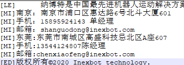

# 示教器换图

注意事项:

1. T20示教盒仅支持更换开机图片
2. 图片必须为png格式，除T20更换开机图片的格式为bmp
3. Info文本编码格式必须为UTF-8
4. 更换左侧图标:该功能仅支持22.07版本及以上版本
5. PC版不需要升级，复制到程序安装目录下的change/img文件夹下
6. T30、T20操作:若要一次性将所有内容更换，可以将以上所提到的所有文件压缩在一个.zip 压缩包内，升级该文件即可
7. 图片命名时注意英文大小写

特殊说明:图片另存为时，当保存类型为PNG格式时，图片名不可以带后缀

当打开显示文件扩展名时，图片显示

当关闭显示文件扩展名时，图片显示

若出现打开显示图片扩展名时，图片显示Logo.png.png,则表示图片名为:Logo.png，重命名将.png删除即可

## 更换 LOGO（左上角图标）

1. 准备一个 logo 图片文件，要求:145\*60 像素，png 格式，命名为
   Logo.png（注意英文大小写）；
2. 将图片文件压缩为一个.zip 格式压缩包如 logo.zip；
3. **T30、T20操作:** 将.zip 压缩包放在U盘根目录下，插在示教器上，升级该文件。

**PC版操作:** 复制到程序安装目录下的change/img文件夹下

## T20更换开机图片（通电及走进度条的两张图）

1. 准备两张图片，htq\_logo.bmp、htq\_logo\_sys.bmp，分辨率均为
   800\*600，建议使用 24 位色；
2. 将两张图片压缩为一个.zip 压缩包，如 open.zip；
3. 将.zip 压缩包放在 U 盘根目录下，插在示教器上，升级该文件；
4. 重启的同时，按住示教器左边一排从上往下数第二个按钮和 START、STOP
   这三个按钮， 带示教器上出现四行字，其中第四行为红色字"please manual
   restart your system"字样， 断电重启示教器。

## T20、T30更换程序启动图片步骤:

注:StartImage.png
为走完进度条后的一张图，SoftwareUpdatingBackground.png
为升级程序时的背景图

1. 准备两张图片，分辨率均为 800\*600，png 格式，分别命名为
   StartImage.png、
   SoftwareUpdatingBackground.png（注意英文大小写），其中后者为升级程序时的背景图片；
2. 将两个文件压缩为一个.zip 压缩包，如 background.zip；
3. **T30、T20操作:** 将.zip 压缩包放在U盘根目录下，插在示教器上，升级该文件。

（注：StartImage.png 为走完进度条后的一张图， SoftwareUpdatingBackground.png为升级程序时的背景图）

## PC更换程序启动图片

注:WindowsStartImage.png为走完进度条后的一张图，
SoftUpdatingBackgroundWindows.png为升级程序时的背景图

1. 准备两张图片，分辨率均为 800\*600，png 格式，分别命名为
   WindowsStartImage.png、
   SoftUpdatingBackgroundWindows.png（注意大小写），其中后者为升级程序时的背景图片；
2. 将两个文件压缩为一个.zip 压缩包，如 background.zip；
3. **PC版操作:** 复制到程序安装目录下的change/img文件夹下

（注：windowsStartImage.png为走完进度条后的一张图， SoftUpdatingBackgroundWindows.png为升级程序时的背景图）

## 更换文字说明

文字说明为点击示教器内的 logo
后出现的"关于"界面中的公司介绍文字，更换方法如下:

1. 准备一个 txt 文档，内容为 9
   行，每一行代表"关于"界面中的每一行文字，确保为 utf-8
   编码格式（否则乱码），命名为 Info.txt；

\[LE]:表示文字左对齐

\[MI]:表示文字居中对齐

\[ED]:表示二维码下一行的文字

2\. 将 Info.txt 压缩为一个.zip 压缩包，如 Info.zip；

1. **T30、T20操作:** 将.zip 压缩包放在U盘根目录下，插在示教器上，升级该文件。

**PC版操作:** 复制到程序安装目录下的change/img文件夹下

## 更换二维码

二维码为文字说明旁边的二维码图片，更换方法如下:

1\. 准备一个 145\*145 像素，格式为 png 的图片文件，文件名为
QR.png（注意英文大小写）；

2\. 将文件压缩成 QR.zip 文件；

1. **T30、T20操作:** 将QR.zip文件放在U盘根目录下，插在示教器上，升级该文件。

**PC版操作:** 复制到程序安装目录下的change/img文件夹下

## 更换左侧图标

**特别说明:该功能仅支持22.07版本及以上版本**

准备所需更新的图片，分辨率均为92\*53，png 格式，图片命名分别如下:

**用户按钮图片**:

|   |   |                     |                              |
| :----: | :----: | :----------------------: | :-------------------------------: |
|   管理员  |   语言   |        未按下用户按钮图片命名       |             按下用户按钮图片命名            |
|   管理员  |   中文   |    ManagerPageIcon.png   |    ManagerPageIconOnPressed.png   |
|   管理员  |   英文   |   enManagerPageIcon.png  |   enManagerPageIconOnPressed.png  |
|   管理员  |   韩文   |   krManagerPageIcon.png  |   krManagerPageIconOnPressed.png  |
|   技术员  |   语言   |        未按下用户按钮图片命名       |             按下用户按钮图片命名            |
|   技术员  |   中文   |  TechnologyPageIcon.png  |  TechnologyPageIconOnPressed.png  |
|   技术员  |   英文   | enTechnologyPageIcon.png | enTechnologyPageIconOnPressed.png |
|   技术员  |   韩文   | krTechnologyPageIcon.png | krTechnologyPageIconOnPressed.png |
|   操作员  |   语言   |        未按下用户按钮图片命名       |             按下用户按钮图片命名            |
|   操作员  |   中文   |   OperatorPageIcon.png   |   OperatorPageIconOnPressed.png   |
|   操作员  |   英文   |  enOperatorPageIcon.png  |  enOperatorPageIconOnPressed.png  |
|   操作员  |   韩文   |  krOperatorPageIcon.png  |  krOperatorPageIconOnPressed.png  |
|  自定义用户 |  不区分语言 |    CustomPageIcon.png    |    CustomPageIconOnPressed.png    |

**设置按钮图片**

|   |   |                  |                           |
| :----: | :----: | :-------------------: | :----------------------------: |
|   设置   |   语言   |      未按下设置按钮图片命名      |           按下设置按钮图片命名           |
|   设置   |   中文   |  SettingPageIcon.png  |  SettingPageIconOnPressed.png  |
|   设置   |   英文   | enSettingPageIcon.png | enSettingPageIconOnPressed.png |
|   设置   |   韩文   | krSettingPageIcon.png | krSettingPageIconOnPressed.png |

**工艺按钮图片名称:**

|   |   |                     |                              |
| :----: | :----: | :----------------------: | :-------------------------------: |
|   工艺   |   语言   |        未按下工艺按钮图片命名       |             按下工艺按钮图片命名            |
|   工艺   |   中文   |  TechnologyPageIcon.png  |  TechnologyPageIconOnPressed.png  |
|   工艺   |   英文   | enTechnologyPageIcon.png | enTechnologyPageIconOnPressed.png |
|   工艺   |   韩文   | krTechnologyPageIcon.png | krTechnologyPageIconOnPressed.png |

**变量按钮图片名称:**

|   |   |                   |                            |
| :----: | :----: | :--------------------: | :-----------------------------: |
|   变量   |   语言   |       未按下变量按钮图片命名      |            按下变量按钮图片命名           |
|   变量   |   中文   |  VariablePageIcon.png  |       VariablePageIcon.png      |
|   变量   |   英文   | enVariablePageIcon.png | enVariablePageIconOnPressed.png |
|   变量   |   韩文   | krVariablePageIcon.png | krVariablePageIconOnPressed.png |

**状态按钮图片名称:**

|   |   |                |                         |
| :----: | :----: | :-----------------: | :--------------------------: |
|   状态   |   语言   |     未按下状态按钮图片命名     |          按下状态按钮图片命名          |
|   状态   |   中文   |  StatePageIcon.png  |  StatePageIconOnPressed.png  |
|   状态   |   英文   | enStatePageIcon.png | enStatePageIconOnPressed.png |
|   状态   |   韩文   | krStatePageIcon.png | krStatePageIconOnPressed.png |

**工程按钮图片名称:**

|   |   |                  |                           |
| :----: | :----: | :-------------------: | :----------------------------: |
|   工程   |   语言   |      未按下工程按钮图片命名      |           按下工程按钮图片命名           |
|   工程   |   中文   |  ProListPageIcon.png  |  ProListPageIconOnPressed.png  |
|   工程   |   英文   | enProListPageIcon.png | enProListPageIconOnPressed.png |
|   工程   |   韩文   | krProListPageIcon.png | krProListPageIconOnPressed.png |

**程序按钮图片名称:**

|   |   |                  |                           |
| :----: | :----: | :-------------------: | :----------------------------: |
|   程序   |   语言   |      未按下程序按钮图片命名      |           按下程序按钮图片命名           |
|   程序   |   中文   |  ProgramPageIcon.png  |  ProgramPageIconOnPressed.png  |
|   程序   |   英文   | enProgramPageIcon.png | enProgramPageIconOnPressed.png |
|   程序   |   韩文   | krProgramPageIcon.png | krProgramPageIconOnPressed.png |

**日志按钮图片名称:**

|   |   |                 |                          |
| :----: | :----: | :------------------: | :---------------------------: |
|   日志   |   语言   |      未按下日志按钮图片命名     |           按下日志按钮图片命名          |
|   日志   |   中文   |  RecordPageIcon.png  |  RecordPageIconOnPressed.png  |
|   日志   |   英文   | enRecordPageIcon.png | enRecordPageIconOnPressed.png |
|   日志   |   韩文   | krRecordPageIcon.png | krRecordPageIconOnPressed.png |

**监控按钮图片名称:**

|   |   |               |                        |
| :----: | :----: | :----------------: | :-------------------------: |
|   监控   |   语言   |     未按下监控按钮图片命名    |          按下监控按钮图片命名         |
|   监控   |   中文   |  RealPageIcon.png  |  RealPageIconOnPressed.png  |
|   监控   |   英文   | enRealPageIcon.png | enRealPageIconOnPressed.png |
|   监控   |   韩文   | krRealPageIcon.png | krRealPageIconOnPressed.png |

更换内容区图标、按钮及示例图片

准备所需更新的图片，png 格式，命名为\*\*\*.png，每个图标的命名都是不一样的，例如干涉区为interfereRange.png（注意英文大小写），部分命名含英、韩语，在开头或结尾添加了en/kr

|    图标名称   |                                             命名                                             |    分辨率   |
| :-------: | :----------------------------------------------------------------------------------------: | :------: |
|   工具手标定   |                                     ToolHandCalibra.png                                    | 128\*128 |
|   用户坐标标定  |                                     UserCoordinates.png                                    | 128\*128 |
|    系统设置   |                                       SysSetting.png                                       | 128\*128 |
|   远程程序设置  |    SelfStartProgramSetting.pngenSelfStartProgramSetting.pngkrSelfStartProgramSetting.png   | 200\*200 |
|   复位点设置   |                                    ResetPointSetting.png                                   | 128\*128 |
|     Io    |                                   PeripheralFunctions.png                                  | 128\*128 |
|   机器人参数   |                                       RobotParam.png                                       | 128\*128 |
|   外部轴参数   |                                    ExternalAxisParam.png                                   | 128\*128 |
|    人机协作   |                                 BtnMechanicalParameters.png                                | 128\*128 |
|  Modbus设置 |                                  ModbusProgramSetting.png                                  | 128\*128 |
|    后台任务   |                                     Backgroundtasks.png                                    | 128\*128 |
|  TCP通讯设置  |                                        BtnNetSet.png                                       | 128\*128 |
|    数据上传   |                                        DAupload.png                                        | 128\*128 |
|   程序自启动   |                                    ProgramSelfStart.png                                    | 256\*256 |
|    操作参数   |                                       OperatePara.png                                      | 128\*128 |
|    版本升级   |                                     VersionUpgrade.png                                     | 128\*128 |
|    时间设置   |                                       timesetting.png                                      | 128\*128 |
|    Ip设置   |                                     networksetting.png                                     | 128\*128 |
|    导出程序   |                   Exportjobfile.pngenExportjobfile.pngkrExportjobfile.png                  | 200\*200 |
|    导入程序   |                   importjobfile.pngenimportjobfile.pngkrimportjobfile.png                  | 200\*200 |
|   一键备份系统  |                                    Exportnativefile.png                                    | 200\*200 |
|  修改示教器配置  |                                    Modifynativefile.png                                    | 128\*128 |
|  导出控制器配置  |                                  BtnExportControlPara.png                                  | 128\*128 |
|  导入控制器配置  |                                  BtnImportControlPara.png                                  | 128\*128 |
|    导出日志   | BtnExportControlLog.pngBtnExportTBoxLog.pngenBtnExportControlLog.pngenBtnExportTBoxLog.png | 128\*128 |
|   数据库升级   |                                     DatabaseUpgrade.png                                    | 128\*128 |
|    自动备份   |                                         Backup.png                                         | 128\*128 |
|    更多设置   |                                         moreSet.png                                        | 128\*128 |
|    Io配置   |                                        IOSetting.png                                       | 200\*200 |
|    端口名称   |                                        IOrename.png                                        | 128\*128 |
|    Io复位   |                                       IOResetting.png                                      | 128\*128 |
|    使能io   |                                   BtnEnableIOSetting.png                                   | 128\*128 |
|    报警消息   |                                         IOAlarm.png                                        | 128\*128 |
|   状态提示设置  |                                  StatusPromptSettings.png                                  | 128\*128 |
|    安全设置   |                                       IoSavetySet.png                                      | 128\*128 |
|   干涉区范围   |                                     interfereRange.png                                     | 128\*128 |
|    零点位置   |                                       ZeroPosion.png                                       | 128\*128 |
|    DH参数   |                                         DHParam.png                                        | 128\*128 |
|    关节参数   |                                       JointParam.png                                       | 128\*128 |
|   笛卡尔参数   |                                       DecareParam.png                                      | 128\*128 |
|    点动速度   |                                        InchSpeed.png                                       | 128\*128 |
|    运动参数   |                                InterpolationModeSetting.png                                | 128\*128 |
|    从站配置   |                                      RobotSetting.png                                      | 200\*200 |
|    伺服参数   |                                     Servoparameter.png                                     | 128\*128 |
|    跟随误差   |                                      BtnFolloError.png                                     | 128\*128 |
|   协作机器人   |                                      CooperSetting.png                                     | 128\*128 |
|   电机过载保护  |                                     overlordProtect.png                                    | 128\*128 |
|   动力学参数   |                                  BtnKineticParameters.png                                  | 128\*128 |
|    力学功能   |                                  BtnCollisionDetection.png                                 | 128\*128 |
|    拖拽示教   |                                      BtnDragTeach.png                                      | 128\*128 |
|  自适应加减速度  |                                    auto\_modify\_vel.png                                   | 128\*128 |
|    负载使能   |                                      payloadbutton.png                                     | 128\*128 |
|  Modbus参数 |                                      modbusSetting.png                                     | 128\*128 |
|  Modbus程序 |                                      modbusProgram.png                                     | 128\*128 |
| Finstcp参数 |                                       finsSetting.png                                      | 245\*192 |
|   激光切割工艺  |                                      LaserSetting.png                                      | 128\*128 |
|    喷涂工艺   |                                          Spray.png                                         | 128\*128 |
|    打磨工艺   |                                        BtnPolish.png                                       | 128\*128 |
|    寻位跟踪   |                                       BtnArcTrack.png                                      | 128\*128 |
|    焊接工艺   |                                       WeldSetting.png                                      | 534\*534 |
|    码垛工艺   |                                         pallet.png                                         | 128\*128 |
|    视觉工艺   |                                      VisualSetting.png                                     | 128\*128 |
|   传送带工艺   |                                      TrackConveyor.png                                     | 128\*128 |
|    专用工艺   |                                       BtnBWBTech.png                                       | 128\*128 |
|    全局参数   |                                      BtnLaserBore.png                                      | 128\*128 |
|    切割参数   |                                       BtnLaserCut.png                                      | 128\*128 |
|   模拟量匹配   |                                         Analog.png                                         | 128\*128 |
|    Io设置   |                                        LaserSet.png                                        | 200\*200 |
|    手动操作   |                                     hand\_operation.png                                    | 200\*200 |
|   数字量设置   |                                     SprayDigitalIO.png                                     | 128\*128 |
|   模拟量设置   |                                       SprayAnalog.png                                      | 128\*128 |
|     时序    |                                      SpraySequence.png                                     | 128\*128 |
|    轨迹参数   |                                       SprayTrack.png                                       | 128\*128 |
|    手动操作   |                                     SprayHandOperat.png                                    | 128\*128 |
|    打磨参数   |                                      BtnPolishPara.png                                     | 128\*128 |
|     跟踪    |                                     BtnTrackSetting.png                                    | 128\*128 |
|     寻位    |                                       BthArcTrack.png                                      | 128\*128 |
|   激光器设置   |                                      BtnArcSearch.png                                      | 128\*128 |
|    焊机设置   |                                       WeldMachine.png                                      | 534\*535 |
|    焊接io   |                                      WeldIOSetting.png                                     | 534\*534 |
|   电流电压匹配  |                                 CurrentVoltageMatching.png                                 | 534\*534 |
|    焊接参数   |                                    WeldParamPosition.png                                   | 534\*534 |
|    焊接装备   |                                 WeldingEquipmentSetting.png                                | 534\*534 |
|    摆焊参数   |                                     Weldparameters.png                                     | 535\*534 |
|    相贯线    |                                  WeldIntersectingline.png                                  | 534\*534 |
|    手动操作   |                                     ManualOperation.png                                    | 534\*534 |
|    码垛参数   |                                       Palleteasy.png                                       | 128\*128 |
|    生成文件   |                                    Palletcreatefile.png                                    | 128\*128 |
|    位置调试   |                                     Palletmultiple.png                                     | 128\*128 |
|   视觉参数设置  |                                   VisualParamSetting.png                                   | 128\*128 |
|   视觉范围设置  |                                   VisualRangeSetting.png                                   | 128\*128 |
|   视觉位置参数  |                                       vision\_pos.png                                      | 128\*128 |
|    位置调试   |                                       pos\_debug.png                                       | 128\*128 |
|    视觉标定   |                                      visualCarbin.png                                      | 101\*100 |
|    参数设置   |                                     BtnTrackConPara.png                                    | 128\*128 |
|    全局位置   |                                     GlobalPosition.png                                     | 128\*128 |
|    全局数值   |                                         SysLog.png                                         | 128\*128 |
|    输入输出   |                                         IOState.png                                        | 128\*128 |
|   Io功能状态  |                                      btnAllIOState.png                                     | 128\*128 |
|    系统状态   |                                       systemState.png                                      | 128\*128 |
|    激光状态   |                                      laser\_state.png                                      | 128\*128 |
|    NP参数   |                                          NPara.png                                         | 128\*128 |
|    零点位置   |                                ExternalAxisZeroPosition.png                                | 128\*128 |
|   外部轴标定   |                                 ExternalAxisCalibtation.png                                | 128\*128 |
|    关节参数   |                               btnOutterJointParamSetting.png                               | 128\*128 |
|    点动速度   |                                        InchSpeed.png                                       | 128\*128 |

|             图片名             |                                                                                                                                        命名                                                                                                                                        |                分辨率               |
| :-------------------------: | :------------------------------------------------------------------------------------------------------------------------------------------------------------------------------------------------------------------------------------------------------------------------------: | :------------------------------: |
|             用户标定            |                                                                                                                                    UserCO.png                                                                                                                                    |             240\*210             |
|           坡度调节 脉冲           |                                                                                                               pulseadjuest.pngkrpulseadjuest.pngenpulseadjuest.png                                                                                                               |             535\*246             |
|           坡度调节 功率           |                                                                                                        laserpoweradjuest.pngkrlaserpoweradjuest.pngenlaserpoweradjuest.png                                                                                                       |             566\*257             |
|            激光功率匹配           |                                                                                                                                    IUMatch.png                                                                                                                                   |             512\*512             |
|             气压匹配            |                                                                                                                                   iuPicture.png                                                                                                                                  |             210\*210             |
|             开枪时序            |                                                                                                                        GunSequence.pngenChangeSequence.png                                                                                                                       |             870\*778             |
|             换料时序            |                                                                                                                      ChangeSequence.pngkrChangeSequence.png                                                                                                                      |             818\*820             |
|           轨迹参数 平面1          |                                                                                                                                     Flat1.png                                                                                                                                    |            1000\*1000            |
|             平面2             |                                                                                                                                     Flat2.png                                                                                                                                    |            1000\*1000            |
|             平面3             |                                                                                                                                     Flat3.png                                                                                                                                    |            1000\*1000            |
|             平面4             |                                                                                                                                     Flat4.png                                                                                                                                    |            1000\*1000            |
|             立体1             |                                                                                                                                    Space1.png                                                                                                                                    |            1000\*1000            |
|             立体2             |                                                                                                                                    Space2.png                                                                                                                                    |            1000\*1000            |
|             自定义2            |                                                                                                                   sprayTwoStagePlan.pngensprayTwoStagePlan.png                                                                                                                   |             589\*201             |
|             自定义3            |                                                                                                                 sprayThreeStagePlan.pngensprayThreeStagePlan.png                                                                                                                 |             590\*202             |
|          点位设定 直线第一段         |                                                                                                                      sprayFirstLine.pngensprayFirstLine.png                                                                                                                      |              229\*48             |
|          点位设定 直线第二段         |                                                                                                                     spraySecondLine.pngenspraySecondLine.png                                                                                                                     |              202\*41             |
|            直线第三段            |                                                                                                                                sprayThirdLine.png                                                                                                                                |              213\*42             |
|            圆弧第一段            |                                                                                                                       sprayFirstArc.pngensprayFirstArc.png                                                                                                                       |              212\*52             |
|            圆弧第二段            |                                                                                                                      spraySecondArc.pngenspraySecondArc.png                                                                                                                      |              194\*65             |
|            圆弧第三段            |                                                                                                                                 sprayThirdArc.png                                                                                                                                |              189\*60             |
|              终点             |                                                                                                                                sprayEndensprayEnd                                                                                                                                |              44\*44              |
|           激光器标定第1点          |                                                                                                                                  laserPoint1.png                                                                                                                                 |             516\*442             |
|           激光器标定第2点          |                                                                                                                                  laserPoint2.png                                                                                                                                 |             515\*443             |
|           激光器标定第3点          |                                                                                                                                  laserPoint3.png                                                                                                                                 |             516\*440             |
|           激光器标定第4点          |                                                                                                                                  laserPoint4.png                                                                                                                                 |             516\*443             |
|           激光器标定第5点          |                                                                                                                                  laserPoint5.png                                                                                                                                 |             515\*439             |
|           激光器标定第6点          |                                                                                                                                  laserPoint6.png                                                                                                                                 |             515\*442             |
|           激光器标定第7点          |                                                                                                                                  laserPoint7.png                                                                                                                                 |             513\*439             |
|            电流控制匹配           |                                                                                                                  weldCurrentDiagram.pngenweldCurrentDiagram.png                                                                                                                  |            1417\*1042            |
|            电压控制匹配           |                                                                                                                  weldVoltageDiagram.pngenweldVoltageDiagram.png                                                                                                                  |            1417\*1042            |
|            相贯线设置            |                                                                                                                   intersection.pngenintersectionPointPlace.png                                                                                                                   |             435\*286             |
|            相贯线标定            |                                                                                                intersectionPointPlace.pngkrintersectionPointPlace.pngenintersectionPointPlace.png                                                                                                |             582\*301             |
|           变位机设置图示           |                                                                                                                                  WeldGunSet.png                                                                                                                                  |             330\*282             |
|          焊接装备设置 再起弧         |                                                                                                                                weldequipdetail.png                                                                                                                               |             1968\*852            |
|             托盘设置            |                                                                                                                       Settray.pngenSettray.pngkrSettray.png                                                                                                                      |             250\*200             |
|             工件参数            |                                                                                                              Workpiecepara.pngenWorkpiecepara.pngkrWorkpiecepara.png                                                                                                             |             415\*313             |
|             工件参数            |                                                                                                     Workpiecepara-space.pngenWorkpiecepara-space.pngkrWorkpiecepara-space.png                                                                                                    |             538\*401             |
|        码垛 重叠模式-说明 交替        |                                                                                                                    ExplainAlternate.pngenExplainAlternate.png                                                                                                                    |             241\*241             |
|             自定义             |                                                                                                                       ExplainCustom.pngenExplainCustom.png                                                                                                                       |             240\*241             |
|              相同             |                                                                                                                    ExplainIdentical.pngenExplainIdentical.png                                                                                                                    |             240\*240             |
|           放货点高度补偿           |                                                                                                       ExplainAltimetricCompensation.pngenExplainAltimetricCompensation.png                                                                                                       |             720\*627             |
|        固定放货点高度、竖直方向排布       |                                                                                                            ExplainVerticalDirection.pngenExplainVerticalDirection.png                                                                                                            |             914\*548             |
|            层自动对齐            |                                                                                                           ExplainAutomaticAlignment.pngenExplainAutomaticAlignment.png                                                                                                           |             1671\*817            |
|            自动旋转姿态           |                                                                                                                 ExplainAutorotation.pngenExplainAutorotation.png                                                                                                                 |             1599\*573            |
|              重复             |                                                                                                                       Explainrepeat.pngenExplainrepeat.png                                                                                                                       |             756\*301             |
|       固定辅助点高度、固定入口点位置       |                                                                                                                      Setgetposition.pngenSetgetposition.png                                                                                                                      |             409\*603             |
|             位置设置            |                                                                                                                         Setposition.pngenSetposition.png                                                                                                                         |             409\*603             |
|             下降接近            |                                                                                                                          DropcloseenDropclosekrDropclose                                                                                                                         |             309\*392             |
|             接近下降            |                                                                                                                          ClosedropenClosedropkrClosedrop                                                                                                                         |             309\*392             |
|             接近说明            |                                                                                                                       ApproachdirectionenApproachdirection                                                                                                                       |             543\*527             |
| 平面模式 行列 整体旋转角度0°90°180°-90° |                                                                     RanksModel0.pngRanksModel0.pngRanksModel90.pngenRanksModel90.pngRanksModel180.pngenRanksModel180.pngRanksModel-90.pngenRanksModel-90.png                                                                     | 824\*757826\*758826\*758826\*758 |
|   纵横交错 整体旋转角度0°90°180°-90°  |                                                                    crisscross0.pngencrisscross0.pngCrisscross90.pngencrisscross90.pngCrisscross180.pngencrisscross180.pngCrisscross-90.pngencrisscross-90.png                                                                    | 826\*758826\*758826\*758826\*758 |
|   回字型 整体旋转角度0°90°180°-90°   |                                                                                HuiType0.pngenHuiType0.pngHuiType90.pngenHuiType90.pngHuiType180.pngenHuiType180.pngHuiType-90.pngenHuiType-90.png                                                                                | 826\*758826\*758826\*758826\*758 |
|   五花垛 整体旋转角度0°90°180°-90°   | FiveFlowerStack0.pngenFiveFlowerStack0.pngkrFiveFlowerStack0.pngFiveFlowerStack90.pngenFiveFlowerStack90.png krFiveFlowerStack90.pngFiveFlowerStack-90.pngenFiveFlowerStack-90.pngkrFiveFlowerStack-90.pngFiveFlowerStack180.pngenFiveFlowerStack180.pngkrFiveFlowerStack180.png | 826\*758826\*758826\*758826\*758 |
|             生成文件            |                                                                                                                      Setputposition.pngenSetputposition.png                                                                                                                      |             409\*603             |
|            传送带标定            |                                                                                                                    Conveyor1.pngenConveyor1.pngkrConveyor1.png                                                                                                                   |             700\*500             |
|            传感器标定            |                                                                                                                    Conveyor2.pngenConveyor2.pngkrConveyor2.png                                                                                                                   |             700\*500             |
|            跟踪范围设置           |                                                                                                                          Track.pngTrackEnlishVersion.png                                                                                                                         |             685\*685             |
|           五轴串联多关节           |                                                                                                                      fiveAxisRobotCN.png fiveAxisRobotEN.png                                                                                                                     |             360\*360             |
|           四轴并联机器人           |                                                                                                                            delta\_CN.pngdelta\_EN.png                                                                                                                            |             449\*336             |
|             四轴直角            |                                                                                                                     forurAxisAngleCN.pngforurAxisAngleEN.png                                                                                                                     |             430\*360             |
|          四轴SCARA异型1         |                                                                                                             fourAxisAbnormityRobotCN.pngfourAxisAbnormityRobotEN.png                                                                                                             |             360\*360             |
|            四轴码垛丝杆           |                                                                                                               fourAxisPallet1RobotCN.pngfourAxisPallet1RobotEN.png                                                                                                               |             400\*360             |
|           四轴极坐标异型           |                                                                                                             fourAxisPolarAbnormityCN.pngfourAxisPolarAbnormityEN.png                                                                                                             |             382\*304             |
|           四轴串联多关节           |                                                                                                                      fourAxisRobotCN.png fourAxisRobotEN.png                                                                                                                     |             360\*360             |
|           四轴SCARA           |                                                                                                                 fourAxisScaraRobotCN.pngfourAxisScaraRobotEN.png                                                                                                                 |             360\*360             |
|            四轴连杆码垛           |                                                                                                                 fourAxisStackRobotCN.pngfourAxisStackRobotEN.png                                                                                                                 |             360\*360             |
|            龙门焊接模型           |                                                                                                              gantry\_weld\_robot\_CN.pnggantry\_weld\_robot\_EN.png                                                                                                              |             430\*360             |
|            三轴直角异型           |                                                                                                            threeAxisAbnormityRobotCN.pngthreeAxisAbnormityRobotEN.png                                                                                                            |             360\*360             |
|             三轴直角            |                                                                                                                threeAxisAngleRobotCN.pngthreeAxisAngleRobotEN.png                                                                                                                |             450\*360             |
|           三轴SCARA           |                                                                                                                             threeAxisScaraRobotCN.png                                                                                                                            |             360\*360             |
|           二轴SCARA           |                                                                                                                  twoAxisScaraRobotCN.pngtwoAxisScaraRobotEN.png                                                                                                                  |             360\*360             |
|              单轴             |                                                                                                                       oneAxisRobotCN.pngoneAxisRobotEN.png                                                                                                                       |             360\*360             |
|             酒槽机型            |                                                                                                                               wine\_chamfer\_CN.png                                                                                                                              |             360\*360             |
|           外部轴标定图示           |                                                                                                                                SyncGroundRail.png                                                                                                                                |             470\*446             |
|           门型指令轨迹图示          |                                                                                                                                   movearch.png                                                                                                                                   |             360\*360             |
|           切割圆指令示例图          |                                                                                                                                 laser\_circle.png                                                                                                                                |             800\*600             |

简便方法

**T30、T20操作:** 若要一次性将所有内容更换，可以将以上所提到的所有文件压缩在一个.zip压缩包内，升级该文件即可。

**PC版操作:** 复制到程序安装目录下的change/img文件夹下

**注意事项:** 直接压缩请勿单独拉出文件压缩

## AI 检索专用问答对 (Q\&A for Retrieval)

**Q: 示教器换图有哪些注意事项？**

A: 示教器换图注意事项包括:T20示教盒仅支持更换开机图片；图片必须为png格式，除T20更换开机图片的格式为bmp；Info文本编码格式必须为UTF-8；更换左侧图标功能仅支持22.07版本及以上版本；PC版不需要升级，复制到程序安装目录下的change/img文件夹下；图片命名时注意英文大小写；图片另存为时，当保存类型为PNG格式时，图片名不可以带后缀。

**Q: T20示教盒支持更换哪些图片？**

A: T20示教盒仅支持更换开机图片（通电及走进度条的两张图）。

**Q: 示教器换图的图片格式有什么要求？**

A: 图片必须为png格式，除T20更换开机图片的格式为bmp。

**Q: Info文本编码格式有什么要求？**

A: Info文本编码格式必须为UTF-8，否则会出现乱码。

**Q: 更换左侧图标功能支持哪些版本？**

A: 更换左侧图标功能仅支持22.07版本及以上版本。

**Q: PC版如何更换图片？**

A: PC版不需要升级，将图片文件复制到程序安装目录下的change/img文件夹下即可。

**Q: T30、T20如何一次性更换所有内容？**

A: 将所有需要更换的文件压缩在一个.zip压缩包内，升级该文件即可一次性更换所有内容。

**Q: 如何更换LOGO（左上角图标）？**

A: 准备一个145\*60像素、png格式、命名为Logo.png的图片文件，压缩为.zip格式压缩包，T30、T20将压缩包放在U盘根目录下插在示教器上升级，PC版复制到change/img文件夹下。

**Q: T20如何更换开机图片？**

A: 准备两张800\*600分辨率、24位色的bmp格式图片（htq\_logo.bmp、htq\_logo\_sys.bmp），压缩为.zip压缩包放在U盘根目录下升级；重启时按住示教器左边一排从上往下数第二个按钮和START、STOP三个按钮，出现四行字后断电重启。

**Q: 如何更换程序启动图片？**

A: 准备两张800\*600分辨率、png格式的图片（StartImage.png、SoftwareUpdatingBackground.png），压缩为.zip压缩包，T30、T20放在U盘根目录下升级，PC版复制到change/img文件夹下。

**Q: 如何更换文字说明？**

A: 准备一个9行内容的txt文档（每行代表"关于"界面中的一行文字），确保为utf-8编码格式，命名为Info.txt，压缩为.zip压缩包，T30、T20放在U盘根目录下升级，PC版复制到change/img文件夹下。

**Q: 如何更换二维码？**

A: 准备一个145\*145像素、png格式、文件名为QR.png的图片文件，压缩成QR.zip文件，T30、T20放在U盘根目录下升级，PC版复制到change/img文件夹下。

**Q: 更换左侧图标需要准备什么图片？**

A: 更换左侧图标需要准备分辨率为92\*53、png格式的图片，包括用户按钮图片、设置按钮图片、工艺按钮图片、变量按钮图片、状态按钮图片、工程按钮图片、程序按钮图片、日志按钮图片、监控按钮图片等。

**Q: 用户按钮图片的命名规则是什么？**

A: 用户按钮图片根据用户类型（管理员、技术员、操作员、自定义用户）和语言（中文、英文、韩文）命名，未按下状态和按下状态分别命名，例如管理员中文为ManagerPageIcon.png和ManagerPageIconOnPressed.png。

**Q: 设置按钮图片的命名规则是什么？**

A: 设置按钮图片根据语言（中文、英文、韩文）命名，未按下状态和按下状态分别命名，例如中文为SettingPageIcon.png和SettingPageIconOnPressed.png。

**Q: 内容区图标图片的分辨率有什么要求？**

A: 内容区图标图片分辨率一般为128*128，部分特殊图标分辨率不同，如远程程序设置为200*200，程序自启动为256*256，焊接工艺相关图标为534*534等。

## 版本历史

| 版本    | 日期        | 变更内容 | 作者       |
| :---- | :-------- | :--- | :------- |
| 1.0.0 | 2026-07-1 | 初始版本 | qiuzegai |

