# 系统功能调试手册

## 系统设置

## 版本升级

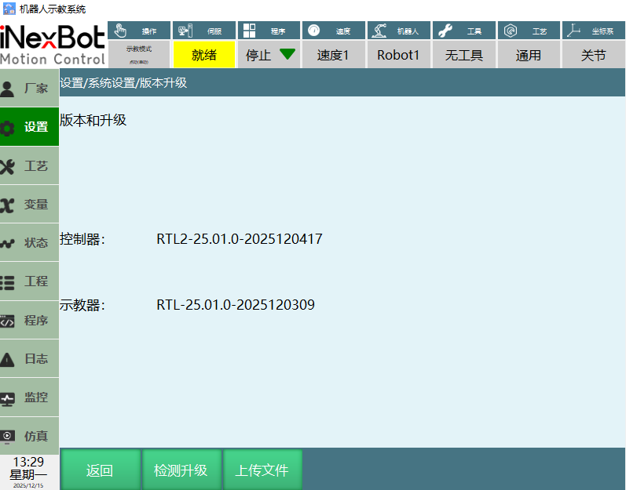

### T30升级

控制器和示教器行分别是当前所使用的程序版本。

检测升级：在示教器的USB口插入U盘，在U盘根目录下放入需要升级的程序压缩包，点击"检测升级"，如下图所示会出现提示是否备份系统的弹窗，点击"取消"会进入升级程序包页面。

如下图所示选中程序点击升级文件界面的【确定】，点击确定后会有一个二次确认界面，再次点击【确定】后开始升级程序。

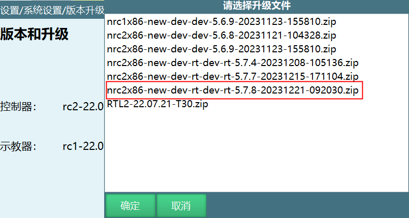

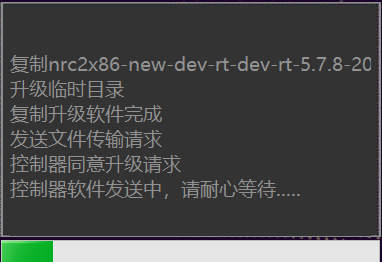

通过检测升级可以升级的文件有控制器程序，示教器程序，语言包等。

系统备份：在示教器的USB口插入U盘，在U盘根目录下放入需要升级的程序压缩包，点击"检测升级"，如下图所示会出现提示弹窗，点击"确定"会备份系统到U盘。

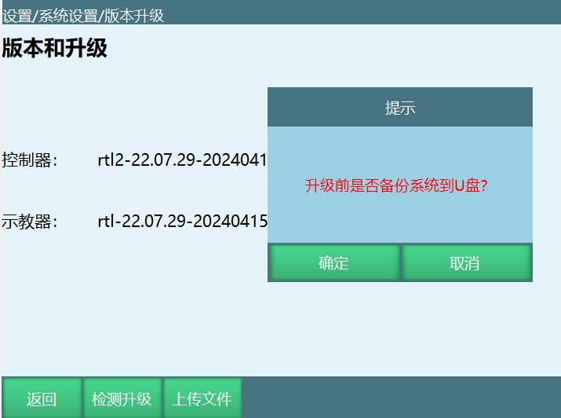

### PC版升级

1.  示教器程序升级：对应版本的PC版程序放在PC文件夹的根路径。

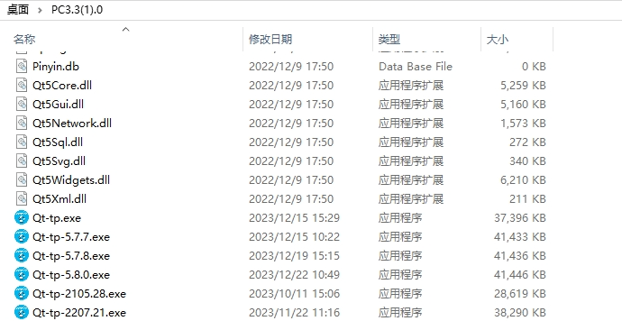

2.  控制器程序升级：PC文件夹下新建udisk文件夹，然后将控制器程序放在udisk文件夹内。

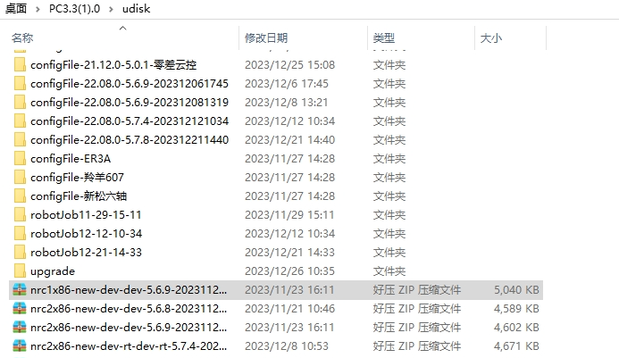

3.  上传文件：udisk文件夹下新建upgrade文件夹，上传文件路径PC-udisk-upgrade。

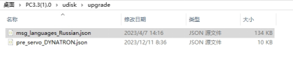

## IP设置 

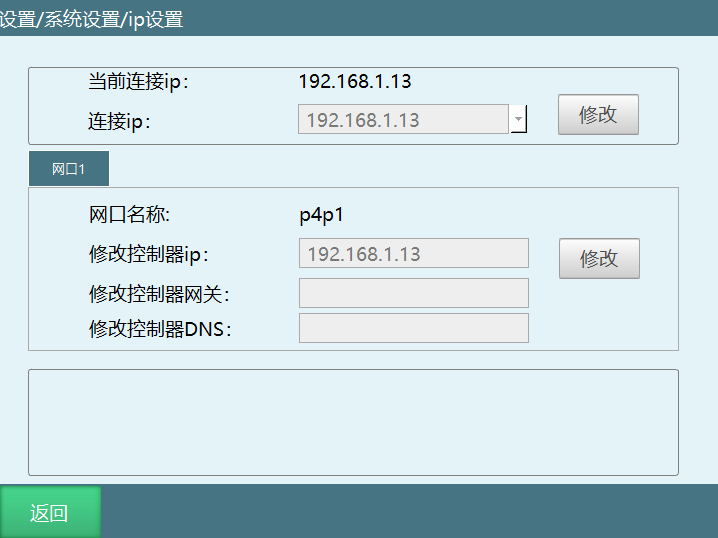 

修改IP的具体步骤如下：

1.  修改IP前记录好新的IP地址。
2.  点击"修改控制器IP"、"连接IP"、"修改示教器IP"对应的【修改】按钮。
3.  输入框里输入新的IP地址，点击【保存】，示教器IP点击保存后重启系统生效，连接IP和控制器IP点击【保存】立即生效。

注意：

- 在非必要情况下请不要修改IP，以免造成使用故障。

- 若修改控制器IP为非默认值（192.168.1.13），请自行记录好该控制器的IP。

### 扫描IP功能

功能：控制器可以扫描扫描到同一局域网内（即：连接在同一个交换机/集线器/路由器上），且同一网段的控制器IP。

注意：该功能在第一次扫描时有延迟。

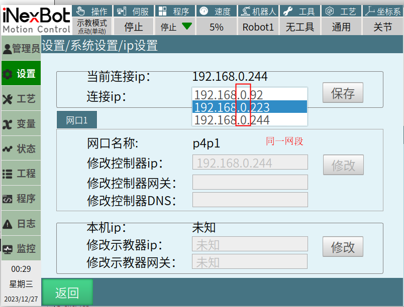

1.  IP设置界面扫描IP功能。

点击连接IP行的【修改】按键，再点击出现的下拉框等待3-4秒，即可扫描到同一网段同一局域网内的其他控制器的IP，等待搜索完成，以IP最后一位大小进行排序显示，选中搜索出来的IP，则更新到文本框中，文本框原有输入功能不变，可以输入IP地址进行连接，其余机制保持不变。如下图：

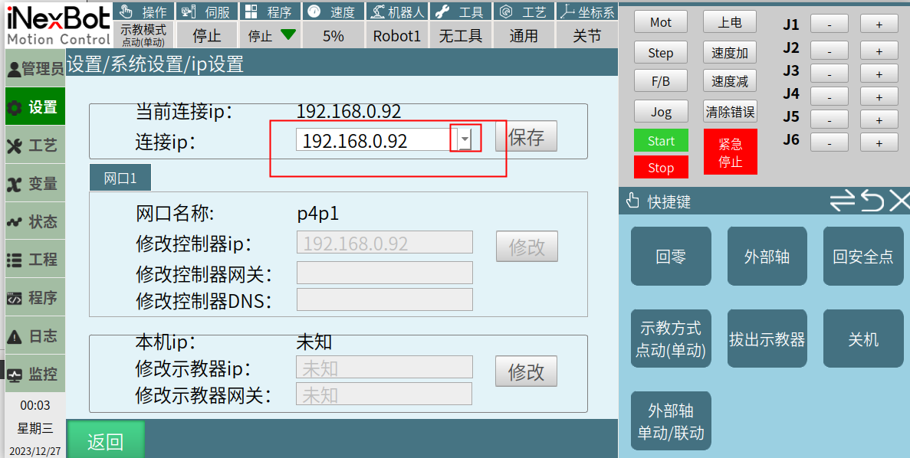

1.  监控-快捷键界面拔出示教器后插入示教器，扫描IP功能。

- 文本框原有输入功能不变，可以输入IP地址进行连接。

- 可以点击下拉框弹窗下拉界面，会搜索示教盒网段下6002端口地址，等待搜索完成，以IP最后三位数字大小进行排序显示，选中搜索出来的IP，则更新到文本框中，点击确认之后开始连接。

具体界面如下图所示：

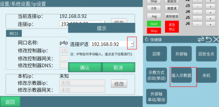

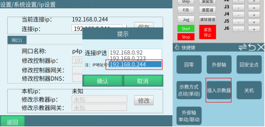

## **一键备份系统：**

将U盘插入示教器USB口，点击设置-系统设置-一键备份系统，根据备份时当前运行的系统程序定义SystemBackup的文件名前缀为T30-1还是T30-2。nrc对应T30-1-SystemBackup，nrc2对应T30-2-SystemBackup。

1.  备份文件命名格式：T30-1-SystemBackup/T30-2-SystemBackup+具体日期。

如下图所示：

1.  备份路径：U盘根目录。

2.  备份的文件：

- 示教器备份文件：config.db
  、Pinyin.db、ServoError.db、TColor.db、Userdata.db、T30_ARM_Linux_Teach-pendant（示教器程序）。

- 控制器备份文件：控制器配置文件config、工艺文件craft、轨迹文件dragPos、eni文件、作业文件job、lua文件、多语言文件msg_languages、预置参数preset、变量variant、控制器程序C1102_X86_Linux-RT_Robot-controller。

程序备份说明：

2403及以上版本针对不同平台，控制器&示教器启动程序名称也做了修改，因此不同平台备份的程序名称也不同，详见下方表格。

| 平台       | 原程序              | 现程序                                  |
| :--------- | :------------------ | :-------------------------------------- |
| C1102      | Actions：nrc.out    | C1102_X86_Linux-RT1_Robot-controller    |
|            | Igh:nrc2.out        | C1102_X86_Linux-RT_Robot-controller     |
| C1200      | nrc2.out            | C1200_X64_Linux-RT_Robot-controller     |
| C1201      | nrc2.out            | C1201_X64_Linux-RT_Robot-controller     |
| C2200      | nrc.out             | C2200_ARM_Linux-RT_Robot-controller     |
| T01        | nrc.out             | T01_ARM_Linux-Xenomai_Robot-controller  |
| C2200-A01  | nrc.out             | C2200-A01_ARM_Linux-RT_Robot-controller |
| T30        | Qt-tp               | T30_ARM_Linux_Teach-pendant             |

上传文件：点击此按钮可以上传的文件有控制器语言文件（例如：俄语msg_languages_Russian.json）、控制器解密文件（offlinelicense.txt）、初始化文件（offlineInitialization.txt）、伺服参数识别（pre_servo_DYNATRON.json）。

返回：点击【返回】退出版本升级界面。

## 导出日志

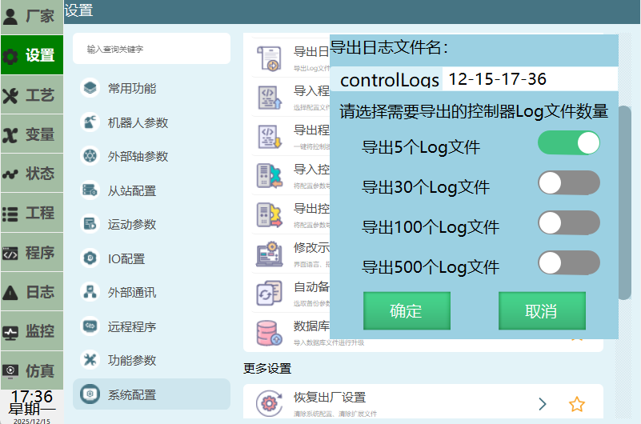

具体步骤如下：

1.  将U盘插入示教器的USB接口。
2.  点击【设置】-【系统设置】-【导出日志】。
3.  选择导出的Log文件数量，点击【确定】开始导出日志。
4.  导出的日志格式：controlLog-默认是示教器的日期，也支持重命名，如下所示。

1.  导出的日志包含的文件有控制器配置文件、控制日志、崩溃日志和作业文件。

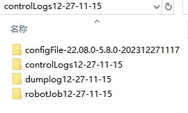

## 导入程序

在系统设置界面中，导入程序步骤如下：

1.  插入示教器的USB接口；
2.  点击【设置】-【系统设置】-【导入程序】，选择上传的作业文件；

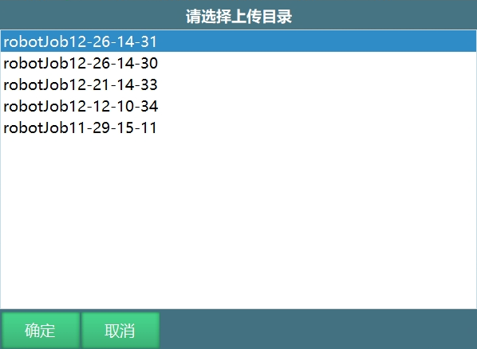

1.  点击【确定】，选择需要上传的作业文件；

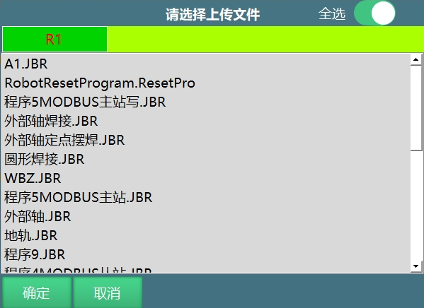

打开"全选"开关可以导入所有作业文件，关闭全选一次只能导入一个作业文件或者一次性导入多个作业文件；

1.  点击【确定】开始导入程序，程序导入成功后工程界面会显示导入的程序名。

用户自定义作业文件导入：

1.  在U盘中根路径新建名为"robotJob"的文件夹，并在该文件夹内新建名为"R1"的文件夹；
2.  将后缀名为".JBR"的程序放在R1文件夹；
3.  将U盘插入示教器的USB接口；
4.  点击【设置】-【系统设置】-【导入程序】；
5.  选中robotJob，点击【确定】；

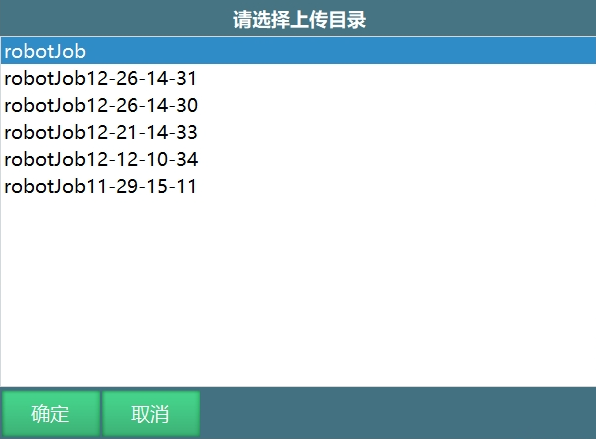

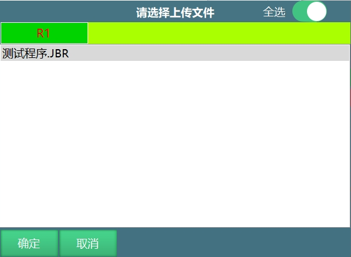

1.  点击【确定】开始导入程序，程序导入成功后工程界面会显示导入的程序名。

## 导出程序

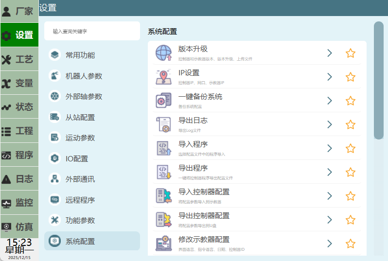

在上图的系统设置中，导出程序步骤如下：

1.  将U盘插入示教器的USB接口。

2.  点击【设置】-【系统设置】-【导出程序】。

3.  程序导出到U盘根目录下。

导出程序的命名方式为"robotJobxx-xx-xx-xx（默认是当前日期时间，也支持重命名）"目录下。

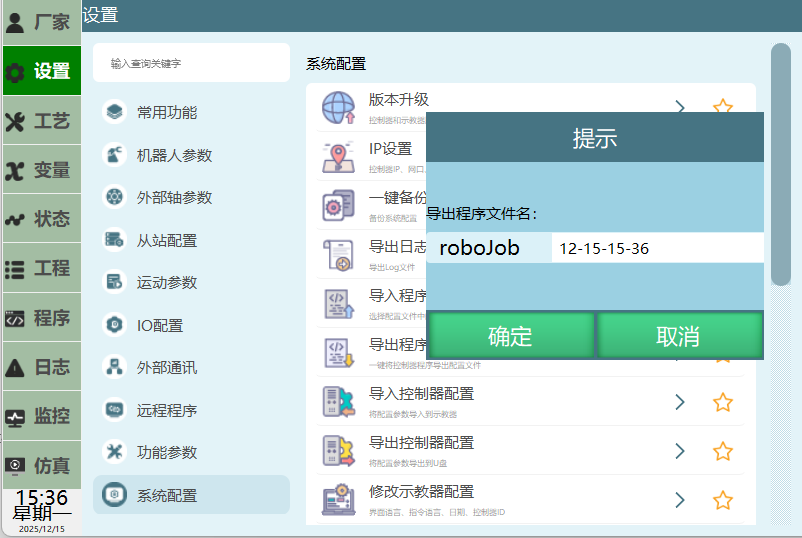

如下图所示：

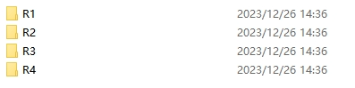

导出程序可以将robot1、robot2、robot3、robot4的程序全部导出，R1文件里面是robot1的程序，R2文件里面是robot2的程序，R3文件里面是robot4的程序，R4文件里面是robot4的程序。

## 导入控制器配置

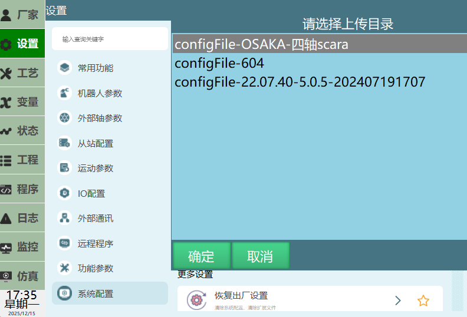

具体步骤如下：

1.  将U盘插入示教器的USB接口。

2.  点击【设置】-【系统设置】-【导入控制器配置】。

3.  选择需要导入的配置文件，点击【确定】进入配置文件选择界面，打开"全选"可以导入所有文件，关闭"全选"只能导入一个配置文件或者导入多个文件。

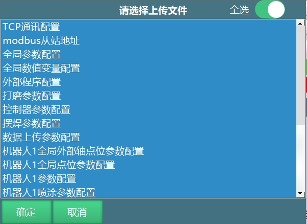

1.  如下图点击【确定】开始上传配置文件，配置文件导入成功后重启控制器。

      

## 导出控制器配置

具体步骤如下：

1.  将U盘插入示教器的USB接口。
2.  点击【设置】-【系统设置】-【导出控制器配置】。
3.  点击【确定】开始导出配置。
4.  导出的配置文件格式：configFile默认是当前程序的大版本号-小版本号-具体的日期，也支持重命名，如下所示。

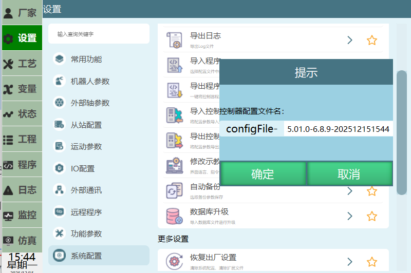

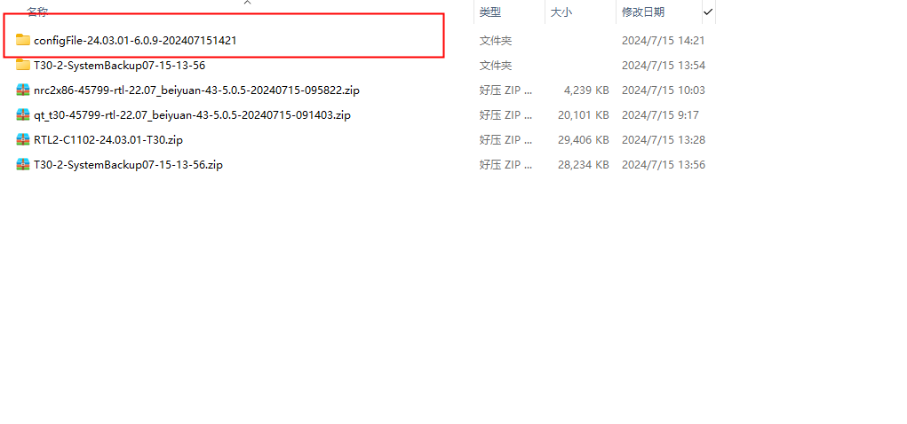 

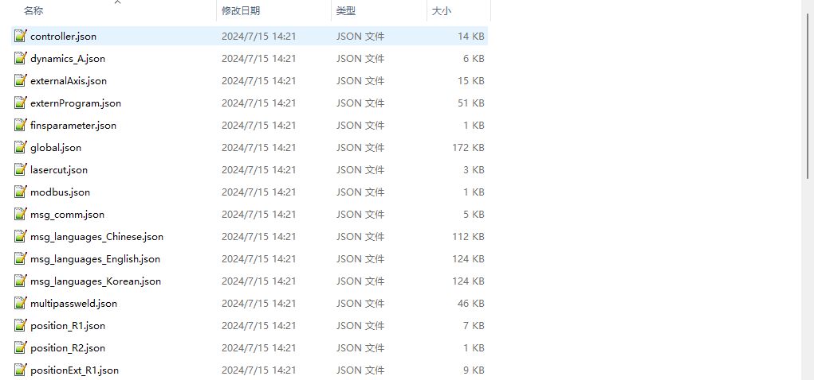

导出的配置文件包含的参数有：Modbus配置文件 modbus. json，中文语言文件
msg_languages_Chinese. json，传送带跟踪参数配置 conveytrack.
json全局参数配置 global. json，全局字符串变量 stringVariant.
json，机器人1全局点位参数配置 position_R1. json，机器人1参数配置
Robot_A. json等文件。

## 修改示教器配置

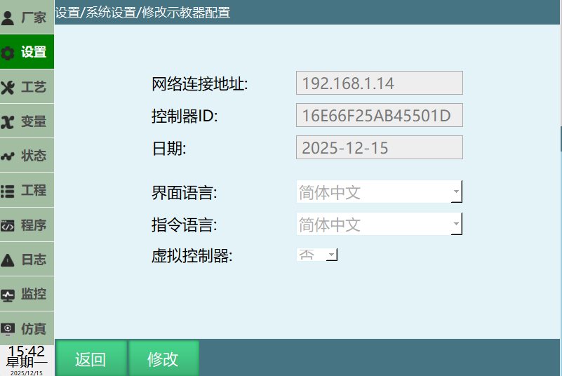

1.  界面语言：切换示教器的界面语言，例如切换界面语言为俄语、韩语、泰语等其它语言，界面语言如何切切换请查看《多语言功能手册》。
2.  指令语言：指令语言只有当前界面语言和英语，例如当前界面语言是韩语，指令语言为韩语和英语。
3.  虚拟控制器：虚拟控制器选择是的话只能查看每个界面，无法修改保存参数，仅支持PC连接虚拟控制器。

## 自动备份

1.  控制器自动备份功能：

- 备份内容：程序、参数。

- 备份个数：最大10个。

- 备份命名：按前提、版本、时间命名。如2024年07月15日6点36分修改参数，备份名"参数-22.08-5.8.0-20240715143150

- 触发备份的前提：开机、修改参数、修改程序、升级。

2.  备份频率：

- 开机时确认版本、参数正常后备份一次；

- 修改参数后5分钟内没有再次修改参数备份一次；

- 修改程序（插指令、修改指令）后5分钟内没有再次修改备份一次；升级前备份一次。

3.  功能说明：

- 还原选中备份：选中想要恢复的备份，选中后会显示光标，点击"还原选中备份"按钮。

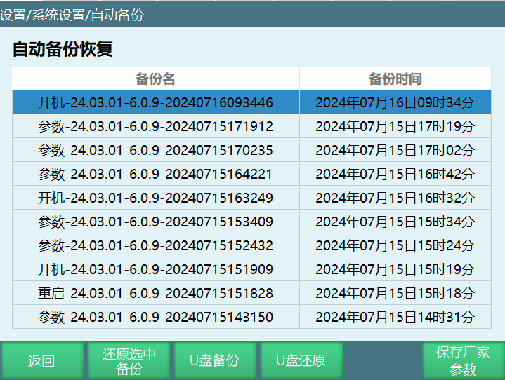

弹框提示，点击确定。

恢复过程中，请勿断电。

U盘备份：

步骤：将U盘插入示教器USB口，点击U盘备份，根据备份时当前运行的系统程序定义SystemBackup的文件名前缀为T30-1还是T30-2。nrc对应T30-1-SystemBackup，nrc2对应T30-2-SystemBackup。

备份文件命名格式：T30-1-SystemBackup/T30-2-SystemBackup+具体日期。

如下图所示：

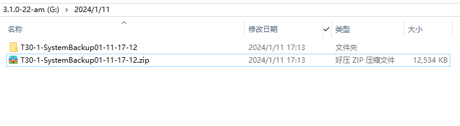

备份路径：U盘根目录。

备份的文件：

- 示教器备份文件：config.db;Pinyin.db;ServoError.db;TColor，Userdata.db，T30_ARM_Linux_Teach-pendant（示教器程序）

- 控制器备份文件：控制器配置文件config；工艺文件craft；eni文件；作业文件job；lua文件；多语言文件msg_languages；预置参数preset；变量variant；控制器程序C1102_X86_Linux-RT_Robot-controller。

- 程序备份说明：2403及以上版本针对不同平台，启动程序名称也做了
  修改，因此不同平台备份的名称也不同，详见下表格：

| 平台       | 原程序              | 现程序                                  |
| :--------- | :------------------ | :-------------------------------------- |
| C1102      | Actions：nrc.out    | C1102_X86_Linux-RT1_Robot-controller    |
|            | Igh:nrc2.out        | C1102_X86_Linux-RT_Robot-controller     |
| C1200      | nrc2.out            | C1200_X64_Linux-RT_Robot-controller     |
| C1201      | nrc2.out            | C1201_X64_Linux-RT_Robot-controller     |
| C2200-A01  | nrc.out             | C2200-A01_ARM_Linux-RT_Robot-controller |
| T30        | Qt-tp               | T30_ARM_Linux_Teach-pendant             |

U盘还原：

先获取系统当前运行的程序信息，对比备份系统文件的文件名。即nrc对应T30-1，nrc2对应T30-2。当前运行的系统与备份系统文件名匹配时，则允许系统还原，反之则不允许系统还原。

U盘插入示教器USB口，点击系统还原，选择系统还原文件，上传成功后重启示教器。

保存厂家参数：

保存厂家参数后，在管理员权限下，恢复出厂设置中即可恢复出厂时的机器人参数、IO以及工具手配置，此按钮只在厂家权限下显示。

## 数据库升级

1.  用于升级config.db文件，该文件保存的为示教器配置，如ip、操作参数中的一些参数等。
2.  修改主题颜色：新增TColor.db，数据库存放主题颜色。

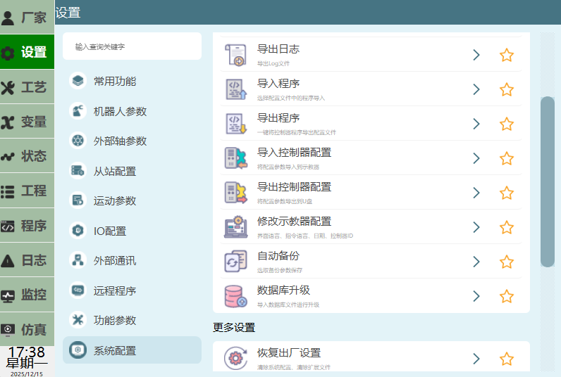

操作步骤：

1.  点击设置-系统设置-维护模式，在参数选择界面将使用数据库中样式表按键打开。

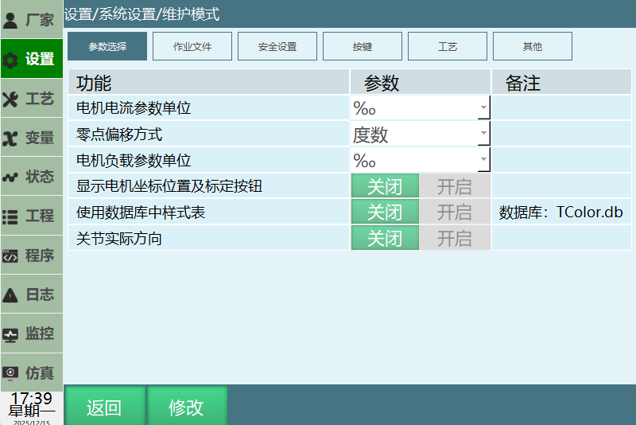

2.  用SQLite软件打开TColor.db文件，修改数据库stylesheet列（样式表）的颜色编码，保存。

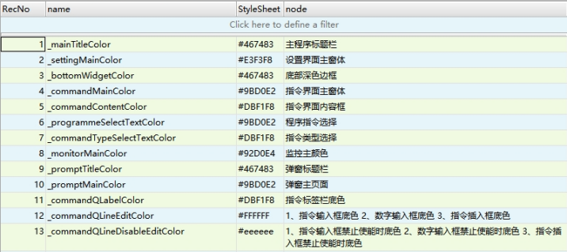

3.  修改后的TColor.db文件放在u盘根目录，点击设置-系统设置-数据库升级，选择TColor.db文件点击【确定】。

4.  二次确认弹窗提示，点击确定数据库升级完成后重启示教器生效。

## 更多设置

### 恢复出厂设置

如下图所示，用户可以根据自己的需要选择清除的配置文件。

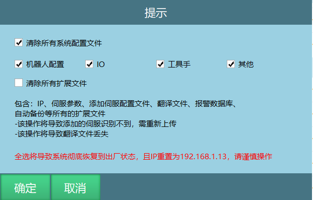

恢复出厂设置时需要谨慎请操作！请一定要在执行本操作之前备份所有参数以及程序文件！

步骤如下：

1.  进入设置-系统设置-更多设置界面；
2.  点击【恢复出厂设置】按钮，在弹出的提示窗中有两种选择，清除系统配置文件和所有扩展文件。选择需要清除的配置文件类型；
3.  点击【确定】按钮后继续点击二次确认框【确定】，选择的配置文件被恢复出厂设置。

### 删除数据库

选择删除数据库，点击【确定】示教器里的config.db文件会被删除。

### 删除工程

选择删除工程，点击【确定】程序清空成功后创建的作业文件被清空。

谨慎操作，程序被清空后无法恢复 ！

### 文本大小

路径：设置-系统配置-文本大小

功能：调整界面字体的大小

点击-修改-选择文字大小

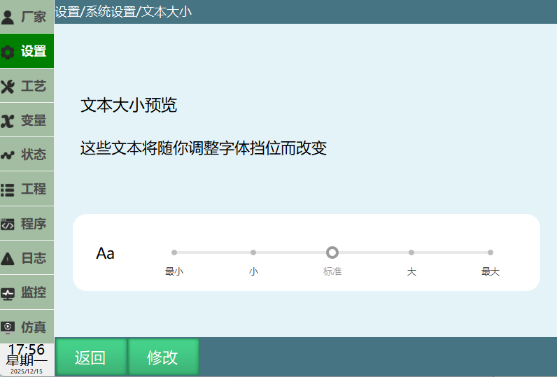

## 时间设置

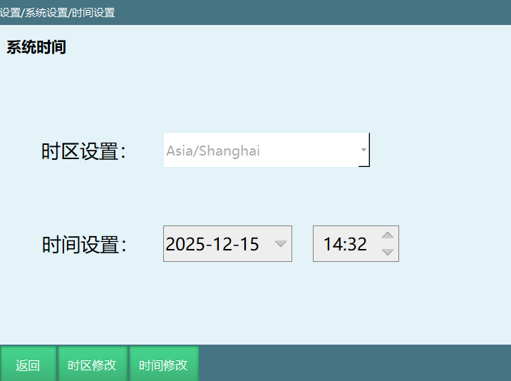   

【修改】：点击【时间修改】按钮，设置年、月、日、小时、分钟。

【修改】：点击【时区修改】按钮，设置时区。

如何修改日期：

- 点击如下图标记的第1步，出现修改日期弹窗。

- 点击标记第2步，修改月份。

- 点击标记第3步，修改年份 。

修改时间：

- 点击如下图标记的第4步，修改时间 。

【返回】点击返回按钮，退出此界面。

【保存】点击保存按钮，时间设置成功。

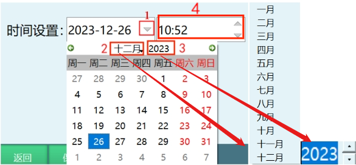

## 维护模式

路径：设置-系统设置-维护模式

### 参数选择

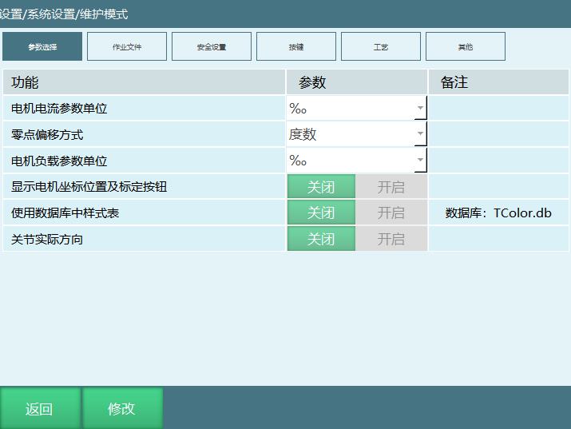

1.  电机电流参数单位：‰、A
说明：修改监控-电机状态-电机电流界面的单位显示
2.  零点偏移方式：度数、编码值
说明：修改机器人参数-零点位置-零点偏移界面的单位，选择度数则显示°，选择编码值则显示inc
3.  电机负载参数显示单位：‰、mNm
说明：修改监控-电机状态-电机负载界面的单位显示
4.  显示电机坐标位置及标定按钮：打开开关在监控-机器坐标界面多了一个电机位置坐标，在设置-机器人参数-零点位置界面多了一个【标记无间隙方向】按钮

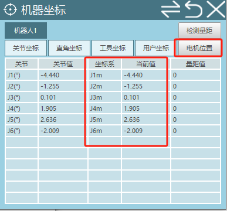

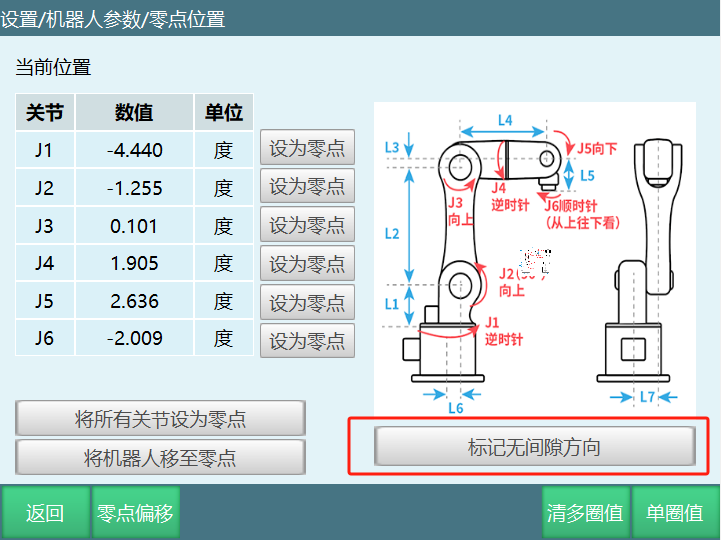

示例说明：以机器人的一轴为例，在设置-机器人参数-关节参数-其他参数界面【齿轮反向间隙】设置一个值，齿轮反向间隙有值的时候会出现一个报错，因为没有还没有进行标定，此时到零点位置界面标记无间隙方向。

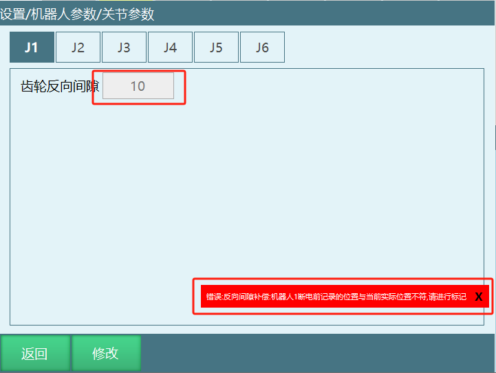

标定方法如下：

- 动J1+，因为齿轮反向间隙的值为10，所以电机位置在动1轴的过程中要大于10

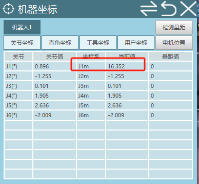

- 当大于10之后点击【标记无间隙方向按钮】，会有标记成功的消息提示

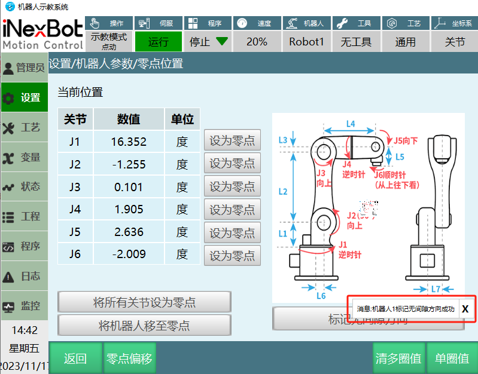

验证是否有效果:

- 标记成功之后看监控机器人坐标和电机位置坐标的一轴坐标是否一样

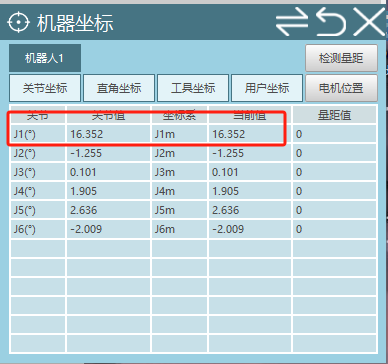

- 上电点动机器人一轴，点动一轴正方向时机器人坐标和电机位置坐标一致,反方向点动一轴时，机器人坐标和电机位置坐标相差10，也就是齿轮反向间隙的值

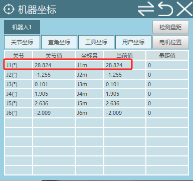

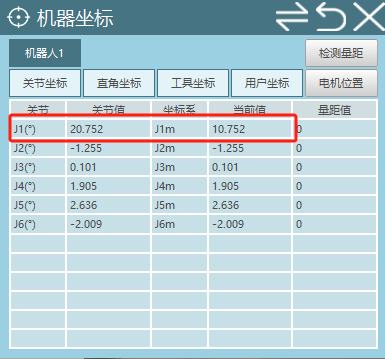

5.  使用数据库中样式表：打开使用数据库中样式表开关可修改主题颜色，如果不打开开关升级数据库文件不生效。

修改主题颜色步骤:

- 用SQLite软件打开TColor.db文件，修改数据库stylesheet列（样式表）的颜色编码保存，如图所示：

- 修改后的TColor.db文件放在u盘根目录，点击设置-系统配置-数据库升级，选择TColor.db文件点击【确定】。

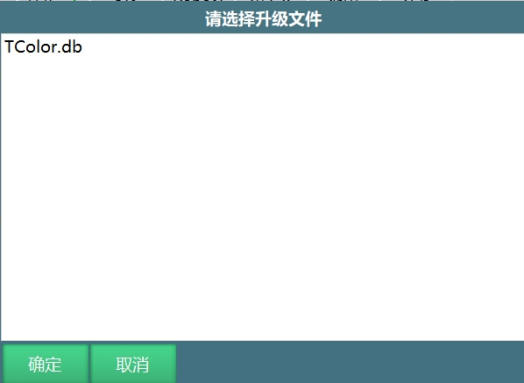

- 二次确认弹窗提示，点击【确定】数据库升级完成后重启示教器修改的主题颜色生效。

6.  关节实际方向：关节实际方向相对于模型方向设置，与模型方向相同选1，相反选-1，根据实际需求设置。（如果想要实现机器人轴运动方向与模型相反，可根据下述内容调整即可）\
    1.初始状态下，点动各轴+，调整模型方向，确保机器人运动方向与模型保持一致；\
    2.切到直角坐标系，验证XYZ方向是否为正常（以六轴为例：面向机器人，X+向前，Y+向右，Z+向上）；\
    3.使用关节实际方向功能需前往【设置】-【维护模式】界面，将关节实际方向后的按钮打开；\
    4.关节实际方向在【设置】-【机器人参数】-【关节参数】-【其他参数】界面；\
    5.如果期望二轴+运动与模型相反，将关节实际方向改为-1即可；\
    6.通过点动该轴，查看是否变更完成，再次切到直角坐标系进行验证方向是否正常。

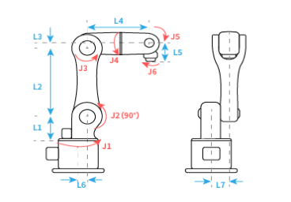

### 作业文件

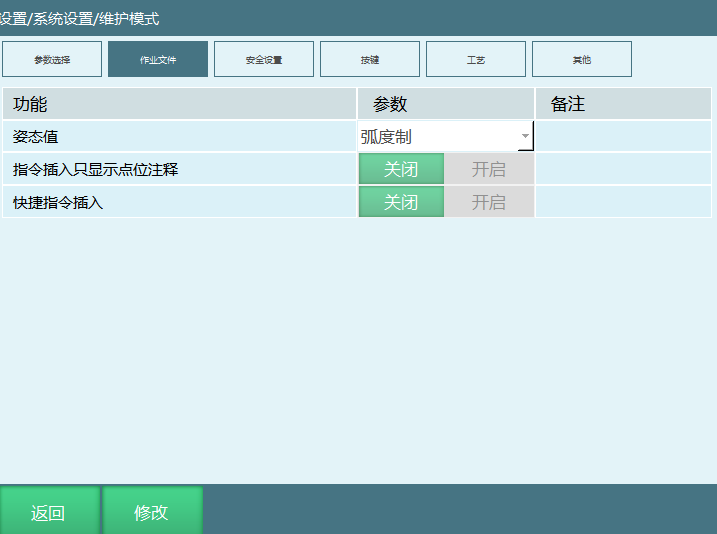

1.  姿态值：角度制、弧度制

说明：修改姿态值后位置变量姿态轴(ABC轴)的参数和单位会根据姿态值的修改而变化

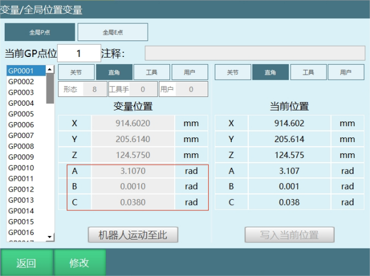

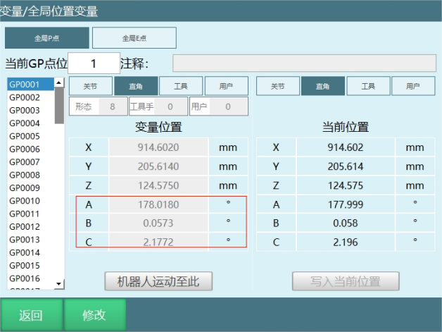 

2.  指令插入只显示点位注释

说明：点击开启后插入的点位只显示用户定义的注释，不会显示具体的指令名称，关闭后插入点位的具体指令名称正常显示

3.  快捷指令插入

说明：点击开启程序指令界面出现快捷指令标志，默认是有设置好的快捷指令，用户可以移除掉默认的快捷指令，添加自己想要的快加指令，点击+号快捷指令显示。如图所示直接点击点到点或者其它指令可以快速的插入目标指令。

添加常用：点击指令全览进入指令插入界面，选择目标指令点击添加常用目标指令选中

移除常用：点击指令全览进入指令插入界面，选中想要移除的指令后点击移除常用目标指令移除

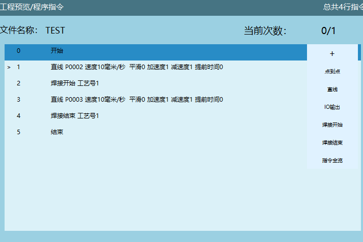

### 安全设置

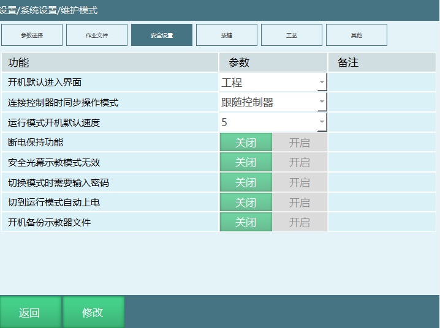

1.  开机默认进入界面：用户权限界面、工程界面

2.  连接控制器时同步操作模式：跟随控制器、跟随模式旋钮

跟随控制器：当控制器与示教器连接正常的情况下，示教器会跟随控制器发送的模式。

跟随模式旋钮：在控制器与示教器连接正常的情况下,通过旋钮切换操作模式

3.  运行模式默认开机速度：【1,100】

说明：修改完速度后根据示教器界面提示重启系统，重启后切到运行模式此时运行模式速度就是修改后的速度

4.  断电保持功能

主要作用**：**应对于突然停电等外部电源断开的情况下，控制器在断开外部电源后立即保存当前机器人位置，程序状态，变量数值等，控制器外部电源接通后，可以恢复到断电前的状态。（需要该功能生效需要使用硬件支持UPS的控制器或控制器外接硬件UPS）

断电保持功能生效时消息：外部电源重新接通后，如果该功能生效，开机后会提示"断电保持已生效"

断电保持触发后恢复的数据：

- 机器人位置，外部轴位置（虚拟伺服不会恢复）；

- I,D,B,S,GI,GD,GB,GS数值变量；

- IO强制输入输出；

- 程序运行位置当前行,上次运行行,断点运行，程序指令之前运行的赋值，IO状态；

- 全局后台，局部后台任务；

- Modbus数值，变量。

5.  安全光幕示教模式无效：打开开关光幕信号不生效，不会影响程序运行

打开开关，示教模式下触发安全光幕程序正常运行。

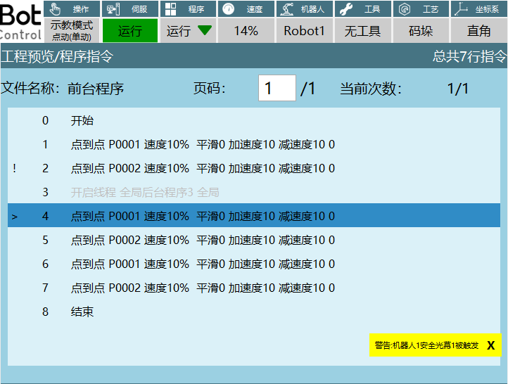

关闭开关，示教模式下触发安全光幕程序暂停运行。

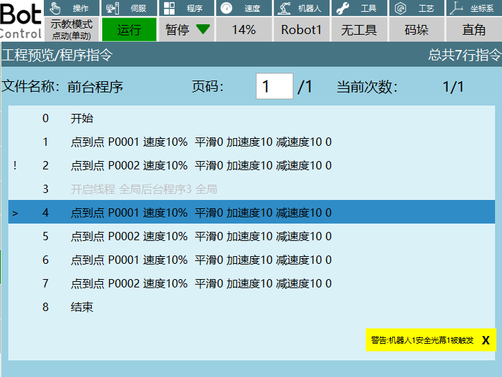

6.  切换模式时需要输入密码:打开开关用户切换操作模式时需要输入密码，默认是关闭状态。

7.  切到运行模式自动上电:打开开关则切到运行模式时自动上电

8.  开机备份示教器文件:示教器每次开机会备份两次，不打开的话就只会数据同步，不会备份

9.  

### 按键

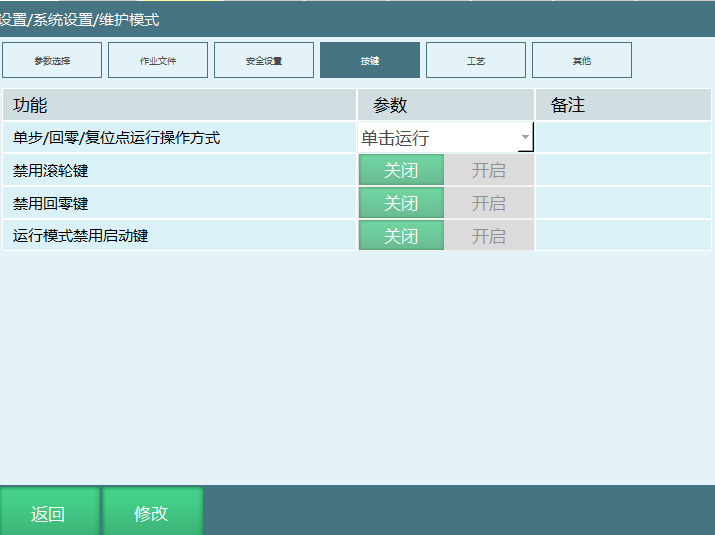

1.  单步/回零/复位运行操作方式:单击运行、按下运行

单击运行：按一下对应的按键，机器人就会执行对应的功能

按下运行：需要一直按住对应按键，机器人才会执行对应的功能

2.  禁用滚轮键:打开表示示教器右侧的滚轮键被禁用，禁用状态下滑动滚轮键无效，关闭开关，滚轮按键恢复使用

3.  禁用回零键:打开开关表示回零按键禁用，此时点击示教器上的零点按键和监控-快捷键界面的回零会有提示【机器人回零键已被禁用】，关闭开关回零功能恢复使用

4.  运行模式禁用启动键:打开禁用开关，操作模式为运行模式时点击示教器上的【启动】键不生效，无法启动程序，关闭禁用开关，运行模式点击【启动】程序开始运行。

### 工艺

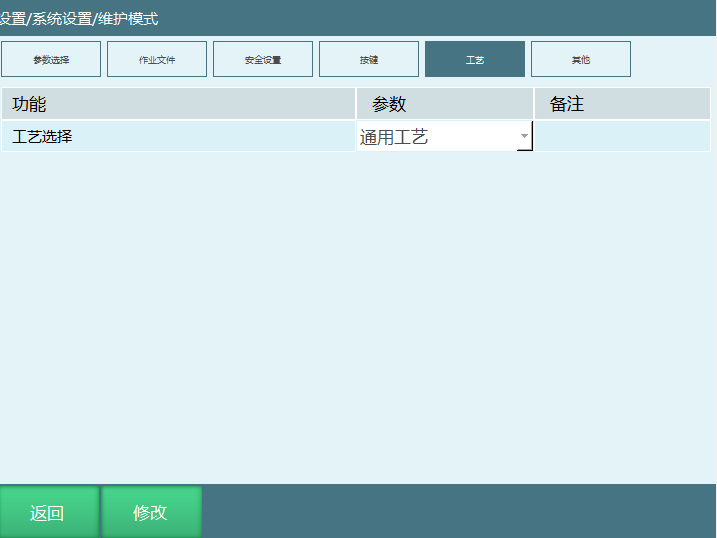

1.  工艺选择：通用、专用、码垛、焊接和切割

说明：选择通用时示教器上方工艺状态栏会显示通用、码垛、焊接和切割，如果只选择单独工艺示教器上方工艺状态栏只显示单独选中的工艺类型

### 其它

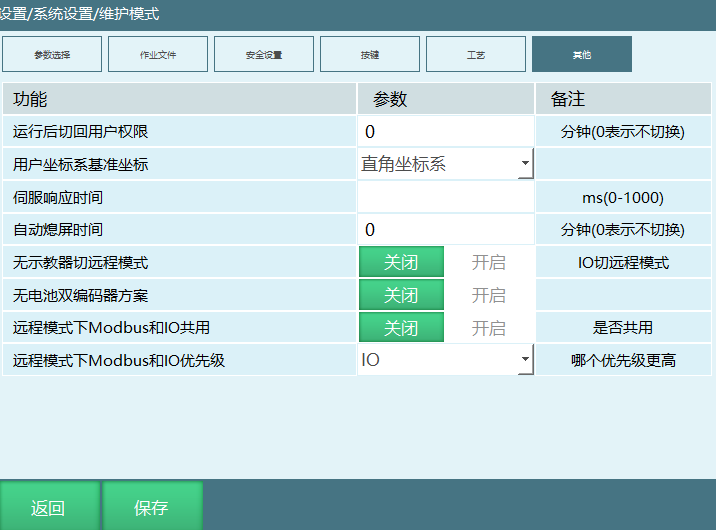

1.  运行后切回用户权限（单位：分钟）：设置了时间参数，程序运行时到设置的时间后用户权限切换为操作员。

2.  用户坐标系基准坐标：2501版本暂时还没做。

3.  伺服响应时间：预防多台控制设备给伺服发送信号导致伺服的状态错乱，如果超过了响应时间没收到伺服的回复就会判断伺服上下使能失败，如图所示。

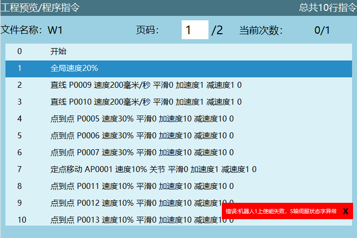

4.  自动息屏时间单位（分钟）：到达设定的时间后示教器息屏，填写0表示不会息屏

5.  无示教器切远程（IO切远程）：不需要通过示教器旋钮切换模式，未连接示教器时，触发远程IO信号后自动切至远程模式。

说明：在设置-远程程序-远程程序设置界面已经配置好了远程参数（启动信号、停止和程序预约等信号）此时假设拔出示教器直接给启动信号然后再插入示教器模式已切换到远程模式

6.  无电池双编码器方案：电机端为多圈值绝对值编码器、减速机端为单圈绝对值编码器、两者都不带电池，概率性会出现丢零点

功能开始开启和正常使用条件：打开双编方案、当前是大族伺服，且配置了减速机端pdo通道，同时需要设定一次零点后功能才可以正常使用。另外注意事项：由于目前的归一化做法是因为只有单圈的绝对变化是准的并且可以避免临界值附近的震荡溢出，导致实际能表示的电机端位移量只有减速机端一圈乘以减速比后的圈数变化，因此不考虑超过断电下位移超过360的情况

7.  远程模式下Modbus和IO共用：打开开关代表共用，界面出现远程模式下Modbus和IO优先级选择。不打开开关表示不共用，modbus优先级高且modbus连上时IO无法控制机器人

8.  远程模式下Modbus和IO优先级：IO、Modbus

IO:IO优先级高，modbus和IO同时连上时IO优先级高，程序运行时按照IO逻辑走

Modbus:Modbus优先级高，modbus和IO同时连上时IO优先级高，程序运行时按照modbus逻辑走

## IO配置

见下图：

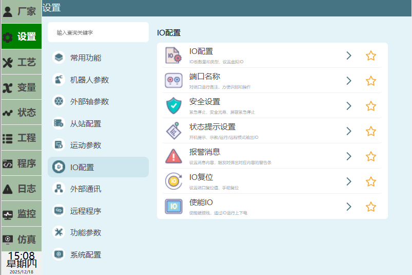

### IO配置

配置方法见下图：

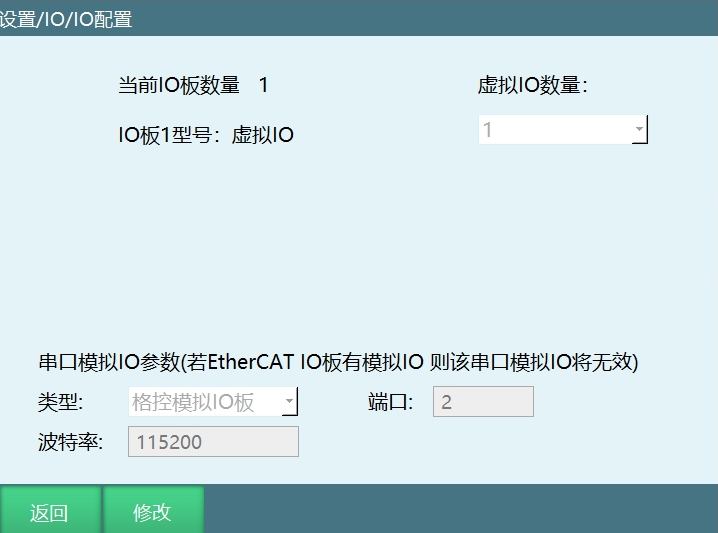

点击设置-IO，进入IO配置界面,此界面可以看到IO板数量和当前连接IO板的型号，点击【修改】可以设置IO数量，最多支持连接4块IO板。

注：虚拟IO仅供程序调试及程序演示使用，并没有任何IO信号接入。

### 端口名称

功能：给IO板的数字端口和模拟端口定义名称，方便用户在用到多个信号时知道所使用的IO端口所代表的意思。例如焊接工艺里面需要用到很多信号，定义端口名称后就知道每个端口所表示的意思。

如下图定义端口名称，保存后端口名称修改成功。

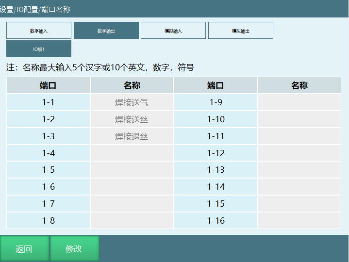

指令里面对应端口名称被修改：

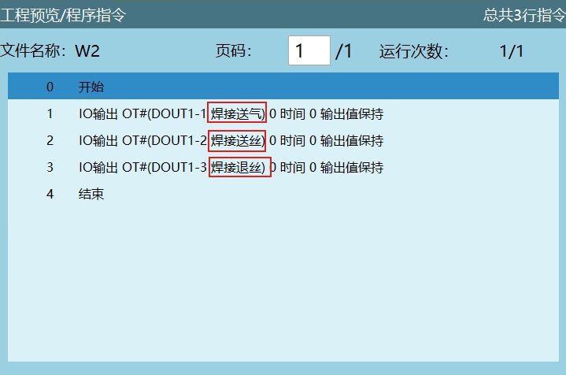

监控-IO状态界面端口名被修改：

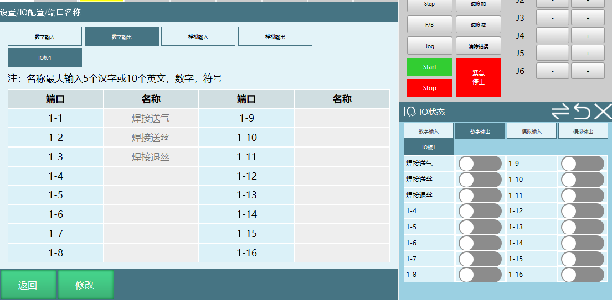

## 安全设置

紧急停止：触发紧急停止信号后机器人下电，伺服状态切换为停止。

安全光幕：触发安全光幕机器人暂停运行，再次按下启动按钮机器人继续运行。

二次启动确认：

1.  远程模式，先给启动信号，再给二次启动确认信号，作业文件才能正常运行

2.  运行模式，先按示教器上的启动按键，再给二次启动确认信号，作业文件才能正常运行

屏蔽紧急停止：紧急停止触发后打开使能屏蔽紧急停止信号。

快速停止时间：紧急停止触发后机器人快速停止时间。

屏蔽时间：紧急停止触发后信号的屏蔽时间，在屏蔽时间内点击清错按键将机器人可以移动到安全位置，超过屏蔽时间后控制器报错（机器人屏蔽结束，紧急停止被触发）。

下图是安全设置界面：

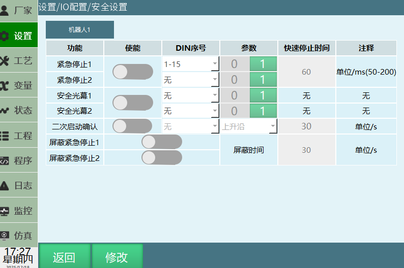

示例说明：如下图所示设置参数（此参数仅为说明，无实际意义）：

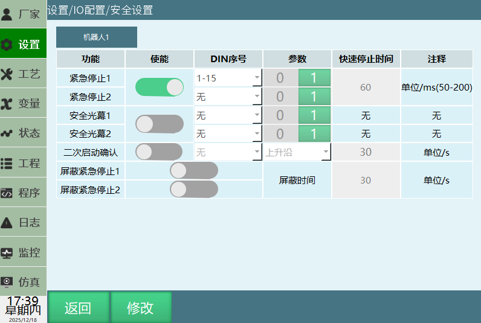  

当IO端口1-15口由低电平0---高电平1时，紧急停止被触发，在设置的50ms之内机器人停止运行。

### 状态提示设置

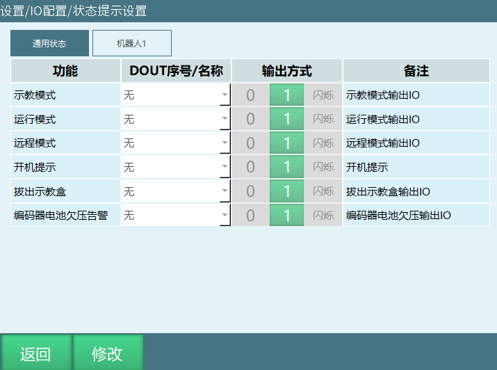

输出方式：

| 参数 | 说明 |
| :--- | :--- |
| 0 | 低电平输出提示 |
| 1 | 高电平输出提示 |
| 闪烁 | 选中的IO闪烁输出提示 |

通用状态：

1.  开机提示：控制器处于开机状态时IO输出提示。
2.  示教模式：当前操作模式为示教模式时IO输出提示。
3.  运行模式：当前操作模式为运行模式时IO输出提示。
4.  远程模式：当前操作模式为远程模式时IO输出提示。
5.  拔出示教盒：拔出示教盒后IO输出提示。

说明：以下状态IO输出的端口和输出方式根据用户设置的参数输出提示。

示例说明1：功能选择运行模式；输出端口1-1；输出方式1。

当操作模式为运行模式时IO的1-1口输出高电平。

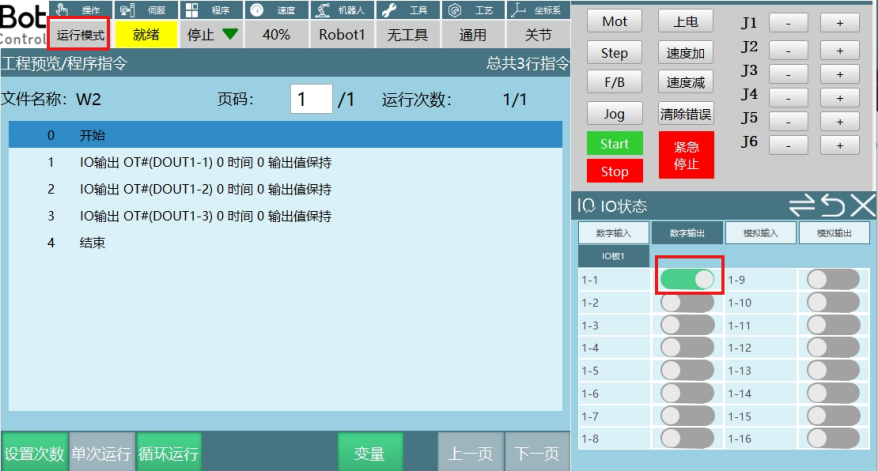

机器人状态提示：

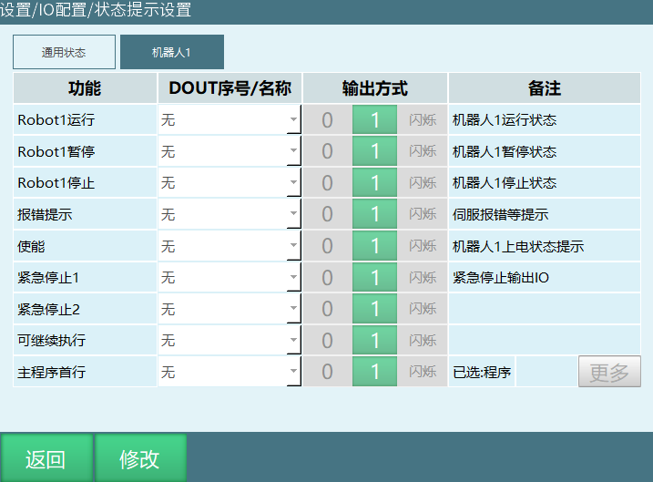

1.  Robot1运行：机器人1程序状态为运行时IO输出提示。
2.  Robot1暂停：机器人1程序状态为暂停时IO输出提示。
3.  Robot1停止：机器人1程序状态为停止时IO输出提示。
4.  报错提示：机器人报错时IO输出提示。
5.  使能：伺服处于上电状态时IO输出提示。
6.  紧急停止1：紧急停止1触发后IO输出提示。
7.  紧急停止2：紧急停止2触发后IO输出提示。
8.  主程序首行：光标跳至"主程序"首行时IO输出提示。
9.  可继续执行：运行暂停的程序时IO输出提示。

示例说明2：功能选择Robot1运行；输出端口1-2；输出方式1。

当程序处于运行状态时IO的1-2口输出高电平。

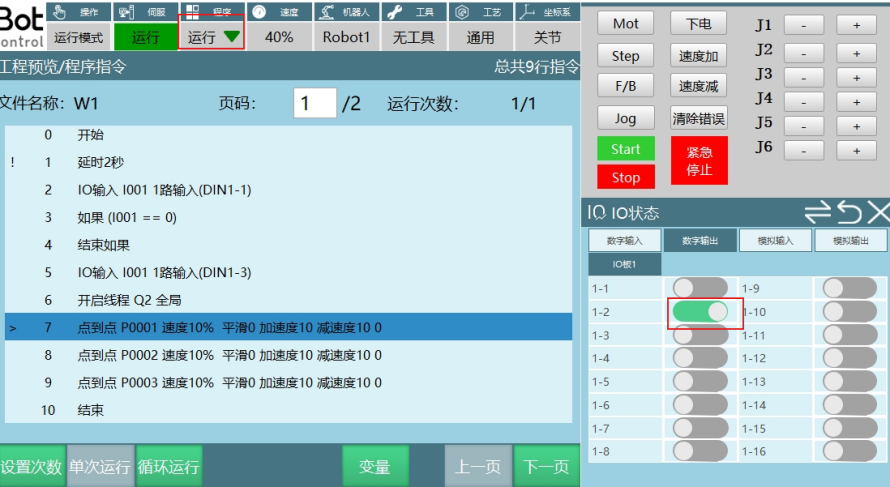

### 报警消息

点击【设置】，选择【IO报警信息】进入界面，用户自定义数字输入和数字输出的报警类型和内容。

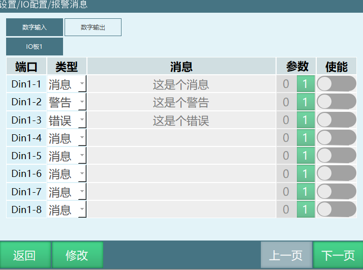

1.  【端口】IO端口。
2.  【类型】IO报警信息输出的类型（消息、警告、错误）。
3.  【消息】触发IO报警后输出的内容。
4.  【参数】当设置为0时，IO端口状态为0时触发报警信息，当设置为1时，IO端口状态为1时触发报警信息。
5.  【使能】打开使能开关，IO端口到达设置好的状态回会触发报警信息，关闭使能开关，无论io什么状态都不会触发报警信息。

数字输出报警消息参数的设置和数字输入用法一样，下面以数字输入报警信息的使用作为示例说明。

1.  示例说明1：端口选择Din1-1，类型选择消息，消息内容为"这是一条消息"，参数1，使能打开。如下图：

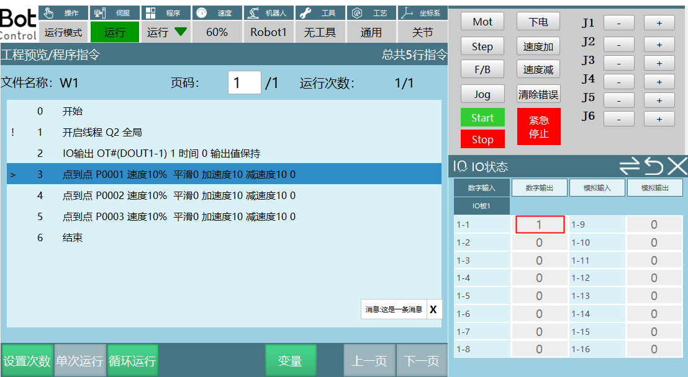  

当输入端口1-1由低电平0-高电平1触发报警消息，示教器上弹出白色消息提示，程序正常运行。

1.  示例说明2：端口选择Din1-1，类型选择消息，消息内容为"这是一条警告"；参数1，使能打开。如下图：

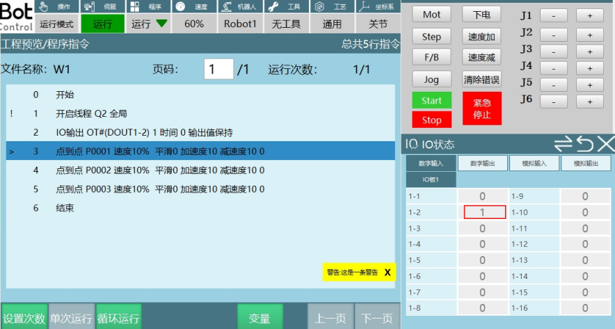

当输入端口1-2由低电平0-高电平1触发报警消息，示教器上弹出黄色警告消提示，程序正常运行。

1.  示例说明3：端口选择Din1-3，类型选择错误，消息内容为"这是一条错误"，参数1，使能打开。如图：

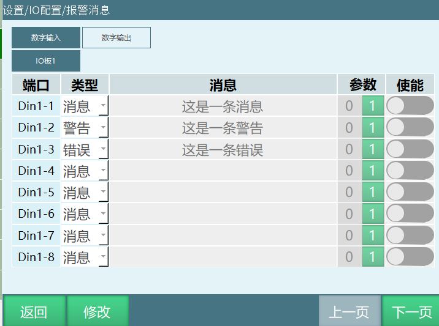

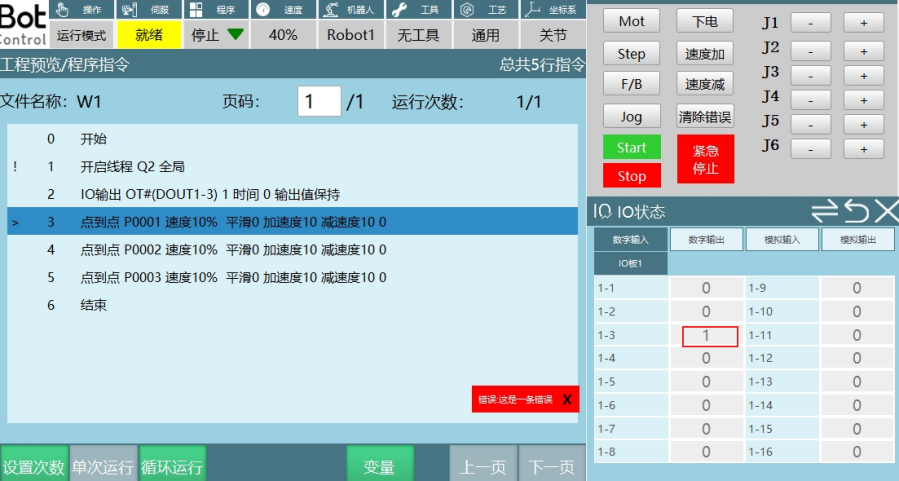

当输入端口1-3由低电平0-高电平1触发报警消息，示教器上弹出红色报错提示，伺服下电，程序停止运行。

### IO复位

此功能是根据用户在执行了IO复位操作、切模式操作、程序报错操作后信号的输出反馈。

说明：打开是否复位使能后在执行IO复位操作、切模式操作、程序报错操作时选择的输出端口才会复位，不打开使能输出端口无法复位。

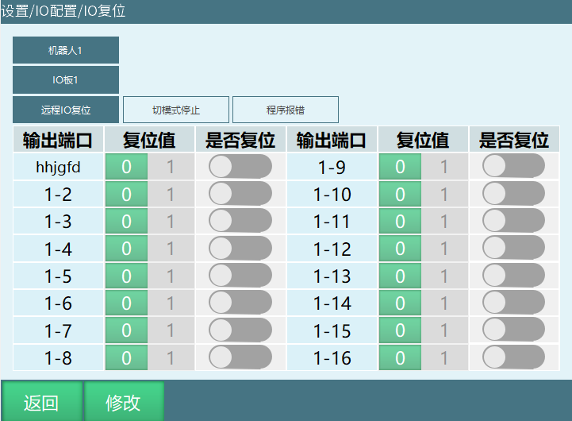

1.  远程IO复位：远程模式下执行IO复位操作后在运行到复位点或者运行完复位程序后选择的输出端口复位到复位值。

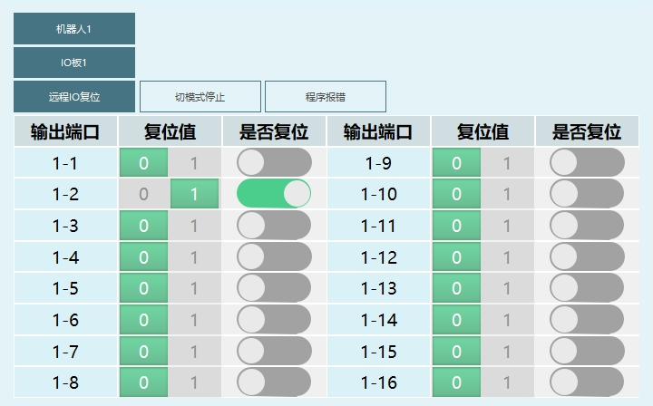

示例说明：远程模式下机器人运行到复位点或者运行完复位程序后输出端口1-2口复位，复位值为1。

1.  切模式停止：程序运行时通过切模式导致程序运行停止的操作，在执行切模式操作后根据选择的输出端口复位到复位值。

示例说明：程序在运行模式运行程序时将操作模式切换到示教模式，选择复位的输出端口是1-1，复位值为1，打开是否复位使能。

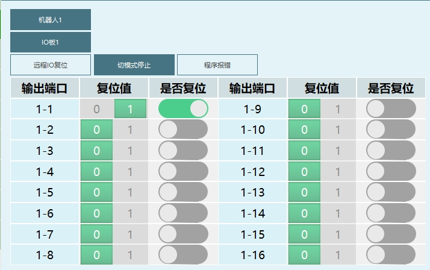

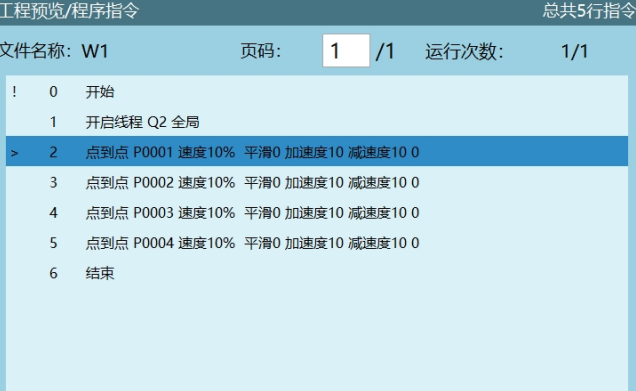

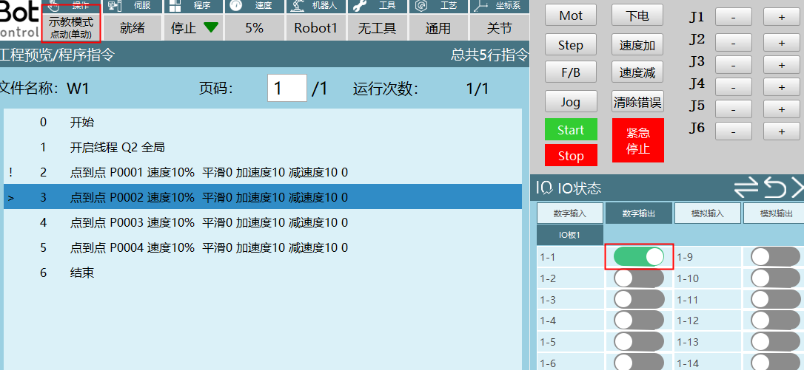

1.  程序报错：程序运行时出现报错导致程序运行停止，将输出IO端口复位到复位值。

说明：只有会清断点的报错才会触发IO复位-程序报错。

### 使能IO

1.  如果使用使能硬接线示教盒需在连接好线缆后，在此页面选择对应的DIN的端口并打开使能开关，上电使能功能则由IO板输入信号控制；非使能硬接线示教盒请勿设置。
2.  打开此功能后示教盒使能按键失效，不可使用。
3.  使能端口1为上电使能，使能端口2为下电使能。
4.  上电只需要打开使能端口1，在任何情况下，只要使能端口2打开，均会下电。

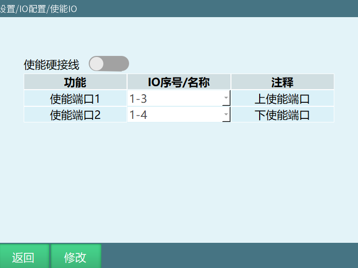

# 机器人参数

## 工具手标定

请查看《工具和用户标定&工具手标定》手册

## 用户坐标标定

请查看《工具和用户标定&工具手标定》手册

## 机器人类型

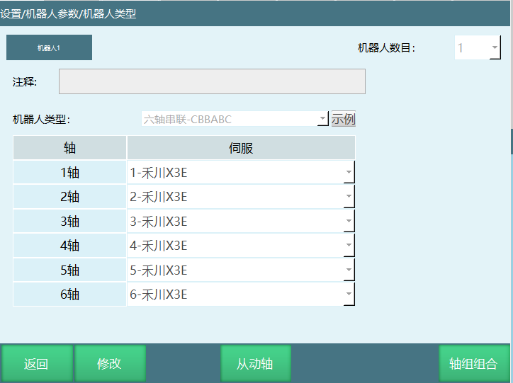

【外部轴】：点击【外部轴】进入外部轴配置界面，在此界面可以配置外部轴组数目和外部轴类型。

【轴组组合】：点击【轴组组合】进入轴组组合配置界面，在此界面可以选中外部轴类型

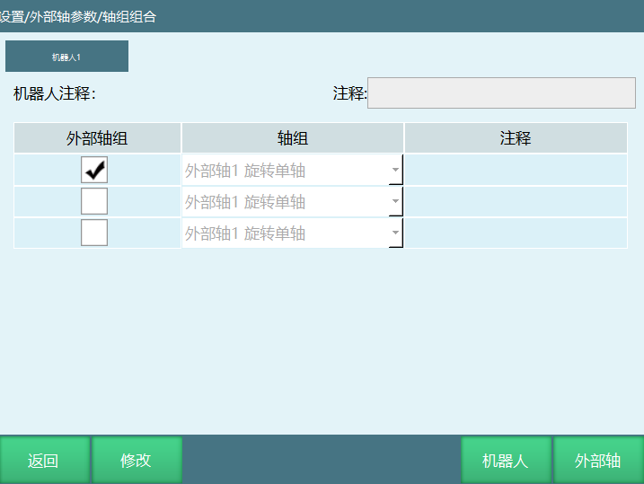

## DH参数

路径：设置-机器人参数-DH参数

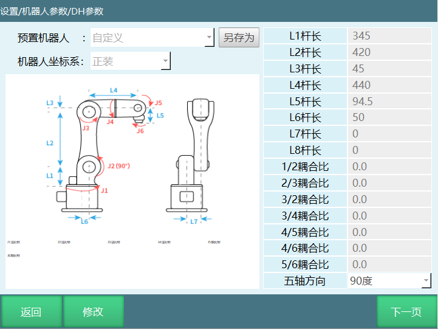

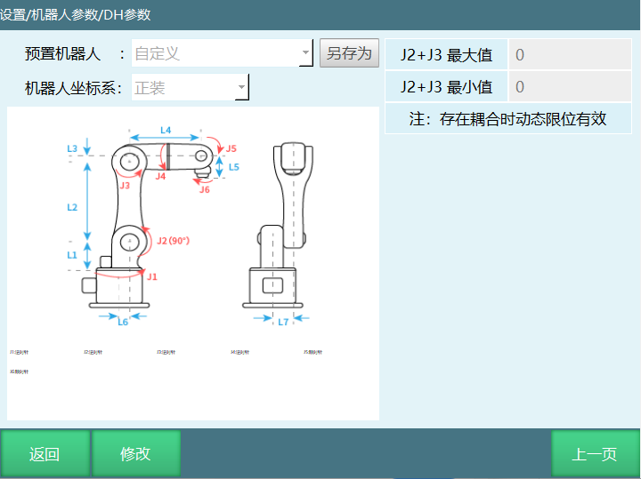

1.  杆长：所有杆长值是机器人在零点位置时测量的。
2.  耦合比：机器人在运动过程中，一个关节运动时另一个关节也会运动，这就说明有耦合，为了抵消这种耦合作用，就需要耦合比。

耦合比=跟随轴旋转角度​/主轴旋转角度。

例如：我们操作 1 轴旋转了 10°，发现 2轴跟随旋转了
15°，那么耦合比为 15/10=1.5。

1.  五轴方向：机器人在零点位置时五轴的方向
2.  三轴方向（机型为六轴协作机器人）：六轴协作机器人有两个零点位置，三轴方向，五轴方向（0,180），三轴方向，五轴方向（-90，90）。
3.  螺距（SCARA机器人）：SCARA 机器人的 3
    轴是控制丝杆上下运动，控制丝杆的旋转轴转动 360°
    时丝杆上下移动的距离就是螺距。
4.  J2+J3最大值、J2+J3最小值。

只有当2/3存在耦合时，动态限位才会生效，当J2+J3最大值和J2+J3最小值不在设置的参数范围内，在运行程序时会报错（机器人2、3轴动态限位超限）。

1.  转化比：转化比就是关节转360度（也可理解为电机转一圈）走的距离（单位：mm）。

转换比计算方法：
转换比填1然后对应轴转360度，然后量走的距离，将量完的距离填入。

例如：电机旋转一圈会有角度值，我们通过转化比可以将角度值转化成长度值。

1.  放大比（四轴码垛丝杆）：工具末端移动的距离/三轴丝杠移动的距离。
2.  DH参数界面新增另存参数功能，方便用户切换参数。

- 点击【另存为】，如下图所示给文件命名，点击【确定】。

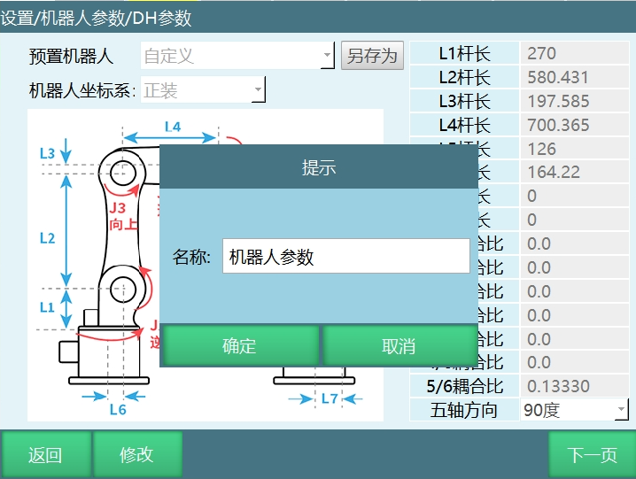

- 点击预置机器人选择预置参数文件点击确定后，用户可以修改DH参数和关节参数，点击【关节参数】进入关节参数界面修改，不需要的话在当前界面直接修改DH参数即可。

- 点击【保存】，用户所修改的参数被存入"机器人参数.json文件"。

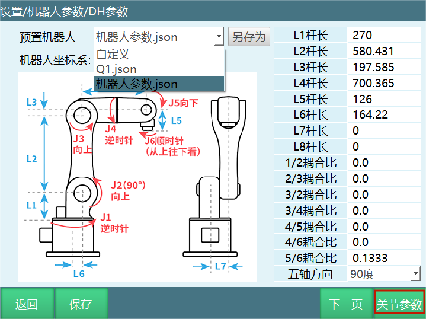

## 关节参数

路径：设置-机器人参数-关节参数

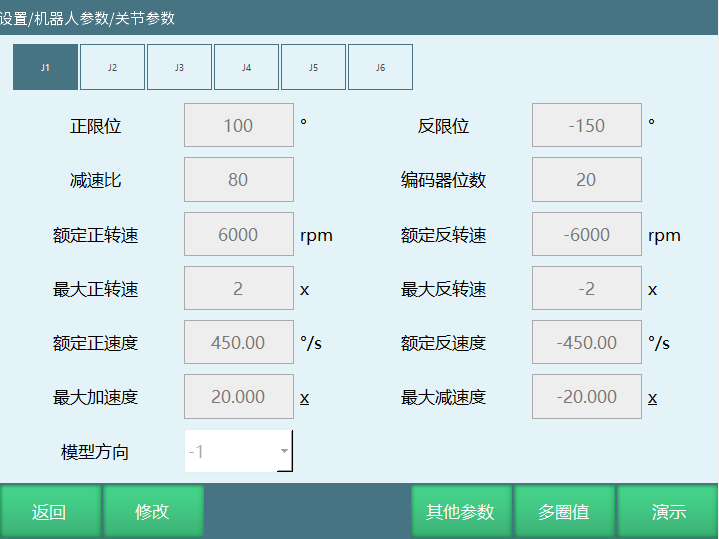

1.  正限位：机器人正方向旋转的角度或移动的距离，运动时超过限位会报错（机器人点动位置到达极限）。
2.  方限位：机器人反方向旋转的角度或移动的距离，运动时超过限位会报错（机器人点动位置到达极限）。
3.  减速比：减速机的减速比。
4.  编码器位数：填写当前所使用的编码器位数，注意不要随便填写，否则在点动机器人时飞车。
5.  额定正转速：电机正方向能够运行的转速。
6.  额定反转速：电机反方向能够运行的转速。
7.  最大正转速：例如1倍时从0速到达额定正速度时间为10秒，那么2倍就是5秒到达额定正速度。
8.  最大反转速：例如1倍时从0速到达额定反速度时间为10秒，那么2倍就是5秒到达额定反速度。
9.  关节额定正速度：机器人关节额定正方向速度，关节额定正速度计算方法：额定正转速\*360/60/减速比。
10. 关节额定反速度：机器人关节额定反方向速度，关节额定反速度计算方法：额定反转速\*360/60/减速比。
11. 最大加速度：例如1倍时从0速到达最大加速度时间为10秒，那么2倍就是5秒到达最大加速度。
12. 最大减速度：例如1倍时从0速到达最大减速度时间为10秒，那么2倍就是5秒到达最大减小速度。
13. 模型方向：模型方向可参照零点位置界面关节正方向示意图设置，各轴点动"+"键应与关节正方向示意图方向相同，相同选1，相反选-1。

#### 其它参数

齿轮反向间隙：设置-系统配置-维护模式界面有详细说明。

#### 多圈值

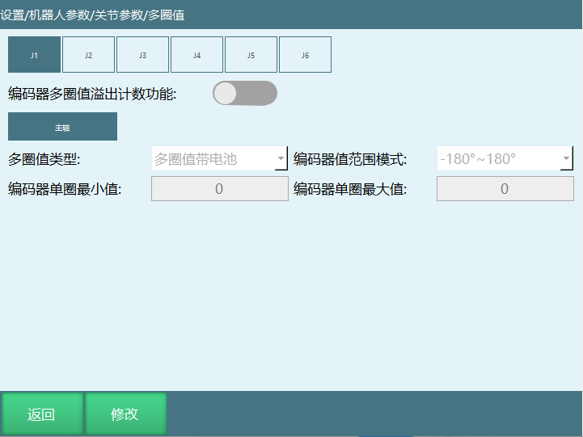

编码器多圈值溢出计数功能：该功能用来消除编码器最大/最小值之间跳变产生的影响。

| 多圈值类型     | 编码器值范围模式 | 范围                                                                      |
| :------------- | :--------------- | :------------------------------------------------------------------------ |
| 多圈值带电池   | 1. -180°~180°    | 1. 最小值【-2^31，2^31】，最大值【-2^31，2^31-1】                         |
|                | 2. 0°~360°       | 2. 最小值【0，2^32】，最大值【0，2^32-1】                                 |
| 多圈值不带电池 | 1. -180°~180°    | 1. 最小值【-2^19，2^19】，最大值【-2^19，2^19-1】                         |
|                | 2. 0°~360°       | 2. 最小值【0，2^20】，最大值【0，2^20-1】                                 |
| 单圈值         | 1. -180°~180°    | 1. 最小值【-2^19，2^19】，最大值【-2^19，2^19-1】                         |
|                | 2. 0°~360°       | 2. 最小值【0，2^20】，最大值【0，2^20-1】                                 |

例如：编码器多圈值范围为\[-2147483648,2147483647\]，当前编码器多圈值位置为2147483647，则再往正方向转1个单位则为-2147483648，如系统不知道编码器多圈值范围则会认为机器人突然跳变，并不会知道实际只转了1个单位，此时则容易出现飞车现象。

必须填写该参数，不填写可能出现以下问题：

1. 点位出现较大跳变，例如突然从4度变为40度。
2. 飞车。
3. 若配置从动轴，则从动轴的编码器最大/最小值也要填写！

## 零点位置

每个坐标系总有一个所有轴都为 0
的点，就是坐标系原点。对于关节坐标系来说，这个点叫做零点位置。也就是机器人的第
1-6 轴的数值均为 0 的位置。如图：

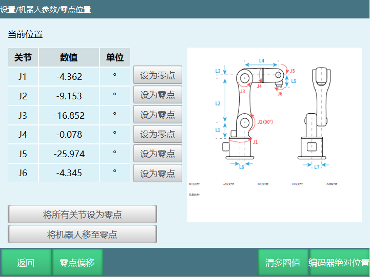

【设为零点】：点击设为零点可单独设置某个轴的零点位置。

【将所有关节设为零点】：点击此按钮可修改所有轴的零点位置。

【将机器人移至零点】：示教模式下上使能点击此按钮机器人移至零点位置。

#### 零点偏移

零点偏移可以在用户需要调整零点时使用，手动输入数值。

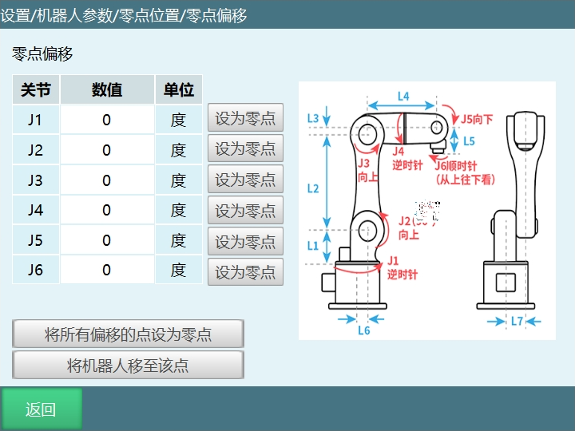

【设为零点】：单独调整某个轴的零点位置，选中需要调整零点位置的轴手动输入值，点击此按钮，然后点击此界面的【返回】进入零点位置界面，点击对应轴的【设为零点】零点位置被修改。

【将所有偏移的点设为零点】：调整所有轴的零点位置，手动输入数值后点击此按钮，然后点击此界面的【返回】进入零点位置界面，点击【将所有关节设为零点】所有轴的零点位置被修改。

【将机器人移至该点】：示教模式下上使能，点击此按钮，机器人运动到零点位置。

#### 清多圈值

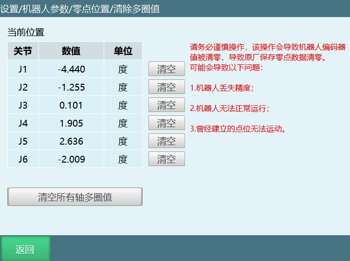

多圈值就是伺服电机圈数。

清空：清除某个轴的多圈值。

清空所有轴多圈值：清空所有轴的多圈值。

#### 编码器绝对位置

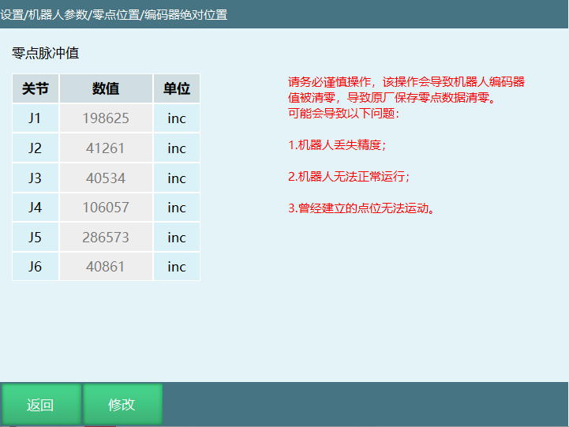

| 警告信息 |
| :--- |
|   请务必谨慎操作，该操作会导致机器人编码器值被清零，导致原厂保存的零点数据清零！  可能会导致以下问题：  1. 机器人丢失精度；  2. 机器人无法正常运行；  3. 曾经建立的点位无法运行。 |

**零点丢失如何找回？**

前置条件：

1.  机器人只是因为操作失误导致零点丢失，发生碰撞无法找回。
2.  记录未丢失零点前单圈值数据（没有清多圈值时，单圈值界面显示的数值为上次零点标定时的数据）。

操作步骤：

1.  找到丢失零点前记录的单圈值备用。
2.  将机器人示教到机械零点位置。
3.  清机器人所有轴多圈值（此操作会清除多圈值、单圈值，请谨慎操作）。
4.  标定机器人所有轴零点。
5.  在单圈值界面输入记录的单圈值数据。
6.  操作机器人回零，确认零点是否正确。

## 运动参数

## 点动参数

路径：设置-运动参数-点动参数

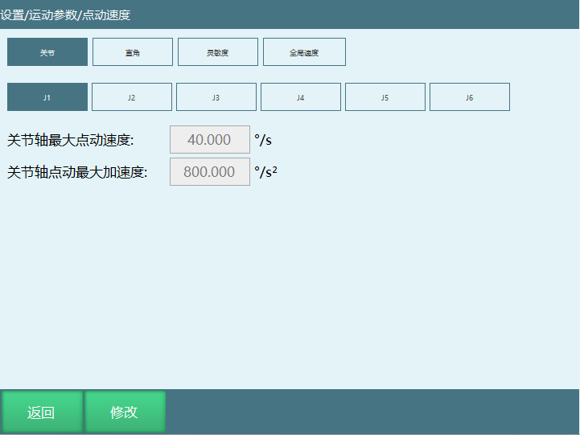

关节最大点动速度：关节坐标下点动机器人时的最大速度=关节轴最大点动速度\*全局速度（示教器上方状态栏速度）

直角最大点动速度：直角坐标下点动机器人时的最大速度=直角最大点动速度\*全局速度（示教器上方状态栏速度）

点动灵敏度：上电后，机器人抖动范围大于点动灵敏度时点动操作无效。

全局速度：范围【1,100】，用户可以自己定义每段速度。

说明：速度是逐级增加；用户可以自定义每段速度的名称；最多支持添加20段速度。

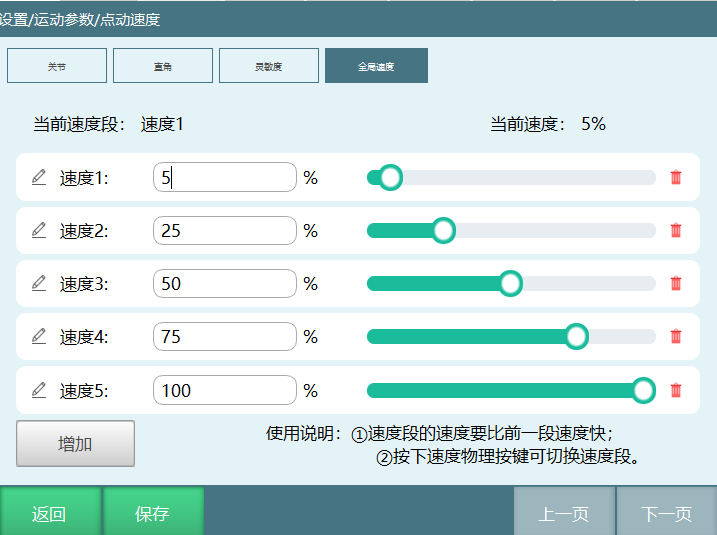

## 通用运动参数

路径：设置-点动参数-通用运动参数

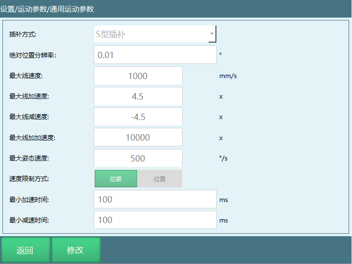

1.  机器人插补方式：S型插补、梯形插补、加加速度插补。
2.  绝对位置分辨率：运行点位时2个点相差小于分辨率时，当成1个点执行。
例如：设置分辨率为0.01，GP0001关节点位(10，0，0，0，0，0)；GP0002关节点位(10.001，0，0，0，0，0)，当运行这两个点位时，会被当成一个点执行。
3.  最大线速度：此处填写的速度值会影响线速度的范围，如果最大速度填写的是2000，那在插入一条直线指令时速度参数最大范围会变为2000
最大线加速度：最大线速度的倍数，目标加速度越大，更快的达到目标线速度。
5.  
6.  最大线加加速度：最大线速度的倍数，目标加加速度越大，更快的达到目标线速度。
7.  最大姿态速度：机器人运动时ABC轴的最大速度，超过会限速。
8.  速度限制方式：位姿、位置

位姿：运动时要考虑位置及姿态，位置的速度和姿态的速度都不会超过最大限速。

位置最大限速：指令速度\*全局速度

姿态最大限速：指令速度\*全局速度/笛卡尔最大线速度\*最大姿态速度

位置：限制直线运动最大速度，姿态运动最大速度不限制。

9.  最小加速时间：最小加速度时间指的是机器人从静止状态加速至目标速度所需的最短时间，或者从一个较低的速度加速至较高的速度所需的时间。在实际应用中，这通常受到机器人驱动系统的限制，比如伺服电机的扭矩和功率。快速加速可能会导致电机过载或产生过多的振动和噪音，从而降低机器人的寿命或造成不稳定的运动。
10. 最小减速时间：最小减速度时间则指的是机器人从最高速度减速至静止状态，或者从较高速度减速至较低速度所需的最短时间。这同样受到驱动系统能力的约束，尤其是在高速减速时，电机需要处理反向扭矩并可能需要进行能量回收或消耗，以避免过电压或过热。在某些情况下，如果减速度过快，还可能触发安全机制，如急停系统。

在机器人运行中的作用：

- 响应性：在需要快速响应的应用中，如避障或抓取不稳定对象，最小化这些时间可以提升机器人的反应速度。

- 安全性：控制加速度和减速度可以减少因突然变化引起的冲击，保护机器人本身及其周围环境的安全。

- 精度：在精密操作中，适当的加速度和减速度可以提高定位精度，避免因惯性引起的误差。

- 能源效率：优化这些参数可以减少能量消耗，尤其是在频繁启动和停止的应用中。

- 平滑性：通过控制加减速时间，可以减少运动过程中的冲击，使得机器人动作更加平滑，减少对结构的应力。

- 在实际应用中，机器人控制器会根据运动规划、负载情况以及安全要求来动态调整加速度和减速度时间，以达到最佳的运动效果。

## 其它参数

路径：设置-运动参数-其它参数

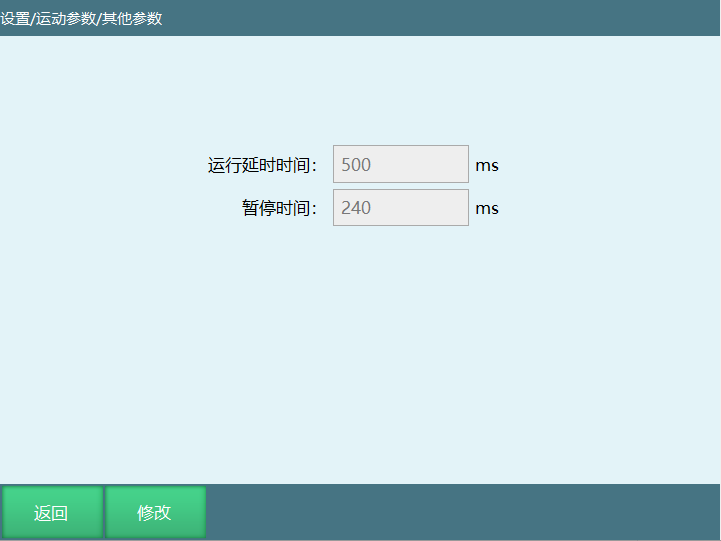

1.  运行延时时间：程序启动时的延时时间。
例如：设置的延时时间是1000ms,点击启动按钮延时1000ms后程序开始运行。
2.  暂停时间：程序从运行到到暂停所用的时间。
例如：设置的暂停时间是500ms,在程序运行中点击暂停按钮或者其它方式让机器人停止运动的时间为500ms。
最佳的运动效果。

## 从站配置

## 从站列表

路径：设置-从站配置-从站列表

从站列表界面显示当前当前连接的各类从站的型号，例如伺服型号、IO型号。

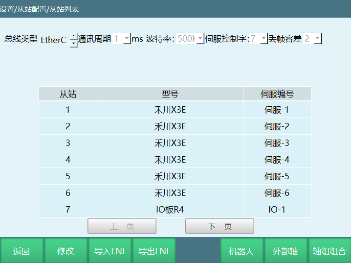

【导入ENI】:导入目标eni文件

说明：第一次导入eni时需要在U盘根路径下新建一个eni文件夹（文件夹名称en-i月-日），然后将eni文件放入文件夹里

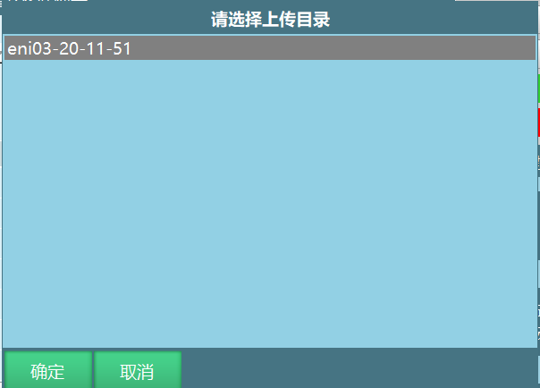

点击确定，出现如下图所示的弹窗，选择需要的ENI文件，点击确定，ENI文件导入成功后，重启系统。

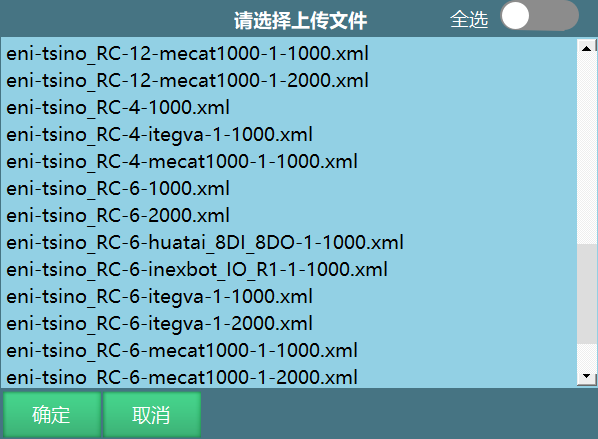

【导出ENI】：将U盘插在示教器USB口，点击【导出ENI】，可选择导出当前eni和导出所有eni，ENI文件导出成功后存入U盘根路径，文件夹命名方式：eni+具体日期，如下图所示。

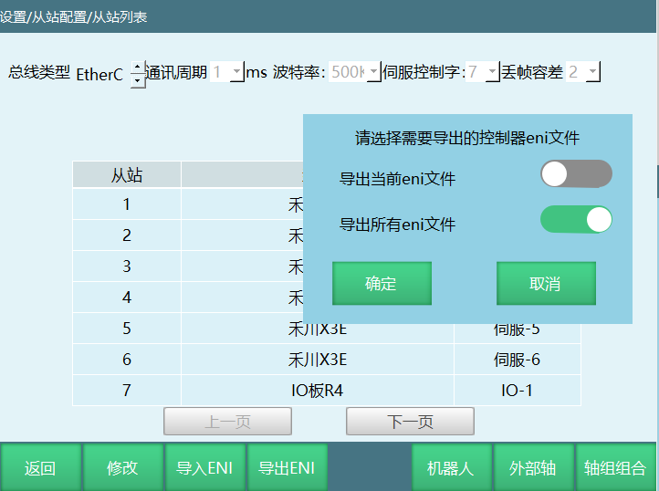

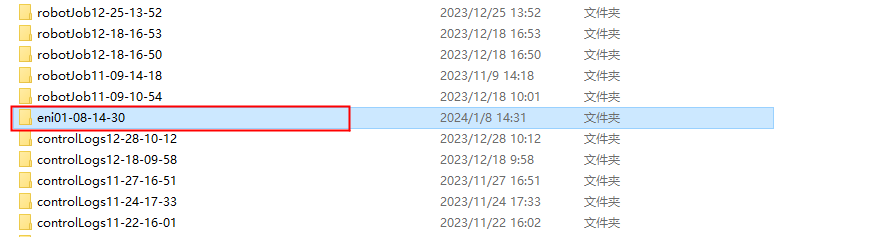

【机器人】：点击机器人进入机器人配置界面，在此界面可以修改机器人数目和机器人类型。

【外部轴】：点击【外部轴】进入外部轴配置界面，在此界面可以配置外部轴组数目和外部轴类型。

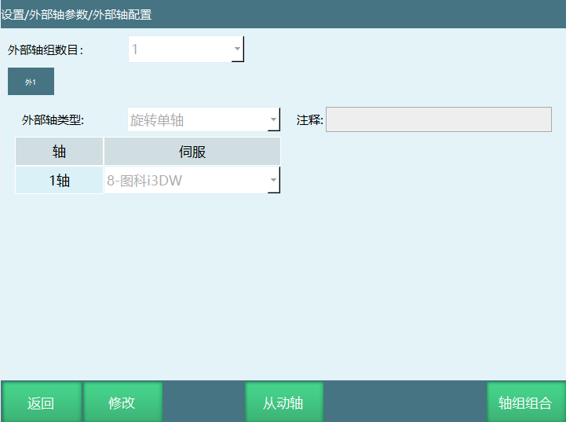

【轴组组合】：点击【轴组组合】进入轴组组合配置界面，在此界面可以选中外部轴类型

## 从站参数

路径：设置-从站配置-从站参数

如下图所示是德创伺服参数界面。

说明:不是所有伺服都支持在此界面修改读取参数。

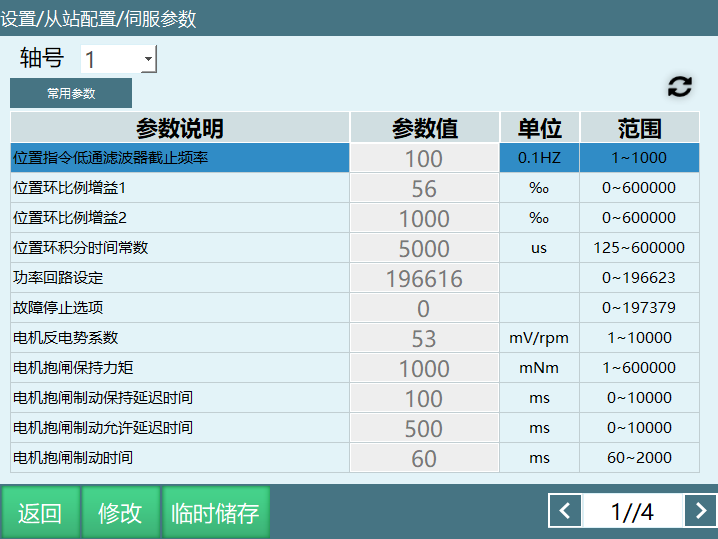

| 警告信息 |
| :--- |
|   请慎重修改，修改后人员请在安全区域进行测试！ |

## 伺服设定

路径：设置-从站配置-伺服设定

检测周期：多久检测一次三个参数有没有异常

跟踪误差：指在电机运动过程中，从开始运动到实际位置的时间段内的位置命令与实际位置的差值。目标位置和实际位置的差值叫做跟随误差。

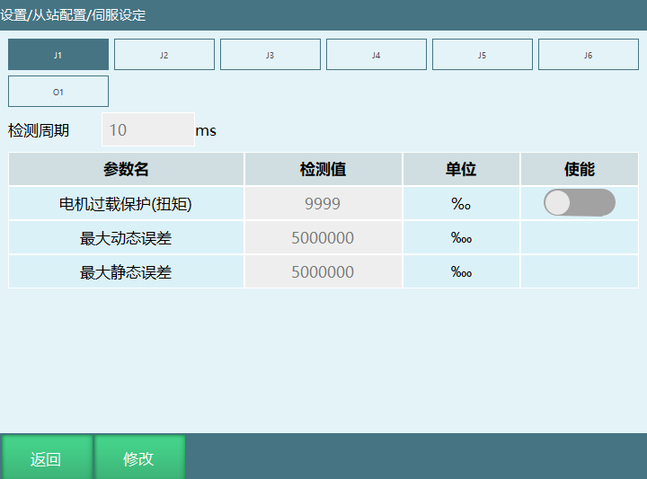

电机过载保护：该界面设置电机扭矩过载的阈值，单位mNm和‰（根据设置-维护模式-参数选择界面的电机负载参数单位设置而决定）。

电机过载保护使能：电机过载保护开关，开启之后生效。

注：可以在监控界面查看当前扭矩和最大扭矩。

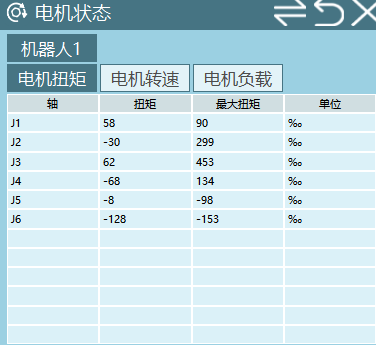

### 

## 功能参数

## 后台任务

路径：设置-功能参数-后台任务，后台任务分为全局后台和局部后台。

### 局部后台

【返回】：点击"返回"退出后台任务界面。

【新建】：点击"新建"，可以新建程序或者文件夹，选择想要新建类型程序/文件夹，然后在名称框输入名称后点击【确定】，程序/文件夹建立成功。

【打开】：选中作业文件点击"打开",打开后可以对当前作业文件插入指令，修改指令，删除指令等操作。

说明：如果打开的是文件夹可以在文件夹里面新建程序

【操作】：选中的作业文件可以进行批量模式/单行模式操作，例如移动、复制、删除等操作。

说明：如果选中的是文件夹点击操作只有复制、删除、重命名，批量删除操作，选中程序点击操作会有移动、复制、删除、重命名，批量删除和加密操作

运行局部后台程序：

1.  示教模式下单步运行后台程序；
2.  前台调用后台程序（前台作业文件插入开启线程指令）。

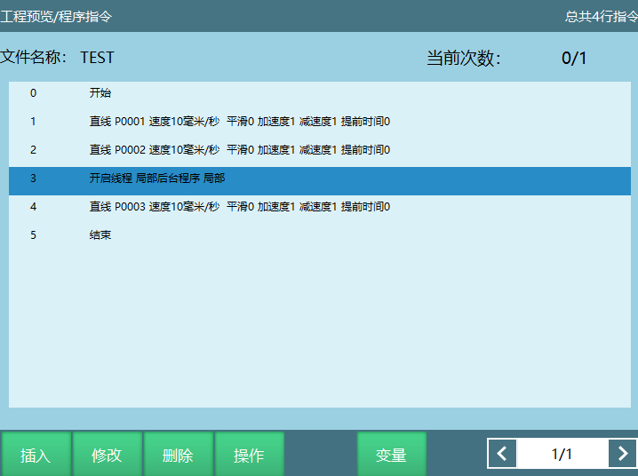

### 全局后台

【返回】：点击"返回"退出后台任务界面。

【新建】：点击"新建"，可以新建程序或者文件夹，选择想要新建类型程序/文件夹，然后在名称框输入名称后点击【确定】，程序/文件夹建立成功。

【打开】：选中作业文件点击"打开",打开后可以对当前作业文件插入指令，修改指令，删除指令等操作。

说明：如果打开的是文件夹可以在文件夹里面新建程序

【操作】：选中的作业文件可以进行批量模式/单行模式操作，例如移动、复制、删除等操作。

说明：如果选中的是文件夹点击操作只有复制、删除、重命名，批量删除操作，选中程序点击操作会有移动、复制、删除、重命名，批量删除、设为自启和加密操作

说明：选中目标程序，点击【操作】选择设为自启，在当前界面开机自启程序后面显示当前自启程序的作业文件名。

【启动】：启动设为自启后的全局后台程序。

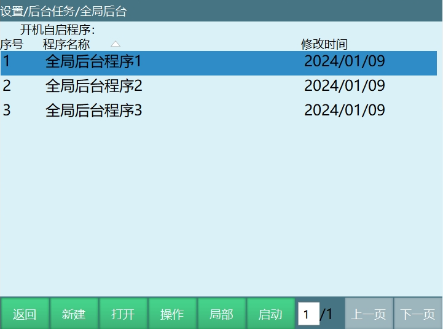

全局后台程序运行：

1.  示教器模式下单步运行；
2.  目标程序设为自启程序，开机后后台程序直接运行；
3.  前台调用后台程序（前台作业文件插入开启线程指令）。

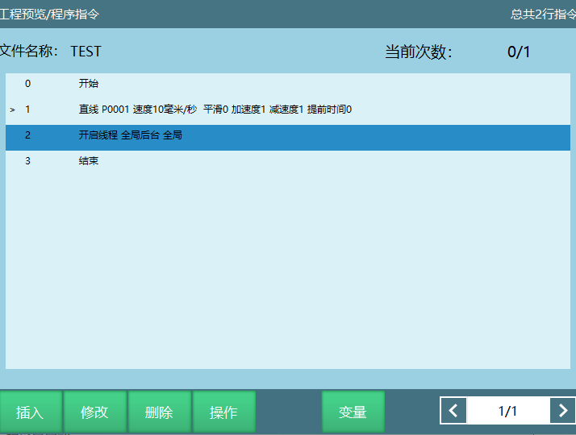

## 复位点设置

路径：设置-功能参数-复位点设置

点击示教器上的"复位"按钮机器人可以回到复位点。

点击监控-快捷键-回安全点机器人可以回到复位点。

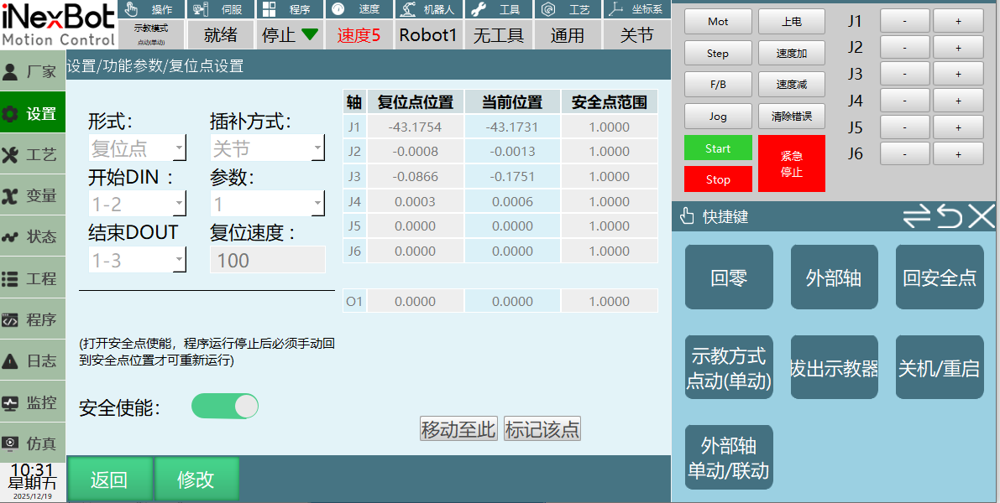

形式：复位点，复位程序：

1.  复位点：机器人移动到目标复位点位置后点击【标记该点】，点击【确定】复位点设置成功。示教模式下点击复位按钮，机器人会运动到设置的复位点位置。

如上图所示点击复位机器人运动到复位点位置（-43.1754，-0.0008，0.0866，0.0003，0，0）。

1.  复位程序：用户插入指令后点击复位开始运行复位程序。

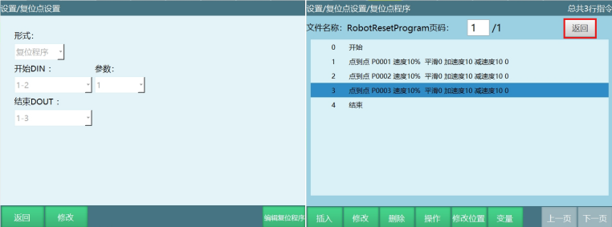

- 设置好参数，点击【编辑复位程序】；

- 插入目标指令后点击复位点程序界面的"返回"退出此界面，不点击"返回"无法退出此界面。

1.  复位点位置：记录的复位点点位。
2.  当前位置：机器人当前实际位置。
3.  安全点范围：范围\[-10,10\]，打开安全使能，运行模式下运行程序，如果当前位置不在安全点范围的话无法运行程序，需要切到示教模式手动回到安全点位置后才可重新运行程序。

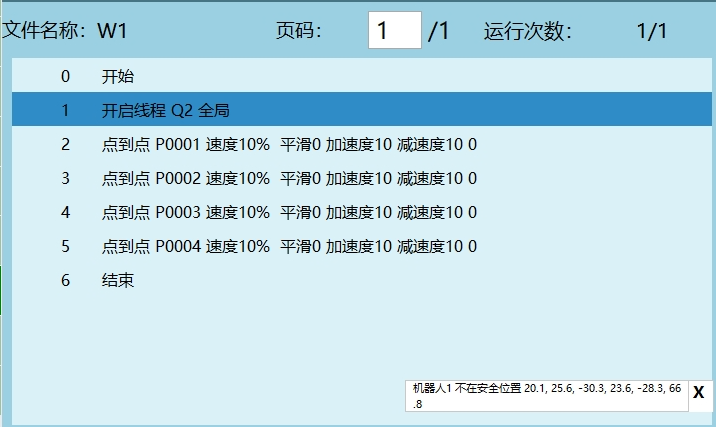

说明：示教模式和远程模式下打开安全使能对程序的运行没有影响。

1.  标记该点：机器人运动目标点位后，点击"标记该点"，点击"确定"复位点标记成功。
2.  移动至此：示教模式下点击"运动至此"机器人运动到复位点。
3.  插补方式：关节插补、直线插补。
4.  复位速度：设置复位点速度会自动计算加速度（参考指令中输入速度自动计算加速度）实际复位速度=复位速度\*全局速度。 
    当插补方式是关节插补范围1-100%；当插补方式是直线插补时范围根据笛卡尔参数确定
5.  开始DIN:设置IO输入信号，远程模式下给信号后机器人运动到复位点或者复位程序。
6.  参数：0、1(低电平启动、高电平启动)。
7.  结束DOUT:远程模式下机器人运行到复位点后信号的反馈，假设设置的输出信号为1-3，机器人运行到复位点后IO的1-3端口由低电平-高电平。

说明：IO启动复位仅支持远程模式。

## 干涉区

标定的X、Y、Z确定空间范围，以标定的空间范围为基准用户可以选择在区域内或者区域外限制机器人运动。如下图所示：

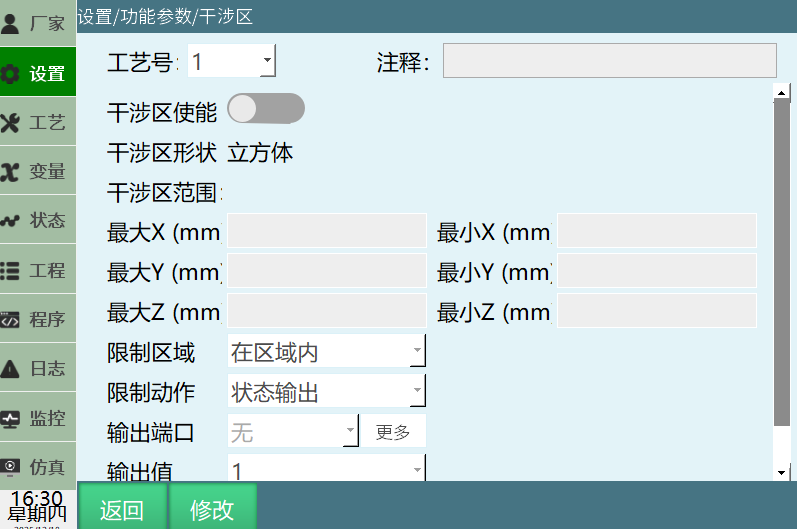

确定干涉区范围可以直接手填参数、移动机器人标定范围。

1.  手填参数；

- 点击【修改】在对应参数行填入数值；

- 打开干涉区使能，点击【保存】，干涉区范围设置完成。

2.  移动机器人标定；

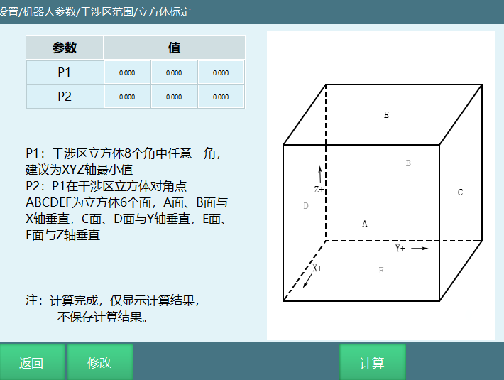

- 点击【标定】-页面跳转至标定页面；

- 在标定页面点击【修改】

- 移动机器人选中【P1】点击【标定】；

- 移动机器人选中【P2】点击【标定】；

- 点击【保存】-【计算】；

- 打开干涉区使能，点击【保存】，干涉区范围设置完成。

界面参数说明：

| 参数      | 参数说明                                                         |
| :-------- | :--------------------------------------------------------------- |
| 工艺号    | 可以选择9个工艺号，可以多个同时使用                               |
| 干涉区使能| 打开干涉区使能设置的干涉区范围才会生效                            |
| 最小X     | 运动范围X轴最小值                                                 |
| 最大X     | 运动范围X轴最大值                                                 |
| 最小Y     | 运动范围Y轴最小值                                                 |
| 最大Y     | 运动范围Y轴最大值                                                 |
| 最小Z     | 运动范围Z轴最小值                                                 |
| 最大Z     | 运动范围Z轴最大值                                                 |
| 限制区域  | 干涉区内或干涉区外                                                |
| 限制动作  | 状态输出：机器人位于干涉区内或干涉区外时触发状态输出 禁止运动：机器人位于干涉区内或干涉区外时禁止机器人运行 |
| 输出端口  | IO输出端口号或GB变量                                              |
| 输出值    | 0或1                                                              |

示例说明1（区域内禁止运动）：机器人在运行时进入干涉区报错，伺服下电，机器人停止运动。如下图：

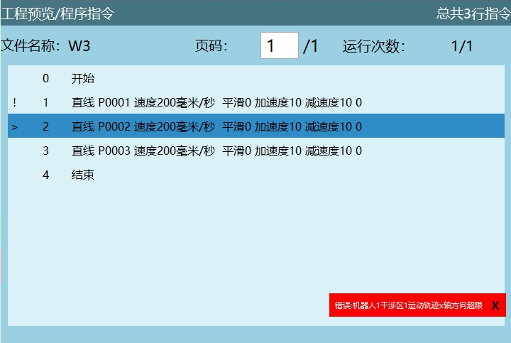

示例说明2（区域内状态输出）：机器人运动到干涉区时IO端口输出提示。详见下图：

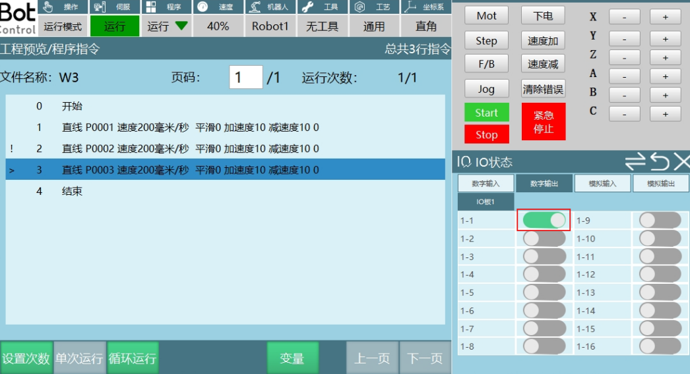

## 协作机器人

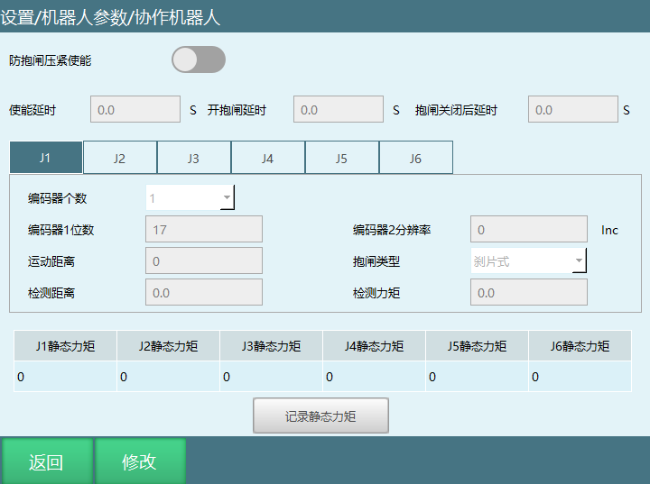

路径：设置-功能参数-协作机器人

下图界面为协作机器人参数设置界面，其他类型机器人无法进入此界面。

使能延时：按下使能键之后延时多久给伺服下发使能命令。

开抱闸延时：下发使能命令后延时多久给伺服下发开抱闸命令。

抱闸关闭后延时：抱闸关闭后延时多久伺服会响应下一步操作。

编码器个数：单关节编码器的个数。

编码器1位数：同关节参数中的编码器位数。

编码器2分辨率：单关节中另一个编码器的inc值。

运动距离：开抱闸前关节的微动距离，一般为20；该值为编码器值，单位inc。

抱闸类型：刹片式抱闸和插销式抱闸；该值为编码器值，单位inc。

检测距离：开抱闸后用于检测抱闸是否打开的关节运动距离。

检测力矩：开抱闸后关节运行检测距离过程中力矩超过检测力矩则认为抱闸打开失败。

## 子函数

详见《指令集》-子函数

## 自定义按键

路径：设置-功能参数-自定义按键

功能说明：支持用户自定义绑定按键控制机器人运动和IO端口输出

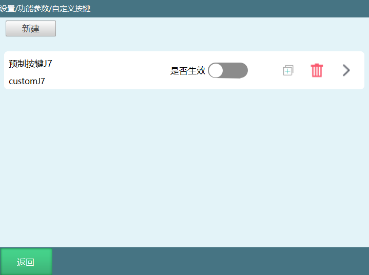

点击【新建】或者【+】进入自定义按键配置界面

是否生效：打开开关才能执行对应绑定功能

自定义按键名称：用户可以给绑定按键定义名称

注释：绑定按键说明注释

| 触发按键 | 示教器左侧：机器人按键、外部轴按键、零点按键、复位按键和拖拽按键 示教器底侧：F/B按键、V-按键、V+按键，工具按键和坐标按键 右侧：J1+键/J1-键 ------ J7+键/J7-键 | | |
| :--- | :--- | :--- | :--- |
| **触发条件** | 长按 | 范围[100,5000]ms 按键长按多少ms才能触发对应功能 | 触发：点击按键后处于一直触发状态 说明：触发端口1-1（假设端口初始状态低电平），触发按键为机器人按键，点击机器人按键端口1-1打开后一直为打开状态（高电平） 生效：点击按键功能触发，松开按键功能解除 说明：触发端口1-1（端口初始状态低电平），触发按键为机器人按键，点击机器人按键端口1-1打开（高电平），松开机器人按键1-1端口关闭（低电平） |
| | 短按 | 点击一下按键就触发对应功能 | |
| **触发功能** | IO输出 | 0：端口高电平状态点击绑定按键，端口从高电平变为低电平，选择的输出端口关闭 1：端口低电平状态点击绑定按键，端口从低电平变为高电平，选择的输出端口打开 切换：点击绑定按键后，选择的输出端口高低电平切换 | |
| | 运动到点 | 支持绑定GP点和GE点 | |

注意：同一按键插入不能存在相同的触发方式

## 程序自启动

路径：设置-功能参数-程序自启动

点击【修改】选择程序，打开程序自启动开关，开机时选中的程序自启运行。

注意：如果设置了程序自启动，每次开机时操作人员务必远离机器人。界面如下：

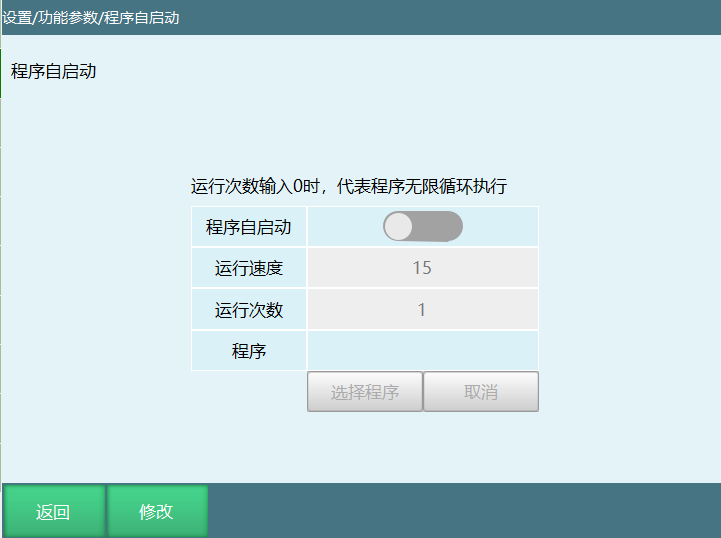

## Arch参数表

路径：设置-功能参数-Arch参数表

点击【修改】编辑垂直上升距离和垂直下降距离的值，单位mm

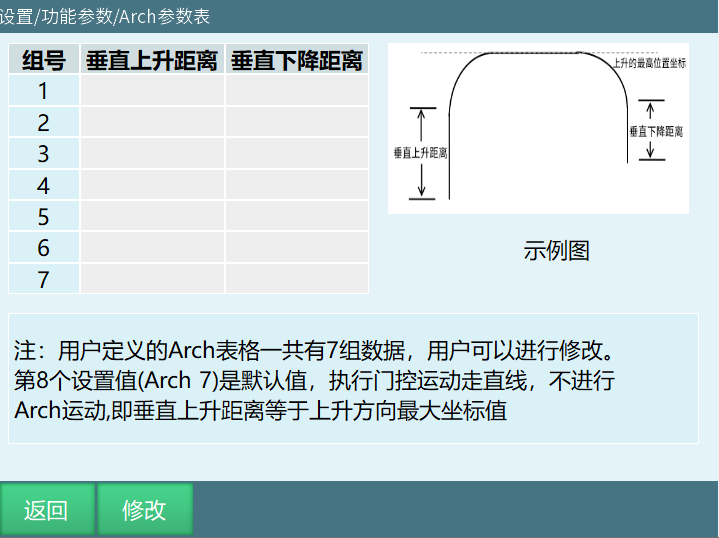

组号：Arch参数表支持7组数据

垂直上升距离：起始点垂直上升的距离，单位mm

垂直下降距离：距离目标点垂直下降的距离，单位mm

注意点：可在使用门型运动指令&扩展门型指令时直接调用该参数表

## 校准大地坐标系

路径：设置-功能参数-校准大地坐标系

功能：对照主机来校准从机的用户坐标系

注意点：

1.  两个机器人的机械臂位置十分接近从而部分工作区域可以重合

2.  在采用相对校准前，必须分别对两个机器人的工具手进行正确校准

3.  校准过程中，建议进行多个点位的校准，校准点位越多，精度越高

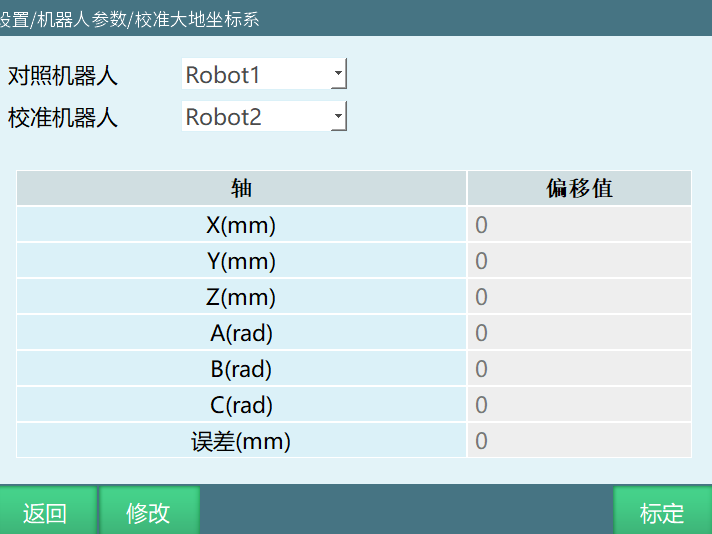

点击【修改】，在知道偏差值的情况下，可以选择手填值

点击【标定】，按照提示步骤，进行校准即可

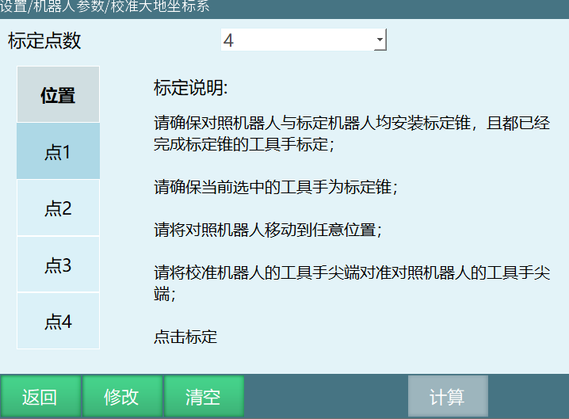

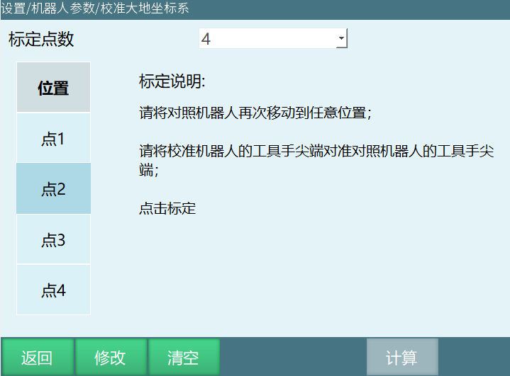

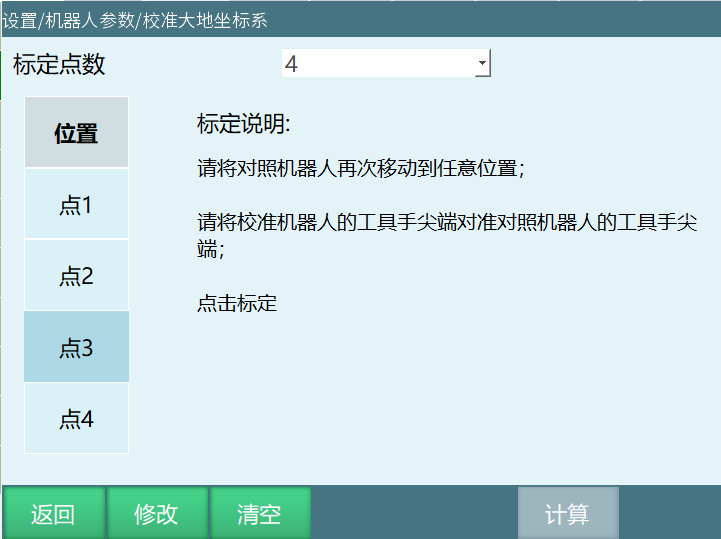

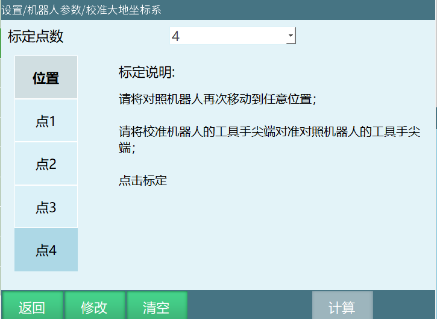

点击【保存】后，才可以点击【计算】

## AI 检索专用问答对 (Q&A for Retrieval)

**Q: 什么是编码器多圈值溢出计数功能？**

A: 编码器多圈值溢出计数功能用来消除编码器最大/最小值之间跳变产生的影响，避免机器人出现飞车现象。

**Q: 编码器值范围模式有哪些？**

A: 编码器值范围模式有两种：-180°~180° 和 0°~360°。

**Q: 什么是零点位置？**

A: 每个坐标系总有一个所有轴都为0的点，就是坐标系原点。对于关节坐标系来说，这个点叫做零点位置，也就是机器人的第1-6轴的数值均为0的位置。

**Q: 如何设置零点位置？**

A: 点击【设为零点】可单独设置某个轴的零点位置；点击【将所有关节设为零点】可修改所有轴的零点位置；点击【将机器人移至零点】示教模式下上使能机器人移至零点位置。

**Q: 什么是干涉区？**

A: 干涉区是指机器人运动范围的限制区域，通过设置干涉区可以限制机器人在特定范围内运动或触发状态输出。

**Q: 干涉区限制动作有哪些？**

A: 干涉区限制动作有两种：状态输出（机器人位于干涉区内或干涉区外时触发状态输出）和禁止运动（机器人位于干涉区内或干涉区外时禁止机器人运行）。

**Q: 如何配置自定义按键？**

A: 点击【新建】或者【+】进入自定义按键配置界面，设置触发按键、触发条件和触发功能，打开是否生效开关。

**Q: 自定义按键的触发条件有哪些？**

A: 自定义按键的触发条件有长按（范围[100,5000]ms）和短按（点击一下按键就触发对应功能）。

**Q: 自定义按键的触发功能有哪些？**

A: 自定义按键的触发功能有IO输出（端口高低电平切换）和运动到点（支持绑定GP点和GE点）。

**Q: 如何设置程序自启动？**

A: 路径：设置-功能参数-程序自启动，点击【修改】选择程序，打开程序自启动开关，开机时选中的程序自启运行。

**Q: Arch参数表支持多少组数据？**

A: Arch参数表支持7组数据，包括垂直上升距离和垂直下降距离，单位mm。

**Q: 如何校准大地坐标系？**

A: 点击【修改】，在知道偏差值的情况下，可以选择手填值；点击【标定】，按照提示步骤进行校准；点击【保存】后，才可以点击【计算】。

**Q: 不同平台备份的程序名称有什么区别？**

A: 2403及以上版本针对不同平台，控制器&示教器启动程序名称做了修改，例如C1102原程序为nrc.out/nrc2.out，现程序为C1102_X86_Linux-RT1_Robot-controller等。

## 版本历史

| 版本    | 日期         | 变更内容 | 作者       |
| :---- | :--------- | :--- | :------- |
| 1.0.0 | 2026-06-29 | 初始版本 | FDJAK |
