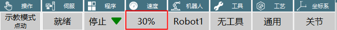

# 速度参数

说明："全局速度"表示的是示教器界面上状态栏速度。

{width="1.5811428258967628in"
height="0.14308945756780403in"}

| :--- | :--- | :--- | :--- |
| 关节点动速度 | 关节轴最大点动速度\*全局速度 |
| 直角点动速度 | 直角轴最大点动速度\*全局速度 |
| 单步关节速度 | 全局速度\*指令速度\*关节额定正速 最大速度限制：关节额定速度\*30% |
| 单步直角速度 | 全局速度\*指令速度 最大速度限制：300mm/s |
| 动态加减速 | 仅支持点到点与直线，当速度到达额定速度后无法再增大 |
| 动态加减速实际应用 | 在一条不支持动态加减速的指令运行期间修改速度，修改后的速度会被应用到下一条运动指令上 |
| 试运行速度 | 同单步指令速度 |
| 倒序速度 | 同单步指令速度 |
| 运行模式 | 点到点：最大轴速度=额定正速度\*指令速度\*全局速度                                    |
|                    | 直线：最大线速度=指令速度\*全局速度                                                  |
|                    +--------------------------------------------------------------------------------------+
|                    | 曲线：以第一条曲线速度为轨迹速度                                                     |
+--------------------+--------------------------------------------------------------------------------------+
