# T31竖版焊接示教器操作手册

## 界面基础说明

红色方框内可用手动方式点动，进行触屏操作，绿色方框内不可进行触屏操作

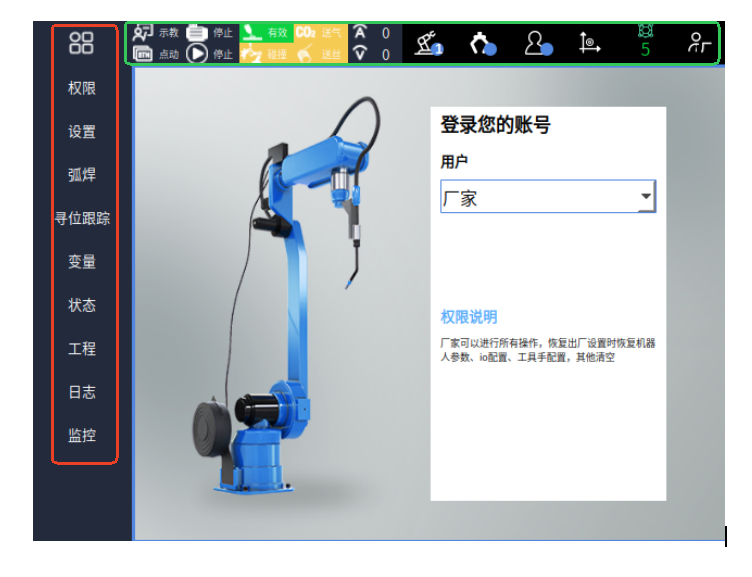

红色方框内:

1、红色方框第一个图标的功能是用于全屏展示，点击后如下图所示，再次点击可切换回非全屏

红色方框内其他功能请看其他说明文档

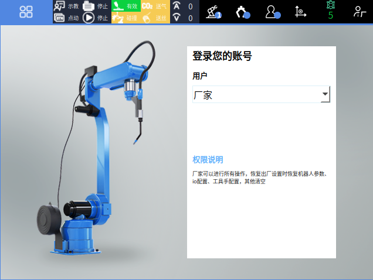

绿色方框内：

1、"示教"：示教器模式的一种，共有"示教模式、运行模式、远程模式"三种，可以通过旋钮切换

2、"点动"：点动模式，共有"拖动、点动、寸动"三种

3、"停止"：机器人状态的一种，共有"停止、就绪、运行、报错"四种模式，通过"伺服准备"按键可切换"就绪、停止"两种状态，通过上电使能按键可以进行"就绪、运行"状态的切换，伺服报错会显示"报错"

4、"停止\"：机器人运行状体，共有"停止、暂停、运行"三种状态，非运行状态显示"停止"

5、"有效"：表示焊接使能，有效时焊接使能开，背景色绿色，无效时焊接使能关，背景色红色

6、"碰撞"：表示防碰撞状态，黄色表示屏蔽防碰撞中，红色表示碰撞触发中，绿色表示未触发碰撞

7、"送气"：表示送气状态，绿色表示送气中，黄色表示未送气

8、"送丝"：表示送丝状态，绿色表示送丝中，黄色表示未送丝

9、\"A\"：A后面的数字表示当前焊接电流

10、"V"：V后面的数字表示当前焊接电压

<table border="1" style="border-collapse: collapse;">
<tr><th style="background-color: #d3d3d3; text-align: center;">编 号</th><th style="background-color: #d3d3d3; text-align: center;">图片</th><th style="background-color: #d3d3d3; text-align: center;">说明</th></tr>
<tr><td>11</td><td></td><td>表示当前选中机器人1（最多可设置4个机器人）</td></tr>
<tr><td>12</td><td></td><td>表示工具手选项（如果选了工具手1，显示数字1，当前图标是未选中工具手状态）</td></tr>
<tr><td>13</td><td></td><td>表示用户选项（如果选了用户1，显示数字1，当前图标是未选中用户状态）</td></tr>
<tr><td>14</td><td>   </td><td>表示当前选中点动坐标系，依次是关节、直角、工具、用户</td></tr>
<tr><td>15</td><td>   </td><td>表示当前速度，速度在（0-15\]时，显示绿色乌龟图标；速度在(15-80\]时，显示白色指针图标；速度在(80-100\]时，显示红色火箭图标。速度有两种显示方式，分别是"点动、定点距离"，通过组合按键"转换+高速"来弹出组件</td></tr>
<tr><td>16</td><td>   </td><td>表示当前登录用户，分表为操作员、技术员、管理员、厂家</td></tr>
</table>

## 版本升级、时间设置、IP设置、修改示教器配置、自动备份、更多设置

依次点击"设置_版本升级"等，就可进入具体设置页面

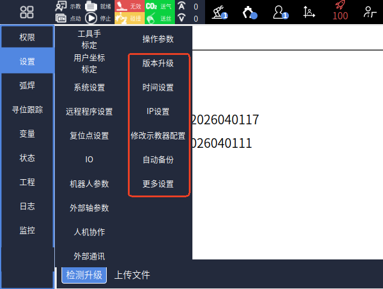

### 版本升级：

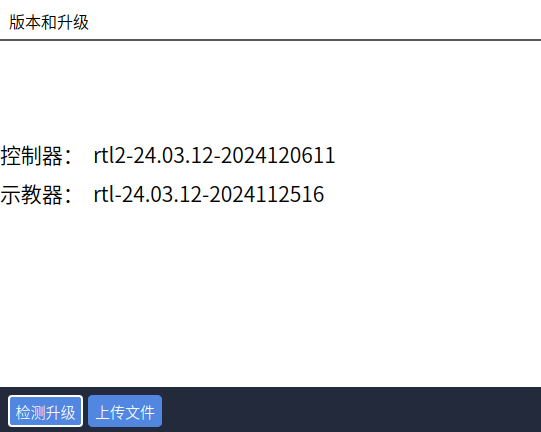

检测升级：在示教器的USB口插入U盘，在U盘根目录下放入需要升级的程序压缩包，点击"检测升级"，如下图所示会出现提示弹窗，点击"取消"会升级程序包。

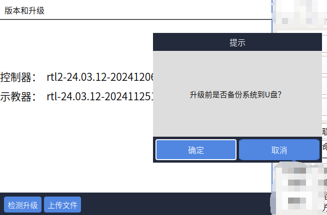

如下图所示选中程序点击升级文件界面的【确定】，点击确定后会有一个二次确认界面，再次点击【确定】后开始升级程序。

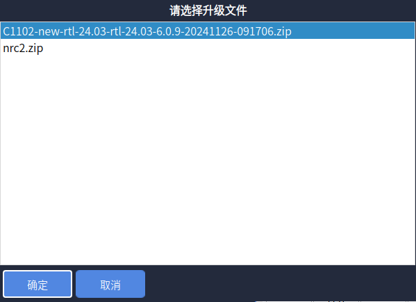

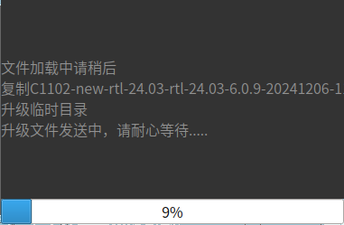

通过检测升级可以升级的文件有控制器程序，示教器程序，语言包等。

系统备份：在示教器的USB口插入U盘，在U盘根目录下放入需要升级的程序压缩包，点击"检测升级"，如下图所示会出现提示弹窗，点击"确定"会备份系统到U盘。

系统备份：

将U盘插入示教器USB口，点击设置-系统备份与还原，根据备份时当前运行的系统程序定义SystemBackup的文件名前缀为T30-1还是T30-2。nrc对应T30-1-SystemBackup，nrc2对应T30-2-SystemBackup。

1.  备份文件命名格式：Linux32-2-SystemBackup+具体日期。

如下图所示：

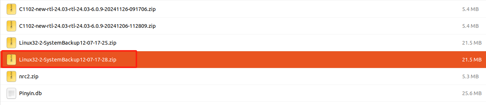

1.  备份路径：U盘根目录。

2.  备份的文件：

- 示教器备份文件：config.db；Pinyin.db；ServoError.db；TColor.db；Userdata.db；T31_ARM_Linux_Teach-pendant（示教器程序）。

- 控制器备份文件：控制器配置文件config；工艺文件craft；eni文件；作业文件job；lua文件；多语言文件msg_languages；预置参数preset；变量variant；控制器程序C1102_X86_Linux-RT_Robot-controller；userDefinedProfile.json文件

上传文件：

点击此按钮可以上传的文件有控制器语言文件（例如：俄语msg_languages_Russian.json）、控制器解密文件（initlicense.vx）、初始化文件（batchlicense.txt）、伺服参数识别（pre_servo_DYNATRON.json）。

返回：点击【返回】退出版本升级界面。

### 时间设置：

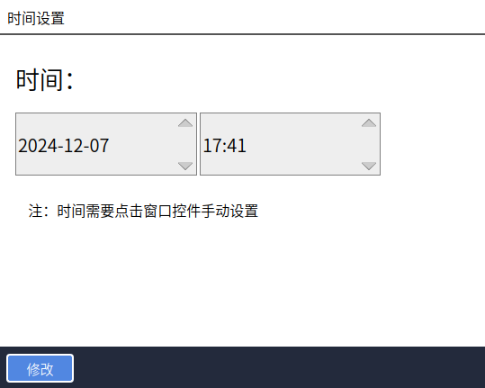

【修改】：点击【修改】按钮，设置年、月、日、小时、分钟。

如何修改日期：（以修改"年份"为例，其他月、日、具体时间的修改方法一样）

- 进入时间设置页面后点击【修改】

- 按照第一步，选中"年份"

- 第二步，上下选择至需要修改的年份

- 第三步，点击保存

修改时间：

【修改】点击后变为【保存】，【保存】状态时点击后变为【修改】

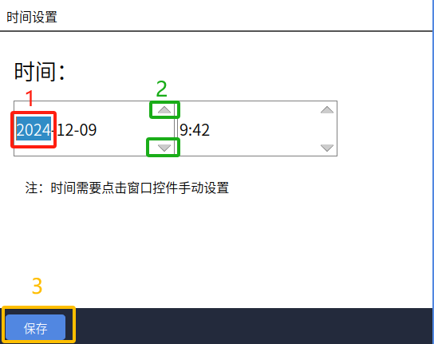

### IP设置 ：

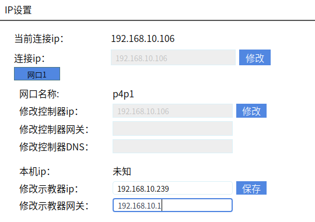

修改IP的具体步骤如下：

1.  修改IP前记录好新的IP地址。

2.  点击"连接IP"、"修改示教器IP"、"修改示教器网关"对应的【修改】按钮。

3.  输入框里输入新的IP地址，点击【保存】，示教器IP点击保存后重启系统生效，连接IP和控制器IP点击【保存】立即生效。

注意：

- 在非必要情况下请不要修改IP，以免造成使用故障。

- 若修改控制器IP为非默认值（192.168.1.13），请自行记录好该控制器的IP。

修改示教器配置

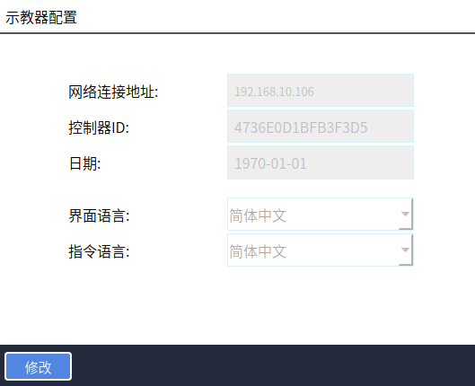

1.  界面语言：切换示教器的界面语言，例如切换界面语言为俄语、韩语、泰语等其它语言，界面语言如何切切换请查看《多语言功能手册》。

2.  指令语言：指令语言只有当前界面语言和英语，例如当前界面语言是韩语，指令语言为韩语和英语。

### 自动备份：

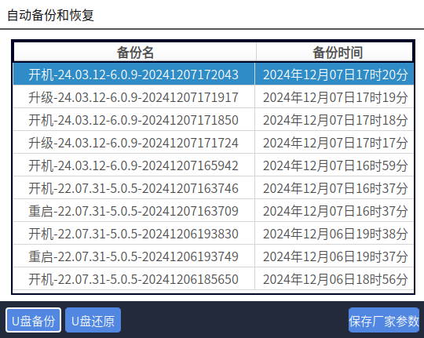

1、控制器自动备份功能：

- 备份内容：程序、参数。

- 备份个数：最大10个。

- 备份命名：按前提、版本、时间命名。如2024年12月9日10点36分修改参数，备份名"参数-22.08-5.8.0-20241209103650

- 触发备份的前提：开机、修改参数、修改程序、升级。

  2、备份频率：

<!-- -->

- 开机时确认版本、参数正常后备份一次；

- 修改参数后5分钟内没有再次修改参数备份一次；

- 修改程序（插指令、修改指令）后5分钟内没有再次修改备份一次；升级前备份一次。

U盘备份：

步骤：将U盘插入示教器USB口，点击U盘备份，根据备份时当前运行的系统程序定义SystemBackup的文件名前缀为'Linux32-2\'

备份文件命名格式：Linux32-2-SystemBackup/Linux32-2-SystemBackup+具体日期。

如下图所示：

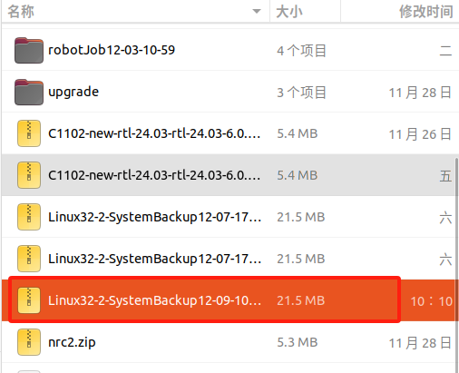

备份路径：U盘根目录。

备份的文件：

- 示教器备份文件：config.db；Pinyin.db；ServoError.db；TColor.db；Userdata.db；T31_ARM_Linux_Teach-pendant（示教器程序）。

- 控制器备份文件：控制器配置文件config；工艺文件craft；eni文件；作业文件job；lua文件；多语言文件msg_languages；预置参数preset；变量variant；控制器程序C1102_X86_Linux-RT_Robot-controller；userDefinedProfile.json文件

U盘还原：

先获取系统当前运行的程序信息，对比备份系统文件的文件名。当前运行的系统与备份系统文件名匹配时，则允许系统还原，反之则不允许系统还原。

U盘插入示教器USB口，点击系统还原，选择系统还原文件，上传成功后重启示教器。

保存厂家参数：

保存厂家参数后在恢复出厂设置中即可恢复出厂时的机器人参数、IO以及工具手配置，此按钮只在厂家权限下显示。

###2.5. 更多设置：

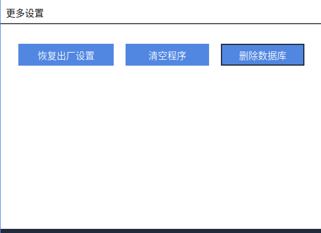

恢复出厂设置

如下图所示，用户可以根据自己的需要选择清除的配置文件。

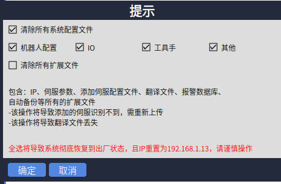

恢复出厂设置时需要谨慎请操作！请一定要在执行本操作之前备份所有参数以及程序文件！

步骤如下：

1.  进入设置-系统设置-更多设置界面；

2.  点击【恢复出厂设置】按钮，在弹出的提示窗中有两种选择，清除系统配置文件和所有扩展文件。选择需要清除的配置文件类型；

3.  点击【确定】按钮后继续点击二次确认框【确定】，选择的配置文件被恢复出厂设置。

清空程序

选择清空程序，点击【确定】程序清空成功后创建的作业文件被清空。

谨慎操作，程序被清空后无法恢复 ！

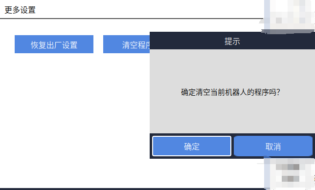

删除数据库

如下图所示，删除数据库步骤：

1.  点击【确定】删除config.db文件；

2.  重启示教器后会重新生成一份新的config.db文件。

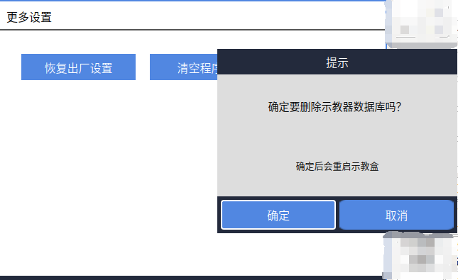

## 外部轴参数

依次点击"设置_外部轴参数"进入外部轴参数设置页面，共有外部轴标定、零点位置、关节参数、点动速度等四大功能

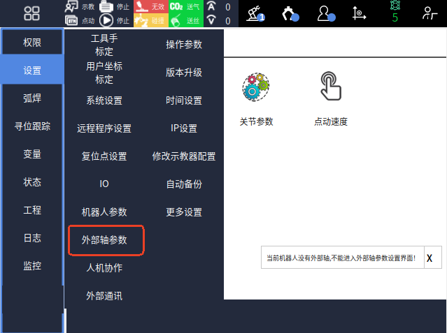

外部轴介绍：

外部轴是指除去机器人本体的轴，为了工作需要所以再加上的轴，如地轨、翻转台、旋转台。被用于喷涂，焊接，切割等行业。

外部轴类型：

1.  直线单轴

将机器人安装于地轨上，并通过外部轴功能控制地轨滑动来实现机器人的单个方向的长距离移动，可以实现大范围，多工位工作。

1.  直线双轴

将机器人安装于地轨上，并通过外部轴功能控制地轨滑动来实现机器人的同时两个方向的长距离移动，可以实现较大范围，多工位工作。

1.  直线三轴

将机器人安装于地轨上，并通过外部轴功能控制地轨滑动来实现机器人的同时三个方向长距离移动，可以实现更大范围，多工位工作。安装结构如图所示：

1.  旋转单轴

可分为：翻转轴或旋转轴

翻转轴：将翻转台独立于机器人本体，通过外部轴的功能控制翻转到特定的角度，更加利于对工件的某一个面进行加工，主要应用于焊接、切割、喷涂等方面。如在喷涂行业中，通过翻转台翻转实现对工件的上下表面的喷涂。

旋转轴：将旋转台独立于机器人本体，通过外部轴的功能控制旋转轴，在进行焊接操作时随着外部轴的转动进行工件的焊接。

1.  旋转双轴

将旋转轴与翻转轴相结合使用。

### 外部轴标定：

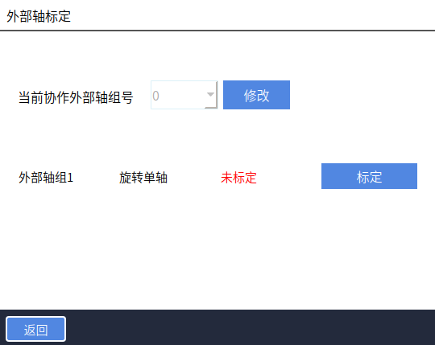

外部轴连接成功后就可以进行外部轴标定了。

当前协作外部轴组号：范围1-3，当外部轴类型为旋转单轴或者旋转双轴时需要设置协作组号，否则外部轴直线，外部轴圆弧指令无法运行，当外部轴类型为直线轴时不需要选择协作组号。

标定：点击对应外部轴组的标定按钮，进入标定界面。

旋转单轴标定

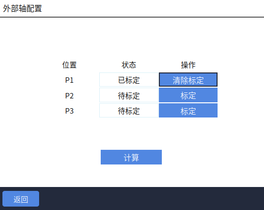

1.  外部轴回零点，并在平台上找一点作为基准点A；

2.  将外部轴正方向转动100度，此时A为P1，将机器人末梢移动到P1点，标定P1；

3.  将外部轴反方向转动50度，此时A为P2，将机器人末梢移动到P2点，标定P2；

4.  将外部轴回零，此时A为P3，将机器人末梢移动到P3点，标定P3；

5.  点击计算。

翻转单轴标定

1.  外部轴回零点，并在平台上找一点作为基准点A；

2.  将外部轴正方向转动50度，此时A为P1，将机器人末梢移动到P1点，标定P1；

3.  将外部轴反方向转动25度，此时A为P2，将机器人末梢移动到P2点，标定P2；

4.  将外部轴回零，此时A为P3，将机器人末梢移动到P3点，标定P3；

5.  点击计算。

旋转双轴标定

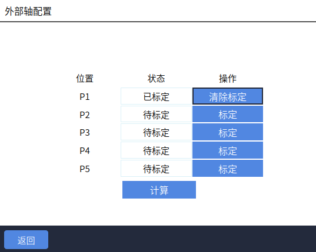

外部轴标定界面如图所示。

标定步骤：

1.  外部轴回零点，并在旋转台上找一点作为基准点A；

2.  P1：外部轴回零，此时基准点A如图P1，将机器人末梢移动到P1，标定P1；

3.  P2：外部轴2轴-方向转动50度左右，此时基准点A如图P2，将机器人末梢移动到P2，点击标定；

4.  P3：外部轴2轴+方向转动100度左右，此时基准点A如图P3，将机器人末梢移动到P3，点击标定；

5.  P4：将外部轴1轴正方向转动25度左右，此时基准点A如图P4，将机器人末梢移动到P4，点击标定；

6.  P5：再次将外部轴1轴正方向转动25度左右，此时基准点A如图P5，将机器人末梢移动到P5，点击标定；

7.  点击计算。

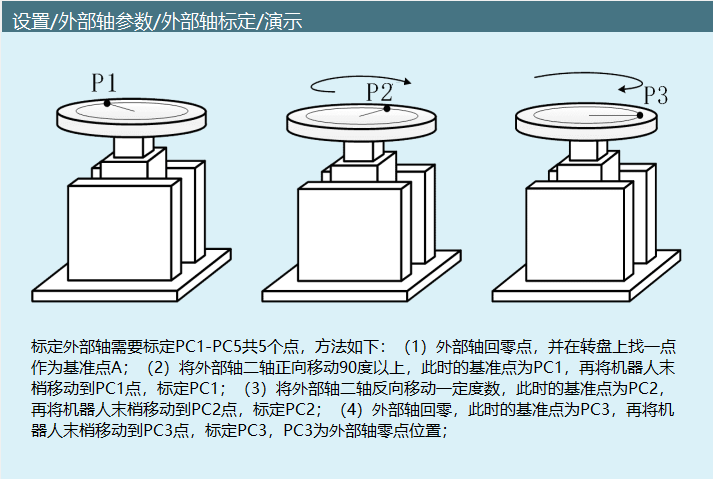

直线单轴标定

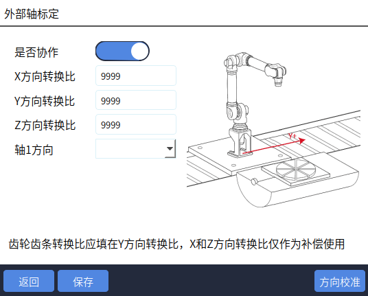

1.  X方向转换比：减速机输出端转一圈时，直线单轴X方向移动的距离

计算方式1：先将转换比的值填1，然后测量减速机输出端转一圈时，直线单轴X方向行走的长度，再将量出值重新填入转换比；

计算方式2：直线单轴X方向行走的长度（齿数\齿距），将计算出的值重新填入转换比；

1.  Y方向转换比：减速机输出端转一圈时，直线单轴Y方向移动的距离

略，计算方式可参考【X方向转换比】

1.  Z方向转换比：减速机输出端转一圈时，直线单轴Z方向移动的距离

略，计算方式可参考【X方向转换比】

1.  轴方向：直线单轴的运动方向：X、Y、Z三个方向，只能选择其一

2.  当轴方向选择完成以及转换比修改完成，打开协作使能开关即认为已标定

直线双轴标定

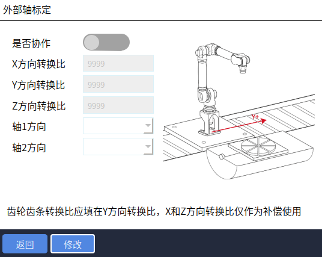

略，可参考直线单轴标定

注意：轴方向：直线双轴的运动方向：X、Y、Z三个方向，只能选择其二，且不可以重复设置

直线三轴标定

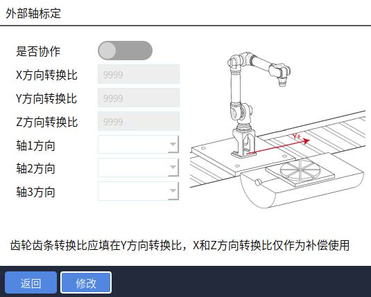

略，可参考直线单轴标定

注意：轴方向：直线三轴的运动方向：X、Y、Z三个方向，都是必选项

方向校准

由于安装地轨和机器人时会存在误差，会使地轨的方向与机器人直角坐标系的下方向存在偏差，便可以通过标定计算出来的比例系数进行方向校准

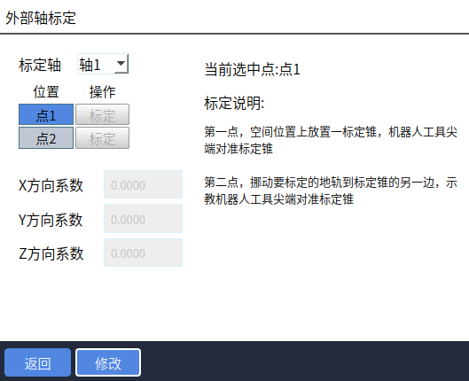

1.  该功能仅使用【协作】时，方可使用

2.  标定轴1的第一个点：在空间位置上放置一标定锥，将机器人的工具手的尖端对准标定锥

3.  标定轴1的第二个点：挪动需要标定的地轨至标定锥的另一端，将机器人的工具手的尖端对准标定锥

4.  点击【计算】，便可以计算出X、Y、Z三个方向的比例系数

5.  点击【保存】即可

注意：直线单轴需要标定一个轴，直线双轴则需要标定两个轴，直线三轴是三个轴都需要标定

### 零点位置：

零点标定

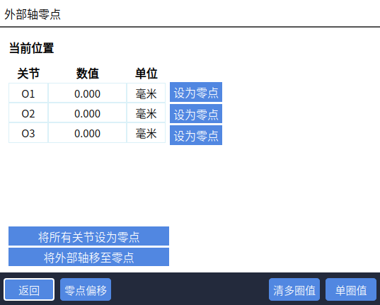

零点位置设定如图所示。

外部轴点位都为零的位置，用户可以自己设置外部轴零点位置。

1.  设为零点：将选中的某个轴的位置设为零点。

2.  将所有关节设为零点：将外部轴所有轴的位置设置为零点。

3.  将外部轴移至零点：示教模式下上使能，点击【将外部轴移至零点】，外部轴运动到零点位置。

零点偏移

零点偏移可以在用户需要调整零点时使用，手动输入数值，操作方式与零点标定类似。

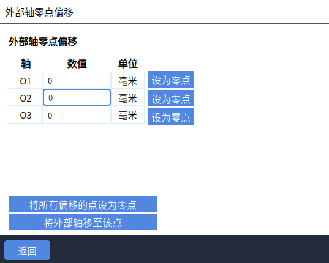

零点偏移设定选项如图所示。

1.  设为零点：单独调整某个外部轴的零点位置，选中需要调整零点位置的外部轴手动输入值，点击【设为零点】，然后点击此界面的【返回】进入零点位置界面，点击对应轴的【设为零点】零点位置被修改。

2.  将所有偏移的点设为零点：调整所有外部轴的零点位置，手动输入数值后点击【将所有偏移的点设为零点】，然后点击此界面的【返回】进入零点位置界面，点击【将所有关节设为零点】零点位置被修改。

3.  将外部轴移至该点：示教模式下上使能，点击将外部轴移至该点，外部轴运动到零点位置。

清多圈值

多圈值就是伺服电机的圈数。

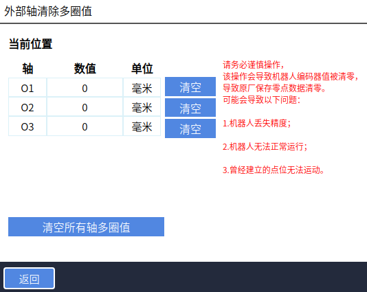

如图，清多圈值界面中有几个选项，选项的解释如下：

清空：清除某一个外部轴的多圈值。

清空所有轴多圈值：清空所有外部轴的多圈值。

<table border="1" style="border-collapse: collapse; width: 100%;">
<tr><td style="text-align: center; padding: 8px;"></td></tr>
<tr><td style="vertical-align: middle; padding: 8px;">
请务必谨慎操作，该操作会导致机器人编码器值被清零，导致原厂保存的零点数据清零！
  
可能会导致以下问题：
 - 机器人丢失精度；
 - 机器人无法正常运行；
 - 曾经建立的点位无法运行。
</td></tr>
</table>
单圈值

单圈值是根据分辨率与旋转角度在一圈内得出的脉冲数。

修改单圈值后点击保存会修改角度值。

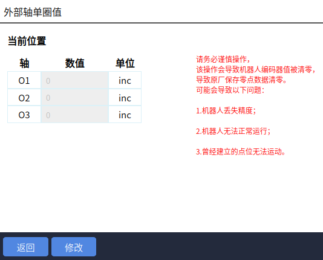

<table border="1" style="border-collapse: collapse; width: 100%;">
<tr><td style="text-align: center; padding: 8px;"></td></tr>
<tr><td style="vertical-align: middle; padding: 8px;">
请务必谨慎操作，该操作会导致机器人编码器值被清零，导致原厂保存的零点数据清零！
  
可能会导致以下问题：
 - 机器人丢失精度；
 - 机器人无法正常运行；
 - 曾经建立的点位无法运行。
</td></tr>
</table>

### 关节参数：

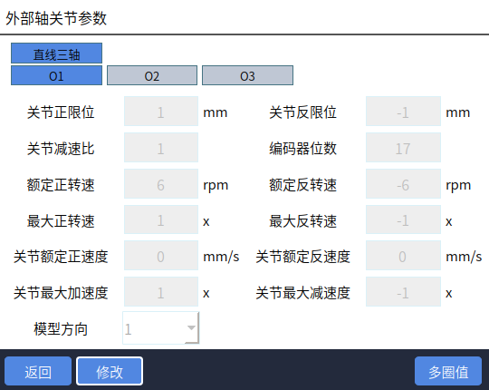

1.  关节正限位：机器人正方向旋转的角度或移动的距离，运动时超过限位会报错（机器人点动位置到达极限）。

2.  关节反限位：机器人反方向旋转的角度或移动的距离，运动时超过限位会报错（机器人点动位置到达极限）。

3.  关节减速比：减速机的减速比。

4.  编码器位数：填写当前所使用的编码器位数，注意不要随便填写，否则在点动机器人时飞车。

5.  额定正转速：电机正方向能够运行的转速。

6.  额定反转速：电机反方向能够运行的转速。

7.  最大正转速：例如1倍时从0速到达额定正速度时间为10秒，那么2倍就是5秒到达额定正速度。

8.  最大反转速：例如1倍时从0速到达额定反速度时间为10秒，那么2倍就是5秒到达额定反速度。

9.  关节额定正速度：机器人关节额定正方向速度，关节额定正速度计算方法：额定正转速\360/60/减速比。

10. 关节额定反速度：机器人关节额定反方向速度，关节额定反速度计算方法：额定反转速\360/60/减速比。

11. 关节最大加速度：例如1倍时从0速到达最大加速度时间为10秒，那么2倍就是5秒到达最大加速度。

12. 关节最大减速度：例如1倍时从0速到达最大减速度时间为10秒，那么2倍就是5秒到达最大减小速度。

13. 模型方向：模型方向可参照零点位置界面关节正方向示意图设置，各轴点动"+"键应与关节正方向示意图方向相同，相同选1，相反选-1。

多圈值

点击【设置】-【外部轴参数】-【关节参数】进入关节参数界面，点击【多圈值】修改编码器的范围。

编码器多圈值溢出计数功能：该功能用来消除编码器最大/最小值之间跳变产生的影响。

例如编码器多圈值范围为\[-2147483648,2147483647\]，当前编码器多圈值位置为2147483647，则再往正方向转1个单位则为-2147483648，如系统不知道编码器多圈值范围则会认为机器人突然跳变，并不会知道实际只转了1个单位，此时则容易出现飞车现象。

<table border="1" style="border-collapse: collapse; width: 100%;">
<tr><td style="text-align: center; padding: 8px;"></td></tr>
<tr><td style="vertical-align: top; padding: 8px;">
必须填写该参数，不填写可能出现以下问题：
  
1. 点位出现较大跳变，例如突然从4度变为40度。
  
2. 飞车。
  
若配置从动轴，则从动轴的编码器最大/最小值也要填写！
</td></tr>
</table>
点动速度：

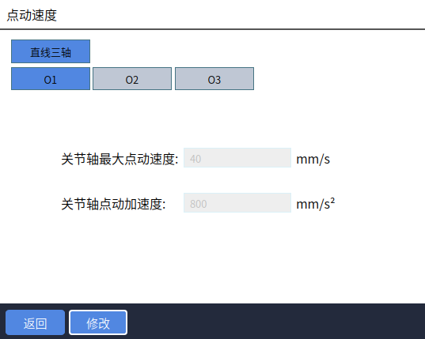

如图所示为点动速度界面，名词解释如下：

关节轴最大点动速度：点动外部轴时的速度，外部轴为旋转轴时单位为°/s,外部轴为直线轴时单位为mm/s。

外部轴点动速度计算方法：关节轴最大点动速度\全局速度（此处的全局速度表示示教器上方状态栏速度）。

关节轴点动加速度：略。

##  机器人参数

依次点击"设置_机器人参数\"，进入机器人参数页面，具体有"干涉区范围、零点位置、DH参数、关节参数、笛卡尔参数、点动速度、运动参数、从站配置、伺服参数、跟随误差、协作机器人、点击过载保护"等功能。

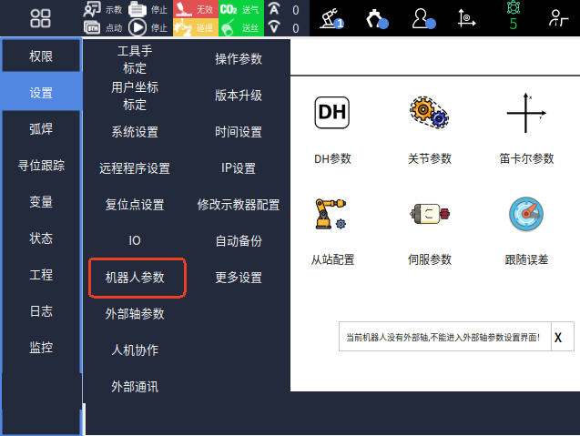

## 干涉区范围

标定的X、Y、Z确定空间范围，以标定的空间范围为基准用户可以选择在区域内或者区域外限制机器人运动。如下图所示：

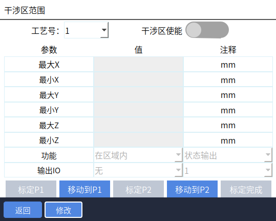

确定干涉区范围可以直接手填参数、移动机器人标定范围

点击【返回】可以回到上一个页面

1、手填参数；

- 点击【修改】在对应参数行填入数值；

- 打开干涉区使能，点击【保存】，干涉区范围设置完成。

  2、移动机器人标定；

<!-- -->

- 点击【修改】；

- 移动机器人点击【标定P1】；

- 移动机器人点击【标定P2】；

- 点击【标定完成】；

- 打开干涉区使能，点击【保存】，干涉区范围设置完成。

界面参数说明：

<table border="1" style="border-collapse: collapse;">
<tr><th style="background-color: #d3d3d3; text-align: center;">参数</th><th style="background-color: #d3d3d3; text-align: center;">参数说明</th></tr>
<tr><td style="vertical-align: top;">工艺号</td><td style="vertical-align: top;">可以选择9个工艺号，可以多个同时使用</td></tr>
<tr><td style="vertical-align: top;">干涉区使能</td><td style="vertical-align: top;">打开干涉区使能设置的干涉区范围才会生效</td></tr>
<tr><td style="vertical-align: top;">最小X</td><td style="vertical-align: top;">运动范围X轴最小值</td></tr>
<tr><td style="vertical-align: top;">最大X</td><td style="vertical-align: top;">运动范围X轴最大值</td></tr>
<tr><td style="vertical-align: top;">最小Y</td><td style="vertical-align: top;">运动范围Y轴最小值</td></tr>
<tr><td style="vertical-align: top;">最大Y</td><td style="vertical-align: top;">运动范围Y轴最大值</td></tr>
<tr><td style="vertical-align: top;">最小Z</td><td style="vertical-align: top;">运动范围Z轴最小值</td></tr>
<tr><td style="vertical-align: top;">最大Z</td><td style="vertical-align: top;">运动范围Z轴最大值</td></tr>
<tr><td style="vertical-align: middle; text-align: left;">功能</td><td style="vertical-align: top;"><strong>区域内：</strong>
 状态输出：机器人位于干涉区内时触发状态输出；   
禁止运动：机器人位于干涉区内时禁止机器人运行。 <strong>区域外：</strong> 状态输出：机器人位于干涉区外时触发状态输出； 禁止运动：机器人位于干涉区外时禁止机器人运行。</td></tr>
<tr><td style="vertical-align: top;">输出IO</td><td style="vertical-align: top;">功能选项为状态输出时有效，输出干涉区状态</td></tr>
<tr><td style="vertical-align: top;">标定P1、P2</td><td style="vertical-align: top;">通过标定的P1点和P2点确定干涉区范围</td></tr>
<tr><td style="vertical-align: top;">移动到P1、P2</td><td style="vertical-align: top;">示教模式下上使能将机器人移动到标定的位置</td></tr>
<tr><td style="vertical-align: top;">标定完成</td><td style="vertical-align: top;">自动计算最大值与最小值</td></tr>
</table>
示例说明1（区域内禁止运动）：机器人在运行时进入干涉区报错，伺服下电，机器人停止运动。如下图：

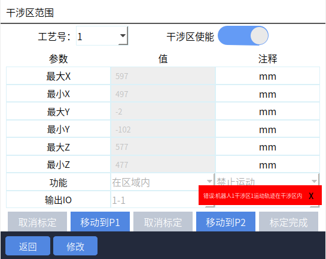

示例说明2（区域内状态输出）：机器人运动到干涉区时IO端口输出提示。详见下图：

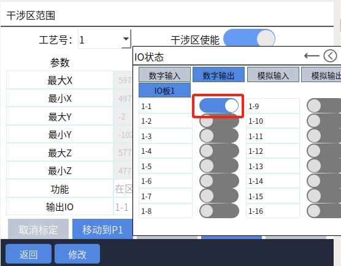

### 零点位置

每个坐标系总有一个所有轴都为 0
的点，就是坐标系原点。对于关节坐标系来说，这个点叫做零点位置。也就是机器人的第
1-6 轴的数值均为 0 的位置。如图：

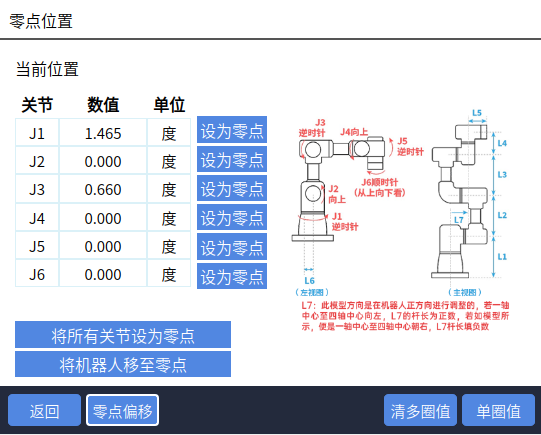

【设为零点】：点击设为零点可单独设置某个轴的零点位置。

【将所有关节设为零点】：点击此按钮可修改所有轴的零点位置。

【将机器人移至零点】：示教模式下上使能点击此按钮机器人移至零点位置。

零点偏移

零点偏移可以在用户需要调整零点时使用，手动输入数值。

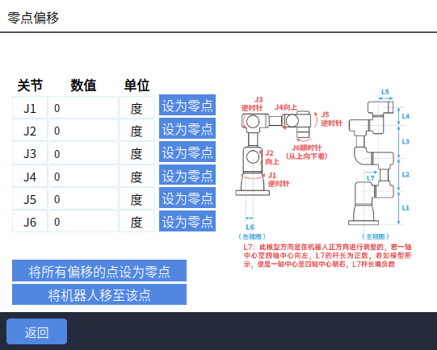

【设为零点】：单独调整某个轴的零点位置，选中需要调整零点位置的轴手动输入值，点击此按钮，然后点击此界面的【返回】进入零点位置界面，点击对应轴的【设为零点】零点位置被修改。

【将所有偏移的点设为零点】：调整所有轴的零点位置，手动输入数值后点击此按钮，然后点击此界面的【返回】进入零点位置界面，点击【将所有关节设为零点】所有轴的零点位置被修改。

【将机器人移至该点】：示教模式下上使能，点击此按钮，机器人运动到零点位置。

清多圈值

多圈值就是伺服电机圈数。

清空：清除某个轴的多圈值。

清空所有轴多圈值：清空所有轴的多圈值。

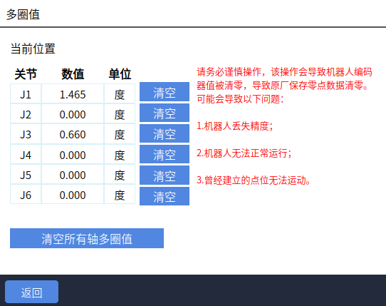

<table border="1" style="border-collapse: collapse;">
<tr><td style="vertical-align: top; padding: 10px;">

请务必谨慎操作，该操作会导致机器人编码器值被清零，导致原厂保存的零点数据清零！

可能会导致以下问题：

1. 机器人丢失精度；

2. 机器人无法正常运行；

3. 曾经建立的点位无法运行。
</td></tr>
</table>
单圈值

单圈值是根据分辨率与旋转角度在一圈内得出的脉冲数。单圈值设置界面见下：

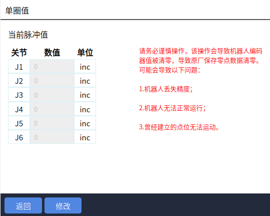

零点丢失如何找回？

前置条件：

1.  机器人只是因为操作失误导致零点丢失，发生碰撞无法找回。

2.  记录未丢失零点前单圈值数据（没有清多圈值时，单圈值界面显示的数值为上次零点标定时的数据）。

操作步骤：

1.  找到丢失零点前记录的单圈值备用。

2.  将机器人示教到机械零点位置。

3.  清机器人所有轴多圈值（此操作会清除多圈值、单圈值，请谨慎操作）。

4.  标定机器人所有轴零点。

5.  在单圈值界面输入记录的单圈值数据。

6.  操作机器人回零，确认零点是否正确。

### DH参数

DH参数说明

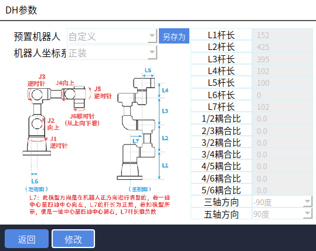

1.  杆长：所有杆长值是机器人在零点位置时测量的。

2.  耦合比：机器人在运动过程中，一个关节运动时另一个关节也会运动，这就说明有耦合，为了抵消这种耦合作用，就需要耦合比。

耦合比=跟随轴旋转角度​/主轴旋转角度。

例如：我们操作 1 轴旋转了 10°，发现 2轴跟随旋转了
15°，那么耦合比为 15/10=1.5。

1.  五轴方向：机器人在零点位置时五轴的方向

2.  三轴方向（机型为六轴协作机器人）：六轴协作机器人有两个零点位置，三轴方向，五轴方向（0,180），三轴方向，五轴方向（-90，90）。

3.  螺距（SCARA机器人）：SCARA 机器人的 3
    轴是控制丝杆上下运动，控制丝杆的旋转轴转动 360°
    时丝杆上下移动的距离就是螺距。

4.  J2+J3最大值、J2+J3最小值。

只有当2/3存在耦合时，动态限位才会生效，当J2+J3最大值和J2+J3最小值不在设置的参数范围内，在运行程序时会报错（机器人2、3轴动态限位超限）。

1.  转化比：转化比就是关节转360度（也可理解为电机转一圈）走的距离（单位：mm）。

转换比计算方法：1 齿距\齿轮，2
转换比填1然后对应轴转360度，然后量走的距离，将量完的距离填入。

例如：电机旋转一圈会有角度值，我们通过转化比可以将角度值转化成长度值。

1.  放大比（四轴码垛丝杆）：工具末端移动的距离/三轴丝杠移动的距离。

2.  DH参数界面新增另存参数功能，方便用户切换参数。

- 点击【另存为】，如下图所示给文件命名，点击【确定】。

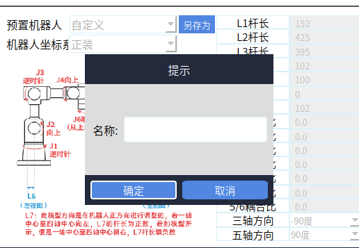

- 点击预置机器人选择预置参数文件，用户可以修改DH参数和关节参数，点击【关节参数】进入关节参数界面修改，不需要的话在当前界面直接修改DH参数即可。

- 点击【保存】，用户所修改的参数被存入"机器人参数.json文件"。

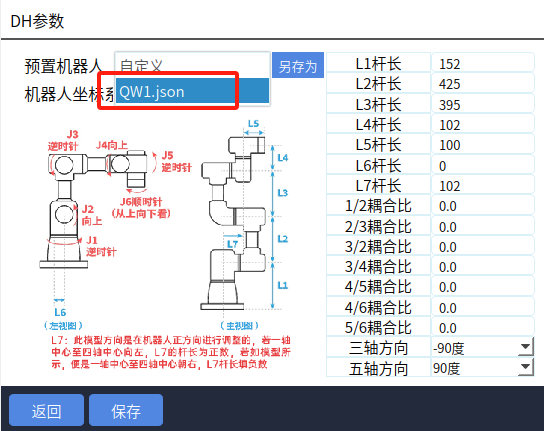

### 关节参数

1.  关节正限位：机器人正方向旋转的角度或移动的距离，运动时超过限位会报错（机器人点动位置到达极限）。

2.  关节方限位：机器人反方向旋转的角度或移动的距离，运动时超过限位会报错（机器人点动位置到达极限）。

3.  关节减速比：减速机的减速比。

4.  编码器位数：填写当前所使用的编码器位数，注意不要随便填写，否则在点动机器人时飞车。

5.  额定正转速：电机正方向能够运行的转速。

6.  额定反转速：电机反方向能够运行的转速。

7.  最大正转速：例如1倍时从0速到达额定正速度时间为10秒，那么2倍就是5秒到达额定正速度。

8.  最大反转速：例如1倍时从0速到达额定反速度时间为10秒，那么2倍就是5秒到达额定反速度。

9.  关节额定正速度：机器人关节额定正方向速度，关节额定正速度计算方法：额定正转速\360/60/减速比。

10. 关节额定反速度：机器人关节额定反方向速度，关节额定反速度计算方法：额定反转速\360/60/减速比。

11. 最大加速度：例如1倍时从0速到达最大加速度时间为10秒，那么2倍就是5秒到达最大加速度。

12. 最大减速度：例如1倍时从0速到达最大减速度时间为10秒，那么2倍就是5秒到达最大减小速度。

13. 模型方向：模型方向可参照零点位置界面关节正方向示意图设置，各轴点动"+"键应与关节正方向示意图方向相同，相同选1，相反选-1。

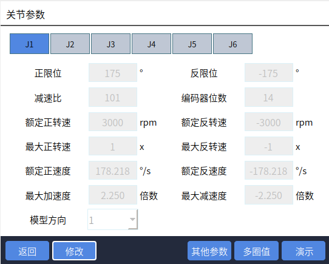

其它参数

齿轮反向间隙：略。

多圈值

点击【设置】-【机器人参数】-【关节参数】进入关节参数界面，点击【多圈值】修改编码器的范围。

编码器多圈值溢出计数功能：该功能用来消除编码器最大/最小值之间跳变产生的影响。

例如编码器多圈值范围为\[-2147483648,2147483647\]，当前编码器多圈值位置为2147483647，则再往正方向转1个单位则为-2147483648，如系统不知道编码器多圈值范围则会认为机器人突然跳变，并不会知道实际只转了1个单位，此时则容易出现飞车现象。

<table border="1" style="border-collapse: collapse; width: 100%;">
<tr><td style="text-align: center; padding: 8px;"></td></tr>
<tr><td style="vertical-align: top; padding: 8px;">
必须填写该参数，不填写可能出现以下问题：
  
1. 点位出现较大跳变，例如突然从4度变为40度。
  
2. 飞车。
  
若配置从动轴，则从动轴的编码器最大/最小值也要填写！
</td></tr>
</table>

### 笛卡尔参数

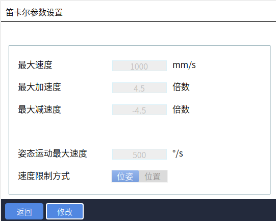

1、最大速度

机器人运行时的最大线速度，此处填写的速度值会影响线速度的范围，如果最大速度填写的是2000，那在插入一条直线指令时速度参数最大范围会变为2000。

2、最大加速度

最大加速度1倍时机器人从0速到达最大加速度的时间为5秒，最大加速度2倍时从0速到达最大加速度的时间为2.5秒。

3、最大减速度

最大减速度1倍时机器人从0速到达最大减速度的时间为5秒，最大减速度2倍时从0速到达最大减速度的时间为2.5秒。

4、最大加加速度

当机器人插补方式为加加速度插补时笛卡尔参数界面才会显示最大加加速度。

5、姿态运动最大速度

机器人运动时ABC轴的最大速度，超过会限速。

6、速度限制方式

位姿：运动时要考虑位置及姿态，任何一个都不会超过最大限速。

位置：限制直线运动最大速度，姿态运动最大速度不限制。

点动速度

说明：此处的全局速度表示示教器状态栏上面的速度。

关节最大点动速度：关节坐标下点动机器人时的最大速度=关节轴最大点动速度\全局速度。

直角最大点动速度：直角坐标下点动机器人时的最大速度=直角最大点动速度\全局速度。

关节轴点动加速度：【1,800】。

点动灵敏度：上电后，机器人抖动范围大于点动灵敏度时点动操作无效。

全局速度：共分为低速、低中速、中速、中高速、高速五档，速度一次递增，第一级速度不可超过高一级速度，否则设置失败。

### 运动参数

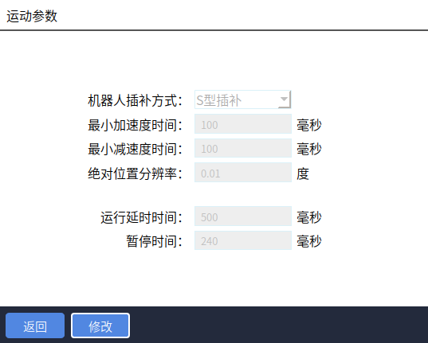

机器人插补方式：S型插补、梯形插补、加加速度插补。

最小加速度时间：最小加速度时间指的是机器人从静止状态加速至目标速度所需的最短时间，或者从一个较低的速度加速至较高的速度所需的时间。在实际应用中，这通常受到机器人驱动系统的限制，比如伺服电机的扭矩和功率。快速加速可能会导致电机过载或产生过多的振动和噪音，从而降低机器人的寿命或造成不稳定的运动。

最小减速度时间：最小减速度时间则指的是机器人从最高速度减速至静止状态，或者从较高速度减速至较低速度所需的最短时间。这同样受到驱动系统能力的约束，尤其是在高速减速时，电机需要处理反向扭矩并可能需要进行能量回收或消耗，以避免过电压或过热。在某些情况下，如果减速度过快，还可能触发安全机制，如急停系统。

在机器人运行中的作用：

- 响应性：在需要快速响应的应用中，如避障或抓取不稳定对象，最小化这些时间可以提升机器人的反应速度。

- 安全性：控制加速度和减速度可以减少因突然变化引起的冲击，保护机器人本身及其周围环境的安全。

- 精度：在精密操作中，适当的加速度和减速度可以提高定位精度，避免因惯性引起的误差。

- 能源效率：优化这些参数可以减少能量消耗，尤其是在频繁启动和停止的应用中。

- 平滑性：通过控制加减速时间，可以减少运动过程中的冲击，使得机器人动作更加平滑，减少对结构的应力。

在实际应用中，机器人控制器会根据运动规划、负载情况以及安全要求来动态调整加速度和减速度时间，以达到最佳的运动效果。

使用范例：

在工程界面新建作业文件，插入多条运动指令（十条左右），每个指令间的点位间距在100mm以内。

- 在程序中插入计时指令记录运动时间。

- 插入运动类指令，如点到点、直线、圆弧等，为使每个点位间距在100mm以内其点位P001，P002等可在变量中手动修改调整。

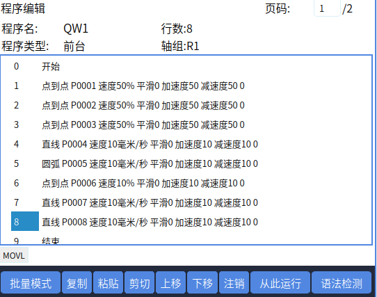

- 不修改作业文件运动指令及指令各个参数的情况下，修改最小加速度时间和最小减速度时间，测试在不同最小加速度时间和最小减速度时间的运动时间，观察机器运动情况。

绝对位置分辨率：运行点位时2个点相差小于分辨率时，当成1个点执行。

例如：设置分辨率为0.01。

GP0001关节点位(10，0，0，0，0，0)；

GP0002关节点位(10.001，0，0，0，0，0)。

当运行这两个点位时，会被当成一个点执行。

运行延时时间：程序启动时的延时时间。

例如：设置的延时时间是1000ms,点击启动按钮延时1000m后程序开始运行。

暂停时间：程序从运行到到暂停所用的时间。

例如：设置的暂停时间是500ms,在程序运行中点击暂停按钮或者其它方式让机器人停止运动的时间为500ms。

是否启用双机同步模式：设置机器人数目和类型（机器人数目2个，机器人类型为六轴串联多关节）重启系统后在此界面打开此按钮开启双机模式。

注：当机器人类型不是两个六轴串联多关节机器人时不显示此功能。

### 从站配置

（当在从站配置中配置多个机器人时，底部会出现"复制参数"按钮，用来复制不同机器人的参数

在设置-机器人参数-从站配置中设置通讯周期。

机器人伺服配置界面配置机器人个数、机器人类型。

配置完成后重启系统伺服列表显示当前当前连接的各类从站的型号，例如伺服型号、IO型号。

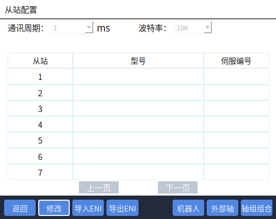

【导入ENI】:点击导入ENI出现下图所示的弹窗提示

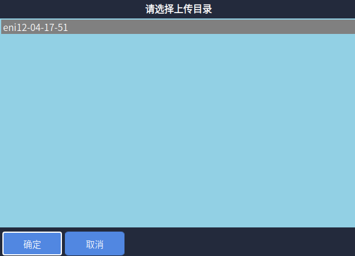

点击确定，出现如下图所示的弹窗，选择需要的ENI文件，点击确定，ENI文件导入成功后，重启系统。

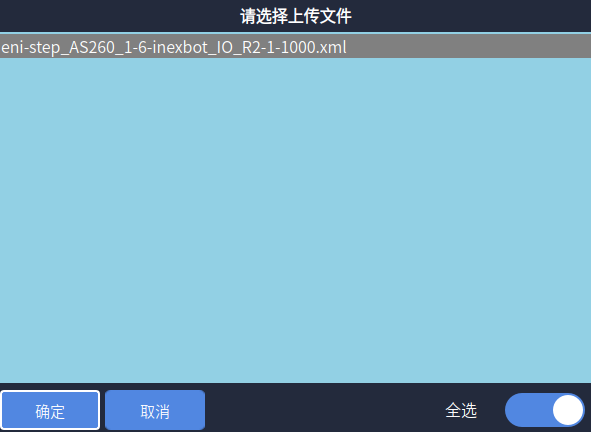

【导出ENI】：将U盘插在示教的USB口，点击【导出ENI】，ENI文件导出成功后存入U盘根路径，文件夹命名方式：eni+具体日期，如下图所示。

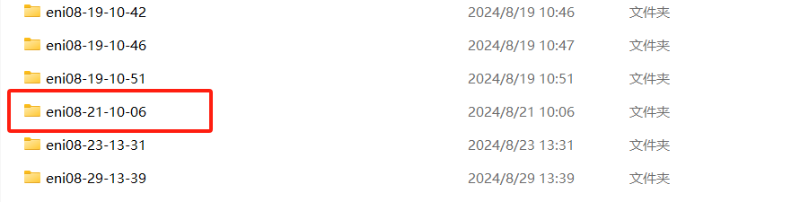

【机器人】：点击机器人进入机器人配置界面，在此界面可以修改机器人数目和机器人类型。

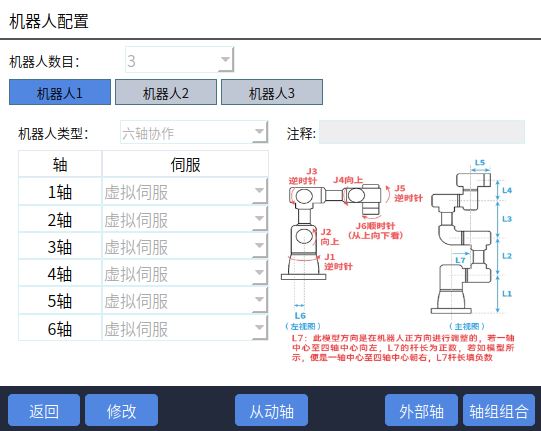

【外部轴】：点击【外部轴】进入外部轴配置界面，在此界面可以配置外部轴组数目和外部轴类型。

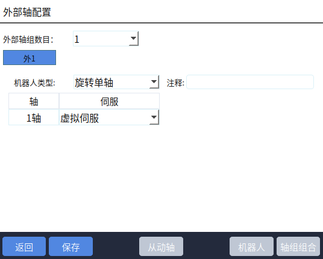

【轴组组合】：点击【轴组组合】进入轴组组合配置界面，在此界面可以设置外部轴个数和外部轴类型。

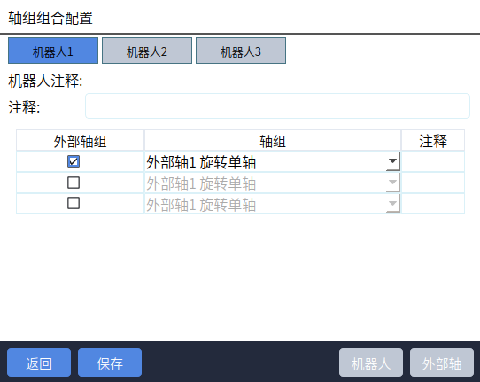

### 伺服参数

点击【设置】-【机器人参数】-【伺服参数】，在此界面可查看修该，如下图所示是德创伺服参数界面。

说明:不是所有伺服都支持在此界面修改读取参数。

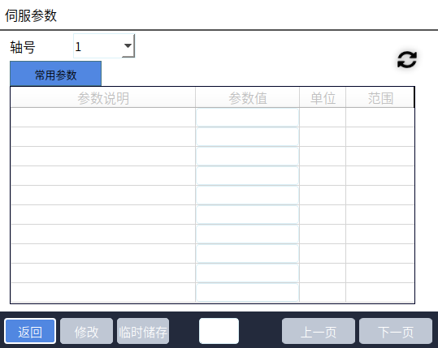

<table border="1" style="border-collapse: collapse; width: 100%;">
<tr><td style="text-align: center; padding: 8px;"></td></tr>
<tr><td style="vertical-align: top; padding: 8px;">
请慎重修改，修改后人员请在安全区域进行测试！
</td></tr>
</table>

## 跟随误差

单位：万分之一度（‱ ）。

跟踪误差：指在电机运动过程中，从开始运动到实际位置的时间段内的位置命令与实际位置的差值。目标位置和实际位置的差值叫做跟随误差。

如图所示：

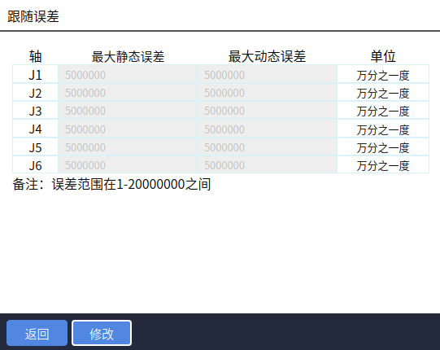

### 协作机器人

下图界面为协作机器人参数设置界面，其他类型机器人无法进入此界面。

使能延时：按下使能键之后延时多久给伺服下发使能命令。

开抱闸延时：下发使能命令后延时多久给伺服下发开抱闸命令。

抱闸关闭后延时：抱闸关闭后延时多久伺服会响应下一步操作。

编码器个数：单关节编码器的个数。

编码器1位数：同关节参数中的编码器位数。

编码器2分辨率：单关节中另一个编码器的inc值。

运动距离：开抱闸前关节的微动距离，一般为20；该值为编码器值，单位inc。

抱闸类型：刹片式抱闸和插销式抱闸；该值为编码器值，单位inc。

检测距离：开抱闸后用于检测抱闸是否打开的关节运动距离。

检测力矩：开抱闸后关节运行检测距离过程中力矩超过检测力矩则认为抱闸打开失败。

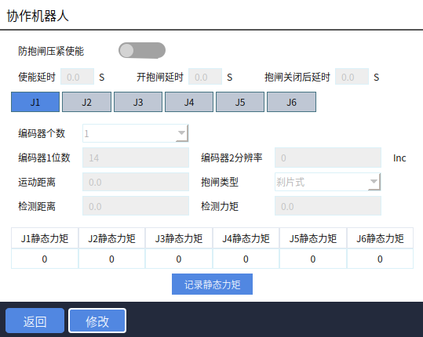

### 电机过载保护

该界面设置电机扭矩过载的阈值，单位mNm和‰（根据设置-操作参数界面的电机负载参数单位设置而决定）。

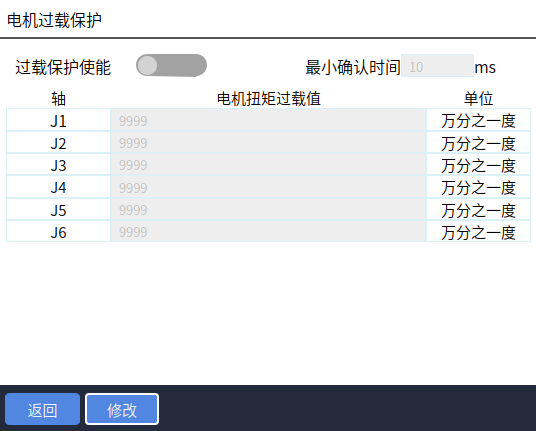

电机过载保护使能：电机过载保护开关，开启之后生效。

电机过载保护最小确认时间：电机过载保护反应时间。

注：可以在监控界面查看当前扭矩和最大扭矩。

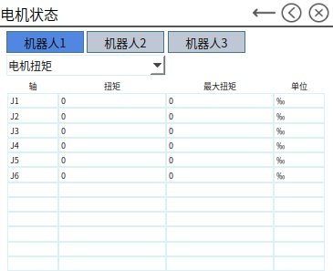

## 复位点设置

依次点击"设置_复位点设置"，进入复位点设置页面（点击监控-快捷键-回安全点机器人可以回到复位点）

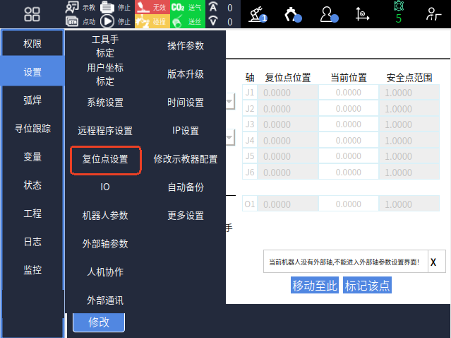

形式：复位点，复位程序：

1、复位点：机器人移动到目标复位点位置后点击【标记该点】，点击【确定】复位点设置成功。示教模式下点击复位按钮，机器人会运动到设置的复位点位置

如上图所示点击复位机器人运动到复位点位置

2、复位程序：用户插入指令后点击复位开始运行复位程序

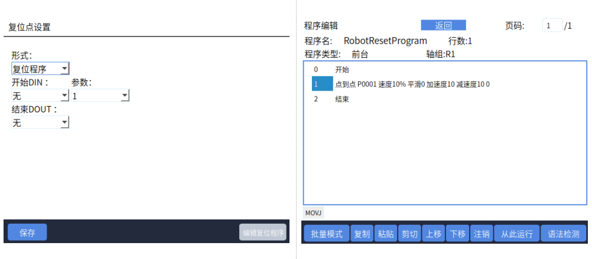

- 设置好参数，点击【编辑复位程序】；

- 插入目标指令后点击复位点程序界面的"返回"退出此界面，不点击"返回"无法退出此界面

1.  复位点位置：记录的复位点点位

2.  当前位置：机器人当前实际位置

3.  安全点范围：范围\[-10,10\]，打开安全使能，运行模式下运行程序，如果当前位置不在安全点范围的话无法运行程序，需要切到示教模式手动回到安全点位置后才可重新运行程序

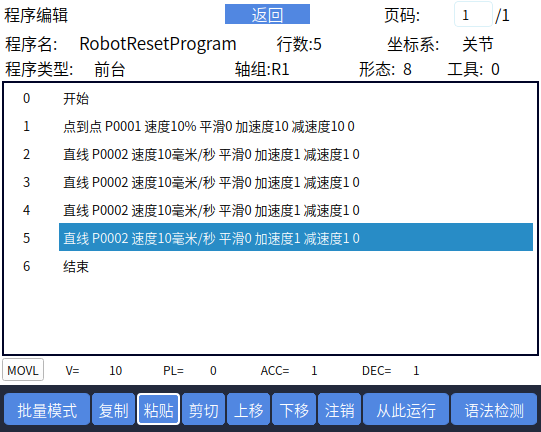

说明：示教模式和远程模式下打开安全使能对程序的运行没有影响

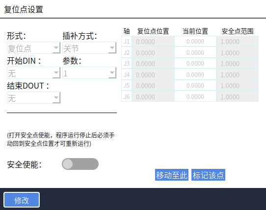

1.  标记该点：机器人运动目标点位后，点击"标记该点"，点击"确定"复位点标记成功

2.  移动至此：示教模式下点击"运动至此"机器人运动到复位点

3.  插补方式：关节插补、直线插补

4.  开始DIN:设置IO输入信号，远程模式下给信号后机器人运动到复位点或者复位程序

5.  参数：0、1(低电平启动、高电平启动)

6.  结束DOUT:远程模式下机器人运行到复位点后信号的反馈，假设设置的输出信号为1-3，机器人运行到复位点后IO的1-3端口由低电平-高电平

说明：IO启动复位仅支持远程模式

## 远程程序设置

依次点击\"设置_远程程序设置\"进入远程程序设置页面，共有远程参数、远程IO功能、远程状态提示、远程程序设置等四大模块

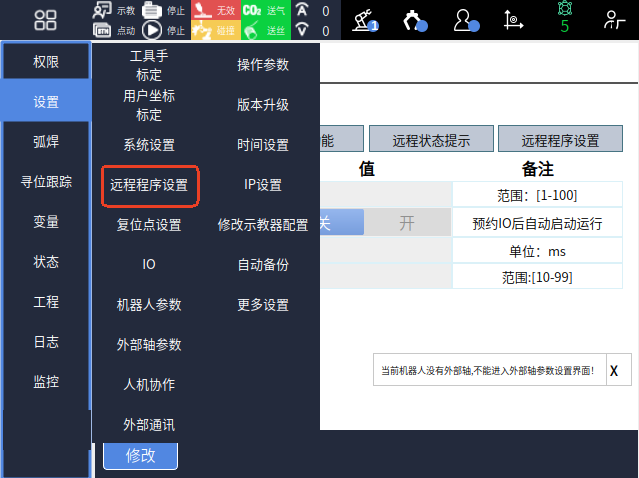

另外增加了"远程模式控制权说明、远程功能的使用"等内容

### 远程参数：

远程参数有远程模式速度、预约并启动、IO重复触发屏蔽时间、远程IO数量等四种功能

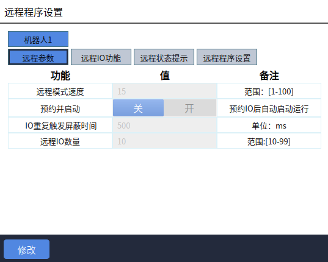

远程模式速度：用来调节远程模式下程序运行的速度，范围在1-100

预约并启动：该功能打开，第一个预约的程序预约成功后即立刻上电运行，此时可以预约其他程序

IO重复触发屏蔽时间：设置后，在设置的时间内不可重复触发相同的IO

远程IO数量：用于设置远程程序数量，修改后，远程IO功能、远程状态提示、远程程序设置里的远程程序数会同步修改

## 远程I/O功能

在"远程IO功能"中，可以设置远程IO控制启动、停止、暂停、清除报警等功能所对应的I/O端口与该端口对应的电平，可以设置I/O模块远程控制所运行的程序。

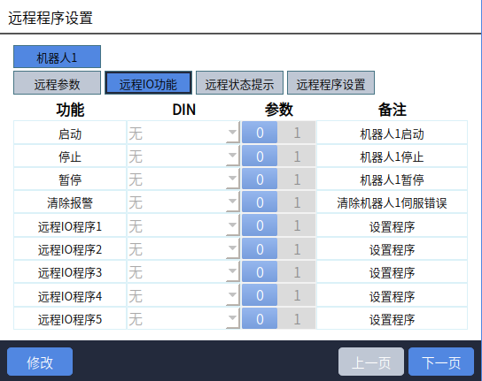

设置的I/O模块的程序只能选择在"远程程序设置"界面中已设定的程序

### 远程状态提示

在状态提示设置界面中，可以设置断电保持数据恢复、远程IO程序输出等功能所对应的I/O
端口与该端口对应的电平。

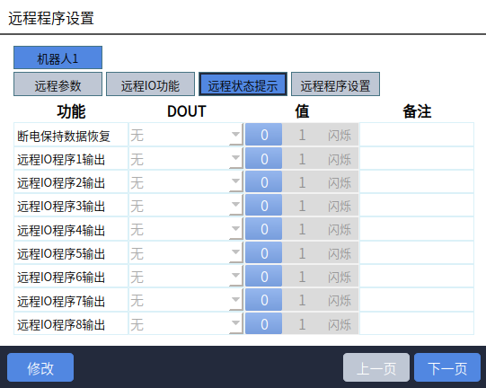

断电保持数据恢复：在当前系统已运行程序，并且还未运行结束时，断电后12秒内会记录断电前的运行状态信息

远程IO程序'X'输出：可设置输出端口及对应触发显示模式，有"0、1、闪烁"三种，在序运行输出信号可发出不同信息

### 远程程序设置

在远程程序设置界面中，可以选择远程程序及该程序运行的次数，未设置次数则默认0次，设置'0'次时表示循环运行，对于已选择的程序也可进行取消

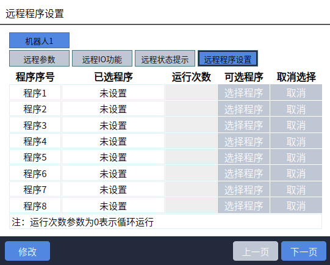

远程程序设置界面中可以设置触摸屏与I/O控制模块所使用的程序。

如果有多个机器人，可以在机器人处选择要设置的机器人，并设置该机器人的各程序。

I/O控制模块所使用的程序需在I/O功能界面中设置。

远程程序界面已选中的程序可点击取消按钮取消。

运行次数填对应的数字即可，0代表循环运行。

预约模式

在"设置/操作参数"中；

打开预约模式使能后，触发远程IO程序信号，程序预约成功，触发启动信号，机器人运行；

关闭预约模式使能后，触发远程IO程序信号，机器人直接运行且此时再触发其他远程IO程序信号无效，机器人运行结束后可重新触发远程IO程序信号。无需设置启动信号。

### 远程模式控制权说明

当控制系统中同时存在示教器、触摸屏与I/O控制设备时，其控制权优先级为示教器＞触摸屏＞I/O
控制设备。

切换到远程模式后控制权切换到触摸屏。若无触摸屏则切换到I/O
控制。此时示教器界面仅显示Modbus 模块与I/O模块连接状态与I/O程序。

同时有触摸屏与I/O模块时，在触摸屏中设置I/O模块使能。

### 远程功能的使用

远程功能概述：设定10个远程程序和每个程序的运行次数，运行前将10个程序排好队列，运行时按照队列的顺序和运行次数运行，队列运行完成后停止等待再次排队。

远程功能使用步骤：

编写程序------设置远程程序------设置IO------切换到远程模式------预约排序------运行。

1、编写程序：

新建程序并插入指令，请确保程序可正常运行。

2、设置远程程序：

进入"设置-远程程序设置"界面，设置好程序1-程序10的程序名与运行次数，[若想要单个程序无限循环运行，则设置该程序的运行次数为0]{.underline}。这里的程序名指向"工程"界面中的程序，当修改程序内的指令后，远程程序会跟着自动修改，不需重新设置远程程序。

若修改了程序的程序名，请在远程程序设置界面中重新设置该程序。

3、设置IO：

在"IO-IO功能"界面中设置各个功能对应的IO端口与有效值，当有效值为1时高电平有效，有效值为0时低电平有效。

其中的程序1-程序10对应的IO端口功能不是选择该程序运行，而是在远程模式中给该程序排队。

4、切换到远程模式：

将模式选择钥匙旋转到远程模式位置或点击程序中的模式状态，选择远程模式。

当示教器没有连接控制器时，启动控制器自动进入远程模式。

当控制器同时连接IO、Modbus设备、示教器时，三个设备的优先级为示教器\>Modbus设备\>IO设备。当切换到远程模式后，以Modbus设备有效，IO设备无效，此时关闭Modbus设备中的使能按钮，则IO有效。

5、预约排序：

例：IO功能中的IO功能设置为：

运行 端口1有效值1

停止 端口2 有效值1

暂停 端口3 有效值1

清除错误 端口4有效值1

程序1端口5有效值1

程序2 端口6 有效值1

程序3 端口7 有效值1

程序4 端口8 有效值1

程序5端口9 有效值1

程序6端口10有效值1

程序7端口11有效值1

程序8端口12有效值1

程序9端口13有效值1

程序10端口14有效值1

则排序方式为给6号端口一个高电平1秒钟后松开，则程序2排在第一个，给8号端口一个高电平1秒后松开，程序4排在第二个，以此类推。若想要在队列中取消某一程序的排队，则再给对应的IO端口一个1秒的高电平，该程序就会在队列中取消。

队列中只能有10个程序，同一个程序不能重复排队。

当一个程序运行中，可以将该程序重新加入队列末尾。

6、运行：

给有运行功能的端口一个高电平，机器人便开始按照队列中的顺序与运行次数开始运行。运行完成后伺服不下电，此时再将程序加入到队列中，机器人会立刻运行该程序。

当队列中没有程序就使其运行，则机器人上电不运动，此时将程序排入队列中，机器人立刻执行该程序。

查看运行情况：

远程IO控制查看程序运行详细情况可点击远程模式界面内的"查看程序"按钮，modbus也可以通过此功能查看。

运行总数清零：

清除当前运行程序的运行总次数，只可以清除运行总数，不能清除运行次数。

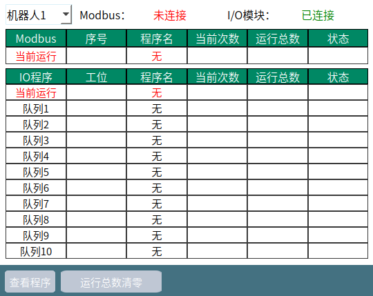

## 工具手和用户坐标标定

依次点击\"设置_工具手标定/用户坐标标定\"，可以进去具体页面

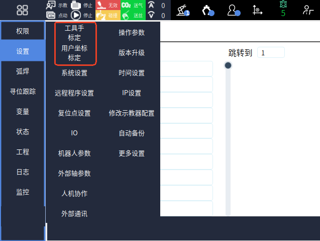

### 工具手标定

法兰盘中心：默认工具坐标系的原点，法兰盘中心指向法兰盘定位孔方向为+X方向，垂直法兰向外为+Z方向，最后根据右手法则即可判定Y方向。新的工具坐标系都是相对默认的工具坐标系变化得的。

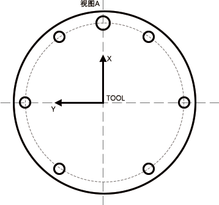

为什么要建立工具坐标系？

1.  机器人都有一个默认的工具坐标系Tool
    0：位置在法兰中心。但是机器人在实际运动中往往会在法兰中心安装吸盘（图一所示）、焊枪（图二所示）等工具。此时若机械手运动中心依然在法兰中心，会造成很大的不便。因此根据实际情况去示教需要的工具坐标系就很有必要。

例如：焊接时，需要在机器人末端（法兰中心）安装焊枪，用户通常把TCP点定义到焊丝的尖端。那么程序里记录的位置便是焊丝尖端的位置，记录的姿态便是焊枪围绕焊丝尖端转动的姿态。

1.  对于工业机器人，需要在末端法兰盘安装工具来进行作业。为了确定该工具的位姿，在安装的工件上上绑定一个工具坐标TCS
    (Tool Coordinate System)，TCS的原点就是TCP（Tool Center
    Point，工具中心点）。

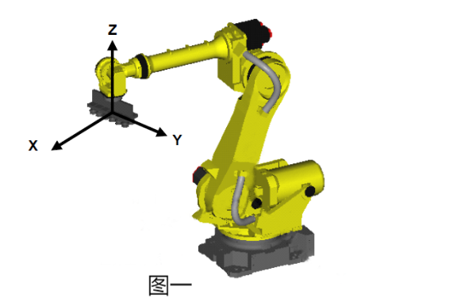

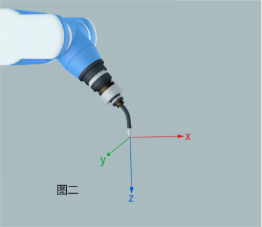{width="4.5in" height="3.90625in"}

思考
：我们知道工具坐标系是运动中的一个研究对象，但是它在实际调试过程中，又起到了什么作用呢？思考下图一、图二的手爪姿态和位置是如何调整得到的？

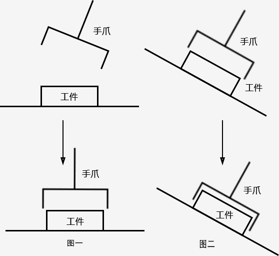

根据思考可以得出两个推测：

推测1：若图1中的手爪有一个旋转点，使手爪直接绕着这个旋转点选择就可以。

推测2：若图二中有一个手爪的前进方向就可以直接移动过去了。

结论：建立工具坐标系的作用：

1.  确立工具的TCP点（即工具中心点），方便调整工具状态。

2.  确定工具进给方向，方便工具位置调整。

工具坐标系特点：

新的工具坐标系是相对于默认的工具坐标系变化得到的，新的工具坐标系的位置和方向始终同法兰盘保持绝对的位置和姿态关系，但在空间上是一直变化的。

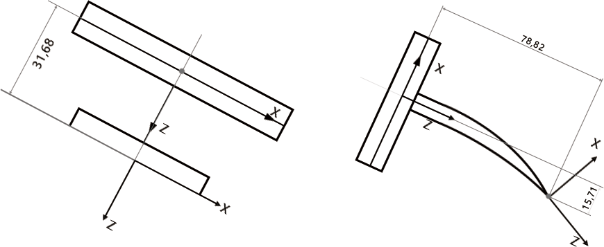

什么情况下需要使用工具手：需要用到绕X、绕Y、绕Z的姿态旋转时，需要进行工具手标定。

什么情况下无需使用工具手：机器人本身仅做Z轴姿态旋转，且工具末梢位于机器人6轴法兰中心延长线上；此时可以不设置工具手参数。

适用场景

机器人在工作时X、Y、Z轴需要绕着A、B、C姿态轴旋转时，就需要标定工具手，例如焊接工艺、打磨工艺、喷涂工艺等。

不同情景工具手标定方式的选择

机器人已做过激光标定+使用焊枪。

推荐：使用6点标定工具手即可，标定完成验证机器人标定结果即可。

机器人未做过激光标定+使用焊枪。

推荐：使用12点标定工具手即可，标定完成验证机器人标定结果即可。

标定码垛夹抓。

推荐：优先选择直接填工具尺寸，不知道尺寸的再使用6点标定。

如何直接填写夹爪尺寸？

- 准备好夹抓长宽高的参数。

- 夹抓末梢在X轴上的偏移量填到"x轴方向偏移"。

注意：末梢位于直角X轴正方向上填正值。

- 夹抓末梢在Y轴上的偏移量填到"y轴方向偏移"。

注意：末梢位于直角Y轴正方向上填负值。

- 夹抓末梢在Z轴上的偏移量填到"z轴方向偏移"。

注意：末梢位于直角Z轴正方向上填负值。

- 保存后，验证工具手旋转A、B、C精度。

如何6点标定？

准备一尖状物体且可以被夹抓抓住，该物体尽可能放置到夹抓中心，然后找一个带有尖端的标定锥，根据6点标定的步骤进行工具手标定。

1.  机器人零点丢失，按照对位孔标定的零点位置有偏差。

推荐：准备标定工具，该工具末梢尽可能位于6轴法兰中心延长线上、工具尺寸较小。

使用20点标定，校准零点，20标定后再换上要实际用到的工具手进行6点标定。

1.  6点标定后A、B轴旋转误差较大满足不了使用需求。

推荐：更换7点标定。

工具手参数

点击设置---工具手标定进入工具手标定界面，如下图所示：

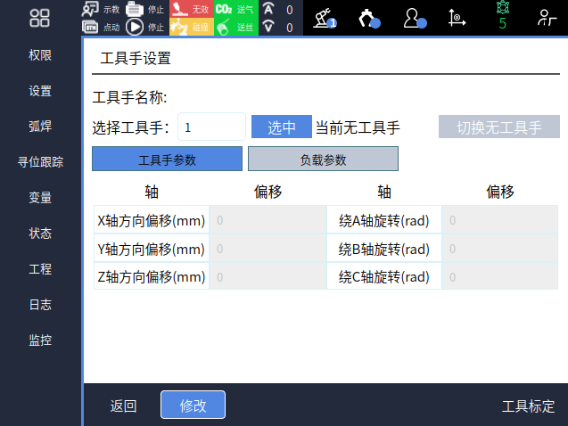

工具手参数：

<table border="1" style="border-collapse: collapse;">
<tr><td style="text-align: center; vertical-align: middle;">轴</td><td style="text-align: center; vertical-align: middle;">偏移</td><td style="text-align: center; vertical-align: middle;">单位</td></tr>
<tr><td style="text-align: center; vertical-align: middle;">X轴</td><td style="text-align: center; vertical-align: middle;">工具末端相对于法兰中心，沿直角坐标系X轴方向的偏移长度</td><td style="text-align: center; vertical-align: middle;">毫米(mm)</td></tr>
<tr><td style="text-align: center; vertical-align: middle;">Y轴</td><td style="text-align: center; vertical-align: middle;">工具末端相对于法兰中心，沿直角坐标系Y轴方向的偏移长度</td><td style="text-align: center; vertical-align: middle;">毫米(mm)</td></tr>
<tr><td style="text-align: center; vertical-align: middle;">Z轴</td><td style="text-align: center; vertical-align: middle;">工具末端相对于法兰中心，沿直角坐标系Z轴方向的偏移长度</td><td style="text-align: center; vertical-align: middle;">毫米(mm)</td></tr>
<tr><td style="text-align: center; vertical-align: middle;">A轴</td><td style="text-align: center; vertical-align: middle;">工具末端相对于法兰中心，绕直角坐标系X 轴方向旋转角度</td><td style="text-align: center; vertical-align: middle;">度/弧度(°/rad)</td></tr>
<tr><td style="text-align: center; vertical-align: middle;">B轴</td><td style="text-align: center; vertical-align: middle;">工具末端相对于法兰中心，绕直角坐标系Y 轴方向旋转角度</td><td style="text-align: center; vertical-align: middle;">度/弧度(°/rad)</td></tr>
<tr><td style="text-align: center; vertical-align: middle;">C轴</td><td style="text-align: center; vertical-align: middle;">工具末端相对于法兰中心，绕直角坐标系Z轴方向的旋转角度</td><td style="text-align: center; vertical-align: middle;">度/弧度(°/rad)</td></tr>
</table>

有安装工具的详细参数：

1.  选择工具手编号，点击【修改】，然后填写安装的工具手参数；

2.  点击【确定】；

3.  点击【选中】，此时状态栏上面的工具栏显示的工具手号就是选中的工具号；

4.  在该界面下，用户可以直接填写工具末端偏移的相关参数，不需进行工具手标定。若更换工具手请重新填写；

无安装工具的详细参数（工具手标定）：

### 工具手标定方式

<table border="1" style="border-collapse: collapse; width: 100%;">
<tr><td style="text-align: center; vertical-align: middle;">标定 方式</td><td style="text-align: center; vertical-align: middle;">功能</td></tr>
<tr><td style="vertical-align: center;">6点标定</td><td style="vertical-align: center;">校准工具手尺寸+姿态，标定结果旋转C轴精度较好</td></tr>
<tr><td style="vertical-align: center;">7点标定</td><td style="vertical-align: center;">校准工具手尺寸+姿态，标定结果旋转A、B轴精度较好</td></tr>
<tr><td style="vertical-align: center;">12点标定</td><td style="vertical-align: center;">校准零点2、3、4、5轴零点+工具手尺寸</td></tr>  
<tr><td style="vertical-align: center;">15点标定</td><td style="vertical-align: center;">校准零点2、3、4、5轴零点+校准工具手尺寸+姿态</td></tr>
<tr><td style="vertical-align: center;">20点标定</td><td style="vertical-align: center;">校准零点2、3、4、5轴零点+工具手尺寸</td></tr>
</table>

#### 6点标定

点击设置-进入工具手标定界面，点击【工具手标定】

标定步骤：

TC1标定:机器人5轴垂直向下

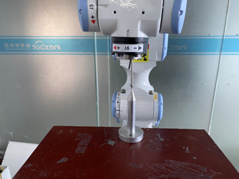

TC2标定：机器人在第一点的基础上C轴旋转180°

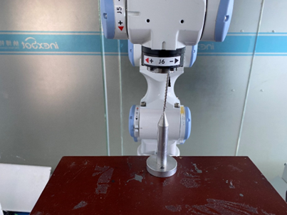

TC3标定：机器人在第一点的基础上B轴角度在35°

TC4标定：机器人回到零点，然后工具手末梢垂直

TC5标定：机器人在第四点的基础上动X-

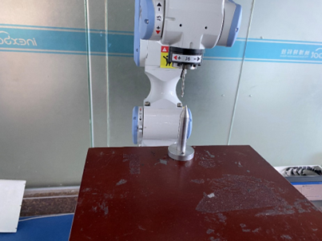

TC6标定：机器人在第五点的基础上动Y+

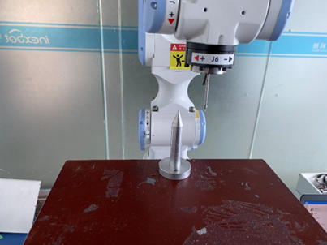

【计算】：六个点标定结束后，点击"计算"会算出计算结果，如果计算结果大于1的话就需要重新标定。

【运行到该点】：选择标记的任意一点，点击"运行到该点"机器人会运行到选择的位置。

【清除所有标记点】：清除所有已标记的6个点位。

【返回】：返回"工具手标定"界面。

若在标定过程中对标定的某一点不满意，可以点击该行所对应的【取消标定】按钮，取消标定后再次标定该点。

何验证标定精度：

示教模式下，工具手标定的末梢对准标定锥，在尖端对准的情况下，选中标定的工具手参数，点动坐标系切换到直角，点动A、B、C轴，看尖端是否对准、偏了多少mm。

#### 7点标定

点击设置-进入工具手标定界面，点击【工具手标定】

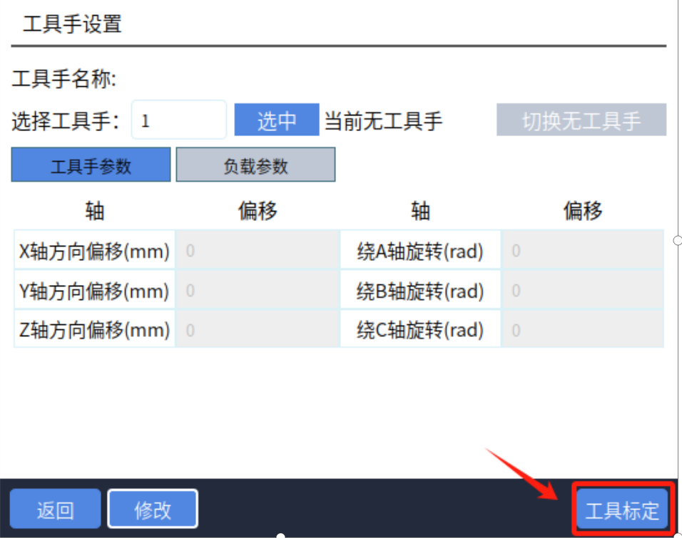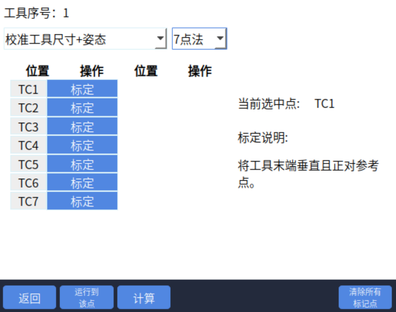

标定步骤：

TC1：工具手末梢垂直对准参考点；

TC2标定：将机器人切换一个姿势，末端正对参考点；

TC3标定：将机器人切换一个姿势，末端正对参考点；

TC4标定：将机器人切换一个姿势，末端正对参考点；

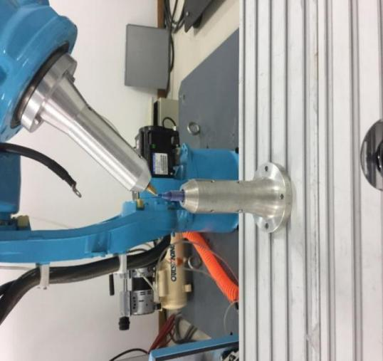

TC5标定：将工具末端垂直且正对参考点（同TC1）；

TC6标定：在TC5的基础上，沿笛卡尔坐标系X轴负方向移动任意距离；

TC7标定：在TC6的基础上，沿笛卡尔坐标系Y轴正方向移动任意距离；

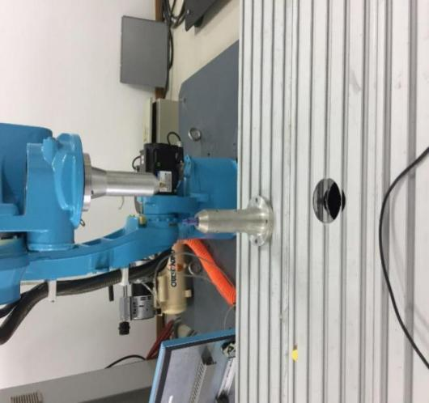

【计算】：七个点标定结束后，点击"计算"会算出计算结果，如果计算结果大于1的话就需要重新标定。

【运行到该点】：选择标记的任意一点，点击"运行到该点"机器人会运行到选择的位置。

【清除所有标记点】：清除所有已标记的7个点位。

【返回】：返回"工具手标定"界面。

若在标定过程中对标定的某一点不满意，可以点击该行所对应的【取消标定】按钮，取消标定后再次标定该点。

<table border="1" style="border-collapse: collapse;">
<tr><th style="background-color: #d3d3d3; text-align: center;">警告</th></tr>
<tr><td style="vertical-align: top; text-align: center; padding: 8px;"></td></tr>
<tr><td style="vertical-align: top; padding: 8px;">
进行数据量取前请将法兰盘平行于水平面！
</td></tr>
</table>

#### 12点标定

12点标定结果只有工具手的XYZ轴方向偏移，无绕ABC旋转的数值。

点击设置-进入工具手标定界面，点击【工具手标定】。

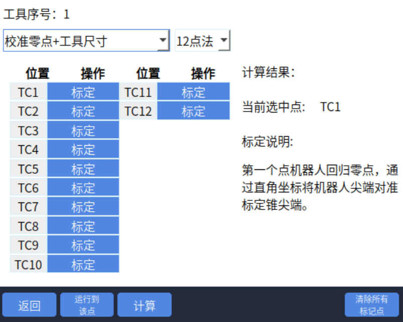

标定步骤：

找到一个参考点（标定锥尖端为参考点），并确保此参考点固定。

TC1：第一个点机器人回归零点，通过直角坐标将机器人尖端对准标定锥尖端。

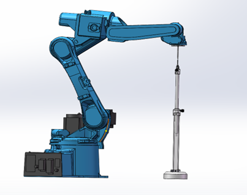

TC2：第二个点在第一个点的基础上，通过直角坐标系将C旋转180度；尖端对齐标定第二点。

TC3：第三个点机器人回归零点，通过直角坐标系将机器人尖端对准标定锥尖端；标定第三个点（与第一个点相同）。

TC4：第四个点在第三个点的基础上，通过直角坐标系做B-、度数位于30°-60°，尖端对齐标定第四个点。

TC5：第五个点在第四个点的基础上，通过直角坐标系做B+、J5\>-90°、将机器人尖端对准标定锥
尖端，标定第五个点。

TC6：选中第一个点，并将机器人移动到第一个点，在第一个点的基础上、通过直角坐标系做B+、J5\>-90°，尖端对齐标定第六个点。

TC7：在第一个点的基础上，通过直角坐标系做B-、J5\>-90°，尖端对齐标定第七个点。

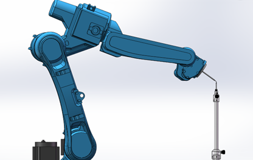

TC8：在第七个点的基础上，通过直角坐标系做A+、旋转90°、J5\>-90°，尖端对齐标定第八个点。

TC9：在第七个点的基础上，通过直角坐标系做A-、旋转90°、J5\>-90°，尖端对齐标定第九个点。

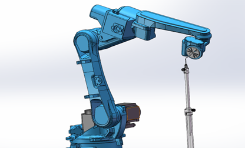

TC10：回到第一个点，通过关节坐标系点动五轴，使五轴向上、J5\<-90°、将尖端对齐，标定第十个点。

TC11：在第十点的基础上，通过直角坐标系做A+、旋转90°、J5\<-90°，尖端对齐标定第十一个点。

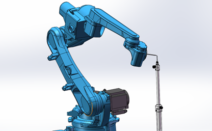

TC12：在第十点的基础上，通过直角坐标系做A-、旋转90°、J5\<-90°，尖端对齐标定第十二个点。

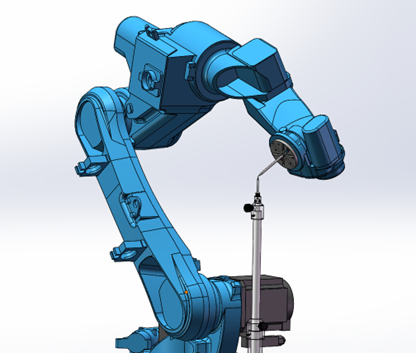

【计算】：标定完成后点击计算，计算出标定结果，如果计算出来的数值较大的话，就需要重新标定。

【取消标定】：若在标定过程中对某点标定后不满意，可以点击该行所对应的【取消标定】按钮，取消标定后再次标定该点。

【运行到计算结果位置】：机器人运行到修正零点后的零点位置。

【运行到该点】：选择标记的任意一点，点击"运行到该点"机器人会运行到选择的位置。

【将结果位置标为零点】：将标定补偿后的位置设置为当前机器人的零点位置。

【清除所有标定点】：清除已经标记的12个点位。

【返回】返回"工具手标定"界面。

#### 15点标定

15点标定结果只有工具手的XYZ轴方向偏移，无绕ABC旋转的数值。

点击设置-进入工具手标定界面，点击【工具手标定】。

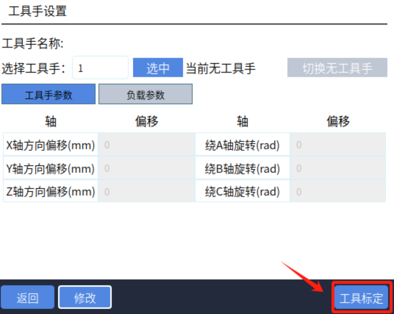

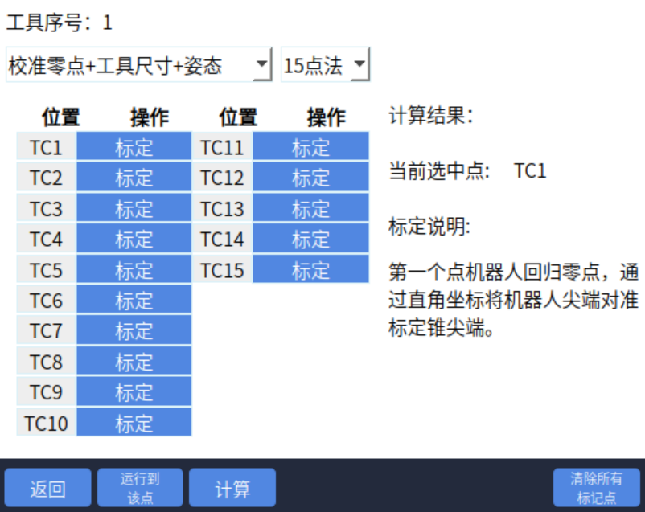

标定步骤：

找到一个参考点（标定锥尖端为参考点），并确保此参考点固定。

TC1：第一个点机器人回归零点，通过直角坐标将机器人尖端对准标定锥尖端。

TC2：在第一个点的基础上，通过直角坐标系将C旋转180度，尖端对齐标定第二点。

TC3：机器人回归零点，通过直角坐标系将机器人尖端对准标定锥尖端，标定第三个点。

TC4：在第三个点的基础上，通过直角坐标系做B-、度数位于30°-60°、尖端对齐标定第四个点。

TC5：在第四个点的基础上，通过直角坐标系做B+、J5\>-90°、将机器人尖端对准标定锥尖端，标定第五个点。

TC6：选中第一个点，并将机器人移动到第一个点，在第一个点的基础上，通过直角坐标系做B+，J5\>-90°,尖端对齐标定第六个点。

TC7：在第一个点的基础上，通过直角坐标系做B-、J5\>-90°，尖端对齐标定第七个点。

TC8：在第七个点的基础上，通过直角坐标系做A+、旋转90°、J5\>-90°，尖端对齐标定第八个点。

TC9：在第七个点的基础上，通过直角坐标系做A-、旋转90°、J5\>-90°，尖端对齐标定第九个点。

TC10：机器人回到第一个点，通过关节坐标系点动五轴使五轴向上，J5\<-90°，将尖端对齐标定第十个点。

TC11：在第十点的基础上，通过直角坐标系做A+、旋转90°、J5\<-90°，尖端对齐标定第十一个点。

TC12：在第十点的基础上，通过直角坐标系做A-、旋转90°、J5\<-90°，尖端对齐标定第十二个点。

TC13：机器人回到零点位置，调整机器人姿态，使机器人末端工具尖端竖直朝下，将标定尖端与标定锥对齐，标定第十三个点。

TC14：在第十三点的基础上，通过直角坐标系做X-，机器人位移一段距离，直接点击标定第十四点。

TC15：在第十四点的基础上，通过直角坐标系做Y+，机器人位移一段距离，直接点击标定第十五点。

【计算】：标定完成后点击计算，计算出标定结果，如果计算出来的数值较大的话，就需要重新标定。

【取消标定】：若在标定过程中对某点标定后不满意，可以点击该行所对应的【取消标定】按钮，取消标定后再次标定该点。

【运行到计算结果位置】：机器人运行到修正零点后的零点位置。

【运行到该点】：选择标记的任意一点，点击"运行到该点"机器人会运行到选择的位置。

【将结果位置标为零点】：将标定补偿后的位置设置为当前机器人的零点位置。

【清除所有标定点】：清除已经标记的15个点位。

【返回】返回"工具手标定"界面。

#### 20点标定

点击设置-进入工具手标定界面，点击【工具手标定】。

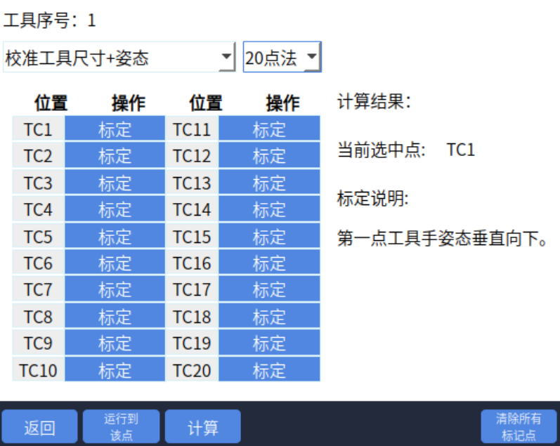

标定步骤：

TC1：机器人工具手末端垂直参考点；

TC2：在第一点的基础上动A+；

TC3：在第一点的基础上动A+ 40度

TC4：在第一点的基础上动A+ 60度；

TC5：在第一点基础上动A- 20度；

TC6：在第一点基础上动A- 40度；

TC7：在第一点基础上动A- 60度；

TC8：在第一点基础上动B+ 20度；

TC9：在第一点基础上动B+ 30度；

TC10：在第一点基础上动B+ 40度；

TC11：在第一点基础上动B- 20度；

TC12：在第一点基础上动B- 30度；

TC13：在第一点基础上动B- 40度；

TC14：在第一点基础上动C+ 30度；

TC15：在第一点基础上动C+ 50度；

TC16：在第一点基础上动C+ 70度；

TC17：在第一点基础上动C+ 90度；

TC18：在第一点基础上动C- 30度；

TC19：在第一点基础上动C- 60度；

TC20：第二十点在第一点基础上动C- 90度。

【计算】：标定完成后点击计算，计算出标定结果，如果计算出来的数值较大的话，就需要重新标定。

【取消标定】：若在标定过程中对某点标定后不满意，可以点击该行所对应的【取消标定】按钮，取消标定后再次标定该点。

【运行到计算结果位置】：机器人运行到修正零点后的零点位置。

【运行到该点】：选择标记的任意一点，点击"运行到该点"机器人会运行到选择的位置。

【将结果位置标为零点】：将标定补偿后的位置设置为当前机器人的零点位置。

【清除所有标定点】：清除已经标记的15个点位。

<table border="1" style="border-collapse: collapse;">
<tr><th style="background-color: #d3d3d3; text-align: center;">注意</th></tr>
<tr><td style="vertical-align: top; text-align: center; padding: 8px;"></td></tr>
<tr><td style="vertical-align: top; padding: 8px;">
在标定过程中各点的姿势，请尽量取任意方向的姿势。取的姿势朝一定方向旋转的话，有些时候精度不准确。
  
标定过程中请保持参考点固定，否则标定误差增大！
</td></tr>
</table>
如何验证标定精度

示教模式下，工具手标定的末梢对准标定锥，在两个尖端对准的情况下，选中标定的工具手工具手编号，然后在直角坐标系下点动A、B、C轴，看尖端是否对准、偏了多少mm。

## 用户坐标系

默认的用户坐标系User0和直角坐标系重合。新的用户坐标系都是基于默认的用户坐标系变化得到的。

思考：我们知道用户坐标系是运动中的一个参考对象，但是它在实际调试过程中，又起到了什么作用呢？

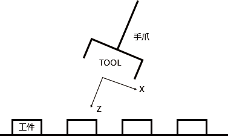

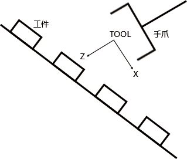

推测：从图中可以看出，如果使用默认的用户坐标系User 0
或者直角坐标系将很难对每个工件位置进行调试，但如果存在某个坐标系的两个方向正好平行于工作台面的话，那就方便多了。

用户坐标系的作用

1.  确定参考坐标系。

2.  确定工作台上的运动方向，方便调试。

用户坐标系特点

新的用户坐标系是根据默认的用户坐标系User 0
变化得到的，新的用户坐标系的位置和姿态相对空间是不变化的。

用户坐标参数

点击设置-用户坐标标定，进入用户坐标标定界面，如下图：

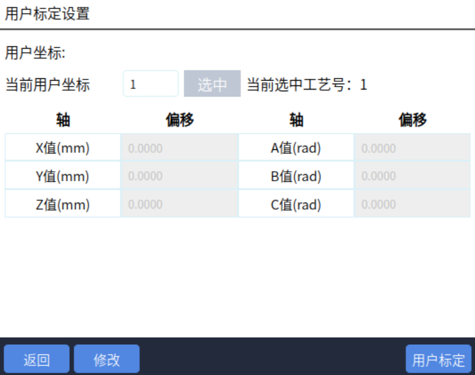

用户坐标的参数：

<table border="1" style="border-collapse: collapse; width: 100%;">
<tr><td style="text-align: center; vertical-align: middle;">轴</td><td style="text-align: center; vertical-align: middle;">偏移</td><td style="text-align: center; vertical-align: middle;">单位</td></tr>
<tr><td style="vertical-align: top;">X</td><td style="vertical-align: top;">用户坐标原点相对机器人基座原点X轴方向的偏移</td><td style="vertical-align: top;">毫米(mm)</td></tr>
<tr><td style="vertical-align: top;">Y</td><td style="vertical-align: top;">用户坐标原点相对机器人基座原点Y轴方向的偏移</td><td style="vertical-align: top;">毫米(mm)</td></tr>
<tr><td style="vertical-align: top;">Z</td><td style="vertical-align: top;">用户坐标原点相对机器人基座原点Z轴方向的偏移</td><td style="vertical-align: top;">毫米(mm)</td></tr>
<tr><td style="vertical-align: top;">A</td><td style="vertical-align: top;">用户坐标系相对直角坐标系绕X轴方向的旋转角</td><td style="vertical-align: top;">度/弧度(°/rad)</td></tr>
<tr><td style="vertical-align: top;">B</td><td style="vertical-align: top;">用户坐标系相对直角坐标系绕Y轴方向的旋转角</td><td style="vertical-align: top;">度/弧度(°/rad)</td></tr>
<tr><td style="vertical-align: top;">C</td><td style="vertical-align: top;">用户坐标系相对直角坐标系绕Z轴方向的旋转角</td><td style="vertical-align: top;">度/弧度(°/rad)</td></tr>
</table>

用户坐标系标定

点击"用户坐标标定"界面底部的【用户标定】按钮，进入"用户标定"界面，如图：

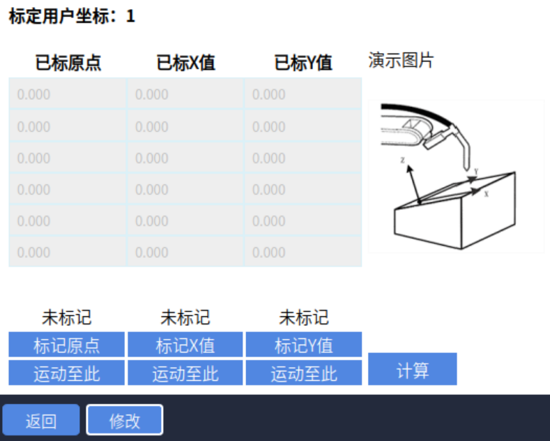

标定步骤：

1.  将机器人末梢移动到期望的用户坐标系原点的位置，点击"标定原点"按钮。

2.  将机器人相对于用户坐标系原点向期望的用户坐标系X轴正方向的位置移动任意距离，点击"标定X轴"按钮。

3.  将机器人相对于用户坐标系原点向期望的用户坐标系Y轴正方向的位置移动任意距离，点击"标定Y轴"按钮。

【计算】三个点标定结束后，点击计算，提示计算成功后，用户坐标标定完成。

【返回】返回到上一个界面。

【修改】修改标定后的点位，修改结束后点击【保存】，然后点击计算，用户坐标被修改。

## 系统设置

依次选择"设置-系统设置"，进入系统设置页面，共有六个功能：导出程序、导入程序、导出控制器配置、导入控制器配置、导出日志、数据库升级

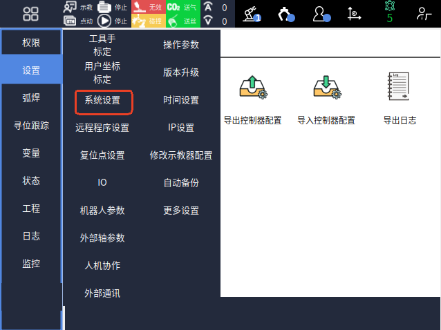

一、导出程序：

插入U盘，点击'导出程序'，示教器自动导出当前所有程序，成功导出后页面右下角会弹出提示框并给出导出程序的文件夹名称，如下图所示

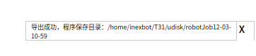

二、导入程序：

在插入U盘的前提下，点击'导入程序'，示教器会自动弹出U盘内可导出的程序选择框，如下如所示

在选择需要导入程序的文件夹，选择完点击'确定'，会出现具体程序的页面，可进行单个选或多个择，也可全选导入，选择完点击'确定'即可

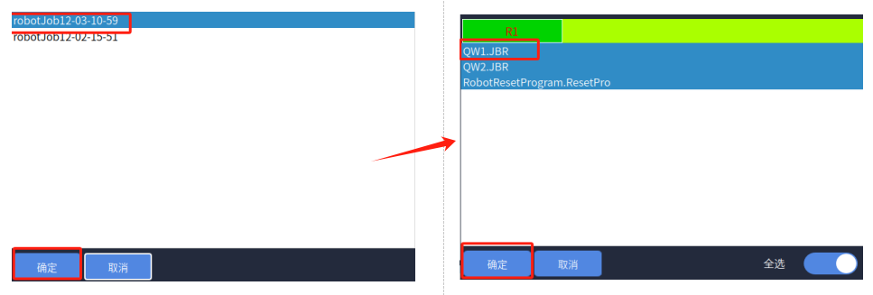

三、导出控制器配置：

插入U盘，点击导出控制器配置，弹出提示，点击确定，系统会自动导出当前控制器配置，在导出完成之后页面右下角会给出白色提示导出文件夹的名称，具体如下图所示

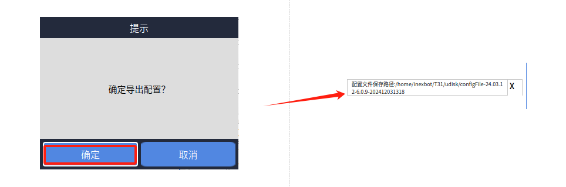

四、导入控制器配置：

插入有配置的U盘，点击导入控制器配置，自动弹出U盘内可导入控制器配置的文件夹，选择完点击'确定'，会弹出具体内容，可以选择单个或多个，也可以选择全部导入，选择完后点击'确定'，点击完确定后会再次弹出提示框，再次点击'确定'，具体步骤如下图所示：

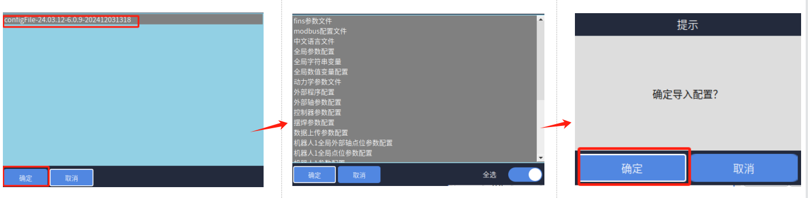

导入成功控制器配置后，示教器会进行自动重启，重启后即导入完成，如下图所示：

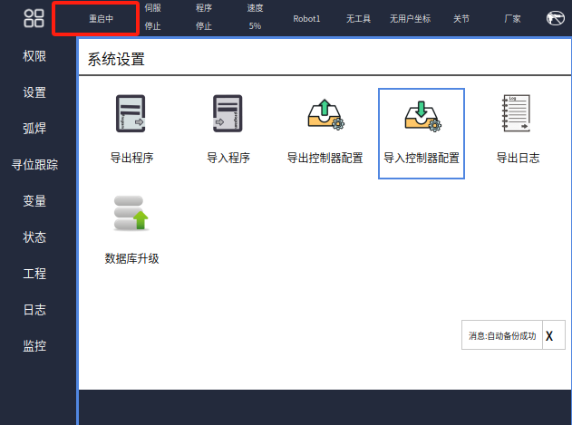

五、导出日志：

插入U盘，点击'导出日志'，会弹出选择导出Log个数的选择框，选择完成后点击'确定'，系统会进行自动导出对应日志数，导入完成后会弹出白条提示，说明日志保存路径，具体如下图所示：

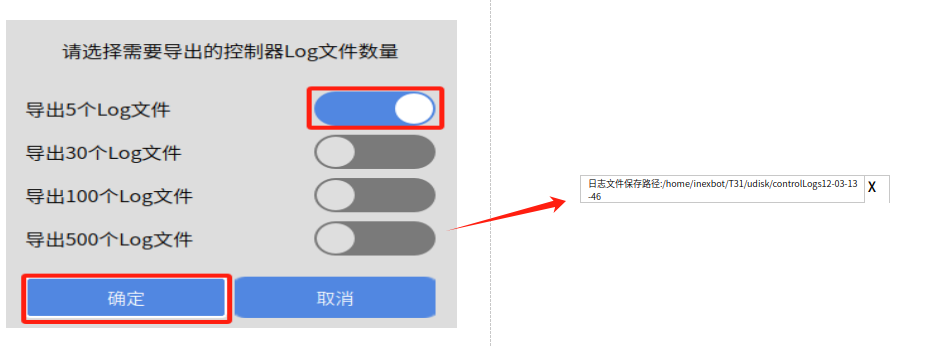

六、数据库升级：

数据库升级一般用于伺服参数、语言包的上传，例如汉语言包'Pinyin.db'等（文件一般放置根目录）

插入有文件的U盘，点击'数据库升级'，选择对应的文件，点击'确定'，再进行二次'确定'，系统会自动导入该文件，升级完成后会在右下角弹出提示，需要手动重启，重启后就能正常使用：

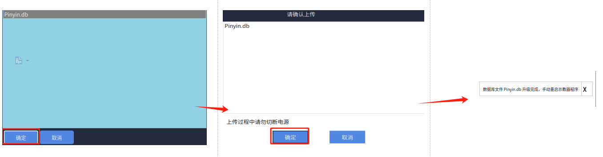

## IO

依次点击"设置_IO\"，进入IO具体功能选择界面，共有"IO配置、IO复位、报警信息、端口名称、状态提示设置、安全设置"等功能。

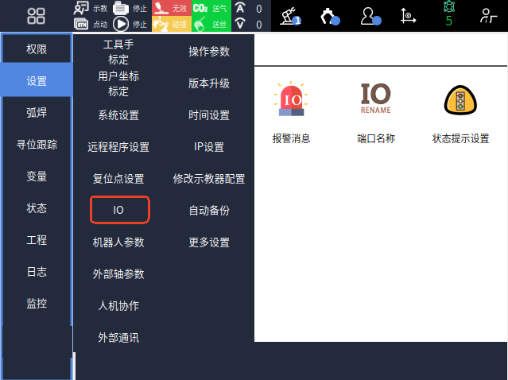

[末尾增加了"远程模式IO预约简要说明"]{.underline}

### IO配置

系统会根据硬件连接顺序自动识别IO型号，无需设置；可用于查看IO板数目及型号。

进入【设置】-【IO】-【IO配置】。

此时输入框为灰色且不能输入数值。

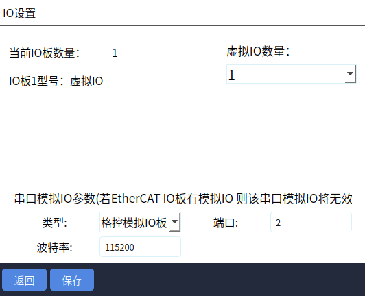

点击修改后，修改按钮变成保存，虚拟IO板数量下拉框选择需要的虚拟IO。

注：虚拟IO仅供程序调试及程序演示使用，并没有任何IO信号接入。

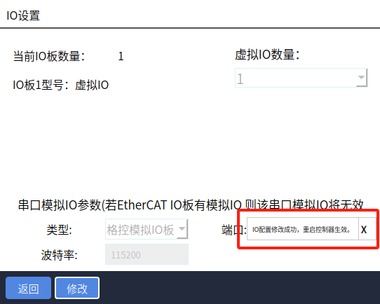

点击保存，重启生效，修改成功。

### IO复位

当程序运行停止或报错时，IO复位功能能使IO的输出端口恢复到初始状态。IO复位分为IO复位、切模式停止、程序报错停止三种。

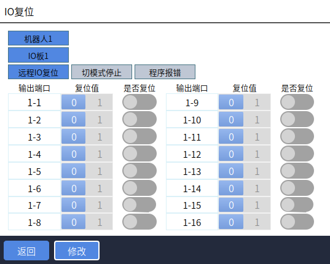

远程IO复位：在远程模式时，给复位信号，机器人执行复位程序回到复位点时，会将该界面设置的IO端口复位到复位值。如果复位程序中途停止了，则不会进行IO复位。

切模式停止：在运行程序时，切换模式到示教或远程模式导致程序停止，会将该界面设置的IO端口复位到复位值。

程序报错：程序发生错误导致程序停止，会将该界面设置的IO端口复位到复位值。具体的错误类型：伺服报错、IO设置的报错、系统运行中的报错。（输出类信息报错以及程序缺少指令等不触发程序报错）

使用步骤：

1.  进入IO复位界面；

2.  选择机器人；

3.  点击进入复位情景（IO复位、切模式停止、程序报错停止）；

4.  选择IO板；

5.  打开需要复位的IO端口对应的"是否复位"开关；

6.  选择复位值（0/1），0为低电平，1为高电平。

### 报警消息

此功能可以自定义IO输入输出端口报警内容，报警信息优先级高于其他类型IO报警信息。

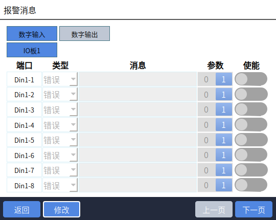

例如：设置IO紧急停止信号端口为15用于接防碰撞IO,
1触发、0解除；则触发DIN1会报
"机器人1IO紧急停止被触发"；此时在报警消息界面找到DIN1，消息栏输入"触发防碰撞"，则再次触发DIN15时报错"触发防碰撞"，不会在报"机器人1IO紧急停止被触发"。

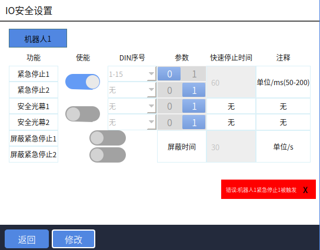

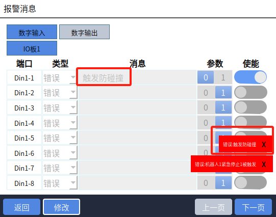

### 端口名称

端口名称最大支持输入5个汉字或者10个英文，设置成功后在使用IO端口相关下拉框选项时会自动显示该名称。

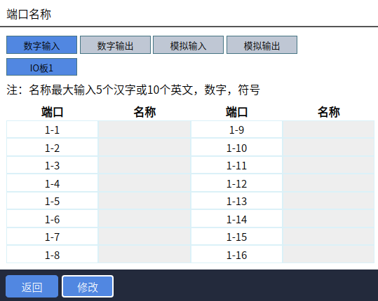

如设置DIN1-1
名称为"使能端口"，则在【状态】的【输入输出】中，会显示DIN1名称"使能端口"。

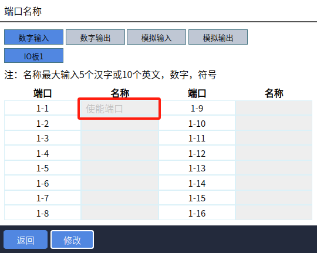

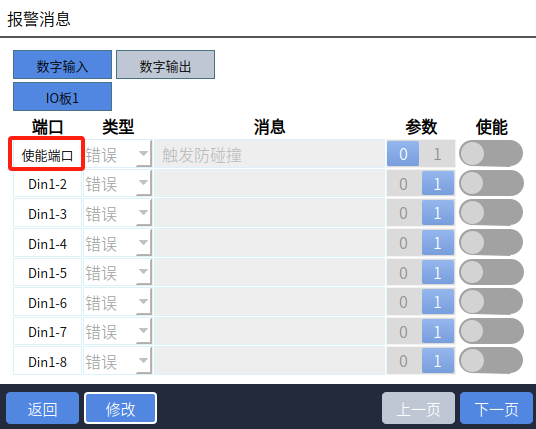

### 状态提示设置

在状态提示设置界面中，可以设置开机提示、机器人运行状态、报错提示、使能、模式状态、紧急停止等功能所对应的I/O
端口与该端口对应的电平。

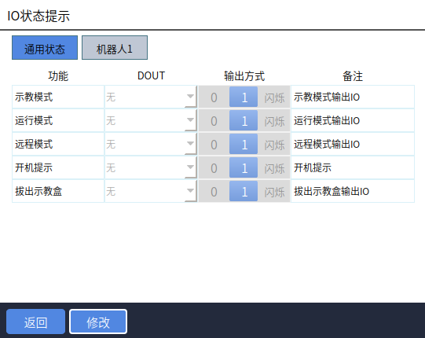

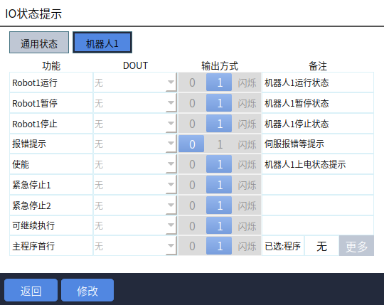

<strong>示教模式：</strong>示教模式时对应端口输出高/低电平。

<strong>运行模式：</strong>运行模式时对应端口输出高/低电平。

<strong>远程模式：</strong>远程模式时对应端口输出高/低电平。

<strong>开机提示：</strong>控制器开机输出状态，开机输出高电平。

<strong>拔出示教盒：</strong>拔出示教盒后对应端口输出高电平或者低电平，可自行设置。

<strong>Robot1运行：</strong>机器人1运行时对应端口输出高/低电平。

<strong>Robot1暂停：</strong>机器人1暂停时对应端口输出高/低电平。

<strong>Robot1停止：</strong>机器人1停止时对应端口输出高/低电平。

<strong>报错提示：</strong>机器人伺服报错时对应端口输出高/低电平，可设置常亮或闪烁。

<strong>使能：</strong>机器人上电时对应端口输出高/低电平。

<strong>紧急停止1：</strong>紧急停止信号触发后对应端口输出高电平或低电平，可自行设置。

<strong>紧急停止2：</strong>紧急停止信号触发后对应端口输出高电平或低电平，可自行设置。

<strong>可继续执行：</strong>对应端口输出一个高电平参数为1的信号，可运行暂停的程序。

<strong>主程序首行：</strong>对应端口输出一个高电平参数为1的信号，程序光标跳至主程序首行。

### 安全设置

在安全设置界面中，可以设置紧急停止、安全光幕、屏蔽紧急停止等功能所对应的I/O
口与该端口对应的电平。

IO紧急停止被解除后，需先点击清错按钮清错，然后才可进行其他操作。

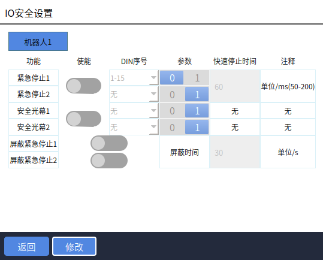

紧急停止：触发紧急停止信号后机器人下电并切至伺服停止。

安全光幕：触发安全光幕机器人暂停，再次按下启动按钮可继续运行。

屏蔽紧急停止：打开后屏蔽时间内，紧急停止信号被屏蔽

### 远程模式IO预约简要说明

信号说明：

<table border="1" style="border-collapse: collapse; width: 100%;">
<tr><td style="text-align: center; vertical-align: middle;">分类</td><td style="text-align: center; vertical-align: middle;">功能</td><td style="text-align: center; vertical-align: middle;">支持模式</td><td style="text-align: center; vertical-align: middle;">触发/输出方式</td><td style="text-align: center; vertical-align: middle;">说明</td></tr>
<tr><td rowspan="12" style="vertical-align: middle;">数字IO输入</td><td style="vertical-align: middle;">启动</td><td style="vertical-align: middle;">远程模式</td><td style="vertical-align: middle;">上升沿</td><td style="vertical-align: middle;">参数为1时，信号0变1时有效</td></tr>
<tr><td style="vertical-align: middle;">停止</td><td style="vertical-align: middle;">远程模式</td><td style="vertical-align: middle;">持续有效</td><td style="vertical-align: middle;">参数为1时，信号持续有效</td></tr>
<tr><td style="vertical-align: middle;">暂停</td><td style="vertical-align: middle;">远程模式</td><td style="vertical-align: middle;">持续有效</td><td style="vertical-align: middle;">参数为1时，信号持续有效</td></tr>
<tr><td style="vertical-align: middle;">清除报警</td><td style="vertical-align: middle;">远程模式</td><td style="vertical-align: middle;">上升沿</td><td style="vertical-align: middle;">参数为1时，信号0变1时有效</td></tr>
<tr><td style="vertical-align: middle;">预约即启动</td><td style="vertical-align: middle;">远程模式</td><td style="vertical-align: middle;">无</td><td style="vertical-align: middle;">打开时，预约成功即上电</td></tr>
<tr><td style="vertical-align: middle;">IO远程程序1-10</td><td style="vertical-align: middle;">远程模式</td><td style="vertical-align: middle;">脉冲（周期0.6s）</td><td style="vertical-align: middle;">参数为1时，信号0-1-0时有效，程序预约成功至少需要触发0.6秒以上。</td></tr>
<tr><td style="vertical-align: middle;">紧急停止1</td><td style="vertical-align: middle;">示教、运行、远程</td><td style="vertical-align: middle;">高电平</td><td rowspan="4" style="vertical-align: middle;">1毫秒扫描一次，扫描到即触发</td></tr>
<tr><td style="vertical-align: middle;">紧急停止2</td><td style="vertical-align: middle;">示教、运行、远程</td><td style="vertical-align: middle;">高电平</td></tr>
<tr><td style="vertical-align: middle;">安全光幕1</td><td style="vertical-align: middle;">运行（运行中）、远程（运行中）</td><td style="vertical-align: middle;">高电平</td></tr>
<tr><td style="vertical-align: middle;">安全光幕2</td><td style="vertical-align: middle;">运行（运行中）、远程（运行中）</td><td style="vertical-align: middle;">高电平</td></tr>
<tr><td style="vertical-align: middle;">屏蔽紧急停止1</td><td style="vertical-align: middle;">配合紧急停止使用</td><td rowspan="2" colspan="2" style="vertical-align: middle;">按钮打开即屏蔽设置时间到后重新检测紧急停止信号</td></tr>
<tr><td style="vertical-align: middle;">屏蔽紧急停止2</td><td style="vertical-align: middle;">配合紧急停止使用</td></tr>
<tr><td rowspan="12" style="vertical-align: middle;">数字IO输出</td><td style="vertical-align: middle;">开机提示</td><td style="vertical-align: middle;">无模式限制</td><td style="vertical-align: middle;">常亮、闪烁，仅在开机输出</td><td style="vertical-align: middle;">输出高电平</td></tr>
<tr><td style="vertical-align: middle;">Robot1运行</td><td style="vertical-align: middle;">示教、运行、远程模式</td><td style="vertical-align: middle;">常亮、闪烁</td><td style="vertical-align: middle;">程序运行时输出高电平</td></tr>
<tr><td style="vertical-align: middle;">Robot1暂停</td><td style="vertical-align: middle;">示教、运行、远程模式</td><td style="vertical-align: middle;">常亮、闪烁</td><td style="vertical-align: middle;">程序暂停时输出高电平</td></tr>
<tr><td style="vertical-align: middle;">Robot1停止</td><td style="vertical-align: middle;">示教、运行、远程模式</td><td style="vertical-align: middle;">常亮、闪烁</td><td style="vertical-align: middle;">程序停止时输出高电平</td></tr>
<tr><td style="vertical-align: middle;">报错提示</td><td style="vertical-align: middle;">无模式限制</td><td style="vertical-align: middle;">常亮、闪烁</td><td style="vertical-align: middle;">常亮输出高电平；闪烁输出脉冲（周期1s,0.5s亮、0.5s灭）</td></tr>
<tr><td style="vertical-align: middle;">使能</td><td style="vertical-align: middle;">无模式限制</td><td style="vertical-align: middle;">常亮、闪烁</td><td style="vertical-align: middle;">输出高电平</td></tr>
<tr><td style="vertical-align: middle;">IO远程程序1-10预约输出</td><td style="vertical-align: middle;">远程模式</td><td style="vertical-align: middle;">常亮、闪烁</td><td style="vertical-align: middle;">未预约/已预约时不亮；预约中时闪烁，周期1.2s，0.6s亮、0.6s灭；运行中时常亮，输出高电平</td></tr>
<tr><td style="vertical-align: middle;">紧急停止1</td><td style="vertical-align: middle;">信号触发时</td><td style="vertical-align: middle;">高电平、低电平、闪烁</td><td style="vertical-align: middle;">参数为1时，输出高电平</td></tr>
<tr><td style="vertical-align: middle;">紧急停止2</td><td style="vertical-align: middle;">信号触发时</td><td style="vertical-align: middle;">高电平、低电平、闪烁</td><td style="vertical-align: middle;">参数为1时，输出高电平</td></tr>
<tr><td style="vertical-align: middle;">拔出示教盒</td><td style="vertical-align: middle;">无模式限制</td><td style="vertical-align: middle;">高电平、低电平、闪烁</td><td style="vertical-align: middle;">点击拔出示教盒，输出1或0</td></tr>
<tr><td style="vertical-align: middle;">可继续执行</td><td style="vertical-align: middle;">信号触发时</td><td style="vertical-align: middle;">高电平、低电平、闪烁</td><td style="vertical-align: middle;">输出一个高电平参数为1的信号，可运行暂停的程序</td></tr>
<tr><td style="vertical-align: middle;">主程序</td><td style="vertical-align: middle;">首行示教、运行、远程模式</td><td style="vertical-align: middle;">高电平、低电平、闪烁</td><td style="vertical-align: middle;">高电平、低电平、闪烁输出一个高电平参数为1的信号，程序光标跳至主程序首行</td></tr>
</table>
注：本说明均是以输出1为输出高电平为例

#### 远程模式状态说明

未预约：进入远程模式后，没有预约过程序，或预约后又取消预约，显示未预约。

预约中：预约成功显示预约中。

运行中：程序正在运行显示运行中。

已预约：程序运行完成或程序被触发停止，显示已预约。

远程模式不能修改速度，速度修改需提前在【设置-远程程序设置】中修改。

预约程序：

触发对应程序的IO口即成功预约程序，取消需再次触发该程序对应的IO口。

启动直接触发对应触发的IO口即可。

预约即启动，信号0-1（按下按钮）0.6秒以上时间后1-0（松开按钮），程序直接运行；预约即启动时启动信号可不设置。

预约的程序运行后可再次预约。

故障排查：

IO功能设置成功后请前往状态-IO功能状态查看是否设置成功或有无冲突功能。

## 人机协作

依次点击"设置_人机协作\"，进入人机协作页面，分别有"动力学参数、力学功能、拖拽示教、自适应加减速度、负载使能"等功能。

（其中"自适应加减速度"功能仅在机型为"六轴串联、 四轴scara、 四轴连杆码垛机器人"时才出现，其他机型没有此功能）

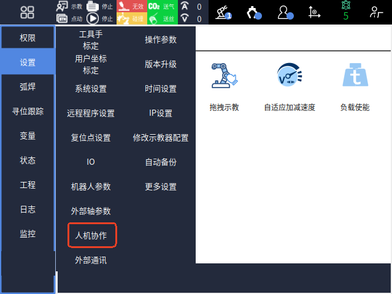

使用说明

1、目前该辨识方法仅适用于六轴机器人空载情况下辨识机器人本体的动力学参数。

2、该辨识方法辨识所得的动力学参数与手填的动力学参数无关。

3、执行辨识前请确保机器人的运动范围内空旷，无障碍物。

4、辨识轨迹参数中，轨迹范围用于调节机器人的辨识轨迹的范围大小，100为辨识轨迹的100%，90为辨识轨迹的90%，以此类推。轨迹速度用于调节机器人执行辨识轨迹时的速度大小，速度为100时运行轨迹时间为10秒，速度为50时运行轨迹时间为20秒，速度为10时轨迹运行时间为100秒，以此类推。

5、辨识轨迹参数选取原则：在确保安全的情况下使得运动范围尽可能大，运动速度尽可能快。

6、辨识结果所得到的误差数值对应于碰撞检测功能中的灵敏度数值。

7、辨识前应先试用低速大范围轨迹参数，点击测试按钮确认机器人运行过程中不会碰到周围环境，若不满足该条件则减小轨迹范围参数，再次低速运行以确保不会碰到周围环境，确认不会碰到周围环境后再把轨迹速度设置为100，点击辨识按钮开始执行机器人参数辨识。

8、辨识工作共执行三次（2207版本十次），，包括运行轨迹，获得数据，分析数据，计算动力学参数等过程，并在每一次完成后把误差数值显示在界面上，整个过程会持续10分钟左右，期间请勿进行任何操作以免影响辨识工作。

安全说明

1、测试轨迹时，机器人会运行两段轨迹，运行1次机器人测试结束前请勿靠近机器人

2、辨识轨迹时机器人会运行两段轨迹，运行10次，每次运行完第一段指令后会进行计算，此时不可以靠近机器人，机器人可能随时会启动。

### 动力学参数

操作步骤

1、设置动力学参数需依次点击"设置-人机协作-动力学参数"，参数调整辨识前需要调整机器人关机参数-关节限位，确保机器正常运动，并且当前位置在【零点】。

2、仔细阅读提示说明，完整的看完提示说明后，点击"已阅读且同意"，点击"开始辨识"，进去具体页面

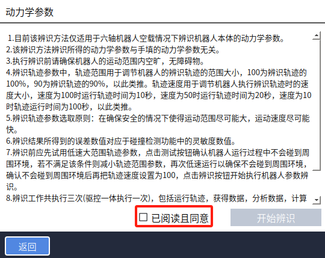

3、进入辨识操作界面后，轨迹范围填10，轨迹速度填10，然后依次点击"确认-测试（确定轨迹完全）"。

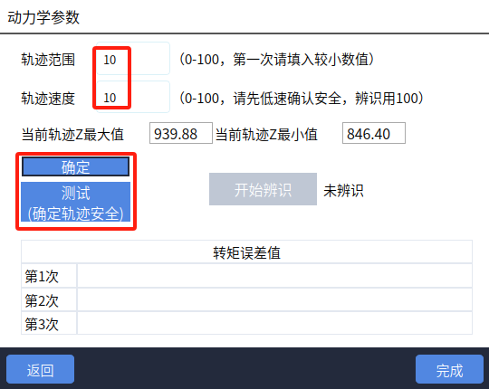

4、当测试安全后根据需要填写轨迹范围，轨迹速度填写'100%'（在更改了轨迹速度后需要重新测试），点击【开始辨识】

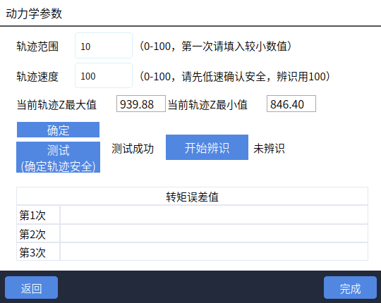

5、在弹出的弹窗点击【确定】，即进入辨识状态

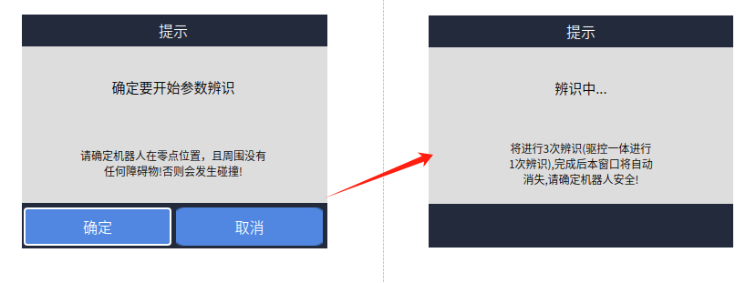

6、辨识完成后会出现转矩误差值并会提示"辨识成功"，即表示辨识完成，点击完成即可

（2207版本的会辨识10次，2403及以上版本的辨识3次）

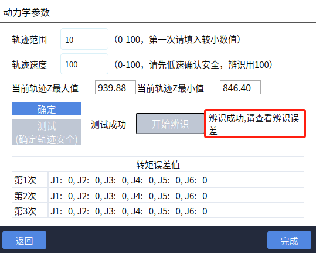

（虚拟辨识，J1-J6数值都为空，真实辨识会有数据）

[在完成这6步后，在"拖拽示教"拖拽方式改为'力矩'，再将"监控中快捷键的示教方式（点动）改为示教方式拖拽"，上电后就能进行机器人拖拽]{.underline}

### 力学功能

设置力学功能需进入"设置/人机协作/力学参数"中进行设置。相关步骤如下：

进入"设置/人机协作/力学参数"页面。选择需要的功能

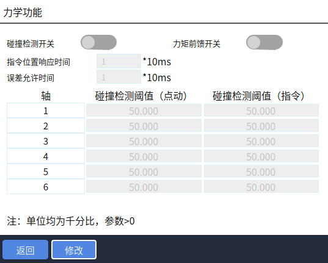

碰撞检测开关：开启后机器人会根据灵敏度对碰撞进行检测，通常需要多试几次找到机器人运行时不会自己判定已发生碰撞的值，然后就可以正常使用；

力矩前馈开关：因为机器人的复杂非线性、时变不确定性、强耦合性(特别是在高速运动时)，要使机器人能以期望的速度和加速度运动，机器人各关节伺服电机必须有足够大的力和力矩来驱动机器人的连杆和关节，否则，连杆将因运动迟缓而影响机器人的定位和轨迹跟踪精度，为此必须建立基于动力学模型的前馈力矩控制。而实时快速地计算前馈补偿力矩；

指令位置响应时间：本体机器人在运行过程中已经碰触到了，但因为设置了这个时间，所以会因为设置的时间从而延时报错；时间到了，报错出现，机器人下电（通俗理解：机器人碰到东西后，故意等一会儿再报警）。

误差允许时间：PID调节导致力矩波动，误触发了碰撞警告，该功能就是防止这种现象出现，在设置的时间内力矩回到正常范围，警报就不会出现（通俗理解：给机器人一个冷静期，短暂异常不算故障）。

碰撞检测阈值（点动/指令)：一到六轴范围都在1到10000之间，包含1和10000。

<<<<<<< HEAD
### 10.3. 拖动示教
=======
### 拖动示教
>>>>>>> 47f3dd7426fb221ba324b10171f40f8f66c2593a

拖到方式可选力矩、3D鼠标

可设置IO信号切换拖拽模式或点动模式，切换还可使用监控"示教方式"按钮。使用IO信号切换至拖拽模式后，⚪形按钮和"示教方式"按钮无效。

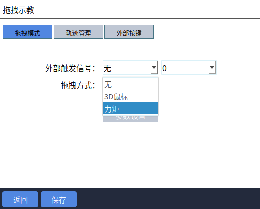

3D鼠标

配件说明

3D鼠标相关配件：

1.  TTL转 RS232转接头，

1.  5V电源，

2.  3D鼠标本体，

3.  线缆收纳盒，

4.  3D鼠标固定板

接线定义：

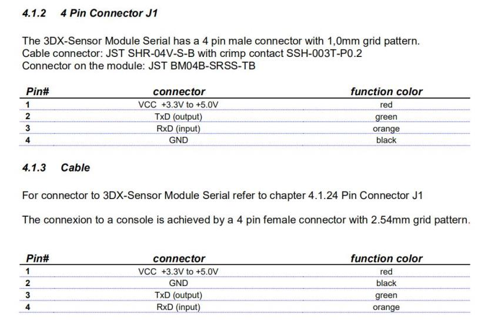

接线图：

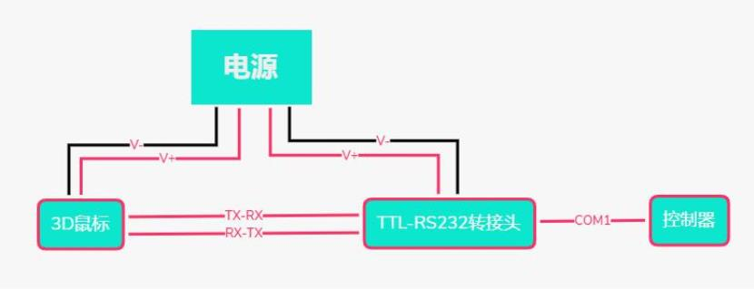

安装：

3D鼠标的安装部件分为 3D鼠标本体，3D鼠标置线盒和固定板。

其中 3D鼠标置线盒用于收纳部分 3D鼠标连接线缆，固定板用于将
3D鼠标安装在机器人末端。将
3D鼠标的组件按上图所示拼接完成后即可安装于机器人末端。同时，3D鼠标也可以不安装在机器人末端使用，但此时拖动起来的方向感不如装于机器人末端直观。

供电设备：外接 5V电源。

接线设置：鼠标转换线插入控制器的 Com1串口且 Com1串口需要支持
RS232通讯即可

直接使用

使用说明及注意事项：

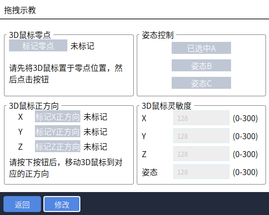

若把 3D鼠标安装在机器人本体上，使用前一定要确认机器

人运行安全方可进行使用！！！！！

标记零点：标记
3D鼠标零位置，未标记表示没有标记过零点，标记后即显示已标记。

用法：点击修改，然后点击标记零点即可完成标记，不需要移动鼠标。

标记正方向：分为标记
X、Y、Z正方向，未标记表示没有标记过方向，标记后即显示已标记。

若按下后通讯失败则显示通讯失败，该情况下方向沿用上次标记的方向。

用法：点击修改，然后点击标记方向按钮，然后按下鼠标对应方向，提示标记方向成功即完

成该方向的标记。

控制姿态：选择选鼠标旋转控制的姿态，可以选择控制姿态 A，B，C。

用法：点击修改，点击对应姿态按钮即可完成选择。

3D鼠标灵敏度：用于控制 3D鼠标控制对应方向和姿态的灵敏度。

用法：点击修改，输入数值，数值范围是 0-300，数字越大灵敏度越高。

首次使用按键顺序：

1.点击修改

2.打开开关

3.标记零点

4.标记 XYZ方向

5.设置灵敏度数值

6.保存

3D鼠标控制机器人运动方法：完成零点设置和方向标记后，通过示教器进行伺服使能，然后按下
3D鼠标对应方向即可控制机器人向该方向运动。
3D鼠标支持机器人在各坐标系下的运动，但方向对应只适用于直角坐标系，其他坐标系下为控制关节单独运动，与直角坐标系下的运动方式不同。

力矩拖拽

注：在执行本节所有操作前请先进行动力学辨识！

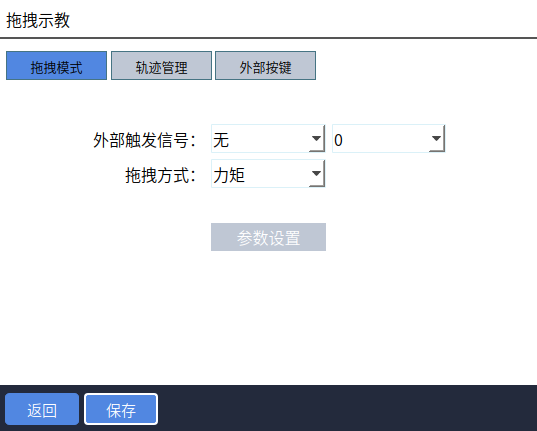

拖拽模式

方式一 ：使用示教器-监控-快捷键-点动方式按钮进行切换

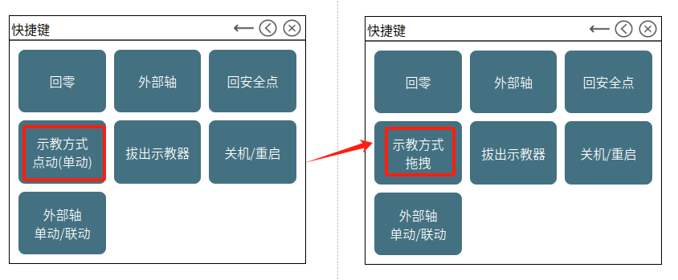

方式二：使用外部信号（DIN输入信号）进行切换

任意方式设置完之后，上电，即可进行拖拽

参数说明

参数设置界面

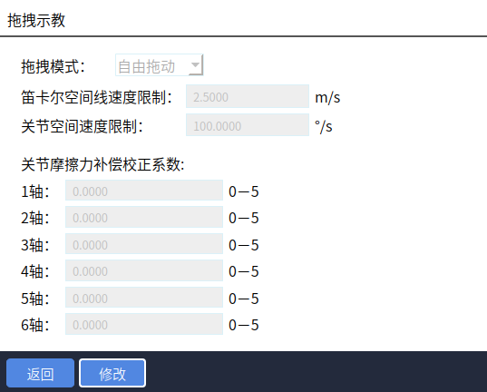

拖拽模式：可以选择自由拖动、位置拖动、姿态拖动三种模式

笛卡尔空间线速度限制：暂时无效

关节空间速度限制：拖动时的最大速度，超过限制后会下电停止

关节摩擦力补偿校正系数：范围0-5，参数越靠近5关节越灵活；建议参数从0开始测试。

轨迹管理

拖拽示教轨迹录制/回放

轨迹录制：点击【开始】进行机器人拖拽，轨迹拖拽完成之后点击【停止】，会提示"轨迹已记录"，输入轨迹名，点击【保存】，再拖拽示教的轨迹管理能看到被记录的轨迹

轨迹回放：

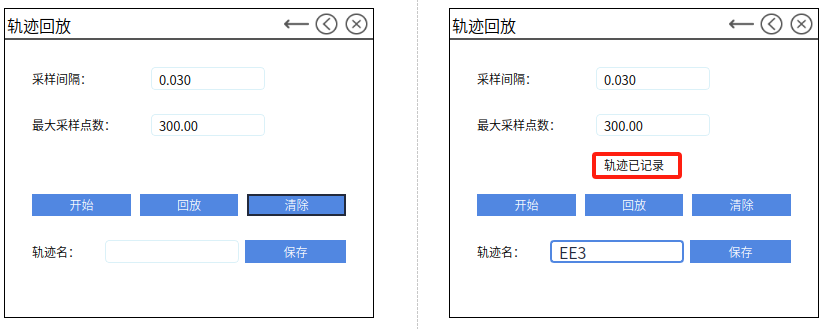

采样间隔：单位s，每个一个采样间隔取一次点位；

最大采样点数：范围200\~12000，记录的一段轨迹的最大点位个数；

清除：删除本次记录的轨迹

轨迹回放：

方式一：仅支持当前录制的轨迹进行回放，在轨迹回放页面点击【回放】，即可回放当前录制的轨迹

方式二：在设置-人机协作-拖拽示教的轨迹管理中进行回放，如下图所示：

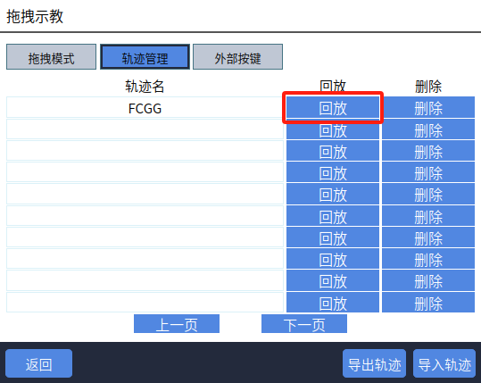

删除：删除当前的轨迹

导出轨迹：将当前所有轨迹一起导出

导入轨迹：

指令

DRAG_TRAJECTORY指令

该指令用于调用轨迹回放记录，目前仅支持以100%速度运行。

该指令的运行速度为拖拽速度x回访速率，状态栏速度不影响该指令速度。

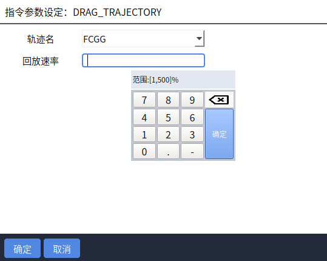

外部按键

如下图所示：

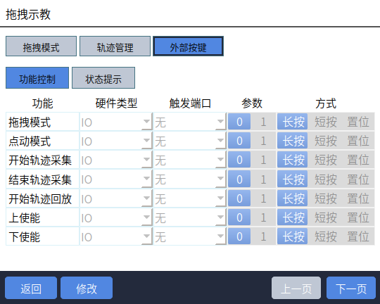

功能控制

参数生效方式为0和1。

1.触发方式为长按：

触发IO 3-10s后生效，0有效时，IO状态为1-0-1，1有效时，IO状态为0-1-0。

2.触发方式为短按：

触发IO 0-3s内生效，0有效时，IO状态为1-0-1，1有效时，IO状态为0-1-0。

3.触发方式为置位：

置位方式的IO信号是持续触发的，正常使用应该选择功能对立的情况上使能1生效，下使能0生效，绑定同一个端口，方式选择置位。

例如：上使能触发端口1-1，参数1有效，下使能触发端口1-1，参数0有效，当1-1口为1时上使能，1-1口为0时下使能。

注意事项：选择置位，选择的功能对立时，必须第一个参数选择1，第二个参数选择0。

例如：上使能和下使能功能对立，置位时上使能参数必须选1，下使能选0，如果上使能参数选0，下使能选1的话功能不生效。

<table border="1" style="border-collapse: collapse;">
<tr><td style="text-align: center; vertical-align: middle;">功能</td><td style="text-align: center; vertical-align: middle;">示例说明</td></tr>
<tr><td rowspan="3" style="vertical-align: middle;">拖拽模式</td><td rowspan="3" style="vertical-align: middle;">示例：IO端口1-1，触发1-1信号，示教模式切换为拖拽模式  注意：机器人必须辨识成功后才可以切换为拖拽模式进行拖拽操作</td></tr>
<tr></tr>
<tr></tr>
<tr><td style="vertical-align: middle;">点动模式</td><td style="vertical-align: middle;">示例：IO端口1-2，触发1-2信号，示教模式切换为示教模式  注意：切换为点动模式后才可以对拖拽模式下进行的轨迹回放</td></tr>
<tr><td style="vertical-align: middle;">开始轨迹采集</td><td style="vertical-align: middle;">示例：IO端口1-3，触发1-3信号，开始拖拽机器人  此处的开始轨迹采集信号相当于监控-轨迹回放界面的开始按钮</td></tr>
<tr><td style="vertical-align: middle;">结束轨迹采集</td><td style="vertical-align: middle;">示例：IO端口1-4，触发1-4信号，停止轨迹采集且采集的轨迹被记录  此处的结束轨迹采集信号相当于监控-轨迹回放界面的停止按钮</td></tr>
<tr><td style="vertical-align: middle;">开始轨迹回放</td><td style="vertical-align: middle;">示例：IO端口1-5，触发1-5信号，回放采集的轨迹  此处的开始轨迹回放信号相当于监控-轨迹回放界面的回放按钮
  注意：轨迹回放时需要将示教模式切换为点动模式，拖拽模式下无法回放轨迹</td></tr>
<tr><td style="vertical-align: middle;">停止轨迹回放</td><td style="vertical-align: middle;">示例：IO端口1-6，触发1-6信号，停止回放采集的轨迹</td></tr>
<tr><td style="vertical-align: middle;">上使能</td><td style="vertical-align: middle;">示例：IO端口1-7，触发1-7信号，伺服上电</td></tr>
<tr><td style="vertical-align: middle;">下使能</td><td style="vertical-align: middle;">示例：IO端口1-8，触发1-8信号，伺服下电</td></tr>
<tr><td style="vertical-align: middle;">夹爪开</td><td style="vertical-align: middle;">示例：IO端口1-9，触发1-9信号，夹爪打开</td></tr>
<tr><td style="vertical-align: middle;">夹爪关</td><td style="vertical-align: middle;">示例：IO端口1-10，触发1-10信号，夹爪关闭</td></tr>
<tr><td style="vertical-align: middle;">保存轨迹</td><td style="vertical-align: middle;">示例：IO端口1-10，触发1-10信号，轨迹采集结束后触发保存轨迹信号，轨迹被保存  此处的保存轨迹信号相当于监控-轨迹回放界面的保存按钮</td></tr>
<tr><td style="vertical-align: middle;">保存后清除轨迹</td><td style="vertical-align: middle;">不清除：轨迹采集结束，触发保存轨迹信号，触发轨迹回放信号，开始回放采集的轨迹  清除：轨迹采集结束，触发保存轨迹信号，触发轨迹回放信号，无法回放采集的轨迹</td></tr>
<tr><td style="vertical-align: middle;">快捷指令</td><td style="vertical-align: middle;">当触发对应IO时，在当前所选择的作业文件中插入对应指令（当指令为运动类指令时，则以机器人当前点位插入运动类指令），插入的指令都在作业文件的最末端  （例如：选择的指令为点到点，IO端口1-11，触发1-11信号时会在当前打开的作业文件插入点到点指令)  指令插入成功后会弹出小白条：指令插入成功  如果在没有打开任何作业文件的情况下触发信号后报错（未打开作业文件指令插入失败）</td></tr>
</table>
状态提示

对应功能设置触发端口和参数后，当功能满足输出条件时IO会根据设置的触发端口以及参数类型输出提示。

示例：功能拖拽模式，触发端口1-1，参数选择1，当示教模式切换为拖拽模式时IO
1-1端口由低电平0-高电平1。

说明：部分没有抱闸的机器人可以在伺服停止,就绪,报错的状态下记录轨迹，例如四轴SCARA，不需要辨识，可以直接开始进行拖拽，轨迹回放时需要上使能。

### 自适应加减速度

(自适应加减速度只在"六轴串联、四轴scara、四轴连杆码垛机器人这三种机型中出现）

自适应加减速使能开启后可以保护电机，防止电机运动时转矩过大。

设置自适应加减速需进入"设置/人机协作/自适应加减速度"中进行设置，相关步骤如下：

1.  根据自己的需求填写相应的参数，打开使能开关后生效。

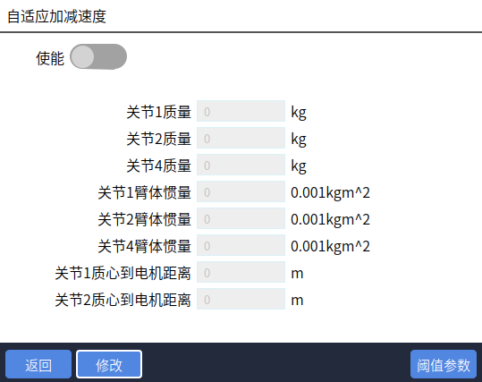

1.  阈值参数

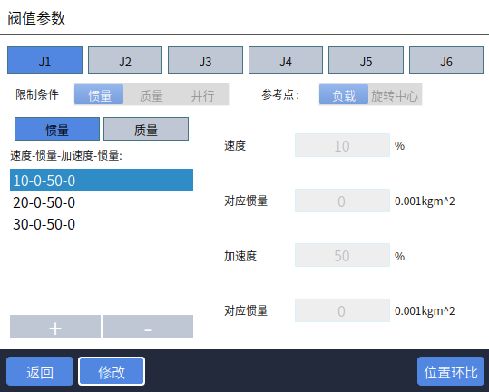

条件分别：惯量、质量、并行（并行指惯量和质量两者相乘限制），就是指通过质量控制，惯量控制还是一起控制。

参考点：负载，旋转中心。\
注：设置的阈值负载值，会自动形成区间范围。如图所示虽然没有设置0.1对应的加速度，但在0到0.12区间内会根据区间分配等比例的加速度。如果超过0到0.12区间，如0.13会按照最大值0.12对应的加速度计算。

阈值参数应用是想设置好后，我只需要再工具手上修改负载就可以匹配到阈值参数对应的加速度。怎么设置就看你这个负载想跑什么加速度，如：10kg，我跑10%，1kg，我跑90%这样。然后我再工具手写10kg或1kg可以跑到对应的速度。

1.  位置环比，如图：

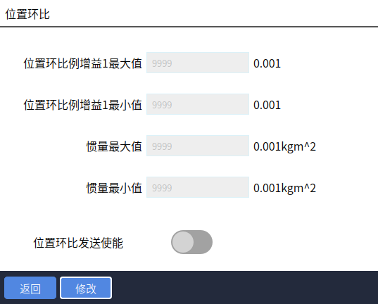

位置环比参数的填写：需要看实际伺服和本体，因为位置环增益越高有可能抖。一般是调机后得出最大值和最小值再填写；惯量的最大值最小值看负载是多少就多少。

### 负载使能

负载拖拽示教

1.  根据动力学参数流程进行辨识。

2.  辨识成功结束后安装负载。

3.  拖拽示教界面设置好参数，拖动方式可选力矩、3D鼠标。

4.  切换拖拽模式或点动模式可使用示教器。

<table border="1" style="border-collapse: collapse;">
<tr><th style="background-color: #d3d3d3; text-align: center;">注释</th></tr>
<tr><td style="vertical-align: top; text-align: center; padding: 8px;"></td></tr>
<tr><td style="vertical-align: top; padding: 8px;">
使用IO信号切换至拖拽模式后，
  
"示教方式"按钮无效。
</td></tr>
</table>
1.  最后再设置负载使能参数，（负载参数分别在工具手界面和负载使能界面设置）打开负载使能开关，保存之后将示教器从点动模式切换成拖拽模式，上电后即可进行拖拽。

2.  负载使能界面设置如下：设置------人机协作------负载使能。

负载使能：是否启用负载功能，开启负载使能后，系统会根据所选负载编号下的负载参数计算机械臂运行时的带载转矩。

额定转矩：各个关节电机的额定转矩（可参考伺服参数里面的额定转矩）。

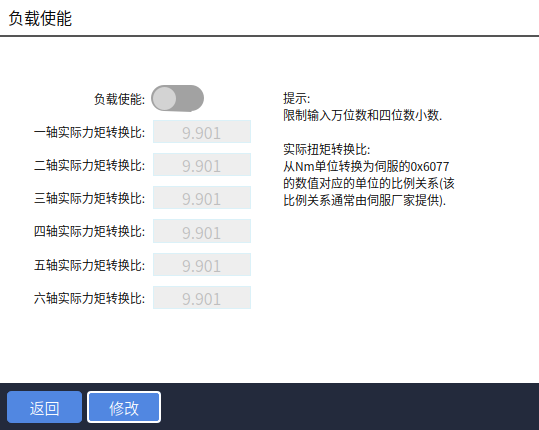

1.  工具手界面设置如下：设置------工具手标定。

负载编号（即工具手编号）：工具手号就是负载编号。

负载质量：机器人末梢负载总质量。

负载惯量：负载的转动惯量。

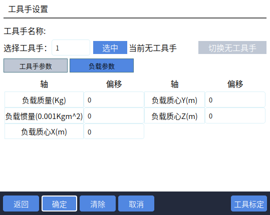

以下XYZ均以末端坐标系作为参考（末端坐标系坐标轴确认方法：在无工具手情况下，在工具坐标系下走TX，TY，TZ即可确认XYZ的方向）：

X：以法兰中心为起点，负载质心沿X方向的偏移（距离）。

Y：以法兰中心为起点，负载质心沿Y方向的偏移（距离）。

Z：以法兰中心为起点，负载质心沿Z方向的偏移（距离）。

XYZ补充说明：建议安装负载后，在机器人的零点位置，调整六轴零点，使负载质心在机器人正前方，此时X为负载质心与六轴中心的水平距离，Z为负载质心与六轴中心的竖直距离，Y为0。

<table border="1" style="border-collapse: collapse;">
<tr><th style="background-color: #d3d3d3; text-align: center;">注释</th></tr>
<tr><td style="vertical-align: top; text-align: center; padding: 8px;"></td></tr>
<tr><td style="vertical-align: top; padding: 8px;">
以上具体参数可咨询厂商。
</td></tr>
</table>
 

## 弧焊

竖版焊接示教器的主要功能就是焊接，焊接的相关设置在'弧焊'部分，共有"焊机设置、焊接IO、电流电压匹配、焊接参数、焊接装备、焊接参数、相贯线、手动操作"

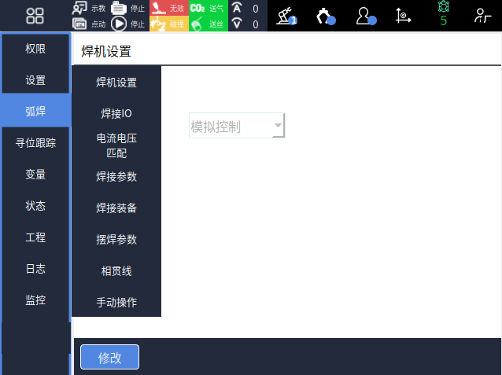

### 焊机设置

焊机设置需进入"弧焊/焊机设置"中修改。

步骤如下：

1.  进入"工艺/焊接工艺/焊机设置"页面。

两种控制焊机方式：

①模拟控制：全称模拟量焊机，是指通过IO模拟量来控制的焊机。如下图：

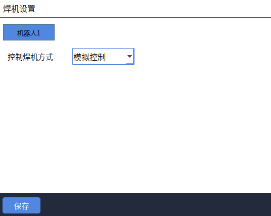

②数字控制：根据工业现场实际需要设置。

点击修改选择控制焊机方式，如图：

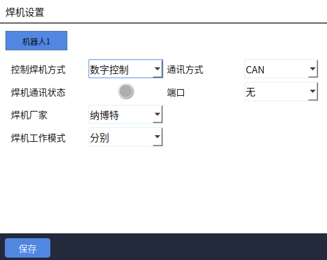

数字焊机的四种通讯方式：CAN、ModBus RTU、ModBus TCP。

选择ModBus RTU时，需要填写从站ID、端口号、波特率；

选择ModBus TCP时，需要填写IP、端口号。

焊接通讯状态：灰色表示没有通讯成功，绿色为通讯成功。

焊接电源厂家：纳博特、麦格米特、深威智能、奥太、美佳尼克、瑞凌、肯倍F15、EWM、福尼斯、和宗。

注：选择瑞凌时，需要在【材料/丝径/气体】选择填写参数。

焊机工作模式：一元化模式、分别模式。

### 焊接 IO 设置

焊接 IO 设置需进入"弧焊/焊接 IO "中修改。相关步骤如下：

1.  进入"弧焊/焊接IO"页面。

2.  点击修改后，修改按钮变成保存，可以在各自的功能后面选择对应的IO端口。

#### 数字输入：

界面如图所示：

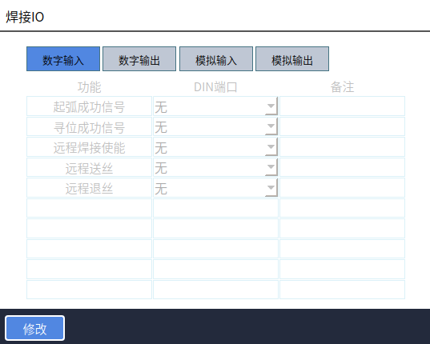

参数介绍：

起弧成功信号：设置这个信号是用来检测是否成功起弧，在执行焊接开始指令时，需要给起弧信号，如果起弧信号超过设置的焊接检测时间，会报错（焊接起弧信号超时）。

寻位成功信号：在电弧寻位中需要设置寻位成功信号（需要的信号可以自己选择端口）。

1.  使用方法 ：
    电弧寻位中，找两根单芯线，其中一根线的一端接IO输出端1-5（寻位模式信号），另一端接铁板；

2.  另一根线接IO输入端1-6（寻位成功信号），另一端接工具手末端；

3.  在电弧寻位中，打开输出口1-5，当工具手末端碰到铁板时，设置的1-6输入信号就由低电平变为高电平。

远程焊接使能：设置该信号后可以通过输入设定信号打开焊接使能。

远程退丝：设置该信号后可以通过输入设定信号进行退丝。

远程送丝：设置该信号后可以通过输入设定信号进行送丝。

#### 数字输出：

界面如下：

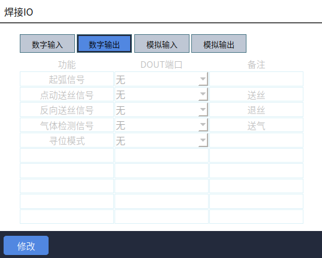

参数介绍：

起弧信号：准备起弧时，系统会给焊机下发输出信号。

点动送丝信号：焊机送丝。打开对应的信号端口时，在焊接监控窗口上同步显示：手动操作-送丝开关打开。

反向送丝信号：焊机退丝时IO板给出对应的输出信号。

气体检测信号：送气泵送气时IO板给出对应的输出信号。

寻位模式：代表焊机进入寻位模式，机器人运动时，当焊丝触碰到工件时，焊机给寻位成功信号。

1.  使用方法：电弧寻位中，找两根单芯线，其中一根线的一端接IO输出端1-5（寻位模式信号），另一端接铁板。

2.  另一根线接IO输入端1-6（寻位成功信号），另一端接工具手末端。

3.  在电弧寻位中，打开输出口1-5，当工具手末端碰到铁板时，设置的1-6输入信号就有低电平变为高电平。

#### 模拟输入：

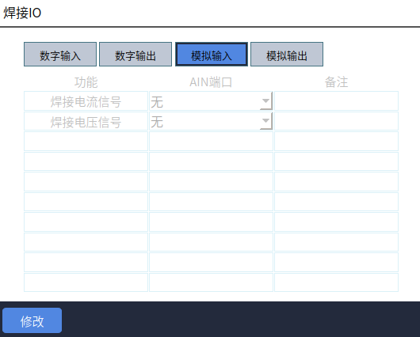

焊接电流信号：模拟焊机电流的输入信号。

焊接电压信号：模拟焊机电压的输入信号。

#### 模拟输出：

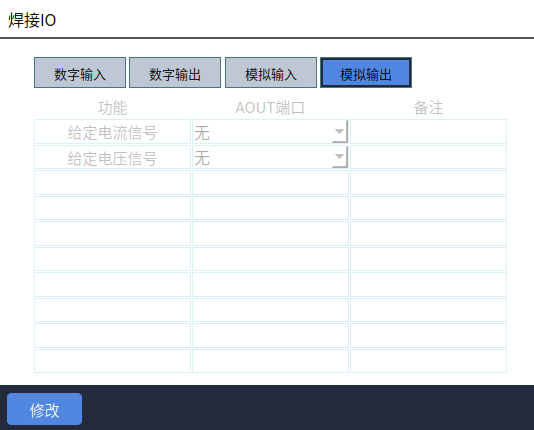

给定电流信号：给定电流的信号。

给定电压信号：给定电压的信号。

焊接时序图如下所示：

### 电流电压匹配

设置焊接电压电流需进入"弧焊/电流电压匹配"中修改。相关步骤如下：

1.  进入"弧焊/电流电压匹配"页面（注：选择数字焊机时，该页面隐藏）。

2.  此时电流电压输入框不能输入数值。点击修改后，修改按钮变成保存，可以在各自的参数后面输入数值。

电流控制匹配界面参数设置步骤：

将控制器和焊机连上，打开示教器界面如图所示：

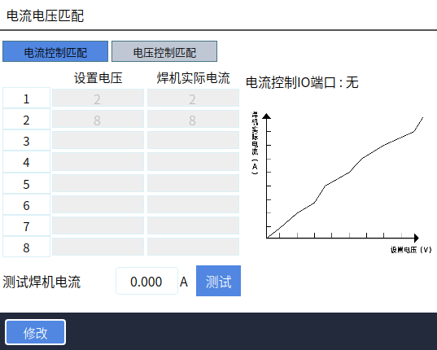

设置电压：指IO监控里的模拟输出的值。

焊机实际电流：焊机实际输出的电流，在焊机上面显示。

测试焊机电流：在设置电压栏和焊接实际电流栏填写好数值，测试焊机电流框输入数值，点击测试，会计算出来一个值。

这个值是通过图上填写的电压和焊机实际电流值计算出来一个比例系数，按照图上填写的值计算出来的比例系数是2
。

此时测试焊机电流填写的是5A,点击测试后，选中的模拟输出端口通过比例系数计算出电流值2.5。

注：焊机电流AOUT端口的输出上限10，大于10时按照上限执行；焊机电流AOUT端口下限小于0时按照下限执行。

电压控制匹配界面参数设置步骤：

将控制器和焊机连上，打开示教器界面如图所示：

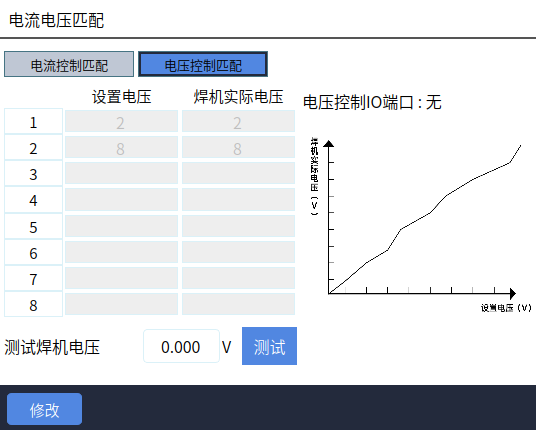

图中函数为修改控制器发送给焊机的电压、电流与焊机实际的电压、电流比例关系。

设置电压：指IO监控里的模拟输出的值。

焊机实际电压：焊机实际输出的电压，在焊机上面显示。

测试焊机电压：在设置电压栏和焊接实际电压栏填写好数值，测试焊机电压框输入数值，点击测试，会计算出来一个值。

这个值是通过图上填写的电压和焊机实际电流值计算出来一个比例系数，按照图上填写的值计算出来的比例系数是3
。

此时测试焊机电压填写的是9V,点击测试后，选中的模拟输出端口通过比例系数计算出数值3。

注：焊机电压AOUT端口的输出上限10，大于10时按照上限执行；焊机电压AOUT端口下限小于0时按照下限执行。

连接焊机时电流电压匹配操作步骤：

电流电压匹配做多段匹配：电流电压匹配分多段，可以是1～8任意几段。

操作步骤如下：

1.选择电流控制匹配。

2.第1行设置电压填1，查看焊机上现在的电流值，把看到的电流值填到第一行焊机实际电流里；

3.第2行设置电压填3，查看焊机上现在的电流值，把看到的电流值填到第二行焊机实际电流里；

4.重复上述操作，直至把8行设置完（如只做1段匹配，设置1、2行即可）；

5.测试焊机电流填220，查看焊机电流是否为220；

6.点击保存，修改成功。该功能参数保存1份即可，无工艺号。

### 焊接参数设置

设置焊接参数需进入"弧焊/焊接参数设置"中修改。相关步骤如下：

1.  进入"工艺/焊接工艺/焊接参数设置"页面；

2.  点击修改，修改按钮变成保存，此时工艺号可以选择，起弧参数、焊接参数、收弧参数值可以修改；

例如:若起弧电流=10、起弧电压=8，焊接电流=15、焊接电压=20，收弧电流=10、收弧电压=15。

1.  打开起弧渐变使能，设置起弧渐变时间1秒，起弧渐变方式选择【时间渐变】；

2.  打开收弧渐变使能，设置收弧渐变时间1秒，起弧渐变方式选择【时间渐变】。

执行效果：给起弧信号后起弧电流到达10A、起弧电压8V，设置了起弧渐变时间1秒，因此在1秒之内电流电压值从起弧电流电压逐渐变为焊接电流15A，焊接电压20V进行焊接，设置了收弧渐变1秒，所以在1秒之内电流电压值会逐渐从焊接电流电压变为收弧电流电压。

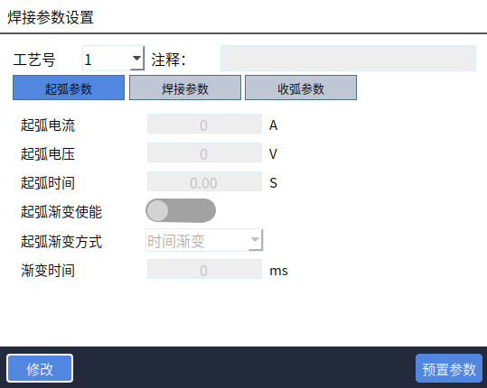

<strong>工艺号：</strong>焊丝有多种选择，碳钢焊丝、低合金结构钢焊丝、合金结构钢焊丝、不锈钢焊丝和有色金属焊丝，不同的焊丝需要的起弧电压、起弧电流、起弧时间、焊接电压、焊接电流、灭弧电压、灭弧电流、灭弧时间、都是不一样的，故可以设置
1-99个不同的焊接参数，后期只需要调用就可以。

<strong>注释：</strong>可以给此工艺号添加注释标明其作用。

<strong>起弧电流：</strong>从加热焊丝时施加的电流。

<strong>起弧电压：</strong>从加热焊丝时施加的电压。

<strong>起弧时间：</strong>确认起弧成功后以起弧电流电压维持焊接的时间；

例如起弧电流=20A，起弧电压=10V,等待时间是1秒，表示确认起弧成功后以起弧电流电压维持一秒的焊接时间。

<strong>起弧渐变使能：</strong>控制从起弧电流电压渐变到焊接电流电压的时间。

<strong>起弧渐变方式：</strong>时间渐变。

<strong>渐变时间：</strong>从起弧电流电压渐变到焊接电流电压的时间；

起弧渐变时间设置了2秒，在这两秒之内电流电压值会从起弧电流电压渐变到焊接电流电压，而不是直接到达设定的焊接电流电压。

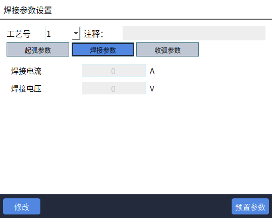

焊接电流：焊接时施加的电流。焊接时，流经焊接回路的电流，是送丝速度和熔化速度平衡的结果。

焊接电压：焊接电压即电弧电压，提供焊接能量和焊接质量。

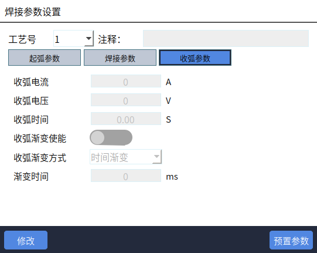

收弧电流：在焊接中需要灭弧时灭弧器给出的电流。

收弧电压：指保证避雷器能够在工频续流第一次过零值时灭弧的条件下，允许加在避雷器上的最高工频电压。灭弧电压应大于避雷器工作母线上可能出现的最高工频电压，否则避雷器可能因不能灭弧而爆炸。

收弧时间：机器人到达灭弧点后以收弧电流电压维持焊接的时间。

例如：收弧时间是1秒，表示机器人到达灭弧点后以收弧电流电压维持1S的焊接时间，然后焊接结束。根据不同的灭弧介质灭弧的时间不同，一般为秒级。

收弧渐变使能：控制从焊接电流电压渐变到收弧电流电压的时间
（注：渐变使能打开之后下面的渐变参数才会起作用）。

收弧渐变方式：时间渐变。

渐变时间：从焊接电流电压渐变到收弧电流电压的时间。

设置了收弧渐变时间是2秒，那么在2秒之内电流电压值从焊接电流电压逐渐变为收弧电流电压。而不是直接从焊接电流电压变为收弧电流电压。

### 焊接装备设置

设置焊接装置需进入"弧焊/焊接装备设置"中修改。相关步骤如下：

进入"工艺/焊接工艺/焊接装备设置"页面，如下图所示。

点击"修改"，修改按钮变成保存，点击下面的选择框，选择自己所需要的功能。

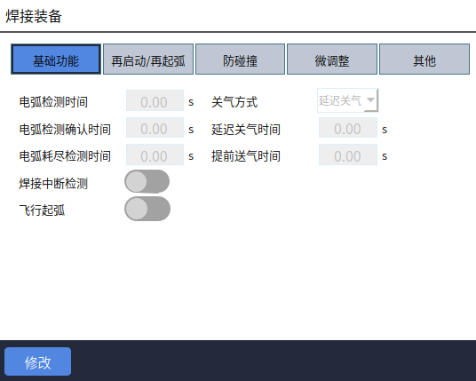

基础功能

电弧检测时间：发出起弧信号到系统收到焊机发出的起弧成功的时间！如果在这个时间内系统没收到起弧成功，系统会发出起弧信号超时的报错（注：电弧检测时间要大于电弧检测确认时间）。

电弧检测确认时间：防止有灰尘等障碍物而发生扰乱信号，故延时一段时间以确保电弧有信号传输，在这段时间里持续检测到起弧成功信号则开始焊接。

电弧耗尽检测时间：灭弧开始到真正灭弧结束的时间。

例如：设置的电弧耗尽检测时间是2秒，表示灭弧开始到灭弧真正结束的时间是2秒，在焊接结束后如果起弧信号还一直在给的话，会报灭弧失败。

延迟关气时间：焊接结束，灭弧信号发出后，焊丝尚未冷却，如果此时就停止送保护气体，氧化依然会发生，故气体需要延迟关闭，并且还有冷却焊枪的功能。

设置延迟关气1s，焊接完成后在【监控】-【IO状态-数字输出】界面可以看到设置的送气信号会延迟1S再关闭。

提前关气时间：收弧前执行结束送气的时间参数。

设置提前关气1s，焊接完成后在【监控】-【IO状态-数字输出】界面可以看到设置的送气信号会提前1S关闭。

飞行起弧：机器人从安全点向焊接起始点移动过程中便开始执行起弧，开始提前送气。

提前送气时间：焊接时，为防止焊丝被空气氧化，可能需要提前送气吹掉焊枪周围的空气，减少焊接的焊缝出现气孔，让焊接的焊缝看起来更加平整光滑。

如上图所示：W1表示安全点，P001表示焊接开始点，P002表示焊接结束点，P001-P002表示焊接的距离。

打开飞行起弧：

当设置的送气时间小于安全点到焊接起始点的时间。

例如：设置提前送气时间4s,机器人从W1到焊接起始点P001需要10s。

执行效果：W1 移动到 P001 需要 10s，第6s 时，机器人开始送气，10s 时到达
P001 点，同时开始起弧。

当设置的送气时间大于于安全点到焊接起始点的时间。

例如：设置提前送气时间4s,机器人从W1到焊接起始点P001需要2s。

执行效果：W1 移动到 P001 需要2s，移动到 P001后机器人会在 P001 停留2s，4s
时才会起弧。

关闭飞行起弧：

关闭飞行起弧：从安全点移动到焊接起始点后，开始提前送气。

例如：关闭飞行起弧，提前送气时间4S。

执行效果：机器人从 W1 点（安全点）移动到焊接起始点 P001 后，开始送气，4s
时，机器人才会起弧。

再启动/再起弧

界面如图所示，其中再启动模式分为自动再启动、半自动再启动与停机。

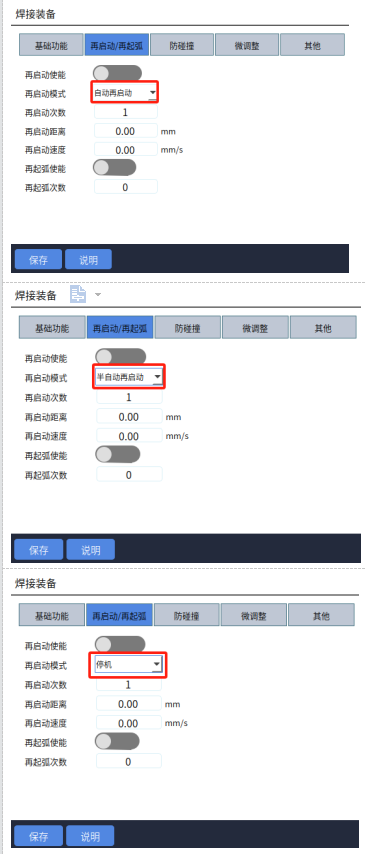

界面参数介绍：

再启动使能：再启动使能，发生断弧时给起弧信号时才有效。

自动再启动：检测到发生断弧后，伺服和程序都是在运行状态，在设置的电弧检测时间内，再次给起弧信号，程序继续运行。

半自动再启动：检测到发生断弧后，伺服在运行状态，程序在暂停状态，此时需要手动点击启动按键，在设置的电弧检测时间内，再次给起弧信号，程序继续运行

停机：检测到发生断弧后，伺服在就绪状态，程序在停止状态，发生断弧后需要清错，然后手动点击启动按键，给起弧信号。

再启动距离：再启动动作回退的距离。

再启动速度：再启动动作回退时的速度，当速度为0时不会回退。

再起弧使能：首先发信号让焊机起弧，若起弧失败在原地再次执行起弧动作，若起弧成功正常执行焊接-若设置的次数内还未起弧成功，则停机报错。

再起弧次数：当前焊机开始、焊接结束区间内执行再启弧的最多次数，超过将不再执行再启动。

设置的再起弧次数为2次，发生断弧后，给起弧信号超过2次的均未起弧的话，会报错。

<table border="1" style="border-collapse: collapse;">
<tr><td colspan="2" style="vertical-align: middle;">再启动功能（注：使用此功能需要打开基础功能中的焊接中断检测）</td></tr>
<tr><td colspan="2" style="vertical-align: middle;">焊接轨迹P001-P002 焊接开始点P001,焊接结束点P002</td></tr>
<tr><td style="vertical-align: middle;">自动再启动,再启动距离20mm,启动距离20mm</td><td style="vertical-align: middle;">执行效果：  焊接开始后机器人从P001向P002移动，发生断弧后，控制器警告（检测到焊接发生断弧），此时伺服和程序都是在运行状态  从P001向P002移动过程发生断弧，机器人会以你设置的再启动距离和  再启动速度参数在断弧的点位以15mm/S的速度移动20mm，到达回退距离后重新给起弧信号，机器人又执行焊接操作</td></tr>
<tr><td style="vertical-align: middle;">半自动再启,再启动距离20mm动,启动距离20mm</td><td style="vertical-align: middle;">执行效果：  焊接开始后机器人从P001向P002移动，发生断弧后，控制器警告（检测到焊接发生断弧），此时伺服运行状态，程序为暂停状态，并且会有一个发生断弧的弹窗提示  从P001向P002移动过程发生断弧，点击弹窗提示框的确认按钮，然后再点击启动按键，机器人会以你设置的再启动距离和再启动速度参数在发生断弧的点位以15mm/S的速度移动20mm，到达回退距离后重新给起弧信号，机器人又执行焊接操作</td></tr>
<tr><td style="vertical-align: middle;">停机,再启动距离20mm,再启动速度15mm/s</td><td style="vertical-align: middle;">执行效果：  焊接开始后机器人从P001向P002移动，发生断弧后，控制器报错（检测到焊接发生断弧），此时伺服就绪状态，程序为停止状态，并且会有发生断弧的弹窗提示。  从P001向P002移动过程发生断弧，报错后先点击清错按键，然后点击弹窗提示框的确认按钮，然后再点击启动按键后会再次有一个弹窗提示（断点执行，首行运行）  .选择断点执行的效果：机器人会以你设置的再启动距离和再启动速度参数在发生断弧的点位以15mm/S的速度移动20mm，到达回退距离后重新给起弧信号，机器人又执行焊接操作  2.选择从首行运行的效果：机器人会从头开始执行焊接操作</td></tr>
<tr><td style="vertical-align: middle;">再启动次数</td><td style="vertical-align: middle;">发生断弧时，能够给的起弧信号的次数  执行效果：设置再启动次数为3，发生断弧后起弧信号最多可以给三次，当第四次再给起弧信号时控制器会报错（检测到焊接发生断弧）</td></tr>
</table>

防碰撞

界面如下图所示：

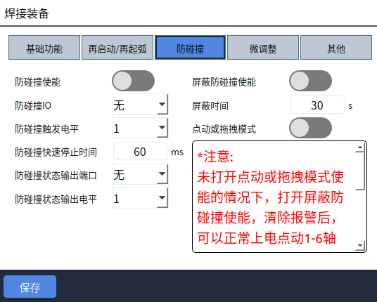

界面参数介绍：

防碰撞使能：打开使能检测防碰撞信号。

防碰撞IO：发生碰撞时的IO输入信号。

防碰撞触发电平：1-高电平，0-低电平。

防碰撞快速停止时间：触发防碰撞到机器人停止所需的时间。

设置的防碰撞快速停止时间是60ms,那么在发生碰撞后机器人从工作到停止的时间是60ms。

防碰撞状态输出端口：触发防碰撞时指定的IO输出口输出信号。

防碰撞状态输出电平选择1，设置的IO输出端口设置的是1-2口，当发生碰撞时输出端口1-2口会从低电平0-高电平1。

防碰撞状态输出电平选择0，设置的IO输出端口设置的是1-2口，当发生碰撞时输出端口1-2口会从高电平1-低电平0。

防碰撞状态输出电平：1-高电平，0-低电平。

屏蔽防碰撞使能：

当焊枪发生碰撞后，控制器报错（焊枪防碰撞被触发）。

此时无法清错，需要打开屏蔽防碰撞使能，设置屏蔽时间，屏蔽时间内不再检测防碰撞信号。

如果解除防碰撞信号，屏蔽防碰撞使能立即关闭。

屏蔽时间：碰撞发生时，屏蔽的时间参数。

打开屏蔽防碰撞使能，设置屏蔽时间10s,当发生碰撞时会屏蔽10s，方便把焊枪移动到安全的位置。

到达屏蔽时间后控制器报错（屏蔽已结束，焊枪防碰撞被触发）。

点动或拖拽模式：

发生碰撞后打开屏蔽防碰撞使能，设置屏蔽时间。

打开点动或拖拽模式使能，碰撞后可以拖拽4，5，6轴（此时4，5，6轴只可推拽，1，2，3轴可以点动）。

微调整

界面如下图所示：

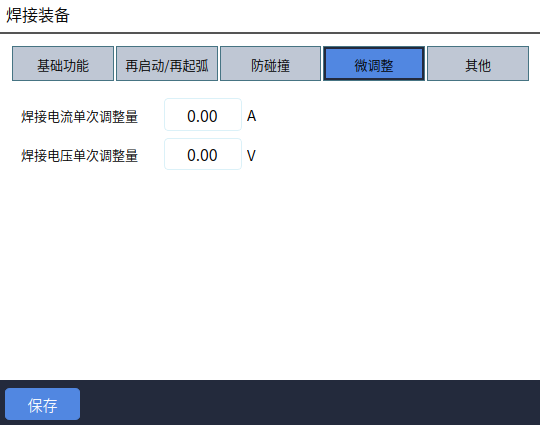

界面参数介绍：

焊接电流单次调整量：焊接的过程中焊接电流的单次调整幅度。

例如：焊接电流单次调整量是5A,再焊接的过程中如果想要增加或者减小电流值可以点击工艺栏-【焊接工艺】-【微调整】。

点击给定值增加电流值会在焊接过程中增加5A,点击给定值减小电流值会在焊接过程中减小5A（注：增加或者减小的数值是根据设置的焊接电流单次调整量来调节的）。

焊接电压单次调整量：焊接的过程中焊接电压的单次调整幅度。

例如：焊接电压单次调整量是6V,，再焊接的过程中如果想要增加或者减小电压值可以点击工艺栏-【焊接工艺】-【微调整】。

点击给定值增加电压值会在焊接过程中增加6V,点击给定值减小电流值会在焊接过程中减小6V（注：增加或者减小的数值是根据设置的焊接电压单次调整量来调节的）。

焊接速度单次调整：焊接装备参数中可以设置微调整单次的加减幅度。

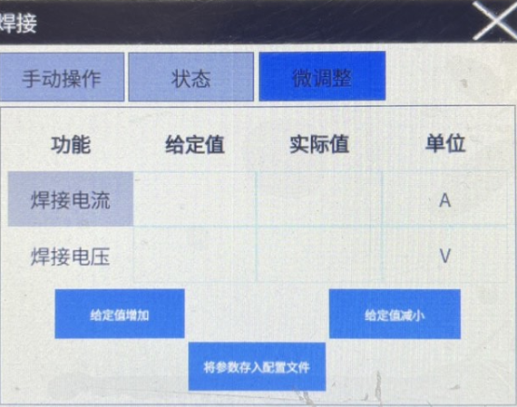

其他

界面如下图所示：

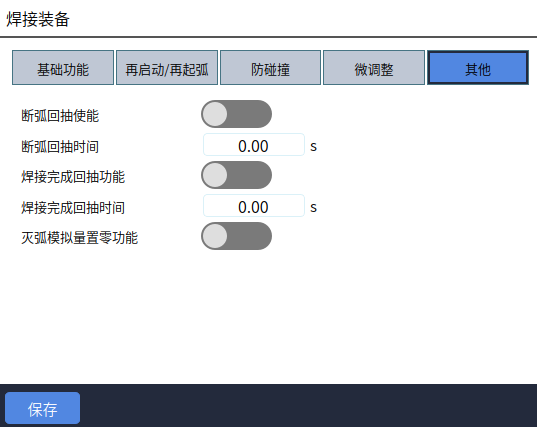

界面参数介绍：

焊接完成回抽功能：在焊接结束时，焊枪会收到退丝信号，焊丝会回抽，防止去下个焊点时碰撞工件。

焊接完成回抽时间：完成焊接后，回抽焊丝的时间。

打开焊接完成回抽使能，设置完成回抽时间3秒，在焊接结束，从收到退丝信号到退丝结束的时间总共需要3秒。

断弧回抽使能：焊接电流超出了焊机的额定负载率焊机出现了短暂的保护，发生断弧，焊丝需要进行回抽防止与工件粘连。

断弧回抽时间：焊接断弧后，回抽焊丝的时间。

打开断弧回抽使能，设置断弧回抽时间2秒，为了防止焊丝与工件粘连，焊丝回抽时间需要2秒。

灭弧模拟量置零功能：焊接结束模拟量电压电流信号归零（模拟输出）。

### 摆焊参数

设置摆焊参数需进入"弧焊/摆焊参数"中修改。相关步骤如下：

纳博特摆焊支持四种摆动方式：正弦摆、Z字摆、圆形摆、外部轴定点摆、L形摆、三角摆、8字摆。

1.  进入"工艺/焊接工艺/摆焊参数"页面，摆焊文件有99个工艺号可供选择。选择需要修改的摆焊参数，点击底部的修改按钮，所有输入框变为可输入状态；

2.  输入完成后点击保存按钮即可完成保存。

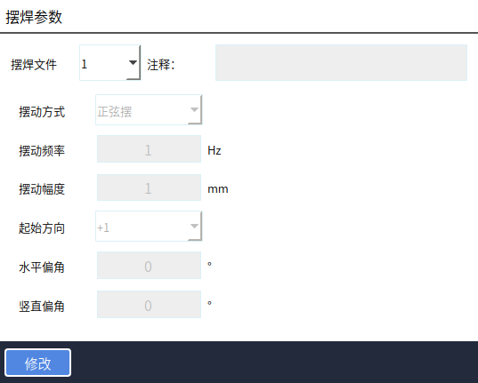

纳博特摆焊支持七种摆动方式：正弦摆、Z字摆、圆形摆、外部轴定点摆、L型摆、三角摆、8字摆。

摆动频率、摆动幅度、起始方向、水平偏角、竖直偏角等等不同参数可调，可根据工业现场实际需要设置。

摆动幅度：幅度越大，机器人摆动越大。

摆动频率：频率越大，机器人摆动频率越快。

起始方向：+1，从某一点开始走且先向上走；-1，从某一点开始走且先向下走

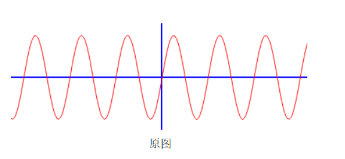

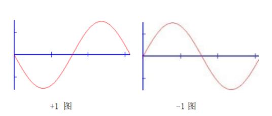

水平偏角：设置水平偏角30° 的摆焊轨迹，如下图所示：

竖直偏角：设置竖直偏角30° 的摆焊轨迹，如图：

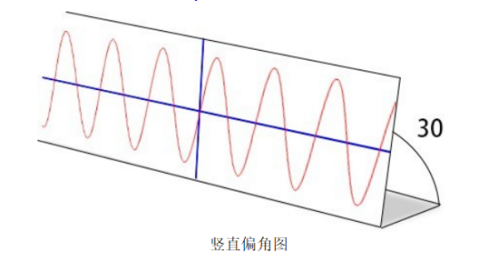

移动：机器人每摆动一次往前走设定的时间，然后进入下一次摆动；

左停留时间/右停留时间：当摆焊方式为Z字形摆，定点摆焊时会有左停留时间，右停留时间参数设置；表示在进行Z字形摆，定点摆焊时，到达一个目标点停留的时间。如下图所示；

红色轨迹表示Z字形摆焊轨迹，如果设置左右停留时间为1秒，机器人在a点停留1秒后运行到b点，然后再b点停留1秒到c点，按照这种运行逻辑，直到整个摆焊轨迹走完。

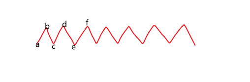

 圆型摆

支持圆弧轨迹运动，优化了两段圆弧摆之间接头处，使衔接更流畅。

原圆形摆轨迹及两段焊接衔接如图所示：

现圆形摆轨迹：

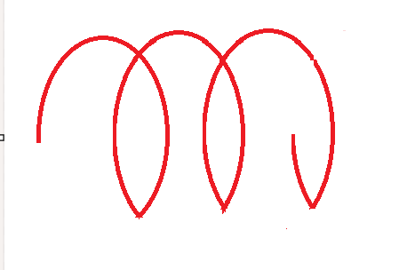

L型摆

轨迹示意图如下所示：

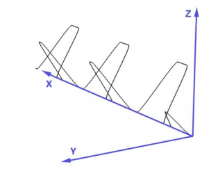

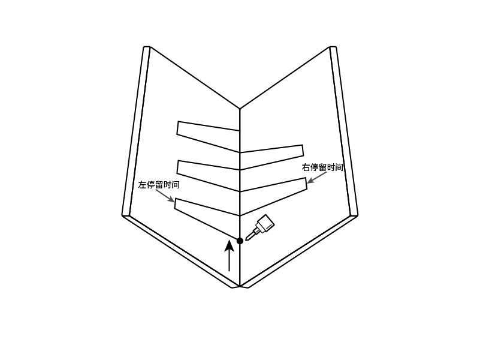

参数在Z字摆的基础上增加左仰角、右仰角。

左/右仰角：摆动的左/右平面与焊枪工具Z轴方向垂直平面的夹角，如下图所示：

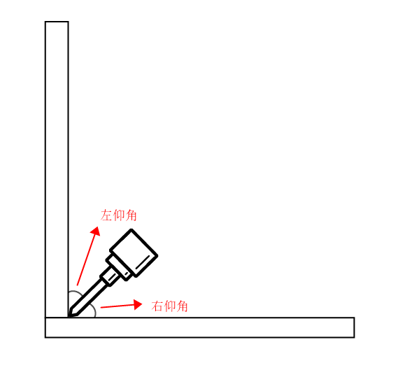

三角摆

轨迹示意图如下：

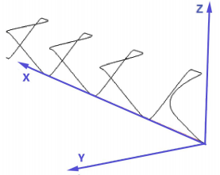

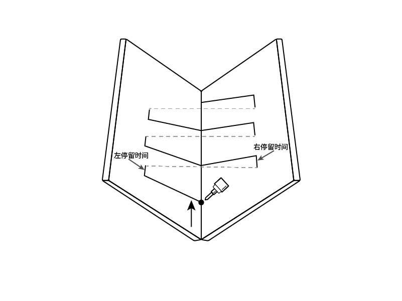

参数在Z字摆的基础上增加左仰角、右仰角。

左/右仰角：摆动的左/右平面与焊枪工具Z轴方向垂直平面的夹角，如下图所示：

 

 8字摆

参数与圆型摆相同，轨迹示意图如下：

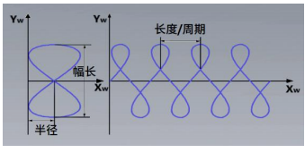

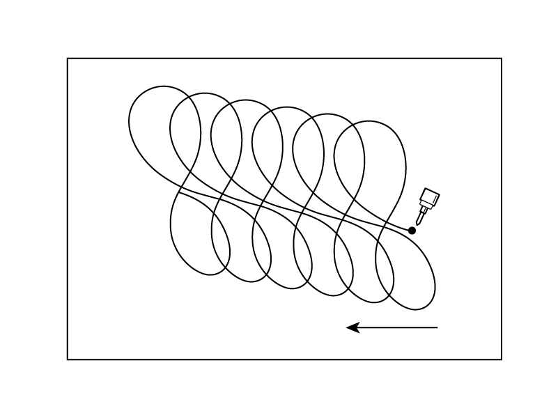

 摆焊是焊接时，焊缝热源在焊件上进行有规律的横向摆动的焊接操作。摆焊效果图如下所示。

外部轴定点摆

将需要的外部轴标定好，打开外部轴随动功能，在摆焊内插入焊接的轨迹

外部轴定点摆示例程序，如图所示：

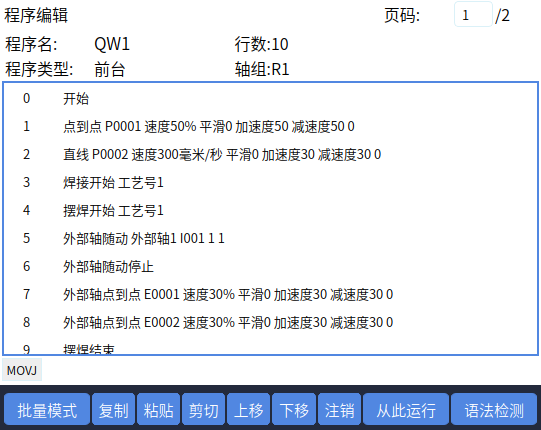

### 相贯线设置

相贯线设置需进入"弧焊/相贯线设置"中修改。

相关步骤如下：

进入"弧焊/相贯线设置"页面，如下图：

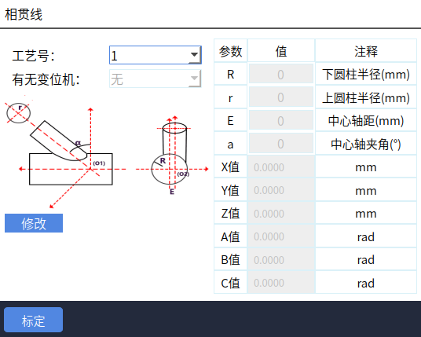

使用前标定可以减小误差，点击标定进入标定界面，如果不知道如何标定在界面内有演示按钮，可以查看，如图所示：

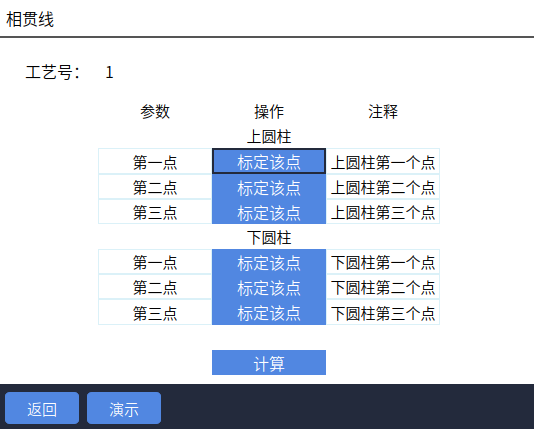

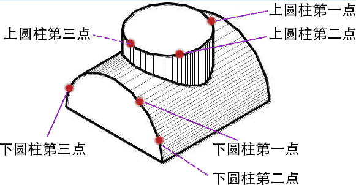

### 手动操作

设置手动操作需进入"弧焊/手动操作"中修改。相关步骤如下：

进入"弧焊/手动操作"页面。

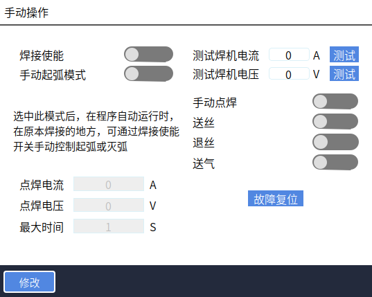

焊接使能：打开焊接使能，机器人才会执行焊接操作，否则只是在走轨迹。

焊接轨迹的程序编写完后可以首先在示教模式确认运行轨迹正确。

切换到运行模式打开焊接使能，机器人才会执行焊接功能。

手动点焊：点击修改，修改按钮变为保存，设置点焊电流，点焊电压，最大时间，点击保存。

长按手动点焊按钮（按住有效，松开无效），机器人进行焊接，松开按钮，机器人停止焊接。

点焊电流：点焊输出电流。

点焊电压：点焊输出电压。

最大时间：手动点焊按钮允许被按住的最大时间。

最大时间设置为 5s，按住手动点焊，机器人焊接 5s，超出
5s，即使按住手动点焊按钮，机器人也不会进行焊接。

故障复位：使用数字焊机时有效，可用于复位焊机故障。

送丝：按下后开始送丝。

退丝：按下后开始退丝。

送气：开始送气。

为了焊接使用方便，我们现在状态栏添加了【工艺】/【焊接】。

注：需要在设置/操作参数-工艺选择选中【焊接工艺】，修改保存。状态栏显示【焊接】。点击其中的焊接，会弹出手动操作的焊接窗口。

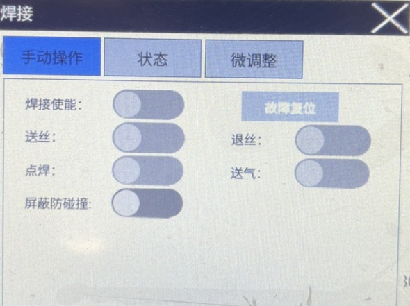

【手动操作】与工艺/焊接工艺/手动操作"页面的手动操作效果一样。此状态栏可以更加方便的看见焊接过程中的信号，电流电压值的变化等效果。

屏蔽防碰撞：触发防碰撞以后，打开屏蔽防碰撞开关，根据焊接装备设置-防碰撞的参数。打开后在屏蔽时间内解除碰撞，方便把焊枪移动到安全位置。

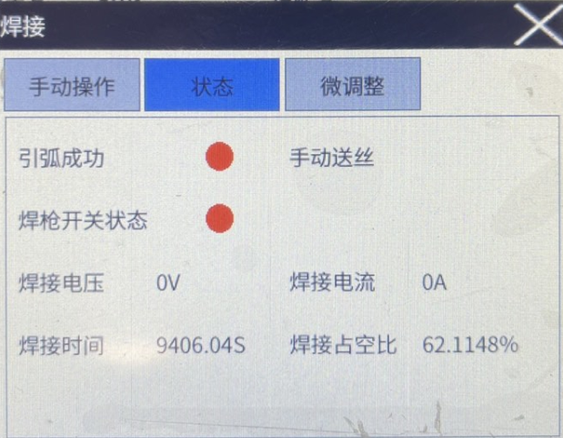

【状态】

引弧成功/手动送丝/焊枪开关状态：绿色为开启，红色关闭。

焊接电流/电压：输入的电流和电压 。

焊接时间：焊接开始到焊接结束之前的焊接时间。记录开机后的焊接时间。

【微调整】

将参数存入配置文件：焊接期间保存参数，点击保存按钮，参数自动覆盖到指令或参数中。

指令使用自定义参数时，保存到指令中。

使用焊接工艺号参数时，保存到焊接参数中。

给定值增加/给定值减小：选中要调整的参数，点击给定值增加、给定值减小调整，立即生效。

例如：在焊接工艺-焊接装备设置-微调整界面，设置焊接电流单次调整量是5A,再焊接的过程中如果想要增加或者减小电流值可以点击【给定值增加】，【给定值减小】。

点击给定值增加电流值会在焊接过程中增加5A,点击给定值减小电流值会在焊接过程中减小5A。

注：增加或者减小的数值是根据设置的焊接电流单次调整量来调节的。

例如：在焊接工艺-焊接装备设置-微调整界面，焊接电压单次调整量是6V,，再焊接的过程中如果想要增加或者减小电压值可以点击【给定值增加】，【给定值减小】。

点击给定值增加电压值会在焊接过程中增加6V,点击给定值减小电流值会在焊接过程中减小6V。

注：增加或者减小的数值是根据设置的焊接电压单次调整量来调节的。

## 变量

竖版焊接示教器共有变量12个，其中全局变量6个"GP、GE、GI、GD、GB、GS"，局部6个"P、E、I、D、B、S"，点击左侧"变量"按钮即可弹出，如下图所示

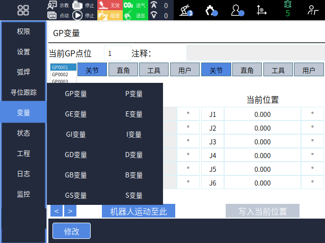

GP、GE为全局位置变量，P、E为局部位置变量；GI、GD、GB、GS为全局数值变量，I、D、B、S为局部数值变量

全局变量

全局位置变量

<table border="1" style="border-collapse: collapse;">
<tr><td style="text-align: center; vertical-align: middle;">类型</td><td style="text-align: center; vertical-align: middle;">数量</td><td style="text-align: center; vertical-align: middle;">示例</td></tr>
<tr><td style="vertical-align: top;">GP：记录机器人位置数据的变量</td><td style="vertical-align: top;">9999</td><td style="vertical-align: top;">GP0001\...GP9999</td></tr>
<tr><td style="vertical-align: top;">GE：双机模式时记录两台机器人位置数据据的变量  带外部轴时记录外部轴点位的位置变量</td><td style="vertical-align: top;">9999</td><td style="vertical-align: top;">GE0001\...GE9999</td></tr>

</table>
依次点击"变量_GP变量\"，即可进入GP变量具体页面，点击【修改】按钮后自动弹出【保存】、【清除】、【取消】按钮，如下图所示：

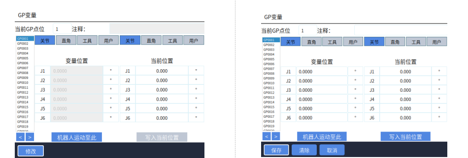

1.  【修改】手动修改目标变量的点位，点击修改，填入参数后点击小键盘上的确定，

2.  【保存】修改完点位后，点击保存，点位修改成功。

3.  【清除】清除目标变量的点位信息，点击保存后点位数据清除成功。

4.  【取消】取消对目标变量的修改和清除操作。

5.  当前GP点位/当前GE点位：填写数值后点击小键盘上的确定，会直接定位到对应的变量，如果输入100，会直接定位到GP0100。

6.  注释：变量添加注释说明，方便用户知道每个位置变量所代表的意思。

7.  变量位置：可以将机器人不同位置的点位信息存入到选择的变量，当带有外部轴时，也会记录外部轴的位置信息。此参数可以手动修改。

8.  当前位置：机器人当前的位置信息，当带有外部轴时，也会记录外部轴当前的位置信息。此参数不能修改。

9.  机器人运动至此：在示教模式下上使能，然后点击运动至此，机器人运动到目标点位。

10. 写入当前位置：点击修改，再点击写入当前位置，会把机器人当前的点位信息写入到选择的变量。如果要将机器人当前关节坐标下的点位写入到变量，需要选中关节，然后再点击写入当前位置，如果要将机器人当前直角坐标下的点位写入到变量，需要选中直角，然后再点击写入当前位置，点击保存，写入位置成功。其它坐标下写入点位也是一样步骤，
    如下图所示：

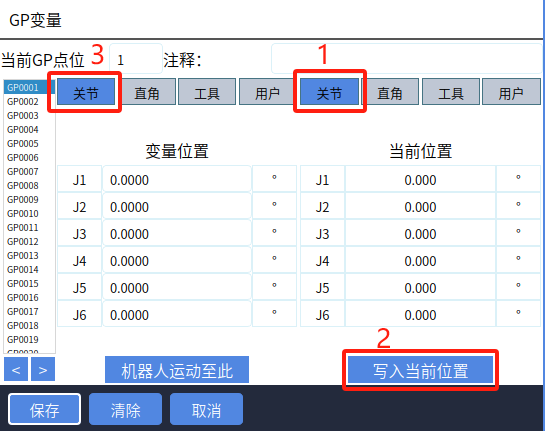

全局位置变量修改

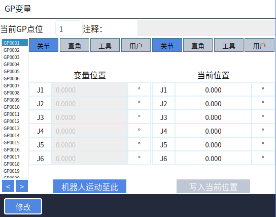

全局位置变量界面修改GP点

1、手动修改：

- 点击【修改】，选中需要修改的变量，然后在变量位置给每一个轴赋值，如果需要修改形态、工具手、用户这些参数信息时，在对应的输入框填入合理的参数值；

- 点击【保存】变量位置信息修改成功。

  2、按键修改：

<!-- -->

- 示教模式下点动机器人，让机器人运动到目标位置后，点击【修改】再点击【回车】，目标变量修改成功；

示教模式下成功修改全局GP点，成功示例图：

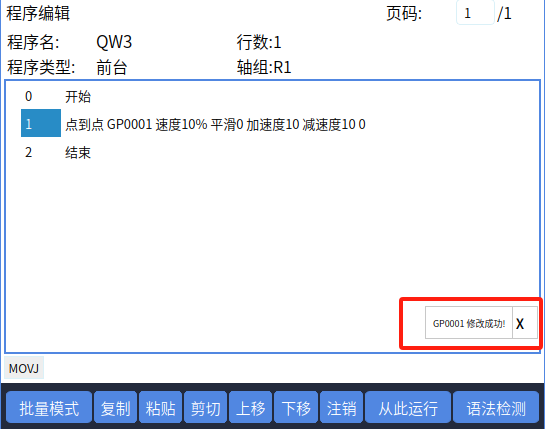

全局数值变量

全局数值变量类型

<table border="1" style="border-collapse: collapse;">
<tr><td style="vertical-align: middle;" colspan="2">变量类型</td><td style="vertical-align: middle;">变量数量</td><td style="vertical-align: middle;">变量示例</td></tr>
<tr><td style="vertical-align: middle;">全局整数型</td><td style="vertical-align: middle;">GINT</td><td style="vertical-align: middle;">999</td><td style="vertical-align: middle;">GI001\...GI999</td></tr>
<tr><td style="vertical-align: middle;">全局浮点型</td><td style="vertical-align: middle;">GDOUBLE</td><td style="vertical-align: middle;">999</td><td style="vertical-align: middle;">GD001\...GD999</td></tr>
<tr><td style="vertical-align: middle;">全局布尔型</td><td style="vertical-align: middle;">GBOOL</td><td style="vertical-align: middle;">999</td><td style="vertical-align: middle;">GB001\...GB999</td></tr>
<tr><td style="vertical-align: middle;">全局字符型</td><td style="vertical-align: middle;">GSTRING</td><td style="vertical-align: middle;">999</td><td style="vertical-align: middle;">GS001\...GS999</td></tr>
</table>
全局整数型

<table border="1" style="border-collapse: collapse;">
<tr><td style="vertical-align: middle;">格式</td><td style="vertical-align: middle;">GINT</td></tr>
<tr><td style="vertical-align: middle;">范围</td><td style="vertical-align: middle;">【1，999】</td></tr>
<tr><td style="vertical-align: middle;">变量</td><td style="vertical-align: middle;">变量的编号</td></tr>
<tr><td style="vertical-align: middle;">数值</td><td style="vertical-align: middle;">变量的值，整数型变量的范围为整数</td></tr>
<tr><td style="vertical-align: middle;">注释</td><td style="vertical-align: middle;">用户可以给变量添加注释，方便用户标记该变量的作用</td></tr>
</table>

全局浮点型

<table border="1" style="border-collapse: collapse;">
<tr><td style="vertical-align: middle;">格式</td><td style="vertical-align: middle;">GDOUBLE</td></tr>
<tr><td style="vertical-align: middle;">范围</td><td style="vertical-align: middle;">【1，999】</td></tr>
<tr><td style="vertical-align: middle;">变量</td><td style="vertical-align: middle;">变量的编号</td></tr>
<tr><td style="vertical-align: middle;">数值</td><td style="vertical-align: middle;">变量的值，浮点型变量的范围为实数</td></tr>
<tr><td style="vertical-align: middle;">注释</td><td style="vertical-align: middle;">用户可以给变量添加注释，方便用户标记该变量的作用</td></tr>
</table>

全局布尔型

<table border="1" style="border-collapse: collapse;">
<tr><td style="vertical-align: middle;">格式</td><td style="vertical-align: middle;">GBOOL</td></tr>
<tr><td style="vertical-align: middle;">范围</td><td style="vertical-align: middle;">【1，999】</td></tr>
<tr><td style="vertical-align: middle;">变量</td><td style="vertical-align: middle;">变量的编号</td></tr>
<tr><td style="vertical-align: middle;">数值</td><td style="vertical-align: middle;">该变量的值，布尔型变量的范围为0/1</td></tr>
<tr><td style="vertical-align: middle;">注释</td><td style="vertical-align: middle;">用户可以给变量添加注释，方便用户标记该变量的作用</td></tr>
</table>

全局字符型

<table border="1" style="border-collapse: collapse;">
<tr><td style="vertical-align: middle;">格式</td><td style="vertical-align: middle;">GSTRING</td></tr>
<tr><td style="vertical-align: middle;">范围</td><td style="vertical-align: middle;">【1，999】</td></tr>
<tr><td style="vertical-align: middle;">变量</td><td style="vertical-align: middle;">变量的编号</td></tr>
<tr><td style="vertical-align: middle;">数值</td><td style="vertical-align: middle;">全局字符型可以保存数字、符号、字母（包含大小写）、汉字</td></tr>
<tr><td style="vertical-align: middle;">注释</td><td style="vertical-align: middle;">用户可以给变量添加注释，方便用户标记该变量的作用</td></tr>
</table>

点击"变量"会弹出所有全局数值变量，点击需要的即可进入相应界面，以GI变量为例。点击【修改】按钮，即可弹出【保存】、【清除】、【取消】按钮，如下图所示：

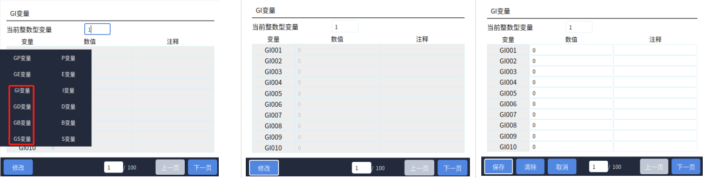

【修改】选中需要修改的变量名，点击"修改"然后给变量赋值、给变量添加注释。

【清除】清除变量里面存的值，点击清除后，变量值变为0，清除按钮只会清除当前界面的值。

【取消】对选中的变量不进行任何操作。

【保存】保存修改后的变量值。

【上一页】进入上一页变量。

【下一页】进入下一页变量。

手动赋值全局数值变量

1.  在全局数值变量选中需要修改的变量，点击"修改"然后输入数值。

2.  点击"保存"变量赋值成功。

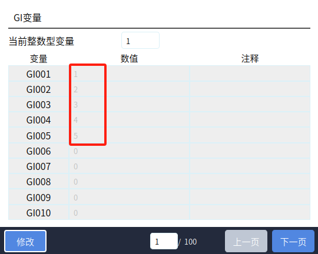

指令赋值

1.  新建工程，打开工程文件；

2.  点击"命令一览"按键，插入指令，指令类型选择变量类，选择赋值指令，点击"选择"按键；

3.  进入指令参数设置界面，选择变量类型和填入变量值；

4.  点击"确定"赋值指令插入成功，如果需要给多个不同的变量赋值，重复前面的234步骤就可以；

5.  指令执行完后，可以在监控-数值变量界面或者全局数值变量界面查看变量值。

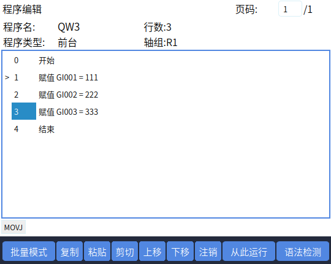

局部变量

局部位置变量

<table border="1" style="border-collapse: collapse;">
<tr><th style="background-color: #d3d3d3; text-align: center;">类型</th><th style="background-color: #d3d3d3; text-align: center;">数量</th><th style="background-color: #d3d3d3; text-align: center;">示例</th></tr>
<tr><td style="vertical-align: top;">P：记录机器人位置数据的变量</td><td style="vertical-align: top;">9999</td><td style="vertical-align: top;">P0001\...P9999</td></tr>
<tr><td style="vertical-align: top;">E：双机模式时记录两台机器人位置数据的变量  带外部轴时记录外部轴点位的位置变量</td><td style="vertical-align: top;">9999</td><td style="vertical-align: top;">E0001\...E9999</td></tr>
</table>
依次点击"变量_P变量\"，进入局部位置变量界面。（以\"P变量\"为例）

说明：局部位置变量P仅能用于单独的一个作业文件，不能在所有的作业文件之间调用。

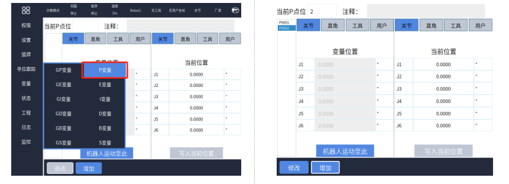

图例中按钮说明：

1.  【修改】手动修改目标变量的点位，点击修改，填入参数后点击小键盘上的确定。

2.  【保存】修改完点位后点击保存，点位修改成功。

3.  【增加】选中局部P点，点击增加会新建一个新的P点,选中局部E点，点击增加会新建一个新的E点，例如：现在局部P点的点位个数是在P0006，点击增加，点位个数会变到P0007。

4.  当前P点位/当前E点位：填写数值后点击小键盘上的确定，会直接定位到对应的变量，例如输入5，会直接定位到P0005。

5.  变量位置：可以将机器人不同位置的点位信息存入到选择的变量，当带有外部轴时，也会记录外部轴的位置信息。此参数可以手动修改。

6.  当前位置：机器人当前的位置信息，当带有外部轴时，也会记录外部轴当前的位置信息。此参数不能修改。

7.  机器人运动至此：在示教模式下上使能，然后点击运动至此，机器人运动到目标点位。

8.  写入当前位置：点击修改，再点击写入当前位置，会把机器人当前的点位信息存入到选择的变量。如果要将机器人当前关节坐标下的点位写入到变量，需要选中关节，然后再点击写入当前位置，如果要将机器人当前直角坐标下的点位写入到变量，需要选中直角，然后再点击写入当前位置，点击保存，写入位置成功。其它坐标下写入点位也是一样操作步骤，如下图：

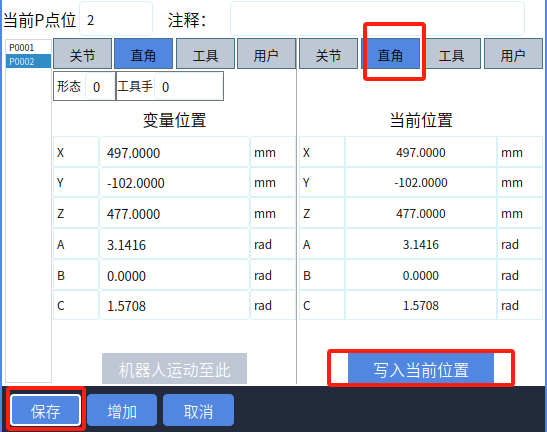

局部位置变量修改

局部位置变量界面修改P点：

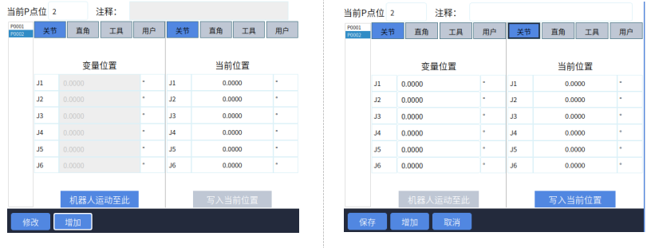

1、手动修改：

- 点击【修改】，选中需要修改的变量，然后在变量位置给每一个坐标轴赋值，如果需要修改形态、工具手、用户这些参数信息时，在对应的输入框填入合理的参数值；

- 点击【保存】变量位置信息修改成功。

  2、按键修改：

<!-- -->

- 示教模式下点动机器人，让机器人运动到目标位置后，点击【修改】再点击【回车】，目标变量修改成功；

程序界面修改局部P点成功示例图：

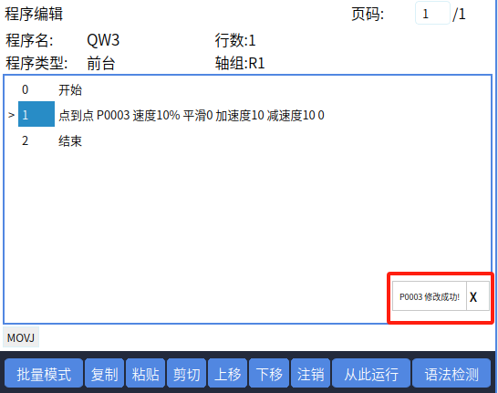

局部数值变量

<table border="1" style="border-collapse: collapse;">
<tr><td style="vertical-align: middle;" colspan="2">变量类型</td><td style="vertical-align: middle;">数值类型</td><td style="vertical-align: middle;">变量数量</td><td style="vertical-align: middle;">变量示例</td></tr>
<tr><td style="vertical-align: middle;">局部整数型</td><td style="vertical-align: middle;">INT</td><td style="vertical-align: middle;">整数</td><td style="vertical-align: middle;">999</td><td style="vertical-align: middle;">I001\...I999</td></tr>
<tr><td style="vertical-align: middle;">局部浮点型</td><td style="vertical-align: middle;">DOUBLE</td><td style="vertical-align: middle;">实数</td><td style="vertical-align: middle;">999</td><td style="vertical-align: middle;">D001\...D999</td></tr>
<tr><td style="vertical-align: middle;">局部布尔型</td><td style="vertical-align: middle;">BOOL</td><td style="vertical-align: middle;">0/1</td><td style="vertical-align: middle;">999</td><td style="vertical-align: middle;">B001\...B999</td></tr>
<tr><td style="vertical-align: middle;">局部字符型</td><td style="vertical-align: middle;">STRING</td><td style="vertical-align: middle;">数字、符号、字母、汉字</td><td style="vertical-align: middle;">999</td><td style="vertical-align: middle;">S001\...S999</td></tr>
</table>
说明：

1.  局部数值变量赋值的值只作用于当前程序；

例如:新建程序A和程序B，程序A里面赋值I001=10,然后打开程序B,在变量界面查看I001的值，变量界面显示I001=0。

1.  定义的所有局部数值变量一般只能用于当前程序，其他程序、后台程序都无法使用。

注：若使用指令调用后台子程序时，声明局部数值变量参数即可在主程序中使用。

定义局部变量需要点击"变量"，选择需要定义的变量，如下图所示（以I变量为例）。

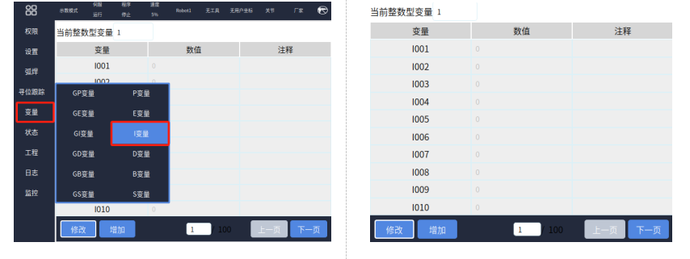

【修改】修改选中编号的变量值。

【保存】给目标变量修改值后，点击保存，变量值修改成功。

【取消】对选中变量不进行任何操作。

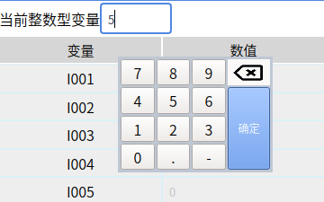

填入数值，点击小键盘上的确定，可以直接定位到对应变量，例如填写5，直接会定位到I005。

如何给局部数值变量赋值

手动赋值

1.  依次点击"变量_D变量\"界面，点击【修改】给需要赋值的变量输入数值；（以D变量为例）

2.  点击【保存】，变量修改成功。

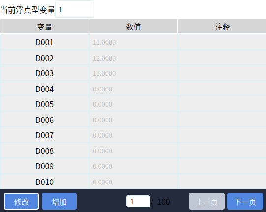

注意事项：通过手动给变量赋的值我们认为是这个变量的初始数值，通过指令给变量赋的值不会修改初始数值，局部变量界面变量值的显示是一直不变的，除非用户再次手动修改了初始值。

例如：我们通过指令给D001赋值为22.22，指令运行结束后在此界面查看D001=11.11。

指令赋值

1.  新建工程，打开工程文件；

2.  点击"命令一览"，插入指令，指令类型选择变量类，选择赋值指令；

3.  点击【确定】进入指令参数设置界面，选择变量类型和填入变量值；

4.  点击【确定】赋值指令插入成功，如果需要给多个不同的变量赋值，重复前面的234步骤就可以；

5.  在指令执行时，可以在监控-数值变量界面监控变量数值的变化。

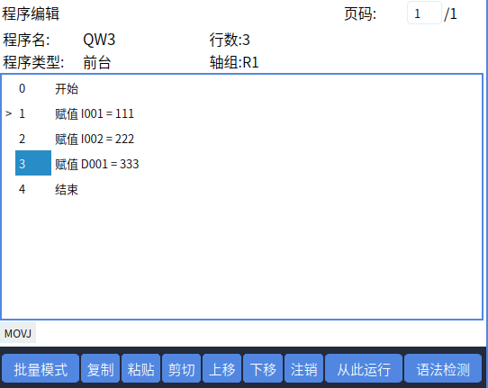

点位形态、工具手、用户值修改方式

设置-操作参数界面增加点位形态、工具手、用户值设置方式，自动和手动两种方式，默认为自动。

自动：新建点位时形态、工具手、用户坐标默认取当前值。

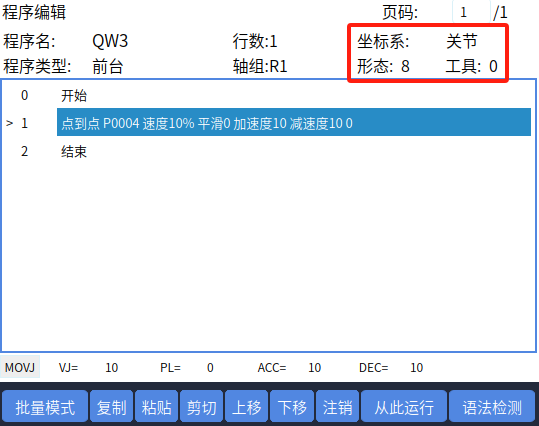

手动

手动设置形态、工具手、用户坐标，以"P001"变量为例。

1、新建点位，去"变量_P变量"页面，点击【修改】，选择"工具"，可以设置P001点位的形态值、工具手、用户，设置完之后点击【保存】

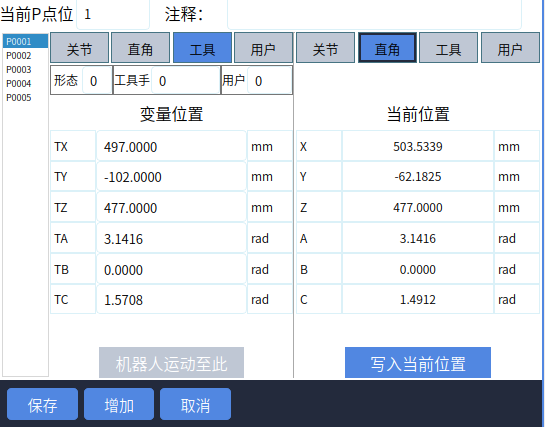

2、指令-位置变量类-设置点位信息，可以改坐标系、形态等等。

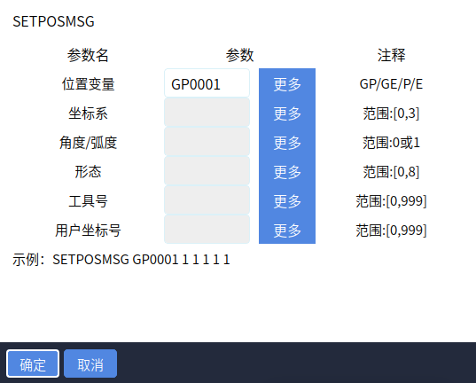

1、插入设置点位信息指令。

- 位置变量：像选择想要修改的点位GP/GE/P/E，只能选择已有的点位。

- 坐标系：范围【0，3】；其中0：关节坐标系；1：直角坐标系
  ；2：工具坐标系；3：用户坐标系 。

- 角度/弧度：可选值0/1。

- 形态：范围【0，8】。

- 工具号：工具手号【0，999】。

- 用户坐标号：用户坐标系【0，999】。

  2、点击确定，运行程序即可修改。

角度/弧度

机器人在直角坐标、工具坐标、用户坐标下有姿态轴A、B、C，姿态轴的姿态值是可以手动修改的。

如何修改角度/弧度？

点击设置-操作参数，进入操作参数界面，点击修改，在姿态值列设置角度制和弧度制。

例如：修改姿态值为角度值，我们可以在全局位置变量界面发现在直角坐标、工具坐标、用户坐标下A、B、C轴的单位变为弧度（rad）。

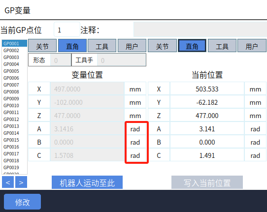

局部P点点位信息说明

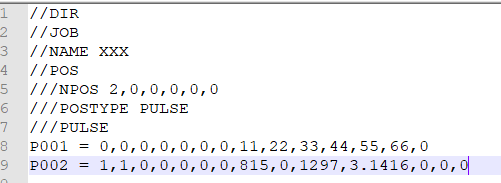

例如;P0002 = 1,1,0,0,0,0,0,815,0,1297,3.1416,0,0,0。

点位数据分解如下：

<table border="1" style="border-collapse: collapse;">
<tr><td style="vertical-align: middle;">P0002</td><td style="vertical-align: middle;">点位参数</td><td style="vertical-align: middle;">参数说明</td></tr>
<tr><td style="vertical-align: middle;">1</td><td style="vertical-align: middle;">坐标系</td><td style="vertical-align: middle;">0：关节 1：直角 2：工具 3：用户</td></tr>
<tr><td style="vertical-align: middle;">1</td><td style="vertical-align: middle;">角度/弧度</td><td style="vertical-align: middle;">0：角度（关节点）1：弧度（直角点、工具点、用户点）</td></tr>
<tr><td style="vertical-align: middle;">0</td><td style="vertical-align: middle;">形态/左右手</td><td style="vertical-align: middle;">六轴时为形态参数，四轴SCARA时为左右手参数</td></tr>
<tr><td style="vertical-align: middle;">0</td><td style="vertical-align: middle;">工具</td><td style="vertical-align: middle;">工具手编号</td></tr>
<tr><td style="vertical-align: middle;">0</td><td style="vertical-align: middle;">用户</td><td style="vertical-align: middle;">用户坐标编号</td></tr>
<tr><td style="vertical-align: middle;">0</td><td style="vertical-align: middle;">预留</td><td style="vertical-align: middle;">预留</td></tr>
<tr><td style="vertical-align: middle;">0</td><td style="vertical-align: middle;">预留</td><td style="vertical-align: middle;">预留</td></tr>
<tr><td style="vertical-align: middle;">815</td><td style="vertical-align: middle;">1轴</td><td style="vertical-align: middle;">点位1轴坐标</td></tr>
<tr><td style="vertical-align: middle;">0</td><td style="vertical-align: middle;">2轴</td><td style="vertical-align: middle;">点位2轴坐标</td></tr>
<tr><td style="vertical-align: middle;">1297</td><td style="vertical-align: middle;">3轴</td><td style="vertical-align: middle;">点位3轴坐标</td></tr>
<tr><td style="vertical-align: middle;">3.1416</td><td style="vertical-align: middle;">4轴</td><td style="vertical-align: middle;">点位4轴坐标</td></tr>
<tr><td style="vertical-align: middle;">0</td><td style="vertical-align: middle;">5轴</td><td style="vertical-align: middle;">点位5轴坐标</td></tr>
<tr><td style="vertical-align: middle;">0</td><td style="vertical-align: middle;">6轴</td><td style="vertical-align: middle;">点位6轴坐标</td></tr>
<tr><td style="vertical-align: middle;">0</td><td style="vertical-align: middle;">7轴</td><td style="vertical-align: middle;">点位7轴坐标</td></tr>
</table>

局部E点点位信息说明

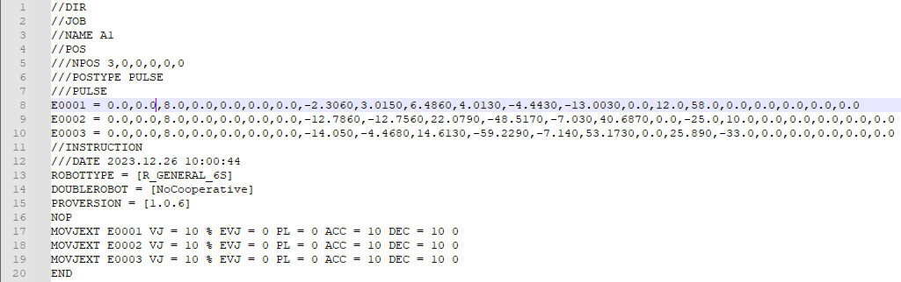

例如：E0001点位数据分解如下：

<table border="1" style="border-collapse: collapse;">
<tr><td style="vertical-align: middle;">E0001</td><td style="vertical-align: middle;">点位参数</td><td style="vertical-align: middle;">参数说明</td></tr>
<tr><td style="vertical-align: middle;">0</td><td style="vertical-align: middle;">坐标系</td><td style="vertical-align: middle;">0：关节 1：直角 2：工具 3：用户</td></tr>
<tr><td style="vertical-align: middle;">0</td><td style="vertical-align: middle;">角度/弧度</td><td style="vertical-align: middle;">0：角度（关节点）1：弧度（直角点、工具点、用户点）</td></tr>
<tr><td style="vertical-align: middle;">8</td><td style="vertical-align: middle;">形态/左右手</td><td style="vertical-align: middle;">六轴时为形态参数，四轴SCARA时为左右手参数</td></tr>
<tr><td style="vertical-align: middle;">0</td><td style="vertical-align: middle;">工具</td><td style="vertical-align: middle;">工具手编号</td></tr>
<tr><td style="vertical-align: middle;">0</td><td style="vertical-align: middle;">用户</td><td style="vertical-align: middle;">用户坐标编号</td></tr>
<tr><td style="vertical-align: middle;">0</td><td style="vertical-align: middle;">预留</td><td style="vertical-align: middle;">预留</td></tr>
<tr><td style="vertical-align: middle;">0</td><td style="vertical-align: middle;">预留</td><td style="vertical-align: middle;">预留</td></tr>
<tr><td style="vertical-align: middle;">-2.3060</td><td style="vertical-align: middle;">1轴</td><td style="vertical-align: middle;">点位1轴坐标</td></tr>
<tr><td style="vertical-align: middle;">3.0150</td><td style="vertical-align: middle;">2轴</td><td style="vertical-align: middle;">点位2轴坐标</td></tr>
<tr><td style="vertical-align: middle;">6.4860</td><td style="vertical-align: middle;">3轴</td><td style="vertical-align: middle;">点位3轴坐标</td></tr>
<tr><td style="vertical-align: middle;">4.0130</td><td style="vertical-align: middle;">4轴</td><td style="vertical-align: middle;">点位4轴坐标</td></tr>
<tr><td style="vertical-align: middle;">-4.4430</td><td style="vertical-align: middle;">5轴</td><td style="vertical-align: middle;">点位5轴坐标</td></tr>
<tr><td style="vertical-align: middle;">-13.0030</td><td style="vertical-align: middle;">6轴</td><td style="vertical-align: middle;">点位6轴坐标</td></tr>
<tr><td style="vertical-align: middle;">0</td><td style="vertical-align: middle;">7轴</td><td style="vertical-align: middle;">点位7轴坐标</td></tr>
<tr><td style="vertical-align: middle;">12.0</td><td style="vertical-align: middle;">O1</td><td style="vertical-align: middle;">点位O1轴坐标</td></tr>
<tr><td style="vertical-align: middle;">58.0</td><td style="vertical-align: middle;">O2</td><td style="vertical-align: middle;">点位O2轴坐标</td></tr>
<tr><td style="vertical-align: middle;">0</td><td style="vertical-align: middle;">O3</td><td style="vertical-align: middle;">点位O3轴坐标</td></tr>
<tr><td style="vertical-align: middle;">0</td><td style="vertical-align: middle;">O4</td><td style="vertical-align: middle;">点位O4轴坐标</td></tr>
<tr><td style="vertical-align: middle;">0</td><td style="vertical-align: middle;">O5</td><td style="vertical-align: middle;">点位O5轴坐标</td></tr>
<tr><td style="vertical-align: middle;">0</td><td style="vertical-align: middle;"></td><td style="vertical-align: middle;"></td></tr>
<tr><td style="vertical-align: middle;">0</td><td style="vertical-align: middle;"></td><td style="vertical-align: middle;"></td></tr>
</table>

## 状态

竖版焊接示教器状态功能共有7项，分别是"数字输入、数字输出、模拟输入、模拟输出、IO功能状态、系统状态、碰撞检测"

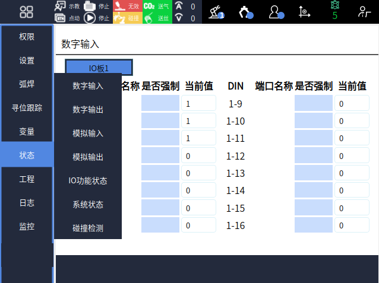

### 数字输入（DIN-IO输入）

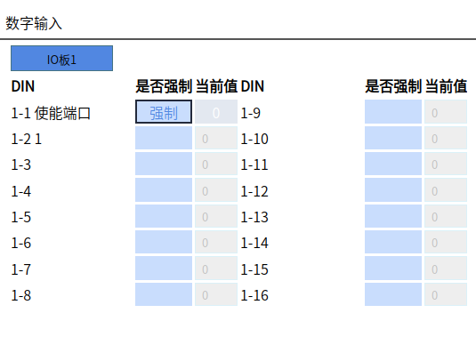

功能：数字输入将外部信号转换为电压或电流的高或低电平，然后传递给控制系统。用于接收外部数字信号,通常用于检测开关的状态、传感器信号等。

端口状态："0：低电平，1：高电平"。

DIN：端口号。

端口名称：可在"设置_IO_端口名称"进行自行设置，如果没有设置，则是空白状态。

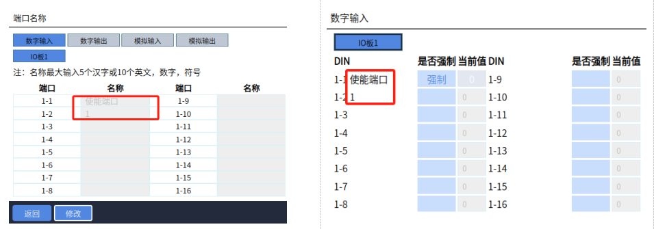

是否强制：点击选择"强制"时，可将"当前值"从0到1变换。

### 数字输出（DOUT-IO输出）

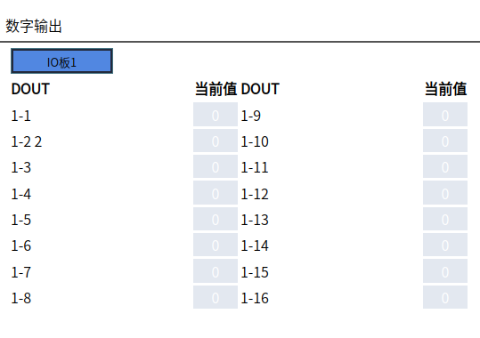

功能：数字输出用于控制外部设备，不接受反馈信号，例如继电器、开关等。

DOUT：端口号。

端口名称：可在"设置_IO_端口名称"进行自行设置，如果没有设置，则是空白状态。

当前值："0：低电平，1：高电平"，当前值为1时代表输出

### 模拟输入

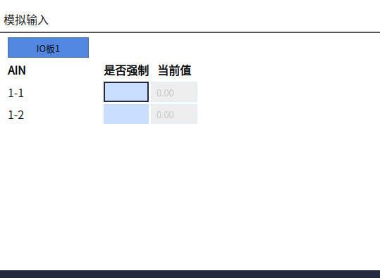

功能：可以接收连续变化的信号，常见的模拟输入信号包括电压、电等。

端口状态："0：低电平，1：高电平"。

AIN：端口号。

端口名称：可在"设置_IO_端口名称"进行自行设置，如果没有设置，则是空白状态。

是否强制：点击选择"强制"时，可将"当前值"输入范围内的数值（保存两位小数）

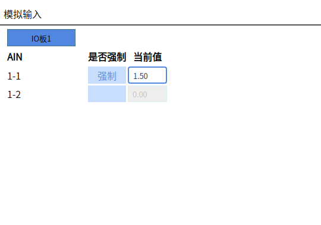

### 模拟输出

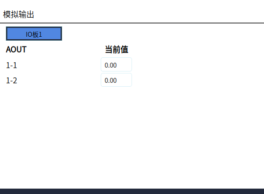

功能：可以输出连续变化的信号。常见的模拟输出信号包括电压、电流等。

AOUT：端口号。

端口名称：可在"设置_IO_端口名称"进行自行设置，如果没有设置，则是空白状态。

当前值：可输出需要的模拟值

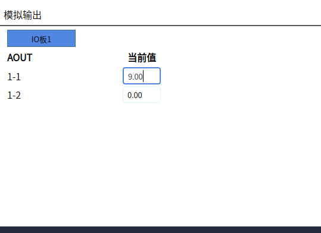

IO功能状态

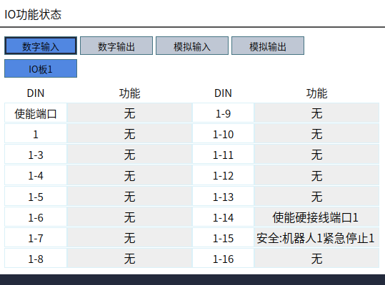

以"数字输入"为例

DIN：端口号，如果在IO的端口名称内设置了名称，则显示的是设置的名称，如果没设置，则是顺序显示

功能：根据自己设置的功能显示，如果没有设置，则显示"无"

### 系统状态

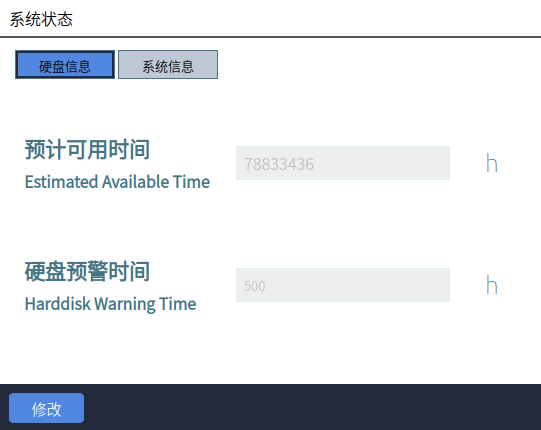

显示硬盘的预计可用时间和预警时间；

系统信息展示的是CPU的信息

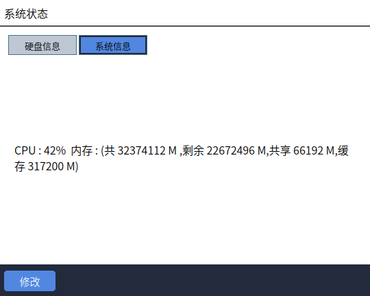

### 碰撞检测

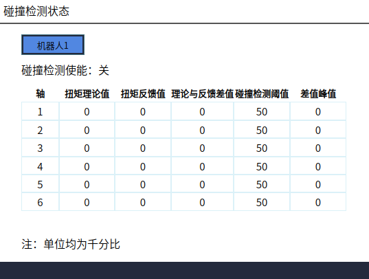

碰撞检测开关以及碰撞检测阈值可在"设置_人机协作_力学功能"中更改

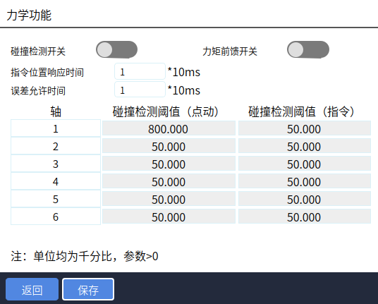

## 工程

工程共有两个小项，分别是"工程全览、程序"，如下图所示：

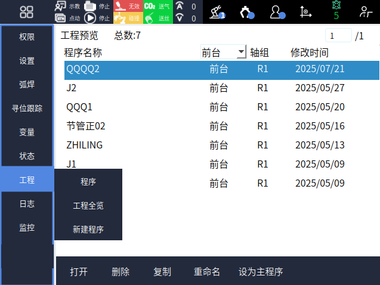

### 程序

参数界面

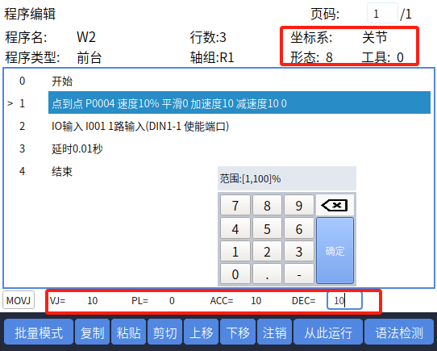

此时光标在运动类指令的内容上，页面会出现当前点的坐标系、形态、工具（当指令为非运动类指令时，界面不会出现坐标系、形态、工具等参数），程序页面下方会出现该指令各个数值，并且能更改（非运动类指令也能显示该指令的内容，但是不能更改）；

当光标在指令前的数字上时，页面正常显示，下方只出现快捷插补方式

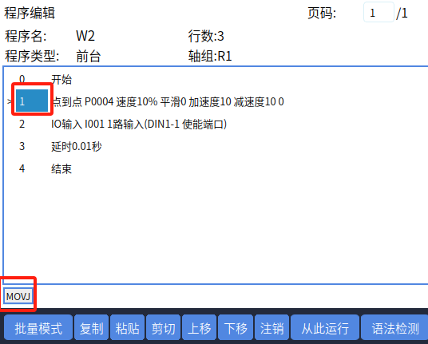

页码：表示当前所在页以及共有多少页指令

插补：

插补能插入点到点（MOVJ)、直线(MOVL)、圆弧(MOVC)、整圆(MOVCA)、直线(MOVS)

插补步骤：

1、确保页面光标在指令前的数字上

2、点击【插补方式】按键，选择需要插补的指令，依次点击【插入】【回车】即可插入选择的指令

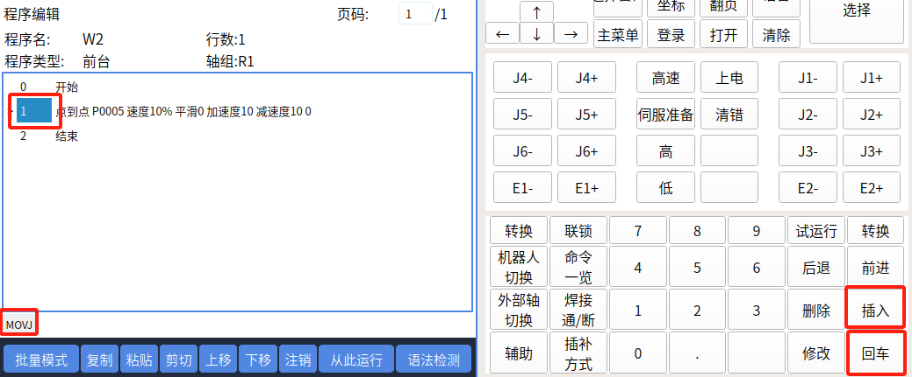

按钮说明

在点击【复制】【粘贴】【剪切】【上移】【下移】【注销】按钮时会触发小弹窗二次确定，防止误触发生，如下图所示：

（当勾选了"下次不再显示"时，再进行该按钮操作，不会触发弹窗；但是当重启后再使用该按钮功能，还是会弹出提示框）

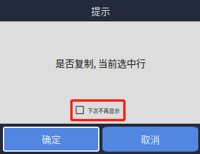

【批量模式/单行模式】：批量模式可以依次选择多行指令操作（复制、粘贴、剪切、上移、下移、注销），单行模式只能对一行指令进行操作

【复制】：复制当前指令（光标在具体指令上）

【粘贴】：粘贴复制的或者剪切的指令，粘贴位置在当前光标的下一行，如果此时光标处于最后一行的"结束"上，则会提示"粘贴位置设置错误"

【剪切】：剪切当前指令，对于剪切的指令可进行粘贴

【上移】：将此指令向上移动一行（开始、结束指令不可用）

【下移】：将此指令向上移动一行（开始、结束指令不可用）

【注销】：注销当前指令，系统置灰，再次对该指令注销操作时，系统还原置灰，当指令被注销，运行程序时不会运行该指令，下图为置灰样式：

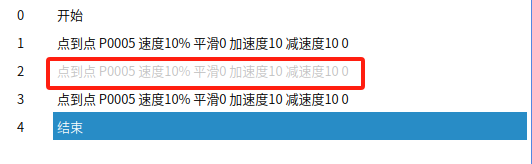

【从此运行】：设置指令【从此运行】，指令前会有标志（\^），运行程序时会从该指令开始运行

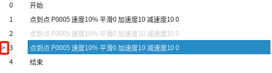

【语法检测】：在编写完程序后可以后可以点击【语法检测】，如果有较为明显的错误，会有红色报警提示

示例，下图程序缺少"焊接结束"指令，点击语法检测按钮后会弹出红色报警错误提示

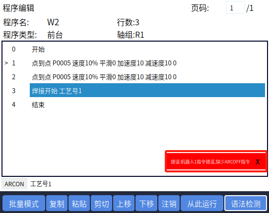

### 工程全览

参数界面

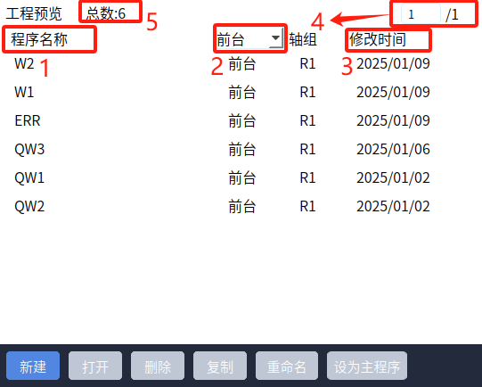

1、程序名称：可通过手动点击或者按键的方式实现按照字母的先后顺序排列（按键到达的方式：通过上下左右按键将光标到达"程序名称"上，再点击"选择"按键即可）

2、前台：页面默认为前台程序，开通过点击下拉框选择其他两种"全局、局部后台"

3、修改时间：是指程序程序最近依次的修改及运行的时间，可以实现正序或倒序排列，方法和程序名称一样

4、显示当前在的页面位置以及共有多少页程序，每一页共有十个不同名称的程序

5、总数：是指控制器内所有程序的数量（不是一页的程序数）

按钮说明：

【新建】：新建程序，点击【新建】按钮即可进入新建程序页面，命名规则：1、必须以字母或汉字开头；2、程序名称字符大于或等于2，字符最大不超过30，命名完点击下方【确定】即可

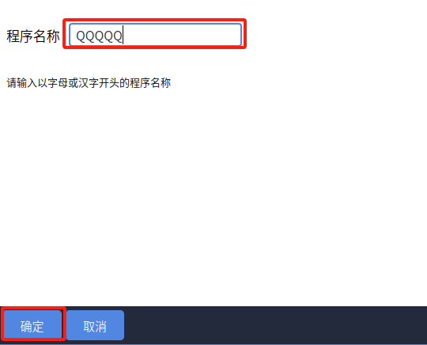

【打开】：选中程序，点击【打开】按钮，即可打开程序，程序选中状态为蓝色背景

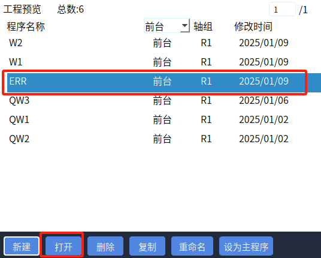

【删除】：选中要删除的程序，点击【删除】即可

【复制】：复制程序，自动在当前文件名后面加上"01"，也可重命名，命名完点击【确定】即可

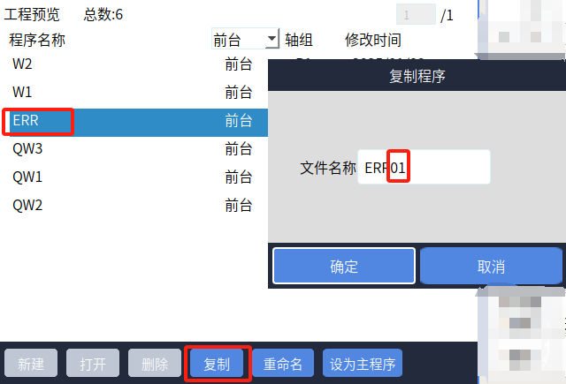

【重命名】：将程序重命名，选中程序，点击【重命名】，页面跳转到程序命名界面

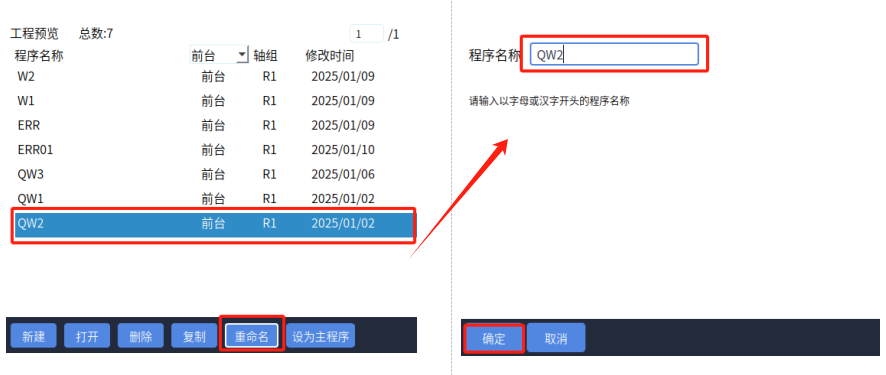

【设为主程序】：选中程序，点击【设为主程序】按钮，程序名称前面会有一个星号（\）标识

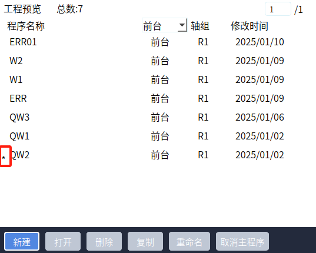

### 新建程序

选择新建程序，进入新建程序页面，命名规则：1、必须以字母或汉字开头；2、程序名称字符大于或等于2，字符最大不超过30，命名完点击下方【确定】即可

## 日志

主要用于查看各类信息详情以及导出日志，如下图所示：

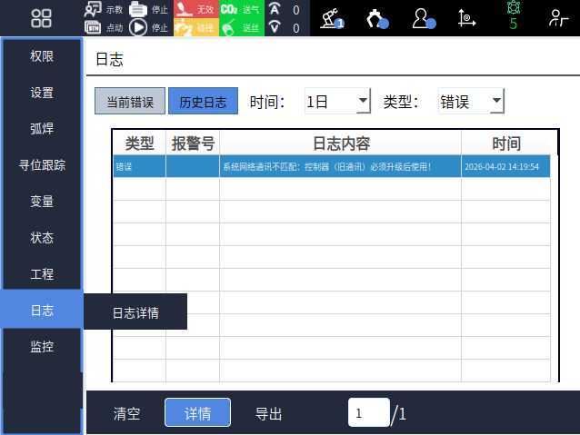

【当前错误】：当前运行程序报错产生的

【历史日志】：保存产生的日志信息，最多500页

【时间】：作为删选使用，有"1日、3日、7日"，三种形态可选

【类型】：日志的类型，共有"全部、操作、消息、警告、错误"等五类可选

【清空】：点击之后会弹出提示框，当再次【确定】之后会清空所有日志信息

【详情】：选中一条日志，点击【详情】按钮，会显示该条日志的详细状态

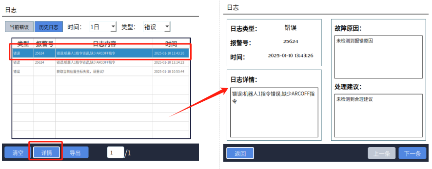

【导出】：用于导出日志（U盘已插好），弹出弹窗导出多少个日志，选择后点击【确定】，即可导入到U盘，并会弹出白色提示框，显示导出的日志的名称

页码输入框：当有多页日志时，可以跳转到具体的日志页面

## 监控

整体作为快捷方式以及便捷查看数据来使用，共有"快捷键、程序运行、机器坐标、历史指令、跟最误差、电机状态、IO状态、数值变量、轴速度、轨迹回放、位置变量、计算器"等12项，如图所示：

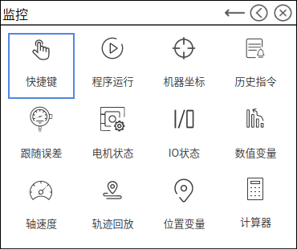

监控三按钮：

<table border="1" style="border-collapse: collapse;">
<tr><td></td><td>切换最近两次打开的二级弹窗页</td></tr>
<tr><td></td><td>返回监控主弹窗页面</td></tr>
<tr><td></td><td>关闭"监控"弹窗</td></tr>
</table>

### 快捷键：

部分常功能快捷操作的集合，有"回零、外部轴、回安全点、示教方式点动（单动）、拔出示教器、关机/重启、外部轴单动/联动"等，如图所示：

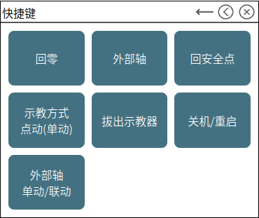

回零：机器人或外部轴回到设置的零点位置

外部轴：切换机器人及外部轴，能将当前状态从机器人切换至外部轴也能将当前状态从外部轴切换至机器人

回安全点：机器人回到设置的安全点位

示教器方式点动（单动）：有两种方式："点动（单动）/拖拽"，切换至拖拽模式的前提是必须完成当前机器人的动力学辨识（设置_人机协作_动力学数）

拔出示教器：有"拔出示教器/插入示教器"两种，点击拔出示教器后会有二次确认弹窗，点击【确定】后即可拔出，在拔出示教器的5秒之内不能"插入示教器；点击"插入示教器"，插入时能更改示教器IP，确认完点击【确定】即可插入，插入时会有一次"数据同步"过程

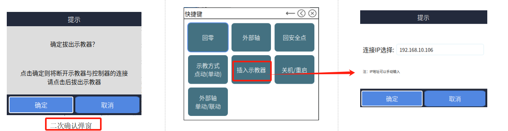

关机/重启：点击后会有二次弹窗选择关机或者是重启，选择完点击后还会有一个弹窗确认，点击【确定】即可执行关机或重启的功能，下图以重启为例

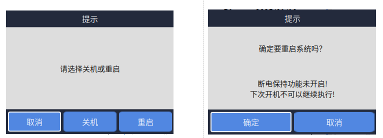

外部轴单动/联动：外部轴单动是指外部轴动，外部轴联动是指外部轴加机器人一起动，点击此快捷键可来回切换

### 程序运行：

当选择"主程序"时，能看到运行程序选择的机器人以及当前的运行模式、运行状态、运行次数、已运行时间；当选择的是"全局后台"时，会对已运行的后台程序进行编号并显示程序名，当有多个运行时，能通过"上一页、下一页"来进行切换

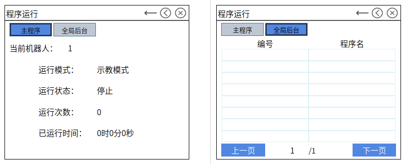

### 机器坐标：

能看到当前机器人的四个坐标的坐标值，当机器人在运行时，坐标会一起变化，并且能够实时检测量距

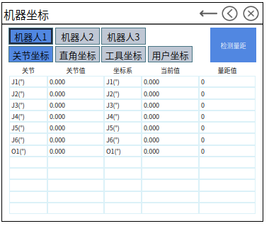

### 历史指令：

当运行程序时会根据程序运行的行数来记录，历史指令会记录当前运行的程序名称（文件名），以及运行的行号

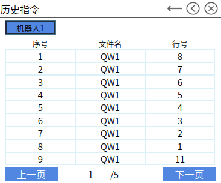

### 跟随误差：

跟最误差是指在示教器下达指令到机器人运动到点位的误差，此处能看到当前机器人运动时产生的误差以及当前机器人最大误差

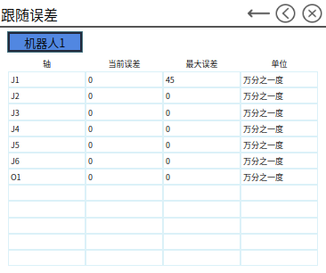

### 电机状态：

能查看到当前机器人的"电机扭矩、电机转速、电机负载、编码器位置、电机电流"等信息

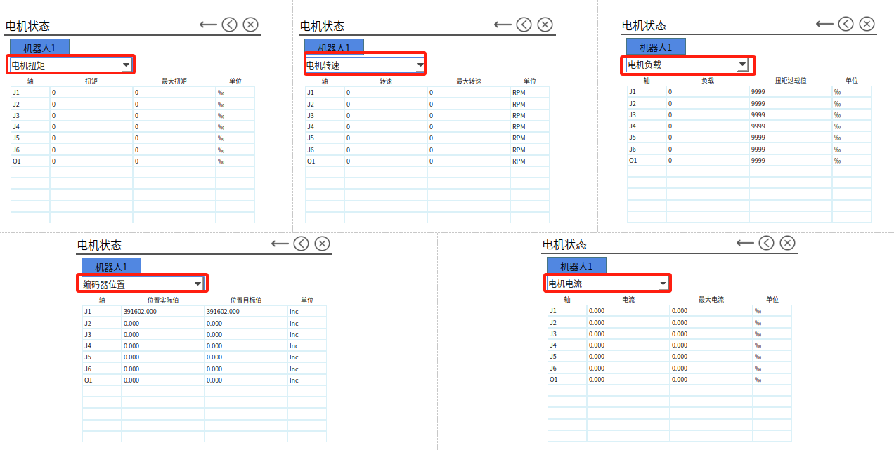

### IO状态：

能看到当前选择的IO版的数字输入、数字输出、模拟输入、模拟输出等情况

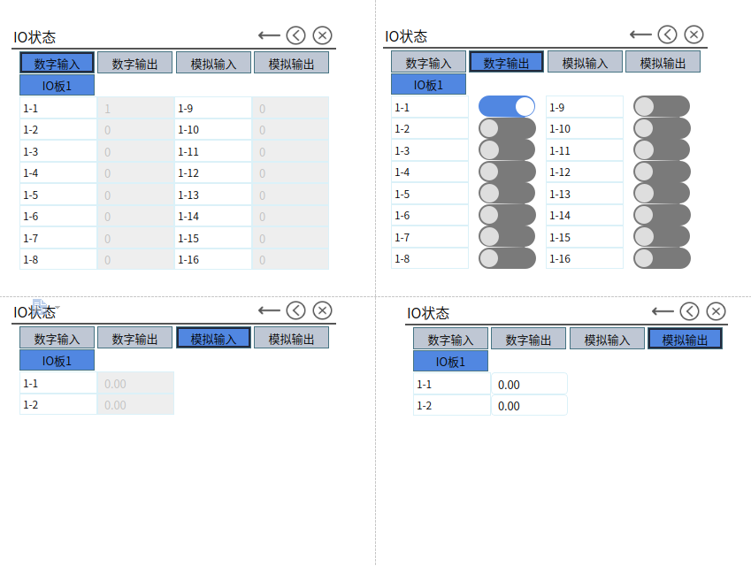

### 数值变化：

能看到"I、D、B、S、GI、GD、GB、GS"等8个变量值的当前数值情况

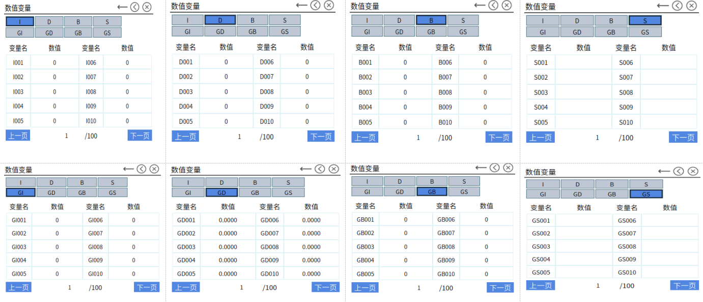

### 轴速度：

能看到机器人运动时的线速度和轴速度信息

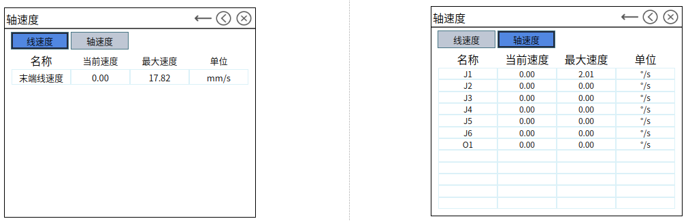

### 轨迹回放：

当机器人属于"拖拽"模式时，进行拖拽，记录机器人拖拽的轨迹，可以设置采样间隔、最大采样点以及轨迹名，轨迹名的命名规则：1、必须以字母或汉字开头；2、程序名称字符大于或等于2，字符最大不超过30

轨迹采集步骤：

1、机器人处于拖拽模式

2、点击【开始】，并开始拖拽机器人

3、拖拽完成后输入轨迹名，点击保存，保存的内容在"设置_人机协作_拖拽示教"同步记录

当拖拽有误时，点击【清除】按钮即可进行重新拖拽

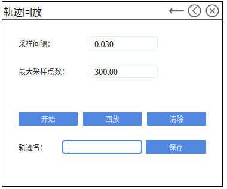

### 16.11. 位置变量：

查看4个位置变量（P、GP、E、GE）中已有的各个点位的当前信息

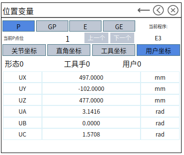

### 计算器：

能进行一些日常简单的加减乘除的运算

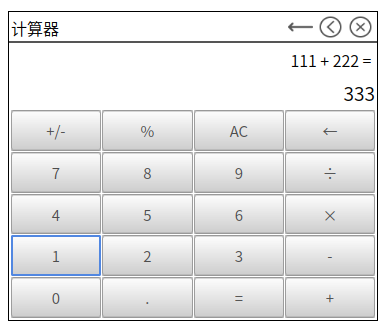

## 指令篇

### 运动控制类：

运动控制类共有"点到点、直线、圆弧、整圆、曲线、增量、外部轴点到点、外部轴直线、外部轴圆弧、全局速度、定点移动、双机点到点、双击直线、双机圆弧、双机整圆、外部点、外部轴随动、电子齿距、复位外部轴多圈转动量、拖拽示教、切换负载参数、门型运动、外部基准点直线、外部基准点圆弧、外部基准点整圆"等25项指令，如图所示：

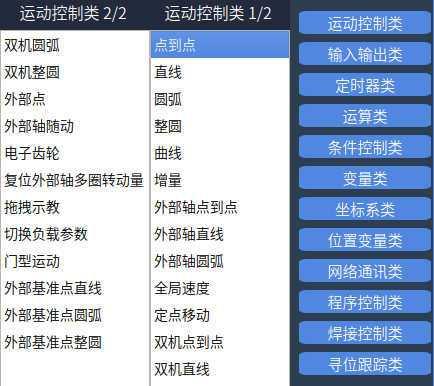

#### MOVJ-点到点

格式：MOVJ【指令名】 P/GP【变量】 VJ 【速度】 PL【平滑】
ACC【加速度比率】 DEC【减速度比率】 TIME
【提前执行时间，不设置则显示为0】。

功能：机器人向目标点移动中，不受轨迹约束的区间使用。机器人在空间内以最快的速度从一个点运行到另一个点。

参数：

<table border="1" style="border-collapse: collapse;">
<tr><td style="vertical-align: middle;">点位</td><td style="vertical-align: middle;">使用局部位置变量（P）或全局位置变量（GP）。当值为"新建"时，插入该指令则新建一个P变量，并将机器人的当前位置记录到该P变量</td></tr>
<tr><td style="vertical-align: middle;">VJ</td><td style="vertical-align: middle;">关节插补的速度，范围:\[1,100\]</td></tr>
<tr><td style="vertical-align: middle;">PL</td><td style="vertical-align: middle;">平滑过渡等级，范围\[0,5\]</td></tr>
<tr><td style="vertical-align: middle;">ACC</td><td style="vertical-align: middle;">加速度比率，范围\[1,100\]</td></tr>
<tr><td style="vertical-align: middle;">DEC</td><td style="vertical-align: middle;">减速度比率，范围\[1,100\]</td></tr>
<tr><td style="vertical-align: middle;">TIME</td><td style="vertical-align: middle;">提前执行时间，单位ms</td></tr>
</table>

示例：

1.  NOP

2.  MOVJ P0001 VJ = 10 % PL =1 ACC = 5 DEC = 5 0

3.  MOVJ P0002 VJ = 10 % PL =1 ACC = 5 DEC = 5 0

4.  END

示例说明：机器人通过关节插补的方式从P0001运动到P0002。

#### MOVL-直线

格式：MOVL【指令名】P/GP【变量】 V【速度】 PL【平滑】 ACC【加速度比率】
DEC【减速度比率】 TIME 【提前执行时间，不设置则显示为0】。

功能：机器人向目标点移动的过程中，机器人末端运动的轨迹为直线。

参数：

<table border="1" style="border-collapse: collapse;">
<tr><td style="vertical-align: middle;">点位</td><td style="vertical-align: middle;">使用局部位置变量（P）或全局位置变量（GP）。当值为"新建"时，插入该指令则新建一个P变量，并将机器人的当前位置记录到P变量</td></tr>
<tr><td style="vertical-align: middle;">V</td><td style="vertical-align: middle;">直线插补的速度，范围1-1000（默认笛卡尔参数最大速度为1000，范围根据实际填写的笛卡尔参数变化），单位为mm/s</td></tr>
<tr><td style="vertical-align: middle;">PL</td><td style="vertical-align: middle;">平滑过渡等级，范围\[0,5\]</td></tr>
<tr><td style="vertical-align: middle;">ACC</td><td style="vertical-align: middle;">加速度比率，范围\[1,100\]</td></tr>
<tr><td style="vertical-align: middle;">DEC</td><td style="vertical-align: middle;">减速度比率，范围\[1,100\]</td></tr>
<tr><td style="vertical-align: middle;">TIME</td><td style="vertical-align: middle;">提前执行时间，单位ms</td></tr>
</table>

示例：

1.  NOP

2.  MOVL P0001 V = 200 mm/s PL = 0 ACC = 20 DEC=20 0

3.  MOVL P0002 V = 200 mm/s PL = 0 ACC = 20 DEC=20 0

4.  MOVL P0003 V = 200 mm/s PL = 0 ACC = 20 DEC=20 0

5.  MOVL P0004 V = 200 mm/s PL = 0 ACC = 20 DEC=20 0

6.  END

示例说明：机器人从P0001点通过直线插补的方式向目标点运动,运动过程中机器人末端运动的轨迹为直线。

#### MOVC-圆弧

格式：MOVC【指令名】P/GP【变量】 V【速度】 PL【平滑】 ACC【加速度比率】
DEC【减速度比率】 TIME 【提前执行时间，不设置则显示为0】。

功能：圆弧插补方式移动到示教的三个点位

参数：

<table border="1" style="border-collapse: collapse;">
<tr><td style="text-align: center;">点位</td><td style="text-align: center;">使用局部位置变量（P）或全局位置变量（GP）。当值为"新建"时，插入该指令则新建一个P变量，并将机器人的当前位置记录到该P变量</td></tr>
<tr><td style="vertical-align: middle;">V</td><td style="vertical-align: middle;">直线插补的速度，范围1-1000（默认笛卡尔参数最大速度为1000，范围根据实际填写的笛卡尔参数变化），单位为mm/s</td></tr>
<tr><td style="vertical-align: middle;">PL</td><td style="vertical-align: middle;">平滑过渡等级，范围\[0,5\]</td></tr>
<tr><td style="vertical-align: middle;">ACC</td><td style="vertical-align: middle;">加速度比率，范围\[1,100\]</td></tr>
<tr><td style="vertical-align: middle;">DEC</td><td style="vertical-align: middle;">减速度比率，范围\[1,100\]</td></tr>
<tr><td style="vertical-align: middle;">TIME</td><td style="vertical-align: middle;">提前执行时间，单位ms</td></tr>
<tr><td style="vertical-align: middle;">SPIN</td><td style="vertical-align: middle;">示教姿态：姿态从第一点直接往第三点运行。  姿态倾角不变：全程保持第一个点的倾角不变，运行整个轨迹（第二第三点无论什么姿态都不影响  变量表示：0示教姿态，1姿态倾角不变</td></tr>
</table>
注意事项：机器人走一个完整的圆弧轨迹需插入一条MOVJ或者MOVL指令，然后插入两条MOVC指令，否则程序运行时会报错（机器人1指令错误，孤立MOVC指令）。

示例：

1.  NOP

2.  MOVL P0001 V=100mm/s PL=0 ACC=1 DEC=1 0

3.  MOVL P0002 V=100mm/s PL=0 ACC=1 DEC=1 0 圆弧起始点

4.  MOVC P0003 V=100mm/s PL=0 ACC=10 DEC=10 0 圆弧中间点

5.  MOVC P0004 V=100mm/s PL=0 ACC=10 DEC=10 0 圆弧终点

6.  END

示例说明：机器人从P0001点运行到圆弧起始点，到达圆弧起始点后开始走圆弧轨迹。

#### MOVCA-整圆

格式：MOVCA【指令名】P/GP【变量】 V【速度】 PL【平滑】 ACC【加速度比率】
DEC【减速度比率】 TIME 【提前执行时间，不设置则显示为0】。

功能：机器人通过示教的三个点位走整圆轨迹。

参数：

<table border="1" style="border-collapse: collapse;">
<tr><td style="text-align: center;">点位</td><td style="text-align: center;">使用局部位置变量（P）或全局位置变量（GP）。当值为"新建"时，插入该指令则新建一个P变量，并将机器人的当前位置记录到该P变量</td></tr>
<tr><td style="vertical-align: middle;">V</td><td style="vertical-align: middle;">直线插补的速度，范围1-1000（默认笛卡尔参数最大速度为1000，范围根据实际填写的笛卡尔参数变化），单位为mm/s</td></tr>
<tr><td style="vertical-align: middle;">PL</td><td style="vertical-align: middle;">平滑过渡等级，范围\[0,5\]</td></tr>
<tr><td style="vertical-align: middle;">ACC</td><td style="vertical-align: middle;">加速度比率，范围\[1,100\]</td></tr>
<tr><td style="vertical-align: middle;">DEC</td><td style="vertical-align: middle;">减速度比率，范围\[1,100\]</td></tr>
<tr><td style="vertical-align: middle;">TIME</td><td style="vertical-align: middle;">提前执行时间，单位ms</td></tr>
<tr><td style="vertical-align: middle;">SPIN</td><td style="vertical-align: middle;">姿态不变：整圆运行的姿态和的第一个点位示教的姿态(MOVJ,MOVL的标定姿态)相同，并以这个姿态走完整圆轨迹  六轴不转：整圆的运行会按照每个点位示教的姿态进行运动，同时六轴是固定不动的  六轴旋转：整圆的运行会按照每个点位示教的姿态进行运动</td></tr>
</table>
注意事项：机器人走一个完整的整圆轨迹需插入一条MOVJ或者MOVL指令，然后插入两条MOVCA指令，否则程序运行时会报错（机器人1指令错误，孤立MOVCA指令）。

示例：

1.  NOP

2.  MOVL P0001 V=50mm/s PL=0 ACC=1 DEC=1 0

3.  MOVL P0002 V=50mm/s PL=0 ACC=1 DEC=1 0 整圆起始点

4.  MOVC P0003 V=100mm/s PL=0 ACC=10 DEC=10 0 整圆过度点

5.  MOVC P0004 V=100mm/s PL=0 ACC=10 DEC=10 0 整圆终点

6.  END

示例说明：机器人从安全点P0001运行到整圆轨迹起始点P0002，到达整圆起始点后走整圆轨迹。

#### MOVS-曲线

格式：MOVCA【指令名】P/GP【变量】 V【速度】 PL【平滑】 ACC【加速度比率】
DEC【减速度比率】 TIME 【提前执行时间，不设置则显示为0】。

功能：在焊接、切割、熔接、涂底漆等作业时，使用自由曲线插补，对于不规则曲线工件的示教作业可变得容易。

参数：

<table border="1" style="border-collapse: collapse;">
<tr><td style="vertical-align: middle;">点位</td><td style="vertical-align: middle;">使用局部位置变量（P）或全局位置变量（GP）。当值为"新建"时，插入该指令则新建一个P变量，并将机器人的当前位置记录到该P变量</td></tr>
<tr><td style="vertical-align: middle;">V</td><td style="vertical-align: middle;">直线插补的速度，范围1-1000（默认笛卡尔参数最大速度为1000，范围根据实际填写的笛卡尔参数变化），单位为mm/s</td></tr>
<tr><td style="vertical-align: middle;">PL</td><td style="vertical-align: middle;">平滑过渡等级，范围\[0,5\]</td></tr>
<tr><td style="vertical-align: middle;">ACC</td><td style="vertical-align: middle;">加速度比率，范围\[1,100\]</td></tr>
<tr><td style="vertical-align: middle;">DEC</td><td style="vertical-align: middle;">减速度比率，范围\[1,100\]</td></tr>
<tr><td style="vertical-align: middle;">TIME</td><td style="vertical-align: middle;">提前执行时间，单位ms</td></tr>
</table>

注意事项：曲线轨迹最少需要示教四个曲线点位，否则程序运行会报错（机器人1指令错误，MOVS指令不能少于4条）。

示例：使用曲线插补示教四个点，形成一条曲线轨迹。

1.  NOP

2.  MOVL P0001 V = 100mm/s PL = 0 ACC = 10 DEC = 10 0 安全点

3.  MOVS P0002 V = 100 mm/s PL = 0 ACC = 10 DEC = 10 0 曲线起始点

4.  MOVS P0003 V = 100mm/s PL = 0 ACC = 10 DEC = 10 0 曲线中间点

5.  MOVS P0004 V = 100 mm/s PL = 0 ACC = 10 DEC = 10 0 曲线中间点

6.  MOVS P0005 V = 100 mm/s PL = 0 ACC = 10 DEC = 10 0 曲线中间点

7.  MOVS P0006 V = 100mm/s PL = 0 ACC = 10 DEC = 10 0 曲线结束点

8.  MOVL P0007 V = 100mm/s PL = 0 ACC = 10 DEC = 10 0 整条轨迹的结束点

9.  END

示例说明：机器人从P0001点运行到曲线轨迹的起始点,到达在曲线起始点后开始走曲线轨迹P0002-P0006,走完整个曲线轨迹后最后运行到P0007，整条运动轨迹运行结束。

#### IMOV-增量

格式：IMOV【指令名】 RP【变量】 V/VJ【速度】 RF BF TF UF【坐标系】
PL【平滑】 ACC【加速度比率】 DEC【减速度比率】 TIME
【提前执行时间，不设置则显示为0】。

功能：通过关节或直线的插补方式从当前位置移动设定的增量数值。

参数：

<table border="1" style="border-collapse: collapse;">
<tr><td style="text-align: center;">RP</td><td style="text-align: center;">增量变量,记录增量位置数据</td></tr>
<tr><td style="vertical-align: middle;" rowspan="2">V/VJ</td><td style="vertical-align: middle;">V：直线插补速度</td></tr>
<tr><td style="vertical-align: middle;">VJ：关节插补速度</td></tr>
<tr><td style="vertical-align: middle;">PL</td><td style="vertical-align: middle;">平滑过渡等级，范围\[0,5\]</td></tr>
<tr><td style="vertical-align: middle;">坐标系</td><td style="vertical-align: middle;">关节坐标，直角坐标，工具坐标，用户坐标</td></tr>
<tr><td style="vertical-align: middle;">ACC</td><td style="vertical-align: middle;">加速度比率，范围\[1,100\]</td></tr>
<tr><td style="vertical-align: middle;">DEC</td><td style="vertical-align: middle;">减速度比率，范围\[1,100\]</td></tr>
<tr><td style="vertical-align: middle;">TIME</td><td style="vertical-align: middle;">提前执行时间，单位ms</td></tr>
</table>
注意事项：错误处理：在插入增量指令时，如果坐标系选择工具坐标，点位工具要和实际使用工具统一，否则程序运行会报错（例如：机器人1工具手使用错误，点位工具为1，实际使用工具为2）。

示例：

<table border="1" style="border-collapse: collapse;">
<tr><td style="text-align: center;" colspan="3">坐标系可选择关节、直角、工具、用户四种坐标系，对应轴填正数为正方向，负数为反方向，若不动则填0</td></tr>
<tr><td style="vertical-align: middle;">坐标系</td><td style="vertical-align: middle;">设置的位置参数值</td><td style="vertical-align: middle;">示例介绍</td></tr>
<tr><td style="vertical-align: middle;">关节坐标（RF）</td><td style="vertical-align: middle;">JI-(10)  J2-(-5)  J3-0  J4-0  J5-0  J6-0</td><td style="vertical-align: middle;">IMOV RP0001 VJ=10% RF PL=0 ACC=1 DEC=10  机器人在当前位置关节坐标的JI轴增加10，J2轴减5,其它轴数值不变</td></tr>
<tr><td style="vertical-align: middle;">直角坐标（BF）</td><td style="vertical-align: middle;">X-(-20)  Y-(35)  Y-(50)  A-0  B-0  C-0</td><td style="vertical-align: middle;">IMOV RP0002 V=10mm/s BF PL=0 ACC=1 DEC=10  机器人在当前位置直角坐标X轴减少20mm，Y轴增加35mm,Z轴增加50mm，其它坐标轴数值不变</td></tr>
<tr><td style="vertical-align: middle;">工具坐标（TF）</td><td style="vertical-align: middle;">TX-(10)  TY-(20)  TZ-(-30)  TA-1  TB-0  TC-0</td><td style="vertical-align: middle;">IMOV RP0003 V=10mm/sTF PL=0 ACC=1 DEC=10  机器人在当前位置工具坐标X轴增加10mm，Y轴增加20mm,Z轴减少30mm</td></tr>
<tr><td style="vertical-align: middle;">用户坐标（UF）</td><td style="vertical-align: middle;">UX-(0)  UY-(-20)  UZ-(-30)  UA-(0)  UB-(-1)  UC-0</td><td style="vertical-align: middle;">IMOV RP0003 V=10mm/sTF PL=0 ACC=1 DEC=10  机器人在当前位置工具坐标X轴增加10mm，Y轴增加20mm,Z轴减少30mm</td></tr>
</table>
外部轴指令

问题：什么是外部轴？

解答：外部轴是指除去机器人本体的轴，为了工作需要所以在加上的轴，被用于喷涂，焊接，切割等行业。

问题：如何设置外部轴？

解答：点击设置-机器人参数-从站配置，从站列表界面点击【外部轴】进入外部轴配置界面。点击【修改】设置外部轴组数，外部轴型号点击保存，然后点击【轴组组号】在轴组组合配置界面选中外部轴组。

问题：如何设置外部轴参数？

解答：点击设置-外部轴参数，进入外部轴参数界面。标定外部轴，外部轴的标定方法参考《外部轴使用手册》，设置外部轴关节参数等，参数设置完成后，就可以使用外部轴工作了

注意事项：当修改外部轴指令的速度时，加速度比率和减速度比率会与速度成1：1的倍数关系自动显示，如需修改加速度比率或减速度比率，可手动操作。

#### MOVJEXT-外部轴点到点

格式：MOVJEXT【指令名】 E/GE【变量】 VJ 【速度】 PL【平滑】
ACC【加速度比率】DEC【减速度比率】TIME 【提前执行时间，不设置则显示为0】

功能：机器人以关节插补方式向示教位置移动，外部轴在旋转时机器人通过示教的点位在外部轴上运动

参数：

<table border="1" style="border-collapse: collapse;">
<tr><td style="vertical-align: middle;">E</td><td style="vertical-align: middle;">记录机器人与外部轴位置数据的变量。当值为"新建"时，插入该指令则新建一个E变量，并将机器人与外部轴的当前位置记录到该E变量。</td></tr>
<tr><td style="vertical-align: middle;">VJ</td><td style="vertical-align: middle;">关节插补的速度，范围\[1,100\]</td></tr>
<tr><td style="vertical-align: middle;">EVJ</td><td style="vertical-align: middle;">外部轴速度，范围\[1,100\]</td></tr>
<tr><td style="vertical-align: middle;">PL</td><td style="vertical-align: middle;">平滑过渡等级，范围\[0,5\]</td></tr>
<tr><td style="vertical-align: middle;">ACC</td><td style="vertical-align: middle;">加速度比率，范围\[1,100\]</td></tr>
<tr><td style="vertical-align: middle;">DEC</td><td style="vertical-align: middle;">减速度比率，范围\[1,100\]</td></tr>
<tr><td style="vertical-align: middle;">TIME</td><td style="vertical-align: middle;">提前时间执行下一条指令。单位ms</td></tr>
</table>

示例：

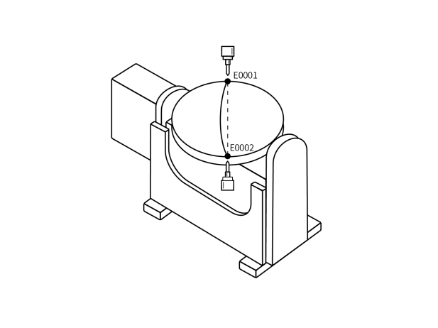

1.  NOP

2.  MOVJEXT E0001 VJ = 10 % PL = 0 ACC= 10 DEC = 10 0

3.  MOVJEXT E0002 VJ = 20 % PL = 0 ACC= 10 DEC = 10 0

4.  END

示例说明：机器人从E0001运动到E0002，并且E0001-E0002的运动过程中外部轴旋转。

#### MOVLEXT-外部轴直线

格式：MOVLEXT【指令名】 E/GE【变量】 V【速度】 PL【平滑】
ACC【加速度比率】DEC【减速度比率】SYNC【变位机同步,"0"表示没有开启同步,"1"表示打开了同步】
TIME 【提前执行时间，不设置则显示为0】

功能:机器人以直线插补的方式向示教位置移动，外部轴在旋转时机器人在外部轴上走直线轨迹

参数：

<table border="1" style="border-collapse: collapse;">
<tr><td style="text-align: center; vertical-align: middle;">E</td><td style="text-align: center; vertical-align: middle;">记录机器人与外部轴位置数据的变量。当值为"新建"时，插入该指令则新建一个E变量，并将机器人与外部轴的当前位置记录到该变量。</td></tr>
<tr><td style="text-align: center; vertical-align: middle;">V</td><td style="vertical-align: middle;">直线插补的速度，范围1-1000（默认笛卡尔参数最大速度为1000，范围根据实际填写的笛卡尔参数变化），单位为mm/s</td></tr>
<tr><td style="text-align: center; vertical-align: middle;">EVJ</td><td style="vertical-align: middle;">外部轴速度，范围\[1,100\]</td></tr>
<tr><td style="text-align: center; vertical-align: middle;">PL</td><td style="vertical-align: middle;">平滑过渡等级，范围\[0,5\]</td></tr>
<tr><td style="text-align: center; vertical-align: middle;">ACC</td><td style="vertical-align: middle;">加速度比率，范围\[1,100\]</td></tr>
<tr><td style="text-align: center; vertical-align: middle;">DEC</td><td style="vertical-align: middle;">减速度比率，范围\[1,100\]</td></tr>
<tr><td style="text-align: center; vertical-align: middle;">TIME</td><td style="vertical-align: middle;">提前时间执行下一条指令。单位ms</td></tr>
<tr><td style="text-align: center; vertical-align: middle;">SYNC</td><td style="vertical-align: middle;">SYNC 变位机是否同步  打开同步：机器人与外部轴协同走直线  关闭同步：机器人在空间走直线，外部轴独立运动到目标位置</td></tr>
</table>
注意事项：在使用外部轴直线指令前需要在外部轴标定界面选中外部轴组号，否则程序运行时会报错。标定外部轴时需要准确的标定，否则在走外部轴直线指令时，机器人与外部轴同步会有问题。

示例：

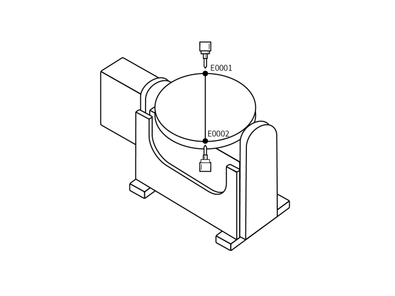

1.  NOP

2.  MOVLEXT E0001 V = 50 mm/s PL = 0 ACC = 1 DEC = 1 SYNC = 1 0

3.  MOVLEXT E0002 V = 50 mm/s PL = 0 ACC = 1 DEC = 1 SYNC = 1 0

4.  END

示例说明：机器人从安全点位运动到E0001，到达E0001机器人与外部轴协作走直线轨迹运行到
E0002。

#### MOVCEXT-外部轴圆弧

格式：MOVCEXT【指令名】 E/GE【变量】 V【速度】 PL【平滑】
ACC【加速度比率】DEC【减速度比率】SYNC【变位机同步,"0"表示没有开启同步,"1"表示打开了同步】
TIME 【提前执行时间，不设置则显示为0】

功能：机器人以圆弧插补方式向示教位置移动，外部轴用关节插补的方式运动。机器人末端执行器从E0001-E0003走圆弧轨迹，并且在走圆弧轨迹时外部轴旋转。

参数：

<table border="1" style="border-collapse: collapse;">
<tr><td style="text-align: center; vertical-align: middle;">E</td><td style="text-align: center; vertical-align: middle;">记录机器人与外部轴位置数据的变量。当值为"新建"时，插入该指令则新建一个E变量，并将机器人与外部轴的当前位置记录到该变量。</td></tr>
<tr><td style="text-align: center; vertical-align: middle;">V</td><td style="vertical-align: middle;">直线插补的速度，范围1-1000（默认笛卡尔参数最大速度为1000，范围根据实际填写的笛卡尔参数变化），单位为mm/s</td></tr>
<tr><td style="text-align: center; vertical-align: middle;">EVJ</td><td style="vertical-align: middle;">外部轴速度，范围\[1,100\]</td></tr>
<tr><td style="text-align: center; vertical-align: middle;">PL</td><td style="vertical-align: middle;">平滑过渡等级，范围\[0,5\]</td></tr>
<tr><td style="text-align: center; vertical-align: middle;">ACC</td><td style="vertical-align: middle;">加速度比率，范围\[1,100\]</td></tr>
<tr><td style="text-align: center; vertical-align: middle;">DEC</td><td style="vertical-align: middle;">减速度比率，范围\[1,100\]</td></tr>
<tr><td style="text-align: center; vertical-align: middle;">TIME</td><td style="vertical-align: middle;">提前时间执行下一条指令。单位ms</td></tr>
<tr><td style="text-align: center; vertical-align: middle;">SYNC</td><td style="vertical-align: middle;">SYNC 变位机是否同步  
打开同步：机器人与外部轴协同走圆弧  
关闭同步：机器人在空间走圆弧，外部轴独立运动到目标位置</td></tr>
</table>
注意事项：在使用外部轴圆弧指令前需要在外部轴标定界面选中外部轴组号，否则程序运行时会报错。标定外部轴时需要准确的标定，否则在走外部轴圆弧指令时，机器人与外部轴同步会有问题

示例：

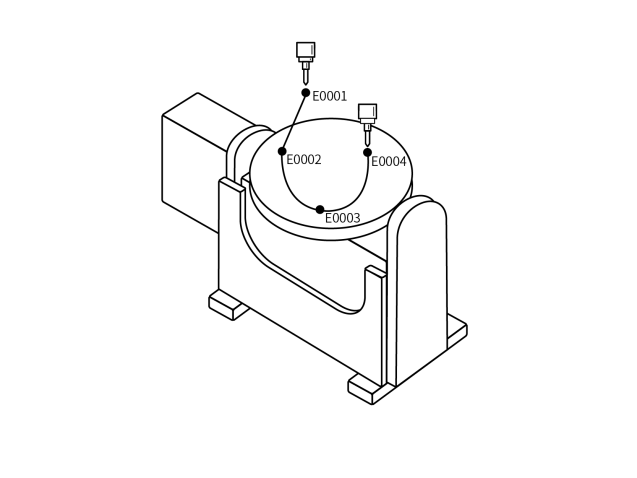

1.  NOP

2.  MOVL E0001V = 100 mm/s PL = 0 ACC = 1 DEC = 1 0 安全点

3.  MOVLEXT E0002 V = 50 mm/s PL = 0 ACC = 1 DEC = 1 SYNC = 1 0
    圆弧开始点

4.  MOVCEXT E0003 V = 50 mm/s PL = 0 ACC = 1 DEC = 1 SYNC = 1 0
    圆弧中间点

5.  MOVCEXT E0004 V = 50 mm/s PL = 0 ACC = 1 DEC = 1 SYNC = 1 0
    圆弧结束点

6.  END

示例说明：机器人从当前位置运行到E0001点，从E0001点运行到圆弧开始点E0002，到达E0002后运行至圆弧中间点E0003
，在E0003点走完整个外部轴圆弧轨迹。E0002-E0004运动过程中机器人与外部轴协作走圆弧，机器人在向示教的目标点移动时，外部轴也在同步旋转。

#### SPEED-全局速度

格式：SPEED【指令名】 10%【设置的速度参数】。

功能：整体修改SPEED指令下运动类指令的速度。

参数：

<table border="1" style="border-collapse: collapse;">
<tr><td style="text-align: center; vertical-align: middle;">SPEED  范围\[1,200\]%</td><td style="text-align: center; vertical-align: middle;">手填：直接手输速度参数  变量：通过给变量赋值的形式设置速度参数</td></tr>
</table>
注意事项：SPEED指令以下的运动类指令速度计算方式：

线速度：指令速度\状态栏速度\SPEED全局速度的百分比。

轴速度：关节额定正速度\指令速度\状态栏速度\SPEED全局速度的百分比。

程序在运行时可以在监控-轴速度界面看当前速度和最大速度。

示例：设置全局速度为50%：

1.  NOP

2.  MOVL GP0001 V = 200 mm/s PL = 2 ACC = 20 DEC=20 0

3.  MOVL GP0002 V = 200 mm/s PL = 2 ACC = 20 DEC=20 0

4.  SPEED= 80%

5.  MOVL GP0003 V = 100 mm/s PL = 2 ACC = 20 DEC=20 0

6.  MOVL GP0004 V = 100 mm/s PL = 2 ACC = 20 DEC=20 0

7.  MOVL GP0005 V = 100 mm/s PL = 2 ACC = 20 DEC=20 0

8.  END

示例说明：GP0001-GP0002运行时的线速度：指令速度200 mm/s\全局速度50%。

GP0002-GP0004运行时的线速度：指令速度100mm/s\全局速度50%\SPEED全局速度80%。

#### SAMOV-定点移动

格式：SAMOV【指令名】 AP【变量】 V/VJ【速度】 RF BF TF UF【坐标系】
PL【平滑】 ACC【加速度比率】 DEC【减速度比率】 TIME
【提前执行时间，不设置则显示为0】。

功能：机器人定点移动到设置的点位。

参数：

<table border="1" style="border-collapse: collapse;">
<tr><td style="text-align: center; vertical-align: middle;">AP</td><td style="text-align: center; vertical-align: middle;">定点移动变量,记录位置数据</td></tr>
<tr><td style="text-align: center; vertical-align: middle;">V/VJ</td><td style="vertical-align: middle;">V：直线插补速度</td></tr>
<tr><td style="vertical-align: middle;">&nbsp;</td><td style="vertical-align: middle;">VJ：关节插补速度</td></tr>
<tr><td style="text-align: center; vertical-align: middle;">PL</td><td style="vertical-align: middle;">平滑过渡等级，范围\[0,5\]</td></tr>
<tr><td style="text-align: center; vertical-align: middle;">坐标系</td><td style="vertical-align: middle;">关节坐标，直角坐标，工具坐标，用户坐标</td></tr>
<tr><td style="text-align: center; vertical-align: middle;">ACC</td><td style="vertical-align: middle;">加速度比率，范围\[1,100\]</td></tr>
<tr><td style="text-align: center; vertical-align: middle;">DEC</td><td style="vertical-align: middle;">减速度比率，范围\[1,100\]</td></tr>
<tr><td style="text-align: center; vertical-align: middle;">TIME</td><td style="vertical-align: middle;">提前执行时间，单位ms</td></tr>
</table>
参数设定：

<table border="1" style="border-collapse: collapse;">
<tr><td style="text-align: center; vertical-align: middle;">坐标系</td><td style="text-align: center; vertical-align: middle;">设置的位置参数值</td><td style="text-align: center; vertical-align: middle;">示例介绍</td></tr>
<tr><td style="text-align: center; vertical-align: middle;">关节坐标（RF）</td><td style="vertical-align: middle;">JI-(10)  J2-(-5)  J3-0  
J4  
J5  
J6</td><td style="vertical-align: middle;">SAMOV AP0001 VJ=10% RF PL=0 ACC=1 DEC=10  机器人移动到设置好的关节点位，关节坐标下J1轴的坐标值为10，J2轴的坐标值为-5，其它轴的坐标值不变</td></tr>
<tr><td style="text-align: center; vertical-align: middle;">直角坐标（BF）</td><td style="vertical-align: middle;">X-(300)Y-(0)  
Z-(120)   
A  
B   
C</td><td style="vertical-align: middle;">SAMOV AP0002 VJ=10% BF PL=0 ACC=1 DEC=10  机器人移动到设置好的直角点位，直角坐标下X轴的坐标值为300，Y轴的坐标值为O，Z轴的坐标值为120，其它轴的坐标值不变</td></tr>
<tr><td style="text-align: center; vertical-align: middle;">工具坐标（TF）</td><td style="vertical-align: middle;">TX-(300)TY-(0)  
TZ   
TA-(3.14)   
TB   
TC</td><td style="vertical-align: middle;">SAMOV AP0003 VJ=10% TF PL=0 ACC=1 DEC=10  机器人移动到工具点位，工具坐标下X轴的坐标值为300，Y轴的坐标值为O，姿态轴A轴的坐标值为3.14rad，其它轴的坐标值不变</td></tr>
<tr><td style="text-align: center; vertical-align: middle;">用户坐标（UF）</td><td style="vertical-align: middle;">UX  UY-(120) 
UZ-(100)   
UA   
UB   
UC</td><td style="vertical-align: middle;">SAMOV AP0004 VJ=10% UF PL=0 ACC=1 DEC=10  机器人移动到用户点位，用户坐标下Y轴的坐标值为12O，Z轴的坐标值为100，其它轴的坐标值不变</td></tr>
</table>
注意事项：如果不需要移动某个轴，请在该轴的坐标处留空，不要填0（如果填写0的话，在运行这条指令时对应的坐标轴点位会变为0）。

示例：

假设机器人当前关节坐标系下的点位（30，15，20，25，30，10），插入定点移动指令，选择关节坐标系，设置需要修改的坐标轴参数。

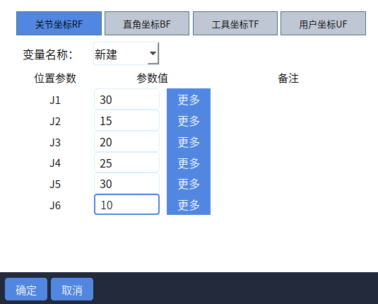

SAMOV AP0004 VJ=10% UF PL=0 ACC=1 DEC=1 0；

示例说明：执行定点移动指令，机器人运动到目标点位（15，16，30，40，50，20）。

#### 双机指令

双机工作模式：机器人双机协作是由两台六轴串联机器人协同完成，在整个工作过程中，机器人之间共同协调，以完成最终的任务目标。

问题：如何设置双机模式？

解答：

1.  点击设置-机器人参数-从站配置，进入从站配置界面点击【机器人】进入机器人配置界面设置机器人数目；

2.  两个机器人类型均选择六轴串联机器人（设置的两个机器人均无外部轴）；

3.  设置点击【保存】重启系统；

4.  在机器人1导入配置，robot_A（机器人1配置）与robot_B（机器人2配置）；

5.  在机器人参数-运动参数界面点击【修改】，打开双机同步模式，点击【保存】。

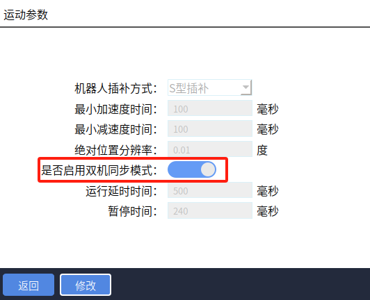

MOVJDOUBLE-双机点到点

格式：MOVJDOUBLE【指令名】E/GE【变量】 VJ 【速度】 ACC【加速度比率】
DEC【减速度比率】 TIME 【提前执行时间，不设置则显示为0】。

功能：两台机器通过关节插补从一个点运动到另一个点。

参数：

<table border="1" style="border-collapse: collapse;">
<tr><td style="text-align: center; vertical-align: middle;">E/GE</td><td style="vertical-align: middle;">记录机器人位置数据的变量。当值为"新建"时，插入该指令则新建一个E变量，并将机器人的当前位置记录到该E变量</td></tr>
<tr><td style="text-align: center; vertical-align: middle;">VJ</td><td style="vertical-align: middle;">关节插补的速度，范围:\[1,100\]</td></tr>
<tr><td style="text-align: center; vertical-align: middle;">ACC</td><td style="vertical-align: middle;">加速度比率，范围\[1,100\]</td></tr>
<tr><td style="text-align: center; vertical-align: middle;">DEC</td><td style="vertical-align: middle;">减速度比率，范围\[1,100\]</td></tr>
<tr><td style="text-align: center; vertical-align: middle;">TIME</td><td style="vertical-align: middle;">提前执行时间，单位ms</td></tr>
</table>

示例：

1.  NOP

2.  MOVJDOUBLE E0001 VJ = 10 % PL = 0 ACC= 10 DEC = 10 0

3.  MOVJDOUBLE E0002 VJ = 15 % PL = 0 ACC= 10 DEC = 10 0

4.  END

示例说明：程序启动时两台机器人根据示教的点位通过关节插补方式从E0001运动到E0002。

#### MOVLDOUBLE-双机直线

格式：MOVLDOUBLE【指令名】E/GE【变量】 V 【速度】 ACC【加速度比率】
DEC【减速度比率】 TIME 【提前执行时间，不设置则显示为0】。

功能:控制两台机器人通过直线插补运行到目标点位，机器人末端运动的轨迹为直线。

参数：

<table border="1" style="border-collapse: collapse;">
<tr><td style="text-align: center; vertical-align: middle;">E/GE</td><td style="vertical-align: middle;">记录机器人位置数据的变量。当值为"新建"时，插入该指令则新建一个E变量，并将机器人的当前位置记录到该E变量</td></tr>
<tr><td style="text-align: center; vertical-align: middle;">V</td><td style="vertical-align: middle;">直线插补的速度，范围1-1000（默认笛卡尔参数最大速度为1000，范围根据实际填写的笛卡尔参数变化），单位为mm/s</td></tr>
<tr><td style="text-align: center; vertical-align: middle;">ACC</td><td style="vertical-align: middle;">加速度比率，范围\[1,100\]</td></tr>
<tr><td style="text-align: center; vertical-align: middle;">DEC</td><td style="vertical-align: middle;">减速度比率，范围\[1,100\]</td></tr>
<tr><td style="text-align: center; vertical-align: middle;">TIME</td><td style="vertical-align: middle;">提前执行时间，单位ms</td></tr>
</table>

示例：

1.  NOP

2.  MOVLDOUBLE E0001 V = 100 mm/s PL = 0 ACC= 10 DEC = 10 0

3.  MOVLDOUBLE E0002 V = 50 mm/s PL = 0 ACC= 10 DEC = 10 0

4.  MOVLDOUBLE E0003 V = 50 mm/s PL = 0 ACC= 10 DEC = 10 0

5.  MOVLDOUBLE E0004 V = 50 mm/s PL = 0 ACC= 10 DEC = 10 0

6.  END

示例说明：程序启动时两台机器人根据示教的点位通过直线插补方式从E0001运动到E0004，机器人末端运动的轨迹为直线。

#### MOVCDOUBLE-双机圆弧

格式：MOVCDOUBLE【指令名】E/GE【变量】 V 【速度】 ACC【加速度比率】
DEC【减速度比率】 TIME 【提前执行时间，不设置则显示为0】。

功能:两个机器人在程序启动时走圆弧轨迹。

参数：

<table border="1" style="border-collapse: collapse;">
<tr><td style="text-align: center; vertical-align: middle;">E/GE</td><td style="vertical-align: middle;">记录机器人位置数据的变量。当值为"新建"时，插入该指令则新建一个E变量，并将机器人的当前位置记录到该E变量</td></tr>
<tr><td style="text-align: center; vertical-align: middle;">V</td><td style="vertical-align: middle;">直线插补的速度，范围1-1000（默认笛卡尔参数最大速度为1000，范围根据实际填写的笛卡尔参数变化），单位为mm/s</td></tr>
<tr><td style="text-align: center; vertical-align: middle;">ACC</td><td style="vertical-align: middle;">加速度比率，范围\[1,100\]</td></tr>
<tr><td style="text-align: center; vertical-align: middle;">DEC</td><td style="vertical-align: middle;">减速度比率，范围\[1,100\]</td></tr>
<tr><td style="text-align: center; vertical-align: middle;">TIME</td><td style="vertical-align: middle;">提前执行时间，单位ms</td></tr>
</table>

示例：

1.  NOP

2.  MOVLDOUBLE E0001 V = 10 % PL = 0 ACC= 10 DEC = 10 0

3.  MOVLDOUBLE E0002 V = 10 % PL = 0 ACC= 10 DEC = 10 0 圆弧起始点

4.  MOVCDOUBLE E0003 V = 100 mm/s PL = 0 ACC= 10 DEC = 10 0 圆弧过渡点

5.  MOVCDOUBLE E0004 V = 100mm/s PL = 0 ACC= 10 DEC = 10 0 圆弧终点

6.  END

示例说明：程序启动时两台机器人根据示教的点位通过直线插补方式从E0001运动到E0002，在E0002走完整个圆弧轨迹。

#### MOVCADOUBLE-双机整圆

格式：MOVCADOUBLE【指令名】E/GE【变量】 V 【速度】 ACC【加速度比率】
DEC【减速度比率】 TIME 【提前执行时间，不设置则显示为0】。

功能：机器人通过双机协作两个机器人同时走整圆轨迹。

参数：

<table border="1" style="border-collapse: collapse;">
<tr><td style="text-align: center; vertical-align: middle;">E/GE</td><td style="text-align: center; vertical-align: middle;">记录机器人位置数据的变量。当值为"新建"时，插入该指令则新建一个E变量，并将机器人的当前位置记录到该E变量</td></tr>
<tr><td style="text-align: center; vertical-align: middle;">V</td><td style="vertical-align: middle;">直线插补的速度，范围1-1000（默认笛卡尔参数最大速度为1000，范围根据实际填写的笛卡尔参数变化），单位为mm/s</td></tr>
<tr><td style="text-align: center; vertical-align: middle;">ACC</td><td style="vertical-align: middle;">加速度比率，范围\[1,100\]</td></tr>
<tr><td style="text-align: center; vertical-align: middle;">DEC</td><td style="vertical-align: middle;">减速度比率，范围\[1,100\]</td></tr>
<tr><td style="text-align: center; vertical-align: middle;">TIME</td><td style="vertical-align: middle;">提前执行时间，单位ms</td></tr>
<tr><td style="text-align: center; vertical-align: middle;">SPIN：机器人末梢旋转</td><td style="vertical-align: middle;">姿态不变：整圆运行的姿态和的第一个点位示教的姿态(MOVJ,MOVL的标定姿态)相同，并以这个姿态走完整圆轨迹  六轴不转：整圆的运行会按照每个点位示教的姿态进行运动，同时六轴是固定不动的  
六轴旋转；整圆的运行会按照每个点位示教的姿态进行运动</td></tr>
</table>
示例：

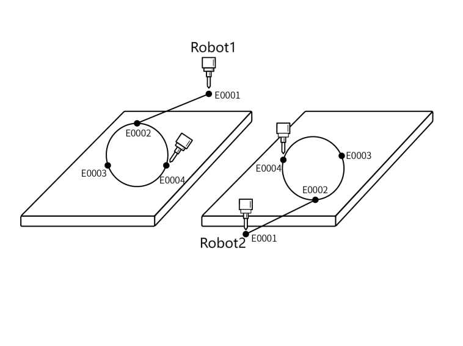

1.  NOP

2.  MOVLDOUBLE E0001 V = 10 % PL = 0 ACC= 10 DEC = 10 0

3.  MOVLDOUBLE E0002 V = 10 % PL = 0 ACC= 10 DEC = 10 0 整圆起始点

4.  MOVCADOUBLE E0003 V = 25 mm/s PL = 0 ACC= 10 DEC = 10 0 整圆过渡点

5.  MOVCADOUBLE E0004 V = 25 mm/s PL = 0 ACC= 10 DEC = 10 0 整圆终点

6.  END

示例说明：程序启动时两台机器人根据示教的点位通过直线插补方式从E0001运动到E0002，在E0002走完整个整圆轨迹。

#### MOVCOMM-外部点

格式：MOCOMM【指令名】 MOVJ/MOVL/MOVS/MOVC【插补方式】V/VJ【速度】
PL【平滑】 ACC【加速度比率】DEC【减速度比率】TIME
【提前执行时间，不设置则显示为0】。

功能：以规定的插补方式通过外部点指令运动到目标点位，可以通过6000,7000端口和视觉工艺发送外部点点位。

参数：

<table border="1" style="border-collapse: collapse;">
<tr><td style="text-align: center; vertical-align: middle;">插补方式</td><td style="text-align: center; vertical-align: middle;">关节、直线、曲线，圆弧</td></tr>
<tr><td style="text-align: center; vertical-align: middle;" rowspan="2">V/VJ</td><td style="vertical-align: middle;">V：直线插补速度，范围2-1000（默认笛卡尔参数最大速度为1000，范围根据实际填写的笛卡尔参数变化），单位为mm/s</td></tr>
<tr><td style="vertical-align: middle;">VJ：关节插补速度</td></tr>
<tr><td style="text-align: center; vertical-align: middle;">PL</td><td style="vertical-align: middle;">平滑过渡等级，范围\[0,5\]</td></tr>
<tr><td style="text-align: center; vertical-align: middle;">ACC</td><td style="vertical-align: middle;">加速度比率，范围\[1,100\]</td></tr>
<tr><td style="text-align: center; vertical-align: middle;">DEC</td><td style="vertical-align: middle;">减速度比率，范围\[1,100\]</td></tr>
<tr><td style="text-align: center; vertical-align: middle;">TIME</td><td style="vertical-align: middle;">提前执行时间，单位ms</td></tr>
</table>
问题：视觉工艺如何运行外部点？

1.  视觉工艺-视觉参数界面设置好参数，运行一个单独点位，打开单目标按钮。运行连续轨迹需要关闭单目标按钮；

2.  视觉位置参数界面将接受位置类型选择轨迹；

3.  插入外部点指令，机器人开始走发送的点位。

示例1:

1.  NOP

2.  VISION_RUN ID =1 视觉开始

3.  VISION_TRG ID =1 视觉触发

4.  VISION_TRACE ID =1 获取视觉轨迹位置

5.  MOCOMM MOVJ VJ=10% PL=0 ACC=10 DEC=10 0 外部点

6.  VISION_END ID =1 视觉结束

7.  END

示例说明：相机通讯成功，发送点位，获取轨迹位置点位存放位置选择外部点运动队列，再轨迹位置指令下面插入外部点指令。然后机器人开始走相机发送的外部点轨迹。

问题：6000，7000端口如何运行外部点指令？

解答：首先注意：6000端口连接时需要拔出示教器！

1.  6000/7000端口：根据《纳博特网络功能协议》查找命令字,发送数据(注意发送格式，发送格式不对的话会导致发送的数据不生效)。

2.  插入外部点指令，根据《纳博特网络功能协议》的格式发送点位，发送成功后，运行外部点指令机器人会根据发送的数据运行到目标点位。

3.  机器人会根据发送的数据运行单独的点位或者连续轨迹。

示例2：命令字9521，选择"连续轨迹"，"一次传输完全部轨迹点位"，设置的参数仅作为参考，有关其他参数设置可以查看《纳博特网络功能协议》，示例的协议格式如下：

{

\"robot\":1,

\"clearBuffer\":1,

\"targetMode\":1,

\"sendMode\":0,

\"cfg\":{

\"coord\":\"ACS\",

\"extMove\":1,

\"sync\":1,

\"speed\":100,

\"acc\":100

},

\"targetVec\":\[

{

\"Pos\": \[0.041551248380773474, -2.4360361628239624,
-3.2330625556135573, -0.11526996517990794, 84.33099586526323,
0.05293787887842427, -50.0, -0.003641843003143831, 0.0\],

\"axisVel\": \[-0.0158, -0.0022, -0.0114, -0.0, -0.0136, -0.0158, 0.0,
-0.8369, 0.0\],

\"axisAcc\": \[-0.79, -0.11, -0.57, -0.0, -0.68, -0.79, 0.0, -41.84,
0.0\],

\"timeStamp\":1000

},

{

\"Pos\": \[0.04091827209393009, -2.4361222744046107,
-3.2335192193925764, -0.1152700747519332, 84.33045182378399,
0.05230600132017571, -50.0, -0.010925529009431494, 0.0\],

\"axisVel\": \[-0.0316, -0.0043, -0.0228, -0.0, -0.0272, -0.0316, 0.0,
-1.6738, 0.0\],

\"axisAcc\": \[-0.79, -0.1, -0.57, 0.0, -0.68, -0.79, 0.0, -41.84,
0.0\],

\"timeStamp\":2000

}

\]

}

#### EXTMOV-外部轴随动

格式：EXTMOV【指令名】O1【运动的外部轴】COMST_T【外部轴随动类型】10【倍数】。

功能:外部轴按机器人线速度倍数的速度或恒速跟随机器人随动的指令。

参数：

<table border="1" style="border-collapse: collapse;">
<tr><td style="text-align: center; vertical-align: middle;">外部轴</td><td style="text-align: center; vertical-align: middle;">可选O1-O5某个轴进行随动</td></tr>
<tr><td style="text-align: center; vertical-align: middle;">类型</td><td style="vertical-align: middle;">外部轴的速度在监控中的轴速度中看  随动：随机器人实时速度改变速度   
恒速：恒定的某个速度运行 </td></tr>
<tr><td style="text-align: center; vertical-align: middle;">速度值</td><td style="vertical-align: middle;">当随动类型为恒速时速度值可以选择手填，变量</td></tr>
<tr><td style="text-align: center; vertical-align: middle;">K</td><td style="vertical-align: middle;">当随动类型为随动时可以填写值  K（倍数）：外部轴速度（°/s）=K*线速度（mm/s）</td></tr>

</table>
注意事项：外部轴随动指令中间不支持插入外部轴运动指令！

示例1：外部轴随动指令类型恒速，恒速值为10。

1.  NOP

2.  EXTMOV O1 COMST_T 10 随动开始

3.  MOVL P0001 V=50mm/s PL=0 ACC=1 DEC=1 0

4.  ENDEXTMOV 随动结束

5.  END

执行效果：机器人在向P0001移动的过程中，外部轴也会一起运动，在运动过程中外部轴的轴速度一直为10，机器人运行到P0001点后外部轴也停止运动。

示例2：外部轴随动指令类型随动，K=2。

1.  NOP

2.  EXTMOV O1 FOLLOW 2 随动开始

3.  MOVL P0001 V=10mm/s PL=0 ACC=1 DEC=1 0

4.  ENDEXTMOV 随动结束

5.  END

示例说明：机器人在向P0001移动的过程中，外部轴一起运动，在运动过程中外部轴的轴速度是随着机器人速度的变化而变化的，机器人运行到P0001点后外部轴也停止运动。

插入非运动类指令（例如延时指令）：

1.  如果选择的随动，在执行到延时指令时外部轴和机器人都会停止。

2.  如果选择的恒速在执行到延时指令时机器人会停止，外部轴会继续旋转直至延时结束。

#### GEARIN-电子齿轮

格式：GEARIN【指令名】 J1【主轴】 O1【随动轴】 K=2【比例关系】。

功能：外部轴某轴跟随机器人某轴一起运动的指令，跟随的外部轴的轴速度等于选择的主轴的轴速度\比例关系K值。

参数：

<table border="1" style="border-collapse: collapse;">
<tr><td style="text-align: center; vertical-align: middle;">主轴</td><td style="vertical-align: middle;">机器人的J1-J6轴</td></tr>
<tr><td style="text-align: center; vertical-align: middle;">外部轴</td><td style="vertical-align: middle;">外部轴O1-O5的某个轴进行随动</td></tr>
<tr><td style="text-align: center; vertical-align: middle;">比例关系K</td><td style="vertical-align: middle;">随动轴速（°/s）=K\主轴速（°/s）</td></tr>
</table>

示例：

1.  NOP

2.  GEARIN J1 O1 2 电子齿轮开始

3.  MOVL P0001 V=10mm/s PL=0 ACC=1 DEC=1 0 直线指令

4.  ENDGEARIN 电子齿轮停止

5.  END

示例说明：在机器人开始运动时，外部轴O1轴跟随一起运动，O1的轴速度=J1轴的轴速度\2，运行到电子齿轮停止指令时J1轴，O1轴的轴速度变为0。

#### MRESET-复位外部轴多圈转动量

格式：MRESET【指令名】 1【复位的外部轴】。

功能：外部轴超出限位后使用此指令可将外部轴坐标复位.让外部轴不会因超限而报错。

参数：

<table border="1" style="border-collapse: collapse;">
<tr><td style="text-align: center; vertical-align: middle;">MRESET</td><td style="text-align: center; vertical-align: middle;">全部轴：复位O1-O5所有轴的转动量  单个轴：复位O1-O5所选择的单轴转动量</td></tr>
</table>
示例：

1.  NOP

2.  MOVL P0001 V=10mm/s PL=0 ACC=1 DEC=1 0 程序点1

3.  EXTMOV O1 FOLLOW 1 随动开始

4.  MOVL P0002 V=10mm/s PL=0 ACC=1 DEC=1 0 程序点2

5.  ENDEXTMOV 随动结束

6.  MRESET 1 复位外部轴O1轴

7.  END

示例说明：当插入外部轴随动指令时，当机器人运动时外部轴跟随一起运动，这种情况下外部轴的限位很容易超过设置的最大正反限位，插入复位外部轴多圈转动量指令会将外部轴位置变更为一圈内的位置，不会出现超限位报错的问题。

例如：当在执行完外部轴随动指令时，此时外部轴O1轴的位置为1200°，超过了设置的最大正反限位，插入复位外部轴多圈转动量指令将外部轴的位置复位到120°，计算方式：1200/360取计算结果的整数部分3，3表示外部轴转了3圈，然后1200-360\3=120°。

#### DRAG_TRAJECTORY-拖拽示教

格式：DRAG_TRAJECTORY【指令名】Track【拖拽记录保存的轨迹】20%【轨迹回放速度】。

功能:通过指令运行记录的拖拽轨迹。

参数:

<table border="1" style="border-collapse: collapse;">
<tr><td style="text-align: center; vertical-align: middle;">轨迹名</td><td style="vertical-align: middle;">机器人辨识成功，拖拽机器人记录的轨迹，在拖拽前可以命名轨迹</td></tr>
<tr><td style="text-align: center; vertical-align: middle;">回放速率</td><td style="vertical-align: middle;">回放轨迹时的运行速度</td></tr>
</table>

示例：

1.  NOP

2.  DRAG_TRAJECTORY ##Track1\$\$ 20% 运行记录的轨迹1

3.  END

示例说明：机器人以20%的速度运行记录的轨迹1。

#### SWITCHPAYLOAD-切换负载参数

格式：SWITHCPAYLOAD【指令名】1【负载编号】。

功能：用于切换负载参数。

参数：

<table border="1" style="border-collapse: collapse;">
<tr><td style="text-align: center; vertical-align: middle;">负载编号</td><td style="text-align: center; vertical-align: middle;">手填：直接输入需要切换的编号参数  变量：通过给选择的变量赋值切换编号参数</td></tr>
</table>
注意事项：

1.  实际运行中，实际负载和负载参数匹配。

2.  切换负载参数只会切换当前选中编号的负载参数，工具手参数无影响。

3.  会影响碰撞检测和力矩前馈。

示例：

1.  NOP

2.  GI001=10

3.  SWITHCPAYLOAD GI001

4.  END

示例说明：切换负载编号为10的负载参数。

#### MOVARCH-门型运动

（门型运动需要两条指令配合使用）

格式：MOVARCH【指令名】 P/GP【变量】 V【速度】
P【平滑】ACC【加速度比率】DEC【减速度比率】X/Y/Z【位移轴】
150【设置的位移距离】100【设置的直线距离】TIME
【提前执行时间，不设置则显示为0】。

功能：机器人走门型轨迹。

门型轨迹图：

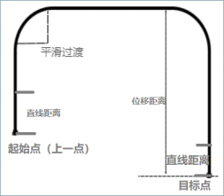

标准门型轨迹：高25mm，宽300mm。

参数：

<table border="1" style="border-collapse: collapse;">
<tr><td style="text-align: center; vertical-align: middle;">点位</td><td style="text-align: center; vertical-align: middle;">使用局部位置变量（P）或全局位置变量（GP）。当值为"新建"时，插入该指令则新建一个P变量，并将机器人的当前位置记录到该P变量</td></tr>
<tr><td style="text-align: center; vertical-align: middle;">V</td><td style="vertical-align: middle;">直线插补的速度，范围1-1000（默认笛卡尔参数最大速度为1000，范围根据实际填写的笛卡尔参数变化），单位为mm/s</td></tr>
<tr><td style="text-align: center; vertical-align: middle;">PL</td><td style="vertical-align: middle;">平滑过渡等级，范围\[0,5\]</td></tr>
<tr><td style="text-align: center; vertical-align: middle;">ACC</td><td style="vertical-align: middle;">加速度比率，范围\[1,100\]</td></tr>
<tr><td style="text-align: center; vertical-align: middle;">DEC</td><td style="vertical-align: middle;">减速度比率，范围\[1,100\]</td></tr>
<tr><td style="text-align: center; vertical-align: middle;">位移轴（X,Y,Z）</td><td style="vertical-align: middle;">门型运动时进行位移的轴，标准门型运动位移的是Z轴方向</td></tr>
<tr><td style="text-align: center; vertical-align: middle;">位移距离</td><td style="vertical-align: middle;">需要在位移轴上位移的距离，标准门型运动是在Z轴上位移25mm</td></tr>
<tr><td style="text-align: center; vertical-align: middle;">直线距离</td><td style="vertical-align: middle;">保证机器人走的位移距离有一段距离是以直线的方式走的（即为门型上升起始和下降末端之间的一段竖直运动的距离）  注意事项：直线距离不能大于位移距离</td></tr>
<tr><td style="text-align: center; vertical-align: middle;">TIME</td><td style="vertical-align: middle;">提前执行时间，单位ms</td></tr>
</table>
示例:

1.  NOP

2.  MOVARCH P0001 V=10 PL=0 ACC=10 DEC=10 Z 25 0

3.  MOVARCH P0002 V=10 PL=0 ACC=10 DEC=10 Z 25 0

4.  END

#### EIMOVL-外部基准点直线

外部TCP（Tool Center
Point，工具中心点）使用场景：机器人手臂夹持工件至固定的TCP(例如：打磨机)处进行相关打磨作业。

外部TCP使用方法：

1.  工件上找一个点，然后找的点与TCP的尖端对齐；

2.  对齐后标定用户坐标系，用户坐标的原点,X,Y三个点位的姿态要一样，标定完成选中该用户坐标系。

格式：EIMOVL【指令名】P/GP【变量】 V【速度】 PL【平滑】
ACC【加速度比率】 DEC【减速度比率】 TIME
【提前执行时间，不设置则显示为0】。

功能：机器人手臂夹持工件至固定的TCP处完成直线轨迹的作业。

参数：

<table border="1" style="border-collapse: collapse;">
<tr><td style="text-align: center; vertical-align: middle;">点位</td><td style="vertical-align: middle;">使用局部位置变量（P）或全局位置变量（GP）。当值为"新建"时，插入该指令则新建一个P变量，并将机器人的当前位置记录到P变量</td></tr>
<tr><td style="text-align: center; vertical-align: middle;">V</td><td style="vertical-align: middle;">直线插补的速度，范围1-1000（默认笛卡尔参数最大速度为1000，范围根据实际填写的笛卡尔参数变化），单位为mm/s</td></tr>
<tr><td style="text-align: center; vertical-align: middle;">PL</td><td style="vertical-align: middle;">平滑过渡等级，范围\[0,5\]</td></tr>
<tr><td style="text-align: center; vertical-align: middle;">ACC</td><td style="vertical-align: middle;">加速度比率，范围\[1,100\]</td></tr>
<tr><td style="text-align: center; vertical-align: middle;">DEC</td><td style="vertical-align: middle;">减速度比率，范围\[1,100\]</td></tr>
<tr><td style="text-align: center; vertical-align: middle;">TIME</td><td style="vertical-align: middle;">提前执行时间，单位ms</td></tr>
</table>

示例：示教的每一个外部直线点需要和TCP对齐。

1.  NOP

2.  EIMOVL P0001 V=10mm/s PL=0 ACC=10 DEC=10 0

3.  EIMOVL P0002 V=10mm/s PL=0 ACC=10 DEC=10 0

4.  EIMOVL P0003 V=10mm/s PL=0 ACC=10 DEC=10 0

5.  EIMOVL P0004 V=10mm/s PL=0 ACC=10 DEC=10 0

6.  END

示例说明：机器人手臂夹持工件按照示教的点位在固定的TCP处走直线轨迹。

#### EIMOVC-外部基准点圆弧

格式：EIMOVC【指令名】P/GP【变量】 V【速度】 PL【平滑】
ACC【加速度比率】 DEC【减速度比率】 TIME
【提前执行时间，不设置则显示为0】。

功能：机器人手臂夹持工件至固定的TCP处完成圆弧轨迹的作业。

参数：

<table border="1" style="border-collapse: collapse;">
<tr><td style="text-align: center; vertical-align: middle;">点位</td><td style="vertical-align: middle;">使用局部位置变量（P）或全局位置变量（GP）。当值为"新建"时，插入该指令则新建一个P变量，并将机器人的当前位置记录到P变量</td></tr>
<tr><td style="text-align: center; vertical-align: middle;">V</td><td style="vertical-align: middle;">直线插补的速度，范围1-1000（默认笛卡尔参数最大速度为1000，范围根据实际填写的笛卡尔参数变化），单位为mm/s</td></tr>
<tr><td style="text-align: center; vertical-align: middle;">PL</td><td style="vertical-align: middle;">平滑过渡等级，范围\[0,5\]</td></tr>
<tr><td style="text-align: center; vertical-align: middle;">ACC</td><td style="vertical-align: middle;">加速度比率，范围\[1,100\]</td></tr>
<tr><td style="text-align: center; vertical-align: middle;">DEC</td><td style="vertical-align: middle;">减速度比率，范围\[1,100\]</td></tr>
<tr><td style="text-align: center; vertical-align: middle;">TIME</td><td style="vertical-align: middle;">提前执行时间，单位ms</td></tr>
</table>

示例：示教的每一个外部圆弧点需要和TCP对齐。

1.  NOP

2.  EIMOVL P0001 V=50mm/s PL=0 ACC=10 DEC=10 0

3.  EIMOVC P0002 V=50mm/s PL=0 ACC=10 DEC=10 0

4.  EIMOVC P0003 V=50mm/s PL=0 ACC=10 DEC=10 0

5.  END

示例说明：机器人手臂夹持工件按照示教的点位在固定的TCP处走圆弧轨迹。

#### EIMOVCA-外部基准点整圆

格式：EIMOVCA【指令名】P/GP【变量】 V【速度】 PL【平滑】
ACC【加速度比率】 DEC【减速度比率】 TIME
【提前执行时间，不设置则显示0】。

功能:机器人手臂夹持工件至固定的TCP处完成整圆轨迹的作业。

参数：

<table border="1" style="border-collapse: collapse;">
<tr><td style="text-align: center; vertical-align: middle;">点位</td><td style="vertical-align: middle;">使用局部位置变量（P）或全局位置变量（GP）。当值为"新建"时，插入该指令则新建一个P变量，并将机器人的当前位置记录到P变量</td></tr>
<tr><td style="text-align: center; vertical-align: middle;">V</td><td style="vertical-align: middle;">直线插补的速度，范围1-1000（默认笛卡尔参数最大速度为1000，范围根据实际填写的笛卡尔参数变化），单位为mm/s</td></tr>
<tr><td style="text-align: center; vertical-align: middle;">PL</td><td style="vertical-align: middle;">平滑过渡等级，范围\[0,5\]</td></tr>
<tr><td style="text-align: center; vertical-align: middle;">ACC</td><td style="vertical-align: middle;">加速度比率，范围\[1,100\]</td></tr>
<tr><td style="text-align: center; vertical-align: middle;">DEC</td><td style="vertical-align: middle;">减速度比率，范围\[1,100\]</td></tr>
<tr><td style="text-align: center; vertical-align: middle;">TIME</td><td style="vertical-align: middle;">提前执行时间，单位ms</td></tr>
<tr><td style="text-align: center; vertical-align: middle;">SPIN：机器人末梢旋转</td><td style="vertical-align: middle;">姿态不变：整圆运行的姿态和的第一个点位示教的姿态(MOVJ,MOVL的标定姿态)相同，并以这个姿态走完整圆轨迹</td></tr>
</table>

示例：示教的每一个外部圆弧点需要和TCP对齐。

1.  NOP

2.  EIMOVL P0001 V=50mm/s PL=0 ACC=10 DEC=10 0

3.  EIMOVCA P0002 V=10mm/s PL=0 ACC=10 DEC=10 0

4.  EIMOVCA P0003 V=10mm/s PL=0 ACC=10 DEC=10 0

5.  END

示例说明：机器人手臂夹持工件按照示教的点位在固定的TCP处走整圆轨迹。

### 输入输出类、定时类

输入输出类共有"IO输入、IO输出、模拟输入、模拟输出、脉冲输出、读取输出"等6项指令，适用于前台、全局及局部后台程序；定时器类只有延时指令。

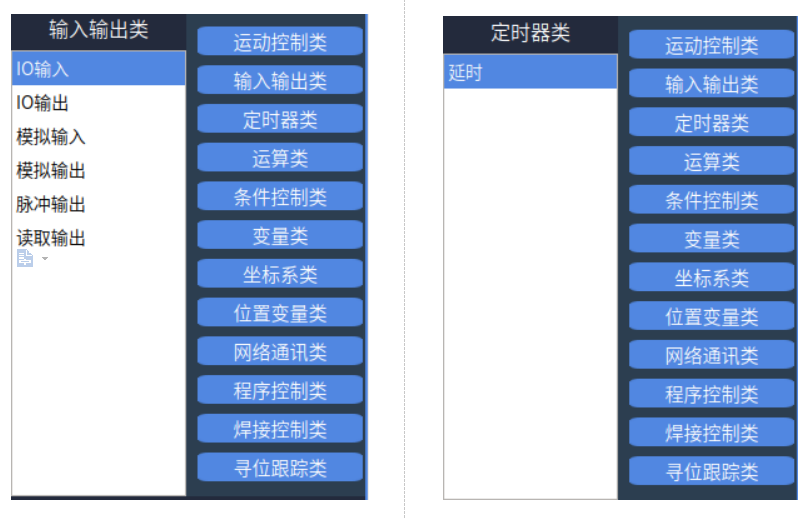

#### 输入输出类：

\"√\"表示支持此条指令。

<table border="1" style="border-collapse: collapse;">
<tr><td style="text-align: center; vertical-align: middle;">指令类型</td><td style="text-align: center; vertical-align: middle;">前台</td><td style="text-align: center; vertical-align: middle;">全局后台</td><td style="text-align: center; vertical-align: middle;">局部后台</td></tr>
<tr><td style="text-align: center; vertical-align: middle;">IO输入</td><td style="text-align: center; vertical-align: middle;">√</td><td style="text-align: center; vertical-align: middle;">√</td><td style="text-align: center; vertical-align: middle;">√</td></tr>
<tr><td style="text-align: center; vertical-align: middle;">IO输出</td><td style="text-align: center; vertical-align: middle;">√</td><td style="text-align: center; vertical-align: middle;">√</td><td style="text-align: center; vertical-align: middle;">√</td></tr>
<tr><td style="text-align: center; vertical-align: middle;">模拟输入</td><td style="text-align: center; vertical-align: middle;">√</td><td style="text-align: center; vertical-align: middle;">√</td><td style="text-align: center; vertical-align: middle;">√</td></tr>
<tr><td style="text-align: center; vertical-align: middle;">模拟输出</td><td style="text-align: center; vertical-align: middle;">√</td><td style="text-align: center; vertical-align: middle;">√</td><td style="text-align: center; vertical-align: middle;">√</td></tr>
<tr><td style="text-align: center; vertical-align: middle;">读取输出</td><td style="text-align: center; vertical-align: middle;">√</td><td style="text-align: center; vertical-align: middle;">√</td><td style="text-align: center; vertical-align: middle;">√</td></tr>
</table>

#### DIN-IO输入

格式：DIN【指令名】I001【端口值存入的变量】IGH【输入路数】1【输入组号】。

功能:数字输入将外部信号转换为电压或电流的高或低电平，然后传递给控制系统。用于接收外部数字信号,通常用于检测开关的状态、传感器信号等。

参数:

<table border="1" style="border-collapse: collapse;">
<tr><td style="text-align: center; vertical-align: middle;">输入IO板</td><td style="text-align: center; vertical-align: middle;">若连接了多块IO板，则可选择是第几个IO板用来接收信号</td></tr>
<tr><td style="text-align: center; vertical-align: middle;">输入路数</td><td style="vertical-align: middle;">支持手填和变量形式  1路输入、4路输入、8路输入</td></tr>
<tr><td style="text-align: center; vertical-align: middle;">输入组号</td><td style="vertical-align: middle;">1-16：一块IO板分为16路信号通道，一路输入表示16路信号通道每1路为一组  1-4：一块IO板分为16路信号通道，4路输入表示16路信号通道每4路为一组。  1-2：一块IO板分为16路信号通道，8路输入表示16路信号通道每8路为一组。【1-8，9-16】</td></tr>
<tr><td style="text-align: center; vertical-align: middle;">端口值存入</td><td style="vertical-align: middle;">接收到的信号由2进制转为10进制存入变量中</td></tr>
</table>
示例：

参数设置：IO板1，输入路数选择4路输入，输入组号选择1，端口值存入GI001,此处参数设置仅用于示例说明。

1.  NOP

2.  DIN IGH#(1)

3.  END

示例说明：4路一组，假设1-4号端口值为0101，转化为10进制等于5，执行输出信息指令时小白条输出GI001=5。

#### DOUT-IO输出

格式：DOUT【指令名】OT【输出路数】(DOUT1-1)【输出组号】1【输出端口】
T=1【时间】1【错误停止处理,"0"表示输出值保持,"1"表示计时结束停止】。

功能：数字输出用于控制外部设备，不接受反馈信号，例如继电器、开关等。

参数：

<table border="1" style="border-collapse: collapse;">
<tr><td style="text-align: center; vertical-align: middle;">输出IO板</td><td style="text-align: center; vertical-align: middle;">若连接了多块IO板，则可选择是第几个IO板用来控制信号</td></tr>
<tr><td style="text-align: center; vertical-align: middle;">输出路数</td><td style="vertical-align: middle;">1路输出\4路输出\8路输出</td></tr>
<tr><td style="text-align: center; vertical-align: middle;">输出组号  支持手填和变量形式</td><td style="vertical-align: middle;">输出路数为1路输出时输出组号为1-16：一块IO板分为16路信号通道，一路输出表示16路信号通道每1路为一组  输出路数为4路输出时输出组号为1-4：一块IO板分为16路信号通道，4路输出表示16路信号通道每4路为一组。【1-4、5-8，9-12、13-16】  输出路数为8路输出时输出组号为1-2：一块IO板分为16路信号通道，8路输出表示16路信号通道每8路为一组。【1-8，9-16】</td></tr>
<tr><td style="text-align: center; vertical-align: middle;">输出值</td><td style="vertical-align: middle;">自选：直接选端口，选中的端口输出高电平，未选中的端口为低电平  变量：通过给变量赋值让输出端口由低电平变为高电平</td></tr>
<tr><td style="text-align: center; vertical-align: middle;">时间</td><td style="vertical-align: middle;">当T写入0时则表示持续输出高电平  当T写入2时则表示输出信号持续2秒后由高电平置为低电</td></tr>
<tr><td style="text-align: center; vertical-align: middle;" rowspan="2">错误停止处理</td><td style="vertical-align: middle;">1.输出值保持：程序暂停、停止或者报错后，输出值持续输出。  	例如：输出端口为1-1，设置的时间为3秒，表示输出指令从开始到结束复位需要3秒，如果输出指令的运行时间没有到达3秒程序被暂停（假如运行了2秒），此时1-1端口继续输出高电平，程序启动后再运行1秒1-1端口就会复位</td></tr>
<tr><td style="vertical-align: middle;">2.计时结束停止：到达设定的时间，IO端口复位  例如：输出端口为1-2，设置的时间为2秒，表示1-2输出端口持续输出两秒后1-2端口复位</td></tr>
</table>
示例：

1.  NOP

2.  DOUT OGH#(DOUT)15 T=1 1

3.  END

示例说明：1-1---1-4输出端口持续1秒后复位。

#### AIN-模拟输入

格式：AIN【指令名】 D001【变量值】 AIN1-1【模拟输入口】。

功能：可以接收连续变化的信号，常见的模拟输入信号包括电压、[[电流]{.underline}](https://www.elecfans.com/tags/%E7%94%B5%E6%B5%81/)等。

参数：

<table border="1" style="border-collapse: collapse;">
<tr><td style="text-align: center; vertical-align: middle;">模拟输入口</td><td style="vertical-align: middle;">通过选择的模拟输入口接收模拟量数值</td></tr>
<tr><td style="text-align: center; vertical-align: middle;">变量值</td><td style="vertical-align: middle;">将采集到的模拟量数值保存到选择的变量，只支持浮点型变量</td></tr>
</table>

示例：

1.  NOP

2.  AIN D001 AIN1-1

3.  END

示例说明：将采集的AIN1-1模拟输入口的值读取到变量D0001。

#### AOUT-模拟输出

格式：AOUT【指令名】AOUT1-1【模拟输出口】 GD001/D001【变量值来源】。

功能：可以输出连续变化的信号。常见的模拟输出信号包括电压、电流等。

参数:

<table border="1" style="border-collapse: collapse;">
<tr><td style="text-align: center; vertical-align: middle;">模拟输出口</td><td style="vertical-align: middle;">通过选择的模拟输出口输出模拟量数值</td></tr>
<tr><td style="text-align: center; vertical-align: middle;">变量值来源</td><td style="vertical-align: middle;">通过给变量赋值或者自定义将数值输出到选择的模拟输出口，范围\[0,10\]</td></tr>
</table>

示例：

1.  NOP

2.  GD001=5

3.  AOUT AOUT1-1 GD001

4.  END

示例说明:给变量GD001赋值，在执行模拟输出指令时会将值输出到选择的AOUT1-1端口。

#### PULSEOUT-脉冲输出

格式：PULSEOUT【指令名】RATE【频率】SUM【个数】。

功能：按照设定的脉冲频率与个数，在R1
PWMIO板上的DB9端子的引脚4（PWM+）上进行输出。

参数：

个数：脉冲个数；频率: 脉冲频率

示例：

1.  NOP

2.  PULSEOUT RATE = 100 SUM = 100

3.  END

#### READ_DOUT-读取输出

格式：READ_DOUT【指令名】GI001【变量类型】 OT【输出路数】(DOUT1-1
)【输出组号】。

功能：将数字输出端口的状态通过变量读取,然后将2进制转为10进制数值并存入目标变量中。

参数：

<table border="1" style="border-collapse: collapse;">
<tr><td style="text-align: center; vertical-align: middle;">IO板</td><td style="vertical-align: middle;" colspan="7">若连接了多块IO板，则可选择读取第几个IO板的数值</td></tr>
<tr><td style="text-align: center; vertical-align: middle;">变量类型</td><td style="vertical-align: middle;" colspan="7">读取出的数值存入到选择的目标变量</td></tr>
<tr><td style="text-align: center; vertical-align: middle;">输出路数</td><td style="text-align: center; vertical-align: middle;">1路输出（16组）</td><td style="text-align: center; vertical-align: middle;" colspan="4">4路输出（4组）</td><td style="text-align: center; vertical-align: middle;" colspan="2">8路输出（2组）</td></tr>
<tr><td style="text-align: center; vertical-align: middle;">输出组号</td><td style="text-align: center; vertical-align: middle;">1-16</td><td style="text-align: center; vertical-align: middle;">1-4</td><td style="text-align: center; vertical-align: middle;">5-8</td><td style="text-align: center; vertical-align: middle;">9-12</td><td style="text-align: center; vertical-align: middle;">13-16</td><td style="text-align: center; vertical-align: middle;">1-8</td><td style="text-align: center; vertical-align: middle;">9-16</td></tr>
</table>
示例：

1.  NOP

2.  DOUT OGH#(1) 11 T=0 0

3.  READ_DOUT GI001 OGH#(1)

4.  END

示例说明：执行第一条输出指令后，IO板1的1-4端口值为1011，再执行读取输出指令会把1-4的端口值1011转为10进制，此时选择的变量GI001=11。

### 定时器类

#### TIMER-延时

格式：TIMER【指令名】T=2【延时时间】。

功能：延时设置的值，到达设置的时间后程序继续运行。

参数：

<table border="1" style="border-collapse: collapse;">
<tr><td style="text-align: center; vertical-align: middle;">变量</td><td style="vertical-align: middle;">延时时间支持手填和变量形式</td></tr>
</table>

示例：

1.  NOP

2.  MOVJ P0001 VJ=10% PL=0 ACC=5 DEC=5 0

3.  TIMER T=2

4.  DOUT OT#(DOUT1-1)1 T=1 0

5.  END

示例说明：点到点指令运行结束后，延时2秒后继续运行输出指令。

### 运算类

运算类共有"加、减、乘、除、模、正弦、余弦、反正切、逻辑运算"等9项指令，如图所示：

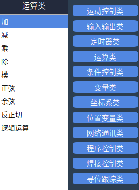

#### ADD-加

格式：ADD【指令名】I001【结果变量】I002【参数1】1【参数2】。

功能：参数1与参数2相加的值存入结果变量。

参数：

<table border="1" style="border-collapse: collapse;">
<tr><td style="text-align: center; vertical-align: middle;">结果变量</td><td style="vertical-align: middle;">把参数1和参数2的计算结果存入目标变量</td></tr>
<tr><td style="text-align: center; vertical-align: middle;">参数1</td><td style="vertical-align: middle;">例如：I001=3+4,"3"表示的就是参数1</td></tr>
<tr><td style="text-align: center; vertical-align: middle;">参数2</td><td style="vertical-align: middle;">例如：I001=3+4,"4"表示的就是参数2</td></tr>
</table>

示例：

1.  NOP

2.  SET I002=3

3.  ADD GI002 I002 3

4.  TIMER T=2

5.  END

示例说明：当程序执行完第3行加指令时GI002=6。

#### SUB-减

格式：SUB【指令名】I001【结果变量】I002【参数1】1【参数2】。

功能：参数1与参数2相减的值存入结果变量。

参数:

<table border="1" style="border-collapse: collapse;">
<tr><td style="text-align: center; vertical-align: middle;">结果变量</td><td style="vertical-align: middle;">把参数1和参数2的计算结果存入目标变量</td></tr>
<tr><td style="text-align: center; vertical-align: middle;">参数1</td><td style="vertical-align: middle;">例如：I001=10-2,"10"表示的就是参数1</td></tr>
<tr><td style="text-align: center; vertical-align: middle;">参数2</td><td style="vertical-align: middle;">例如：I001=10-2,"2"表示的就是参数2</td></tr>
</table>

示例：

1.  NOP

2.  SET GI002=5

3.  SUB GI001 10 GI002

4.  TIMER T=2

5.  END

示例说明：当程序执行完第3行减指令时GI001=5。

#### MUL-乘

格式：MUL【指令名】I001【结果变量】I002【参数1】1【参数2】。

功能：参数1与参数2相乘的值存入结果变量。

参数：

<table border="1" style="border-collapse: collapse;">
<tr><td style="text-align: center; vertical-align: middle;">结果变量</td><td style="vertical-align: middle;">把参数1和参数2的计算结果存入目标变量</td></tr>
<tr><td style="text-align: center; vertical-align: middle;">参数1</td><td style="vertical-align: middle;">例如：I001=3\4,"3"表示的就是参数1</td></tr>
<tr><td style="text-align: center; vertical-align: middle;">参数2</td><td style="vertical-align: middle;">例如：I001=3\4,"4"表示的就是参数2</td></tr>
</table>

示例：

1.  NOP

2.  SET I002=5

3.  SET I003=3

4.  MUL I001 I002 I003

5.  TIMER T=2

6.  END

示例说明：当程序执行完第4行乘指令时I001=15。

#### DIV-除

格式：DIV【指令名】I001【结果变量】I002【参数1】1【参数2】。

功能：参数1与参数2相除的值存入结果变量。

参数：

<table border="1" style="border-collapse: collapse;">
<tr><td style="text-align: center; vertical-align: middle;">结果变量</td><td style="vertical-align: middle;">把参数1和参数2的计算结果存入目标变量</td></tr>
<tr><td style="text-align: center; vertical-align: middle;">参数1</td><td style="vertical-align: middle;">例如：I001=6/2,"6"表示的就是参数1</td></tr>
<tr><td style="text-align: center; vertical-align: middle;">参数2</td><td style="vertical-align: middle;">例如：I001=6/2,"2"表示的就是参数2</td></tr>
</table>

示例：

1.  NOP

2.  SET D003=10

3.  DIV GD001 D003 4

4.  TIMER T=2

5.  END

示例说明：当程序执行完第3行除指令时GD001=2.5。

#### MOD-模

格式：MOD【指令名】I001【结果变量】I002【参数】。

功能：进行模运算，将模运算的结果存入到选择的结果变量。

参数:

<table border="1" style="border-collapse: collapse;">
<tr><td style="text-align: center; vertical-align: middle;">结果变量</td><td style="vertical-align: middle;">存入计算结果的变量</td></tr>
<tr><td style="text-align: center; vertical-align: middle;">参数</td><td style="vertical-align: middle;">例如：I001模9,"9"表示的就是参数</td></tr>
</table>

示例：

1.  NOP

2.  SET GI001=11

3.  MOD GI001 7

4.  TIMER T=2

5.  END

示例说明：当程序执行完第3行模指令时结果变量G001=4。

#### SIN-正弦

格式：SIN【指令名】I001【结果变量】I002【参数】。

功能：正弦运算（sin），A=sin(B)，B为弧度制rad。

参数：

<table border="1" style="border-collapse: collapse;">
<tr><td style="text-align: center; vertical-align: middle;">结果变量</td><td style="vertical-align: middle;">存入计算结果的变量</td></tr>
<tr><td style="text-align: center; vertical-align: middle;">参数</td><td style="vertical-align: middle;">此处填写的数值为弧度制数值,填写1表示1rad</td></tr>
</table>

示例：

1.  NOP

2.  SET GD001=0.5

3.  SIN GD001 1

4.  TIMER T=2

5.  END

示例说明：当程序执行完第3行正弦指令时结果变量GD001=0.8415。

#### COS-余弦

格式：COS【指令名】I001【结果变量】I002【参数】

功能：余弦运算（cos），A=cos(B)，B为弧度制rad

参数:

<table border="1" style="border-collapse: collapse;">
<tr><td style="text-align: center; vertical-align: middle;">结果变量</td><td style="vertical-align: middle;">存入计算结果的变量</td></tr>
<tr><td style="text-align: center; vertical-align: middle;">参数</td><td style="vertical-align: middle;">此处填写的数值为弧度制数值,填写1表示1rad</td></tr>
</table>

示例：

1.  NOP

2.  SET D002=2

3.  COS D002 1

4.  TIMER T=2

5.  END

示例说明：当程序执行完第3行余弦指令时结果变量D002=0.5403。

#### ATAN-反正切

格式：ATAN【指令名】I001【结果变量】I002【参数】。

功能：反正切运算（arctan），A=arctan(B)，B为弧度制rad。

参数:

<table border="1" style="border-collapse: collapse;">
<tr><td style="text-align: center; vertical-align: middle;">结果变量</td><td style="vertical-align: middle;">存入计算结果的变量</td></tr>
<tr><td style="text-align: center; vertical-align: middle;">参数</td><td style="vertical-align: middle;">此处填写的数值为弧度制数值,填写1表示1rad</td></tr>
</table>

示例：

1.  NOP

2.  SET GD002 = 2

3.  ATAN GD002 1

4.  TIMER T=2

5.  END

示例说明：当程序执行完第3行反正切指令时结果变量GD002=0.7854。

#### LOGICAL_OP-逻辑运算

格式：LOGICAL_OP【指令名】B001【结果变量】=
I001【参数1】AND/OR/NOT【运算类型】GI001【参数2】。

功能:逻辑运算（与、或、非）。

参数：

<table border="1" style="border-collapse: collapse;">
<tr><td style="text-align: center; vertical-align: middle;">结果变量</td><td style="vertical-align: middle;" colspan="4">将逻辑运算结果存入选择的目标变量</td></tr>
<tr><td style="text-align: center; vertical-align: middle;">参数1</td><td style="vertical-align: middle;" colspan="4">参与逻辑运算的参数1</td></tr>
<tr><td style="text-align: center; vertical-align: middle;" rowspan="2">运算类型</td><td style="text-align: center; vertical-align: middle;" rowspan="2">与&&AND</td><td style="text-align: center; vertical-align: middle;" rowspan="2">或||OR</td><td style="vertical-align: middle;" colspan="2">非!NOT  <注意：运算类型选择非运算时参数2的变量类型无法选择/td></tr>
<tr></tr>
<tr><td style="text-align: center; vertical-align: middle;">参数2</td><td style="vertical-align: middle;" colspan="4">参与逻辑运算的参数2</td></tr>
</table>
示例：

1.  NOP

2.  SET I001 = 1

3.  SET I002 = 0

4.  LOGICAL_OP B001 = I001 AND I002

5.  SET GI001 = 10

6.  SET GI002 = 1

7.  LOGICAL_OP B002 = GI001 OR GI002

8.  LOGICAL_OP B003 = NOT GI002

9.  TIMER T=2

10. END

示例说明：程序在执行完与、或、非运算后B001=0、B002=1、B003=0。

### 条件控制类

条件控制类共有"调用子程序、退出、调用Lua文件、如果、否则如果、否则、等待、循环、标签、跳转、直到、工艺跳行、指令注释、是否可达判断、计时开始、计时结束、计时复位、读取线速度、调用Lua语句、参数声明、等待运动到点、碰撞检测设置、碰撞检测参数复位、Switch、Case、Default"等26项指令，如图所示：

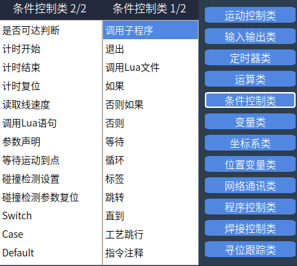

条件控制类

"√"表示支持此条指令。

<table border="1" style="border-collapse: collapse;">
<tr><td style="text-align: center; vertical-align: middle;">指令类型</td><td style="text-align: center; vertical-align: middle;">前台</td><td style="text-align: center; vertical-align: middle;">全局后台</td><td style="text-align: center; vertical-align: middle;">局部后台</td></tr>
<tr><td style="text-align: center; vertical-align: middle;">调用子程序</td><td style="text-align: center; vertical-align: middle;">√</td><td style="text-align: center; vertical-align: middle;"></td><td style="text-align: center; vertical-align: middle;"></td></tr>
<tr><td style="text-align: center; vertical-align: middle;">退出</td><td style="text-align: center; vertical-align: middle;">√</td><td style="text-align: center; vertical-align: middle;">√</td><td style="text-align: center; vertical-align: middle;">√</td></tr>
<tr><td style="text-align: center; vertical-align: middle;">调用Lua文件</td><td style="text-align: center; vertical-align: middle;">√</td><td style="text-align: center; vertical-align: middle;">√</td><td style="text-align: center; vertical-align: middle;">√</td></tr>
<tr><td style="text-align: center; vertical-align: middle;">如果</td><td style="text-align: center; vertical-align: middle;">√</td><td style="text-align: center; vertical-align: middle;">√</td><td style="text-align: center; vertical-align: middle;">√</td></tr>
<tr><td style="text-align: center; vertical-align: middle;">否则如果</td><td style="text-align: center; vertical-align: middle;">√</td><td style="text-align: center; vertical-align: middle;">√</td><td style="text-align: center; vertical-align: middle;">√</td></tr>
<tr><td style="text-align: center; vertical-align: middle;">否则</td><td style="text-align: center; vertical-align: middle;">√</td><td style="text-align: center; vertical-align: middle;">√</td><td style="text-align: center; vertical-align: middle;">√</td></tr>
<tr><td style="text-align: center; vertical-align: middle;">等待</td><td style="text-align: center; vertical-align: middle;">√</td><td style="text-align: center; vertical-align: middle;">√</td><td style="text-align: center; vertical-align: middle;">√</td></tr>
<tr><td style="text-align: center; vertical-align: middle;">循环</td><td style="text-align: center; vertical-align: middle;">√</td><td style="text-align: center; vertical-align: middle;">√</td><td style="text-align: center; vertical-align: middle;">√</td></tr>
<tr><td style="text-align: center; vertical-align: middle;">标签</td><td style="text-align: center; vertical-align: middle;">√</td><td style="text-align: center; vertical-align: middle;">√</td><td style="text-align: center; vertical-align: middle;">√</td></tr>
<tr><td style="text-align: center; vertical-align: middle;">跳转</td><td style="text-align: center; vertical-align: middle;">√</td><td style="text-align: center; vertical-align: middle;">√</td><td style="text-align: center; vertical-align: middle;">√</td></tr>
<tr><td style="text-align: center; vertical-align: middle;">直到</td><td style="text-align: center; vertical-align: middle;">√</td><td style="text-align: center; vertical-align: middle;"></td><td style="text-align: center; vertical-align: middle;"></td></tr>
<tr><td style="text-align: center; vertical-align: middle;">工艺跳行</td><td style="text-align: center; vertical-align: middle;">√</td><td style="text-align: center; vertical-align: middle;"></td><td style="text-align: center; vertical-align: middle;"></td></tr>
<tr><td style="text-align: center; vertical-align: middle;">指令注释</td><td style="text-align: center; vertical-align: middle;">√</td><td style="text-align: center; vertical-align: middle;">√</td><td style="text-align: center; vertical-align: middle;">√</td></tr>
<tr><td style="text-align: center; vertical-align: middle;">是否可达判断</td><td style="text-align: center; vertical-align: middle;">√</td><td style="text-align: center; vertical-align: middle;">√</td><td style="text-align: center; vertical-align: middle;">√</td></tr>
<tr><td style="text-align: center; vertical-align: middle;">计时开始</td><td style="text-align: center; vertical-align: middle;">√</td><td style="text-align: center; vertical-align: middle;">√</td><td style="text-align: center; vertical-align: middle;">√</td></tr>
<tr><td style="text-align: center; vertical-align: middle;">计时结束</td><td style="text-align: center; vertical-align: middle;">√</td><td style="text-align: center; vertical-align: middle;">√</td><td style="text-align: center; vertical-align: middle;">√</td></tr>
<tr><td style="text-align: center; vertical-align: middle;">计时复位</td><td style="text-align: center; vertical-align: middle;">√</td><td style="text-align: center; vertical-align: middle;">√</td><td style="text-align: center; vertical-align: middle;">√</td></tr>
<tr><td style="text-align: center; vertical-align: middle;">读取线速度</td><td style="text-align: center; vertical-align: middle;">√</td><td style="text-align: center; vertical-align: middle;"></td><td style="text-align: center; vertical-align: middle;"></td></tr>
<tr><td style="text-align: center; vertical-align: middle;">调用Lua语句</td><td style="text-align: center; vertical-align: middle;">√</td><td style="text-align: center; vertical-align: middle;">√</td><td style="text-align: center; vertical-align: middle;">√</td></tr>
<tr><td style="text-align: center; vertical-align: middle;">参数声明</td><td style="text-align: center; vertical-align: middle;">√</td><td style="text-align: center; vertical-align: middle;"></td><td style="text-align: center; vertical-align: middle;"></td></tr>
<tr><td style="text-align: center; vertical-align: middle;">等待运动到点</td><td style="text-align: center; vertical-align: middle;">√</td><td style="text-align: center; vertical-align: middle;"></td><td style="text-align: center; vertical-align: middle;"></td></tr>
<tr><td style="text-align: center; vertical-align: middle;">碰撞检测设置</td><td style="text-align: center; vertical-align: middle;">√</td><td style="text-align: center; vertical-align: middle;"></td><td style="text-align: center; vertical-align: middle;"></td></tr>
<tr><td style="text-align: center; vertical-align: middle;">碰撞检测参数复位</td><td style="text-align: center; vertical-align: middle;">√</td><td style="text-align: center; vertical-align: middle;"></td><td style="text-align: center; vertical-align: middle;"></td></tr>
<tr><td style="text-align: center; vertical-align: middle;">Switch</td><td style="text-align: center; vertical-align: middle;">√</td><td style="text-align: center; vertical-align: middle;">√</td><td style="text-align: center; vertical-align: middle;">√</td></tr>
<tr><td style="text-align: center; vertical-align: middle;">Case</td><td style="text-align: center; vertical-align: middle;">√</td><td style="text-align: center; vertical-align: middle;">√</td><td style="text-align: center; vertical-align: middle;">√</td></tr>
<tr><td style="text-align: center; vertical-align: middle;">Default</td><td style="text-align: center; vertical-align: middle;">√</td><td style="text-align: center; vertical-align: middle;">√</td><td style="text-align: center; vertical-align: middle;">√</td></tr>
</table>

条件控制类

条件控制类参数说明：

1.  条件判断类指令有关与、或逻辑运算的说明。

<table border="1" style="border-collapse: collapse;">
<tr><td style="text-align: center; vertical-align: middle;">与运算（&&）</td></tr>
<tr><td style="vertical-align: middle;">进行运算的两个数据，按二进制位进行"与"运算。</td></tr>
<tr><td style="vertical-align: middle;">规则：0&&0=0; 0&&1=0; 1&&0=0; 1&&1=1;</td></tr>
<tr><td style="vertical-align: middle;">即： 两位同时为"1"，结果才为"1"，否则为0</td></tr>
<tr><td style="vertical-align: middle;">例如：IF(I001=2)AND(GI001=1)</td></tr>
<tr><td style="vertical-align: middle;">当设置的两个判断条件都满足时才会执行if里面的指令。</td></tr>
<tr><td style="text-align: center; vertical-align: middle;">或运算（||）</td></tr>
<tr><td style="vertical-align: middle;">进行运算的两个数据，按二进制位进行"或"运算。</td></tr>
<tr><td style="vertical-align: middle;">运算规则：0||0=0； 0||1=1； 1||0=1； 1||1=1；</td></tr>
<tr><td style="vertical-align: middle;">即 ：参加运算的两个对象只要有一个为1，其值为1。</td></tr>
<tr><td style="vertical-align: middle;">例如：IF(I001=2)OR(GI001=1)</td></tr>
<tr><td style="vertical-align: middle;">当设置的两个判断条件只有一个满足时就会执行if里面的指令。</td></tr>
</table>
1.  判断指令比较方式的说明

此处以IF指令作为示例介绍：

<table border="1" style="border-collapse: collapse;">
<tr><td style="text-align: center; vertical-align: middle;">== 等于</td><td style="vertical-align: middle;">例如：IF(GI001=3)  变量GI001=3时才会执行IF与ENDIF之间的指令</td></tr>
<tr><td style="text-align: center; vertical-align: middle;">< 小于</td><td style="vertical-align: middle;">例如：IF(D001<3)  变量D001<3时执行IF与ENDIF之间的指令</td></tr>
<tr><td style="text-align: center; vertical-align: middle;">> 大于</td><td style="vertical-align: middle;">例如：IF(I001>11)  变量I001>11时执行IF与ENDIF之间的指令</td></tr>
<tr><td style="text-align: center; vertical-align: middle;"><= 小于等于</td><td style="vertical-align: middle;">例如：IF(DOUT1-1<=10)  DOUT1-1端口为低电平时就会执行IF与ENDIF之间的指令</td></tr>
<tr><td style="text-align: center; vertical-align: middle;">>= 大于等于</td><td style="vertical-align: middle;">例如：IF(DIN1-1>=12)  DIN1-1端口为高电平时执行IF与ENDIF之间的指令</td></tr>
<tr><td style="text-align: center; vertical-align: middle;">!= 不等于</td><td style="vertical-align: middle;">例如：IF(GS001!=AAA)  GS001!=AAA时执行IF与ENDIF之间的指令</td></tr>
</table>
1.  多组条件判断说明

IF,ELSEIF,WAIT,WHILE,JUMP,UNTIL指令支持多条件判断，最多支持5组判断。

此处以IF指令作为示例进行介绍：

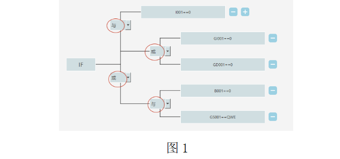

如图1设置5组判断条件:

判断逻辑：首先对{(GI001=0)OR(GD001=0)}，{(B001=0)AND(GS001=QWE)}括号里的部分进行判断，然后{(GI001=0)OR(GD001=0)}的判断结果和(I001=0)进行与运算，最后将(I001=0)AND{(GI001=0)OR(GD001=0)}的判断结果和{(B001=0)AND(GS001=QWE)}的结果进行或运算，如果判断结果为真则执行IF与ENDIF之间的指令。

注意事项：判断顺序\[有括号的优先判断括号内（从左往右判断），再与括号外的进行判断\]。

#### CALL-调用子程序

格式：CALL【指令名称】\[\$子程序\$\]【调用程序文件名】IN(12)【传入参数】OUT(GI001)【传出参数】。

功能：调用另一个程序，被调用的程序运行完后返回主程序CALL指令的下一行继续运行。

如果需要使用输入和输出参数功能在被调用的子程序内需要有"PARAM_DECLARATION"（参数声明）这条指令才能读取到输入和输出的个数,"PARAM_DECLARATION"指令必须插在子程序首行。

<table border="1" style="border-collapse: collapse;">
<tr><td style="text-align: center; vertical-align: middle;">CALL</td><td style="vertical-align: middle;">被调用程序名称</td></tr>
<tr><td style="text-align: center; vertical-align: middle;">输入参数个数</td><td style="vertical-align: middle;">从子程序获取输入参数个数并显示到此处  此处此参数不可修改</td></tr>
<tr><td style="text-align: center; vertical-align: middle;">输入参数选择</td><td style="vertical-align: middle;">输入参数个数为0时不可点击  1.输入参数个数
;  根据从子程序参数声明指令设置的参数个数并显示到此处
  此参数不可修改
  个数有几个下方表格会显示几行数据
  2.输入参数列
  显示参数顺序编号
  3.变量列
  值类型可以为不使用、手填、变量；其中变量必须为可赋值到子程序对应变量的，例如子程序是I001,则只能选int、bool、double、手填值等类型，字符串类型不可赋值给I001
  当PARAM_DECLARATION参数界面对应的输入参数的默认值为手填或者变量时CALL指令参数界面输入参数选择时的【更多】选项可以选择不使用，
  当PARAM_DECLARATION参数界面对应的输入参数的默认值为不使用时CALL指令参数界面输入参数选择时的【更多】不可以选不使用
  4.备注列
  显示的内容为PARAM_DECLARATION中对应填入的注释文本+PARAM_DECLARATION中的对应变量</td></tr>
<tr><td style="text-align: center; vertical-align: middle;">输出参数个数</td><td style="vertical-align: middle;">从子程序获取输出参数个数并显示到此处
  此处此参数不可修改</td></tr>
<tr><td style="text-align: center; vertical-align: middle;">输出参数选择</td><td style="vertical-align: middle;">输出参数个数为0时不可点击
  1.输出参数个数
  根据从子程序参数声明指令设置的参数个数并显示到此处
  此参数不可修改
  个数有几个下方表格会显示几行数据
  2.输出参数列
  显示参数顺序编号
  3.变量列
  值类型可以为变量；其中变量必须为可赋值到子程序对应变量的，例如子程序是I001,则只能选int、bool、double等类型，字符串类型不可赋值给I001
  4.注释列
  显示内容为PARAM_DECLARATION中对应填入的注释文本+PARAM_DECLARATION中的对应变量</td></tr>
</table>
注意事项：主程序A调用程序B,程序B又调用程序A,会造成程序陷入死循环。

示例：主程序：

1.  NOP

2.  SET I001=12

3.  SET I002=22

4.  CALL\[\$Q11\$\]IN(I001,I002)OUT(D006,D007)

5.  TIMER T=1

6.  END

示例：子程序Q11：

1.  NOP

2.  PARAM_DECLARATION IN(D001=\[-\],D002=\[-\])OUT(10.0,11.0)

3.  TIMER T=0.5

4.  END

示例说明：主程序运行调用子程序指令，输入参数I001和I002的值被子程序接收使用，运行到子程序Q11时I001=12，I002=22，输出参数将返回给主程序使用，子程序运行结束后进入主程序D006=10，D007=11。

#### RETURN-退出

格式：RETURN【指令名称】。

功能：退出当前运行的作业文件，例如：子程序、后台程序。

RETURN因为不需要进行指令参数的填写，所以此类型的指令，点击插入指令时不会再跳转到指令参数界面，点击插入指令直接在作业文件中添加指令。由于此类指令没有指令参数界面，所以当光标位于指令上时，修改控件处于置灰状态。

参数：略。

示例：

主程序:

1.  MOVL P0001 V=10mm/s PL=0 ACC=1 DEC=1 0

2.  MOVL P0002 V=10mm/s PL=0 ACC=1 DEC=1 0

3.  RETURN

4.  TIMER T = 1

5.  PRINTMSG #TEST#

示例说明：程序运行到退出指令程序停止，伺服由运行状态变为就绪状态，程序停止运行，位于退出指令后的指令不再运行。

- 子程序：主程序调用子程序，当子程序运行到退出指令时子程序退出运行跳转到主程序，主程序继续运行。

- 后台程序：主程序调用全局后台和局部后台，当全局后台和局部后台运行到退出指令时，退出全局和局部线程。

#### CALL_LUAFILE-调用LUA文件 

格式：CALL_LUAFILE【指令名称】\[\$name\$\]【上传的Lua文件名称】IN\[1001,I002\]【传入参数个数】OUT\[G1001,GI002\]【传出参数个数】。

功能:参数定义好之后，直接上传Lua文件，然后插入调用Lua文件指令，指令运行结束后会把写好的所有参数变量传入和输出。

参数：

<table border="1" style="border-collapse: collapse;">
<tr><td style="text-align: center; vertical-align: middle;">CALL_LUAFILE</td><td style="vertical-align: middle;">选择调用上传的Lua文件</td></tr>
<tr><td style="text-align: center; vertical-align: middle;">传入参数个数</td><td style="vertical-align: middle;">Lua文件传入参数数量</td></tr>
<tr><td style="text-align: center; vertical-align: middle;">传入参数选择</td><td style="vertical-align: middle;">选择所需传入参数的个数和传入参数的变量类型</td></tr>
<tr><td style="text-align: center; vertical-align: middle;">输出参数个数</td><td style="vertical-align: middle;">Lua文件输出参数数量</td></tr>
<tr><td style="text-align: center; vertical-align: middle;">输出参数选择</td><td style="vertical-align: middle;">选择所需输出参数的个数和变量类型</td></tr>
</table>

注意事项：

1.  传入的参数个数要和调用的Lua文件里面个数相同

2.  输出参数的个数可以少于调用的Lua文件里面个数

3.  传入参数和输出参数的类型变量类型最好统一，否则在执行CALL_LUAFILE-调用LUA文件指令时报错（调用Lua脚本出参错误）

以下调用的名为\[demo.lua\]文件定义了5个参数（I002、GI002、GD002、GP0001、GE0005）：

nex.I\[2\]=200 \--将全局数值变量 I002 修改为200

nex.GI\[2\]=100\--将全局数值变量 GI002 修改为100

nex.GD\[2\]=11.22 \--将全局数值变量 GD002 修改为11.22

GP1 = nex.GP\[1\]

GP1.coord, GP1.unit, GP1.configuration, GP1.tool, GP1.user = 0,2,4,6,1

pos1=GP1:pos()

pos1.x,pos1.y,pos1.z,pos1.a,pos1.b,pos1.c = 1,2,3,4,5,6

nex.GP\[1\]=GP1

GE5 = nex.GE\[5\]

GE5.coord, GE5.unit, GE5.configuration, GE5.tool, GE5.user = 2,1,3,4,5

pos1=GE5:pos()

pos1.x,pos1.y,pos1.z,pos1.a,pos1.b,pos1.c,GE5.E1,GE5.E2 =
1,2,3,4,5,6,7,8

nex.GE\[5\]=GE5

n1,n2,n3,GP1,GE5 = nex.get_param() \--获取从作业文件中传递过来的参数

nex.set_param(n1,n2,n3,GP1,GE5) \--将参数传递回作业文件

示例：插入调用Lua文件指令

1.  NOP

2.  CALL_LUAFILE\[demo.lua\]IN(GI002,I002,GD002,GP0001,GE0005)OUT(I003,GI003,GD003,GP0002,GE0001)

3.  TIMER T=5

4.  END

示例说明：运行调用Lua文件指令I002=200,GI002=100,GD002=11.22,GP0001(1,2,3,4,5,6)GE0005(1,2,3,4,5,6,7,8)。

I003=100,GI003=200,GD003=11.22,GP0002(1,2,3,4,5,6)GE0001(1,2,3,4,5,6,7,8)。

#### IF-如果

格式：IF 【指令名】I001【参数1】=【比较方式】D001【参数2】。

功能：通过判断条件是否成立来执行下一目标的指令。

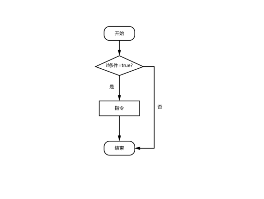

参数：

<table border="1" style="border-collapse: collapse;">
<tr><td style="text-align: center; vertical-align: middle;">变量1</td><td style="vertical-align: middle;">变量1的类型，可以选择数值变量、数字输入输出、模拟输入变量，位置变量类型  1. 若参数类型选择的类型为数值变量（INT、DOUBLE、BOOL、GINT、GDOUBLE、GBOOL），则此处为变量1的变量名
 	  2. 若参数类型选择的类型为数字/模拟变量（DIN、DOUT、AIN）,则此处为数字输入输出或模拟输入的端口号
 	  3. 若参数类型选择的类型为位置变量（P、GP、E、GE）,选择位置变量后变量的格式为选择的位置变量加位置变量坐标轴,当选择变量坐标轴的点位满足条件时执行if里面的指令</td></tr>
<tr><td style="text-align: center; vertical-align: middle;">比较方式</td><td style="vertical-align: middle;">== 等于  <小于 
  >大于
  <= 小于或等于
  >= 大于或等于
  != 不等于</td></tr>
<tr><td style="text-align: center; vertical-align: middle;">变量2</td><td style="vertical-align: middle;">参数2选择的变量类型:手填，变量  若变量值来源选择手填，则在此处直接填写参数2的值</td></tr>
</table>
注意事项：

1.  IF指令可以单独使用，也可搭配ELSEIF、ELSE两条指令使用。注意：ELSEIF、ELSE指令不可脱离IF指令单独使用。

2.  当程序的开头为IF且最后一行为ENDIF指令时，请在IF指令上方或ENDIF下方插入一条0.1秒的TIMER（延时）指令，否则当IF指令的条件不满足时会导致程序陷入死机状态。

3.  插入IF指令时会同时插入ENDIF指令，当删除IF指令时请注意将对应的ENDIF指令也删掉，否则会导致程序无法执行。

示例：

1.  NOP

2.  MOVL P0001 V=10mm/s PL=0 ACC=1 DEC=1 0

3.  IF (GI001\>5)AND{(GI002=5)OR(D001!=3)}

4.  TIMER T=2

5.  ENDIF

6.  END

示例说明：程序运行到第3行时，对IF指令进行判断，判断为真执行延时指令，反之程序直接运行到第6行。

#### ELSEIF-否则如果

格式：IF 【指令名】I001【参数1】=【比较方式】D001【参数2】。

功能:IF指令的判断条件不满足时，执行ELSEIF语句。

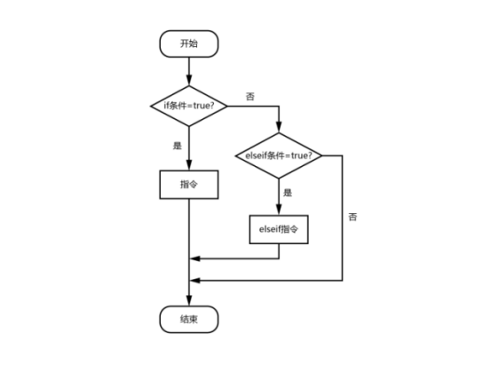

参数：

<table border="1" style="border-collapse: collapse;">
<tr><td style="text-align: center; vertical-align: middle;">变量1</td><td style="vertical-align: middle;">变量1的类型，可以选择数值变量、数字输入输出、模拟输入、位置变量类型  1. 若参数类型选择的类型为数值变量（INT、DOUBLE、BOOL、GINT、GDOUBLE、GBOOL），则此处为变量1的变量名
 	  2. 若参数类型选择的类型为数字/模拟变量（DIN、DOUT、AIN），则此处为数字输入输出或模拟输入的端口号
 	  3. 若参数类型选择的类型为位置变量（P、GP、E、GE）,选择位置变量后变量的格式为选择的位置变量加位置变量坐标轴,当选择变量坐标轴的点位满足条件时执行elseif里面的指令</td></tr>
<tr><td style="text-align: center; vertical-align: middle;">比较方式</td><td style="vertical-align: middle;">== 等于  <小于 
  >大于
  <= 小于或等于
  >= 大于或等于
  != 不等于</td></tr>
<tr><td style="text-align: center; vertical-align: middle;">变量2</td><td style="vertical-align: middle;">变量2选择的变量类型:手填，变量  若变量值来源选择手填，则在此处直接填写参数2的值</td></tr>
</table>
注意事项：

1.  当IF的条件满足时，会执行IF语句里面的指令，会忽略掉ELSEIF与ENDIF之间的指令。

2.  当IF的条件不满足时，会跳转到ELSEIF指令，判断ELSEIF的判断条件，若条件成立，则运行ELSEIF和ENDIF之间的指令，然后继续运行ENDIF下面的指令；若不满足，则直接跳转到ENDIF下面的一行指令继续运行。

3.  若在IF与ENDIF中嵌套了多条ELSEIF，当IF的判断条件不成立时首先判断第一条ELSEIF的判断条件，若成立则运行第一条ELSEIF与第二条ELSEIF之间的指令；若不成立则判断第二条ELSEIF的判断条件，以此类推。

4.  当删除IF指令时，需删除与其对应的ELSEIF和ENDIF指令，否则会导致程序报错无法运行。

示例：

1.  NOP

2.  MOVL P0001 V=10mm/s PL=0 ACC=1 DEC=1 0

3.  IF(I001=5)

4.  TIMER T=1

5.  ELSEIF(I001!=0)AND(GI001=2)

6.  TIMER T=2

7.  ENDIF

8.  END

示例说明：运行到第三条指令时，对IF指令判断,判断为真执行第4条延时指令，反之则判断ELSEIF语句，如果ELSEIF条件成立，则执行第6条延时指令，反之程序直接运行到第8行。

#### ELSE-否则

格式：ELSE【指令名】。

功能:IF,ELSEIF指令的判断条件都不成立时，执行ELSE语句。

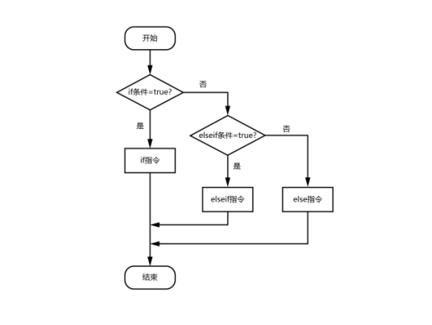

参数：略。

注意事项：

1.  ELSE指令必须插入在IF和ENDIF之间，但是一个IF指令只能嵌入一条ELSE指令。

2.  当IF的判断条件成立时，会运行IF与ELSE之间的指令运行结束后跳转到ENDIF的下一行指令继续运行。

3.  当IF的判断条件不成立时，会跳转到ELSE与ENDIF之间的指令运行。

4.  当删除IF指令时，需删除与其对应的ELSE和ENDIF指令，否则会导致程序无法运行。

示例：

1.  NOP

2.  ADD D001 1

3.  IF (I001\<10)

4.  TIMER T=1

5.  ELSEIF (GI001!=5)

6.  MOVL P0001 V=10mm/s PL=0 ACC=1 DEC=1 0

7.  ELSE

8.  TIMER T=1

9.  ENDIF

10. END

示例说明：当IF指令和ELSEIF指令的判断条件都不成立时，判断ELSE指令，若ELSE判断成立，执行第8行指令，反之直接运行到第10行。

#### WAIT-等待

格式：WAIT【指令名称】GI001【参数1】==【比较方式】2【参数2】T = 2
【等待时间】F = 1【滤波时间】Return=B001【等待结果存入变量】。

功能：条件成立之前程序处于等待状态，条件成立后继续执行等待指令后面的指令。

参数：

<table border="1" style="border-collapse: collapse;">
<tr><td style="text-align: center; vertical-align: middle;">变量1</td><td style="vertical-align: middle;">变量1的类型，可以选择数值变量、数字输入输出、模拟输入、位置变量类型  1. 若参数类型选择的类型为数值变量（INT、DOUBLE、BOOL、GINT、GDOUBLE、GBOOL），则此处为变量1的变量名
 	  2. 若参数类型选择的类型为数字/模拟变量（DIN、DOUT、AIN），则此处为数字输入输出或模拟输入的端口号
 	  3. 若参数类型选择的类型为位置变量（P、GP、E、GE）,选择位置变量后变量的格式为选择的位置变量加位置变量坐标轴,当选择变量坐标轴的点位满足条件时执行elseif里面的指令</td></tr>
<tr><td style="text-align: center; vertical-align: middle;">比较方式</td><td style="vertical-align: middle;">== 等于  <小于 
  >大于
  <= 小于或等于
  >= 大于或等于
  != 不等于</td></tr>
<tr><td style="text-align: center; vertical-align: middle;">变量2</td><td style="vertical-align: middle;">变量2选择的变量类型:手填，变量  若变量值来源选择手填，则在此处直接填写参数2的值</td></tr>
<tr><td style="text-align: center; vertical-align: middle;">Time等待时间</td><td style="vertical-align: middle;">1.  不勾选"TIME"选项，则在判断条件不成立时一直停留在该WAIT指令等待，直到判断条件成立  2.  勾选了"TIME"选项，到达等待时间不论条件是否成立也会运行下一条指令。若在等待指令时条件变为成立，则立刻运行下一条令</td></tr>
<tr><td style="text-align: center; vertical-align: middle;">滤波时间</td><td style="vertical-align: middle;">1.  输入信号时间满足滤波时间:（无需等待TIME）直接到下一行继续行  2.  不满足滤波时间时:则到达等待TIME时间之后到下一行继续运行</td></tr>
<tr><td style="text-align: center; vertical-align: middle;">等待结果</td><td style="vertical-align: middle;">将等待结果存入布尔变量，超出等待时间等待结果返回1，未超出等待时间，等待结果返回0</td></tr>
</table>
示例：

1.  NOP

2.  MOVL P0001 V=10mm/s PL=0 ACC=1 DEC=1 0

3.  WAIT (GI001\<5) T=1 Return=GB001

4.  MOVL P0001 V=10mm/s PL=0 ACC=1 DEC=1 0

5.  END

示例说明：程序在运行到第3行等待指令判断条件是否成立，若成立直接运行等待下面的指令；若不成立，则到达等待时间后运行等待下面的指令，将等待结果存入变量GB001。

#### WHILE-循环

格式：WHILE 【指令名】I001【参数1】=【比较方式】D001【参数2】。

功能：判断条件为真是反复执行循环语句里面的指令。

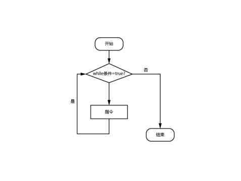

参数：

<table border="1" style="border-collapse: collapse;">
<tr><td style="text-align: center; vertical-align: middle;">变量1</td><td style="vertical-align: middle;">变量1的类型，可以选择数值变量、数字输入输出、模拟输入、位置变量类型  1. 若参数类型选择的类型为数值变量（INT、DOUBLE、BOOL、GINT、GDOUBLE、GBOOL），则此处为变量1的变量名
 	  2. 若参数类型选择的类型为数字/模拟变量（DIN、DOUT、AIN），则此处为数字输入输出或模拟输入的端口号
 	  3. 若参数类型选择的类型为位置变量（P、GP、E、GE）,选择位置变量后变量的格式为选择的位置变量加位置变量坐标轴,当选择变量坐标轴的点位满足条件时执行elseif里面的指令</td></tr>
<tr><td style="text-align: center; vertical-align: middle;">比较方式</td><td style="vertical-align: middle;">== 等于  <小于 
  >大于
  <= 小于或等于
  >= 大于或等于
  != 不等于</td></tr>
<tr><td style="text-align: center; vertical-align: middle;">变量2</td><td style="vertical-align: middle;">变量2选择的变量类型:手填，变量  若变量值来源选择手填，则在此处直接填写参数2的值</td></tr>
<tr><td style="text-align: center; vertical-align: middle;">Time等待时间</td><td style="vertical-align: middle;">1.  不勾选"TIME"选项，则在判断条件不成立时一直停留在该WAIT指令等待，直到判断条件成立  2.  勾选了"TIME"选项，到达等待时间不论条件是否成立也会运行下一条指令。若在等待指令时条件变为成立，则立刻运行下一条令</td></tr>
<tr><td style="text-align: center; vertical-align: middle;">滤波时间</td><td style="vertical-align: middle;">1.  输入信号时间满足滤波时间:（无需等待TIME）直接到下一行继续行  2.  不满足滤波时间时:则到达等待TIME时间之后到下一行继续运行</td></tr>
<tr><td style="text-align: center; vertical-align: middle;">等待结果</td><td style="vertical-align: middle;">将等待结果存入布尔变量，超出等待时间等待结果返回1，未超出等待时间，等待结果返回0</td></tr>
</table>
注意事项：

1.  插入WHILE指令的同时会同时插入ENDWHILE指令。若要删除WHILE指令请同时删掉其对应的ENDWHILE指令，否则会导致程序无法运行。

2.  当程序的开头为WHILE且最后一样指令为ENDWHILE时，请在程序的开头或结尾插入一条TIMER（延时）指令。否则当WHILE指令的条件不满足时会导致程序陷入死机。

3.  当WHILE内部的指令没有运动类指令或在某种情况下可能会陷入死循环时，请在WHILE与ENDWHILE间插入一条TIMER（延时）指令，否则当WHILE指令的条件满足时可能会导致程序陷入死机。

4.  当WHILE指令的条件满足时，会循环运行WHILE与ENDWHILE两条指令之间的指令。在运行到WHILE指令之前若判断条件不满足，在运行到WHILE指令时会直接跳转到ENDWHILE指令而不运行WHILE与ENDWHILE之间的指令；若在运行WHILE与ENDWHILE之间的指令过程中，判断条件变成不满足，会继续运行，直到运行到ENDWHILE行，不再循环而是继续运行ENDWHILE下面的指令。

示例：

1.  NOP

2.  CALL\[\$Z子程序\$\]

3.  WHILE(DIN1-1=1)OR(GI001=1)

4.  MOVL P0001 V=10mm/s PL=0 ACC=1 DEC=1 0

5.  MOVL P0002 V=10mm/s PL=0 ACC=1 DEC=1 0

6.  ENDWHILE

7.  TIMER T=1

8.  END

示例说明：程序在运行到WHILE指令之前先判断循环条件是否满足，若满足则循环运行WHILE与ENDWHILE两条指令之间的运动指令，若不满足则执行循环语句外的指令。

#### LABEL-标签

格式：LABEL【指令名】\[\$name\$\]【标签名】。

功能：指定跳转目标行的标签。

参数：

<table border="1" style="border-collapse: collapse;">
<tr><td style="text-align: center; vertical-align: middle;">标签名</td><td style="vertical-align: middle;">指令跳转的标签名，例如标签名是【Q1】，在跳转指令参数设定界面选择的标签名是【Q1】，那程序会一直运行标签和跳转指令之间的指令</td></tr>
</table>

注意事项：

1.  同一程序无法插入两条标签名相同的标签指令。

2.  标签指令不支持上移、下移操作。

示例：

1.  NOP

2.  MOVL P0001 V=10mm/s PL=0 ACC=1 DEC=1 0

3.  LABEL \[\$Q1\$\]

4.  MOVL P0002 V=10mm/s PL=0 ACC=1 DEC=1 0

5.  MOVL P0003 V=10mm/s PL=0 ACC=1 DEC=1 0

6.  JUMP \[\$Q1\$\]

7.  TIMER T=1

8.  END

示例说明：一直循环运行LABEL \[\$Q1\$\]和JUMP
\[\$Q1\$\]两条指令之间的指令。

#### JUMP-跳转

格式：JUMP【指令名】\[\$TIP\$\]【标签名】WHEN(I001=0)【判断条件】。

功能：跳转至指定标签号的指令行。

参数：

<table border="1" style="border-collapse: collapse;">
<tr><td style="text-align: center; vertical-align: middle;">标签名</td><td style="vertical-align: middle;">选择已插入LABEL指令的标签名</td></tr>
<tr><td style="text-align: center; vertical-align: middle;">判断条件</td><td style="vertical-align: middle;">1.  有判断条件：判断条件成立则跳转到LABEL指令行，若判断条件不成立则忽略JUMP指令，继续运行JUMP指令的下一行指令  	2. 无判断条件：运行到该指令会直接跳转到对应的LABEL指令后继续运行LABEL指令的下一行指令。</td></tr>
<tr><td style="text-align: center; vertical-align: middle;">参数类型</td><td style="vertical-align: middle;">可以选择数值变量、数字输入输出、模拟输入变量类型  若参数类型选择的类型为变量（INT、DOUBLE、BOOL、GINT、GDOUBLE、GBOOL），则此处为参数1的变量名
 	  若参数类型选择的类型为输入值（DIN、DOUT、AIN），则此处为数字输入输出或模拟输入的端口号</td></tr>
<tr><td style="text-align: center; vertical-align: middle;">比较方式</td><td style="vertical-align: middle;">== 等于  <小于 
  >大于
  <= 小于或等于
  >= 大于或等于
  != 不等于</td></tr>
<tr><td style="text-align: center; vertical-align: middle;">变量值来源</td><td style="vertical-align: middle;">支持自定义和变量类型，若变量值来源选择自定义，则在此处直接填写给变量赋值的数值</td></tr>
</table>
注意事项：

1.  JUMP指令必须与LABEL（标签）指令配合使用。

2.  JUMP指令不可跨程序跳转。例如主程序里面插入LABEL
    \[\$Q1\$\]指令，在子程序插入JUMP \[\$Q1\$\]指令，程序运行会报错。

示例：

1.  NOP

2.  MOVL P0001 V=10mm/s PL=0 ACC=1 DEC=1 0

3.  LABEL \[\$Q1\$\]

4.  MOVL P0002 V=10mm/s PL=0 ACC=1 DEC=1 0

5.  MOVL P0003 V=10mm/s PL=0 ACC=1 DEC=1 0

6.  JUMP \[\$Q1\$\] WHEN(GI001!=10)AND(GI002\>5)

7.  TIMER T=1

8.  END

示例说明：跳转指令设置了条件判断，当判断条件成立时会跳转到标签行重复运行LABEL和JUMP
之间的直线指令，若不成立则继续运行JUMP指令的下一行TIMER（延时）指令。

#### UNTIL-直到

格式：UNTIL【指令名】I001【变量1】=【比较方式】I002【变量2】。

功能：条件不成立时重复执行UNTIL和ENDUNTIL之间的指令，条件成立时直接跳到ENDUNTIL下面的指令运行。

参数：
<table border="1" style="border-collapse: collapse;">
<tr><td style="text-align: center; vertical-align: middle;">参数类型</td><td style="vertical-align: middle;">可以选择数值变量、数字输入输出、模拟输入变量类型  若参数类型选择的类型为变量（INT、DOUBLE、BOOL、GINT、GDOUBLE、GBOOL），则此处为参数1的变量名
 	  若参数类型选择的类型为输入值（DIN、DOUT、AIN），则此处为数字输入输出或模拟输入的端口号</td></tr>
<tr><td style="text-align: center; vertical-align: middle;">比较方式</td><td style="vertical-align: middle;">== 等于  <小于 
  >大于
  <= 小于或等于
  >= 大于或等于
  != 不等于</td></tr>
<tr><td style="text-align: center; vertical-align: middle;">变量值来源</td><td style="vertical-align: middle;">支持自定义和变量类型，若变量值来源选择自定义，则在此处直接填写给变量赋值的数值</td></tr>
</table>
注意事项：

1.  UNTIL指令插入的同时会插入ENDUNTIL指令。若要删除UNTIL指令请同时删掉其对应的ENDUNTIL指令，否则会导致程序无法运行。

示例：

1.  NOP

2.  MOVL P0001 V=10mm/s PL=0 ACC=1 DEC=1 0

3.  UNTIL(I001\<5)

4.  MOVL P0002 V=10mm/s PL=0 ACC=1 DEC=1 0

5.  MOVL P0003 V=10mm/s PL=0 ACC=1 DEC=1 0

6.  ENDUNTIL

7.  TIMER T=1

8.  END

示例说明：当UNTIL条件成立时，会直接跳转到ENDUNTIL后面的TIMER（延时）指令，当UNTIL条件不成立时，会执行UNTIL和ENDUNTIL之间的直线指令。

#### CRAFTLINE-工艺跳行

格式：CRAFTLINE【指令名】1【对应行数】。

功能：只用于专用工艺，程序中插入该指令设置对应行数，在专用工艺界面运行程序时会先跳转到对应的行数。

参数：

<table border="1" style="border-collapse: collapse;">
<tr><td style="text-align: center; vertical-align: middle;">新参数</td><td style="vertical-align: middle;">此处填写的数字表示在运行专用工艺程序时，会跳行对应行数</td></tr>
</table>

#### CMDNOTE-注释指令

格式：##注释内容\$\$。

功能:程序适当位置添加注释，便于调试。

参数:略。

注意事项：

1.  注释指令在运行时会跳到下一行指令运行，不会有报错提示。

2.  注释的内容支持中英文，支持大小写，支持数字输入和支持符号输入。

示例：

1.  NOP

2.  ##运行直线轨迹\$\$

3.  MOVL P0002 V=10mm/s PL=0 ACC=1 DEC=1 0

4.  MOVL P0002 V=10mm/s PL=0 ACC=1 DEC=1 0

5.  ##延时1秒\$\$

6.  TIMER T=1

7.  END

示例说明：第2行插入的注释指令是对第3、4行指令的注释，第5行插入的注释指令是对第6行指令的注释。

POS_REACHABLE-是否可达判断

格式:POS_REACHABLE【指令名】MOVL/MOVJ【运动类型】B001【状态存入的变量】。

功能：判断目标点是否能到达，点位能够到达选择的状态存入的变量置1，不能到达置0。

参数：

<table border="1" style="border-collapse: collapse;">
<tr><td style="text-align: center; vertical-align: middle;">位置变量名</td><td style="vertical-align: middle;">全局位置点位(GP)，局部位置点位(P)</td></tr>
<tr><td style="text-align: center; vertical-align: middle;">运动类型</td><td style="vertical-align: middle;">直线插补(MOVL),关节插补(MOVJ)  例如：有的点位通过关节插补的运动方式可以到达，直线插补的方式无法到达。通过插入是否可达判断指令来判断运行的目标点位通过直线插补、关节插补是否可以达到，防止机器人在运行过程中到达奇异点导致飞车</td></tr>
<tr><td style="text-align: center; vertical-align: middle;">状态存入的变量</td><td style="vertical-align: middle;">将点位能否到达的判定结果存入变量。"1"表示可以到达，"0"表示无法到达</td></tr>
</table>
示例：

1.  NOP

2.  POS_REACHABLE MOVL GP0001 GB0001

3.  POS_REACHABLE MOVL GP0002 GB0002

4.  MOVJ GP0001 V=10mm/s PL=0 ACC=1 DEC=1 0

5.  MOVJ GP0002 V=10mm/s PL=0 ACC=1 DEC=1 0

6.  END

示例说明：首先插入是否可达判断指令来判断目标点位GP0001、GP0002通过直线插补的方式能否到达，如果能到达的话变量GB001、GB0002置为1。

#### CLKSTART-计时开始

格式：CLKSTART【指令名】ID=1【计时序号】D001【计时存入的变量】。

功能：运行该指令开始计时，并将时间记录到局部或者全局DOUBLE变量。

参数：
<table border="1" style="border-collapse: collapse;">
<tr><td style="text-align: center; vertical-align: middle;">序号</td><td style="vertical-align: middle;">计时器的序号，可以同时使用32个计时器分别计时</td></tr>
<tr><td style="text-align: center; vertical-align: middle;">存入变量</td><td style="vertical-align: middle;">变量类型可以选择局部DOUBLE变量或者全局的GDOUBLE变量，记录的时间会存入到选择的变量
  例如：选择的变量是GD001，在程序运行的时候GD001会存入计时的时间</td></tr>
</table>
示例：

1.  NOP

2.  MOVL GP0001 V=10mm/s PL=0 ACC=1 DEC=1 0

3.  CLKSTART ID=1 GD001

4.  MOVL GP0002 V=10mm/s PL=0 ACC=1 DEC=1 0

5.  END

示例说明：程序在运行到第3行指令时计时1开始计时，第4行指令运行结束后计时器1计时结束，记录的时间存入到变量GD001。

#### CLKSTOP-计时结束

格式：CLKSTOP 【指令名】ID=1【停止计时的计时器序号】。

功能:停止对应序号的计时器计时,停止后已存入变量的值不会归零。

参数：
<table border="1" style="border-collapse: collapse;">
<tr><td style="text-align: center; vertical-align: middle;">序号</td><td style="vertical-align: middle;">停止计时器的计时器序号，可以同时使用32个计时器分别计时</td></tr>
</table>

示例：

1.  NOP

2.  CLKSTART ID=1 GD001

3.  MOVL GP0001 V=10mm/s PL=0 ACC=1 DEC=1 0

4.  MOVL GP0002 V=10mm/s PL=0 ACC=1 DEC=1 0

5.  CLKSTOP ID=1

6.  MOVL GP0003 V=10mm/s PL=0 ACC=1 DEC=1 0

7.  END

示例说明:程序运行到第2行时计时器1开始计时，运行到第5行时计时器1计时停止计时，停止后已存入变量的时间不会清零，如果在同一程序计时器1重新开始计时，会从上次停止的数值开始计时（例如：上次计时停止时间是12.55ms,重新开始计时会从12.55ms开始计时）。

#### CLKRESET-计时复位

格式：格式：CLKSTOP 【指令名】ID=1【停止计时的计时器序号】。

功能：将对应序号的计时器清零。若没有使用该指令，下次运行CLKSTART指令会累积计时。

参数：
<table border="1" style="border-collapse: collapse;">
<tr><td style="text-align: center; vertical-align: middle;">序号</td><td style="vertical-align: middle;">计时器复位的序号，计时开始和计时复位的计时器序号需要对应。</td></tr>
</table>

示例：

1.  NOP

2.  CLKSTART ID=1 GD001

3.  MOVL GP0001 V=10mm/s PL=0 ACC=1 DEC=1 0

4.  MOVL GP0002 V=10mm/s PL=0 ACC=1 DEC=1 0

5.  CLKSTOP ID=1

6.  MOVL GP0003 V=10mm/s PL=0 ACC=1 DEC=1 0

7.  CLKPESET ID=1

8.  END

示例说明：程序在运行到第2行时计时器1开始计时，计时的值存入变量GD001,运行到第5行时计时器1停止计时，但是变量GD001的值不会清零，运行到第7行时，计时器1复位变量GD001的值清零。

#### READLINEAR-读取线速度

格式：READLINEAR【指令名】GI001【存入数值的变量】。

功能：机器人运行的时候实时读取机器人线速度，将读取到的速度存入到变量。

参数
<table border="1" style="border-collapse: collapse;">
<tr><td style="text-align: center; vertical-align: middle;">变量</td><td style="vertical-align: middle;">选择的变量类型（INT、GINT，DOUBLE、GDOUBLE）</td></tr>
</table>

注意事项：

1.  插入读取线速度指令时会同时插入读取线速度停止，如果要删除读取线速度指令请将对应线速度停止指令删除，否则程序会报错。

示例：

1.  NOP

2.  MOVL GP0001 V=10mm/s PL=0 ACC=1 DEC=1 0

3.  READLINEAR GI001

4.  MOVL GP0002 V=10mm/s PL=0 ACC=1 DEC=1 0

5.  ENDREADLINEAR

6.  MOVL GP0003 V=10mm/s PL=0 ACC=1 DEC=1 0

7.  END

示例说明：程序在运行到第2行时开始读取线速度，并将读取到的值存入到变量GI001（GI001的数值是实时变化的），在运行到第5行指令时，停止读取线速度（GI001的数值回到初始状态）。

#### CALL_LUASTRING-调用Lua语句

格式:CALL_LUASTRING【指令名】\[\$语句\$\]【输入的Lua】。

功能：通过调用Lua语句来实现相应的功能或操作。例如：变量的修改，全局、局部点位的获取。

参数：
<table border="1" style="border-collapse: collapse;">
<tr><td style="text-align: center; vertical-align: middle;">语句</td><td style="vertical-align: middle;">手填：输入正确的Lua语句可以直接单步或运行
  例如：修改GI001=12
  CALL_LUASTRING #nex.GI[1]=12#
  变量：把Lua语句写到字符串(string)变量中，通过调用相应的字符串变量来实现其功能
  例如：修改GI002=22
  SET GS001=#nex.GI[2]=22#
  CALL_LUASTRING GS001</td></tr>
</table>

示例：

1.  NOP

2.  SET GS005=#nex.GI\[5\]=12#

3.  CALL_LUASTRING GS005

4.  CALL_LUASTRING #nex.dout\[1,1\]#

5.  END

示例说明：通过调用lua语句指令，输入正确的lua语句格式，修改GI005=12,IO板1数字输出端口1-1口置为高电平。

#### PARAM_DECLARATION-参数声明

格式：PARAM_DECLARATION【指令名
】IN(I001=1,\[变量1\])【输入参数信息】OUT(1,\[输出参数\])【输出参数信息】。

功能：声明要输入或者输出的参数，输入参数将被子程序接收并使用，输出参数将返回给主程序使用。

参数：
<table border="1" style="border-collapse: collapse;">
<tr><td style="text-align: center; vertical-align: middle;">输入参数个数</td><td style="vertical-align: middle;">定义输入参数的个数，此处定义几个个数，在调用子程序指令参数界面输入参数的个数就是多少</td></tr>
<tr><td style="text-align: center; vertical-align: middle;">输入参数选择</td><td style="vertical-align: middle;">输入参数个数为0时可点击  
1.输入参数个数  
1.1此参数可修改;
1.2个数有几个下方表格会显示几行数据  
2.变量列  
2.1选择输入参数要存入的变量;
2.2默认为I001  
3.默认值列  
3.1选择参数的默认值，默认为不使用;
3.2此处更多类型有手填、不使用、变量  
4.注释列  
4.1自定义注释内容;
4.2注释内容不能超过20个字符</td></tr>
<tr><td style="text-align: center; vertical-align: middle;">输出参数个数</td><td style="vertical-align: middle;">定义输出参数的个数，此处定义几个个数，在调用子程序指令参数界面输出参数的个数就是多少</td></tr>
<tr><td style="text-align: center; vertical-align: middle;">输出参数选择</td><td style="vertical-align: middle;">输出参数个数为0时可点击  
1.输出参数个数  
1.1此参数可修改;
1.2个数有几个下方表格会显示几行数据  
2.输出参数列  
2.1显示参数顺序编号  
3.默认值列  
3.1选择参数的默认值，默认为不使用;
3.2此处更多类型有手填、不使用、变量  
4.注释列  
4.1自定义注释内容;
4.2注释内容不能超过20个字符</td></tr>
</table>
注意事项：

1.  如果参数声明的输入参数变量值选择不使用，则从CALL指令输入参数中手填获取，如果参数声明的输入参数变量值选择手填，则CALL指令中的输入参数要选择不使用。

2.  PARAM_DECLARATION的输出参数值会返回给主程序中CALL指令的输出参数绑定的变量，需要注意的是变量必须为可赋值到主程序对应变量。

示例：主程序

1.  NOP

2.  SET I001=12

3.  SET I002=22

4.  CALL\[\$Q11\$\]IN(I001,I002)OUT(D006,D007)

5.  TIMER T=1

6.  END

示例：子程序Q11

1.  NOP

2.  PARAM_DECLARATION IN(D001=\[-\],D002=\[-\])OUT(10.0,11.0)

3.  TIMER T=0.5

4.  END

执行效果：子程序Q11参数声明的输入参数变量值选择不使用（\[-\]表示：不使用），输入参数从从CALL指令输入参数中手填获取，主程序运行调用子程序指令，输入参数I001和I002的值被子程序接收使用，运行到子程序Q11时I001=12，I002=22，输出参数将返回给主程序使用，子程序运行结束后进入主程序D006=10，D007=11。

#### WAIT_POS-等待运动到点

格式：WAIT_POS【指令名】SPEED/POS【速度/位置】ACCURARY【精度】MINTIME【最小等待时间】MAXTIME【最大等待时间】

功能：MOV指令执行结束并不代表伺服运行结束，仅为点位下发结束，此指令等待伺服电机运行精准到点，再执行下一个指令

参数：
<table border="1" style="border-collapse: collapse;">
<tr><td style="text-align: center; vertical-align: middle;">位置/速度</td><td style="vertical-align: middle;">等到运动到点的参数</td></tr>
<tr><td style="text-align: center; vertical-align: middle;">精度</td><td style="vertical-align: middle;">判断是否到点的参考  
例：数值为0.1，只要点位下发完成等待【设定的时间】开始判断是否到点</td></tr>
<tr><td style="text-align: center; vertical-align: middle;">最小等待时间</td><td style="vertical-align: middle;">不管有没有运动到指定点位，这个时间都要等待</td></tr>
<tr><td style="text-align: center; vertical-align: middle;">最大等待时间</td><td style="vertical-align: middle;">如果等待时间超过了此时间，机器人还没有运动到点的话，就会报错</td></tr>
</table>
注意事项：

1.  此指令必须在运动指令后执行此指令才生效。

2.  此指令只能仅支持前台程序，后台无运动指令自然也不需要使用。

3.  此指令不支持提前执行

4.  如果机器人在 最小等待时间和最大等待时间
    之间，运动到点了，就会退出等待，执行下一条指令

示例：

1.  NOP

2.  MOVL P0001 V=10mm/s PL=0 ACC=1 DEC=1 0

3.  MOVL P0002 V=10mm/s PL=0 ACC=1 DEC=1 0

4.  MOVL P0003 V=10mm/s PL=0 ACC=1 DEC=1 0

5.  WAIT_POS

6.  TIMER T=2

7.  END

示例说明：当第4行指令运行结束后，表示点位的运行结束，第5行指令运行结束表示伺服运行结束，伺服运动到点后开始执行延时指令。

#### DETECTCOLLISION_SET_碰撞检测设置

格式：DETECTCOLLISION_SET【指令名】0/1【临时参数关/临时参数开】0/1【0"碰撞检测使能关"，1"碰撞检测使能开"】JI=50、J2=50、J3=50、J4=50、J5=50、J6=50【碰撞检测阈值】。

功能：调用临时参数，方便及时调整碰撞检测阈值。

参数：

使用临时参数：打开此开关后才可以修改碰撞检测参数阈值。

碰撞检测使能：开启后机器人会根据灵敏度对碰撞进行检测，通常需要找到机器人运行时不会判定发生碰撞的值，然后就可以正常使用。

示例：

1.  NOP

2.  MOVL P0001 V=10mm/s PL=0 ACC=1 DEC=1 0

3.  MOVL P0002 V=10mm/s PL=0 ACC=1 DEC=1 0

4.  DETECTCOLLISION_SET 1 1 55 55 55 55 55 55

5.  MOVL P0003 V=10mm/s PL=0 ACC=1 DEC=1 0

6.  END

示例说明：执行第2，3条指令时调用的碰撞检测参数阈值为人机协作-力学功能界面的碰撞检测阈值（指令）参数，执行第4条指令时调用的碰撞检测参数阈值为碰撞检测设置指令设置的参数。

注意事项：碰撞检测设置指令只是临时参数，只对碰撞检测设置指令下面的运动指令有效，不插入碰撞检测设置指令时调用人机协作-力学功能界面的碰撞检测阈值（指令）参数。

#### DETECTCOLLISION_RESET-碰撞检测参数复位

格式：DETECTCOLLISION_RESET【指令名】。

功能：复位临时使用的碰撞检测阈值，执行此条指令后会调用人机协作-力学功能界面的碰撞检测阈值（指令）参数。

参数：略。

示例：

1.  NOP

2.  MOVL P0001 V=10mm/s PL=0 ACC=1 DEC=1 0

3.  DETECTCOLLISION_SET 1 1 55 55 55 55 55 55

4.  MOVL P0002 V=10mm/s PL=0 ACC=1 DEC=1 0

5.  DETECTCOLLISIONRSET

6.  MOVL P0003 V=10mm/s PL=0 ACC=1 DEC=1 0

7.  END

示例说明：执行第1条指令时调用人机协作-力学功能界面的碰撞检测阈值（指令）参数，执行第4条指令时调用的是第3条指令设置的临时阈值参数，执行第5条指令后检测参数复位，执行第6条指令调用的是人机协作-力学功能界面的碰撞检测阈值（指令）参数。

#### SWITCH

格式：SWITCH【指令名】。

功能：当SWITCH的参数值与某个CASE值匹配，则会跳到对应的CASE语句块中执行相应的指令，执行完该语句块则会跳出SWITCH;若SWITCH的参数值不与任何一个CASE匹配则运行DEFAULT语句。

参数：
<table border="1" style="border-collapse: collapse;">
<tr><td style="text-align: center; vertical-align: middle;">序号</td><td style="vertical-align: middle;">变量类型：INT,GINT</td></tr>
</table>

示例：

1.  NOP

2.  SWITCH_I001

3.  CASE_1

4.  TIMER T=1

5.  ENDSWITCH\_

6.  END

示例说明：当SWITCH的参数值与第一个CASE情况匹配时执行第4条指令，若不匹配执行第5条指令。

#### CASE

格式：CASE【指令名】。

功能：执行SWITCH时匹配成功会执行相对应的CASE。

参数：
<table border="1" style="border-collapse: collapse;">
<tr><td style="text-align: center; vertical-align: middle;">CASE</td><td style="vertical-align: middle;">参数只能是整数</td></tr>
</table>

示例：

1.  NOP

2.  SWITCH_I002

3.  CASE_1

4.  TIMER T=1

5.  CASE_2

6.  TIMER T=2

7.  ENDSWITCH\_

8.  END

示例说明：当SWITCH的参数值与第一个CASE情况匹配时执行第4条指令，若不匹配则执行第2个CASE，第2个CASE情况匹配则执行第6条指令，若不匹配执行第7条结束切换指令。

#### DEFAULT

格式：DEFAULT【指令名】。

功能：当SWITCH参数变量与所存的CASE值均不符合时，执行DEFAULT语句。

参数：略。

示例：

1.  NOP

2.  SWITCH_I002

3.  CASE_1

4.  TIMER T=1

5.  CASE_2

6.  TIMER T=2

7.  DEFAULT\_

8.  ENDSWITCH\_

9.  END

示例说明：当SWITCH的参数值与第一个和第二个CASE情况都不匹配时执行第8条均不符合指令。

### 17.5. 位置变量类

位置变量类共有"用户坐标修改、工具坐标修改、读取点位、点位加、点位减、点位改、复制点位、点位全加、点位全减、点位全改、轨迹偏移开始、轨迹偏移结束、读取点位信息、点位拉伸、设置点位信息、计算目标形态值"等16项指令。

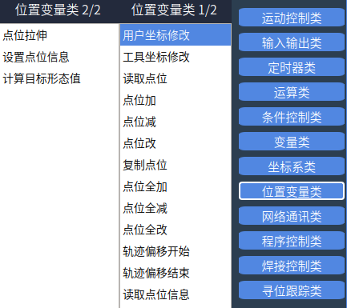

"√"表示支持此条指令。

备注：点位拉伸指令需要修改

<table border="1" style="border-collapse: collapse;">
<tr><td style="text-align: center; vertical-align: middle;">指令类型</td><td style="text-align: center; vertical-align: middle;">前台</td><td style="text-align: center; vertical-align: middle;">全局后台</td><td style="text-align: center; vertical-align: middle;">局部后台</td></tr>
<tr><td style="text-align: center; vertical-align: middle;">用户坐标修改</td><td style="text-align: center; vertical-align: middle;">√</td><td style="text-align: center; vertical-align: middle;">√</td><td style="text-align: center; vertical-align: middle;">√</td></tr>
<tr><td style="text-align: center; vertical-align: middle;">工具坐标修改</td><td style="text-align: center; vertical-align: middle;">√</td><td style="text-align: center; vertical-align: middle;">√</td><td style="text-align: center; vertical-align: middle;">√</td></tr>
<tr><td style="text-align: center; vertical-align: middle;">读取点位</td><td style="text-align: center; vertical-align: middle;">√</td><td style="text-align: center; vertical-align: middle;">√</td><td style="text-align: center; vertical-align: middle;">√</td></tr>
<tr><td style="text-align: center; vertical-align: middle;">点位加</td><td style="text-align: center; vertical-align: middle;">√</td><td style="text-align: center; vertical-align: middle;">√</td><td style="text-align: center; vertical-align: middle;">√</td></tr>
<tr><td style="text-align: center; vertical-align: middle;">点位减</td><td style="text-align: center; vertical-align: middle;">√</td><td style="text-align: center; vertical-align: middle;">√</td><td style="text-align: center; vertical-align: middle;">√</td></tr>
<tr><td style="text-align: center; vertical-align: middle;">点位改</td><td style="text-align: center; vertical-align: middle;">√</td><td style="text-align: center; vertical-align: middle;">√</td><td style="text-align: center; vertical-align: middle;">√</td></tr>
<tr><td style="text-align: center; vertical-align: middle;">复制点位</td><td style="text-align: center; vertical-align: middle;">√</td><td style="text-align: center; vertical-align: middle;">√</td><td style="text-align: center; vertical-align: middle;">√</td></tr>
<tr><td style="text-align: center; vertical-align: middle;">点位全加</td><td style="text-align: center; vertical-align: middle;">√</td><td style="text-align: center; vertical-align: middle;">√</td><td style="text-align: center; vertical-align: middle;">√</td></tr>
<tr><td style="text-align: center; vertical-align: middle;">点位全减</td><td style="text-align: center; vertical-align: middle;">√</td><td style="text-align: center; vertical-align: middle;">√</td><td style="text-align: center; vertical-align: middle;">√</td></tr>
<tr><td style="text-align: center; vertical-align: middle;">点位全改</td><td style="text-align: center; vertical-align: middle;">√</td><td style="text-align: center; vertical-align: middle;">√</td><td style="text-align: center; vertical-align: middle;">√</td></tr>
<tr><td style="text-align: center; vertical-align: middle;">轨迹偏移开始</td><td style="text-align: center; vertical-align: middle;">√</td><td style="text-align: center; vertical-align: middle;">&nbsp;</td><td style="text-align: center; vertical-align: middle;">&nbsp;</td></tr>
<tr><td style="text-align: center; vertical-align: middle;">轨迹偏移结束</td><td style="text-align: center; vertical-align: middle;">√</td><td style="text-align: center; vertical-align: middle;">&nbsp;</td><td style="text-align: center; vertical-align: middle;">&nbsp;</td></tr>
<tr><td style="text-align: center; vertical-align: middle;">读取点位信息</td><td style="text-align: center; vertical-align: middle;">√</td><td style="text-align: center; vertical-align: middle;">&nbsp;</td><td style="text-align: center; vertical-align: middle;">&nbsp;</td></tr>
<tr><td style="text-align: center; vertical-align: middle;">点位拉伸</td><td style="text-align: center; vertical-align: middle;">√</td><td style="text-align: center; vertical-align: middle;">&nbsp;</td><td style="text-align: center; vertical-align: middle;">&nbsp;</td></tr>
<tr><td style="text-align: center; vertical-align: middle;">设置点位信息</td><td style="text-align: center; vertical-align: middle;">√</td><td style="text-align: center; vertical-align: middle;">√</td><td style="text-align: center; vertical-align: middle;">√</td></tr>
<tr><td style="text-align: center; vertical-align: middle;">计算目标形态值</td><td style="text-align: center; vertical-align: middle;">√</td><td style="text-align: center; vertical-align: middle;">&nbsp;</td><td style="text-align: center; vertical-align: middle;">&nbsp;</td></tr>
</table>

#### USERFRAME_SET-用户坐标修改

格式：USERFRAME_SET【指令名】MODE【读取、写入】ID=1【用户坐标编号】UX/UY/UZ/UA/UB/UC/自定义【用户坐标参数】I001【变量】

功能：修改或者读取用户坐标系某一轴的数值

参数：

<table border="1" style="border-collapse: collapse;">
<tr><th>方式</th><th>读取：读取用户坐标某一轴的值</th><th>写入:修改用户坐标某一轴的值</th></tr>
<tr><td style="vertical-align: top;">用户坐标编号范围\[1,999\]</td><td style="vertical-align: center; vertical-align: middle;">读取用户坐标参数的用户坐标编号</td><td style="vertical-align: center; vertical-align: middle;">修改用户坐标参数的用户坐标编号</td></tr>
<tr><td style="vertical-align: center; vertical-align: middle;">用户坐标参数</td><td style="vertical-align: top;">UX,UY,UZ,UA,UB,UC：读取用户坐标系某一轴的数值  自定义：在坐标轴前面打“√”表示选中，可以一次读取多个坐标轴的值，将读取到的值按照选择的变量顺延读取  
例如：读取的首变量为I001,读取的坐标轴为UX,UY,UZ，执行此条指令会将数值依次读到I001,I002,I003</td><td style="vertical-align: center; vertical-align: middle;">UX,UY,UZ,UA,UB,UC:修改用户坐标系某一轴的数值</td></tr>
<tr><td style="vertical-align: center; vertical-align: middle;">变量</td><td style="vertical-align: center; vertical-align: middle;">变量(INT,GINT,DOUBLE,GDOUBLE):用变量的形式将选择的坐标轴的数值读取出来</td><td style="vertical-align: middle;">手填：直接手填数值修改坐标轴的数值  变量(INT,GINT,DOUBLE,GDOUBLE)：变量赋值的形式修改坐标轴的数值</td></tr>
</table>
示例：

1.  NOP

2.  USERFRAME_SET MODE=1 ID=1 UX I002

3.  USERFRAME_SET MODE=1 ID=1 UCUSTOM(UX,UY,UZ,UA) D001

4.  USERFRAME_SET MODE=0 ID=1 UY -50

5.  END

示例说明：执行第2行指令将用户坐标1的UX轴的数值通过变量I002读取，执行第3行指令，将用户坐标1的UX,UY,UZ,UA的值通过变量D001,D002,D003,D004读取，执行第4行指令将用户坐标1的UY轴修改成-50mm。

#### TOOLFRAME_SET-工具坐标修改

格式：TOOLFRAME_SET【指令名】MODE【读取、写入】ID=1【工具坐标编号】TX/TY/TZ/TA/TB/TC/自定义【工具坐标参数】I001【变量】。

功能：修改或者读取工具手某一轴的参数。

参数：
<table border="1" style="border-collapse: collapse;">
<tr><th>方式</th><th>读取：读取工具手某一轴的参数</th><th>写入:修改工具手某一轴的参数</th></tr>
<tr><td style="vertical-align: top;">工具坐标编号范围\[1,999\]</td><td style="vertical-align: center; vertical-align: middle;">读取工具坐标编号</td><td style="vertical-align: center; vertical-align: middle;">修改工具坐标编号</td></tr>
<tr><td style="vertical-align: center; vertical-align: middle;">用户坐标参数</td><td style="vertical-align: top;">TX,TY,TZ,TA,TB,TC：读取选择的工具手编号的某一轴数值  
自定义：在坐标轴前面打“√”表示选中，可以一次读取多个坐标轴的值，将读取到的值按照选择的变量顺延读取
例如：读取的首变量为GI001,读取的坐标轴为TA,TB,TC，执行此条指令会将数值依次读到GI001,GI002,GI003  
例如：读取的首变量为I001,读取的坐标轴为UX,UY,UZ，执行此条指令会将数值依次读到I001,I002,I003</td><td style="vertical-align: center; vertical-align: middle;">TX,TY,TZ,TA,TB,TC:修改选择的工具手编号的某一轴数值</td></tr>
<tr><td style="vertical-align: center; vertical-align: middle;">变量</td><td style="vertical-align: center; vertical-align: middle;">变量(INT,GINT,DOUBLE,GDOUBLE):用变量的形式将选择的坐标轴的数值读取出来</td><td style="vertical-align: middle;">手填：直接手填数值修改坐标轴的数值  变量(INT,GINT,DOUBLE,GDOUBLE)：变量赋值的形式修改坐标轴的数值</td></tr>
</table>
示例：

1.  NOP

2.  TOOLFRAME_SET MODE=1 ID=2 TY GI002

3.  TOOLFRAME_SET MODE=1 ID=2 TCUSTOM(TA,TB,TC) GD001

4.  TOOLFRAME_SET MODE=0 ID=2 TX 100

5.  END

示例说明：执行第2行指令将工具手2的UY轴的数值通过变量GI002读取，执行第3行指令，将工具手2的UA,UB,UC的值通过变量GD001,GD002,GD003,读取，执行第4行指令将工具手2的X轴偏移参数修改成100mm。

#### READPOS-读取点位

格式：READPOS【指令名】D001【变量名】当前/P/GP/E/GE【位置变量名】RF/BF/TF/UF【位置变量坐标系】1/2/3/4/5/6【位置变量轴】。

功能：将位置变量的某个轴的值读入到浮点型变量。

参数：

<table border="1">
<tr><td style="vertical-align: center;">变量名</td><td style="vertical-align: top;">将读取到的值存入变量（DOUBLE,GDOUBLE）</td></tr>  
<tr><td style="vertical-align: top;">位置变量名</td><td style="vertical-align: top;">当前:读取的是机器人当前位置的坐标  P,GP,E,GE:将点位存入变量，读取时只需要选择想要读取的目标变量即可</td></tr>
<tr><td style="vertical-align: top;">位置变量坐标系</td><td style="vertical-align: top;">读取不同坐标系下的点位  关节坐标（RF）,直角坐标（BF）,工具坐标（TF）,用户坐标（UF）</td></tr>
<tr><td style="vertical-align: top;">位置变量轴</td><td style="vertical-align: top;">机器人本体轴：读取机器人六个轴的点位，选择哪一个轴在执行指令时就会显示哪一个轴的点位  外部轴：最多可读取5个外部轴的点位（O1,O2,O3,O4,O5）</td></tr>
</table>
示例：

1.  NOP

2.  READPOS D001 P0001 RF JI

3.  READPOS D002 CURPOS BF J2

4.  READPOS GD001 GP0001 TF J3

5.  READPOS GD002 GE0001 RF O1

6.  END

示例说明：执行第2行指令把P0001关节坐标系下1轴的数值读到变量D001,执行第3行指令将机器人当前位置直角坐标系下2轴的数值读到变量D002，执行第4行指令将机器人GP0001点工具坐标系下3轴的数值读到变量GD001,执行第5行指令将外部轴GE0001点关节坐标系下O1轴的数值读到变量GD002。

#### POSADD-点位加

格式：POSADD【指令名】GP/P/GE/E【位置变量】RF/BF/TF/UF【位置变量坐标系】1/2/3/4/5/6【位置变量轴】手填/I/GI/D/GD【数值变量名】。

功能：在不同坐标系下给位置变量的某一个变量轴增加数值。

参数：

<table border="1" style="border-collapse: collapse;">
<tr><td style="background-color: text-align: center;">位置变量名</th><td style="background-color:text-align: center;">需要修改点位的位置变量（P,GP,E,GE）</th></tr>
<tr><td style="vertical-align: center;">位置变量坐标系</td><td style="vertical-align: center;">关节坐标（RF）  例如:GP0001关节坐标(1,2,3,4,5,6),将目标变量GP0001在关节坐标下2轴加10，执行点位加指令后GP0001在关节坐标下的点位(1,12,3,4,5,6)  
直角坐标（BF）  
例如:GP0001直角坐标(1.1,1.2,1.3,1.4,1.5,1.6),将目标变量GP0001在直角坐标下2轴加10，执行点位加指令后P0001在直角坐标下的点位(1.1,11.2,1.3,1.4,1.5,1.6)  
工具坐标（TF）  
例如:GE0001工具坐标(1,2,3,4,5,6,1.1,1.2,1.3,1.4,1.5),将目标变量GE0001在工具坐标下O1轴加5，执行点位加指令后GE0001在工具坐标下的点位(1,2,3,4,5,6,6.1,1.2,1.3,1.4,1.5)  
用户坐标（UF）  
例如:GP0100用户坐标(10,11,12,13,14,15),将目标变量GP0100在用户坐标下3轴加5，执行点位加指令后GP0100在用户坐标下的点位(10,11,17,13,14,15)</td></tr>
<tr><td style="vertical-align: top;">位置变量轴</td><td style="vertical-align: top;">选择需要修改的坐标轴，执行点位加指令会给选中的坐标轴加上填入的值  例如：想要给位置变量1轴加上10°,在位置位置变量轴选择1轴即可</td></tr>
<tr><td style="vertical-align: center;">数值变量名</td><td style="vertical-align: top;">1.  手填:直接输入想要增加的数值  2.变量（INT,GINT,DOUBLE,GDOUBLE):给选择的变量赋值，然后会将该变量的值加上位置变量对应轴的值，再赋值给该位置变量。  
例如：GP0001关节坐标(1,2,3,4,5,6)想要给GP0001的2轴加上15°执行点位加指令后GP0001关节坐标(1,17,3,4,5,6)</td></tr>
</table>
注意事项：修改目标点位时注意超限问题和目标位置不可达，坐标无法转换问题。

1.  关节超限：例如机器人一轴的正限位是180°,目标点位一轴的坐标是150°，在设置参数是给变量轴一轴赋值50°,运行指令时就会出现关节超限问题

2.  坐标无法转换问题：例如目标点位是关节点位,在设置参数时选择的变量坐标系是直角坐标系，给目标点位的位置变量轴赋值，执行点位加指令，点位在运算过程中可能会出现坐标无法转换问题。

示例：

1.  NOP

2.  SET I001=10

3.  POSADD P0001 RF J1 I001

4.  MOVJ P0001 VJ=10% PL=0 ACC=10 DEC=10 0

5.  END

示例说明:目标位置P0001关节坐标一轴加上10。

#### POSSUB-点位减

格式：POSSUB【指令名】GP/P/GE/E【位置变量】RF/BF/TF/UF【位置变量坐标系】1/2/3/4/5/6【位置变量轴】手填/I/GI/D/GD【数值变量名】。

功能：在不同坐标系下给位置变量的某一个变量轴减少数值。

参数：
<table border="1" style="border-collapse: collapse;">
<tr><td style="background-color: text-align: center;">位置变量名</th><td style="background-color:text-align: center;">需要修改点位的位置变量（P,GP,E,GE）</th></tr>
<tr><td style="vertical-align: center;">位置变量坐标系</td><td style="vertical-align: center;">关节坐标（RF）  例如:GP0001关节坐标(1,2,3,4,5,6),将目标变量GP0001在关节坐标下2轴加10，执行点位加指令后GP0001在关节坐标下的点位(1,12,3,4,5,6)  
直角坐标（BF）  
例如:GP0001直角坐标(1.1,1.2,1.3,1.4,1.5,1.6),将目标变量GP0001在直角坐标下2轴加10，执行点位加指令后P0001在直角坐标下的点位(1.1,11.2,1.3,1.4,1.5,1.6)  
工具坐标（TF）  
例如:GE0001工具坐标(1,2,3,4,5,6,1.1,1.2,1.3,1.4,1.5),将目标变量GE0001在工具坐标下O1轴加5，执行点位加指令后GE0001在工具坐标下的点位(1,2,3,4,5,6,6.1,1.2,1.3,1.4,1.5)  
用户坐标（UF）  
例如:GP0100用户坐标(10,11,12,13,14,15),将目标变量GP0100在用户坐标下3轴加5，执行点位加指令后GP0100在用户坐标下的点位(10,11,17,13,14,15)</td></tr>
<tr><td style="vertical-align: top;">位置变量轴</td><td style="vertical-align: top;">选择需要修改的坐标轴，执行点位加指令会给选中的坐标轴加上填入的值  例如：想要给位置变量1轴加上10°,在位置位置变量轴选择1轴即可</td></tr>
<tr><td style="vertical-align: center;">数值变量名</td><td style="vertical-align: top;">1.  手填:直接输入想要减少的数值  2.变量（INT,GINT,DOUBLE,GDOUBLE):给选择的变量赋值，然后会将该变量的值加上位置变量对应轴的值，再赋值给该位置变量。  
例如：GP0001关节坐标(1,2,3,4,5,6)想要给GP0001的2轴加上15°执行点位加指令后GP0001关节坐标(1,17,3,4,5,6)</td></tr>
</table>
注意事项：修改目标点位时注意超限问题和目标位置不可达，坐标无法转换问题。

1.  关节超限：例如机器人二轴的负限位是-50°,目标点位二轴的坐标是30°，在设置参数时给变量轴二轴赋值100°,运行指令时就会出现关节超限问题。

2.  坐标无法转换问题：例如目标点位是关节点位,在设置参数时选择的变量坐标系是直角坐标系，给目标点位的位置变量轴赋值，执行点位减指令，点位在运算过程中可能会出现坐标无法转换问题。

示例：

1.  NOP

2.  POSSUB P0001 BF J2 10

3.  MOVJ P0001 VJ=10% PL=0 ACC=10 DEC=10 0

4.  END

示例说明:目标位置P0001直角坐标系二轴减少10。

#### POSSET-点位改

格式：POSSUB【指令名】GP/P/GE/E【位置变量】RF/BF/TF/UF【位置变量坐标系】1/2/3/4/5/6【位置变量轴】手填/I/GI/D/GD【数值变量名】。

功能：在不同坐标系下将位置变量的某一个变量轴直接修改点位坐标值。

参数：
<table border="1" style="border-collapse: collapse;">
<tr><td style="background-color: text-align: center;">位置变量名</th><td style="background-color:text-align: center;">需要修改点位的位置变量（P,GP,E,GE）</th></tr>
<tr><td style="vertical-align: center;">位置变量坐标系</td><td style="vertical-align: center;">关节坐标（RF）  例如:GP0001关节坐标(1,2,3,4,5,6),将目标变量GP0001在关节坐标下2轴加10，执行点位加指令后GP0001在关节坐标下的点位(1,12,3,4,5,6)  
直角坐标（BF）  
例如:GP0001直角坐标(1.1,1.2,1.3,1.4,1.5,1.6),将目标变量GP0001在直角坐标下2轴加10，执行点位加指令后P0001在直角坐标下的点位(1.1,11.2,1.3,1.4,1.5,1.6)  
工具坐标（TF）  
例如:GE0001工具坐标(1,2,3,4,5,6,1.1,1.2,1.3,1.4,1.5),将目标变量GE0001在工具坐标下O1轴加5，执行点位加指令后GE0001在工具坐标下的点位(1,2,3,4,5,6,6.1,1.2,1.3,1.4,1.5)  
用户坐标（UF）  
例如:GP0100用户坐标(10,11,12,13,14,15),将目标变量GP0100在用户坐标下3轴加5，执行点位加指令后GP0100在用户坐标下的点位(10,11,17,13,14,15)</td></tr>
<tr><td style="vertical-align: top;">位置变量轴</td><td style="vertical-align: top;">选择需要修改的坐标轴，执行点位加指令会给选中的坐标轴加上填入的值  例如：想要给位置变量1轴加上10°,在位置位置变量轴选择1轴即可</td></tr>
<tr><td style="vertical-align: center;">数值变量名</td><td style="vertical-align: top;">1.  手填:直接输入想要修改的数值  2.变量（INT,GINT,DOUBLE,GDOUBLE):给选择的变量赋值，然后会将该变量的值加上位置变量对应轴的值，再赋值给该位置变量。  
例如：GP0001关节坐标(1,2,3,4,5,6)想要给GP0001的2轴加上15°执行点位加指令后GP0001关节坐标(1,17,3,4,5,6)</td></tr>
</table>
注意事项：修改目标点位时注意超限问题和目标位置不可达，坐标无法转换问题。

1.  关节超限：例如机器人三轴的正限位是100°,在设置参数时给变量轴二轴赋值120°,运行指令时就会出现关节超限问题

2.  坐标无法转换问题：例如目标点位是关节点位,在设置参数时选择的变量坐标系是直角坐标系，给目标点位的位置变量轴赋值，执行点位改指令，点位在运算过程中可能会出现坐标无法转换问题

示例：

1.  NOP

2.  POSSET GP0001 RF J5 10

3.  MOVJ GP0001 VJ=10% PL=0 ACC=10 DEC=10 0

4.  END

示例说明:目标位置P0001直角坐标五轴的坐标改为10。

#### COPYPOS-复制点位

格式：COPYPOS【指令名】当前/GP/P/GE/E【源位置变量】GP/P/GE/E【目标位置】。

功能：将一个位置变量的点位数据复制到另一个位置变量。

参数：

<table border="1" style="border-collapse: collapse;">
<tr><td style="text-align: center; vertical-align: middle;">源位置变量</td><td style="vertical-align: middle;">当前位置：将机器人当前位置赋值给另一个位置变量 位置变量(P,GP,E,GE)：将选择的源位置变量的点位数据赋值当前选择的目标位置变量</td></tr>
<tr><td style="text-align: center; vertical-align: middle;">目标位置变量</td><td style="vertical-align: middle;">复制点位的目标变量</td></tr>
<tr><td style="vertical-align: top; text-align: center; padding: 8px;" colspan="2"> 选择需要复制的坐标轴数据，在对应的坐标轴前面打"√"表示选中</td></tr>
</table>
注意事项：最大支持连接5个外部轴，在复制外部轴点位时只支持O1、O2、O3、O4、O5轴的复制，如果在设置参数时勾选了O6、O7轴，在执行复制点位时O6、O7轴不生效。

示例：

1.  NOP

2.  COPYPOS GE0001 TO GE0002 1 2 3 4 O1 O2

3.  MOVJEXT GE0002 VJ=10% PL=0 ACC=10 DEC=10 0

4.  END

示例说明：将外部轴GE0001直角坐标下1、2、3、4、O1、O2坐标轴的点位数据复制到位置变量GE0002。

#### POSADDALL-点位全加

格式：POSADDALL【指令名】GP/P/GE/E【位置变量】RF BF TF UF【坐标系】 1 2
3 4 5 I001 0【每个坐标加的值】。

功能:在不同坐标系下给位置变量的若干个变量轴增加数值。

参数：
<table border="1" style="border-collapse: collapse;">
<tr><td style="background-color: text-align: center;">位置变量</th><td style="background-color:text-align: center;">需要修改点位的位置变量（P,GP,E,GE）</th></tr>
<tr><td style="vertical-align: center;">坐标系</td><td style="vertical-align: center;">关节坐标（RF）  例如：P0001(1 2 3 4 5 6 ),将P0001的1轴加10，2轴加10，6轴加5，执行点位全加指令后 P0001(11 12 3 4 5 11 )  
直角坐标（BF）  
例如：GP0001(1 2 3 1 1 1 ),将GP0001的X轴加10，Z轴加10，A轴加1，执行点位全加指令后 GP0001(11 2 13 2 1 1 )  
工具坐标（TF）  
例如：P0002(1 2 3 2 2 2 ),将P0002的TX轴加10，TY轴加10，TZ轴加10,A轴加1，执行点位全加指令后 P0002(11 12 13 3 1 1 )  
用户坐标（UF）  
例如：E0001(1 2 3 4 5 6 11 12 13 14 15 ),将E0001的UA轴加5，UB轴加5，UC轴加10,O1轴加10，O2轴加10,执行点位全加指令后 E0001当前点位(6 7 13 4 5 6 21 22 13 14 15 )</td></tr>
<tr><td style="vertical-align: top;">位置变量轴</td><td style="vertical-align: top;">在需要增加值的变量轴上填写数值  1.手填:直接输入想要增加的数值 
2.变量（INT,GINT,DOUBLE,GDOUBLE):给选择的变量赋值，然后会将该变量的值加上位置变量对应轴的值，再赋值给该位置变量</td></tr>
</table>
注意事项：修改目标点位时注意超限问题和目标位置不可达，坐标无法转换问题。

示例：

1.  NOP

2.  SET I001=6

3.  POSADDALL GP0001 RF 1 2 3 4 5 I001

4.  MOVJ GP0001 VJ=10% PL=0 ACC=10 DEC=10 0

5.  END

示例说明：位置变量GP0001在原来点位基础上在关节坐标下给1轴、2轴、3轴、4轴、5轴、6轴增加数值1、2、3、4、5、6。

#### POSSUBALL-点位全减

格式：POSSUBALL【指令名】GP/P/GE/E【位置变量】RF BF TF UF【坐标系】 1 2
3 4 5 6 0【每个坐标减的值】。

功能:在不同坐标系下给位置变量的若干个变量轴减少数值。

参数:
<table border="1" style="border-collapse: collapse;">
<tr><td style="background-color: text-align: center;">位置变量</th><td style="background-color:text-align: center;">需要修改点位的位置变量（P,GP,E,GE）</th></tr>
<tr><td style="vertical-align: center;">坐标系</td><td style="vertical-align: center;">关节坐标（RF）  
例如：P0001(10 11 12 13 14 15),将P0001的4轴减5，5轴减5，6轴减5，执行点位全减指令后 P0001当前点位(10 11 12 8 9 10)    
直角坐标（BF）  
例如：GP0001(10 11 12 13 14 15),将GP0001的X轴减1，Z轴减1，A轴减1，执行点位全减指令后 GP0001(9 11 11 12 14 15)      
工具坐标（TF）  
例如：P0010(11 12 13 4 5 6),将P0002的TX轴减10，TY轴减10，TZ轴减10,执行点位全减指令后 P0010(1 2 3 4 5 6)    
用户坐标（UF）  
例如：E0001(1 2 3 4 5 6 11 12 13 14 15),将E0001的O1轴减5，O2轴减5，执行点位全减指令后 E0001当前点位(1 2 3 4 5 6 6 7 13 14 15)</td></tr>
<tr><td style="vertical-align: top;">位置变量轴</td><td style="vertical-align: top;">在需要减少值的变量轴上填写数值  
1.手填:直接输入想要减少的数值 
2.变量（INT,GINT,DOUBLE,GDOUBLE):给选择的变量赋值,会将位置变量对应轴的值减去该变量的值，最后将计算的点位赋值给位置变量</td></tr>
</table>
注意事项：修改目标点位时注意超限问题和目标位置不可达，坐标无法转换问题。

示例：

1.  NOP

2.  POSSUBALL GE0001 BF 0 0 0 0 0 0 0 10 11 0 0 0 0 0

3.  MOVJ GP0001 VJ=10% PL=0 ACC=10 DEC=10 0

4.  END

示例说明：位置变量GE0001在原点位基础上在直角坐标下给位置变量轴O1轴、O2轴减少数值10、11。

#### POSSETALL-点位全改

格式：POSSETALL【指令名】GP/P/GE/E【位置变量】RF BF TF UF【坐标系】 1 2
3 4 5 6 0【每个坐标修改的值】。

功能：在不同坐标系下将位置变量的若干个变量轴直接修改点位坐标值。

参数：
<table border="1" style="border-collapse: collapse;">
<tr><td style="background-color: text-align: center;">位置变量</th><td style="background-color:text-align: center;">需要修改点位的位置变量（P,GP,E,GE）</th></tr>
<tr><td style="vertical-align: center;">坐标系</td><td style="vertical-align: center;">关节坐标（RF）  
例如:P0010(1 2 3 4 5 6),将P0010在关节坐标下1轴改为10,2轴改为11,3轴改为12,执行点位全改指令后P0010当前点位(10 11 12 4 5 6)  
直角坐标（BF）  
例如:P0100(1 2 3 4 5 6),将P0010在直角坐标下A轴改为1,B轴改为2,C轴改为3,执行点位全改指令后P0100当前点位1 2 3 1 2 3 )  
工具坐标（TF）  
例如:GE0001工具坐标(10 11 12 13 14 15 1 2 3),将GE0001在工具坐标下O1轴改为5,O3轴改为6,执行点位全改指令后E0001(10 11 12 13 14 15 5 2 6)  
用户坐标（UF）  
例如:GP0100用户坐标( 21 22 23 24 25 26),将GP0100在用户坐标下UC轴改为15，执行点位全改指令后GP0100( 21 22 23 24 25 15)</td></tr>
<tr><td style="vertical-align: top;">位置变量轴</td><td style="vertical-align: top;">需要修改的变量轴上填写数值  
1.手填：直接输入修改的数值 
2.变量（INT,GINT,DOUBLE,GDOUBLE):给选择的变量赋值,执行点位改指令后将位置变量轴的值改为变量所赋值的值</td></tr>
</table>

注意事项：修改目标点位时注意超限问题和目标位置不可达，坐标无法转换问题。

示例：

1.  NOP

2.  POSSETALL GP0001 RF 12 13 14 15 16 17 0

3.  MOVJ GP0001 VJ=10% PL=0 ACC=10 DEC=10 0

4.  END

示例说明：将位置变量GP0001关节坐标1轴、2轴、3轴、4轴、5轴、6轴的坐标改为12、13、14、15、16、17。

#### TOFFSETON-轨迹偏移开始

格式：TOFFSETON【指令名】RF BF TF UF【坐标系】1 2 3 4 5 6 7
【偏移量】TOOL【工具手编号】USER【用户编号】。

功能：该指令能够对机器人的运行轨迹进行实时偏移。

参数：
<table border="1" style="border-collapse: collapse;">
<tr><td style="background-color: text-align: center;">坐标系</th><td style="background-color:text-align: center;">关节坐标（RF）、直角坐标（BF）、工具坐标（TF）、用户坐标（UF）</th></tr>
<tr><td style="vertical-align: center;">坐标轴</td><td style="vertical-align: top;">给需要偏移的坐标轴设置偏移量，机器人运行时的轨迹坐标为原有的坐标加上输入的偏移量。  例如：轨迹在直角坐标系下需要偏移的坐标轴为X轴，设置的偏移量为20
  在执行轨迹偏移指令到轨迹偏移结束之间的运动轨迹时每个点位的直角坐标X轴加20
  手填：直接输入偏移量
  变量（INT,GINT,DOUBLE,GDOUBLE):通过给变量赋值的形式设置偏移量  
例如：选择的变量为I001，设置I001=10表示设置的偏移量是10</td></tr>
</table>
注意事项:作业文件的第一条指令不能使用偏移指令。

示例：

1.  NOP

2.  TIMER T=1

3.  TOFFSETON RF 12 13 0 0 0 0 0

4.  MOVL GP0001 V=10mm/s PL=0 ACC=10 DEC=10 0

5.  MOVL GP0002 V=10mm/s PL=0 ACC=10 DEC=10 0

6.  TOFFSETOFF

7.  END

示例说明：执行第3行指令后，机器人从GP0001向GP0002运行的过程中关节坐标的一轴、二轴会在原有坐标的基础上加上偏移量12、13。

#### TOFFSETOFF-轨迹偏移结束

格式：TOFFSETOFF。

功能 轨迹偏移结束指令后的运动轨迹不再偏移。

参数：略。

示例：

1.  NOP

2.  TIMER T=1

3.  TOFFSETON RF 12 13 0 0 0 0 0

4.  MOVL GP0001 V=10mm/s PL=0 ACC=10 DEC=10 0

5.  MOVL GP0002 V=10mm/s PL=0 ACC=10 DEC=10 0

6.  TOFFSETOFF

7.  MOVL P0001 V=10mm/s PL=0 ACC=10 DEC=10 0

8.  MOVL P0002 V=10mm/s PL=0 ACC=10 DEC=10 0

9.  END

示例说明：执行第6行指令后，机器人从P0001向P0002移动的过程中不再偏移。

#### READPOSMSG-读取点位信息

格式：READPOSMSG【指令名】 P/GP【读取的目标位置】
工具/用户/坐标/姿态/形态【读取的信息】 I/GI【读取信息存入的变量】。

功能：将目标位置的工具号、用户坐标号、坐标系、姿态角度/弧度、形态信息的值读入到一个整型变量。

参数：

<table border="1" style="border-collapse: collapse;">
<tr><td style="background-color: text-align: center;">变量名</th><td style="background-color:text-align: center;">读取的目标位置(P,GP)</th></tr>
<tr><td style="vertical-align: center;">信息</td><td style="vertical-align: top;">工具号：读取目标变量的工具手编号  用户坐标号：读取目标变量的用户坐标编号  坐标系：[“0”关节坐标,“1”直角坐标,“2”工具坐标,“3”用户坐标]  
姿态角度/弧度：读取目标位置姿态轴的姿态值  
形态：读取目标点位的形态值</td></tr>
<tr><td style="vertical-align: top;">目标变量名</td><td style="vertical-align: top;">将读取到的信息存入到整型变量(INT,GINT)  例如：需要读取目标点位的工具手编号，在执行读取点位信息指令后会把工具手的编号存到选择的变量I001</td></tr>
</table>
示例：

1.  NOP

2.  MOVL GP0001 V=10mm/s PL=0 ACC=10 DEC=10 0

3.  READPOSMSG GP0001 TCS I001

4.  END

示例说明：读取目标位置GP0001的工具坐标编号，将读取出的编号存入变量I001。

#### POS_STRETCH-点位拉伸

格式：POS_STRETCH【指令名】直线/圆弧【拉伸类型】P/GP【起点位置】P/GP【终点位置】10【起点偏移】10【终点偏移】P/GP【输出起点位置】P/GP【输出终点位置】。

功能：通过设置起点和终点的偏移量来拉伸或者缩短轨迹的长度和圆弧的轨迹形状。

参数：
<table border="1" style="border-collapse: collapse;">
<tr><td style="background-color: text-align: center;">拉伸类型</th><td style="background-color:text-align: center;">曲线：设置起点和终点的偏移量改变圆弧轨迹形状  直线：设置起点和终点的偏移量改变直线轨迹的长度</th></tr>
<tr><td style="vertical-align: top;">起点</td><td style="vertical-align: top;">拉伸轨迹的起始点</td></tr>
<tr><td style="vertical-align: top;">圆弧中间点</td><td style="vertical-align: top;">圆弧轨迹的中间点</td></tr>
<tr><td style="vertical-align: top;">终点</td><td style="vertical-align: top;">拉伸轨迹的终点</td></tr>
<tr><td style="vertical-align: top;">起点偏移</td><td style="vertical-align: top;">设置偏移量，改变轨迹起始点的点位</td></tr>
<tr><td style="vertical-align: top;">终点偏移</td><td style="vertical-align: top;">设置偏移量，改变轨迹终点的点位</td></tr>
<tr><td style="vertical-align: top;">输出起点位置</td><td style="vertical-align: top;">将偏移后的起始点点位存入到选择的位置变量</td></tr>
<tr><td style="vertical-align: top;">输出终点位置</td><td style="vertical-align: top;">将偏移后的终点点位存入到选择的位置变量</td></tr>
</table>
示例：原始轨迹横向拉伸。

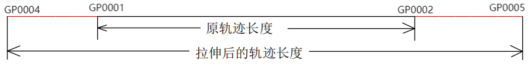

1.  NOP

2.  MOVL GP0001 V=10mm/s PL=0 ACC=10 DEC=10 0

3.  MOVL GP0002 V=10mm/s PL=0 ACC=10 DEC=10 0

4.  POS_STRETCH LINE GP0001 GP0002 50 70 GP0004 GP0005

5.  MOVL GP0003 V=10mm/s PL=0 ACC=10 DEC=10 0

6.  MOVL GP0004 V=10mm/s PL=0 ACC=10 DEC=10 0

7.  END

示例说明：GP0001-GP0002
为原始轨迹长度，在设置点位拉伸参数时，起点(GP0001)设值偏移参数50，并将计算后的偏移位置保存到变量(GP0004)，终点(GP0002)设值偏移参数70，并将计算后的偏移位置保存到变量(GP0005)，GP0004-GP0005就是拉伸后的轨迹长度。

#### SETPOSMSG-设置点位信息

格式：SETPOSMSG【指令名】P/GP/E/GE【位置变量】1【坐标系】1【姿态】2【形态】8【工具号】9【用户坐标号】。

功能：设置目标点位的坐标系、角度/弧度、形态、工具号、用户坐标号。

参数：
<table border="1" style="border-collapse: collapse;">
<tr><td style="background-color: text-align: center;">位置 变量</th><td style="background-color:text-align: center;">需要设置点位信息的位置变量，可以选择P GP E GE变量类型</th></tr>
<tr><td style="vertical-align: center;">坐标系</td><td style="vertical-align: center;">设置目标位置的坐标系,范围[0,3]  "0"关节坐标,"1"直角坐标,"2"工具坐标,"3"用户坐标</td></tr>
<tr><td style="vertical-align: center;">角度/弧度</td><td style="vertical-align: top;">设置目标位置的姿态,"0"角度,"1"弧度</td></tr>
<tr><td style="vertical-align: center;">形态</td><td style="vertical-align: center;">设置目标位置的形态参数，范围[0,8]</td></tr>
<tr><td style="vertical-align: center;">工具号</td><td style="vertical-align: top;">设置目标位置的工具编号,范围[0,999]  “0”表示无工具手</td></tr>
<tr><td style="vertical-align:center;">用户坐标号</td><td style="vertical-align: top;">设置目标位置的用户编号,范围[0,999]  “0”表示无工具手</td></tr>
</table>
示例：

1.  NOP

2.  SETPOSMSG GP0001 1 0 5 6 7

3.  MOVL GP0001 V=10mm/s PL=0 ACC=10 DEC=10 0

4.  END

示例说明：执行设置点位指令，位置变量GP0001的坐标系为直角坐标系，姿态值为角度，形态是5，工具编号是5，用户编号是7。

#### SOLVE_CONFIGURATION-计算目标形态值

格式：SOLVE_CONFIGURATION【指令名】P/GP/E/GE【目标点位】I/GI【形态值个数】I/GI【形态值首变量】。

功能：机器人从A点（当前实际位置）运动到B点时,可以计算出机器人能以多少种形态从A到B。

参数：
<table border="1" style="border-collapse: collapse;">
<tr><td style="background-color: text-align: center;">目标点</th><td style="background-color:text-align: center;">可以选择的位置变量类型(P GP E GE)  例如：选择的目标变量是GP0001,通过执行计算目标形态值可以计算出机器人从当前实际位置有几种形态到达GP0001</th></tr>
<tr><td style="vertical-align: center;">形态值个数</td><td style="vertical-align: top;">变量：INT GINT类型，将计算出来的形态值个数存入到选择的目标变量  例如：选择的变量是GI001,在执行指令后GI001=3,表示机器人从当前实际位置有3种形态到达目标点</td></tr>
<tr><td style="vertical-align: center;">形态值首个变量</td><td style="vertical-align: top;">变量：INT GINT类型，将计算出来的形态值存入到选择的目标变量，通过选择的首变量顺延保存计算出来的形态  例如：机器人当前位置有3种形态（形态2,形态5,形态6）可以运行到目标点，选择的首个变量是I001,在执行指令后I001=2,I002=5,I003=6</td></tr>
</table>
示例：

1.  NOP

2.  MOVL GP0001 V=10mm/s PL=0 ACC=10 DEC=10 0

3.  SOLVE_CONFIGURATION GP0003 GI001 GI002

4.  END

示例说明：执行计算目标形态指令可以算出机器人在当前实际位置有几种形态可以到达GP0003。

### 变量类、坐标系类、网络通讯类

变量类共有赋值、写入文件"两项指令；坐标系类共有"切换工具手、切换用户坐标、切换外部轴"等3项指令；网络通讯类有"输出信息"1项指令，如图所示：

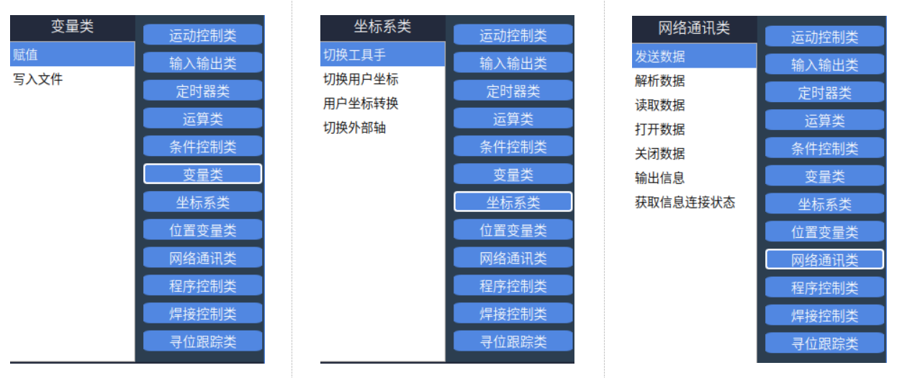

#### 变量类：

"√"表示支持此条指令。

<table border="1" style="border-collapse: collapse;">
<tr><td style="text-align: center; vertical-align: middle;">指令类型</td><td style="text-align: center; vertical-align: middle;">前台</td><td style="text-align: center; vertical-align: middle;">全局后台</td><td style="text-align: center; vertical-align: middle;">局部后台</td></tr>
<tr><td style="text-align: center; vertical-align: middle;">赋值</td><td style="text-align: center; vertical-align: middle;">√</td><td style="text-align: center; vertical-align: middle;">√</td><td style="text-align: center; vertical-align: middle;">√</td></tr>
<tr><td style="text-align: center; vertical-align: middle;">写入文件</td><td style="text-align: center; vertical-align: middle;">√</td><td style="text-align: center; vertical-align: middle;">√</td><td style="text-align: center; vertical-align: middle;">√</td></tr>
</table>

#### SET-赋值

格式：SET【变量名】I001【选择的目标变量】3【赋值的数值】。

功能：给定义的整型、浮点型、布尔型和字符串变量赋值。

参数：引用变量的详细介绍可以在引用变量章节查看。

<table border="1" style="border-collapse: collapse;">
<tr><td style="text-align: center; vertical-align: middle;">变量</td><td style="vertical-align: middle;">点击更多可以选择需要的变量类型(整型，浮点型，布尔型和字符串型)</td></tr>
<tr><td style="text-align: center; vertical-align: middle;">变量值</td><td style="vertical-align: middle;">给上面的变量赋值，可以手填或者选择变量表示</td></tr>
</table>

示例：

1.  NOP

2.  SET I001=12

3.  SET D001=12.21

4.  SET GI012=100

5.  SET GI\[GI012\]=999

6.  END

示例说明：程序第1、2行是直接给选择的变量赋值，第4、5行是通过变量形式赋值,程序运行结束后I001=12,D001=12.21,GI100=999。

如果SET字符串类型时，字符串中有转义字符，如果想避免转义字符对字符串的影响，可在转义字符之前加\"\\\";字符串类中也有类似问题。

示例：

SET GS001=11\\n：此处输出"\\n"被作为转义字符

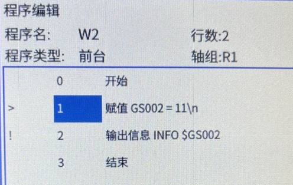

可修改为：SET GS001=11\\\\n：此时可以正常打印

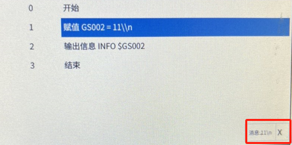

[转义字符对照表 - TabKey9 - 博客园
(cnblogs.com)](https://www.cnblogs.com/tabkey9/p/15930390.html)

#### FORCESET-写入文件

格式：FORCESET【指令名】GI001【写入文件的变量名】。

功能：将缓存的数据存入硬盘。

在程序运行过程中，所有的计算、赋值操作均是对缓存中的数值进行更改的，并不会存入系统文件中。若要强制将内存中的全局数值变量写入文件中，则可以使用FORCESET指令。

参数：

<table border="1" style="border-collapse: collapse;">
<tr><td style="text-align: center; vertical-align: middle;">变量名</td><td style="vertical-align: middle;">点击更多选择要强制写入文件的变量名</td></tr>
</table>

示例：

1.  NOP

2.  GI001=10

3.  FORCESET GI001

4.  END

### 坐标系类

"√"表示支持此条指令。

<table border="1" style="border-collapse: collapse;">
<tr><td style="text-align: center; vertical-align: middle;">指令类型</td><td style="text-align: center; vertical-align: middle;">前台</td><td style="text-align: center; vertical-align: middle;">全局后台</td><td style="text-align: center; vertical-align: middle;">局部后台</td></tr>
<tr><td style="text-align: center; vertical-align: middle;">切换工具手</td><td style="text-align: center; vertical-align: middle;">√</td><td style="text-align: center; vertical-align: middle;">√</td><td style="text-align: center; vertical-align: middle;">√</td></tr>
<tr><td style="text-align: center; vertical-align: middle;">切换用户坐标</td><td style="text-align: center; vertical-align: middle;">√</td><td style="text-align: center; vertical-align: middle;">√</td><td style="text-align: center; vertical-align: middle;">√</td></tr>
<tr><td style="text-align: center; vertical-align: middle;">切换外部轴</td><td style="text-align: center; vertical-align: middle;">√</td><td style="text-align: center; vertical-align: middle;">&nbsp;</td><td style="text-align: center; vertical-align: middle;">&nbsp;</td></tr>
</table>

SWITCHTOOL-切换工具手

格式：SWITCHTOOL【指令名】(1)【切换的工具手编号】。

功能：切换对应工具手编号的参数（工具手参数，负载参数）。

参数：

<table border="1" style="border-collapse: collapse;">
<tr><td style="text-align: center; vertical-align: middle;">变量类型</td><td style="vertical-align: middle;">手填、变量形式（INT、GINT）范围\[0,999\]，编号为0表示无工具手</td></tr>
</table>

注意事项：

1.  切换工具手后检查机器人点位工具和实际使用工具是否一致，否则导致程序运行出错

如图所示：当前点位为"无工具"，切换工具指令选择的编号是3。

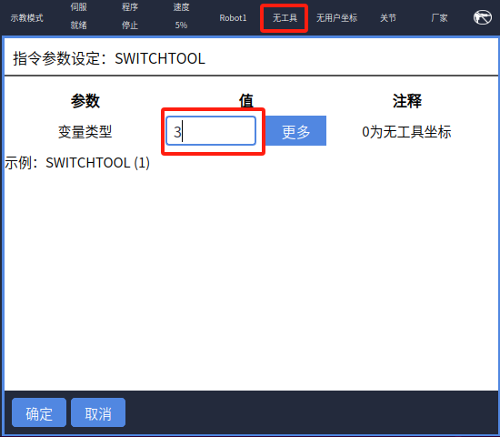

示例：

1.  NOP

2.  SET GI001 = 3

3.  SWITCHTOOL (GI001)

4.  END

示例说明：在执行指令时示教器界面状态栏的工具手编号会切换到指令中设置的工具手编号3。

#### SWITCHUSER-切换用户坐标

格式：SWITCHUSER 【指令名】(1)【切换的用户坐标编号】。

功能：切换对应用户编号的参数。

参数：

<table border="1" style="border-collapse: collapse;">
<tr><td style="text-align: center; vertical-align: middle;">变量类型</td><td style="vertical-align: middle;">手填、变量形式（INT、GINT）范围\[1,999\]</td></tr>
</table>

注意事项：切换用户坐标后检查机器人点位用户和实际用户是否一致，否则会导致程序运行出错。

如图所示：当前点位为无用户坐标，切换用户指令选择的编号是1。

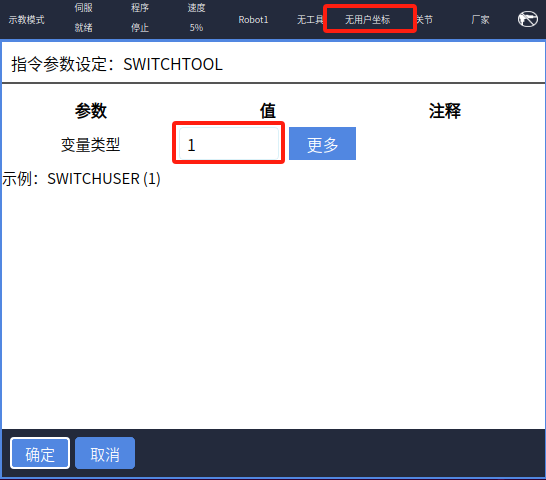

示例：

1.  NOP

2.  SET I010 = 1

3.  SWITCHUSER (I010)

4.  END

示例说明：在执行指令时示教器界面状态栏的用户编号会切换到指令中设置的用户编号2。

#### USERCOORD_TRANS-用户坐标转换

格式：USERCOORD_TRANS【指令名】1【用户坐标A的序号】2【用户坐标B的序号】3【用户坐标C的序号】。

功能:用户A与用户B叠加，计算出用户C。

例如：在传送带和相机结合使用的场景下，托盘是用户A,相机拍摄得出的工件坐标相对于托盘是用户B，最后计算出工件相对于机器人的用户C。

参数:

<table border="1" style="border-collapse: collapse;">
<tr><td style="text-align: center; vertical-align: middle;">用户坐标C</td><td style="vertical-align: middle;">用户A和用户B叠加计算出来的用户坐标C，将计算出来的参数存入选择的用户序号</td></tr>
<tr><td style="text-align: center; vertical-align: middle;">用户坐标A</td><td style="vertical-align: middle;">存入用户坐标A的序号</td></tr>
<tr><td style="text-align: center; vertical-align: middle;">用户坐标B</td><td style="vertical-align: middle;">存入用户坐标B的序号</td></tr>
</table>

示例：

1.  NOP

2.  USERCOORD_TRANS (1)(2)(3)

3.  END

示例说明：用户坐标1和用户坐标2计算出用户坐标3。

#### SWITCHSYNC-切换外部轴

格式：SWITCHSYNC【指令名】1、2、3【外部轴组号1、外部轴组号2、外部轴组号3】。

功能：通过设置外部轴组号来切换外部轴类型。

参数：

<table border="1" style="border-collapse: collapse;">
<tr><td style="text-align: center; vertical-align: middle;">外部轴组号</td><td style="vertical-align: middle;">切换外部轴的组号，范围[0,3]  例如：设置的外部轴组1是旋转单轴，外部轴组2是旋转双轴，如果在切换外部轴参数设置界面外部轴组号是2，运行指令外部轴会切换到旋转双轴</td></tr>

</table>
示例：在机器人配置界面，设置的外部轴组1是旋转单轴，外部轴组2是旋转双轴，外部轴组3是直线单轴。

1.  NOP

2.  TIMER T=1

3.  SWITCHSYNC 1

4.  MOVLEXT E0003 V = 50 mm/s PL = 0 ACC = 1 DEC = 1 SYNC = 1 0

5.  MOVLEXT E0004 V = 50 mm/s PL = 0 ACC = 1 DEC = 1 SYNC = 1 0

6.  END

示例说明：程序在运行第3行时切换到外部轴组1（旋转单轴），然后机器人在旋转单轴上面走直线轨迹。

### 网络通讯类

#### SENDMSG-发送数据

格式：SENDMSG【指令名】ID=1【工艺号序号】#DATA#【发送的数据】。

功能：向个网络设备发送字符串信息或者变量值。

参数：
<table border="1" style="border-collapse: collapse;">
<tr><td style="text-align: center; vertical-align: middle;">ID</td><td style="vertical-align: middle;">TCP通讯时连接的工艺号</td></tr>
<tr><td style="vertical-align: center;">发送字符</td><td style="vertical-align: top;">给连接的网络设备发送数据。可以发送字符串格式数据、发送变量值。  若要发送变量需要在目标变量前面加\$符号，例如：SENDMSG ID =1#\$D001#，如果选择的目标变量D001本身就有值，在执行发送字符数据指令时网络端收到的是变量值，如果目标变量D001本身没有值，在执行发送字符数据指令时网络端收到的数值是0</td></tr>
</table>
示例：

1.  NOP

2.  OPENMSG ID= 1

3.  SET D001 = 12.23

4.  SENDMSG ID = 1 #\$D001#

5.  CLOSEMSG ID = 1

6.  END

示例说明：TCP通讯成功后，发送数据D001的变量值。

#### PARSEMSG-解析数据

格式：PARSEMSG【指令名】ID=1【工艺号序号】I001【数据存放的首变量】CLEARCACHE=0【是否清除缓存，"0"不清除，"1"清除】0【提取数据的数量"0"不记录，"1"记录】。

功能：该指令用来解析外部设备传来的一组数据，并将数据存入多个变量。

参数：
<table border="1" style="border-collapse: collapse;">
<tr><td style="text-align: center; vertical-align: middle;">ID</td><td style="vertical-align: middle;">TCP通讯时连接的工艺号</td></tr>

<tr><td style="vertical-align: top;">数据存放的首个变量</td><td style="vertical-align: top;">将查询到的数据存放在变量，存放的变量类型：整型、浮点型、字符串型  例如：TCP接收到多位数值A、B、C，设置的第一位变量名为GI001，则将A存入GI001，B存入GI002，C存入GI003。</td></tr>

<tr><td style="vertical-align: center;">解析后清除缓存区</td><td style="vertical-align: top;">否：解析后不会清除缓存，在外部设备没有发送新的数据时解析所得到的数据一直为缓存中的值，外部设备重新发送数据后能解析到新的数据  是：解析后会清除缓存，在外部设备没有发送新的数据时解析得不到数据，外部设备重新发送数据后能解析到新的数据例如：外部设备发送数据：@,12,23,34,！存入的首变量位GI001,则GI001=12,GI002=23,GI003=34  
解析后清除缓存区：  
否：例如我们通过赋值指令将GI001赋值为10，然后再运行解析数据，在外部设备没有发送新数据时，仍会解析缓存中的数据12并赋值给GI001，最后显示GI001=12  
是：例如我们通过赋值指令将GI001赋值为10，然后再运行解析数据，在外部设备没有发送新数据时，缓存没有数据无法解析并给GI001赋值，最后显示GI001=10</td></tr>
<tr><td style="vertical-align: center;">数据存放数</td><td style="vertical-align: top;">记录发送数据的数量  变量：发送的数据数量存入到选择的变量，例如：TCP接收到3位数值，数据存放变量GI001,执行解析指令GI001=3  变量：发送的数据数量存入到选择的变量，例如：TCP接收到3位数值，数据存放变量GI001,执行解析指令GI001=3  
不使用：不记录发送的数据个数，选择不使用时，输入框置灰。</td></tr>
</table>
示例：

1.  NOP

2.  OPENMSG ID= 1

3.  PARSEMSG ID = 1 I001 CLEARCACHE = 0 GI001

4.  CLOSEMSG ID = 1

5.  END

示例说明：网络通讯成功后，运行解析指令，外部设备发送的数据存入首变量I001，按照发送个数依次顺延，数据个数存入变量GI001。

#### READCOMM-读取数据

格式：READCOMM【指令名】ID=1【工艺号序号】ETHERENT、MODBUS【通讯方式】P001【点位存放变量】I001【点位存放个数】。

功能：读取通过以太网或Modbus通讯发送点位，并将点位存入到变量。

参数：

<table border="1" style="border-collapse: collapse;">
<tr><td style="text-align: center; vertical-align: middle;">工艺号</td><td style="vertical-align: middle;">TCP通讯时连接的工艺号</td></tr>
<tr><td style="text-align: center; vertical-align: middle;">通讯方式</td><td style="vertical-align: middle;">以太网通讯、Modbus通讯</td></tr>
<tr><td style="text-align: center; vertical-align: middle;">点位存放首个变量</td><td style="vertical-align: middle;">将发送的点位存入到选则的位置变量（P、GP）</td></tr>
<tr><td style="text-align: center; vertical-align: middle;">点位存放数</td><td style="vertical-align: middle;">用变量（INT/GINT）记录发送的点位个数</td></tr>
</table>

注意事项：在选择不同的通讯方式发送点位时需要注意格式，否则点位数据无法写入到变量。

1.  ETHERENT通讯：在发送点位时可以参考《inexbot读取指令ETHERENT点位通讯协议》。

2.  Modbus通讯：点位的设置可以参考手册《网络通讯功能使用手册》通讯方式部分。

示例：

1.  NOP

2.  OPENMSG ID= 1

3.  READCOMM ID = 1 ETHERENT TO GP001 IOO1

4.  CLOSEMSG ID = 1

5.  END

示例说明：根据《inexbot读取指令ETHERENT点位通讯协议》发送点位，网络通讯成功后，读取点位指令，会将发送的点位数据保存到变量GP0001,点位个数存到变量I001。

#### OPENMSG-打开数据

格式：OPENMSG【指令名】ID = 1【工艺号序号】。

功能：打开网络通讯

参数：

  ----------------------------------------
  ID：TCP通讯时连接的工艺号，范围\[1,9\]

  ----------------------------------------

示例：

1.  NOP

2.  OPENMSG ID= 1

3.  SENDMSG ID = 1 #TEST#

4.  CLOSEMSG ID = 1

5.  END

示例说明：执行打开数据指令，控制器与外部设备通讯成功后就可以收发数据。

#### CLOSEMSG-关闭数据

格式：CLOSEMSG【指令名】ID = 1【工艺号序号】。

功能：关闭网络通讯。

参数：

  ----------------------------------------
  ID：TCP通讯关闭时的工艺号，范围\[1,9\]

  ----------------------------------------

示例：

1.  NOP

2.  OPENMSG ID= 1

3.  SENDMSG ID = 1 #TEST#

4.  CLOSEMSG ID = 1

5.  END

示例说明：执行关闭数据指令，控制器与外部设备通讯断开。

#### PRINTMSG-输出信息

格式：PRINTMSG【指令名】0，1，2【类型消息，警告，报错】#输入内容#【输出的字符】。

功能：通过打印提示条的方式输出定义的信息内容。

参数:
<table border="1" style="border-collapse: collapse;">
<tr><td style="text-align: center; vertical-align: middle;">类型</td><td style="vertical-align: middle;">消息：执行指令时示教器界面打印白条提示  警告：执行指令时示教器界面打印黄条的警告提示  错误：执行指令时示教器界面打印红条的错误提示，且伺服下电</td></tr>
<tr><td style="vertical-align: top;">输出字符</td><td style="vertical-align: top;">打印提示条时示教器界面显示的内容，若要打印变量，则在变量前加入\$，例如\$GD001,输入变量在执行指令时，提示条打印的是变量的值</td></tr>
</table>
示例：

1.  NOP

2.  PRINTMSG 0 #这是一个消息#

3.  PRINTMSG 1 #这是一个警告#

4.  PRINTMSG 2 #这是一个报错#

5.  END

示例说明：执行指令，示教器界面分别打印白色消息提示，黄色警告提示，红色报错提示。

#### MSG_CONNECTION_ST-获取信息连接状态

格式：MSG_CONNECTION_STATUS【指令名】1【工艺号序号】GB001【当前连接状态"0"未连接，"1"已连接】。

功能：获取网络设置里某个工艺号的连接状态。

参数：

<table border="1" style="border-collapse: collapse;">
<tr><td style="text-align: center; vertical-align: middle;">工艺号</td><td style="vertical-align: middle;">TCP通讯设置界面选择的工艺号，</td></tr>
<tr><td style="text-align: center; vertical-align: middle;">状态存入变量名</td><td style="vertical-align: middle;">当前连接的工艺号的状态用变量（BOOL,GBOOL）表示</td></tr>
</table>

示例：

1.  NOP

2.  OPENMSG ID= 1

3.  MSG_CONNECTION_ST I GB001

4.  CLOSEMSG ID = 1

5.  END

示例说明：执行打开数据指令，控制器与外部设备通讯成功的话GB001=1,如果通讯失败的话GB001=0。

### 焊接控制类

焊接控制类共有\'焊接开始、焊接结束、焊接设置、摆焊开始、摆焊结束、摆焊设置、相贯线、鱼鳞焊开始、鱼鳞焊结束、送丝、焊机内置工艺、摆焊参考点、点焊"等13项指令，如下图所示：

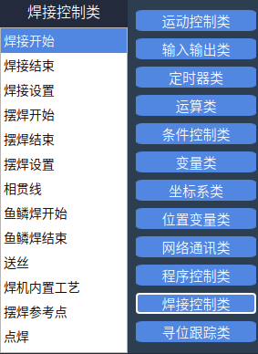

#### RCON指令-焊接开始

<table border="1" style="border-collapse: collapse;">
<tr><td style="text-align: center; vertical-align: middle;" colspan="3">ARCON指令-焊接开始</td></tr>
<tr><td style="vertical-align: middle;" colspan="3">功能：该指令可以执行起弧操作</td></tr>
<tr><td style="vertical-align: middle;" colspan="3">参数界面</td></tr>
<tr><td style="vertical-align: top;" colspan="3">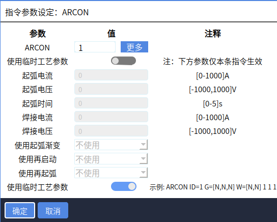</td></tr>
<tr><td style="vertical-align: top;">参数</td><td style="vertical-align: top;">值</td><td style="vertical-align: top;">注释</td></tr>
<tr><td style="vertical-align: center;">ARCON</td><td style="vertical-align:  center;">1-99或绑定变量</td><td style="vertical-align: center;">焊接工艺支持99个文件标号  使用绑定变量时变量名需与焊接结束保持一致</td></tr>
<tr><td style="vertical-align: center;">使用临时工艺参数</td><td style="vertical-align: center;">1.打开使用临时工艺参数开关，焊接开始时的电流电压值会根据你设置的临时工艺参数来进行焊接操作  例如：在弧焊-焊接参数界面设置的起弧电流是50A，如果在焊接开始指令参数界面打开了使用临时工艺参数开关，设置的起弧电流是60A,那么在执行焊接操作时起弧电流是60A  
2.打开使用临时工艺参数开关，修改的参数值会有黄颜色的填充提示。如下图：  3.不打开使用临时工艺参数开关，进行焊接操作时的电流电压值是在弧焊-焊接参数界面设置的电流电压值</td><td style="vertical-align:  center;">打开使用临时工艺参数开关，下面的参数才会生效，如下图: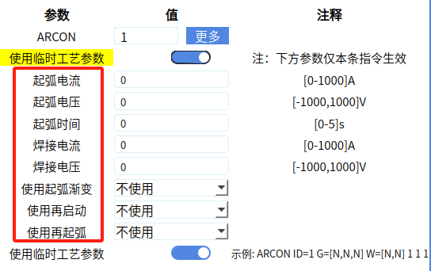</td></tr>
</table>
 

#### ARCOFF指令-焊接结束

<table border="1" style="border-collapse: collapse;">
<tr><td style="text-align: center; vertical-align: middle;" colspan="3">ARCOFF指令-焊接结束</td></tr>
<tr><td style="vertical-align: middle;" colspan="3">功能：执行灭弧操作，选择与焊接开始对应的工艺号</td></tr>
<tr><td style="vertical-align: middle;" colspan="3">参数界面</td></tr>
<tr><td style="vertical-align: top;" colspan="3">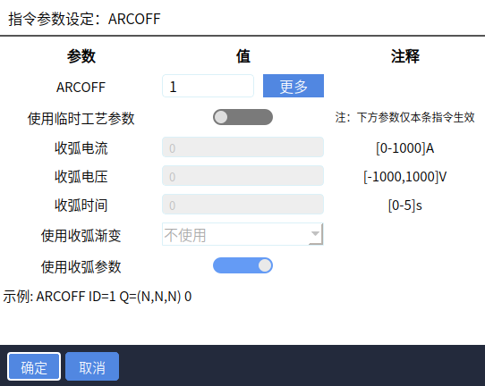</td></tr>
<tr><td style="vertical-align: center;">参数</td><td style="vertical-align: center;">值</td><td style="vertical-align: center;">参数范围</td></tr>
<tr><td style="vertical-align: center;">ARCOFF</td><td style="vertical-align:  center;">1-99或绑定变量</td><td style="vertical-align: center;">焊接工艺支持99个文件标号  使用绑定变量时变量名需与焊接结束保持一致</td></tr>
<tr><td style="vertical-align: center;">使用临时工艺参数</td><td style="vertical-align: center;">1 打开使用临时工艺参数开关，焊接开始时的电流电压值会根据你设置的临时工艺参数来进行焊接操作  
例如：在弧焊-焊接参数界面设置的收弧电流是50A，如果在焊接结束指令参数界面打开了使用临时工艺参数开关，设置的收弧电流是60A,那么在执行焊接操作时收弧电流是60A  
2 打开使用临时工艺参数开关，修改的参数值会有黄颜色的填充提示  
3 不打开使用临时工艺参数开关，进行焊接操作时的电流电压值是自己在焊接工艺-焊接参数界面设置的电流电压值</td><td style="vertical-align:  center;">打开使用临时工艺参数开关，下面的参数才会生效，如下图:</td></tr>
</table>

 

#### ARCSET指令-焊接设置
<table border="1" style="border-collapse: collapse;">
<tr><td style="text-align: center; vertical-align: middle;" colspan="3">ARCSET指令-焊接设置</td></tr>
<tr><td style="vertical-align: middle;" colspan="3">功能：该指令可以设置焊接时的电流电压  
例如：在弧焊-焊接参数界面设置了焊接电流50A，电压15V，  
在焊接设置指令参数界面设置了焊接电流45A，电压20V  
如果在焊接开始指令后面插入焊接设置指令，焊接时的电流电压值是在焊接设置指令界面所填的参数值</td></tr>
<tr><td style="vertical-align: middle;" colspan="3">参数界面</td></tr>
<tr><td style="vertical-align: top;" colspan="3">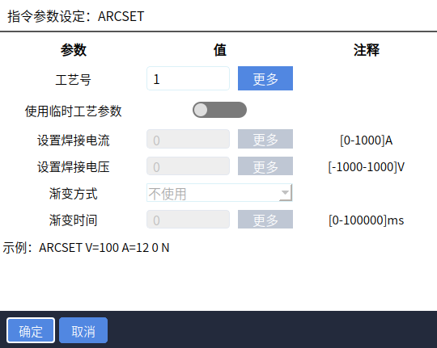</td></tr>
<tr><td style="vertical-align:center;">参数</td><td style="vertical-align: top;">值</td><td style="vertical-align: center;">参数范围</td></tr>
<tr><td style="vertical-align: center;">工艺号</td><td style="vertical-align:  center;">1-99或绑定变量</td><td style="vertical-align: center;">1-99或绑定变量</td></tr>
<tr><td style="vertical-align: center;">使用临时工艺参数</td><td style="vertical-align: center;">1.打开使用临时工艺参数开关，焊接开始时的电流电压值会根据你设置的临时工艺参数来进行焊接操作  例如：在弧焊-焊接参数界面设置的起弧电流是50A，如果在焊接开始指令参数界面打开了使用临时工艺参数开关，设置的起弧电流是60A,那么在执行焊接操作时起弧电流是60A  
2.打开使用临时工艺参数开关，修改的参数值会有黄颜色的填充提示。如下图：  3.不打开使用临时工艺参数开关，进行焊接操作时的电流电压值是在弧焊-焊接参数界面设置的电流电压值</td><td style="vertical-align:  center;">打开使用临时工艺参数开关，下面的参数才会生效，如下图:</td></tr>
<tr><td style="vertical-align:center;">设置焊接电流</td><td style="vertical-align: center;">填写焊接操作时的焊接电流值</td><td style="vertical-align: center;">[0-1000]A</td></tr>
<tr><td style="vertical-align:center;">设置焊接电压</td><td style="vertical-align: center;">填写焊接操作时的焊接电压值</td><td style="vertical-align: center;">[-1000-1000]V</td></tr>
<tr><td style="vertical-align:center;">渐变方式</td><td style="vertical-align: center;">1 时间渐变 
2 不使用</td><td style="vertical-align: center;"></td></tr>
<tr><td style="vertical-align:center;">渐变时间</td><td style="vertical-align: center;">当前的电流电压值渐变到焊接设置指令的电流电压</td><td style="vertical-align: center;">[0-100000]ms</td></tr>
</table>
 

#### WVON指令-摆焊开始

<table border="1" style="border-collapse: collapse;">
<tr><td style="text-align: center; vertical-align: middle;" colspan="3">WVON指令-摆焊开始</td></tr>
<tr><td style="text-align: top; vertical-align: middle;" colspan="3">功能：该指令执行时开始摆焊，执行该指令前请先运行焊接开始ARCON指令。</td></tr>
<tr><td style="vertical-align: middle;" colspan="3">参数界面</td></tr>
<tr><td style="vertical-align: top;" colspan="3">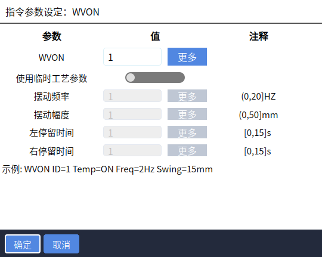</td></tr>
<tr><td style="vertical-align:center;">参数</td><td style="vertical-align: top;">数值</td><td style="vertical-align: center;">注释</td></tr>
<tr><td style="vertical-align: center;">工艺号</td><td style="vertical-align:  center;">1-9或绑定变量</td><td style="vertical-align: center;">摆焊时可以选择不同的文件标号。 
例如：在弧焊-摆焊参数界面，选择的摆焊文件是1，摆焊方式是正弦摆.</td></tr>
<tr><td style="vertical-align: center;">使用临时工艺参数</td><td style="vertical-align: center;">1.打开使用临时工艺参数开关，摆焊开始时的摆动频率和摆动幅度会根据你设置的临时工艺参数来进行焊接操作  
例如：在弧焊-摆焊参数界面设置的摆动频率是3Hz，如果在摆焊开始指令参数界面打开了使用临时工艺参数开关，设置的摆动频率是1Hz,那么在执行焊接操作时摆动频率是1Hz  
打开使用临时工艺参数开关，修改的参数值
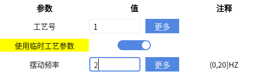  
不打开使用临时工艺参数开关，进行摆焊操作时的摆动频率和幅度值是自己在焊接工艺-摆焊参数界面设置的值</td><td style="vertical-align:  center;">打开使用临时工艺参数开关，下面的参数才会生效，如下图: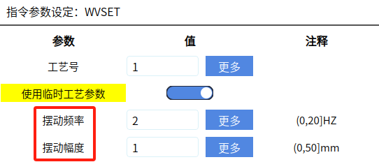</td></tr>
<tr><td style="vertical-align:center;">摆动频率</td><td style="vertical-align: center;">（0-20}值或绑定变量</td><td style="vertical-align: center;"></td></tr>
<tr><td style="vertical-align:center;">摆动幅度</td><td style="vertical-align: center;">（0-20}值或绑定变量</td><td style="vertical-align: center;"></td></tr>
</table>
 

#### WVOFF指令-摆焊结束
<table border="1" style="border-collapse: collapse;">
<tr><td style="text-align: center; vertical-align: middle;" colspan="3">WVOFF指令-摆焊结束</td></tr>
<tr><td style="text-align: top; vertical-align: middle;" colspan="3">功能：该指令执行时结束摆焊。</td></tr>
<tr><td style="vertical-align: top;" colspan="3">参数界面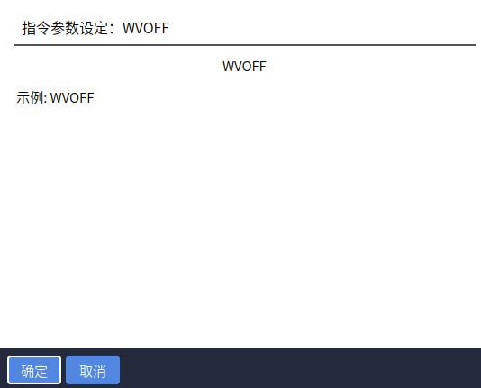</td></tr>
、<tr><td style="vertical-align: top;" colspan="3">使用方法：如图一所示执行摆焊结束指令，机器人结束摆焊  
注：需要在摆焊开始前插入焊接开始指令，摆焊结束指令后插入焊接结束指令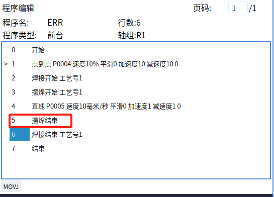</td></tr>
</table>
 

#### WVSET指令-摆焊设置
<table border="1" style="border-collapse: collapse;">
<tr><td style="text-align: center; vertical-align: middle;" colspan="3">WVSET指令-摆焊设置</td></tr>
<tr><td style="vertical-align: middle;" colspan="3">功能：该指令可以设置摆焊的摆动频率和幅度  
例如：在弧焊-摆焊参数界面设置了摆焊频率5，幅度5，  
在摆焊设置指令参数界面设置了摆焊频率0，幅度0  
如果在摆焊开始指令后面插入摆焊设置指令，摆焊时的频率和幅度是在摆焊设置指令界面所填的参数值</td></tr>
<tr><td style="vertical-align: top;" colspan="3">参数界面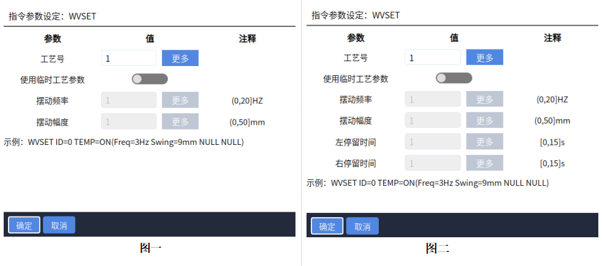图一摆焊设置适用于摆焊方式为”正弦摆、圆形摆、8字摆“等三种情况 
图二摆焊设置适用于摆焊方式为”三角摆 、L形摆、外部轴定点摆、Z字摆“等四种情况 
摆焊方式的设置再”弧焊-摆焊方式“页面中</td></tr>
<tr><td style="vertical-align:center;">参数</td><td style="vertical-align: top;">值</td><td style="vertical-align: center;">参数范围</td></tr>
<tr><td style="vertical-align: center;">工艺号</td><td style="vertical-align:  center;">1-99或绑定变量</td><td style="vertical-align: center;">1-99或绑定变量</td></tr>
<tr><td style="vertical-align: center;">使用临时工艺参数</td><td style="vertical-align: center;">1 打开使用临时工艺参数开关，摆焊开始时的频率和幅度值会根据你设置的临时工艺参数来进行摆焊操作  
例如：在弧焊-摆焊参数界面设置的摆动频率是1，如果在摆焊结束指令参数界面打开了使用临时工艺参数开关，设置的摆动频率是2HZ,那么在执行摆焊的摆动频率就是2HZ  
2 打开使用临时工艺参数开关，修改的参数值如下图：  
3 不打开使用临时工艺参数开关，进行摆焊操作时的摆动频率和摆动幅度值是自己在弧焊-摆焊参数界面设置的摆动频率和摆动幅度值</td><td style="vertical-align:  center;">打开使用临时工艺参数开关，下面的参数才会生效，如下图:</td></tr>
<tr><td style="vertical-align:center;">摆动频率</td><td style="vertical-align: center;">填写摆焊操作时的摆动频率值</td><td style="vertical-align: center;">(0-20]HZ</td></tr>
<tr><td style="vertical-align:center;">摆动幅度</td><td style="vertical-align: center;">填写摆焊操作时的摆动幅度值</td><td style="vertical-align: center;">(0-50]mm</td></tr>
</table>
 

#### CIL指令-相贯线
<table border="1" style="border-collapse: collapse;">
<tr><td style="text-align: center; vertical-align: middle;" colspan="3">CIL指令-相贯线</td></tr>
<tr><td style="text-align: top; vertical-align: middle;" colspan="3">参数界面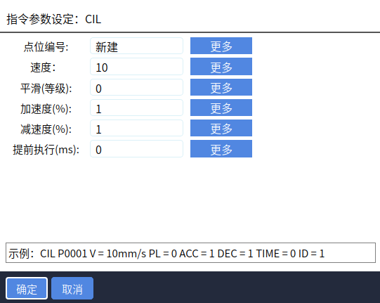</td></tr>
<tr><td style="vertical-align:center;">参数名</td><td style="vertical-align: top;">参数来源</td><td style="vertical-align: center;">注释</td></tr>
<tr><td style="vertical-align:center;">点位：选择局部位置变量/全局位置变量/绑定变量。当值为“新建”时，插入该指令则新建一个P变量，并将机器人的当前位置记录到该P变量  V：速度，单位mm/s  
PL:平滑等级
例如：新建P001和P002两个点位，走一段直线轨迹，设置了平滑参数的话两个点之间衔接度就好  
ACC:加速度，单位百分比  
DEC:减速度，单位百分比  
TIME:提前执行时间，单位ms  
ID:相贯线工艺号</td><td style="vertical-align: center;">P;GP;P[];CP[]  这些参数都可以绑定变量
如图所示：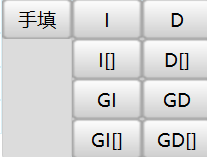</td><td style="vertical-align: center;">新建的位置变量  表示参数的范围和单位</td></tr>
</table>
 

#### FSWELDON指令-鱼鳞焊开始

说明：鱼鳞焊暂不支持外部轴圆弧指令
<table border="1" style="border-collapse: collapse;">
<tr><td style="text-align: center; vertical-align: middle;" colspan="3">FSWELDON指令-鱼鳞焊开始</td></tr>
<tr><td style="vertical-align: middle;" colspan="3">功能：执行该指令开始鱼鳞焊轨迹，执行该指令前请先运行焊接开始ARCON指令</td></tr>
<tr><td style="vertical-align: top;" colspan="3">参数界面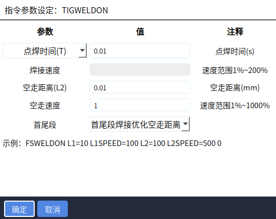</td></tr>
<tr><td style="vertical-align: top;" colspan="3">鱼鳞焊图片</td></tr>
<tr><td style="vertical-align: center;">参数</td><td style="vertical-align: center;">值</td><td style="vertical-align: center;">注释</td></tr>
<tr><td style="vertical-align: center;">点焊时间T 焊接距离L1 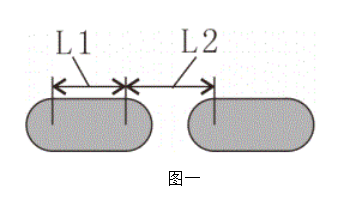 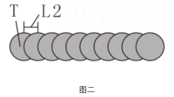</td><td style="vertical-align: center;">图一为设置焊接距离和空走距离参数时的示例图  
焊接距离： 
机器人在移动过程中持续进行焊接。例如：设置的焊接距离是5mm，如图一表示L1的距离是5mm
L2表示空走距离  
点焊时间： 
在设置的时间内机器人不移动，保持持续焊接  
T 表示点焊时间  
L2 空走距离</td><td style="vertical-align: center;">选择L1时表示焊接距离mm  选择T时表示点焊时间s</td></tr>
<tr><td style="vertical-align: center;">空走距离L2</td><td style="vertical-align: center;">填入空走的距离参数。例如：填写的距离是5mm,那如图一所示，L2的距离是5mm</td><td style="vertical-align: top;">填入空走的距离参数,单位mm</td></tr>
<tr><td style="vertical-align: center;"></td><td style="vertical-align: center;">选择首尾段类型：  
1.首尾段焊接优化空走距离：指焊接轨迹首尾固定为焊接，焊接距离为固定的设置距离，空走距离则是系统优化后的距离（不固定） 
2.首尾段空走优化空走距离：指焊接轨迹首尾固定为空走，焊接距离为固定的设置距离，空走距离则是系统优化后的距离（不固定） 
3.首段焊接：指焊接轨迹首段固定为焊接，整条轨迹焊接距离以及空走距离都为设置的固定距离 
4.首段空走：指焊接轨迹首段固定为空走，整条轨迹焊接距离以及空走距离都为设置的固定距离</td></tr>
</table>
 

#### FSWELDOFF指令-鱼鳞焊结束
<table border="1" style="border-collapse: collapse;">
<tr><td style="text-align: center; vertical-align: middle;" colspan="3">FSWELDOFF指令-鱼鳞焊结束</td></tr>
<tr><td style="vertical-align: top;">功能：执行该指令结束鱼鳞焊轨迹。</td></tr>
<tr><td style="vertical-align: top;">参数界面： 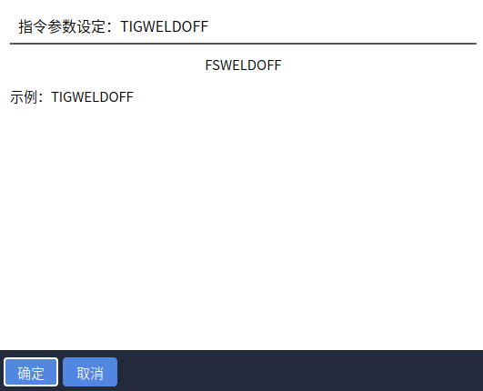</td></tr>
</table>
 

#### FEEDWIRE指令-送丝
<table border="1" style="border-collapse: collapse;">
<tr><td style="text-align: center; vertical-align: middle;" colspan="3">FEEDWIRE指令-送丝</td></tr>
<tr><td style="vertical-align: top;" colspan="3">功能：在焊接开始或者焊接结束后在设置的时间内送丝，然后到达指定的位置将焊丝剪掉，为了焊接时的焊丝均匀</td></tr>
<tr><td style="vertical-align: top;" colspan="3">参数界面： 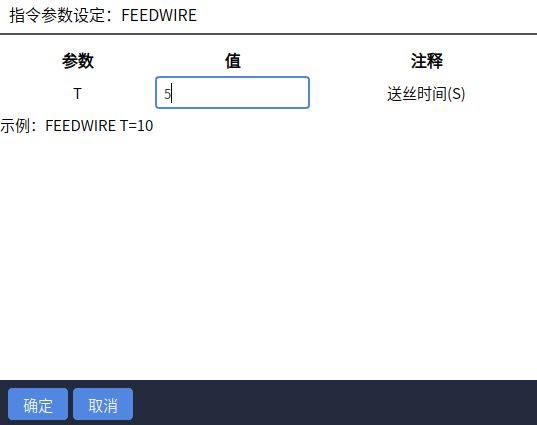</td></tr>
<tr><td style="vertical-align: center;">参数</td><td style="vertical-align: center;">值</td><td style="vertical-align: center;">注释</td></tr>
<tr><td style="vertical-align: center;">T</td><td style="vertical-align: center;">代表送丝时间</td><td style="vertical-align: center;">送丝时间，单位s</td></tr>
</table>
 

#### ARCBUILTIN指令-焊机内置工艺
<table border="1" style="border-collapse: collapse;">
<tr><td style="text-align: center; vertical-align: middle;" colspan="3">ARCBUILTIN指令-焊机内置工艺</td></tr>
<tr><td style="vertical-align: top;" colspan="3">指令界面 
该指令目前可配合奥太焊机使用 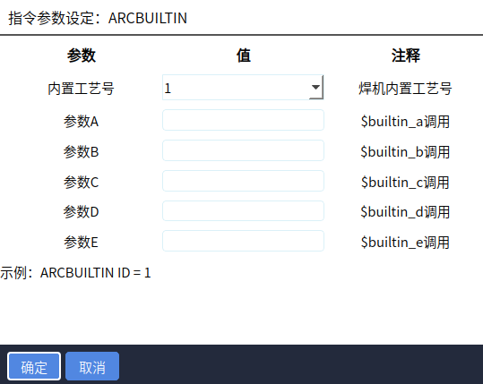</td></tr>
<tr><td style="vertical-align: top;">参数</td><td style="vertical-align: top;">值</td><td style="vertical-align: top;">注释</td></tr>
<tr><td style="vertical-align: top;">内置工艺号</td><td style="vertical-align: top;">1-9</td><td style="vertical-align: top;">焊机内置工艺号</td></tr>
<tr><td style="vertical-align: top;">参数A</td><td style="vertical-align: top;">&nbsp;</td><td style="vertical-align: top;">\$builtin_a调用</td></tr>
<tr><td style="vertical-align: top;">参数B</td><td style="vertical-align: top;">&nbsp;</td><td style="vertical-align: top;">\$builtin_b调用</td></tr>
<tr><td style="vertical-align: top;">参数C</td><td style="vertical-align: top;">&nbsp;</td><td style="vertical-align: top;">\$builtin_c调用</td></tr>
<tr><td style="vertical-align: top;">参数D</td><td style="vertical-align: top;">&nbsp;</td><td style="vertical-align: top;">\$builtin_d调用</td></tr>
<tr><td style="vertical-align: top;">参数E</td><td style="vertical-align: top;">&nbsp;</td><td style="vertical-align: top;">\$builtin_e调用</td></tr>
</table>
 

#### REFP指令-摆焊参考点 
<table border="1" style="border-collapse: collapse;">
<tr><td style="text-align: center; vertical-align: middle;" colspan="3">REFP指令-摆焊参考点</td></tr>
<tr><td style="vertical-align: top;" colspan="3">指令界面 
该指令目前可配合奥太焊机使用 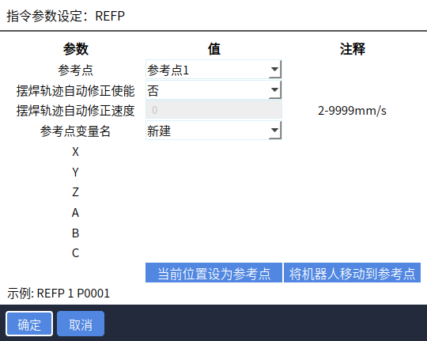</td></tr>
<tr><td style="vertical-align: top;">参数</td><td style="vertical-align: top;">参考点（直角）</td><td style="vertical-align: top;">备注</td></tr>
<tr><td style="vertical-align: top;">参考点</td><td style="vertical-align: top;">红色轨迹表示通过确定摆焊方向进行摆焊的轨迹  只选择参考点1/参考点2  参考点1和参考点2都选则 </td><td style="vertical-align: top;">&nbsp;</td></tr>
<tr><td style="vertical-align: center;">摆焊轨迹自动修正使能&nbsp;</td><td style="vertical-align: center;">是/否&nbsp;</td><td style="vertical-align: center;">计算并自动运行到修正轨迹起始点&nbsp;</td></tr>
<tr><td style="vertical-align: center;">摆焊轨迹自动修正速度&nbsp;</td><td style="vertical-align: top;">打开自动修正使能后会将焊道的起始点偏移至两参考点中间  
绿色轨迹表示通过修正摆焊起始点后，摆焊的轨迹和方向 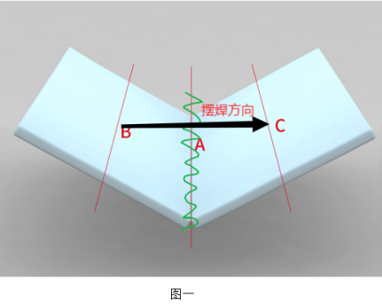 例如：如图所示，B为参考点1，C为参考点2，打开自动修正使能后焊道的起始点为两参考点距离的中心点</td><td style="vertical-align: center;">速度范围2-9999mm/s&nbsp;</td></tr>
</table>
 

#### SPOTWELD指令-点焊
<table border="1" style="border-collapse: collapse;">
<tr><td style="text-align: center; vertical-align: middle;" colspan="3">SPOTWELD指令-点焊</td></tr>
<tr><td style="vertical-align: top;" colspan="3">该指令执行时机器人开始执行点焊操作。</td></tr>
<tr><td style="vertical-align: top;" colspan="3">指令界面 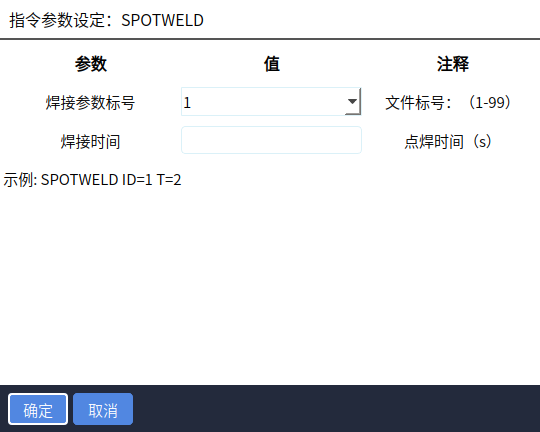</td></tr>
<tr><td style="vertical-align: top;">参数</td><td style="vertical-align: center;">值</td><td style="vertical-align: center;">注释</td></tr>
<tr><td style="vertical-align: top;">焊接参数标号</td><td style="vertical-align: center;">1-99</td><td style="vertical-align: center;">点焊时所使用的焊接参数工艺号（1-99）</td></tr>
<tr><td style="vertical-align: top;">焊接时间</td><td style="vertical-align: top;">例如:点焊时间设置2秒，表示机器人在2秒内持续焊接，</td><td style="vertical-align: top;">在设置的时间内机器人不移动，保持持续焊接,单位（S）</td></tr>
<tr><td style="vertical-align: center;">使用方法</td><td style="vertical-align: top;"colspan="2">设置焊接信号，电流电压匹配参数，焊接装备参数 在弧焊-手动操作界面设置点焊的电流，电压，时间参数  
设置好所需要的参数后，在手动操作界面或者焊接工艺的状态界面点击点焊使能按钮会发现设置的起弧，送气信号端口会打开（因为测试时未连焊机所以送丝，退丝信号端口没有反应）</td></tr>
</table>
 

#### 焊接工艺使用案例

正常起弧焊接

参数设置

所有参数数值设置无具体意义，仅用作示例说明
进入"弧焊/焊机设置"，设置焊机控制方式-模拟焊机

进入"弧焊/焊接IO"，数字输入：起弧成功信号1-1，数字输出：起弧信号1-2，模拟输入焊接电流信号DIN1-1，焊接电压信号DIN1-2，模拟输出给定电流信号DOUT1-1，给定电压信号DOUT1-2.

进入"弧焊/电流电压匹配",设置电流第一行焊接电流填【1】，实际焊接电流【10】；设置电压第一行焊接电压填【1】，实际焊接电压填【10】

进入"弧焊/焊接参数设置"，设置起弧参数：起弧电流【8】A起弧电压【8】V起弧时间【2】S；焊接参数：焊接电流【10】A,焊接电压【10】V;收弧电流【7】A，收弧电压【7】V，收弧时间【2】S

进入"弧焊/焊接装备设置"-基础功能：电弧检测时间【2】S，电弧检测确认时间【1】S。

进入"弧焊/手动操作"，打开焊接使能开关，打开手动起弧模式，设置手动点焊电流8A,点焊电压8V，最大时间2S。

程序编写

指令含义

1.  机器人移动到焊接的起始点P001

2.  ARCON#1 焊接开始

设置了 4s 的提前送气时间和 1s
的电弧检测时间，开始起弧，执行焊接参数标号 1

4s
的提前送气时间（焊机提前4秒送气，检测到有气体，气体检测信号端口输出高电平，4s
之后，开始起弧，设置的起弧信号输出口输出高电平）

1s 的电弧检测时间（若 1s
内检测到起弧成功信号。程序继续运行，若检测不到，则会报"等待焊接起弧成功信号超时"错误）

1.  机器人移动到焊接的终点 P002

机器人开始焊接，设置的起弧电压60V，起弧电流 10A，起弧时间 1s， 焊接电压
80V，焊接电流 20A，收弧电压 50V

从P001到P002的移动过程中，如果焊机起弧成功，则焊机会以起弧电流电压值起弧，然后以设置的起弧电流电压值维持1秒（起弧时间）后电流电压到达焊接电流电压值，开始焊接

1.  ARCOFF 焊接结束

在工艺-焊接参数界面设置收弧电压 50V，收弧电流 10A，收弧时间 1

焊接完成后开始收弧，到达收弧电流电压值后维持1秒（收弧时间）然后焊接结束，设置的送气，起弧信号输出端口由高电平1-低电平0

程序编写方法

1.  点击"工程"，点击"新建"，输入程序名称，点击"确定"。

2.  将机器人移动到焊接的起始点，点击"插入"，选择"运动控制类"，选择
    MOVL，点击"确定"，修改速度数值，点击"确定"。

3.  点击"插入"，选择"焊接控制类"，选择
    ARCON，点击"确定"，输入文件编号（文件编号对应焊接参数设置界面中的数值），点击"确定"。

4.  将机器人移动到焊接的终点，点击"插入"，选择"运动控制类"，选择
    MOVL，点击"确定"，修改速度数值，点击"确定"。

5.  点击"插入"，选择"焊接控制类"，选择 ARCOFF，点击"确定"，点击"确定"。

轨迹确认：程序编写好之后，转动旋钮，将示教盒从示教模式切换到运行模式，点击"start"，确认机器人的运行轨迹是否正确，是否符合需要。

焊接：确认运行轨迹正确之后，打开焊接使能
，机器人才会执行焊接功能；

注：程序在运行模式时，按下"stop"，再按下"start"之后，程序重新开始之后，将不再执行焊接功能；

焊接使能打开方式：示教盒切换到示教模式，点击工艺栏-焊接，出现下图：

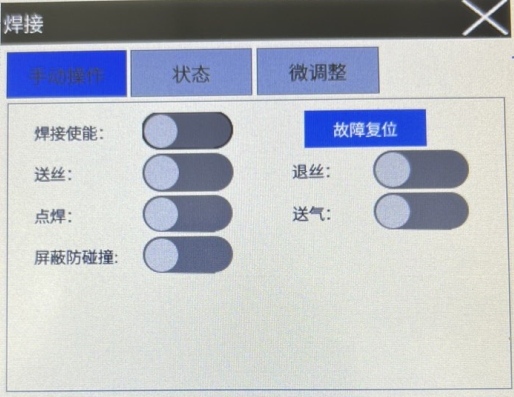

选中"焊接使能"，打开使能，如图所示：

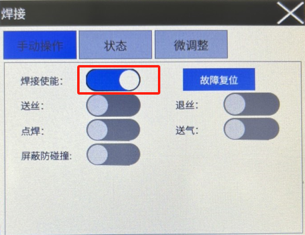

摆焊使用案例

参数设置

1.  进入"弧焊/焊机设置"，设置焊机控制方式-模拟焊机。

2.  进入"弧焊/焊接IO"，数字输入：起弧成功信号1-1，数字输出：起弧信号1-2，模拟输入焊接电流信号DIN1-1，焊接电压信号DIN1-2，模拟输出给定电流信号DOUT1-1，给定电压信号DOUT1-2。

3.  进入"弧焊/电流电压匹配",设置电流第一行焊接电流填【1】，实际焊接电流【10】；设置电压第一行焊接电压填【1】，实际焊接电压填【10】。

4.  进入"弧焊/焊接参数设置"，设置起弧参数：起弧电流【20】A起弧电压【10】起弧时间【1】焊接参数：焊接电流【50】A,焊接电压【20】V;收弧电流【28】A，收弧电压【15】V。

5.  进入"弧焊/焊接装备设置"-基础功能：电弧检测时间【2】S，电弧检测确认时间【1】S。

6.  进入"弧焊/手动操作"，打开焊接使能开关，打开手动起弧模式，设置手动点焊电流8A,点焊电压8V，最大时间2S。

7.  进入"弧焊/焊接工艺/摆焊参数"，设置参数。

程序编写

参考指令见下图二：

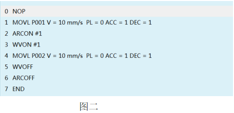

指令含义

1.  机器人移动到P001点（摆焊起始点）；

2.  ARCON#1 焊接开始：

从P001到P002的移动过程中，如果焊机起弧成功，则焊机会以起弧电流电压值起弧，然后以设置的起弧电流电压值维持1秒（起弧时间）后电流电压到达焊接电流电压值，开始焊接。

1.  WVON#1 摆焊开始：

执行摆焊文件 1 中的参数（若为 WVON#2，摆焊开始，执行摆焊文件 2
的参数）；

执行此条指令后根据在弧焊/摆焊参数设置的摆焊参数机器人进行摆焊操作。

1.  P002摆焊的结束点：

P001-P002是需要执行的摆焊轨迹；

摆焊轨迹的幅度，频率，方向/水平竖直偏角根据图一设置进行摆焊。

1.  WVOFF#1 摆焊结束：

机器人完成摆焊接操作。

1.  ARCOFF 焊接结束：

在弧焊-焊接参数界面设置收弧电压 50V，收弧电流 10A，收弧时间 1s；

焊接完成后开始收弧，到达收弧电流电压值后维持1秒（收弧时间）然后焊接结束，设置的送气，起弧信号输出端口由高电平1-低电平0。

程序编写方法

1.  点击"工程"，点击"新建"，输入程序名称，点击"确定"。

2.  将机器人移动到焊接的起始点，点击"插入"，选择"运动控制类"，选择
    MOVL，点击"确定"，修改速度数值，点击"确定"。

3.  点击"插入"，选择"焊接控制类"，选择
    ARCON，点击"确定"，输入文件编号（文件编号对应焊接参数设置界面中的数值），点击"确定"。

4.  点击"插入"，选择"焊接控制类"，选择
    WVON，点击"确定"，输入文件编号，（文件编号对应摆焊参数界面中的数值）。

5.  将机器人移动到焊接的终点，点击"插入"，选择"运动控制类"，选择
    MOVL，点击"确定"，修改速度数值，点击"确定"。

6.  点击"插入"，选择"焊接控制类"，选择 WVOFF，点击"确定"，点击"确定"。

7.  点击"插入"，选择"焊接控制类"，选择 ARCOFF，点击"确定"，点击"确定"。

轨迹确认：程序编写好之后，转动钥匙，将示教盒从示教模式切换到运行模式，点击"start"，确认机器人的运行轨迹是否正确

焊接：确认运行轨迹正确之后，要打开焊接使能，机器人才会执行焊接功能（有关焊接使能的打开方式，在起弧焊接案例中有介绍）。

鱼鳞焊使用案例

参数设置

进入"弧焊/焊机设置"，设置焊机控制方式-模拟焊机。

进入"弧焊/焊接IO"，数字输入：起弧成功信号1-1，数字输出：起弧信号1-2，模拟输入焊接电流信号DIN1-1，焊接电压信号DIN1-2，模拟输出给定电流信号DOUT1-1，给定电压信号DOUT1-2。

进入"弧焊/电流电压匹配",设置电流第一行焊接电流填【1】，实际焊接电流【10】；设置电压第一行焊接电压填【1】，实际焊接电压填【10】。

进入"弧焊/焊接参数设置"，设置起弧参数：起弧电流【20】A起弧电压【10】起弧时间【1】焊接参数：焊接电流【50】A,焊接电压【20】V;收弧电流【28】A，收弧电压【15】V。

进入"弧焊/焊接装备设置"-基础功能：电弧检测时间【2】S，电弧检测确认时间【1】S。

进入"弧焊/手动操作"，打开焊接使能开关，打开手动起弧模式，设置手动点焊电流8A,点焊电压8V，最大时间2S。

进入"弧焊/摆焊参数"，设置参数。

程序编写

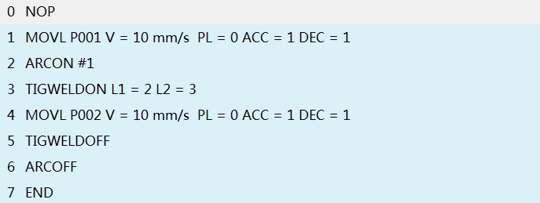

指令含义

1.  P001焊接的起始点；

2.  ARCON#1 焊接开始；

机器人开始焊接，设置的起弧电压60V，起弧电流 10A，起弧时间 1s， 焊接电压
80V，焊接电流 20A，收弧电压 50V；

从P001到P002的移动过程中，如果焊机起弧成功，则焊机会以起弧电流电压值起弧，然后以设置的起弧电流电压值维持1秒（起弧时间）后电流电压到达焊接电流电压值，开始焊接；

1.  FSWELDON T=2 L2=3 (鱼鳞焊开始)。

设置点焊时间和空走距离，如下图：

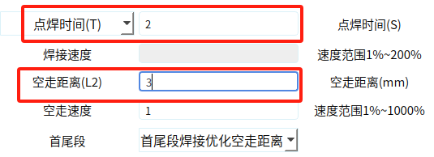

机器人起弧，机器人在 P001 点焊接 2s（即 T=2s），然后机器人灭弧，空走
3mm（即L2=3mm）的距离到 W1 点。

机器人在 W1 点起弧，在 W1 点焊接 2s，灭弧，空走 3mm 到 W2 点。

①起弧 ②焊接 2s ③灭弧 ④空走 3mm，循环前边的 4
个步骤，直至运行到焊接的终点（P002）。

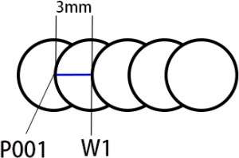

设置焊接距离和空走距离，如下图所示：

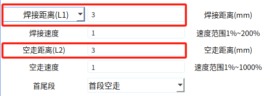

机器人起弧，机器人从 P001 点开始，以焊接的状态运行 L1 的距离到 W1
点（P001 和 W1的距离为 3MM，即焊接距离），然后机器人灭弧，空走 3mm（即
L2=3mm）到 W2 点，机器人在 W2 点起弧，机器人从 W2 运行到W3
点，然后机器人灭弧，空走 3mm到 W4 点，①起弧，②焊接 3MM，③灭弧，④空走
3mm，循环前边的 4 个步骤，直至运行到焊接的终点（P002）；

1.  P002（焊接的结束点）；

2.  FSWELDOFF（鱼鳞焊结束）；

3.  ARCOFF 焊接结束。

在工艺-焊接参数界面设置收弧电压 50V，收弧电流 10A，收弧时间 1。

焊接完成后开始收弧，到达收弧电流电压值后维持1秒（收弧时间）然后焊接结束，设置的送气，起弧信号输出端口由高电平1-低电平0。

程序编写方法

1.  点击"工程"，点击"新建"，输入程序名称，点击"确定"；

2.  将机器人移动到焊接的起始点；

3.  点击"插入"，选择"运动控制类"，选择
    MOVL，点击"确定"，修改速度数值，点击"确定"；

4.  点击"插入"，选择"焊接控制类"，选择
    ARCON，点击"确定"，输入文件编号（文件编号对应焊接参数设置界面中的数值），点击"确定"；

5.  点击"插入"，选择"焊接控制类"，选择
    FSWELDON，点击"确定"，选择鱼鳞焊类型： 选择一：第一行参数选择 T
    //选择二：第一行参数选择 L1,输入相应的数值；

6.  将机器人移动到焊接的终点，点击"插入"，选择"运动控制类"，选择
    MOVL，点击"确定"，修改速度数值，点击"确定"；

7.  点击"插入"，选择"焊接控制类"，选择 FSWELDOFF，点击"确定"，点击"确定"
    点击"插入"，选择"焊接控制类"，选择 ARCOFF，点击"确定"，点击"确定"。

轨迹确认：程序编写好之后，转动钥匙，将示教盒从示教模式切换到运行模式，点击"start"，确认机器人的运行轨迹是否正确。

焊接：确认运行轨迹正确之后，要打开焊接使能，机器人才会执行焊接功能；使能打开方式起弧焊接案例中有介绍。

点焊的使用

1 进入"工艺/焊机设置"，设置焊机控制方式-模拟焊机。

2、设置焊接信号，如下表：

<table border="1" style="border-collapse: collapse;">
<tr><td style="text-align: center; vertical-align: middle;">数字输入</td><td style="vertical-align: middle;">起弧成功信号1</td></tr>
<tr><td style="vertical-align: center;">数字输出;</td><td style="vertical-align: center;">起弧信号1-1 送丝信号1-2 
退丝信号1-3 
送气信号1-4</td></tr>
<tr><td style="vertical-align: top;">模拟输入</td><td style="vertical-align: top;">AIN1-1</td></tr>
<tr><td style="vertical-align: top;">模拟输出</td><td style="vertical-align: top;">AOUT1-1</td></tr>
</table>
3、进入"弧焊/电流电压匹配",设置电流第一行焊接电流填【1】，实际焊接电流【10】；设置电压第一行焊接电压填【1】，实际焊接电压填【10】。

4、进入"弧焊/手动操作"，打开焊接使能开关，设置手动点焊电流8A,点焊电压8V，最大时间2S。

程序编写

指令含义

第一行：机器人需要点焊的点位。

第二行：设置点焊的时间，根据指令参数设置点焊时间是两秒，机器人在P001点连续点焊两秒，在焊接的过程中送气，起弧信号端口由低电平0-高电平1，到达点焊时间后，焊接结束送气，起弧信号端口由高电平1-低电平0。

第三行：点焊完成后机器人移动到的安全点位。

摆焊参考点使用

参数设置

进入"弧焊/焊机设置"，设置焊机控制方式-模拟焊机

进入"弧焊/焊接IO"，数字输入：起弧成功信号1-1，数字输出：起弧信号1-2，模拟输入DIN1-1，模拟输出NOUT1-1

进入"弧焊/电流电压匹配",设置电流第一行焊接电流填【1】，实际焊接电流【10】；设置电压第一行焊接电压填【1】，实际焊接电压填【10】

进入"弧焊/焊接参数设置"，设置起弧参数：起弧电流【8】A起弧电压【8】V；焊接参数：焊接电流【10】A,焊接电压【10】V;收弧电流【7】A，收弧电压【7】

进入"弧焊/焊接装备设置"-基础功能：电弧检测时间【2】S，电弧检测确认时间【1】S，电弧耗尽检测时间【1】S

进入"弧焊/手动操作"，打开焊接使能开关

插入一条REFP（摆焊参考点）指令，将当前位置设为摆焊参考点，MOVL轨迹与REFP（摆焊参考点）标定的点位组成摆焊平面，确定摆焊方向。如下图一所示A点到参考点1两点确定了摆焊方向，红色轨迹则是通过摆焊方向来进行摆焊的轨迹。

摆焊平面：搭配摆焊开始指令使用，确定摆焊的坐标系

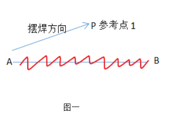

程序编写

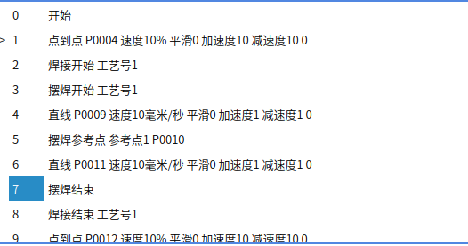

指令含义

第一行：焊接开始时的安全点；

第二行：开始焊接；

第三行：开始进行摆焊接；

第四-第六行：P9-P11为摆焊的轨迹，摆焊的轨迹则是通过摆焊方向来进行摆焊的；

第七行：摆焊完成；

第八行：焊接完成；

第九行：焊接完成后机器人移动的安全点位。

外部轴定点摆焊

1.  连接外部轴后，在设置-机器人参数-从站配置界面，点击机器人看外部轴是否已经连接成功

2.  外部轴连接成功后，在设置-外部轴参数界面标定外部轴和参数的设置。

参数设置

进入"弧焊/焊机设置"，设置焊机控制方式-模拟焊机。

进入"弧焊/焊接IO"，数字输入：起弧成功信号1-1，数字输出：起弧信号1-2，模拟输入焊接电流信号DIN1-1，焊接电压信号DIN1-2，模拟输出给定电流信号DOUT1-1，给定电压信号DOUT1-2。

进入"弧焊/电流电压匹配",设置电流第一行焊接电流填【1】，实际焊接电流【10】；设置电压第一行焊接电压填【1】，实际焊接电压填【10】。

进入"弧焊/焊接参数设置"，设置起弧参数：起弧电流【20】A起弧电压【10】起弧时间【1】焊接参数：焊接电流【50】A,焊接电压【20】V;收弧电流【28】A，收弧电压【15】V。

进入"弧焊/焊接装备设置"-基础功能：电弧检测时间【2】S，电弧检测确认时间【1】S。

进入"弧焊/手动操作"，打开焊接使能开关，打开手动起弧模式，设置手动点焊电流8A,点焊电压8V，最大时间2S。

进入"弧焊/焊接工艺/摆焊参数"，设置参数，如下图所示：

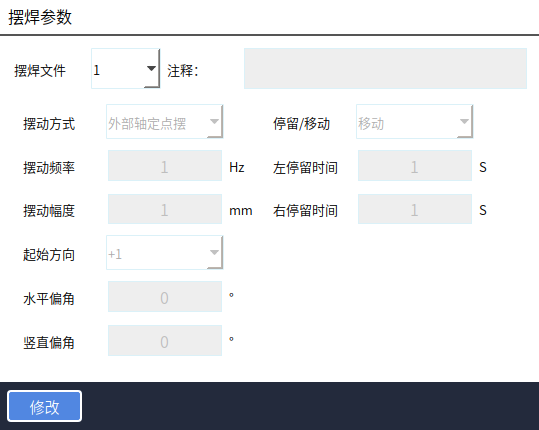

定点摆焊的轨迹

外部轴上标定两个点E1（外部轴旋转轴的起始点），E2（外部轴旋转轴的结束点）E1-E2确定了外部轴的转动方向，和实际焊接轨迹。

圆上红色线段表示在外部轴上摆焊的轨迹。

外部轴在转动的同时机器人进行定点摆焊，摆焊轨迹是下图红色曲线表示的部分。

若E1-E2机器人位移方向与外部轴同向则轨迹如图所示，若机器人位移方向垂直于外部轴方向则摆动方向会旋转90°。

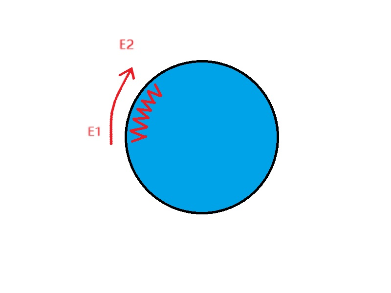

程序编写

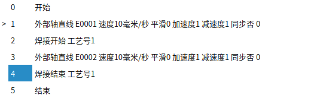

指令含义

第一行：插入外部轴直线指令(外部轴和机器人都需要移动)，确定机器人的坐标点位和外部轴点位，上图的E1点和A点；

第二行：开始执行焊接操作；

第三行：插入外部轴直线指令(外部轴和机器人都需要移动)，确定机器人的坐标点位和外部轴点位，上图的E2点B点，插入第二条外部轴直线指令时，需要打开同步功能（打开同步功能后外部轴在旋转的同时机器人在外部轴上摆焊）；

第四行：完成焊接。

外部轴协同摆焊

1.  连接外部轴后，在设置-机器人参数-从站配置界面，点击机器人看外部轴是否已经连接成功。

2.  外部轴连接成功后，在设置-外部轴参数界面标定外部轴和参数的设置。

程序编写

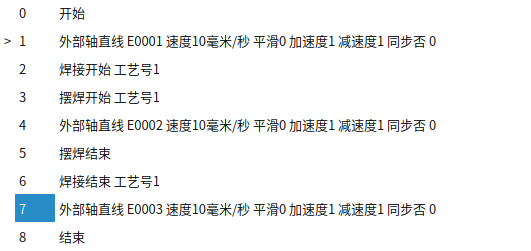

指令含义

第一行：插入外部轴直线指令(外部轴和机器人都需要移动)，确定机器人的坐标点位和外部轴点位为焊接起始点；

第二行：开始执行焊接操作；

第三行：开始执行摆焊；

第四行：插入第二条外部轴直线指令时，需要打开同步功能（打开同步功能后外部轴在旋转的同时机器人在外部轴上摆焊）；

第五行：完成摆焊；

第六行：完成焊接。

焊接适配多机

操作界面如图所示，机器人1-4都要支持焊接工艺。

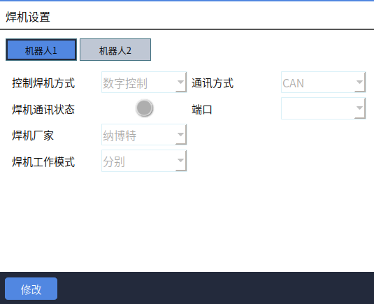

使用方法

1.  按实际需要添加机器人数目（例如四台机器人）；

2.  进入焊机设置界面设置焊机类型以及焊机各项参数（此界面只进行焊机的参数配置，其他焊接配置需切换到对应的机器人目录下进行设置）；

3.  按照机器人连接顺序，分别创建机器人1------机器人4对应的焊接程序以及设置对应的焊接参数；

4.  所有的机器人程序创建完毕后切到多机模式（切到运行模式后，点击上方机器人框，选择Robotall，如下图）；

5.  切换到多机模式后，点击启动，机器人1------机器人4同时运行焊接程序

### 寻位跟踪类

寻位跟踪类共有"激光追踪开始、激光追踪结束、寻位开始、静态寻位、动态寻位、寻位计算、寻位结束、寻位偏移、寻位偏移结束、电弧跟踪开始、电弧跟踪结束"等共11项指令，如下图所示：

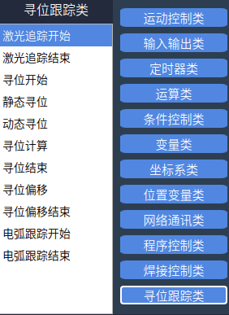

#### LASERTRACK_ON指令-激光追踪开始
<table border="1" style="border-collapse: collapse;">
<tr><td style="text-align: center; vertical-align: middle;" colspan="3">LASERTRACK_ON指令-激光追踪开始</td></tr>
<tr><td style="vertical-align: middle;" colspan="3">功能：该指令可以打开激光器</td></tr>
<tr><td style="vertical-align: middle;" colspan="3">参数界面 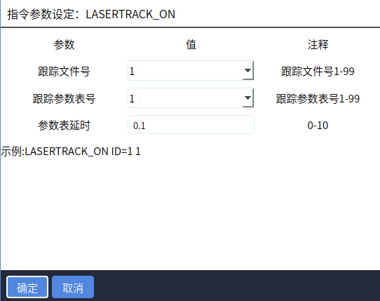</td></tr>
<tr><td style="vertical-align: top;">参数</td><td style="vertical-align: top;">值</td><td style="vertical-align: center;">注释</td></tr>
<tr><td style="vertical-align: top;">跟踪文件号</td><td style="vertical-align: center;">1-99</td><td style="vertical-align: center;">跟踪文件号</td></tr>
<tr><td style="vertical-align: top;">跟踪参数表号</td><td style="vertical-align: center;">1-99</td><td style="vertical-align: center;">跟踪参数表号</td></tr>
<tr><td style="vertical-align: top;">参数表延时</td><td style="vertical-align: center;">0-10</td><td style="vertical-align: center;">当激光器设置了新焊缝类型之后，生效的时间较长。此时可以设置这个参数，内部会延时等待一段时间。</td></tr>
</table>
 
### 17.8.2. LASERTRACK_OFF指令-激光追踪结束
<table border="1" style="border-collapse: collapse;">
<tr><td style="text-align: center; vertical-align: middle;" colspan="3">LASERTRACK_OFF指令-激光追踪结束</td></tr>
<tr><td style="vertical-align: middle;" colspan="3">功能：该指令可以关闭激光器（文件号要和激光追踪开始的文件号一样）</td></tr>
<tr><td style="vertical-align: middle;" colspan="3">参数界面 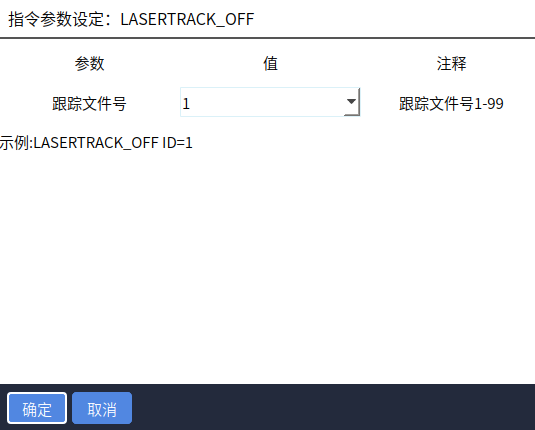</td></tr>
<tr><td style="vertical-align: top;">参数</td><td style="vertical-align: top;">值</td><td style="vertical-align: center;">注释</td></tr>
<tr><td style="vertical-align: top;">跟踪文件号</td><td style="vertical-align: center;">1-99</td><td style="vertical-align: center;">跟踪文件号</td></tr>
</table>
 

#### SEARCH_START指令-寻位开始
<table border="1" style="border-collapse: collapse;">
<tr><td style="text-align: center; vertical-align: middle;" colspan="3">SEARCH_START指令-寻位开始</td></tr>
<tr><td style="vertical-align: middle;" colspan="3">功能：该指令可以打开激光器</td></tr>
<tr><td style="vertical-align: middle;" colspan="3">参数界面 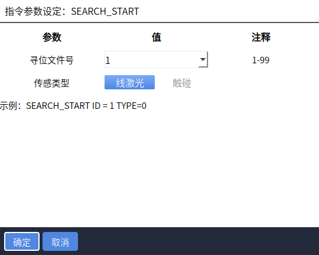</td></tr>
<tr><td style="vertical-align: top;">参数</td><td style="vertical-align: top;">值</td><td style="vertical-align: center;">注释</td></tr>
<tr><td style="vertical-align: top;">寻位文件号</td><td style="vertical-align: center;">1-99</td><td style="vertical-align: center;">寻位文件号</td></tr>
<tr><td style="vertical-align: top;">传感类型</td><td style="vertical-align: center;">线激光、触碰9</td><td style="vertical-align: center;">&nbsp;</td></tr>
</table>
 

#### SEARCH_STATIC指令-静态寻位
<table border="1" style="border-collapse: collapse;">
<tr><td style="text-align: center; vertical-align: middle;" colspan="3">SEARCH_STATIC指令-静态寻位</td></tr>
<tr><td style="vertical-align: middle;" colspan="3">功能：激光器找到的焊缝保存到一个变量中，方便以后进行计算或直接运动到点</td></tr>
<tr><td style="vertical-align: middle;" colspan="3">参数界面 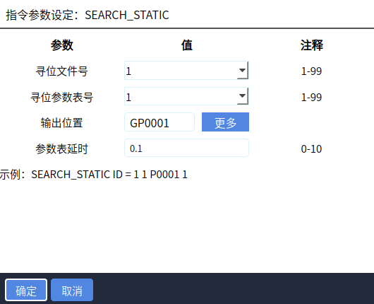</td></tr>
<tr><td style="vertical-align: top;">参数</td><td style="vertical-align: top;">值</td><td style="vertical-align: center;">注释</td></tr>
<tr><td style="vertical-align: top;">寻位文件号</td><td style="vertical-align: center;">1-99</td><td style="vertical-align: center;">寻位文件号</td></tr>
<tr><td style="vertical-align: center;">寻位参数表号</td><td style="vertical-align: center;">1-99</td><td style="vertical-align: center;">有8个变量可选 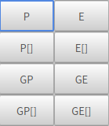</td></tr>
<tr><td style="vertical-align: center;">参考表延时</td><td style="vertical-align: center;">0-10</td><td style="vertical-align: center;">激光器设置了新焊缝类型之后，生效的时间较长。此时可以设置这个参数，内部会延时等待一段时间。</td></tr>
</table>
 

#### SEARCH_DYNIMIC指令-动态寻位
<table border="1" style="border-collapse: collapse;">
<tr><td style="text-align: center; vertical-align: middle;" colspan="3">SEARCH_DYNAMIC指令-动态寻位</td></tr>
<tr><td style="vertical-align: middle;" colspan="3">功能：激光器找到的焊缝保存到一个变量中，方便以后进行计算或直接运动到点</td></tr>
<tr><td style="vertical-align: middle;" colspan="3">参数界面 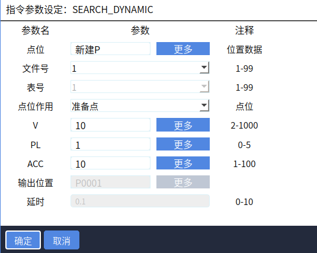</td></tr>
<tr><td style="vertical-align: top;">参数</td><td style="vertical-align: top;">值</td><td style="vertical-align: top;">注释</td></tr>
<tr><td style="vertical-align: center;">点位</td><td style="vertical-align: top;">&nbsp;</td><td style="vertical-align: top;">有10个变量可选 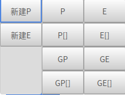</td></tr>
<tr><td style="vertical-align: top;">文件号</td><td style="vertical-align: center;">1-99</td><td style="vertical-align: top;">&nbsp;</td></tr>
<tr><td style="vertical-align: top;">表号</td><td style="vertical-align: center;">1-99</td><td style="vertical-align: top;">&nbsp;</td></tr>
<tr><td style="vertical-align: top;">点位作用</td><td style="vertical-align: top;">寻位开始点/准备点</td><td style="vertical-align: top;">&nbsp;</td></tr>
<tr><td style="vertical-align: top;">V</td><td style="vertical-align: top;">2-1000</td><td style="vertical-align: top;">速度</td></tr>
<tr><td style="vertical-align: top;">PL</td><td style="vertical-align: top;">0-5</td><td style="vertical-align: top;">平滑</td></tr>
<tr><td style="vertical-align: top;">ACC</td><td style="vertical-align: top;">1-100</td><td style="vertical-align: top;">加速度</td></tr>
<tr><td style="vertical-align: center;">输出位置</td><td style="vertical-align: top;">&nbsp;</td><td style="vertical-align: top;">当点位作用为"寻位开始点"时此参数可用</td></tr>
<tr><td style="vertical-align: center;">延时</td><td style="vertical-align: center;">0-10</td><td style="vertical-align: top;">当点位作用为"寻位开始点"时此参数可用</td></tr>
</table>
 

#### SEARCH_CALC指令-寻位计算

<table border="1" style="border-collapse: collapse;">
<tr><td style="text-align: center; vertical-align: middle;" colspan="3">SEARCH_CALC指令-寻位计算</td></tr>
<tr><td style="vertical-align: middle;" colspan="3">功能：选择寻位到的点进行计算投影点</td></tr>
<tr><td style="vertical-align: middle;" colspan="3">参数界面 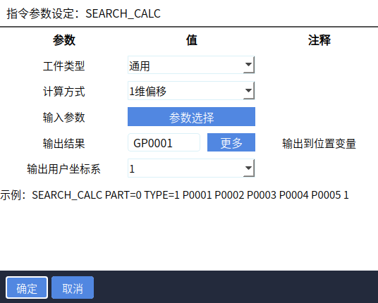</td></tr>
<tr><td style="vertical-align: top;">参数</td><td style="vertical-align: top;">值</td><td style="vertical-align: top;">注释</td></tr>
<tr><td style="vertical-align: center;">工件类型</td><td style="vertical-align: top;">通用/内外径</td><td style="vertical-align: top;">&nbsp;</td></tr>
<tr><td style="vertical-align: center;">计算方式</td><td style="vertical-align: top;">1、1维偏移 2、2维偏移 
3、2维偏移+旋转 
4、3点计算投影点 
5、3点计算用户坐标系 
6、4点确定两条直线计算交点 
7、4点计算用户坐标系 
8、向量计算 
9、平面两点计算新用户坐标系 
10、2点简易触碰寻位 
11、3维偏移+旋转 
12、4点计算平面用户坐标</td><td style="vertical-align: top;">&nbsp;</td></tr>
<tr><td style="vertical-align: top;">输入参数：点击后进入下图页面 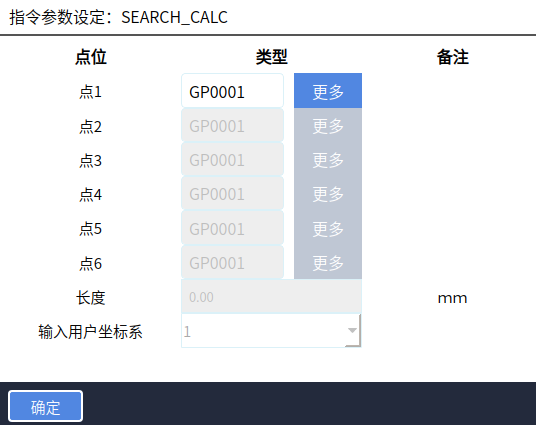</td><td style="vertical-align: top;">&nbsp;</td><td style="vertical-align: top;">&nbsp;</td></tr>
<tr><td style="vertical-align: center;">输出结果</td><td style="vertical-align: top;">&nbsp;</td><td style="vertical-align: top;">有4个变量可选 </td></tr>
<tr><td style="vertical-align: top;">输出用户坐标系</td><td style="vertical-align: top;">1-999</td><td style="vertical-align: top;">速度</td></tr>
</table>
 

#### SEARCH_END指令-寻位结束
<table border="1" style="border-collapse: collapse;">
<tr><td style="text-align: center; vertical-align: middle;" colspan="3">SEARCH_END指令-寻位结束</td></tr>
<tr><td style="vertical-align: middle;" colspan="3">功能：关闭电弧信号（文件号要和开始一样）</td></tr>
<tr><td style="vertical-align: middle;" colspan="3">参数界面 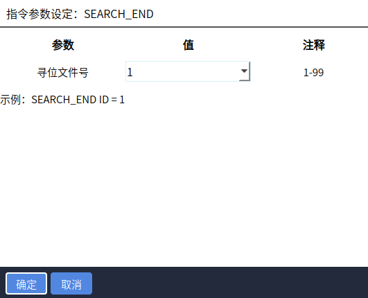</td></tr>
<tr><td style="vertical-align: top;">参数</td><td style="vertical-align: top;">值</td><td style="vertical-align: top;">注释</td></tr>
<tr><td style="vertical-align: top;">寻位文件号</td><td style="vertical-align: top;">1-99</td><td style="vertical-align: top;">&nbsp;</td></tr>
</table>
 

#### SEARCH_OFFSET指令-寻位偏移
<table border="1" style="border-collapse: collapse;">
<tr><td style="text-align: center; vertical-align: middle;" colspan="3">SEARCH_OFFSET指令-寻位偏移</td></tr>
<tr><td style="vertical-align: middle;" colspan="3">功能：偏移是在大量工件焊接时使用偏移指令来补偿误差，单点至四点偏移有不同的用法，根据实际情况而定</td></tr>
<tr><td style="vertical-align: middle;" colspan="3">参数界面 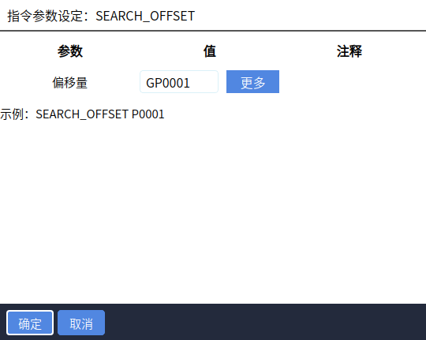</td></tr>
<tr><td style="vertical-align: top;">参数</td><td style="vertical-align: top;">值</td><td style="vertical-align: top;">注释</td></tr>
<tr><td style="vertical-align: top;">偏移量</td><td style="vertical-align: top;">&nbsp;</td><td style="vertical-align: top;">有两个变量可选择 </td></tr>
</table>
 

#### SEARCH_OFFSETEND指令-寻位偏移结束
<table border="1" style="border-collapse: collapse;">
<tr><td style="text-align: center; vertical-align: middle;" colspan="3">SEARCH_OFFSETEND指令-寻位偏移结束</td></tr>
<tr><td style="vertical-align: middle;" colspan="3">功能：停止补偿误差计算</td></tr>
<tr><td style="vertical-align: middle;" colspan="3">参数界面 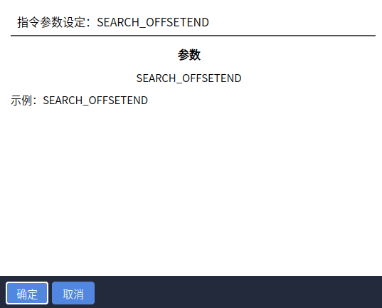</td></tr>
</table>
 

#### ARCTRACKON指令-电弧跟踪开始
<table border="1" style="border-collapse: collapse;">
<tr><td style="text-align: center; vertical-align: middle;" colspan="3">ARCTRACKON指令-电弧跟踪开始</td></tr>
<tr><td style="vertical-align: middle;" colspan="3">功能：角焊缝以及V型坡口焊缝的摆焊轨迹纠偏，常用于机器人焊接工艺中的中厚板焊接，用以纠正大电流焊接过程中导致的工件形变和部分工件组对误差</td></tr>
<tr><td style="vertical-align: middle;" colspan="3">参数界面 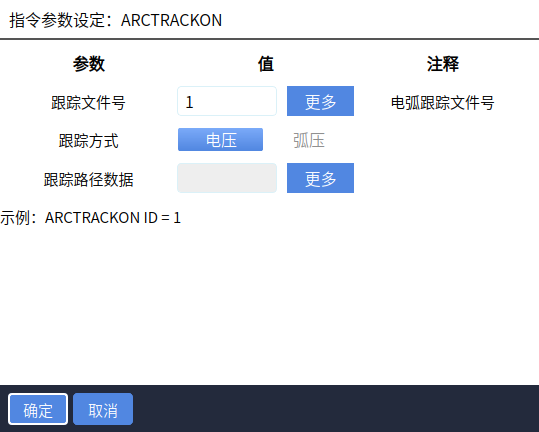</td></tr>
<tr><td style="vertical-align: top;">参数</td><td style="vertical-align: top;">值</td><td style="vertical-align: top;">注释</td></tr>
<tr><td style="vertical-align: center;">跟踪文件号</td><td style="vertical-align: top;">&nbsp;</td><td style="vertical-align: top;">分为手填和变量两种，变量有4种选择 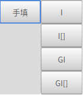</td></tr>
<tr><td style="vertical-align: top;">跟踪方式</td><td style="vertical-align: top;">电压/弧压</td><td style="vertical-align: top;">&nbsp;</td></tr>
<tr><td style="vertical-align: center;">跟踪路径数据</td><td style="vertical-align: top;">&nbsp;</td><td style="vertical-align: top;">可以选择手填、不使用以及填写变量等三种方式，变量有4种选择 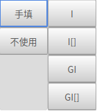</td></tr>
</table>
 

#### ARCTRACKOFF指令-电弧跟踪结束

<table border="1" style="border-collapse: collapse;">
<tr><td style="text-align: center; vertical-align: middle;" colspan="3">ARCTRACKOFF指令-电弧跟踪结束</td></tr>
<tr><td style="vertical-align: middle;" colspan="3">功能：停止纠正误差</td></tr>
<tr><td style="vertical-align: middle;" colspan="3">参数界面 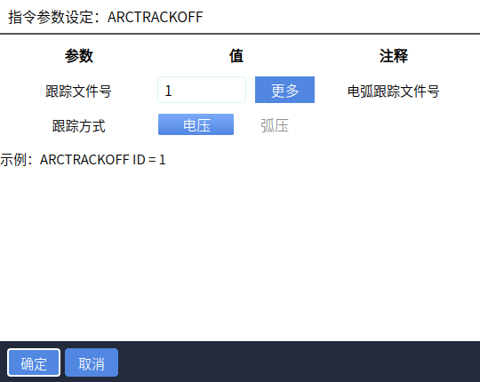</td></tr>
<tr><td style="vertical-align: top;">参数</td><td style="vertical-align: top;">值</td><td style="vertical-align: top;">注释</td></tr>
<tr><td style="vertical-align: center;">跟踪文件号</td><td style="vertical-align: top;">&nbsp;</td><td style="vertical-align: top;">分为手填和变量两种，变量有4种选择 </td></tr>
<tr><td style="vertical-align: top;">跟踪方式</td><td style="vertical-align: top;">电压/弧压</td><td style="vertical-align: top;">&nbsp;</td></tr>
</table>
   

### 程序控制类

位置控制类共有"开启线程、退出线程、暂停运行、继续运行、停止运行、重新运行、线程状态"等7项指令

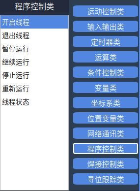

#### PTHREAD_START-开启线程

格式：PTHREAD_START【指令名】\[\$测试\$\]【开启的后台作业文件】GLOBAL,LOCAL【全局后台，局部后台】。

功能：开启全局后台或者局部后台任务。

参数：

<table border="1" style="border-collapse: collapse;">
<tr><td style="text-align: center; vertical-align: middle;">类型</td><td style="vertical-align: middle;">全局后台，局部后台</td></tr>

<tr><td style="vertical-align: center;">后台任务</td><td style="vertical-align: top;">当选择全局后台类型时,可以选择全局后台建立的作业文件  当选择局部后台类型时,可以选择局部后台建立的作业文件</td></tr>
</table>
示例：

1.  NOP

2.  TIMER T=1

3.  PTHREAD_START\[TEST\]GLOBAL

4.  MOVL P0001 V=10mm/s PL=0 ACC=10 DEC=10 0

5.  END

示例说明：在前台开启全局后台作业文件TEST。

#### PTHREAD_END-退出线程

格式：PTHREAD_END【指令名】\[\$测试\$\]【退出运行的作业文件名】GLOBAL,LOCAL【全局后台，局部后台】。

功能：关闭已经开启的后台任务。

参数：

<table border="1" style="border-collapse: collapse;">
<tr><td style="text-align: center; vertical-align: middle;">类型</td><td style="vertical-align: middle;">全局后台，局部后台</td></tr>
<tr><td style="text-align: center; vertical-align: middle;">后台任务</td><td style="vertical-align: middle;">退出已经开启的局部或者全局后台的作业文件</td></tr>
</table>

注意事项：退出线程指令只可以退出在前台已经开启的作业文件。

例如：开启全局后台的作业任务是\[TEST\],那在退出线程时选择全局后台的作业任务是\[TEST1\]，在执行退出线程指令时全局后台的作业任务是\[TEST\]无法退出运行。

示例：

1.  NOP

2.  TIMER T=1

3.  PTHREAD_START\[TEST\]GLOBAL

4.  MOVL P0001 V=10mm/s PL=0 ACC=10 DEC=10 0

5.  PTHREAD_END\[TEST\]GLOBAL

6.  END

示例说明：

程序运行到第1行时开启全局后台作业文件TEST，运行到第5行时退出全局后台作业文件TEST的运行。

#### PAUSERUN-暂停运行

格式：PAUSERUN【指令名】ALL,MAIN【暂停运行的类型】。

功能：暂停主程序和局部后台程序运行。
<table border="1" style="border-collapse: collapse;">
<tr><td style="text-align: center; vertical-align: middle;">类型</td><td style="vertical-align: middle;">全部：暂停开启的局部后台任务和主程序，开启的全局后台任务不会暂停  例如：全局后台任务开启，运行到暂停运行指令时，全局后台的任务依然正常运行，不会暂停  
主程序：暂停运行的主程序，开启的后台任务不会暂停
  局部后台：暂停开启的局部后台任务，运行的主程序不会暂停</td></tr>
<tr><td style="vertical-align: top;">程序</td><td style="vertical-align: top;">选择全部和主程序时，输入框置灰  当类型为局部后台，选择需要暂停运行的后台程序</td></tr>
</table>
示例：

1.  NOP

2.  TIMER T=1

3.  PTHREAD_START\[TEST\]LOCAL

4.  PTHREAD_START\[TEST1\]GLOBAL

5.  MOVL P0001 V=10mm/s PL=0 ACC=10 DEC=10 0

6.  PAUSERUN ALL

7.  END

示例说明：程序运行到第3行，第4行时开启了局部和全局后台任务，运行到第6行暂停运行指令时，开启的局部后台任务和主程序暂停运行，全局后台任务正常运行。

#### CONTINUERUN-继续运行

格式：CONTINUERUN【指令名】MAIN、LOCAL【暂停运行的程序类型】。

功能:继续运行已暂停的主程序或者局部后台程序。

参数：
<table border="1" style="border-collapse: collapse;">
<tr><td style="text-align: center; vertical-align: middle;">类型</td><td style="vertical-align: middle;">主程序：继续运行暂停的主程序，已经被暂停的后台程序不会继续运行  局部后台：运行暂停的局部后台程序</td></tr>
<tr><td style="vertical-align: top;">程序</td><td style="vertical-align: top;">选择主程序时输入框置灰，选择局部后台时可以选择继续运行的后台程序</td></tr>
</table>
示例：

1.  NOP

2.  TIMER T=1

3.  PTHREAD_START\[TEST\]LOCAL

4.  MOVL P0001 V=10mm/s PL=0 ACC=10 DEC=10 0

5.  PAUSERUN ALL

6.  TIMER T=1

7.  CONTINUERUN MAIN

8.  MOVL P0002 V=10mm/s PL=0 ACC=10 DEC=10 0

9.  END

示例说明：程序在运行时开启了局部后台程序，运行到第5行指令时，主程序和局部后台程序被暂停，运行到第7行指令时被暂停的主程序继续运行，局部后台程序依然暂停。

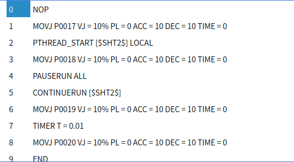

特别说明：如果继续运行指令选择的程序类型是局部后台，如果插入了暂停运行指令当程序运行到暂停运行指令时，此时伺服状态为暂停，然后点击示教器上的【启动】，执行继续运行指令，现在的执行逻辑是主程序和局部后台的程序都会继续运行。

#### STOPRUN-停止运行

功能：停止运行所有程序。

#### RESTARTRUN-重新运行

功能：重新运行已停止的程序。

#### WINDOW-弹窗指令

功能：弹出所填写的提示内容窗口，显示按钮数量为选项数量，将点击按钮（选项）的值保存到局部整型变量里面。

#### PTHREAD_STATE-线程状态

功能:插入线程指令可以查看当前所执行的线程程序的状态，停止等于1，暂停等于2，运行等于3。

参数说明：

类型：可以选择局部后台、全局后台或者主程序。

后台任务：后台任务名.

存入变量类型：例如选择的变量名是GI001,在开启线程后，GI001的值会随着状态发生变化。停止GI001=1，暂停GI001=2，运行GI001=3。

使用范例:PTHREAD_STATE\[程序文件名\] GINT GI001=0
 
## 常见问题解答 (QA)

<table border="1" style="border-collapse: collapse; width: 100%;">
<tr><th style="background-color: #d3d3d3; text-align: center; padding: 10px;">问题</th><th style="background-color: #d3d3d3; text-align: center; padding: 10px;">答案</th></tr>
<tr><td style="padding: 10px; vertical-align: middle; text-align: left;">如何进行系统版本升级？</td><td style="padding: 10px; vertical-align: top;">在示教器的USB口插入U盘，在U盘根目录下放入需要升级的程序压缩包，点击"设置-版本升级-检测升级"，选择程序后点击【确定】进行二次确认后开始升级。</td></tr>
<tr><td style="padding: 10px; vertical-align: middle; text-align: left;">如何修改系统时间？</td><td style="padding: 10px; vertical-align: top;">进入"设置-时间设置"页面，点击【修改】按钮，选中需要修改的时间项（年份、月份、日期、小时、分钟），上下选择至需要的值后点击【保存】。</td></tr>
<tr><td style="padding: 10px; vertical-align: middle; text-align: left;">如何修改IP地址？</td><td style="padding: 10px; vertical-align: top;">进入"设置-IP设置"页面，点击"连接IP"、"修改示教器IP"、"修改示教器网关"对应的【修改】按钮，输入新的IP地址后点击【保存】。示教器IP修改后需要重启系统生效，连接IP和控制器IP修改后立即生效。</td></tr>
<tr><td style="padding: 10px; vertical-align: middle; text-align: left;">外部轴有哪些类型？</td><td style="padding: 10px; vertical-align: top;">外部轴类型包括：直线单轴、直线双轴、直线三轴、旋转单轴、旋转双轴。直线轴用于地轨实现长距离移动，旋转轴用于翻转台或旋转台。</td></tr>
<tr><td style="padding: 10px; vertical-align: middle; text-align: left;">如何进行外部轴标定？</td><td style="padding: 10px; vertical-align: top;">进入"设置-外部轴参数-外部轴标定"，点击对应外部轴组的标定按钮进入标定界面。根据外部轴类型按照相应的标定步骤进行操作，最后点击计算完成标定。</td></tr>
<tr><td style="padding: 10px; vertical-align: middle; text-align: left;">如何设置外部轴零点位置？</td><td style="padding: 10px; vertical-align: top;">进入"设置-外部轴参数-零点位置"，可以单独设置某个轴为零点，或将所有关节设为零点，也可以将外部轴移至零点位置。</td></tr>
<tr><td style="padding: 10px; vertical-align: middle; text-align: left;">工具手标定有哪些方式？</td><td style="padding: 10px; vertical-align: top;">工具手标定方式包括：6点标定、7点标定、12点标定、15点标定、20点标定。不同标定方式需要不同数量的标定点，精度也不同。</td></tr>
<tr><td style="padding: 10px; vertical-align: middle; text-align: left;">如何进行系统备份？</td><td style="padding: 10px; vertical-align: top;">将U盘插入示教器USB口，点击"设置-版本升级-系统备份"，系统会自动备份到U盘根目录。备份内容包括示教器配置文件和控制器配置文件。</td></tr>
<tr><td style="padding: 10px; vertical-align: middle; text-align: left;">如何恢复出厂设置？</td><td style="padding: 10px; vertical-align: top;">进入"设置-系统设置-更多设置"，点击【恢复出厂设置】按钮，选择需要清除的配置文件类型，点击【确定】进行二次确认后执行恢复出厂设置。注意：此操作会清空配置文件，请谨慎操作！</td></tr>
<tr><td style="padding: 10px; vertical-align: middle; text-align: left;">机器人有哪几种运行状态？</td><td style="padding: 10px; vertical-align: top;">机器人运行状态包括：停止、就绪、运行、报错四种状态。通过"伺服准备"按键可切换"就绪、停止"两种状态，通过上电使能按键可以进行"就绪、运行"状态的切换。</td></tr>
<tr><td style="padding: 10px; vertical-align: middle; text-align: left;">焊接使能状态如何判断？</td><td style="padding: 10px; vertical-align: top;">焊接使能状态通过"有效"图标显示：有效时焊接使能开，背景色绿色；无效时焊接使能关，背景色红色。</td></tr>
<tr><td style="padding: 10px; vertical-align: middle; text-align: left;">碰撞检测状态有哪些？</td><td style="padding: 10px; vertical-align: top;">碰撞检测状态通过"碰撞"图标显示：黄色表示屏蔽防碰撞中，红色表示碰撞触发中，绿色表示未触发碰撞。</td></tr>
<tr><td style="padding: 10px; vertical-align: middle; text-align: left;">点动模式有哪几种？</td><td style="padding: 10px; vertical-align: top;">点动模式共有三种：拖动、点动、寸动。可以通过界面上的"点动"选项进行切换。</td></tr>
<tr><td style="padding: 10px; vertical-align: middle; text-align: left;">坐标系有哪几种？</td><td style="padding: 10px; vertical-align: top;">坐标系包括：关节坐标系、直角坐标系、工具坐标系、用户坐标系。可以通过界面上的坐标系图标进行切换。</td></tr>
<tr><td style="padding: 10px; vertical-align: middle; text-align: left;">如何设置焊接参数？</td><td style="padding: 10px; vertical-align: top;">进入"弧焊-焊接参数设置"，可以设置焊接电流、电压、送丝速度、焊接速度等参数。也可以通过ARCSET指令进行焊接设置。</td></tr>
<tr><td style="padding: 10px; vertical-align: middle; text-align: left;">MOVJ和MOVL指令有什么区别？</td><td style="padding: 10px; vertical-align: top;">MOVJ是点到点运动指令，机器人以最快路径移动到目标点；MOVL是直线运动指令，机器人以直线路径移动到目标点。</td></tr>
<tr><td style="padding: 10px; vertical-align: middle; text-align: left;">如何使用ARCON和ARCOFF指令？</td><td style="padding: 10px; vertical-align: top;">ARCON指令用于开始焊接，ARCOFF指令用于结束焊接。在程序中插入ARCON指令后，机器人开始执行焊接操作；插入ARCOFF指令后，机器人停止焊接。</td></tr>
<tr><td style="padding: 10px; vertical-align: middle; text-align: left;">变量有哪些类型？</td><td style="padding: 10px; vertical-align: top;">变量类型包括：局部整数型（INT）、局部浮点型（DOUBLE）、局部布尔型（BOOL）、局部字符型（STRING）、全局整数型（GINT）、全局浮点型（GDOUBLE）等。</td></tr>
<tr><td style="padding: 10px; vertical-align: middle; text-align: left;">如何进行远程程序设置？</td><td style="padding: 10px; vertical-align: top;">进入"远程程序设置"，可以设置远程参数、远程I/O功能、远程状态提示等。远程模式允许通过外部设备控制机器人运行程序。</td></tr>
<tr><td style="padding: 10px; vertical-align: middle; text-align: left;">如何使用多线程功能？</td><td style="padding: 10px; vertical-align: top;">使用PTHREAD_START指令开启线程（局部后台或全局后台），PTHREAD_END指令退出线程，PTHREAD_STATE指令查看线程状态。可以同时运行主程序和后台程序。</td></tr>
<tr><td style="padding: 10px; vertical-align: middle; text-align: left;">如何暂停和继续运行程序？</td><td style="padding: 10px; vertical-align: top;">使用PAUSERUN指令暂停程序运行，CONTINUERUN指令继续运行程序。可以暂停主程序、局部后台程序或全部程序。</td></tr>
<tr><td style="padding: 10px; vertical-align: middle; text-align: left;">如何进行点焊操作？</td><td style="padding: 10px; vertical-align: top;">使用SPOTWELD指令进行点焊操作。可以设置点焊时间、焊接距离等参数，实现定点焊接功能。</td></tr>
<tr><td style="padding: 10px; vertical-align: middle; text-align: left;">如何进行鱼鳞焊操作？</td><td style="padding: 10px; vertical-align: top;">使用FSWELDON指令开始鱼鳞焊，FSWELDOFF指令结束鱼鳞焊。鱼鳞焊是一种特殊的焊接工艺，用于实现鱼鳞状焊缝。</td></tr>
<tr><td style="padding: 10px; vertical-align: middle; text-align: left;">如何进行寻位操作？</td><td style="padding: 10px; vertical-align: top;">可以使用SEARCH_START指令开始寻位，SEARCH_STATIC指令进行静态寻位，SEARCH_DYNIMIC指令进行动态寻位，SEARCH_CALC指令进行寻位计算，SEARCH_END指令结束寻位。</td></tr>
<tr><td style="padding: 10px; vertical-align: middle; text-align: left;">如何进行位置变量操作？</td><td style="padding: 10px; vertical-align: top;">可以使用READPOS读取点位，POSADD点位加，POSSUB点位减，POSSET点位改，COPYPOS复制点位等指令对位置变量进行操作。</td></tr>
<tr><td style="padding: 10px; vertical-align: middle; text-align: left;">如何进行数学运算？</td><td style="padding: 10px; vertical-align: top;">可以使用ADD加法、SUB减法、MUL乘法、DIV除法、MOD模运算、SIN正弦、COS余弦、ATAN反正切等指令进行数学运算。</td></tr>
<tr><td style="padding: 10px; vertical-align: middle; text-align: left;">如何进行逻辑判断？</td><td style="padding: 10px; vertical-align: top;">可以使用IF如果、ELSEIF否则如果、ELSE否则、WHILE循环、UNTIL直到等指令进行逻辑判断和循环控制。</td></tr>
<tr><td style="padding: 10px; vertical-align: middle; text-align: left;">如何进行子程序调用？</td><td style="padding: 10px; vertical-align: top;">使用CALL指令调用子程序，RETURN指令退出子程序。也可以使用CALL_LUAFILE调用LUA文件，CALL_LUASTRING调用Lua语句。</td></tr>
<tr><td style="padding: 10px; vertical-align: middle; text-align: left;">如何查看日志信息？</td><td style="padding: 10px; vertical-align: top;">进入"日志"页面，可以查看系统运行日志、错误日志等信息，帮助诊断系统问题。</td></tr>
<tr><td style="padding: 10px; vertical-align: middle; text-align: left;">如何进行碰撞检测设置？</td><td style="padding: 10px; vertical-align: top;">使用DETECTCOLLISION_SET指令设置碰撞检测参数，DETECTCOLLISION_RESET指令复位碰撞检测参数。也可以在"状态-碰撞检测"中查看碰撞状态。</td></tr>
<tr><td style="padding: 10px; vertical-align: middle; text-align: left;">如何进行双机协作？</td><td style="padding: 10px; vertical-align: top;">使用MOVLDOUBLE双机直线、MOVCDOUBLE双机圆弧、MOVCADOUBLE双机整圆等指令进行双机协作操作。需要配置双机模式和相应的参数。</td></tr>
<tr><td style="padding: 10px; vertical-align: middle; text-align: left;">如何使用外部轴随动功能？</td><td style="padding: 10px; vertical-align: top;">使用EXTMOV指令实现外部轴随动，GEARIN指令设置电子齿轮。外部轴随动可以让外部轴与机器人本体协调运动。</td></tr>
<tr><td style="padding: 10px; vertical-align: middle; text-align: left;">如何使用弹窗指令？</td><td style="padding: 10px; vertical-align: top;">使用WINDOW指令可以弹出提示内容窗口，显示按钮数量为选项数量，将点击按钮的值保存到局部整型变量里面，实现人机交互。</td></tr>
<tr><td style="padding: 10px; vertical-align: middle; text-align: left;">如何进行计时操作？</td><td style="padding: 10px; vertical-align: top;">使用CLKSTART指令开始计时，CLKSTOP指令结束计时，CLKRESET指令复位计时。可以用于程序执行时间测量等功能。</td></tr>
<tr><td style="padding: 10px; vertical-align: middle; text-align: left;">如何进行定点移动？</td><td style="padding: 10px; vertical-align: top;">使用SAMOV指令进行定点移动。可以让机器人移动到预设的固定位置，常用于回原点等操作。</td></tr>
<tr><td style="padding: 10px; vertical-align: middle; text-align: left;">如何进行门型运动？</td><td style="padding: 10px; vertical-align: top;">使用MOVARCH指令进行门型运动。门型运动可以让机器人按照门形路径移动，避免碰撞障碍物。</td></tr>
<tr><td style="padding: 10px; vertical-align: middle; text-align: left;">如何使用拖拽示教功能？</td><td style="padding: 10px; vertical-align: top;">使用DRAG_TRAJECTORY指令进行拖拽示教。可以通过手动拖动机器人来生成运动轨迹，简化示教过程。</td></tr>
<tr><td style="padding: 10px; vertical-align: middle; text-align: left;">如何进行网络通讯？</td><td style="padding: 10px; vertical-align: top;">可以使用SENDMSG发送数据、PARSEMSG解析数据、READCOMM读取数据、OPENMSG打开数据、CLOSEMSG关闭数据、PRINTMSG输出信息等指令进行网络通讯。</td></tr>
<tr><td style="padding: 10px; vertical-align: middle; text-align: left;">如何进行自动备份设置？</td><td style="padding: 10px; vertical-align: top;">进入"设置-自动备份"，可以设置控制器自动备份功能。备份内容包括程序和参数，最大备份10个文件，按前提、版本、时间命名。</td></tr>
<tr><td style="padding: 10px; vertical-align: middle; text-align: left;">如何进行U盘备份和还原？</td><td style="padding: 10px; vertical-align: top;">将U盘插入示教器USB口，点击"设置-版本升级-U盘备份"进行系统备份，点击"系统还原"进行系统还原。备份文件保存在U盘根目录。</td></tr>
<tr><td style="padding: 10px; vertical-align: middle; text-align: left;">清多圈值有什么注意事项？</td><td style="padding: 10px; vertical-align: top;">请务必谨慎操作，该操作会导致机器人编码器值被清零，导致原厂保存的零点数据清零！可能会导致机器人丢失精度、机器人无法正常运行、曾经建立的点位无法运行。</td></tr>
<tr><td style="padding: 10px; vertical-align: middle; text-align: left;">如何进行方向校准？</td><td style="padding: 10px; vertical-align: top;">进入"设置-外部轴参数-外部轴标定-方向校准"，通过标定锥进行方向校准，计算出X、Y、Z三个方向的比例系数，消除地轨安装误差。</td></tr>
<tr><td style="padding: 10px; vertical-align: middle; text-align: left;">如何使用WVOFF和WVON指令？</td><td style="padding: 10px; vertical-align: top;">WVON指令用于开始摆焊，WVOFF指令用于结束摆焊。WVSET指令用于设置摆焊参数，包括摆焊类型、摆焊幅度、摆焊频率等。</td></tr>
<tr><td style="padding: 10px; vertical-align: middle; text-align: left;">如何使用CIL指令进行相贯线焊接？</td><td style="padding: 10px; vertical-align: top;">使用CIL指令进行相贯线焊接。相贯线焊接用于管件等复杂几何形状的焊接，需要设置相应的相贯线参数。</td></tr>
<tr><td style="padding: 10px; vertical-align: middle; text-align: left;">如何使用激光追踪功能？</td><td style="padding: 10px; vertical-align: top;">使用LASERTRACK_ON指令开始激光追踪，LASERTRACK_OFF指令结束激光追踪。激光追踪可以实时跟踪焊缝位置，提高焊接精度。</td></tr>
<tr><td style="padding: 10px; vertical-align: middle; text-align: left;">如何使用电弧跟踪功能？</td><td style="padding: 10px; vertical-align: top;">使用ARCTRACKON指令开始电弧跟踪，ARCTRACKOFF指令结束电弧跟踪。电弧跟踪通过检测电弧参数来调整焊接路径。</td></tr>
<tr><td style="padding: 10px; vertical-align: middle; text-align: left;">如何切换用户坐标系？</td><td style="padding: 10px; vertical-align: top;">使用SWITCHUSER指令切换用户坐标，TOOLFRAME_SET指令修改工具坐标。可以在界面上选择不同的工具手编号和用户编号。</td></tr>
<tr><td style="padding: 10px; vertical-align: middle; text-align: left;">如何进行轨迹偏移？</td><td style="padding: 10px; vertical-align: top;">使用TOFFSETON指令开始轨迹偏移，TOFFSETOFF指令结束轨迹偏移。轨迹偏移可以对焊接轨迹进行整体偏移调整。</td></tr>
<tr><td style="padding: 10px; vertical-align: middle; text-align: left;">如何进行送丝操作？</td><td style="padding: 10px; vertical-align: top;">使用FEEDWIRE指令进行送丝操作。可以设置送丝时间，在焊接开始或结束后在设置的时间内送丝，然后到达指定位置将焊丝剪掉。</td></tr>
<tr><td style="padding: 10px; vertical-align: middle; text-align: left;">如何使用ARCBUILTIN指令？</td><td style="padding: 10px; vertical-align: top;">使用ARCBUILTIN指令调用焊机内置工艺。焊机内置工艺提供了预定义的焊接工艺参数，简化了焊接参数设置。</td></tr>
<tr><td style="padding: 10px; vertical-align: middle; text-align: left;">用户权限有哪些级别？</td><td style="padding: 10px; vertical-align: top;">系统支持四种用户权限：操作员、技术员、管理员、厂家。不同权限对应不同的功能访问权限，可以通过界面上的用户图标查看当前登录用户。</td></tr>
</table>
